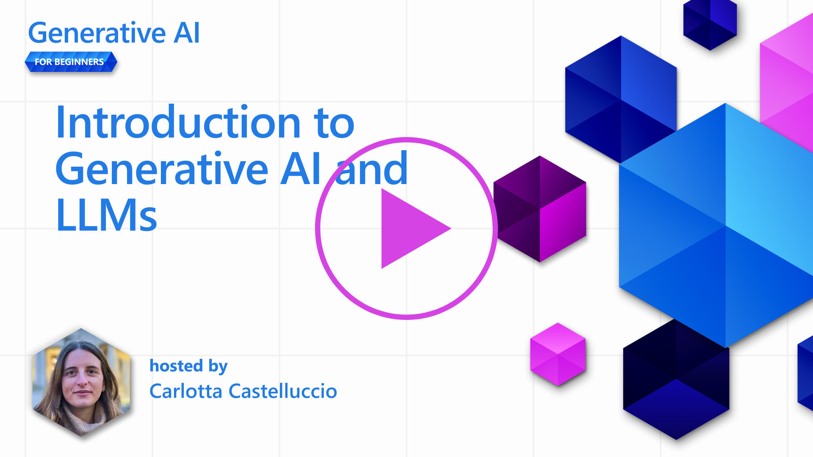
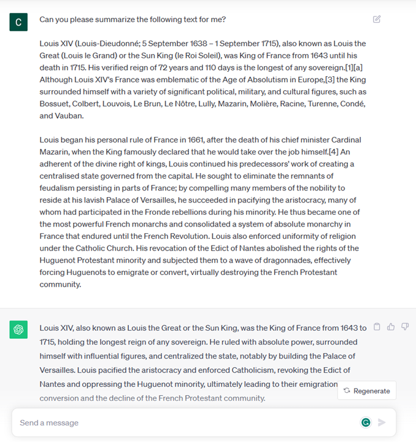
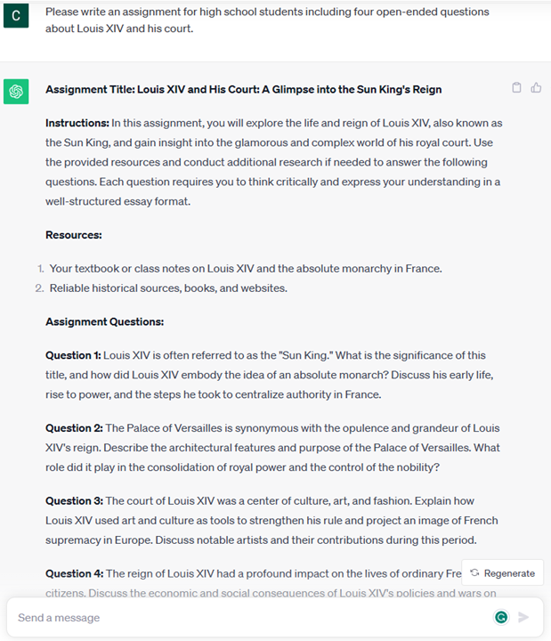

# 生成AIと大規模言語モデル入門

(https://youtu.be/vf_mZrn8ibc)

*このレッスンのビデオを見るには上の画像をクリックしてください。

生成AIとは、テキストや画像などのコンテンツを生成できる人工知能のことです。この技術が素晴らしいのは、AIを民主化し、自然言語で書かれた文章を入力するだけで、誰でもAIを使えるようにしたことです。JavaやSQLのような言語を学ぶ必要はなく、自然言語で書かれた文章を入力するだけで、AIモデルからの提案を受け取ることができるのだ。レポートを書いたり、理解したり、アプリケーションを書いたり、そのすべてが数秒でできるのです。

このカリキュラムでは、私たちのスタートアップがどのように生成AIを活用し、教育の世界で新しいシナリオを解き放つのか、また、その応用の社会的影響や技術の限界に関連する避けられない課題にどのように対処するのかを探ります。

## はじめに

このレッスンでは、以下を取り上げる：

* ビジネスシナリオの紹介：私たちのスタートアップのアイデアとミッション。
* 生成AIと、私たちがどのようにして現在の技術状況にたどり着いたか。
* 大規模な言語モデルの内部動作
* 大規模言語モデルの主な機能と実際の使用例。

## 学習目標

このレッスンを修了すると、以下のことが理解できるようになる：

* 生成AIとは何か、大規模言語モデルがどのように機能するか
* 教育シナリオを中心とした様々なユースケースで、大規模言語モデルをどのように活用できるか。

## シナリオ：私たちの教育スタートアップ 

生成的人工知能（AI）は、かつて不可能と考えられていたことの限界を押し広げ、AI技術の頂点を表しています。生成AIモデルにはいくつかの機能と応用があるが、このカリキュラムでは架空のスタートアップを通して、それがどのように教育に革命を起こしているかを探る。このスタートアップを*我々のスタートアップ*と呼ぶことにする。私たちのスタートアップは、次のような野心的なミッション・ステートメントを掲げ、教育分野で活動している。

> 世界規模で、学習におけるアクセシビリティを向上させ、教育への公平なアクセスを確保し、すべての学習者にニーズに応じてパーソナライズされた学習体験を提供する。

私たちのスタートアップ・チームは、現代の最も強力なツールのひとつである大規模言語モデル（LLM）を活用しなければ、この目標を達成できないと認識しています。

生成AIは、今日の学習・教育方法に革命をもたらすと期待されている。学生は、膨大な量の情報と例文を提供するバーチャル教師を24時間自由に利用でき、教師は革新的なツールを活用して学生を評価し、フィードバックを与えることができる。

モニターを見る5人の若い生徒たち - 画像はDALLE2による](../../images/students-by-DALLE2.png)

まず始めに、カリキュラムを通して使用する基本的な概念と用語を定義しておこう。

## なぜ生成AIが生まれたのか？

最近、生成AIモデルの発表によって異常なまでの誇大宣伝が行われているが、この技術は数十年かけて作られたものであり、最初の研究努力は60年代にまでさかのぼる。例えば、[OpenAI ChatGPT](https://openai.com/chatgpt)や[Bing Chat](https://www.microsoft.com/edge/features/bing-chat)が示すように、私たちは今、AIが人間の認知能力を持つ段階にいる。

少し話を戻すと、AIの最初のプロトタイプは、専門家のグループから抽出され、コンピュータに表現された知識ベースに依存する、タイプライターのチャットボットで構成されていた。知識ベースの回答は、入力テキストに現れるキーワードによってトリガーされた。
しかし、タイプライターのチャットボットを使ったこのようなアプローチでは、うまくスケールしないことがすぐに明らかになった。

### AIへの統計的アプローチ：機械学習

転機は90年代に訪れ、テキスト分析に統計的アプローチが適用された。これにより、明示的にプログラムされることなくデータからパターンを学習できる、機械学習という名前で知られる新しいアルゴリズムが開発された。このアプローチは、機械が人間の言語理解をシミュレートすることを可能にする。テキストとラベルのペアに対して統計モデルが学習され、未知の入力テキストを、メッセージの意図を表すあらかじめ定義されたラベルで分類することが可能になる。

### ニューラル・ネットワークと最新のバーチャル・アシスタント

最近では、より大量のデータとより複雑な計算を処理できるハードウェアの技術的進化がAI分野の研究を後押しし、ニューラルネットワークやディープラーニングアルゴリズムと呼ばれる高度な機械学習アルゴリズムの開発につながった。

ニューラルネットワーク（特にリカレント・ニューラル・ネットワーク：RNN）は自然言語処理を大幅に強化し、文中の単語の文脈を重視しながら、より意味のある方法でテキストの意味を表現することを可能にした。

これは、新世紀の最初の10年間に誕生したバーチャル・アシスタントの原動力となった技術であり、人間の言語を解釈し、ニーズを特定し、それを満たすためのアクションを実行することに非常に長けている。

### 現代の生成AI

こうして、ディープラーニングのサブセットともいえる生成AIが誕生した。

AI分野での数十年にわたる研究の後、*トランスフォーマー*と呼ばれる新しいモデル・アーキテクチャがRNNの限界を克服し、入力としてはるかに長いテキストのシーケンスを得ることができるようになった。トランスフォーマーは注意メカニズムに基づいており、モデルが受け取った入力に異なる重みを与え、テキストシーケンス内の順序に関係なく、最も関連性の高い情報が集中している場所に「より注意を払う」ことを可能にする。

最近の生成AIモデルのほとんどは、テキストの入力と出力を扱うため、ラージ・ランゲージ・モデル（LLM）としても知られている。書籍、記事、ウェブサイトなど多様なソースからの膨大なラベルなしデータで訓練されたこれらのモデルの興味深い点は、多種多様なタスクに適応し、創造性のかけらもない文法的に正しいテキストを生成できることだ。つまり、機械が入力テキストを「理解」する能力を信じられないほど高めただけでなく、人間の言葉でオリジナルの応答を生成する能力を可能にしたのだ。

## 大規模言語モデルはどのように機能するのか？

次の章では、さまざまなタイプの生成AIモデルを探りますが、今はOpenAIのGPT（Generative Pre-trained Transformer）モデルを中心に、大規模な言語モデルがどのように機能するか見てみましょう。

* **トークナイザー、テキストから数値へ**： 大規模言語モデルは入力としてテキストを受け取り、出力としてテキストを生成します。しかし、統計モデルであるため、テキスト列よりも数値の方がはるかにうまく機能します。そのため、モデルへのすべての入力は、コアモデルで使われる前にトークナイザーで処理されます。トークンとは、可変の文字数からなるテキストの塊のことで、トークナイザーの主な仕事は、入力をトークンの配列に分割することだ。そして、各トークンは、元のテキストチャンクの整数エンコーディングであるトークン・インデックスとマッピングされます。

* **出力トークンの予測**： 入力としてn個のトークンが与えられると（最大nはモデルによって異なる）、モデルは出力として1個のトークンを予測することができる。このトークンは次の反復の入力に組み込まれ、ウィンドウを拡大するパターンで、1つの（または複数の）文を答えとして得るという、より良いユーザー体験を可能にします。このため、ChatGPTで遊んだことがある人は、文の途中で止まっているように見えることがあることに気づいたかもしれません。

* **選択プロセス、確率分布**： 出力トークンは、現在のテキストシーケンスの後に出現する確率に従ってモデルによって選択されます。これは、モデルが、学習に基づいて計算された、すべての可能性のある「次のトークン」に対する確率分布を予測するからである。しかし、結果として得られた分布から、常に最も高い確率を持つトークンが選ばれるとは限らない。この選択にはある程度のランダム性が加えられており、モデルは非決定論的な振る舞いをする。このランダム性は、創造的思考のプロセスをシミュレートするために追加され、温度と呼ばれるモデルパラメータを使用して調整することができます。

## ラージ・ランゲージ・モデルをスタートアップが活用するには？

さて、大規模言語モデルの内部動作について理解を深めたところで、我々のビジネス・シナリオを念頭に置きながら、大規模言語モデルがうまくこなす最も一般的なタスクの実践例を見てみよう。
大規模言語モデルの主な機能は、*自然言語で書かれたテキスト入力から出発して、ゼロからテキストを生成すること*であると述べました。

しかし、どのようなテキスト入力と出力なのでしょうか？
ラージ・ランゲージ・モデルの入力はプロンプトと呼ばれ、出力はコンプリーションと呼ばれます。プロンプトとは何か、そしてプロンプトをどのように設計すればモデルを最大限に活用できるのか、これから深く掘り下げていきます。しかし今は、プロンプトには次のようなものがあるとだけ言っておこう：

* モデルから期待される出力のタイプを指定する**命令**。この命令には、いくつかの例や追加データを埋め込むこともあります。

    1. 非構造化データからの洞察の抽出とともに、記事、本、製品レビューなどの要約。
    
    。

      1.
    
    2. 記事、エッセイ、課題などの創造的なアイデアとデザイン。
    
    

      **質問**です。
    
* エージェントとの会話形式で尋ねられる**質問**。
  
。

  **テキストの塊**。

* テキストを完成させるためのチャンク。
   

* **コードの塊**

* **コード**の塊と、それを説明し文書化する依頼、または特定のタスクを実行するコードの一部を生成するように依頼するコメント。

 

上記の例は非常に単純であり、大規模言語モデルの能力を網羅的に示すものではありません。特に教育的な文脈に限定されないが、生成的AIを使用する可能性を示したいだけである。

また、生成AIモデルの出力は完璧ではなく、時にはモデルの創造性が逆に作用して、人間のユーザーが現実の神秘化と解釈できるような単語の組み合わせであったり、不快感を与えるような出力になることもある。生成AIは知的ではありません。少なくとも、批判的で創造的な推論や感情的な知能を含む、より包括的な知能の定義においては。決定論的でもありませんし、誤った参照、内容、発言などの捏造が正しい情報と組み合わされ、説得力のある自信に満ちた方法で提示される可能性があるため、信頼できるものではありません。以下のレッスンでは、これらすべての制限に対処し、それらを軽減するために何ができるかを見ていきます。

## 課題

あなたの課題は、[生成AI](https://en.wikipedia.org/wiki/Generative_artificial_intelligence)についてもっと読み、現在生成AIがない分野で、あなたが生成AIを追加する分野を特定することです。旧来の方法」と比べてどのように影響が違うのか、以前はできなかったことができるのか、より速くできるのか。あなたの夢のAIスタートアップがどのようなものか、300ワードで要約し、「問題」、「AIをどのように使うか」、「インパクト」、そしてオプションでビジネスプランのような見出しをつけて書いてください。

このタスクをこなしたなら、マイクロソフトのインキュベーターである[Microsoft for Startups Founders Hub](https://www.microsoft.com/startups)に応募する準備ができているかもしれない。Azure、OpenAI、メンタリング、その他多くのクレジットを提供している！

## ナレッジチェック

大規模言語モデルの真実とは？

1. 毎回全く同じ回答が返ってくる
1. 完璧に物事をこなし、数字の足し算が得意で、動作するコードを生成するなど。
1. 同じプロンプトを使用しているにもかかわらず、応答が異なる場合があります。また、テキストであれコードであれ、何かの初稿を出すのには最適です。しかし、結果を改善する必要があります。

A:3、LLMは非決定論的で、応答はさまざまですが、温度設定によってそのばらつきをコントロールすることができます。また、LLMが物事を完璧にこなしてくれることを期待してはいけません。LLMはあなたのために力仕事をしてくれるのですから、最初の試みはうまくいくことが多いのですが、徐々に改善していく必要があります。

## 素晴らしい仕事だ！旅を続ける 

このレッスンを終えたら、[Generative AI Learning collection](https://aka.ms/genai-collection)をチェックして、Generative AIの知識をレベルアップしていきましょう！

レッスン2では、[異なるLLMタイプの探索と比較](../../../02-exploring-and-comparing-different-llms/translations/ja/README.md)の方法を見ていきます！
