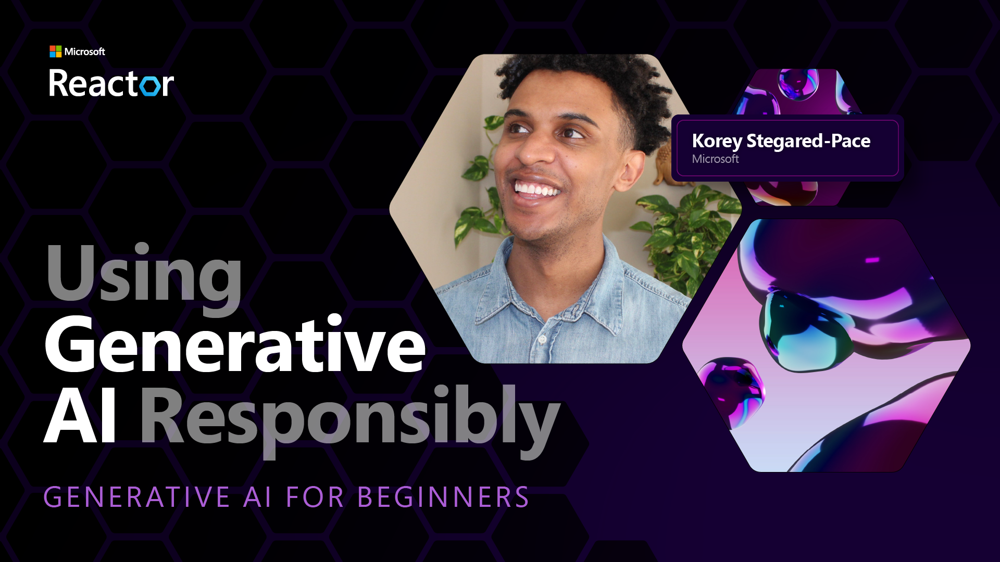
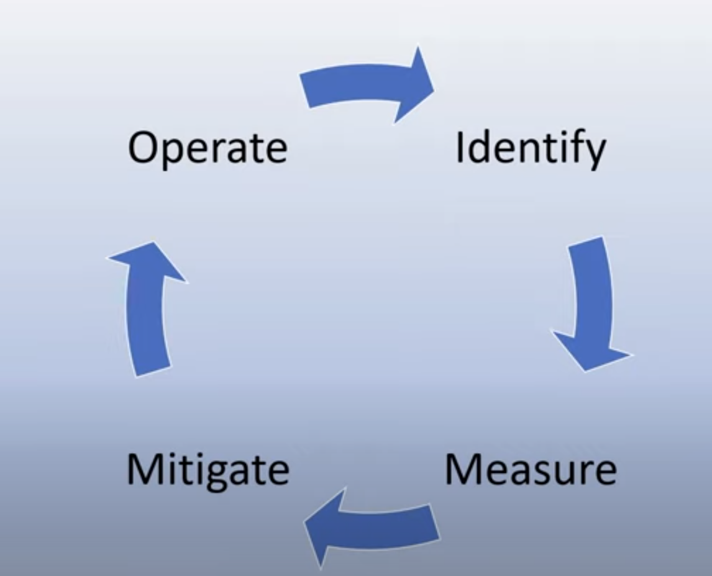

# Using Generative AI Responsibly 

 

**Video Coming Soon** 

## Introduction 

This lesson will cover:
- Why you should prioritize Responsible AI when building Generative AI applications.
- Core principles of Responsible AI and how they relate to Generative AI.
- How to put these Responsible AI principles into practice through strategy and tooling. 

## Learning Goals 

After completing this lesson you will know: 
- The importance of Responsible AI when building Generative AI applications. 
- When to think and apply the core principles of Responsible AI when building Generative AI applications. 
- What tools and strategies are available to you to put the concept of Responsible AI into practice.

## Responsible AI Principles 

The excitement of Generative AI has never been higher. This excitement has brought a lot of new developers, attention, and funding to this space. While this is very positive for anyone looking to build products and companies using Generative AI, it is also important we proceed responsibly. 

Throughout this course, we are focusing on building our startup and our AI education product. Let's look at the principles of Responsible AI and how they relate to our use of Generative AI in our products. 

## Why Should You Prioritise Responsible AI 

When building a product, taking a human-centric approach by keeping your user's best interest in mind leads to the best results. 

The uniqueness of Generative AI is its power to create helpful answers, information, guidance, and content for users. This can be done without many manual steps which can lead to very impressive results. Without proper planning and strategies, it can also unfortunately lead to some harmful results for your users, your product, and society as a whole. 

Let's look at some (but not all) of these potentially harmful results: 

### Hallucinations 

Hallucinations are a term used to describe when an LLM produces content that is either completely nonsensical or something we know is factually wrong based on other sources of information. 

Let's take for example we build a feature for our startup that allows students to ask historical questions to a model. A student asks the question `Who was the sole survivor of Titanic?`

The model produces a response like the one below:

_11zon.webp)

*(Source: https://flyingbisons.com)*

This is a very confident and thorough answer. Unfortunately, it is incorrect. Even with a minimal amount of research, one would discover there was more than one survivor of the Titanic survivor. For a student who is just starting to research this topic, this answer can be persuasive enough to not be questioned and treated as fact. 

With each iteration of any given LLM, we have seen performance improvements around minimizing hallucinations. Even with this improvement,  we as application builders and users still need to remain aware of these limitations. 

### Harmful Content 

We covered in the earlier section when an LLM produces incorrect or nonsensical responses.  Another risk we need to be aware of is when a model responds with harmful content. 

Harmful content can be defined as: 
- Providing instructions or encouraging self-harm or harm to certain groups 
- Hateful or demeaning content 
- Guiding planning any type of attack or violent acts
- Providing instructions on how to find illegal content or commit illegal acts 

For our startup, we want to make sure we have the right tools and strategies in place to prevent this type of content from being seen by students. 

### Lack of Fairness 

Fairness is defined as "ensuring that an AI system is free from bias and discrimination and that they treat everyone fairly and equally."  In the world of Generative AI, we want to ensure that exclusionary worldviews of marginalized groups are not reinforced by the model's output. 

These types of outputs are not only harmful to building positive product experiences for our users, but they also cause further societal harm. As application builders, we should always keep a wide and diverse user base in mind when building solutions with Generative AI. 

## How to Use Generative AI Responsibly 

Now that we have identified the importance of Responsible Generative AI, let's look at 4 steps we can take to build our AI solutions responsibly: 

### Measure Potential Harms 
In software testing, we test the expected actions of a user on an application. Similarly, testing a diverse set of prompts users are most likely going to use is a good way to measure potential harm. 

Since our startup is building an education product, it would be good to prepare a list of education-related prompts. This could be to cover a certain subject, historical facts, and prompts about student life. 

### Mitigate Potential Harms 
It is now time to find ways where we can prevent or limit the potential harm caused by the model and its responses. We can look at this in 4 different layers: 

**Model**

Choosing the right model for the right use case. Larger and more complex models like GPT-4 can cause more of a risk of harmful content when applied to smaller and more specific use cases. Using your training data to fine-tune also reduces the risk of harmful content. 

**Safety System**

A safety system is a set of tools and configurations on the platform serving the model that help mitigate harm. An example of this is the content filtering system on the Azure OpenAI service. Systems can also detect over usage and unwanted activity like requests from bots. 

**Metaprompt**

Metaprompts and grounding are ways we can direct or limit the model based on certain behaviors and information. This could be using system inputs to define certain limits of the model.

 It can also be using techniques like Retrieval Augmented Generation (RAG) to have the model only pull information from a selection of trusted sources. There is a lesson later in this course for [building search applications](../08-building-search-applications/README.md)

**User Experience**

The final layer is where the user interacts directly with the model through our application's interface in some way. In this way we can design the UI/UX to limit the user on the types of inputs they can send to the model. We also must be transparent about what our Generative AI application can and can't do. 

We have an entire lesson dedicated to [Designing UX for AI Applications](../12-designing-ux-for-ai-applications/README.md)

### Operate a Responsible Generative AI solution

Building an operational practice around your AI applications is the final stage. This includes partnering with other parts of our startup like Legal and Security to ensure we are compliant with all policies. Before launching, we also want to build plans around delivery, handling incidents, and rollback to prevent any harm to our users from growing. 

## Tools 

While the work of developing Responsible AI solutions may seem like a lot, it is work well worth the effort. As the area of Generative AI grows, more tooling to help developers efficiently integrate responsibility into their workflows will mature. For example, the [Azure AI Content Saftey](https://learn.microsoft.com/en-us/azure/ai-services/content-safety/overview ) can help detect harmful content and images via an API request. 

## Great Work, Continue Your Learning! 

Want to learn more about how to build with Generative AI responsibly? Go to the [contiuned learning page](../13-continued-learning/README.md) to find other great resources on this topic.

Head over to Lesson 4 where we will look at [Prompt Engineering Fundamentals](/4-prompt-engineering-fundamentals/README.md)!

