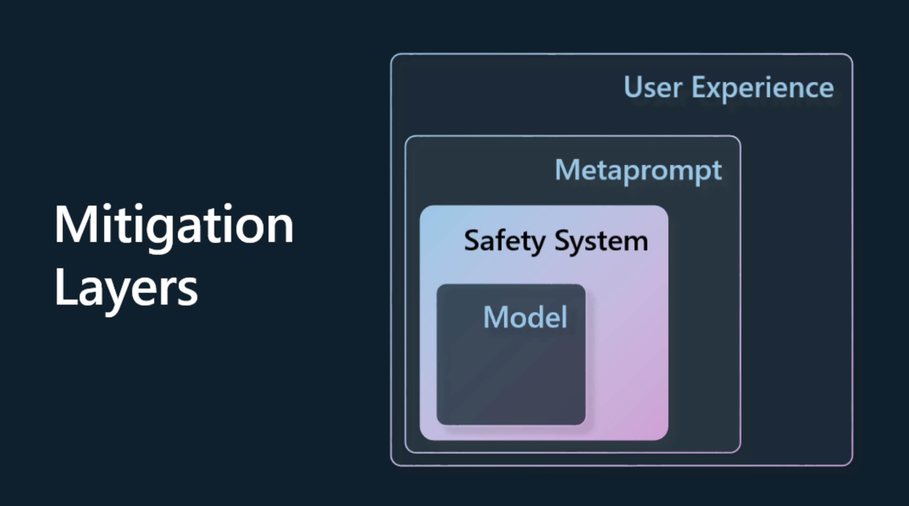

# 責任ある生成AIの使用

[]

> ビデオ近日公開予定

AI、特に生成AIに魅了されるのは簡単だが、それをどう責任を持って使うかを考える必要がある。出力が公正であること、有害でないこと、その他を保証する方法などを考慮する必要があります。この章では、AIの使い方を改善するために、何を考慮し、どのように積極的な手段を講じるべきか、その背景を説明する。

## はじめに

このレッスンでは、以下を取り上げます：

- 生成AIアプリケーションを構築する際に、なぜ責任あるAIを優先すべきなのか。
- 責任あるAIの基本原則と、それらが生成AIにどのように関連するか。
- これらのResponsible AI原則を戦略とツールを通じて実践する方法。

## 学習目標

このレッスンを修了すると、以下のことがわかります： 

- 生成AIアプリケーションを構築する際の責任あるAIの重要性
- 生成AIアプリケーションを構築する際に、Responsible AI（責任あるAI）の中核となる原則をいつ考え、適用するか。
- 責任あるAIの概念を実践するために、どのようなツールと戦略が利用可能か。

## 責任あるAIの原則

生成AIの興奮はかつてないほど高まっている。この興奮は、この分野に多くの新しい開発者、注目、資金をもたらした。これは、生成AIを使った製品や企業の構築を目指す人にとって非常にポジティブなことですが、責任を持って進めていくことも重要です。

このコースでは、私たちのスタートアップとAI教育製品の開発に焦点を当てます。私たちは、責任あるAIの原則である「公平性」、「包括性」、「信頼性／安全性」、「セキュリティとプライバシー」、「透明性」、「説明責任」を使用します。これらの原則が、私たちの製品における生成AIの使用とどのように関連しているかを探ります。

## 責任あるAIを優先すべき理由

製品を構築する際、ユーザーの最善の利益を念頭に置き、人間中心のアプローチを取ることが最良の結果につながります。

生成AIのユニークな点は、ユーザーに役立つ回答、情報、ガイダンス、コンテンツを生み出す力にある。これは、非常に印象的な結果につながる多くの手動ステップなしで行うことができます。しかし、適切な計画や戦略がなければ、残念ながらユーザーや製品、社会全体にとって有害な結果をもたらすこともある。

これらの有害な結果のいくつか（すべてではない）を見てみよう：

### 幻覚

幻覚とは、LLMが完全に無意味なコンテンツや、他の情報源から見て事実誤認であるとわかっているコンテンツを作成するときに使われる用語です。

例えば、学生がモデルに対して歴史的な質問をすることができる機能をスタートアップのために作ったとしよう。ある生徒が「タイタニック号の唯一の生存者は誰ですか？

モデルは以下のような応答を生成する：

> *(ソース: [Flying bisons](https://flyingbisons.com?WT.mc_id=academic-105485-koreyst))*

これは非常に自信に満ちた、徹底的な回答である。残念ながら、それは正しくない。タイタニック号の生存者が複数いたことは、最低限の調査をしただけでもわかるはずです。このトピックについて調べ始めたばかりの学生にとって、この回答は疑問を持たれず、事実として扱われるのに十分な説得力があります。この結果、AIシステムは信頼性を失い、スタートアップの評判に悪影響を与えることになりかねない。

LLMを繰り返すたびに、幻覚を最小限に抑えるパフォーマンスが向上しています。この改善があったとしても、私たちアプリケーションビルダーやユーザーは、これらの制限を常に意識しておく必要があります。

### 有害なコンテンツ

先のセクションで、LLMが不正確な、あるいは無意味な応答を生成する場合について説明しました。 私たちが注意しなければならないもう一つのリスクは、モデルが有害な内容で応答する場合です。

有害な内容とは次のようなものです：

- 特定のグループに対して、自傷行為や危害を加えることを指示したり、奨励したりする内容。
- 憎悪的または卑下的な内容。
- あらゆる種類の攻撃や暴力行為を計画するよう指導すること。
- 違法なコンテンツの探し方や違法行為の指示。
- 性的に露骨なコンテンツを表示すること

私たちのスタートアップでは、このようなコンテンツが学生の目に触れないよう、適切なツールと戦略を用意したいと考えています。

### 公正さの欠如

公平性とは、「AIシステムに偏見や差別がなく、誰もが公平かつ平等に扱われること」と定義される。生成AIの世界では、疎外されたグループの排他的な世界観がモデルの出力によって強化されないようにしたい。

このようなタイプの出力は、ユーザーにとってポジティブな製品体験を構築する上で破壊的であるだけでなく、さらなる社会的弊害を引き起こす。アプリケーション・ビルダーとして、生成AIを使ったソリューションを構築する際には、常に広く多様なユーザー層を念頭に置くべきである。

## 生成AIの責任ある使い方

さて、責任ある生成AIの重要性を確認したところで、責任あるAIソリューションを構築するための4つのステップを見てみよう：

### 潜在的な弊害をメジャーで測る

ソフトウェアテストでは、アプリケーションに対するユーザの期待される行動をテストします。同様に、ユーザが使う可能性の高い多様なプロンプトのセットをテストすることは、潜在的な危害を測定する良い方法です。

私たちのスタートアップは教育製品を作っているので、教育関連のプロンプトのリストを準備するのがいいだろう。これは、特定の科目、歴史的事実、学生生活に関するプロンプトをカバーすることができる。

### 潜在的な弊害を軽減する

今度は、モデルとその対応によって引き起こされる潜在的な害を防止または制限できる方法を見つける番です。私たちはこれを4つの異なる層で見ることができます：

- モデル 適切なユースケースに適切なモデルを選択する。GPT-4のような大規模で複雑なモデルは、より小規模で具体的なユースケースに適用すると、有害なコンテンツのリスクが高まる可能性があります。また、トレーニングデータを使って微調整を行うことで、有害コンテンツのリスクを減らすことができます。

- 安全システム 安全システムとは、有害性の軽減に役立つ、モデルを提供するプラットフォーム上のツールや設定のセットです。この例は、Azure OpenAIサービス上のコンテンツフィルタリングシステムです。システムはまた、脱獄攻撃やボットからのリクエストのような不要なアクティビティを検出する必要があります。

- **メタプロンプト**。メタプロンプトとグラウンディングは、特定の行動や情報に基づいてモデルを指示したり制限したりする方法です。これは、モデルの特定の限界を定義するためにシステム入力を使用することができます。さらに、システムのスコープやドメインにより関連した出力を提供することもできます。

 また、RAG(Retrieval Augmented Generation)のようなテクニックを使用して、モデルが信頼できるソースの選択からのみ情報を引き出せるようにすることもできます。このコースの後半に[検索アプリケーションの構築](../../../08-building-search-applications/translations/ja/README.md)
のレッスンがあります
- ユーザー・エクスペリエンス 最後のレイヤーは、ユーザーが何らかの方法でアプリケーションのインターフェースを通してモデルと直接対話するところです。このようにして、ユーザーに表示されるテキストや画像と同様に、ユーザーがモデルに送信できる入力の種類を制限するUI/UXを設計することができます。AIアプリケーションをデプロイするとき、生成AIアプリケーションができること、できないことについて透明性を持たせる必要もあります。 

[AIアプリケーションのためのUXデザイン](../../../12-designing-ux-for-ai-applications/translations/ja/README.md)に特化したレッスン全体があります。

- モデルの評価 LLMでの作業は、モデルが学習されたデータを常にコントロールできるわけではないので、難しいかもしれません。それにもかかわらず、我々は常にモデルの性能と出力を評価する必要があります。モデルの正確さ、類似性、根拠性、出力の関連性をメジャーすることが重要であることに変わりはない。これは、利害関係者やユーザーに透明性と信頼を提供するのに役立つ。

### 責任ある生成AIソリューションの運用

AIアプリケーションの運用プラクティスを構築することが最終段階です。これには、法務やセキュリティのようなスタートアップの他の部分と提携し、すべての規制方針に準拠していることを確認することが含まれます。また、ローンチする前に、配信、インシデントへの対応、ロールバックに関する計画を構築し、ユーザーへの危害が拡大しないようにしたいと考えています。

## ツール

責任あるAIソリューションの開発作業は大変に思えるかもしれないが、それは努力に値する仕事である。生成AIの分野が成長するにつれて、開発者がワークフローにレスポンシブルAIを効率的に統合するためのツールが成熟していくだろう。例えば、[Azure AI Content Safety](https://learn.microsoft.com/azure/ai-services/content-safety/overview)は、APIリクエストを通じて有害なコンテンツや画像を検出するのに役立つ。

## ナレッジチェック

責任あるAIの利用を保証するために気をつけるべきことは何でしょうか？

1. 答えが正しいこと
1. 有害な使い方、つまりAIが犯罪目的で使われないこと。
1. AIに偏見や差別がないこと。

A: 2と3が正しい。責任あるAIは、有害な影響や偏見などを軽減する方法を検討するのに役立ちます。

## 🚀チャレンジ

[Azure AI Content Saftey](https://learn.microsoft.com/azure/ai-services/content-safety/overview)を読んで、自分の使い方に取り入れられるものを見てみましょう。

## よくやった、学習を続けよう

このレッスンを終えたら、[生成AI学習コレクション](https://aka.ms/genai-collection)をチェックして、生成AI知識のレベルアップを続けましょう！

レッスン4では、[プロンプトエンジニアリングの基礎](../../../04-prompt-engineering-fundamentals/translations/ja/README.md)を見ていきます！
