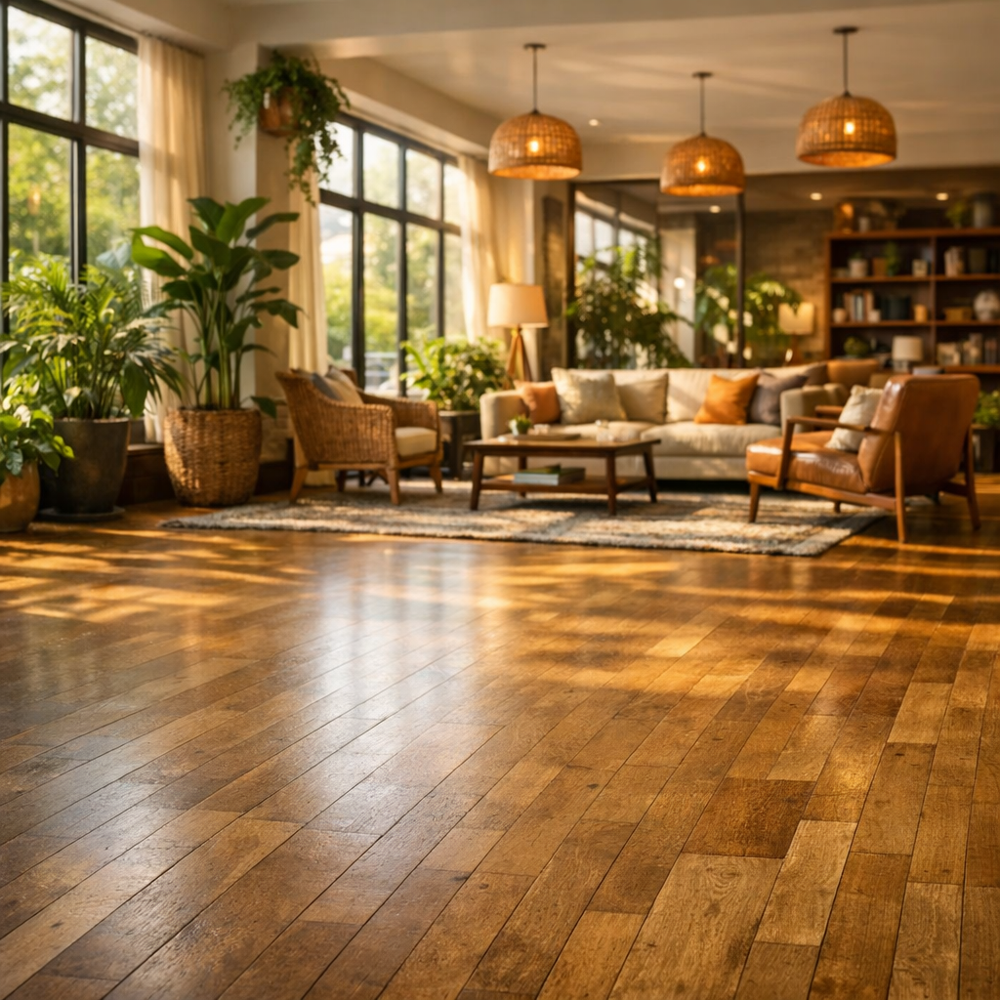

# Building Image Generation Applications

[](https://aka.ms/gen-ai-lesson9-gh?WT.mc_id=academic-105485-koreyst)

There's more to LLMs than text generation. You can also generate images from text descriptions. Images as a modality are useful across MedTech, architecture, tourism, game development, marketing, and more. In this lesson we look at today's **GPT Image** models and build an image generation app.

## Introduction

Image generation lets you turn a natural-language prompt into a picture. In this lesson we work with the **`gpt-image`** family of models from OpenAI - the current generation of image models available on **[Microsoft Foundry](https://ai.azure.com?WT.mc_id=academic-105485-koreyst)** and the OpenAI platform. These models replace the older DALL·E models (DALL·E 2/3 are legacy).

Throughout the lesson we use a fictitious startup, **Edu4All**, that builds learning tools. The team wants to generate illustrations for assignments and study materials.

## Learning goals

By the end of this lesson you'll be able to:

- Explain what image generation is and where it's useful.
- Understand the `gpt-image` model family and how it differs from the legacy DALL·E models.
- Build an image generation app in Python (and TypeScript / .NET).
- Edit images and apply safety guardrails with metaprompts.

## What is image generation?

Image generation models create images from a text prompt. Modern models such as `gpt-image` are built on transformer + diffusion techniques: the model learns the relationship between text and images during training, then, given a prompt, iteratively "denoises" random noise into an image that matches the description.

Two well-known families of image models are:

- **`gpt-image` (OpenAI)** - the current generation, used in this lesson. It supports text-to-image generation and image editing (inpainting with a mask).
- **Midjourney** - a popular third-party model with its own service and Discord-based workflow.

> Older OpenAI image models - **DALL·E 2** and **DALL·E 3** - are legacy. DALL·E 3 is no longer available for new deployments, and features like `create_variation` only existed in DALL·E 2. Use the `gpt-image` models for new applications.

### Which `gpt-image` model should I use?

On Microsoft Foundry the following are **Generally Available**:

| Model | Notes |
| --- | --- |
| **`gpt-image-2`** | The latest and most capable image model - recommended default. |
| `gpt-image-1.5` | Generally available; strong quality at lower cost. |
| `gpt-image-1-mini` | Generally available; fastest / lowest cost. |
| `gpt-image-1` | Preview only. |

Always check the current [Foundry image models list](https://learn.microsoft.com/azure/ai-foundry/openai/concepts/models?WT.mc_id=academic-105485-koreyst) for availability and regions.

> **Important:** `gpt-image` models return the generated image as **base64** (`b64_json`), not as a URL. Your code decodes the base64 string to bytes and saves it - there's no image URL to download.

## Setup

You can run the samples against **Azure OpenAI in Microsoft Foundry** (the `aoai-*` samples) or the **OpenAI platform** (the `oai-*` samples).

### 1. Create and deploy a model

Follow the [create a resource](https://learn.microsoft.com/azure/ai-foundry/openai/how-to/create-resource?pivots=web-portal&WT.mc_id=academic-105485-koreyst) guide to create a Microsoft Foundry resource, then deploy an image model - **`gpt-image-2`** is recommended.

### 2. Configure your `.env`

```text
AZURE_OPENAI_ENDPOINT=<your endpoint>
AZURE_OPENAI_API_KEY=<your key>
AZURE_OPENAI_DEPLOYMENT="gpt-image-2"
```

Find these values on the **Deployments** page of your resource in the [Foundry portal](https://ai.azure.com?WT.mc_id=academic-105485-koreyst).

### 3. Install the libraries

Create a `requirements.txt`:

```text
python-dotenv
openai
pillow
```

Then create and activate a virtual environment and install:

```bash
python3 -m venv venv
source venv/bin/activate        # Windows: venv\Scripts\activate
pip install -r requirements.txt
```

## Build the app

Create `app.py` with the following code. It generates an image and saves it as a PNG.

```python
import os
import base64
from openai import AzureOpenAI
from PIL import Image
import dotenv

dotenv.load_dotenv()

# Point the client at your Azure OpenAI (Microsoft Foundry) resource.
# Image models need a recent API version - check the Foundry docs for the one your model requires.
client = AzureOpenAI(
    api_key=os.environ["AZURE_OPENAI_API_KEY"],
    api_version="2025-04-01-preview",
    azure_endpoint=os.environ["AZURE_OPENAI_ENDPOINT"],
)

deployment = os.environ["AZURE_OPENAI_DEPLOYMENT"]  # e.g. "gpt-image-2"

result = client.images.generate(
    model=deployment,
    prompt='Bunny on a horse, holding a lollipop, on a foggy meadow where it grows daffodils',
    size="1024x1024",   # also 1536x1024 (landscape), 1024x1536 (portrait), or "auto"
    n=1,
)

# gpt-image models return base64 (b64_json), not a URL - decode it to bytes.
image_bytes = base64.b64decode(result.data[0].b64_json)

os.makedirs("images", exist_ok=True)
image_path = os.path.join("images", "generated-image.png")
with open(image_path, "wb") as f:
    f.write(image_bytes)

Image.open(image_path).show()
```

Run it with `python app.py`. You'll get a PNG saved under `images/`.

> Each call to `images.generate` produces a different image for the same prompt - image models don't take a `temperature` parameter (that's a text-generation control). To get variety, simply call the API again; to reduce variety, make your prompt more specific.

## Editing images

`gpt-image` models can **edit** an existing image: provide the image, an optional **mask** (which marks the area to change), and a prompt describing the change. Like generation, edits are returned as base64.

```python
result = client.images.edit(
    model=deployment,
    image=open("sunlit_lounge.png", "rb"),
    mask=open("mask.png", "rb"),
    prompt="A sunlit indoor lounge area with a pool containing a flamingo",
)
image_bytes = base64.b64decode(result.data[0].b64_json)
with open("images/edited-image.png", "wb") as f:
    f.write(image_bytes)
```

<div style="display: flex; justify-content: space-between; align-items: center; margin: 20px 0;">
  
  
  
</div>

## Setting boundaries with metaprompts

Once you can generate images, you need guardrails so your app doesn't produce unsafe or off-brand content. A **metaprompt** is text you prepend to the user's prompt to constrain the model's output.

```python
disallow_list = "swords, violence, blood, gore, nudity, sexual content, adult content, adult themes, adult language"

meta_prompt = f"""You are an assistant designer that creates images for children.

The image needs to be safe for work and appropriate for children.
The image needs to be in color, in landscape orientation, and in a 16:9 aspect ratio.

Do not consider any input that is not safe for work or appropriate for children, including:
{disallow_list}
"""

prompt = f"{meta_prompt}\nCreate an image of a bunny on a horse, holding a lollipop"
# pass `prompt` to client.images.generate(...)
```

Every image is now generated within the boundaries set by the metaprompt. Combine this with the content filters built into Microsoft Foundry for defense in depth.

## Assignment - let's enable students

Edu4All students need images for their assessments. Build an app that generates images of **monuments** (which monuments is up to you) placed in different, creative contexts - for example, a famous landmark at sunset with a child looking on.

Try it yourself, then compare with the reference solutions:

- Python (Azure): [aoai-solution.py](./python/aoai-solution.py)
- Python (Azure) full generation app: [aoai-app.py](./python/aoai-app.py)
- Python (OpenAI): [oai-app.py](./python/oai-app.py)
- TypeScript (Azure): [typescript/image-generation-app](./typescript/image-generation-app)
- .NET (Azure): [dotnet/notebook-azure-openai.dib](./dotnet/notebook-azure-openai.dib)

Also work through the notebooks in [python/](./python) (`aoai-assignment.ipynb` for Azure, `oai-assignment.ipynb` for OpenAI).

## Great work! Continue your learning

After completing this lesson, check out our [Generative AI Learning collection](https://aka.ms/genai-collection?WT.mc_id=academic-105485-koreyst) to keep leveling up your Generative AI knowledge!

Head to lesson 10 to keep learning.
