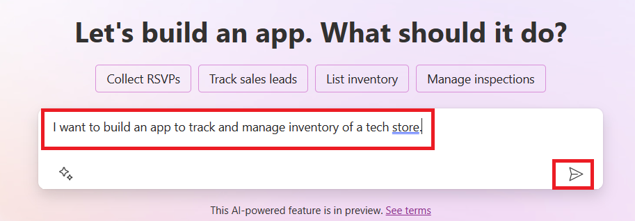
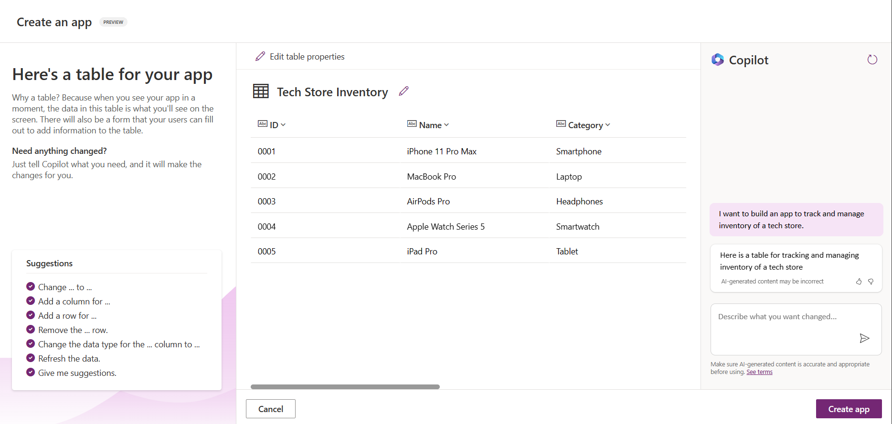
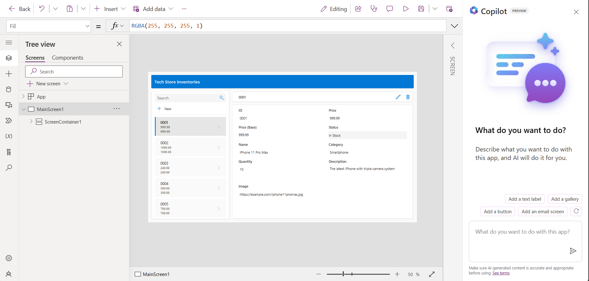
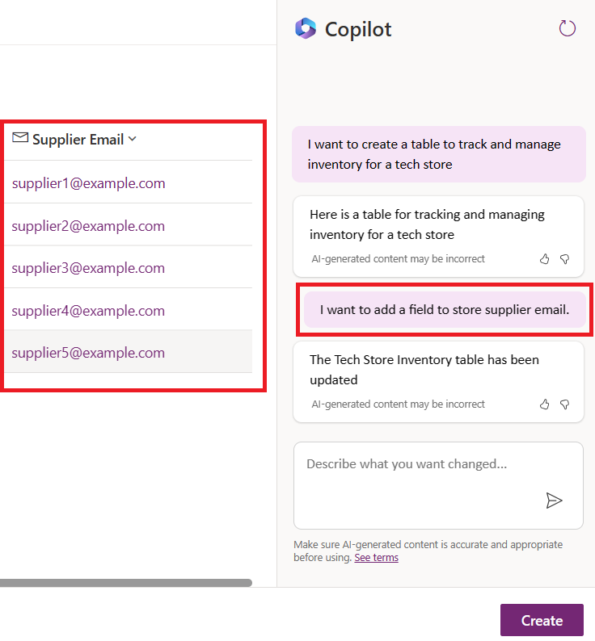
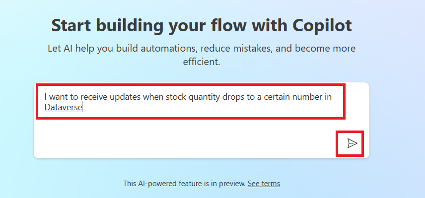
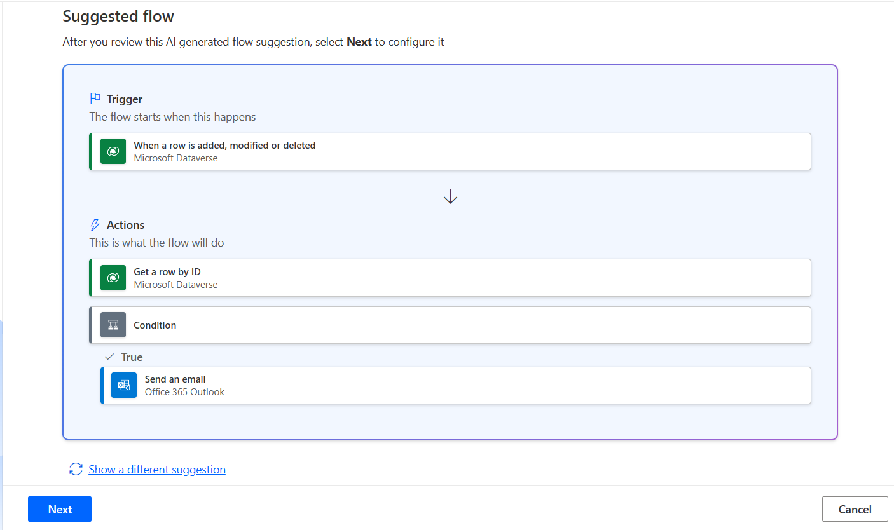
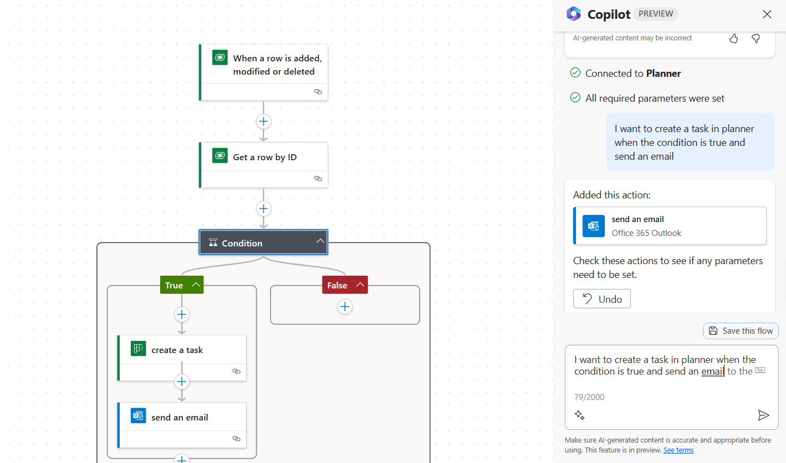

# Building Low Code AI Applications

## Introduction

Building apps and solutions has become more easier for traditional developers and non-developers through the use of Low Code Development Platforms. Low Code Development Platforms enable you to build apps and solutions with little to no code. This is achieved by providing a visual development environment that enables you to drag and drop components to build apps and solutions. This enables you to build apps and solutions faster and with less resources. In this lesson, we dive deep into how to use Low Code and how to enhance low code development with AI.

This lesson covers:
- Introduction to Generative AI in Power Platform
- Introduction to Copilot and how to use it
- Using Generative AI to build apps and flows in Power Platform
- Understanding the AI Models in Power Platform with AI Builder

## Learning Goals

By the end of this lesson, you will be able to:

- Understand how Copilot works in Power Platform
- Build an App using Copilot in PowerApps
- Apply best practices when using the Create Text with GPT AI Model

## Generative AI in Power Platform

Enhancing low-code development and application with generative AI is a key focus area for Power Platform. The goal is to enable everyone to build AI-powered apps, sites, dashboards and automate processes with AI, without requiring any data science expertise. This is achieved by integrating generative AI into the low-code development experience in Power Platform in the form of Copilot and AI Builder.

### What is AI Copilot?

AI Copilot enables you to build Power Platform solutions with underlying data through describing your requirements in a series of conversational steps using natural language. You can use AI Copilot driven functionalities as feature in your app screens to enable users to uncover insights through conversatonal interactions.

### PowerApps Copilot

The copilot AI assistant feature in PowerApps enables you to describe what kind of app you need and what information you want your app to track, collect, or show. Copilot then generates a responsive Canvas app based on your description. You can then customize the app to meet your needs. The AI Copilot also generates and suggests a Dataverse Table with the fields you need to store the data you want to track and some sample data. You can then customize the table to meet your needs using the AI Copilot assistant feature through conversational steps. This feature is readily available from the PowerApps home screen.

## Build Apps and Flows with Generative AI

To build an app or a flow in PowerApps or Power Automate you would need to have a clear understanding of the requirements and the data that is required to build the app or flow. Make sure that you have a clear prompt to get the best results. For example, if you want to build an app to track the inventory of a store, you can use the following prompt: ***I want to build an app to track the inventory of a store***. This will help the AI Copilot to understand the requirements and generate the app accordingly.

When you are getting started with using Copilot, you can use the [Power Platform Copilot Prompt Library](https://pnp.github.io/powerplatform-prompts/?WT.mc_id=academic-109639-somelezediko) to get started with the prompts. This library contains a list of prompts that you can use to build apps and flows with Copilot. You can also use the prompts in the library to get an idea of how to describe your requirements to Copilot.

### Build and Update an App with Copilot in PowerApps

To build an app with Copilot in PowerApps, follow the steps below:

1. Navigate to the [PowerApps](https://make.powerapps.com) home screen.

2. Use the text area on the home screen to describe the app you want to build. For example, ***I want to build an app to track and manage inventory of a tech store***. Click on the **Send** button to send the prompt to the AI Copilot.

    

3. The AI Copilot will suggest a Dataverse Table with the fields you need to store the data you want to track and some sample data. You can then customize the table to meet your needs using the AI Copilot assistant feature through conversational steps.

    

4. Once you are done with the table, click on the **Create app** button to create the app.

5. The AI Copilot will generate a responsive Canvas app based on your description. You can then customize the app to meet your needs (optional). You can also use the AI Copilot to add new screens to the app. For example, you can use the following prompt to add a new screen to the app: ***I want to add an email screen to send updates***. Click on the **Send** button to send the prompt to the AI Copilot.

    

6. Once you are done with the app, click on the **Save** button to save the app.

7. You can then publish the app to make it available to the users.

### Author and Update a Dataverse Table with Copilot in PowerApps

To author and update a Dataverse Table with Copilot in PowerApps, follow the steps below:

1. Navigate to the [PowerApps](https://make.powerapps.com) home screen.

2. On the left navigation bar, select on **Tables** and then click on **Describe the new Table**.

3. On the right side of the screen, use the text area to describe the table you want to create. For example, ***I want to create a table to track and manage inventory for a tech store***. Click on the **Send** button to send the prompt to the AI Copilot.

    

4. The AI Copilot will suggest a Dataverse Table with the fields you need to store the data you want to track and some sample data. You can then customize the table to meet your needs using the AI Copilot assistant feature through conversational steps.

5. To use AI Copilot to add a new field to the table, use the following prompt: ***I want to add a field to store supplier email.***. Click on the **Send** button to send the prompt to the AI Copilot.

    

6. The AI Copilot will generate a new field and you can then customize the field to meet your needs.

7. Once you are done with the table, click on the **Create** button to create the table.

### Build and Update a Flow with Copilot in Power Automate

To build a flow with Copilot in Power Automate, follow the steps below:

1. Navigate to the [Power Automate](https://make.powerautomate.com) home screen.

2. Use the text area on the home screen to describe the flow you want to build. For example, ***I want to receive updates when stock quantity drops to a certain number in Dataverse**. Click on the **Send** button to send the prompt to the AI Copilot.

    

3. The AI Copilot will suggest a flow with the actions you need to perform the task you want to automate. You click on the **Next** button to go through the steps.

    

4. Power Automate will prompt you to set up the connections required for the flow. Once you are done with the connections, click on the **Create Flow** button to create the flow.

5. Update the **When a row is added, modified or deleted** trigger to use the table you created in the previous section.

6. Update the **Get a row by ID** action to use the table you created in the previous section.

7. Update the condition to use the dynamic content from the **Get a row by ID** action. Set the fields as shown below:

    **Left**: `Quantity`,
    **Condition**: `is less than`,
    **Right**: `10`

8. Update the **Send an email** action to use the dynamic content from the trigger. Set the fields as shown below:

    **To**: `Email`,
    **Subject**: `Quantity of Inventory Item Dropping`,
    **Body**: `Hi team, the number of items in stock for the item: {Name} is dropping. Please check the inventory and update the stock.`

9. Use copilot to add a new action to the flow. For example, you can use the following prompt to add a new action to the flow: ***I want to create a task in planner when the condition is true and send an email***. Click on the **Send** button to send the prompt to the AI Copilot.

    

10. The AI Copilot will generate a new action and you can then customize the action to meet your needs.

11. Once you are done with the flow, click on the **Save** button to save the flow.

## AI Models in Power Platform with AI Builder

AI Builder is a low-code AI capability available in Power Platform that enables you to use AI Models to help you in automating processes and predicting outcomes. With AI Builder you can bring AI to your apps and flows that connect to your data in Dataverse or in various cloud data sources, such as SharePoint, OneDrive or Azure. 

### Prebuilt AI Models vs Custom AI Models

AI Builder provides two types of AI Models: Prebuilt AI Models and Custom AI Models. Prebuilt AI Models are ready-to-use AI Models that are trained by Microsoft and available in Power Platform.These help you add intelligence to your apps and flows without having to gather data and then build, train and publish your own models. You can use these models to automate processes and predict outcomes.

Some of the Prebuilt AI Models available in Power Platform include:

- **Key Phrase Extraction**: This model extracts key phrases from text.
- **Language Detection**: This model detects the language of a text.
- **Sentiment Analysis**: This model detects positive, negative, neutral, or mixed sentiment in text.
- **Business Card Reader**: This model extracts information from business cards.
- **Text Recognition**: This model extracts text from images.
- **Object Detection**: This model detects and extracts objects from images.
- **Form Processing**: This model extracts information from forms.
- **Invoice Processing**: This model extracts information from invoices.

With Custom AI Models you can bring your own model into AI Builder so that it can function like any AI Builder custom model, allowing you to train the model using your own data. You can use these models to automate processes and predict outcomes in both PowerApps and Power Automate. When using your own model there limitations that apply. Read more on these [limitations](https://learn.microsoft.com/en-us/ai-builder/byo-model#limitations).

### Use a Text Generation AI Model in Power Automate

The Create Text with GPT AI Model in AI Builder enables you to generate text based on a prompt and is powered by the Microsoft Azure OpenAI Service. With this capability, you can incorporate GPT (Generative Pre-Trained Tranformer) technology into your apps and flows to build a variety of automations and insightful applications. 

GPT models undergo extensive training on vast amounts of data, enabling them to produce text that closely resembles human language when provided with a prompt. When integrated with workflow automation, AI models like GPT can be harnessed to streamline and automate a wide range of tasks.

For example, you can build flows to automatically generate text for a variety of use cases, such as: drafts of emails, product descriptions, and more. You can also use the model to generate text for a variety of apps, such as chatbots and customer service apps that enable customer service agents to respond effectively and effectiently to customer inquiries.

To learn how to use this AI Model in Power Automate, go through the [Add intelligence with AI Builder and GPT](https://learn.microsoft.com/training/modules/add-intelligence-ai-copilot/?WT.mc_id=academic-109639-somelezediko) module.

## Resources

- [Add intelligence with AI Builder and GPT](https://learn.microsoft.com/training/modules/add-intelligence-ai-copilot/?WT.mc_id=academic-109639-somelezediko)

- [Get Started with AI Builder](https://learn.microsoft.com/training/modules/get-started-with-ai-builder/?WT.mc_id=academic-109639-somelezediko)

- [Detect Objects with AI Builder](https://learn.microsoft.com/training/modules/get-started-with-ai-builder-object-detection/?WT.mc_id=academic-109639-somelezediko)

- [AI Copilot Overview](https://learn.microsoft.com/en-us/power-apps/maker/canvas-apps/ai-overview?WT.mc_id=academic-109639-somelezediko)

- [Build a canvas app solution with Copilot in Power Apps](https://learn.microsoft.com/en-us/training/modules/build-canvas-app-real-estate-power-apps-copilot/?WT.mc_id=academic-109639-somelezediko)

- [Power Platform Copilot Prompt Library](https://pnp.github.io/powerplatform-prompts/?WT.mc_id=academic-109639-somelezediko)

