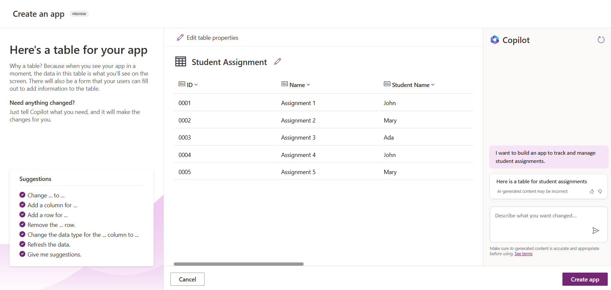
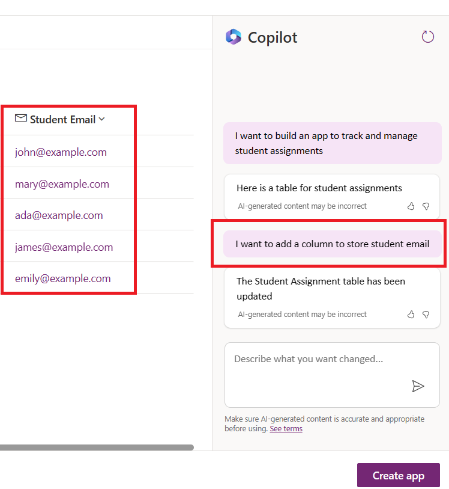
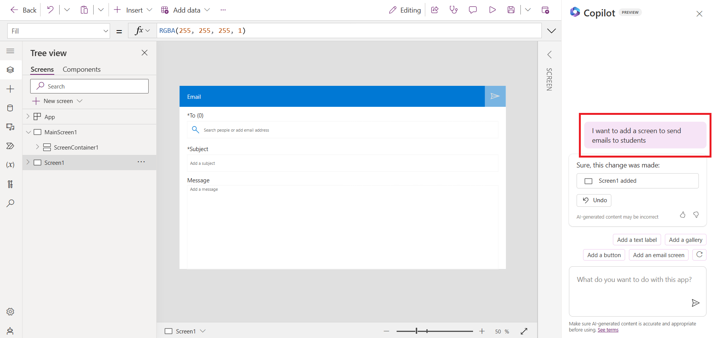
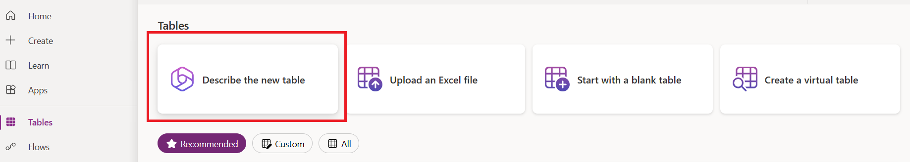
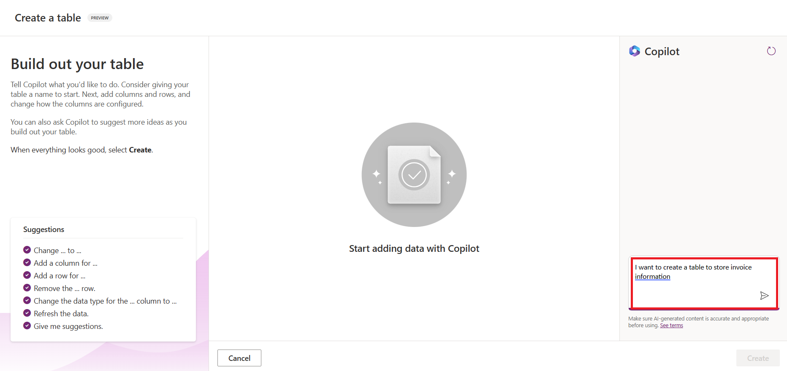
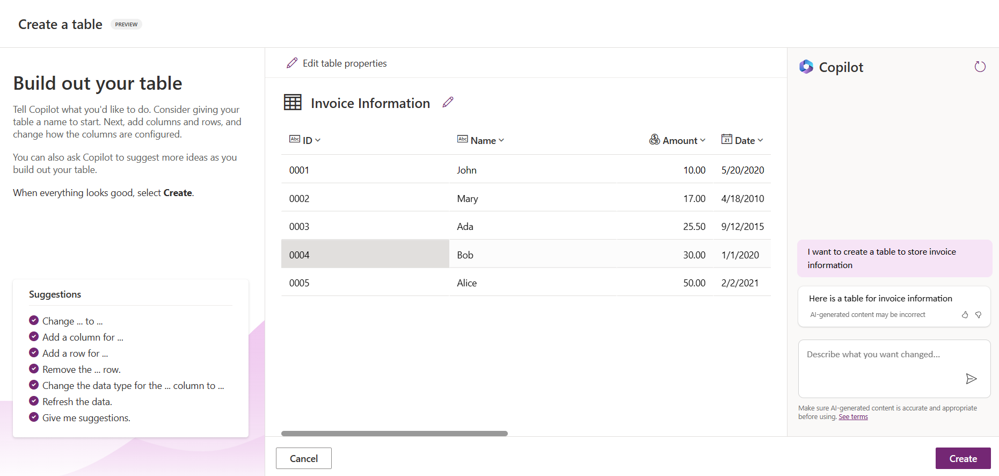
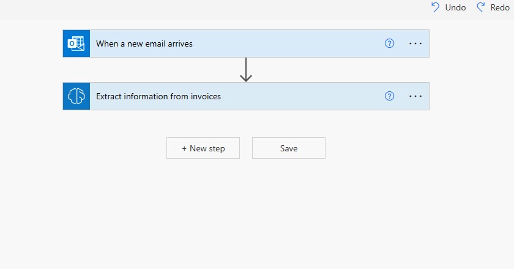
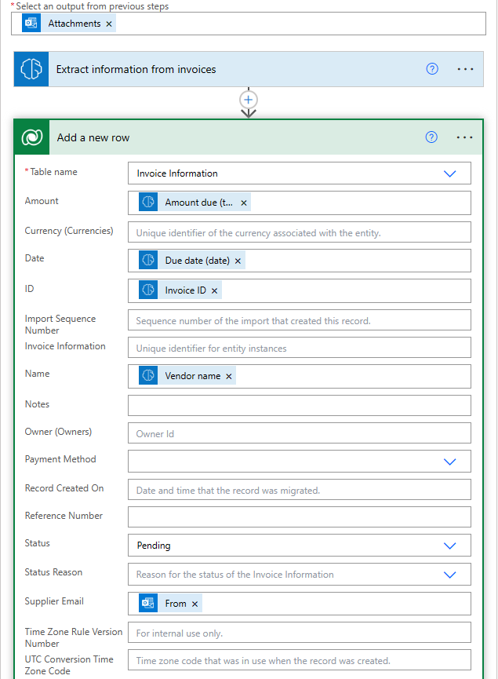

# ローコードAIアプリケーションの構築

> このレッスンのビデオを見るには上の画像をクリックしてください。

## はじめに

さて、画像生成アプリケーションの作り方を学んだところで、ローコードについて話そう。生成AIはローコードを含む様々な分野で利用することができますが、ローコードとは何でしょうか、そしてどのようにAIを追加できるのでしょうか？

アプリやソリューションの構築は、ローコード開発プラットフォームの利用により、従来の開発者や非開発者にとってより簡単になりました。ローコード開発プラットフォームは、コードをほとんど使わずにアプリやソリューションを構築することを可能にします。これは、アプリやソリューションを構築するためのコンポーネントをドラッグ・アンド・ドロップできるビジュアル開発環境を提供することによって実現されます。これにより、アプリやソリューションをより速く、より少ないリソースで構築することができます。このレッスンでは、ローコードの使用方法と、Power Platformを使用したAIによるローコード開発の強化方法について深く掘り下げます。

Power Platformは、直感的なローコードまたはノーコード環境を通じて、チームに独自のソリューションを構築する権限を与える機会を組織に提供します。この環境は、ソリューション構築のプロセスを簡素化するのに役立ちます。Power Platformを使用すれば、数ヶ月から数年かかるソリューションを数日から数週間で構築することができます。Power Platformは5つの主要製品で構成されています： Power Apps、Power Automate、Power BI、Power Pages、Power Virtual Agentsです。

このレッスンでは、以下の内容を学びます：

- Power Platformにおける生成AI入門
- Copilotの紹介と使用方法
- Power Platformで生成AIを使用してアプリとフローを構築する
- AI Builderを使用したPower PlatformのAIモデルの理解

## 学習目標

このレッスンの終わりまでに、以下のことができるようになります：

- Power PlatformでCopilotがどのように機能するかを理解する。

- 教育スタートアップのための学生課題追跡アプリを構築する。

- AIを使用して請求書から情報を抽出する請求書処理フローを構築する。

- GPT AIモデルでテキストを作成する際のベストプラクティスを適用します。

このレッスンで使用するツールとテクノロジーは次のとおりです：

- **Power Apps**は、Student Assignment Trackerアプリ用で、データを追跡、管理、および相互作用するアプリを構築するためのローコード開発環境を提供します。

- **Dataverse**は、Student Assignment Trackerアプリのデータを保存するためのもので、Dataverseはアプリのデータを保存するためのローコードデータプラットフォームを提供します。

- **Power Automate**: Invoice Processingフロー用で、Invoice Processingプロセスを自動化するワークフローを構築するためのローコード開発環境を提供します。

- **AI Builder**: インボイス処理AIモデルで、スタートアップのインボイスを処理するために事前に構築されたAIモデルを使用します。

## Power Platformにおける生成AI

生成AIによるローコード開発とアプリケーションの強化は、Power Platformの重要な重点分野です。その目標は、データサイエンスの専門知識*を必要とすることなく、誰もがAIを活用したアプリ、サイト、ダッシュボードを構築し、プロセスを自動化できるようにすることです。この目標は、CopilotとAI Builderという形で、Power Platformのローコード開発体験に生成AIを統合することで達成されます。

### これはどのように機能するのか？

Copilotは、自然言語を使用した一連の会話ステップで要件を説明することで、Power Platformソリューションの構築を可能にするAIアシスタントです。たとえば、AIアシスタントにアプリで使用するフィールドを指示すると、AIアシスタントがアプリと基盤となるデータモデルの両方を作成したり、Power Automateでフローをセットアップする方法を指定したりできます。

Copilot主導の機能性をアプリ画面の機能として使用することで、ユーザーが会話型の対話を通じてインサイトを発見できるようになります。

AI BuilderはPower Platformで利用できるローコードAI機能で、AIモデルを使用してプロセスの自動化や結果の予測を行うことができます。AI Builderを使用すると、Dataverseや、SharePoint、OneDrive、Azureなどのさまざまなクラウドデータソースのデータに接続するアプリやフローにAIを導入できます。

CopilotはPower Platformのすべての製品で利用できます： Power Apps、Power Automate、Power BI、Power Pages、Power Virtual Agentsです。AI BuilderはPower AppsとPower Automateで利用できます。このレッスンでは、Power AppsとPower AutomateでCopilotとAI Builderを使用して、教育スタートアップのソリューションを構築する方法に焦点を当てます。

### Power AppsのCopilot

Power Platformの一部として、Power Appsは、データを追跡、管理、対話するアプリを構築するためのローコード開発環境を提供します。これは、スケーラブルなデータプラットフォームと、クラウドサービスおよびオンプレミスデータへの接続機能を備えたアプリ開発サービススイートです。Power Appsでは、ブラウザ、タブレット、携帯電話で動作し、同僚と共有できるアプリを構築できます。Power Appsは、シンプルなインターフェイスでユーザーをアプリ開発に簡単に導入できるため、あらゆるビジネスユーザーやプロの開発者がカスタムアプリを構築できます。また、コパイロットによる生成AIにより、アプリ開発体験も強化されています。

Power AppsのAIアシスタント機能であるCopilotでは、どのようなアプリが必要なのか、アプリに追跡、収集、表示させたい情報は何なのかを説明することができます。すると、Copilotが説明に基づいてレスポンシブなCanvasアプリを生成します。その後、ニーズに合わせてアプリをカスタマイズできます。また、AI Copilotは、追跡したいデータといくつかのサンプルデータを格納するために必要なフィールドを含むDataverse Tableを生成し、提案します。Dataverseとは何か、Power Appsでどのように使用できるかについては、後ほどこのレッスンで説明します。その後、AI Copilotアシスタント機能を使って、会話形式でテーブルをカスタマイズすることができます。この機能は、Power Appsのホーム画面からすぐに利用できます。

### Power Automate のコパイロット

Power AutomateはPower Platformの一部として、アプリケーションとサービス間の自動ワークフローを作成できます。コミュニケーション、データ収集、意思決定承認などの反復的なビジネスプロセスの自動化を支援します。シンプルなインターフェイスにより、初心者から熟練開発者まで、あらゆる技術能力を持つユーザーが作業タスクを自動化することができます。ワークフロー開発体験は、コパイロットによる生成AIによっても強化される。

Power AutomateのAIアシスタント機能であるCopilotでは、どのようなフローが必要か、フローにどのようなアクションを実行させたいかを記述することができます。すると、コパイロットが記述に基づいてフローを生成します。その後、ニーズに合わせてフローをカスタマイズできます。また、AI Copilotは、自動化したいタスクを実行するために必要なアクションを生成して提案します。このレッスンでは、フローとは何か、Power Automateでフローをどのように使用できるかを後ほど説明します。その後、AI Copilotアシスタント機能を使用して、会話ステップを使用してニーズに合わせてアクションをカスタマイズできます。この機能は、Power Automateのホーム画面からすぐに利用できます。

## 課題: Copilotを使用して、新興企業の学生の課題と請求書を管理する

私たちの新興企業は、学生にオンラインコースを提供しています。この新興企業は急成長し、現在はコースの需要に追いつくのに苦労しています。この新興企業は Power Platform 開発者としてあなたを雇い、生徒の課題と請求書を管理するためのローコード・ソリューションの構築を支援してもらうことにしました。そのソリューションは、アプリを通じて生徒の課題を追跡・管理し、ワークフローを通じて請求書処理プロセスを自動化できるものでなければなりません。あなたは、生成AIを使用してソリューションを開発するよう依頼されました。

Copilotの使用を開始するときは、[Power Platform Copilot Prompt Library](https://pnp.github.io/powerplatform-prompts/?WT.mc_id=academic-109639-somelezediko)を使用してプロンプトを開始できます。このライブラリには、Copilotでアプリやフローを構築する際に使用できるプロンプトのリストが含まれています。また、ライブラリ内のプロンプトを使用して、Copilot に要件を記述する方法のアイデアを得ることもできます。

### 新興企業向けの学生課題追跡アプリの構築

当社の新興企業の教育担当者は、学生の課題を追跡するのに苦労していました。課題を追跡するためにスプレッドシートを使用してきましたが、学生の数が増えるにつれて管理が難しくなってきました。そこで、生徒の課題を追跡・管理できるアプリの開発を依頼しました。アプリでは、新しい課題の追加、課題の表示、課題の更新、課題の削除ができるようにする必要があります。また、採点済みの課題と未採点の課題を表示できるようにする必要があります。

以下の手順に従って、Power AppsのCopilotを使用してアプリを作成します：

1. [Power Apps](https://make.powerapps.com) ホーム画面に移動します。

1. ホーム画面のテキストエリアを使用して、作成するアプリを説明します。例えば、***生徒の課題を追跡・管理するアプリを作りたい***。Send**ボタンをクリックして、AI Copilotにプロンプトを送信します。

 

1. AIコパイロットは、追跡したいデータを格納するのに必要なフィールドといくつかのサンプルデータを含むデータバーステーブルを提案します。その後、AI Copilotのアシスタント機能を使用して、会話の手順でニーズに合わせてテーブルをカスタマイズできます。

    > **重要**： DataverseはPower Platformの基盤となるデータプラットフォームです。アプリのデータを保存するためのローコードデータプラットフォームです。Dataverseは、Microsoftクラウドにデータを安全に保存し、Power Platform環境内でプロビジョニングされるフルマネージドサービスです。データ分類、データリネージ、きめ細かなアクセス制御などのデータガバナンス機能が組み込まれています。Dataverseの詳細は[こちら](https://docs.microsoft.com/powerapps/maker/data-platform/data-platform-intro?WT.mc_id=academic-109639-somelezediko)をご覧ください。

   

1. 教育者は、課題を提出した学生に電子メールを送信して、課題の進捗状況を常に確認したいと考えます。コパイロットを使用して、学生の電子メールを格納する新しいフィールドをテーブルに追加できます。例えば、以下のプロンプトを使用して、テーブルに新しいフィールドを追加できます： **学生のEメールを保存するカラムを追加したい。** **[送信]** ボタンをクリックして、プロンプトをAI Copilotに送信します。

1. AIコパイロットが新しいフィールドを生成するので、必要に応じてフィールドをカスタマイズすることができます。

1. テーブルの作成が完了したら、**Create app**ボタンをクリックしてアプリを作成します。

1. AIコパイロットは、説明に基づいてレスポンシブなキャンバスアプリを生成します。その後、ニーズに合わせてアプリをカスタマイズできます。

1. 教育者が学生にメールを送信する場合、Copilotを使用してアプリに新しい画面を追加できます。たとえば、次のプロンプトを使用して、アプリに新しい画面を追加できます： ***生徒に電子メールを送信する画面を追加します。Send**ボタンをクリックして、プロンプトをAI Copilotに送信します。

1. AIコパイロットは新しい画面を生成し、その後、ニーズに合わせて画面をカスタマイズすることができます。

1. アプリを終了したら、**Save**ボタンをクリックしてアプリを保存します。

1. アプリを教育者と共有するには、**Share**ボタンをクリックし、再度**Share**ボタンをクリックします。教育担当者のメールアドレスを入力することで、アプリを教育担当者と共有することができます。

> あなたの宿題です： **あなたの宿題**：あなたが今作ったアプリは良いスタートですが、改善することができます。メール機能では、教育者は手動で生徒にメールを送ることしかできません。Copilotを使って、生徒が課題を提出したときに教育者が自動的にメールを送信できるような自動化を構築できないでしょうか？ヒントは、適切なプロンプトがあれば、Power AutomateでCopilotを使用してこれを構築できることです。

### スタートアップの請求書情報テーブルを構築する

新興企業の財務チームは、請求書の追跡に苦労しています。請求書を追跡するためにスプレッドシートを使用してきたが、請求書の数が増えるにつれて管理が難しくなってきた。そこで、受け取った請求書の情報を保存、追跡、管理するのに役立つテーブルの作成を依頼しました。このテーブルを使用して、すべての請求書情報を抽出し、テーブルに格納するオートメーションを構築する必要がある。また、このテーブルによって、財務チームは、支払済みの請求書と未支払いの請求書を閲覧できるようにする。

Power PlatformにはDataverseと呼ばれるデータプラットフォームがあり、アプリやソリューションのデータを保存することができます。Dataverseは、アプリのデータを保存するためのローコードデータプラットフォームを提供します。Dataverseは、Microsoftクラウドにデータを安全に保存し、Power Platform環境内でプロビジョニングされるフルマネージドサービスです。データ分類、データリネージ、きめ細かなアクセス制御などのデータガバナンス機能が組み込まれています。Dataverseについての詳細は[こちら](https://docs.microsoft.com/powerapps/maker/data-platform/data-platform-intro?WT.mc_id=academic-109639-somelezediko)をご覧ください。

なぜスタートアップにDataverseを使うべきなのでしょうか？Dataverseの標準テーブルとカスタムテーブルは、安全でクラウドベースのデータストレージオプションを提供します。テーブルを使用すると、エクセルのワークブックで複数のワークシートを使用するのと同じように、異なるタイプのデータを保存することができます。あなたの組織やビジネスニーズに特化したデータを保存するためにテーブルを使用することができます。Dataverseを使用することで私たちのスタートアップが得られる利点には、以下のようなものがありますが、これらに限定されるものではありません：

- **管理が簡単**： メタデータもデータもクラウドに保存されるため、保存方法や管理方法の詳細を心配する必要はありません。アプリやソリューションの構築に専念できます。

- **セキュア** Dataverseは安全なクラウドベースのストレージオプションを提供します。ロールベースのセキュリティにより、誰がどのようにテーブルのデータにアクセスできるかを制御できます。

- **豊富なメタデータ**： データ型とリレーションシップは、Power Apps 内で直接使用されます。

- **ロジックと検証**： ビジネスルール、計算フィールド、および検証ルールを使用して、ビジネスロジックを実行し、データの正確性を維持することができます。

Dataverseとは何か、なぜDataverseを使用する必要があるのかが分かったところで、Copilotを使用してDataverseにテーブルを作成し、財務チームの要件を満たす方法を見てみましょう。

>**注** ： 次のセクションでは、このテーブルを使用して、すべての請求書情報を抽出してテーブルに格納するオートメーションを構築します。

Copilotを使用してDataverseにテーブルを作成するには、以下の手順に従います：

1. [Power Apps](https://make.powerapps.com) ホーム画面に移動します。

2. 左のナビゲーションバーで、**Tables** を選択し、**Describe the new Table** をクリックします。

1. **新しいテーブルを記述する**画面で、テキストエリアを使用して作成したいテーブルを記述します。例えば、***請求書情報を保存するテーブルを作成したい***などです。**Send**ボタンをクリックして、AI Copilotにプロンプトを送信します。

1. AIコパイロットは、追跡したいデータを格納するために必要なフィールドと、いくつかのサンプルデータを含むデータバース・テーブルを提案します。その後、AI Copilotのアシスタント機能を使用して、会話の手順でニーズに合わせてテーブルをカスタマイズできます。

1. 財務チームは、サプライヤに電子メールを送信して、請求書の現在のステータスを更新したいと考えています。Copilot を使用して、サプライヤの電子メールを格納する新しいフィールドをテーブルに追加できます。例えば、以下のプロンプトを使用して、テーブルに新しいフィールドを追加できます： ***サプライヤの電子メールを保存する列を追加したい。Send**ボタンをクリックして、AI Copilotにプロンプトを送信します。

1. AIコパイロットが新しいフィールドを生成し、ニーズに合わせてフィールドをカスタマイズできます。

1. テーブルの作成が完了したら、**Create**ボタンをクリックしてテーブルを作成します。

## AI Builderを使用したPower PlatformのAIモデル

AI BuilderはPower Platformで利用可能なローコードAI機能で、AIモデルを使用してプロセスの自動化や結果の予測を行うことができます。AI Builderを使用すると、DataverseやSharePoint、OneDrive、Azureなどの様々なクラウドデータソースにあるデータに接続するアプリやフローにAIを導入することができます。

## プリビルトAIモデルとカスタムAIモデル

AI Builderは2種類のAIモデルを提供します： プレビルドAIモデルとカスタムAIモデルです。プレビルドAIモデルは、Microsoftによってトレーニングされ、Power Platformですぐに利用できるAIモデルです。データを収集し、独自のモデルを構築、訓練、公開することなく、アプリやフローにインテリジェンスを追加することができます。これらのモデルを使用して、プロセスを自動化し、結果を予測することができます。

Power Platformで利用可能なビルド済みAIモデルには、次のようなものがあります：

- **キーフレーズ抽出**： このモデルはテキストからキーフレーズを抽出します。
- **言語検出**： このモデルはテキストの言語を検出します。
- センチメント分析**： このモデルは、テキストの肯定的、否定的、中立的、または混合的な感情を検出します。
- 名刺リーダー 名刺から情報を抽出する。
- テキスト認識 画像からテキストを抽出します。
- 物体検出 画像から物体を検出・抽出します。
- フォーム処理 帳票から情報を抽出します。
- 請求書処理 請求書から情報を抽出します。

カスタムAIモデルを使用すると、独自のモデルをAI Builderに取り込むことができ、AI Builderのカスタムモデルと同様に機能させることができます。これらのモデルを使用して、Power Apps と Power Automate の両方でプロセスを自動化し、結果を予測することができます。独自のモデルを使用する場合、適用される制限があります。これらの[制限](https://learn.microsoft.com/ai-builder/byo-model#limitations)の詳細をお読みください。

## 課題#2 - スタートアップのための請求書処理フローを構築する

財務チームは請求書の処理に苦労している。彼らは請求書を追跡するためにスプレッドシートを使用してきましたが、請求書の数が増えるにつれて管理が難しくなってきました。そこで、AIを使って請求書を処理するワークフローを構築してほしいとの依頼があった。ワークフローでは、請求書から情報を抽出し、その情報をDataverseのテーブルに格納する。ワークフローは、抽出された情報を財務チームに電子メールで送信することも可能にしなければならない。

AI Builderとは何か、なぜAI Builderを使うべきなのかが分かったところで、先に説明したAI Builderの「請求書処理AIモデル」を使って、財務チームが請求書を処理するのを助けるワークフローを構築する方法を見てみよう。

AI Builderの「請求書処理AIモデル」を使って、財務チームが請求書を処理するためのワークフローを構築するには、以下の手順に従います：

1. [Power Automate](https://make.powerautomate.com)ホーム画面に移動する。

2. ホーム画面のテキストエリアを使用して、構築したいワークフローを記述します。例えば、***請求書がメールボックスに届いたら処理する***など。Send**ボタンをクリックして、AI Copilotにプロンプトを送信します。

    

3. AIコパイロットは、自動化したいタスクを実行するために必要なアクションを提案します。次のステップに進むには、**Next**ボタンをクリックします。

4. 次のステップで、Power Automateはフローに必要な接続を設定するよう促します。完了したら、**Create flow** ボタンをクリックしてフローを作成します。

5. AIコパイロットがフローを生成し、ニーズに合わせてフローをカスタマイズできます。

6. フローのトリガーを更新し、**フォルダ**に請求書が保存されるフォルダを設定します。例えば、フォルダーを**Inbox**に設定します。詳細オプションの**表示**をクリックし、**添付ファイルのみ**を**Yes**に設定します。これにより、添付ファイル付きメールがフォルダーに届いたときのみフローが実行されるようになります。

7. フローから以下のアクションを削除します： **HTML to text**、***Compose**、**Compose 2**、**Compose 3**、**Compose 4**は使用しないため、フローから削除します。

8. **Condition**アクションは使用しないので、フローから削除します。以下のスクリーンショットのようになります：

    

9. **Add an action**ボタンをクリックし、**Dataverse**を検索します。**Add a new row**アクションを選択します。

10. **Extract Information from invoices**アクションで、**Invoice File**を更新し、メールの**Attachment Content**を指すようにします。これにより、請求書の添付ファイルから情報が抽出されます。

11. 先ほど作成した **テーブル** を選択します。例えば、**請求書情報**テーブルを選択します。前のアクションで動的コンテンツを選択し、以下のフィールドに入力します：

    - ID
    - 金額
    - 日付
    - 名前
    - ステータス - **ステータス**を**保留中**に設定します。
    - Supplier Email - **When a new email arrives** トリガーの **From** ダイナミックコンテンツを使用します。

    

12. フローが完成したら、**Save**ボタンをクリックしてフローを保存します。その後、トリガーで指定したフォルダーに請求書付きのメールを送信して、フローをテストすることができます。

> 宿題です： 今、あなたが構築したフローは良いスタートです。今度は、財務チームがサプライヤーに請求書の現在のステータスを更新するメールを送信できるようにする自動化を構築する方法を考える必要があります。ヒント：請求書のステータスが変更されたときにフローを実行する必要があります。

## Power Automateでテキスト生成AIモデルを使う

AI BuilderのCreate Text with GPT AI Modelは、プロンプトに基づいてテキストを生成することができ、Microsoft Azure OpenAI Serviceを利用しています。この機能により、GPT (Generative Pre-Trained Transformer) テクノロジーをアプリやフローに組み込んで、さまざまな自動化フローや洞察に満ちたアプリケーションを構築することができます。

GPTモデルは、膨大な量のデータに対して広範なトレーニングを受けることで、プロンプトが提供されたときに人間の言葉に近いテキストを生成できるようになります。ワークフロー自動化と統合することで、GPTのようなAIモデルを活用し、幅広いタスクを合理化・自動化することができます。

例えば、電子メールの下書き、商品説明など、さまざまなユースケースのテキストを自動生成するフローを構築できます。また、このモデルを使用して、チャットボットやカスタマーサービスアプリなど、カスタマーサービスエージェントが顧客からの問い合わせに効果的かつ効率的に対応できるようにするさまざまなアプリ用のテキストを生成することもできます。

このAIモデルをPower Automateで使用する方法については、[AI BuilderとGPTでインテリジェンスを追加する](https://learn.microsoft.com/training/modules/ai-builder-text-generation/?WT.mc_id=academic-109639-somelezediko)モジュールを参照してください。

## お疲れ様でした！学習を続ける

このレッスンを終えたら、[生成AI学習コレクション](https://aka.ms/genai-collection)をチェックして、生成AI知識のレベルアップを続けてください！

レッスン11では、[生成AIと関数呼び出しの統合](../../../11-integrating-with-function-calling/transaltions/ja/README.md)の方法を見ていきます！
