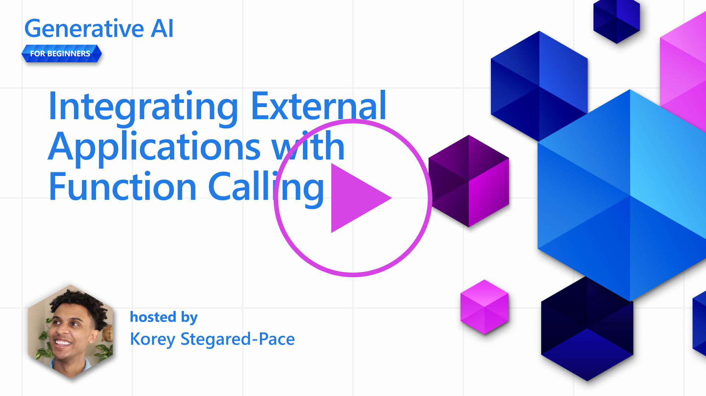

# 関数呼び出しとの統合



これまでのレッスンで、あなたはかなりのことを学んできた。しかし、さらに改善することは可能です。例えば、レスポンスを下流で扱いやすくするために、より一貫性のあるレスポンス・フォーマットを得るにはどうすればいいかということです。また、アプリケーションをさらに充実させるために、他のソースからのデータを追加したくなるかもしれません。 

以上のような問題を、この章では取り上げます。

> ビデオ近日公開予定

#はじめに

このレッスンでは以下のことを学びます：

- 関数呼び出しとは何か、その使用例について説明します。
- Azure OpenAIを使用したファンクションコールの作成。
- アプリケーションにファンクションコールを統合する方法。

## 学習目標

このレッスンを修了すると、以下のことができるようになります：

- 関数呼び出しを使用する目的を説明する。
- Azure Open AI サービスを使用したファンクションコールのセットアップ。
- アプリケーションのユースケースに効果的なファンクションコールを設計する。

## シナリオ: 関数を使ってチャットボットを改善する

このレッスンでは、私たちの教育スタートアップのために、ユーザーがチャットボットを使って技術コースを探せる機能を作りたいと思います。ユーザーのスキルレベル、現在の役割、興味のある技術に合ったコースを推薦します。

このシナリオを完成させるために、私たちは以下の組み合わせを使用します：

- `Azure Open AI` を使用して、ユーザーのチャット体験を作成します。
- `Microsoft Learn Catalog API`は、ユーザーのリクエストに基づいたコースの検索を支援する。
- ユーザーのクエリを受け取り、APIリクエストを行う関数に送信する`関数呼び出し`。

手始めに、そもそもなぜ関数呼び出しを使いたいのかを見てみましょう：

## なぜ関数呼び出しなのか

関数呼び出しが使われる以前は、LLMからのレスポンスは構造化されておらず、一貫性がありませんでした。開発者は、レスポンスの各バリエーションに対応できるように、複雑な検証コードを書く必要がありました。ユーザーは、"ストックホルムの現在の天気は？"のような回答を得ることができなかった。これは、モデルがデータを学習した時間に制限されていたためだ。

関数呼び出しは、以下の制限を克服するためのAzure Open AI Serviceの機能である：

- **一貫した応答フォーマット**。レスポンス形式をより適切に制御できれば、レスポンスをより簡単に他のシステムに統合できる。
- **外部データ**。アプリケーションの他のソースからのデータをチャットコンテキストで使用する能力。

## シナリオによる問題の説明

> 以下のシナリオを実行したい場合は、ファイル*Notebook.ipynb*を作成し、以下のコードを別々のコードセルに貼り付けることをお勧めします。また、関数が問題解決に役立つ問題を説明しようとしているので、そのまま読んでいただいても結構です。

レスポンスフォーマットの問題を説明する例を見てみましょう：

学生に適切なコースを提案するために、学生データのデータベースを作成したいとします。以下に、含まれるデータが非常に似ている2つの学生の説明があります。

1. Azure Open AIリソースへの接続を作成します：

   ```python
   import os
   import openai
   import json
   openai.api_type = "azure"
   openai.api_base = "YOUR OPENAI API BASE URL"
   openai.api_version = "2023-07-01-preview"
   openai.api_key = os.getenv("OPENAI_API_KEY")
   ```

   以下は Azure Open AI への接続を設定するための Python コードで、`api_type`, `api_base`, `api_version`, `api_key` を設定する。

1. 変数 `student_1_description` と `student_2_description` を使用して、2 つの生徒の説明を作成します。

   ```python
   student_1_description="エミリー・ジョンソンはデューク大学でコンピューター・サイエンスを専攻する2年生。GPAは3.7。同大学のチェス・クラブとディベート・チームのメンバーでもある。卒業後はソフトウェア・エンジニアリングの仕事に就きたいと考えている。"
  
   student_2_description = "マイケル・リーはスタンフォード大学でコンピューター・サイエンスを専攻する2年生。GPAは3.8。マイケルはプログラミングの腕前で知られ、大学のロボティクス・クラブのメンバーとして活躍している。学業を終えた後は、人工知能の分野で活躍したいと考えている。"
   ```

   上記の生徒の説明をLLMに送信し、データを解析したい。このデータは後で私たちのアプリケーションで使用することができ、APIに送信したり、データベースに保存したりすることができます。

1. 2つの同じプロンプトを作成し、LLMにどのような情報に興味があるかを指示します：

   ```python
   prompt1 = f'''
   与えられたテキストから以下の情報を抽出し、JSONオブジェクトとして返してください：

   名前
   専攻
   学校
   成績
   クラブ

   これは、情報を抽出するための本文です：
   {student_1_description}
   '''

   prompt2 = f'''
   与えられたテキストから以下の情報を抽出し、JSONオブジェクトとして返してください：

   名前
   専攻
   学校
   成績
   クラブ

   これは、情報を抽出するための本文です：
   {student_2_description}
   '''
   ```

   上記のプロンプトは、LLMに情報を抽出してJSON形式でレスポンスを返すよう指示する。

1. プロンプトと Azure Open AI への接続を設定したら、`openai.ChatCompletion` を使って LLM にプロンプトを送信します。 変数 `messages` にプロンプトを格納し、ロールを `user` に割り当てます。これはユーザーからのメッセージがチャットボットに書き込まれるのを模倣するためです。

   ```python
   # response from prompt one
   openai_response1 = openai.ChatCompletion.create(
     engine="gpt-function",    
     messages = [{'role': 'user', 'content': prompt1}]
   )
   openai_response1['choices'][0]['message']['content'] 

   # response from prompt two
   openai_response2 = openai.ChatCompletion.create(
     engine="gpt-function",
     messages = [{'role': 'user', 'content': prompt2 }]
   )
   openai_response2['choices'][0]['message']['content'] 
   ```

これで、LLMに両方のリクエストを送信し、`openai_response1['choice'][0]['message']['content']`のようにレスポンスを見つけることで受信したレスポンスを調べることができる。

1. 最後に、`json.loads`を呼び出してレスポンスをJSON形式に変換します：

   ```python
   # Loading the response as a JSON object
   json_response1 = json.loads(openai_response1['choices'][0]['message']['content'])
   json_response1
   ```

   Response 1:

   ```json
   {'name': 'Emily Johnson',
    'major': 'computer science',
    'school': 'Duke University',
    'grades': '3.7',
    'club': 'Chess Club'}
   ```

   Response 2:

   ```json
   {'name': 'Michael Lee',
    'major': 'computer science',
    'school': 'Stanford University',
    'grades': '3.8 GPA',
    'club': 'Robotics Club'}
   ```

   プロンプトは同じで、説明も似ているにもかかわらず、`Grades` プロパティの値は、例えば `3.7` や `3.7 GPA` のように異なるフォーマットで表示されることがあります。

   この結果は、LLMが構造化されていないデータをプロンプトの形式で受け取り、構造化されていないデータを返すためです。このデータを保存したり使用したりするときに何を期待すればよいかがわかるように、構造化されたフォーマットが必要です。

では、フォーマットの問題はどのように解決すればいいのだろうか？関数呼び出しを使えば、構造化されたデータを確実に受け取ることができる。関数呼び出しを使う場合、LLMは実際に関数を呼び出したり実行したりはしない。その代わりに、LLMがレスポンスに従うべき構造を作ります。そして、これらの構造化された応答を使用して、アプリケーションで実行する関数を決定します。 


そして、関数から返されたものをLLMに送り返す。LLMは自然言語を使ってユーザーの問い合わせに答える。

## 関数コールの使用例

ファンクションコールがアプリを改善する様々なユースケースがあります：

- **外部ツールの呼び出し**。チャットボットは、ユーザーからの質問に回答を提供するのに適しています。関数呼び出しを使用することで、チャットボットはユーザーからのメッセージを使用して特定のタスクを完了することができます。例えば、学生がチャットボットに「この科目でもっとサポートが必要だと講師にメールを送って」と頼むことができます。この場合、`send_email(to: string, body: string)`という関数を呼び出すことができます。

- **APIまたはデータベースクエリの作成**。ユーザーは自然言語を使って情報を見つけることができ、それはフォーマットされたクエリーやAPIリクエストに変換される。この例として、教師が "最後の課題を完了した学生は誰か "とリクエストした場合、`get_completed(student_name: string, assignment: int, current_status: string)`という関数を呼び出すことができる。

- **構造化データの作成**. ユーザーはテキストやCSVから重要な情報を抽出するためにLLMを使用することができます。例えば、平和協定に関するウィキペディアの記事をAIフラッシュカードに変換することができます。これは `get_important_facts(agreement_name: string, date_signed: string, parties_involved: list)` という関数を使うことでできる。

## 最初の関数コールの作成

ファンクションコールを作成するプロセスには、主に3つのステップがあります：

1. 関数のリストとユーザーメッセージでチャットの完了APIを呼び出す。
2. アクションを実行するために、モデルのレスポンスを読み込みます。
3. ユーザーへの応答を作成するためにその情報を使用するために、あなたの関数からの応答でチャットコンプリケーションAPIに別の呼び出しを行います。


### ステップ1 - メッセージの作成

最初のステップは、ユーザー・メッセージを作成することです。これはテキスト入力の値を取って動的に割り当てることもできますし、ここで値を割り当てることもできます。チャット完了 API を初めて使う場合は、メッセージの `role` と `content` を定義する必要があります。

`role` には `system` (ルール作成)、`assistant` (モデル)、`user` (エンドユーザー) のいずれかを指定します。関数呼び出しのために、ここでは `user` と質問例を指定する。

```python
messages= [ {"role": "user", "content": "Find me a good course for a beginner student to learn Azure."} ]
```

異なる役割を割り当てることで、LLMにとって、システムが何かを言っているのか、ユーザーが言っているのかが明確になり、LLMがそれを基に会話履歴を構築することができる。

### ステップ 2 - 関数の作成

次に、関数とそのパラメータを定義します。ここでは `search_courses` という関数を使用しますが、複数の関数を作成することも可能です。

> **重要** : 関数は LLM へのシステムメッセージに含まれ、利用可能なトークンの量に含まれます。

以下では、関数をアイテムの配列として作成します。各項目は関数であり、プロパティ `name`、`description`、`parameters` を持つ：

```python
functions = [
   {
      "name":"search_courses",
      "description":"Retrieves courses from the search index based on the parameters provided",
      "parameters":{
         "type":"object",
         "properties":{
            "role":{
               "type":"string",
               "description":"The role of the learner (i.e. developer, data scientist, student, etc.)"
            },
            "product":{
               "type":"string",
               "description":"The product that the lesson is covering (i.e. Azure, Power BI, etc.)"
            },
            "level":{
               "type":"string",
               "description":"The level of experience the learner has prior to taking the course (i.e. beginner, intermediate, advanced)"
            }
         },
         "required":[
            "role"
         ]
      }
   }
]
```

各関数インスタンスの詳細を以下に説明しよう：

- `name` - 呼び出したい関数の名前。
- `description` - 関数がどのように動作するかの説明。ここでは、具体的かつ明確であることが重要である。
- `parameters` - モデルがレスポンスとして返す値とフォーマットのリスト。パラメータ配列は項目で構成され、項目は以下のプロパティを持ちます：
   1. `type` - プロパティが格納されるデータ型。
   1. `property` - モデルがレスポンスに使用する特定の値のリスト。
      1. `name` - モデルがレスポンスで使用するプロパティの名前。
      1. `type` - このプロパティのデータ型。
      1. `description` - 特定のプロパティの説明。

オプションのプロパティ `required` - 関数呼び出しが完了するために必要なプロパティ。

### ステップ 3 - 関数の呼び出し

関数を定義したら、次はそれをチャット補完 API の呼び出しに含める必要があります。 これを行うには、リクエストに `functions` を追加します。この例では `functions=functions` とします。

また、`function_call` を `auto` に設定するオプションもあります。これは、どの関数を呼び出すべきかを自分で決めるのではなく、ユーザーメッセージに基づいてLLMに決定させることを意味する。

functions=functions` と `function_call="auto"` を設定することで、LLM に提供した関数を呼び出すタイミングを選択させていることに注意してください：

```python
response = openai.ChatCompletion.create( engine="gpt-function", 
                                        messages=messages, 
                                        functions=functions, 
                                        function_call="auto", ) 

print(response['choices'][0]['message'])
```

今、返ってきている返事はこんな感じだ：

```json
{
  "role": "assistant",
  "function_call": {
    "name": "search_courses",
    "arguments": "{\n  \"role\": \"student\",\n  \"product\": \"Azure\",\n  \"level\": \"beginner\"\n}"
  }
}
```

ここでは、JSON レスポンスの `arguments` プロパティに記載されているように、関数 `search_courses` がどのように呼び出され、どのような引数で呼び出されたかを見ることができる。

結論として、LLM はチャットの完了呼び出しで `messages` パラメータに提供された値からデータを抽出したため、関数の引数に適合するデータを見つけることができた。以下は `messages` の値の備忘録である：

```python
messages= [ {"role": "user", "content": "Find me a good course for a beginner student to learn Azure."} ]
```

ご覧のように、`student`、`Azure`、`beginner` が `messages` から抽出され、関数の入力として設定されている。このように関数を使用することで、プロンプトから情報を抽出するだけでなく、LLMに構造を持たせて再利用可能な機能を持たせることができる。

次に、私たちのアプリでこれをどのように使えるか見てみましょう。

## アプリケーションへの関数呼び出しの組み込み

LLMからのフォーマットされたレスポンスをテストしたら、今度はこれをアプリケーションに統合しましょう。

### フローの管理

これをアプリケーションに組み込むために、以下のステップを踏みましょう：

1. まず、Open AI サービスを呼び出し、`response_message` という変数にメッセージを格納します。

   ```python
   response_message = response["choices"][0]["message"]
   ```

1. Microsoft Learn APIを呼び出してコースのリストを取得する関数を定義します：

   ```python
   import requests

   def search_courses(role, product, level):
     url = "https://learn.microsoft.com/api/catalog/"
     params = {
        "role": role,
        "product": product,
        "level": level
     }
     response = requests.get(url, params=params)
     modules = response.json()["modules"]
     results = []
     for module in modules[:5]:
        title = module["title"]
        url = module["url"]
        results.append({"title": title, "url": url})
     return str(results)
   ```

   functions`変数に導入された関数名に対応する実際のPython関数をどのように作成しているかに注目してほしい。また、必要なデータを取得するために、実際に外部APIを呼び出している。このケースでは、トレーニングモジュールを検索するために Microsoft Learn API を使っています。

  さて、`functions`変数とそれに対応するPython関数を作成しましたが、LLMにこの2つをどのようにマッピングすればPython関数が呼び出されるようになるでしょうか？

1. Python関数を呼び出す必要があるかどうかを確認するには、LLMのレスポンスを調べて、`function_call`がその一部であるかどうかを確認し、指摘された関数を呼び出す必要があります。以下にその方法を示します：

   ```python
   # Check if the model wants to call a function
   if response_message.get("function_call"):
     print("Recommended Function call:")
     print(response_message.get("function_call"))
     print()

    # Call the function. 
    function_name = response_message["function_call"]["name"]

    available_functions = {
            "search_courses": search_courses,
    }
    function_to_call = available_functions[function_name] 

    function_args = json.loads(response_message["function_call"]["arguments"])
    function_response = function_to_call(**function_args)

    print("Output of function call:")
    print(function_response)
    print(type(function_response))


    # Add the assistant response and function response to the messages
    messages.append( # adding assistant response to messages
        {
            "role": response_message["role"],
            "function_call": {
                "name": function_name,
                "arguments": response_message["function_call"]["arguments"],
            },
            "content": None
        }
    )
    messages.append( # adding function response to messages
        {
            "role": "function",
            "name": function_name,
            "content":function_response,
        }
    )
   ```

   この3行で、関数名と引数を抽出し、呼び出しを行っている：

   ```python
   function_to_call = available_functions[function_name] 

   function_args = json.loads(response_message["function_call"]["arguments"])
   function_response = function_to_call(**function_args) 
   ```

   以下は、我々のコードを実行したときの出力である：

   **Output**

   ```Recommended Function call:
   {
     "name": "search_courses",
     "arguments": "{\n  \"role\": \"student\",\n  \"product\": \"Azure\",\n  \"level\": \"beginner\"\n}"
   }

   Output of function call:
   [{'title': 'Describe concepts of cryptography', 'url': 'https://learn.microsoft.com/training/modules/describe-concepts-of-cryptography/? 
   WT.mc_id=api_CatalogApi'}, {'title': 'Introduction to audio classification with TensorFlow', 'url': 'https://learn.microsoft.com/en- 
   us/training/modules/intro-audio-classification-tensorflow/?WT.mc_id=api_CatalogApi'}, {'title': 'Design a Performant Data Model in Azure SQL 
   Database with Azure Data Studio', 'url': 'https://learn.microsoft.com/training/modules/design-a-data-model-with-ads/? 
   WT.mc_id=api_CatalogApi'}, {'title': 'Getting started with the Microsoft Cloud Adoption Framework for Azure', 'url': 
   'https://learn.microsoft.com/training/modules/cloud-adoption-framework-getting-started/?WT.mc_id=api_CatalogApi'}, {'title': 'Set up the 
   Rust development environment', 'url': 'https://learn.microsoft.com/training/modules/rust-set-up-environment/?WT.mc_id=api_CatalogApi'}]
   <class 'str'> 
   ```

1. ここで、更新されたメッセージ `messages` を LLM に送信し、API の JSON フォーマットのレスポンスではなく、自然言語のレスポンスを受け取れるようにします。

   ```python
   print("Messages in next request:")
   print(messages)
   print()

   second_response = openai.ChatCompletion.create(
     messages=messages,
     engine="gpt-function",
     function_call="auto",
     functions=functions,
     temperature=0
        )  # get a new response from GPT where it can see the function response


   print(second_response["choices"][0]["message"])
   ```

   **Output**

   ```python
   {
     "role": "assistant",
     "content": "I found some good courses for beginner students to learn Azure:\n\n1. [Describe concepts of cryptography] (https://learn.microsoft.com/training/modules/describe-concepts-of-cryptography/?WT.mc_id=api_CatalogApi)\n2. [Introduction to audio classification with TensorFlow](https://learn.microsoft.com/training/modules/intro-audio-classification-tensorflow/?WT.mc_id=api_CatalogApi)\n3. [Design a Performant Data Model in Azure SQL Database with Azure Data Studio](https://learn.microsoft.com/training/modules/design-a-data-model-with-ads/?WT.mc_id=api_CatalogApi)\n4. [Getting started with the Microsoft Cloud Adoption Framework for Azure](https://learn.microsoft.com/training/modules/cloud-adoption-framework-getting-started/?WT.mc_id=api_CatalogApi)\n5. [Set up the Rust development environment](https://learn.microsoft.com/training/modules/rust-set-up-environment/?WT.mc_id=api_CatalogApi)\n\nYou can click on the links to access the courses."
   }

   ```

## 課題

Azure Open AI Function Callingの学習を継続するために、あなたはビルドすることができます：

- 学習者がより多くのコースを見つけられるように、関数のパラメーターを増やします。
- 学習者の母国語など、より多くの情報を取得する別の関数呼び出しを作成します。
- 関数呼び出しや API 呼び出しが適切なコースを返さなかった場合のエラー処理を作成する。

 ヒント: [Learn API reference documentation](https://learn.microsoft.com/training/support/catalog-api-developer-reference) ページに従って、このデータがどこでどのように利用できるかを確認してください。

## 素晴らしい仕事だ！旅を続ける

このレッスンを終えたら、[生成AI学習コレクション](https://aka.ms/genai-collection)をチェックして、生成AI知識のレベルアップを続けましょう！

レッスン12では、[AIアプリケーションのUXデザイン](../../../12-designing-ux-for-ai-applications/translations/ja/README.md)の方法を見ていきます！
