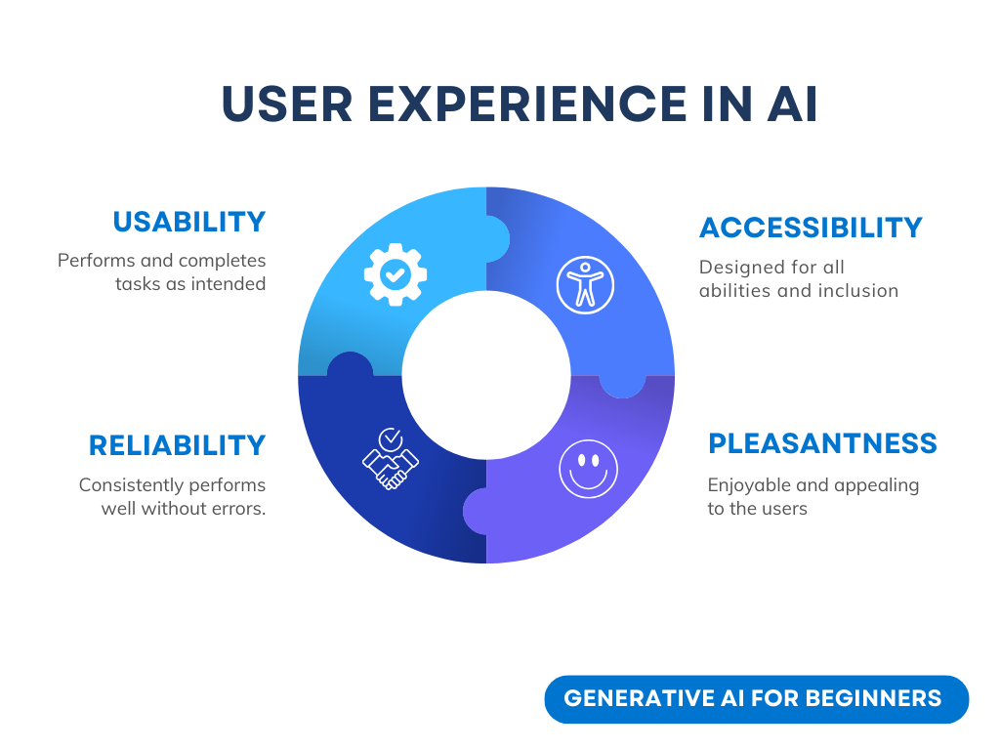
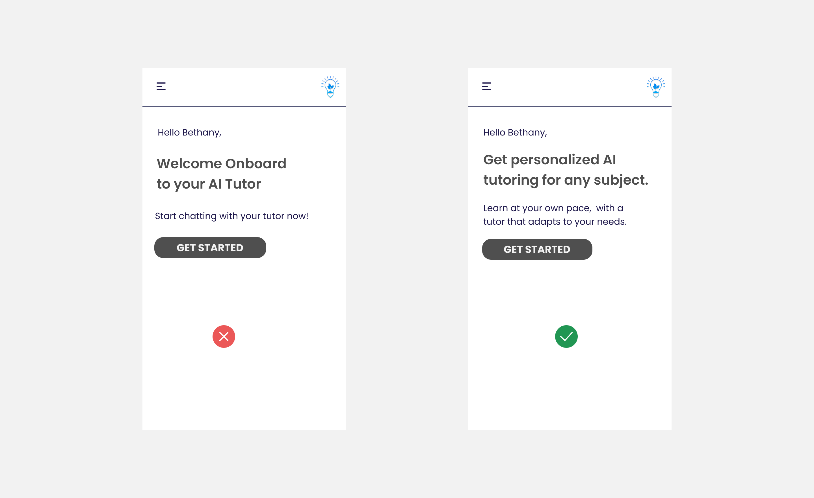
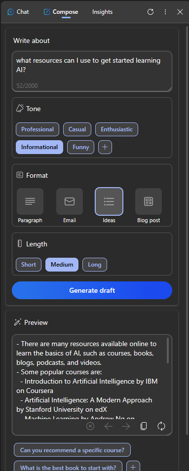
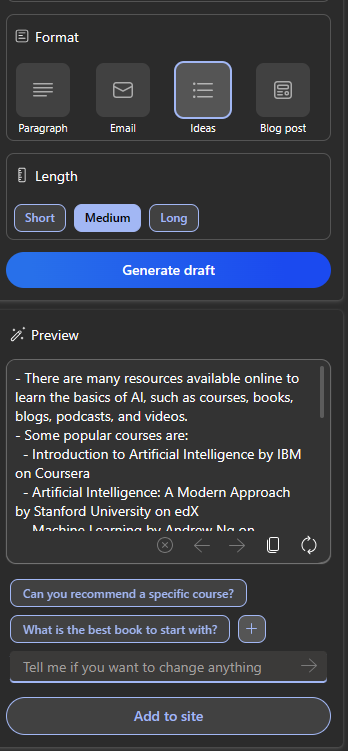
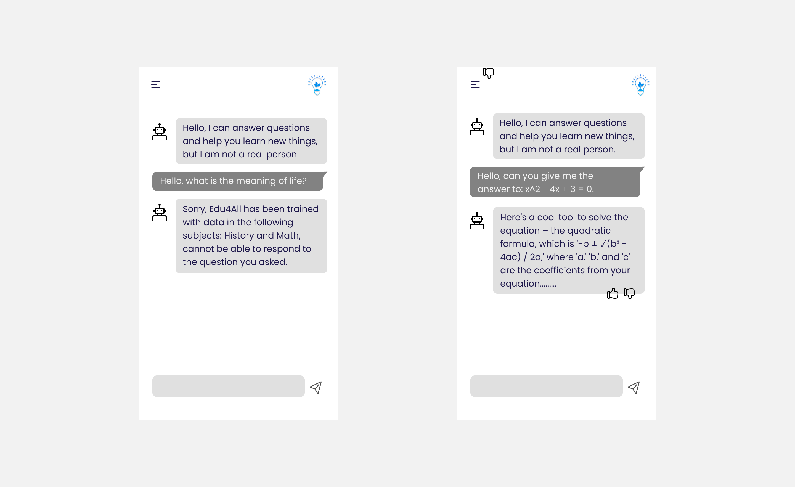

# AIアプリケーションのUXデザイン

> このレッスンのビデオを見るには上の画像をクリックしてください。

ユーザーエクスペリエンスは、アプリを構築する上で非常に重要な側面です。ユーザーは、タスクを実行するために効率的な方法でアプリを使用できる必要があります。効率的であることは1つのことですが、誰もが使えるようにアプリを設計する必要もあります。この章ではこの部分に焦点を当て、人々が使いやすく、使いたくなるようなアプリを設計できるようになることを目指します。

## はじめに

ユーザーエクスペリエンスとは、システム、ツール、デザインなど、ユーザーが特定の製品やサービスとどのように接し、利用するかということです。AIアプリケーションを開発するとき、開発者はユーザーエクスペリエンスが効果的であることを保証するだけでなく、倫理的であることも重視します。このレッスンでは、ユーザーのニーズに対応する人工知能（AI）アプリケーションの構築方法を取り上げます。

このレッスンでは、以下の分野を取り上げます：

* ユーザーエクスペリエンス入門とユーザーニーズの理解
* 信頼性と透明性のためのAIアプリケーションの設計
* コラボレーションとフィードバックのためのAIアプリケーションの設計

## 学習目標

このレッスンを受講すると、以下のことができるようになります：

* ユーザーニーズを満たすAIアプリケーションの構築方法を理解する。
* 信頼とコラボレーションを促進するAIアプリケーションを設計する。

### 前提条件

[ユーザーエクスペリエンスとデザイン思考](https://learn.microsoft.com/training/modules/ux-design)について、時間をかけて詳しく読む。

## ユーザーエクスペリエンスとユーザーニーズの理解入門

私たちの架空の教育スタートアップでは、教師と生徒という2つの主要なユーザーがいる。2人のユーザーはそれぞれ独自のニーズを持っています。ユーザー中心のデザインは、製品が対象者にとって適切で有益であることを保証するために、ユーザーを優先します。

アプリケーションは、良いユーザー体験を提供するために、**便利で、信頼でき、アクセスしやすく、快適である**べきです。

### ユーザビリティ

有用であるということは、アプリケーションが、採点プロセスを自動化したり、復習用のフラッシュカードを生成したりするなど、意図された目的に合致した機能を備えていることを意味します。採点プロセスを自動化するアプリケーションは、事前に定義された基準に基づいて、学生の課題に正確かつ効率的に得点を割り当てることができなければなりません。同様に、復習用フラッシュカードを作成するアプリケーションは、データに基づいて適切で多様な問題を作成できなければなりません。

### 信頼性

信頼性が高いとは、アプリケーションがエラーなく一貫してタスクを実行できることを意味します。しかし、人間と同じようにAIも完璧ではなく、エラーを起こしやすいかもしれません。アプリケーションがエラーや予期せぬ状況に遭遇し、人間の介入や修正が必要になることもある。どのようにエラーに対処するのでしょうか？このレッスンの最後のセクションでは、AIシステムやアプリケーションがコラボレーションやフィードバックのためにどのように設計されているかを取り上げます。

### アクセシビリティ

アクセシブルであることは、障害を持つユーザーを含む様々な能力を持つユーザーにユーザーエクスペリエンスを拡大し、誰も取り残されないようにすることを意味します。アクセシビリティのガイドラインと原則に従うことで、AIソリューションはより包括的で使いやすくなり、すべてのユーザーにとって有益になります。

### 快適であること

快適であることは、アプリケーションが楽しく使えることを意味する。魅力的なユーザーエクスペリエンスは、ユーザーにポジティブな影響を与え、アプリケーションへの再訪を促し、ビジネス収益を増加させます。

すべての課題をAIで解決できるわけではありません。AIは、手動タスクの自動化であれ、ユーザー体験のパーソナライズであれ、ユーザー体験を補強するために登場する。

## 信頼と透明性のためのAIアプリケーションの設計

AIアプリケーションを設計する際、信頼の構築は非常に重要だ。信頼は、アプリケーションが仕事をこなし、一貫した結果を提供し、その結果がユーザーが必要とするものであることをユーザーが確信できるようにする。この分野におけるリスクは、不信と過剰な信頼である。不信は、ユーザーがAIシステムをほとんど、あるいは全く信頼していない場合に発生し、ユーザーがアプリケーションを拒否することにつながります。過信は、ユーザーがAIシステムの能力を過大評価し、ユーザーがAIシステムを信頼しすぎることにつながる場合に発生する。例えば、自動採点システムが過信された場合、教師は採点システムがうまく機能していることを確認するために、論文の一部を校正しないかもしれない。その結果、生徒の成績が不公平または不正確になったり、フィードバックや改善の機会を逃したりする可能性がある。

信頼を設計の中心に据えるための2つの方法は、説明可能性と管理です。

### 説明可能性

AIが将来の世代に知識を与えるなどの意思決定に役立つ場合、教師や保護者にとって、AIの意思決定がどのように行われるかを理解することは非常に重要である。これが説明可能性であり、AIアプリケーションがどのように意思決定を行うかを理解することである。説明可能性のための設計には、AIアプリケーションができることの例の詳細を追加することが含まれます。例えば、"Get started with AI teacher "の代わりに、次のような使い方ができる： 「AIを使ってノートを要約し、復習しやすくする。」

もうひとつの例は、AIがユーザーや個人データをどのように利用するかということだ。例えば、学生というペルソナを持つユーザーには、そのペルソナに基づく制限があるかもしれない。AIは質問に対する答えを明らかにすることはできないかもしれないが、ユーザーが問題を解決する方法を考える手助けをするかもしれない。

説明可能性の最後の重要な部分は、説明を単純化することです。学生や教師はAIの専門家ではないかもしれないので、アプリケーションができること、できないことの説明は簡略化され、理解しやすいものでなければなりません。

### コントロール

生成AIはAIとユーザーとのコラボレーションを生み出し、例えばユーザーは異なる結果を得るためにプロンプトを修正することができる。さらに、いったん出力が生成されると、ユーザーはその結果を変更できるようにすることで、コントロールの感覚を与えることができる。例えば、Bingを使用する場合、形式、トーン、長さに基づいてプロンプトを調整することができます。さらに、以下のように出力に変更を加えて、出力を修正することができます：

 "プロンプトと出力を変更するオプションがあるBingの検索結果"

ユーザーがアプリケーションをコントロールできるようにするBingのもう一つの機能は、AIが使用するデータのオプトインとオプトアウトの機能である。学校でのアプリケーションの場合、生徒は自分のノートだけでなく、教師のリソースも復習資料として使いたいと思うかもしれない。

 

"プロンプトと出力を変更するオプションを持つBingの検索結果"

> AIアプリケーションを設計する際、ユーザーがAIに非現実的な期待を抱かないようにするためには、意図的であることが重要です。そのための1つの方法は、プロンプトと結果の間に摩擦を生み出すことだ。これはAIであり、仲間ではないことをユーザーに思い出させる。

## コラボレーションとフィードバックのためのAIアプリケーションの設計

先に述べたように、生成AIはユーザーとAIとのコラボレーションを生み出す。多くの場合、ユーザーはプロンプトを入力し、AIは出力を生成する。もし出力が間違っていたら？エラーが発生した場合、アプリケーションはどのように対処するのだろうか？AIはユーザーを責めるのか、それとも時間をかけてエラーを説明するのか？

AIアプリケーションは、フィードバックを受け取り、与えるように組み込まれるべきである。これはAIシステムの改善に役立つだけでなく、ユーザーとの信頼関係を築くことにもなる。フィードバック・ループを設計に含めるべきで、例としては、出力に対して単純に親指を立てるか立てないかである。

もうひとつの対処法は、システムの能力と限界を明確に伝えることだ。ユーザーがAIの能力を超える何かを要求してエラーを起こした場合、以下のように対処する方法もあるべきです。

システムエラーは、ユーザーがAIの範囲外の情報について支援を必要としたり、ユーザーが要約を生成できる質問／主題の数に制限があるようなアプリケーションではよくあることです。例えば、歴史や数学などの限られた科目のデータで訓練されたAIアプリケーションは、地理に関する質問を処理できない可能性があります。これを軽減するために、AIシステムは次のような応答を返すことができる： 「申し訳ありませんが、私たちの製品は以下の科目のデータで訓練されているため、ご質問の内容にはお答えできません。

AIアプリケーションは完璧ではないため、間違いを犯す可能性がある。アプリケーションを設計する際には、ユーザーからのフィードバックやエラー処理の余地を、シンプルで簡単に説明できる方法で確保する必要があります。

## 課題

これまでに作ったAIアプリを例に、以下のステップをアプリに実装することを検討しなさい：

* アプリをより快適にする方法を考えてみましょう。あなたのアプリをより快適にする方法を考えてみてください。エラーメッセージをどのように表現していますか？

* ウェブアプリを構築すること。あなたのアプリがマウスとキーボードの両方で操作可能であることを確認してください。

* AIとそのアウトプットを完全に信頼するのではなく、アウトプットを検証するために人間をプロセスに加える方法を検討してください。また、信頼と透明性を達成するための他の方法を検討し、実装してください。

* ユーザーがアプリケーションに提供するデータをコントロールできるようにしましょう。ユーザーがAIアプリケーションのデータ収集をオプトイン、オプトアウトできる方法を実装する。

## おめでとうございます。

このレッスンを修了したら、[生成AI学習コレクション](https://aka.ms/genai-collection)をチェックして、生成AI知識のレベルアップを続けてください！

おめでとうございます！ここで学習を終えてはいけません。あなた自身の生成AIスタートアップの構築を開始する気になったことでしょう。[Microsoft Founders Hub](https://aka.ms/genai-foundershub)に向かい、プログラムに申し込んで、あなたの旅のサポートを受けましょう。
