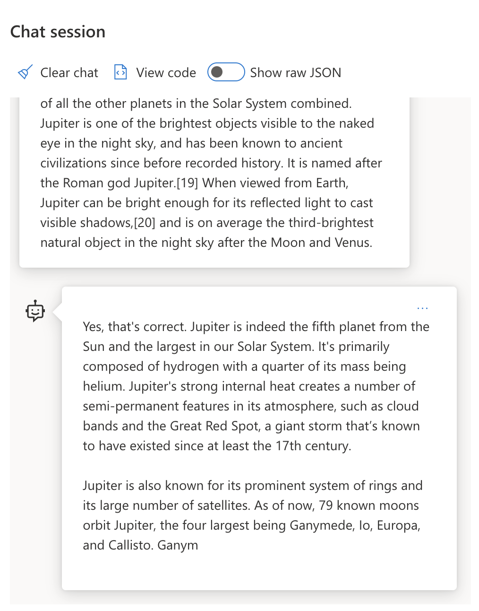

<!--
LESSON TEMPLATE:
This unit should cover core concept #1.
Reinforce the concept with examples and references.

CONCEPT #1:
Prompt Engineering.
Define it and explain why it is needed.
-->

Let's kick off our learning journey by answering three key questions:
 - What is Prompt Engineering? (definition)
 - Why do we need Prompt Engineering? (motivation)
 - How is Prompt Engineering used today? (case study)

## 4.1.1 What is Prompt Engineering?

We know that Large Language Models (LLM) like OpenAI's GPT-3, GPT3.5 and GPT-4 are _prompt-based_. They take a text input (**prompt**) and return a text output (**completion**) that should meet the desired user objective for a given model's capabilities.

**Prompt Engineering** is the process of _designing and optimizing_ these prompts so that the user gets reliable and relevant responses from the model, when using our application. You can think of prompt engineering as a combination of prompt _design_ (constructing the initial prompt) and prompt _tuning_ (refining the prompt iteratively & evaluating quality) till the response meets the desired user or application objective.

To understand _why_ prompt engineering matters, we need to understand _how_ LLMs process prompts. Let's talk briefly about three concepts:
 - _Tokenization_ = how the prompt is "seen" by the model
 - _Base LLMs_ = how the default LLM "responds" to prompts
 - _Instruction-Tuned LLMs_ = how the LLM is "fine-tuned" for tasks

### Concept 1: Tokenization

Models view prompts (input text) as a **sequence of tokens**. Different models, or different versions (of the same model) can _tokenize_ the prompt in slightly different ways. Since prompts "program" the models, the tokenization process can influence response quality.

To get an intuitive sense of what tokenization means, use the [OpenAI Tokenizer](https://platform.openai.com/tokenizer) tool and copy in a prompt from one of their [Examples](https://platform.openai.com/examples). For example - I copied the `User` prompt text from the [Summarize for a 2nd Grader](https://platform.openai.com/examples/default-summarize) example into the tool to get this result.

The tool uses GPT-3 (older model) so newer models may have improved rules, but the _principle remains the same_. Pay attention to how tokens are created - for example, how whitespaces and punctuation marks are handled. LLMs typically have token limits (#tokens they can process in a single interaction) so one aspect of prompt design is to ensure that we _optimize prompts_ for token usage.

### Concept 2: Base LLMs

Once a prompt is tokenized, the primary function of ["Base LLMs"](https://blog.gopenai.com/an-introduction-to-base-and-instruction-tuned-large-language-models-8de102c785a6) is to predict the next word in that sequence. Since LLMs are trained on massive text datasets, they have good insights into the statistical relationships between tokens and can predict _the next likely token_ in that sequence with some confidence. 

Note that LLMs don't understand the _meaning_ of prompts or tokens. They just **complete** an input sequence by predicting the next likely token - and can continue this process until terminated by some condition or by user intervention.

To get an intuitive sense of how this works, enter the prompt from the above example into the Azure OpenAI Studio [_Chat Playground_](https://oai.azure.com/playground) without any other context. You'll see something like this - with the AI continuing the completions till you terminate it manually. Note how this is providing relevant information _but does not serve any specific user objective_.

### Concept 3: Instruction Tuned LLMs

An [Instruction Tuned LLM](https://blog.gopenai.com/an-introduction-to-base-and-instruction-tuned-large-language-models-8de102c785a6) starts with a base LLM, then fine-tunes it with "input/output pairs that include instructions and attempts to follow those instructions".  This uses techniques like Reinforcement Learning with Human Feedback (RLHF) that can train the model to _follow instructions_ and _learn from feedback_ so that it produces responses that are better-suited to practical applications and more-relevant to user objectives.

To get an intuitive sense of how this works, revisit the prompt example above but now, let's add a _system message_ like this, to instruct the model on what we want it to do.
> Summarize content you are provided with for a second-grade student. Keep the result to one paragraph with 3-5 bullet points.

The model now sees the prompt as two parts - user _content_ and system _instructions_ - and produces a response that is better suited to the user and application needs. For instance, an educator can now use the results in a slide presentation to a 2nd grade class.

## 4.1.2 Why do we need Prompt Engineering?

Now that we know how prompts are processed by LLMs, let's talk about _why_ we need prompt engineering. The answer lies in the fact that current LLMs pose a number of challenges that make _reliable and consistent completions_ more challenging to achieve without putting effort into prompt construction and optimization. For instance:

1. **Model responses are stochastic.** The _same prompt_ will likely produce different responses with different models or model versions. And it may even produce different results with the _same model_ at different times. _Prompt engineering techniques can help us minimize these variations by providing better guardrails_.

1. **Models can hallucinate responses.** Models are pre-trained with _large but finite_ datasets, meaning they lack knowledge about concepts outside that training scope. As a result, they can produce completions that are inaccurate, imaginary, or directly contradictory to known facts.  _Prompt engineering techniques help users identify and mitigate hallucinations e.g., by asking AI for citations or reasoning_.

1. **Models capabilities will vary.** Newer models or model generations will have richer capabilities but also bring unique quirks and tradeoffs in cost & complexity. _Prompt engineering can help us develop best practices and workflows that abstract away differences and adapt to model-specific requirements in scalable, seamless ways_.

Want to get an intuitive sense for how each challenge impacts the completion response? 
 - Try using the same prompt with different LLM deployments (e.g, OpenAI , Azure OpenAI, Hugging Face) - did you see the variations?.
 - Try using the same prompt repeatedly with the _same_ LLM deployment (e.g., Azure OpenAI playground) - how did these variations differ?

### Hallucinations Example

Want to get a sense of how hallucinations work? Think of a prompt that instructs the AI to generate content for a non-existent topic (to ensure it is not found in the training dataset). For example - I tried this prompt:
> **Prompt:** generate a lesson plan on the Martian War of 2076.

A web search showed me that there were fictional accounts (e.g., television series or books) on Martian wars - but none in 2076. Commonsense also tells us that 2076 is _in the future_ and thus, cannot be associated with a real event. 

So what happens when we run this prompt with different LLM providers?

> **Response 1**: OpenAI Playground (GPT-35)

> **Response 2**: Azure OpenAI Playground (GPT-35)

> **Response 3**: : Hugging Face Chat Playground (LLama-2)

As expected, each model (or model version) produces slightly different responses thanks to stochastic behavior and model capability variations. For instance, one model targets an 8th grade audience while the other assumes a high-school student. But all three models did generate responses that could convince an uninformed user that the event was real

Prompt engineering techniques like _metaprompting_ and _temperature configuration_ may reduce model hallucinations to some extent. Prompt engineering _architectures_ are now being developed, allowing research and tooling solutions to be incorporated seamlessly into the prompt flow, to improve model accuracy and mitigate hallucinations.

## 4.1.3 Case Study: GitHub Copilot

Let's wrap this section by getting a sense for how prompt engineering is used in real-world solutions by looking at one Case Study: [GitHub Copilot](https://github.com/features/copilot).

GitHub Copilot is your "AI Pair Programmer" - it converts text prompts into code completions and is integrated into your development environment (e.g., Visual Studio Code) for a seamless user experience. As documented in the series of blogs below, the earliest version was based on the OpenAI Codex model - with engineers quickly realizing the need to fine-tune the model and develop better prompt engineering techniques, to improve code quality. Read the posts in order, to follow their learning journey.

- **May 2023** | [GitHub Copilot is Getting Better at Understanding Your Code](https://github.blog/2023-05-17-how-github-copilot-is-getting-better-at-understanding-your-code/)
- **May 2023** | [Inside GitHub: Working with the LLMs behind GitHub Copilot](https://github.blog/2023-05-17-inside-github-working-with-the-llms-behind-github-copilot/).
- **Jun 2023** | [How to write better prompts for GitHub Copilot](https://github.blog/2023-06-20-how-to-write-better-prompts-for-github-copilot/).
- **Jul 2023** | [A Developer's Guide to Prompt Engineering and LLMs](https://github.blog/2023-07-17-prompt-engineering-guide-generative-ai-llms/) 
- **Sep 2023** | [How to build an enterprise LLM app: Lessons from GitHub Copilot](https://github.blog/2023-09-06-how-to-build-an-enterprise-llm-application-lessons-from-github-copilot/)

You can also browse their [Engineering blog](https://github.blog/category/engineering/) for more posts like [this one](https://github.blog/2023-09-27-how-i-used-github-copilot-chat-to-build-a-reactjs-gallery-prototype/) that shows how these models and techniques are _applied_ for driving real-world applications.
