By now we've learned that **Generative AI** is a category of artificial intelligence capable of _generating new content_ (e.g., images, text, audio, code), based on pre-trained models, in response to a natural language input or **prompt**.  

We also know that **Large Language Models (LLM)** are a type of generative AI that are trained on massive quantities of text data and specialize in natural language processing (NLP) tasks at scale. Popular LLMs include [GPT-4](https://openai.com/gpt-4) from OpenAI, [BERT](https://github.com/google-research/bert) from Google, and [Llama-2](https://ai.meta.com/llama/) from Meta. 

The in turn is enabling new enterprise-grade LLM applications like [GitHub Copilot](https://github.com/features/copilot) - based on the [OpenAI Codex model](https://openai.com/blog/openai-codex) that translates natural language into code and was [built in partnership with GitHub](https://github.blog/2023-05-17-inside-github-working-with-the-llms-behind-github-copilot/). Now, developers can use GitHub Copilot in their IDE to generate code using text inputs through an inline dialog, or an integrated chat interface.

The key to building these applications is in **crafting effective prompts**, the text-based inputs to the Generative AI model that are transformed into the required image, text, audio, or code output.

## Introduction

In this lesson, we'll learn why _prompt design_ matters, understand what _prompt engineering_ means, explore _prompt examples_ with real-world applications for our education startup, and discuss _popular techniques_ for crafting effective prompts in your own projects.

## Learning Goals

By the end of this lesson, you will be able to:
- Describe what prompt engineering is, and why it matters.
- Give examples of well-designed prompts for real-world applications.
- Apply popular techniques for crafting effective prompts in your own projects.
- Build & validate prompts in a GitHub Codespaces enabled Jupyter Notebook.

## What is Prompt Engineering?

Prompt engineering is the process of _designing and optimizing prompts_ for Generative AI models, for more relevant and reliable application experiences. It is an emerging field of study driven by the rapid adoption of LLMs in enterprise-scale applications. Prompt engineering has multiple facets:
 - Prompt _design_ which we can think of as the process of "writing good prompts" that guide the model to produce the desired output for our applications.
 - Prompt _optimization_ which we can think of as the process of "tuning prompts" to improve the model's performance over time.

So why do we need prompt engineering? It turns out that LLMs are great at generating content, but they don't actually _understand_ the context or meaning of the content they generate. Some related challenges:
 - Model responses are _stochastic_. This means that the same model can produce different results for the same prompt - which creates user confusion.
 - Models can _hallucinate_ responses. This means models can produce responses that are inaccurate, nonsensical, or contradictory to facts - which dilutes user trust.
 - Model capabilities _vary_. Each model has its own quirks, causing the same prompt to be interpreted differently by different models - giving inconsistent user experiences.
 
Prompt engineering is a way to address these challenges, by guiding the model to produce more relevant and reliable results. It is about _optimizing a prompt for a given generative AI model and a desired application goal_ so that we deliver relevant and reliable experiences to our users.

## Prompt Design By Example

Before we dive into techniques for effective prompt design, let's look at some examples of prompts for real-world applications. We'll first explore text-based prompts _with the same model_ but different application domains. Then we'll use the same prompt _with different models_ to see how the results vary.

### Optional | Try it yourself!
At the end of this lesson, we'll teach you how to use a GitHub Codespaces enabled Jupyter Notebook to build and validate prompts for your own projects, with an OpenAI API key. 

For now, let's try these prompts on the [OpenAI Playground](https://beta.openai.com/playground) to see the results - here's what that looks like. Note:
 - This interface allows you to tune _LLM hyperparameters_ like temperature, frequency penalty etc. [Scan this article](https://txt.cohere.com/llm-parameters-best-outputs-language-ai/) for a quick explanation of what they do. We'll cover these in a future lesson.
 - The application indicates that default model training data cuts off in 2021. We'll look at how this impacts the results in one of our examples.

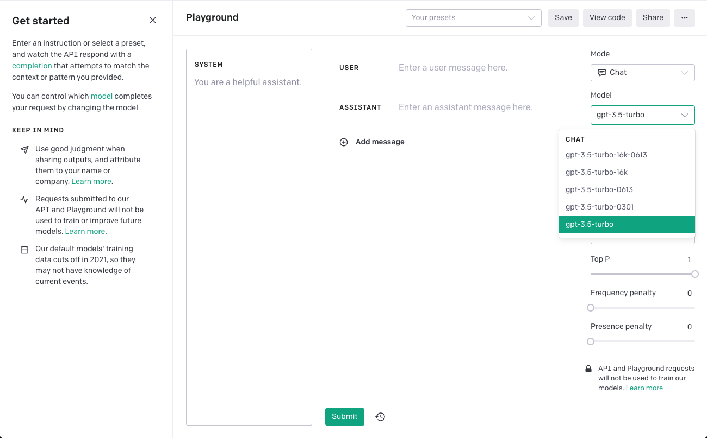

Remember that we are working on an application for an education startup - so let's think about prompts in the context of that application.

### Exercise 1 | Try Basic Prompts

Let's start with a simple open-ended question that we might ask a chatbot for our education startup. _The response is relevant - but kinda lengthy.I just want the big picture. Let's refine the prompt!_

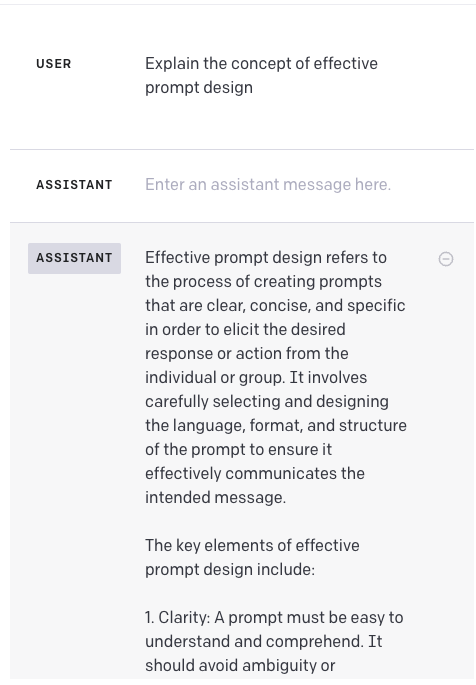

Let's ask it to limit the length to 3 sentencees. _This is much better aligned to what I wanted!_

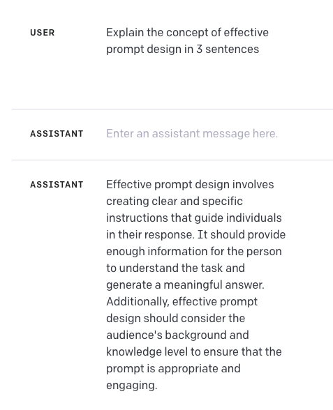

This is great - my text input generated a text output. How does it do with code? Let's ask it to generate a Python function for a very well-known problem. _Hmm! I am not a Python programmer but it feels like a valid response, right?_

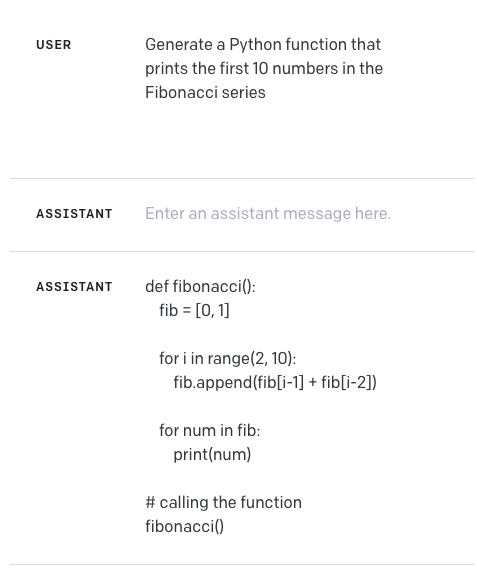

### Exercise 2 | Try Preset Prompts (Open AI)

What else can we do with prompts? Turns out we can do many things like _text summarization, content generation, code generation,text transformation_ and more. The [Open AI Examples](https://platform.openai.com/examples) page is a great resource to explore prompts for different application categories.

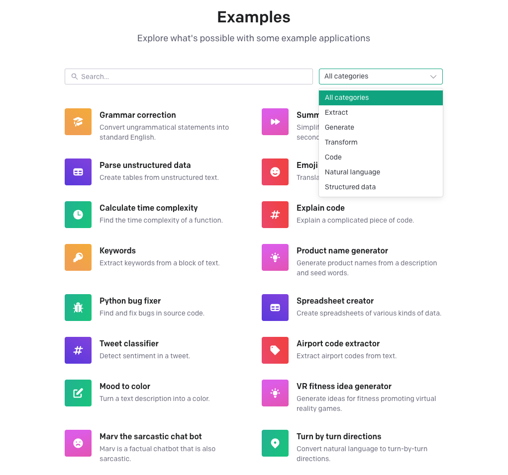

This one looks interesting - pick the `Summarize for a 2nd grader` example. You can copy this manually into the playground - or you can simply click _Launch Playground_ to get the result.

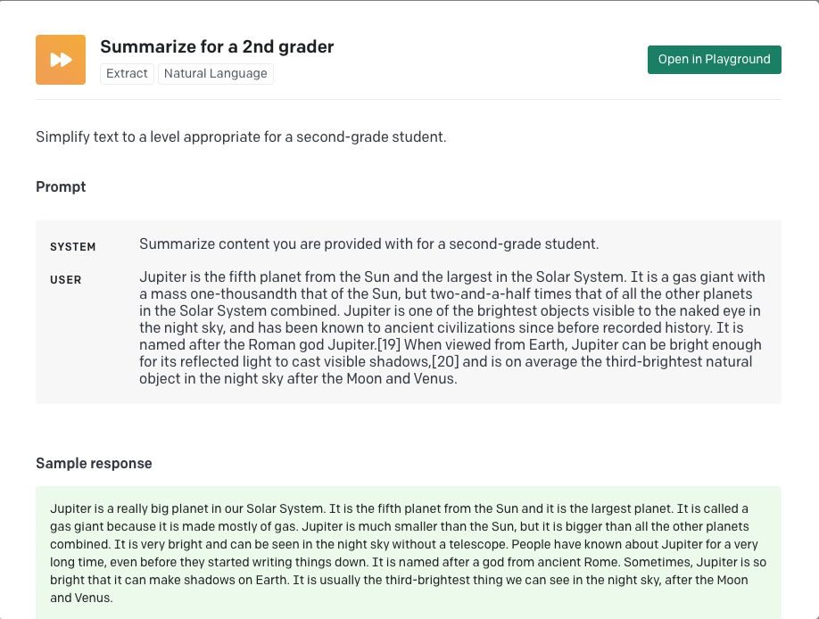

And here is what that result looks like when you run it in the current OpenAI playground. _Note how this now has content in the `System` and `User` input sections of the application_. This is one technique for effective prompt engineering - providing context with a _System_ prompt, and instructions for the output response with a _User_ prompt.

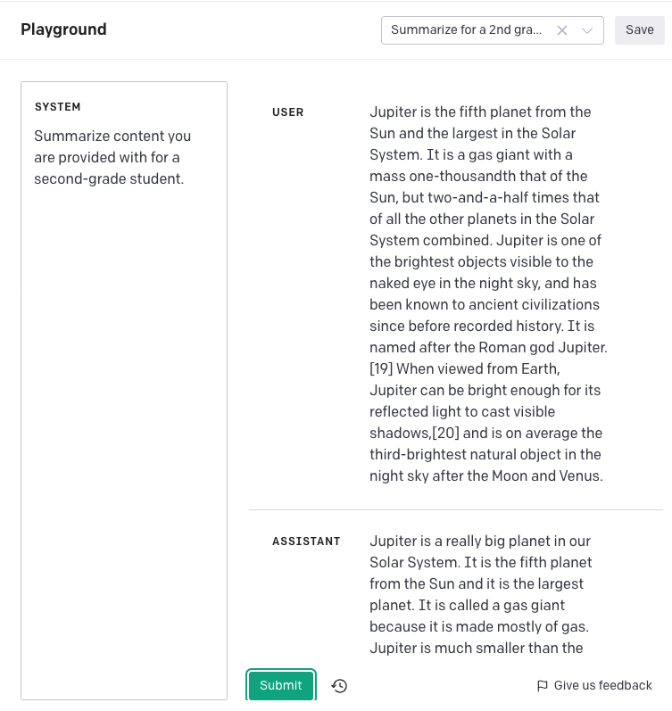

### Exercise 3 | Try different LLM App (GitHub Copilot)

Now let's look at what happens when we try the same prompts with a _different LLM application_ that is build on a different LLM (or a customized version of it for that domain). We'll use GitHub Copilot for this purpose - if you want to follow along, install the GitHub Copilot Chat extension and activate it now.

Let's try the same basic prompt. Contrast this to the response from the OpenAI playground. Note how the response is not only shorter, but is more technical in tone with focus on _accuracy and relevance_.

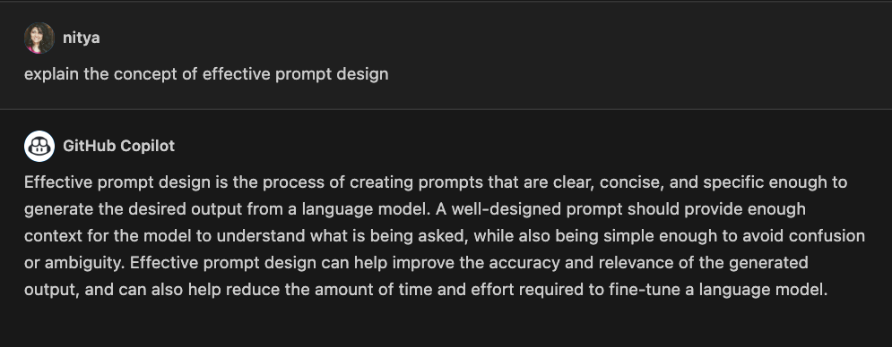

Let's try refining that prompt like before. Much nicer - also note how the response here contextualizes this with _improve the quality of generated code_ as the first priority.

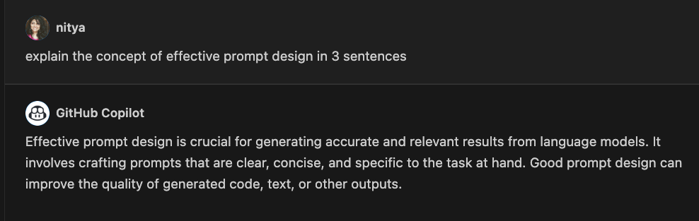

We saw that the _same prompt_ generates different responses with different LLM apps. What if we used the same prompt on the _same LLM app_ for a redo? The response should be the same, right? _Not quite!_ This highlights the stochastic nature of these models, and underscores why prompt engineering is important. To get more consistent results, we need to iteratively _refine_ our prompts to improve the model's performance.

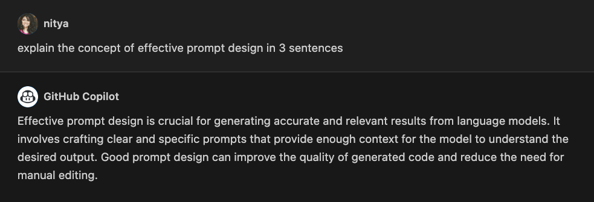

Let's try the code example here. _Note how the response is cleaner and promotes reuse, with a focus on readability and maintainability_. GitHub Copilot is tuned for code generation, and we can see the impact in the quality of the response.

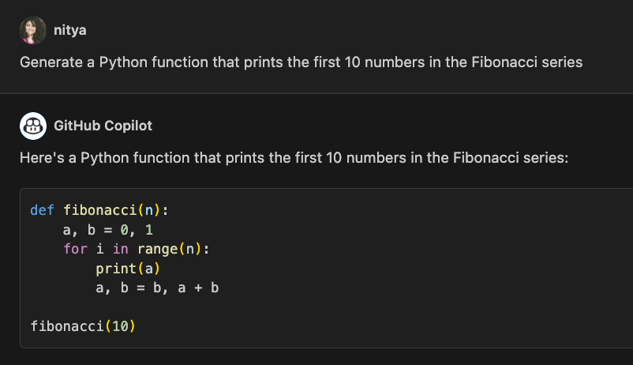

Let's now talk about Prompt Engineering Techniques.

## Prompt Engineering Techniques

These examples demonstrate the _need_ for prompt engineering, but how do we actually _do_ it? At a high level, the process involves three things:

- **Domain Understanding** - Use your knowledge of the application domain to _craft_ prompts with better context e.g., use system and user prompts.
- **Model Understanding** - Use your knowledge of the LLM model to _tune_ prompts for the features, capabilities, and limitations of each model.
- **Iterate and Validate** - Prompt engineering is more art than science. Use a trial-and-error approach applying various best practices _along with your own intuition_ till the result meets your expectations. And document your process for future reference.

So what are some specific examples of techniques we can start with _for basic prompt engineering_? Let's look at the [best practices recommended by the OpenAI team](https://help.openai.com/en/articles/6654000-best-practices-for-prompt-engineering-with-openai-api) - though described for Open AI, they can be applied to other LLMs as well.
 * _Use the latest models._ Not only does every generation of the LLM improve its own accuracy and performance, it is also likely to be trained on more recent data - improving its relevance to current scenarios.
 * _Separate instructions from context_. For instance, we can use a _System_ prompt to provide context for the model, and a _User_ prompt to provide instructions for the output response. The LLM may also define _special tokens_ you can use as delimiters for these prompts.
 * _Be specific and clear_. Try to provide more details about the desired context, outcome, length, format, style etc. Not only will this result in responses that meet your needs, they are also likely to be more consistent.
 * _Use more examples_. Models may respond better to a "show and tell" approach. Start with a `zero-shot` approach where you give it an instruction (but no examples) then try `few-shot` as a refinement, providing a few examples of the desired output.
 * _Use leading words to guide model_. Nudge it towards a desired outcome by giving it some leading words or phrases that it can use as a starting point for the response.

There are more advanced techniques that we will talk about in the next lesson - including **Chain of Thought Prompting**, **Prompt Templating** and more.

## Prompt Engineering Exercise

Let's try a simple exercise that demonstrates the value of providing both _context_ (system prompt) and _instructions_ (user prompt) to the model.

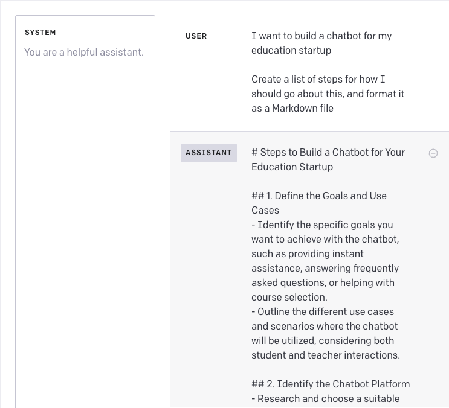

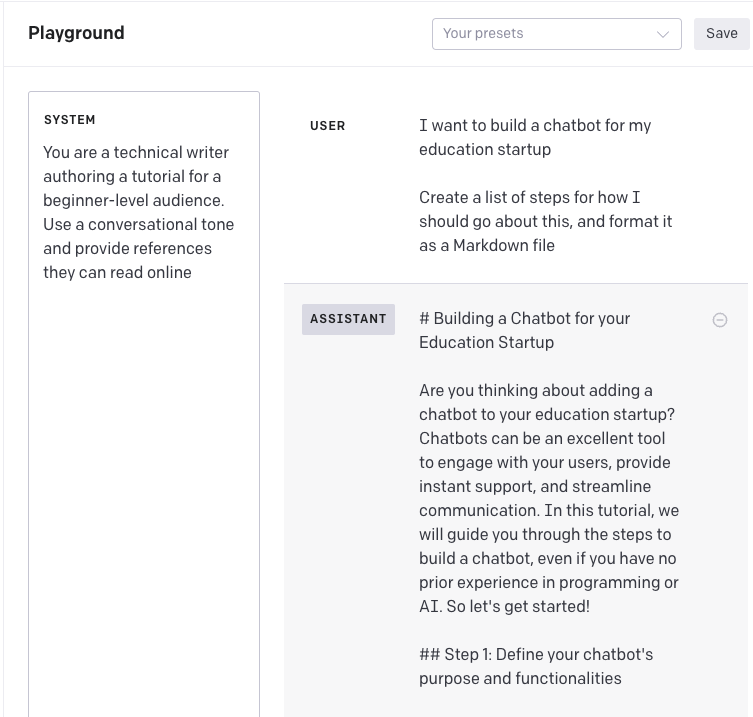

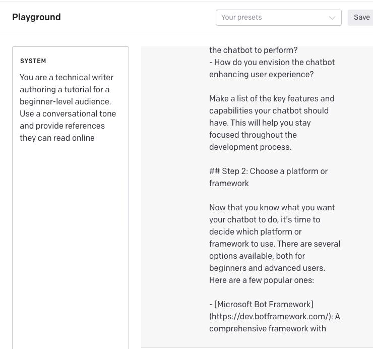

## Prompt Engineering: Hallucination

Let's try a simple exercise that demonstrates the challenges of _prompt hallucination_ by asking the model a question that can only be answered by data after 2021 (the model's cutoff date).

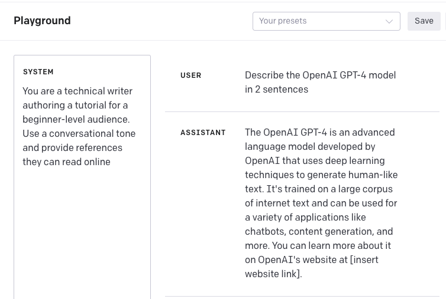

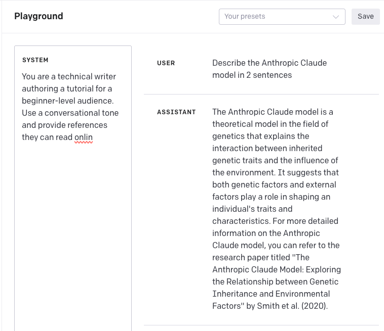

## Code Challenge: Design Prompts for OpenAI models

## Code Solution

## Additional Resources

 - [Prompt Engineering: How to talk to the AIs](https://www.linkedin.com/learning/prompt-engineering-how-to-talk-to-the-ais/talking-to-the-ais?u=0) (Apr 2023, LinkedIn Learning)
 - [Prompt Engineering 201](https://amatriain.net/blog/prompt201) - Advanced Methods and Toolkits (2023)
 - [ChatGPT Prompt Engineering For Developers](https://www.deeplearning.ai/short-courses/chatgpt-prompt-engineering-for-developers/) - DeepLearning.AI Short Course (2023)
 - [Apply Prompt Engineering with Azure Open AI](https://learn.microsoft.com/en-us/training/modules/apply-prompt-engineering-azure-openai/) - Microsoft Learn Module (2023)
- [Prompt Engineering Overview: Semantic Kernel](https://learn.microsoft.com/en-us/semantic-kernel/prompt-engineering/) (May 2023)
- [Advanced Prompt Engineering Techniques for LLMs](https://tungmphung.com/advanced-yet-simple-prompt-engineering-techniques-for-large-language-models/) (Apr 2023)
- [Azure OpenAI for Education Prompts](https://techcommunity.microsoft.com/t5/education-blog/azure-openai-for-education-prompts-ai-and-a-guide-from-ethan-and/ba-p/3938259) (Sep 2023)
- [Prompts For Education: Prompt Library](https://github.com/microsoft/prompts-for-edu) (Sep 2023)
- [LLM Parameters Demystified: Getting The Best Outputs from Language AI](https://txt.cohere.com/llm-parameters-best-outputs-language-ai/) (Jun 2022)
- [Best Practices for Prompt Engineering with OpenAI](https://help.openai.com/en/articles/6654000-best-practices-for-prompt-engineering-with-openai-api) - Open AI
