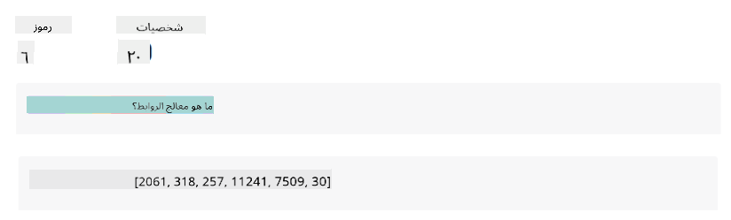
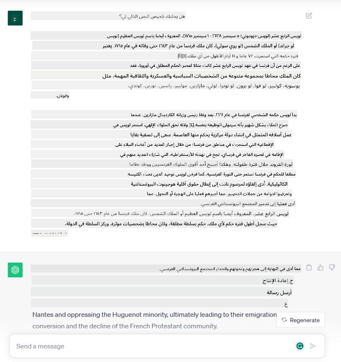
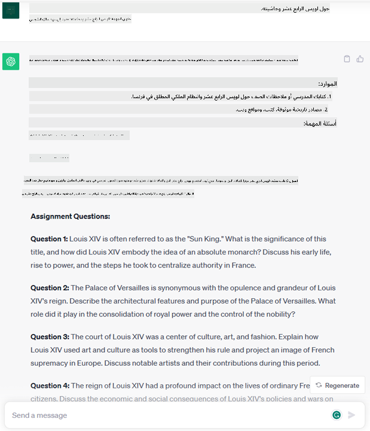
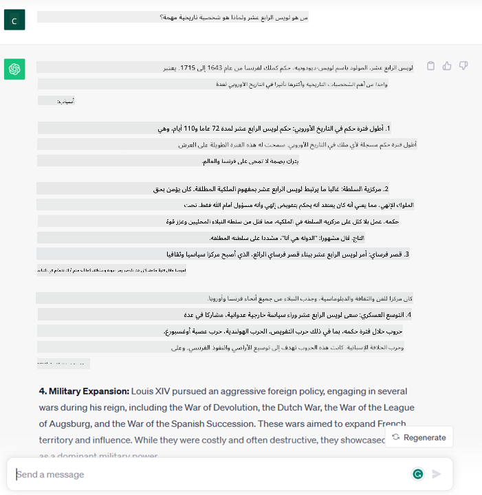
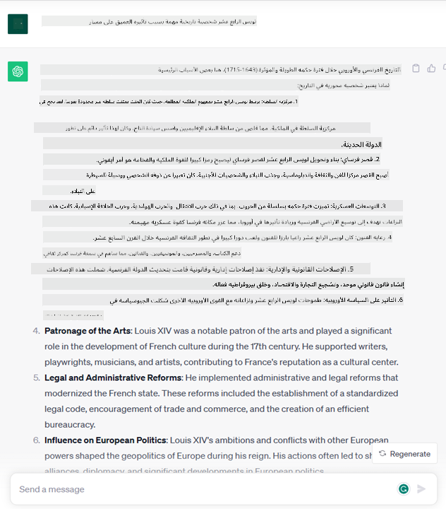
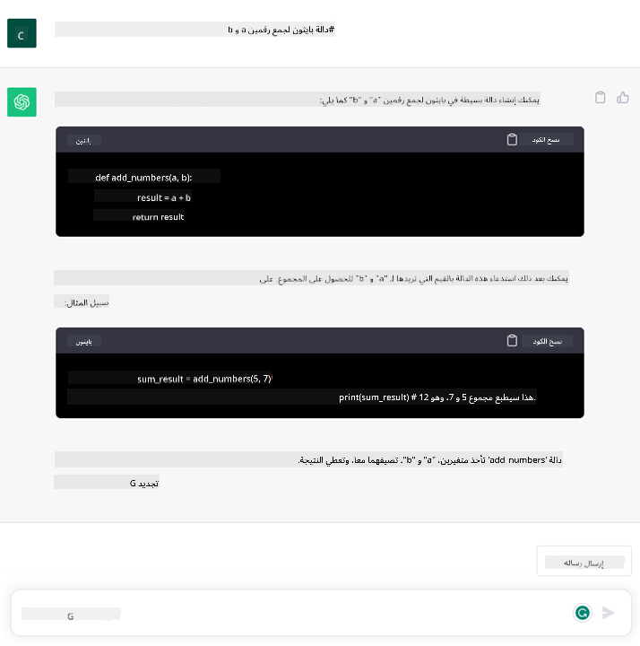

<!--
CO_OP_TRANSLATOR_METADATA:
{
  "original_hash": "f53ba0fa49164f9323043f1c6b11f2b1",
  "translation_date": "2025-05-19T13:04:04+00:00",
  "source_file": "01-introduction-to-genai/README.md",
  "language_code": "ar"
}
-->
# مقدمة في الذكاء الاصطناعي التوليدي ونماذج اللغة الكبيرة

_(انقر على الصورة أعلاه لمشاهدة الفيديو الخاص بهذه الدرس)_

الذكاء الاصطناعي التوليدي هو الذكاء الاصطناعي القادر على إنشاء نصوص وصور وأنواع أخرى من المحتوى. ما يجعله تقنية رائعة هو أنه يتيح استخدام الذكاء الاصطناعي للجميع، حيث يمكن لأي شخص استخدامه من خلال مجرد إدخال نص، جملة مكتوبة بلغة طبيعية. لا تحتاج إلى تعلم لغة مثل Java أو SQL لتحقيق شيء ذو قيمة، كل ما تحتاجه هو استخدام لغتك، ذكر ما تريد، وستحصل على اقتراح من نموذج الذكاء الاصطناعي. التطبيقات والتأثير لهذه التكنولوجيا ضخمة، يمكنك كتابة أو فهم التقارير، كتابة التطبيقات وأكثر من ذلك بكثير، كل ذلك في ثوانٍ.

في هذه المنهجية، سنستكشف كيف تستفيد شركتنا الناشئة من الذكاء الاصطناعي التوليدي لفتح سيناريوهات جديدة في عالم التعليم وكيف نتعامل مع التحديات الحتمية المرتبطة بالتأثيرات الاجتماعية لتطبيقه والقيود التقنية.

## مقدمة

سيتناول هذا الدرس:

- مقدمة في سيناريو العمل: فكرة شركتنا الناشئة ورسالتها.
- الذكاء الاصطناعي التوليدي وكيف وصلنا إلى مشهد التكنولوجيا الحالي.
- العمل الداخلي لنموذج اللغة الكبيرة.
- القدرات الرئيسية والاستخدامات العملية لنماذج اللغة الكبيرة.

## أهداف التعلم

بعد إكمال هذا الدرس، ستفهم:

- ما هو الذكاء الاصطناعي التوليدي وكيف تعمل نماذج اللغة الكبيرة.
- كيف يمكنك الاستفادة من نماذج اللغة الكبيرة لأغراض مختلفة، مع التركيز على سيناريوهات التعليم.

## السيناريو: شركتنا الناشئة التعليمية

يمثل الذكاء الاصطناعي التوليدي قمة تكنولوجيا الذكاء الاصطناعي، حيث يدفع حدود ما كان يُعتقد أنه مستحيل. تمتلك نماذج الذكاء الاصطناعي التوليدي العديد من القدرات والتطبيقات، ولكن في هذه المنهجية سنستكشف كيف يغير التعليم من خلال شركة ناشئة خيالية. سنشير إلى هذه الشركة الناشئة باسم _شركتنا الناشئة_. تعمل شركتنا الناشئة في مجال التعليم مع بيان مهمة طموح

> _تحسين الوصول إلى التعلم على مستوى عالمي، وضمان الوصول العادل إلى التعليم وتوفير تجارب تعلم مخصصة لكل متعلم، وفقًا لاحتياجاته_.

فريق شركتنا الناشئة يدرك أننا لن نتمكن من تحقيق هذا الهدف دون الاستفادة من واحدة من أقوى أدوات العصر الحديث - نماذج اللغة الكبيرة (LLMs).

من المتوقع أن يغير الذكاء الاصطناعي التوليدي الطريقة التي نتعلم ونعلم بها اليوم، حيث يتمتع الطلاب بمدرسين افتراضيين على مدار الساعة يقدمون كميات كبيرة من المعلومات والأمثلة، ويمكن للمدرسين الاستفادة من أدوات مبتكرة لتقييم طلابهم وتقديم ملاحظات.

لنبدأ بتعريف بعض المفاهيم الأساسية والمصطلحات التي سنستخدمها طوال المنهجية.

## كيف حصلنا على الذكاء الاصطناعي التوليدي؟

على الرغم من الضجة غير العادية التي أُثيرت مؤخرًا بسبب الإعلان عن نماذج الذكاء الاصطناعي التوليدي، فإن هذه التكنولوجيا قد استغرق تطويرها عقودًا، حيث تعود أول جهود البحث إلى الستينيات. نحن الآن في مرحلة حيث يمتلك الذكاء الاصطناعي قدرات معرفية بشرية، مثل المحادثة كما يظهر على سبيل المثال [OpenAI ChatGPT](https://openai.com/chatgpt) أو [Bing Chat](https://www.microsoft.com/edge/features/bing-chat?WT.mc_id=academic-105485-koreyst)، الذي يستخدم أيضًا نموذج GPT للبحث في محادثات Bing.

بالعودة قليلاً، كانت أولى نماذج الذكاء الاصطناعي عبارة عن روبوتات محادثة مكتوبة تعتمد على قاعدة معرفية مستخرجة من مجموعة من الخبراء وممثلة في الكمبيوتر. كانت الإجابات في قاعدة المعرفة تُحفز بواسطة الكلمات الرئيسية التي تظهر في النص المدخل.
ومع ذلك، سرعان ما أصبح واضحًا أن مثل هذا النهج، باستخدام روبوتات المحادثة المكتوبة، لم يكن يتوسع بشكل جيد.

### نهج إحصائي للذكاء الاصطناعي: التعلم الآلي

وصلت نقطة تحول خلال التسعينيات، مع تطبيق نهج إحصائي لتحليل النصوص. أدى ذلك إلى تطوير خوارزميات جديدة - تُعرف باسم التعلم الآلي - قادرة على تعلم الأنماط من البيانات دون أن تكون مبرمجة بشكل صريح. يتيح هذا النهج للآلات محاكاة فهم اللغة البشرية: يتم تدريب نموذج إحصائي على أزواج النصوص والملصقات، مما يمكّن النموذج من تصنيف النص المدخل غير المعروف باستخدام ملصق محدد مسبقًا يمثل نية الرسالة.

### الشبكات العصبية والمساعدين الافتراضيين الحديثين

في السنوات الأخيرة، شجعت التطورات التكنولوجية في الأجهزة، القادرة على التعامل مع كميات أكبر من البيانات وحسابات أكثر تعقيدًا، الأبحاث في الذكاء الاصطناعي، مما أدى إلى تطوير خوارزميات التعلم الآلي المتقدمة المعروفة بالشبكات العصبية أو خوارزميات التعلم العميق.

الشبكات العصبية (وبشكل خاص الشبكات العصبية التكرارية - RNNs) عززت بشكل كبير معالجة اللغة الطبيعية، مما مكن من تمثيل معنى النص بطريقة أكثر معنى، مع مراعاة سياق الكلمة في الجملة.

هذه هي التكنولوجيا التي شغلت المساعدين الافتراضيين الذين ولدوا في العقد الأول من القرن الجديد، والذين كانوا بارعين جدًا في تفسير اللغة البشرية، وتحديد الحاجة، وتنفيذ إجراء لتلبية هذه الحاجة - مثل الإجابة بنص مكتوب مسبقًا أو استخدام خدمة طرف ثالث.

### اليوم، الذكاء الاصطناعي التوليدي

هكذا وصلنا إلى الذكاء الاصطناعي التوليدي اليوم، والذي يمكن اعتباره جزءًا من التعلم العميق.

بعد عقود من البحث في مجال الذكاء الاصطناعي، تغلبت بنية نموذج جديدة - تُسمى _Transformer_ - على حدود الشبكات العصبية التكرارية، حيث كانت قادرة على الحصول على تسلسلات أطول من النص كمدخل. تعتمد المحولات على آلية الانتباه، مما يمكن النموذج من إعطاء أوزان مختلفة للمدخلات التي يتلقاها، "موليًا المزيد من الانتباه" حيث تتركز المعلومات الأكثر أهمية، بغض النظر عن ترتيبها في تسلسل النص.

معظم نماذج الذكاء الاصطناعي التوليدي الحديثة - والمعروفة أيضًا بنماذج اللغة الكبيرة (LLMs)، حيث أنها تعمل مع مدخلات ومخرجات نصية - تعتمد بالفعل على هذه البنية. ما يثير الاهتمام بشأن هذه النماذج - التي تم تدريبها على كمية هائلة من البيانات غير المصنفة من مصادر متنوعة مثل الكتب والمقالات والمواقع الإلكترونية - هو أنها يمكن أن تتكيف مع مجموعة متنوعة من المهام وتنتج نصوصًا صحيحة نحويًا مع مظهر من مظاهر الإبداع. لذلك، لم تعزز فقط قدرة الآلة على "فهم" النص المدخل بشكل مذهل، بل مكنت قدرتها على توليد استجابة أصلية بلغة بشرية.

## كيف تعمل نماذج اللغة الكبيرة؟

في الفصل التالي، سنستكشف أنواعًا مختلفة من نماذج الذكاء الاصطناعي التوليدي، ولكن الآن دعونا نلقي نظرة على كيفية عمل نماذج اللغة الكبيرة، مع التركيز على نماذج OpenAI GPT (Generative Pre-trained Transformer).

- **تحويل النص إلى أرقام**: تتلقى نماذج اللغة الكبيرة نصًا كمدخل وتولد نصًا كمخرج. ومع ذلك، كونها نماذج إحصائية، فإنها تعمل بشكل أفضل مع الأرقام من تسلسلات النصوص. لذلك، يتم معالجة كل مدخل للنموذج بواسطة محول النصوص، قبل استخدامه بواسطة النموذج الأساسي. الرمز هو جزء من النص - يتكون من عدد متغير من الأحرف، لذا فإن المهمة الرئيسية لمحول النصوص هي تقسيم المدخل إلى مجموعة من الرموز. ثم يتم ربط كل رمز بمؤشر الرمز، وهو الترميز الصحيح للجزء الأصلي من النص.

- **التنبؤ بالرموز المخرجة**: بالنظر إلى n رموز كمدخل (مع تغير max n من نموذج إلى آخر)، فإن النموذج قادر على التنبؤ برمز واحد كمخرج. ثم يتم دمج هذا الرمز في مدخل التكرار التالي، في نمط نافذة متوسعة، مما يمكن المستخدم من الحصول على جملة واحدة (أو متعددة) كإجابة. هذا يفسر لماذا، إذا كنت قد لعبت مع ChatGPT، قد تكون لاحظت أنه أحيانًا يبدو أنه يتوقف في منتصف الجملة.

- **عملية الاختيار، توزيع الاحتمالات**: يتم اختيار الرمز المخرج بواسطة النموذج وفقًا لاحتمال حدوثه بعد تسلسل النص الحالي. هذا لأن النموذج يتنبأ بتوزيع الاحتمالات على جميع الرموز "التالية" الممكنة، محسوبة بناءً على تدريبه. ومع ذلك، ليس دائمًا يتم اختيار الرمز ذو الاحتمالية الأعلى من التوزيع الناتج. يتم إضافة درجة من العشوائية إلى هذا الاختيار، بحيث يعمل النموذج بطريقة غير حتمية - لا نحصل على نفس المخرج لنفس المدخل. يتم إضافة هذه الدرجة من العشوائية لمحاكاة عملية التفكير الإبداعي ويمكن ضبطها باستخدام معلمة النموذج المسماة درجة الحرارة.

## كيف يمكن لشركتنا الناشئة الاستفادة من نماذج اللغة الكبيرة؟

الآن بعد أن أصبح لدينا فهم أفضل لعمل نموذج اللغة الكبيرة الداخلي، دعونا نرى بعض الأمثلة العملية للمهام الأكثر شيوعًا التي يمكنها القيام بها بشكل جيد، مع التركيز على سيناريو العمل لدينا.
قلنا أن القدرة الرئيسية لنموذج اللغة الكبيرة هي _توليد نص من الصفر، بدءًا من مدخل نصي، مكتوب بلغة طبيعية_.

لكن ما نوع المدخلات والمخرجات النصية؟
مدخل نموذج اللغة الكبيرة يُعرف باسم الموجه، بينما يُعرف المخرج باسم الإكمال، وهو مصطلح يشير إلى آلية النموذج في توليد الرمز التالي لإكمال المدخل الحالي. سنغوص بعمق في ما هو الموجه وكيفية تصميمه بطريقة تمكننا من الاستفادة القصوى من النموذج لدينا. ولكن الآن، دعونا نقول فقط أن الموجه قد يتضمن:

- **تعليمات** تحدد نوع المخرج الذي نتوقعه من النموذج. قد تحتوي هذه التعليمات أحيانًا على بعض الأمثلة أو بعض البيانات الإضافية.

  1. تلخيص مقال، كتاب، مراجعات المنتجات وأكثر، مع استخراج الأفكار من البيانات غير المهيكلة.
    
    
  
  2. التفكير الإبداعي وتصميم مقال، مقالة، مهمة أو أكثر.
      
     

- **سؤال**، يُطرح في شكل محادثة مع وكيل.
  
  

- قطعة من **النص لإكمالها**، وهو طلب ضمني للحصول على مساعدة في الكتابة.
  
  

- قطعة من **الكود** مع طلب شرحها وتوثيقها، أو تعليق يطلب توليد قطعة من الكود تؤدي مهمة معينة.
  
  

الأمثلة أعلاه بسيطة وليست مخصصة لتكون عرضًا شاملًا لقدرات نماذج اللغة الكبيرة. إنها تهدف إلى إظهار إمكانات استخدام الذكاء الاصطناعي التوليدي، وخاصة ولكن ليس مقتصرًا على السياقات التعليمية.

أيضًا، مخرج نموذج الذكاء الاصطناعي التوليدي ليس مثاليًا وأحيانًا يمكن أن يعمل إبداع النموذج ضده، مما يؤدي إلى مخرج هو مزيج من الكلمات التي يمكن للمستخدم البشري تفسيرها كمغالطة للواقع، أو يمكن أن تكون مهينة. الذكاء الاصطناعي التوليدي ليس ذكيًا - على الأقل في التعريف الأكثر شمولًا للذكاء، بما في ذلك التفكير النقدي والإبداعي أو الذكاء العاطفي؛ إنه ليس حتميًا، وليس موثوقًا، حيث يمكن أن يتم دمج التزييفات، مثل المراجع الخاطئة، المحتوى، والبيانات، مع المعلومات الصحيحة، وتقديمها بطريقة مقنعة وواثقة. في الدروس التالية، سنتعامل مع جميع هذه القيود وسنرى ما يمكننا فعله لتخفيفها.

## المهمة

مهمتك هي قراءة المزيد عن [الذكاء الاصطناعي التوليدي](https://en.wikipedia.org/wiki/Generative_artificial_intelligence?WT.mc_id=academic-105485-koreyst) ومحاولة تحديد مجال يمكنك إضافة الذكاء الاصطناعي التوليدي إليه اليوم والذي لا يحتوي عليه. كيف سيكون التأثير مختلفًا عن القيام بذلك بالطريقة "القديمة"، هل يمكنك القيام بشيء لم يكن يمكنك القيام به من قبل، أم أنك أسرع؟ اكتب ملخصًا من 300 كلمة حول كيف ستبدو شركة الذكاء الاصطناعي الناشئة الخاصة بك، وضمّن عناوين مثل "المشكلة"، "كيف سأستخدم الذكاء الاصطناعي"، "التأثير" وخطة عمل اختياريًا.

إذا قمت بهذه المهمة، قد تكون جاهزًا للتقديم في حاضنة مايكروسوفت، [Microsoft for Startups Founders Hub](https://www.microsoft.com/startups?WT.mc_id=academic-105485-koreyst) نحن نقدم اعتمادات لكل من Azure وOpenAI والإرشاد والكثير، تحقق منها!

## اختبار المعرفة

ما هو الصحيح حول نماذج اللغة الكبيرة؟

1. تحصل على نفس الاستجابة في كل مرة.
1. يقوم بالأشياء بشكل مثالي، رائع في جمع الأرقام، إنتاج كود يعمل وما إلى ذلك.
1. قد تختلف الاستجابة على الرغم من استخدام نفس الموجه. كما أنه رائع في إعطائك مسودة أولية لشيء ما، سواء كان نصًا أو كودًا. لكنك تحتاج إلى تحسين النتائج.

ج: 3، النموذج اللغوي الكبير غير حتمي، تتنوع الاستجابة، ومع ذلك، يمكنك التحكم في تنوعها عبر إعداد درجة الحرارة. لا ينبغي أن تتوقع منه القيام بالأشياء بشكل مثالي، إنه هنا للقيام بالعمل الثقيل لك، مما يعني غالبًا أنك تحصل على محاولة جيدة لأول مرة لشيء تحتاج إلى تحسينه تدريجيًا.

## عمل رائع! واصل الرحلة

بعد إكمال هذا الدرس، تحقق من [مجموعة تعلم الذكاء الاصطناعي التوليدي](https://aka.ms/genai-collection?WT.mc_id=academic-105485-koreyst) الخاصة بنا لمواصلة رفع مستوى معرفتك بالذكاء الاصطناعي التوليدي!

توجه إلى الدرس الثاني حيث سنلقي نظرة على كيفية [استكشاف ومقارنة أنواع مختلفة من نماذج اللغة الكبيرة](../02-exploring-and-comparing-different-llms/README.md?WT.mc_id=academic-105485-koreyst)!

**إخلاء المسؤولية**:  
تمت ترجمة هذه الوثيقة باستخدام خدمة الترجمة بالذكاء الاصطناعي [Co-op Translator](https://github.com/Azure/co-op-translator). بينما نسعى لتحقيق الدقة، يرجى العلم أن الترجمات الآلية قد تحتوي على أخطاء أو عدم دقة. يجب اعتبار الوثيقة الأصلية بلغتها الأم هي المصدر الموثوق. بالنسبة للمعلومات الهامة، يُوصى بالترجمة البشرية الاحترافية. نحن غير مسؤولين عن أي سوء فهم أو تفسيرات خاطئة تنشأ عن استخدام هذه الترجمة.