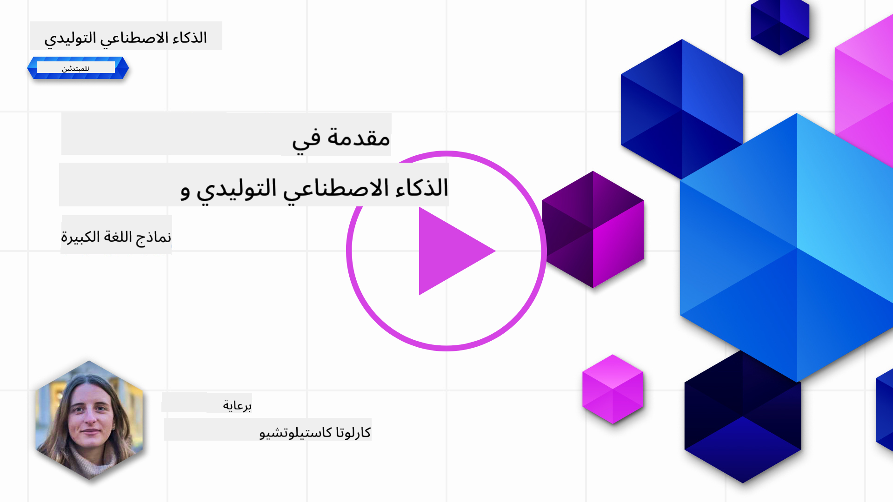
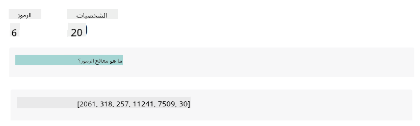
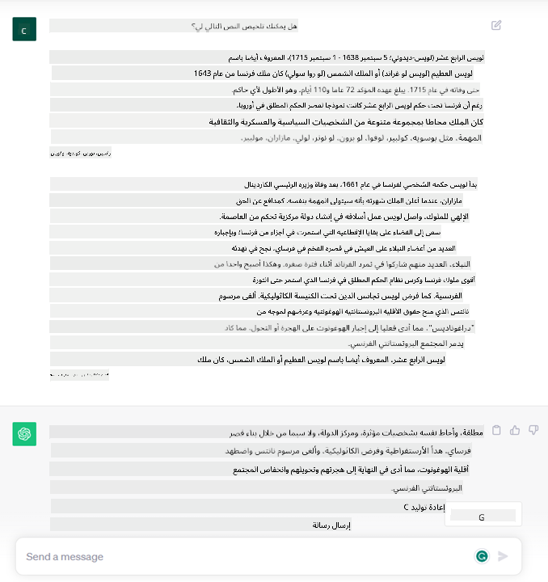
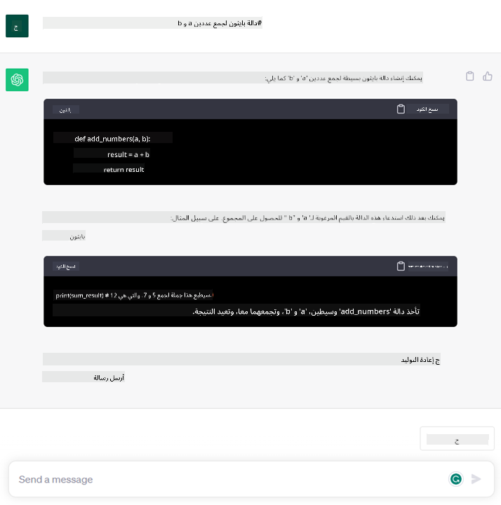

<!--
CO_OP_TRANSLATOR_METADATA:
{
  "original_hash": "bfb7901bdbece1ba3e9f35c400ca33e8",
  "translation_date": "2025-10-17T12:52:39+00:00",
  "source_file": "01-introduction-to-genai/README.md",
  "language_code": "ar"
}
-->
# مقدمة إلى الذكاء الاصطناعي التوليدي ونماذج اللغة الكبيرة

_(اضغط على الصورة أعلاه لمشاهدة فيديو الدرس)_

الذكاء الاصطناعي التوليدي هو نوع من الذكاء الاصطناعي القادر على إنشاء نصوص وصور وأنواع أخرى من المحتوى. ما يجعل هذه التقنية رائعة هو أنها تتيح للجميع استخدام الذكاء الاصطناعي بسهولة، حيث يمكن لأي شخص استخدامها بمجرد كتابة نص بسيط بلغة طبيعية. لا حاجة لتعلم لغات برمجة مثل Java أو SQL لتحقيق شيء ذو قيمة، كل ما تحتاجه هو استخدام لغتك الطبيعية، تحديد ما تريد، وسيقدم لك نموذج الذكاء الاصطناعي اقتراحًا. التطبيقات والتأثيرات لهذه التقنية هائلة، حيث يمكنك كتابة أو فهم التقارير، إنشاء التطبيقات، وأكثر من ذلك في ثوانٍ معدودة.

في هذا المنهج، سنستكشف كيف يمكن لشركتنا الناشئة الاستفادة من الذكاء الاصطناعي التوليدي لفتح آفاق جديدة في عالم التعليم وكيف نتعامل مع التحديات الحتمية المرتبطة بالآثار الاجتماعية لتطبيقه والقيود التقنية.

## المقدمة

سيتناول هذا الدرس:

- مقدمة عن السيناريو التجاري: فكرة شركتنا الناشئة ورسالتها.
- الذكاء الاصطناعي التوليدي وكيف وصلنا إلى المشهد التكنولوجي الحالي.
- كيفية عمل نموذج اللغة الكبير.
- القدرات الرئيسية والاستخدامات العملية لنماذج اللغة الكبيرة.

## أهداف التعلم

بعد إكمال هذا الدرس، ستفهم:

- ما هو الذكاء الاصطناعي التوليدي وكيف تعمل نماذج اللغة الكبيرة.
- كيفية الاستفادة من نماذج اللغة الكبيرة في استخدامات مختلفة، مع التركيز على سيناريوهات التعليم.

## السيناريو: شركتنا التعليمية الناشئة

يمثل الذكاء الاصطناعي التوليدي قمة التكنولوجيا في مجال الذكاء الاصطناعي، حيث يدفع حدود ما كان يُعتقد أنه مستحيل. تتمتع نماذج الذكاء الاصطناعي التوليدي بالعديد من القدرات والتطبيقات، ولكن في هذا المنهج سنستكشف كيف تُحدث ثورة في التعليم من خلال شركة ناشئة خيالية. سنشير إلى هذه الشركة باسم _شركتنا الناشئة_. تعمل شركتنا الناشئة في مجال التعليم مع رسالة طموحة تتمثل في:

> _تحسين إمكانية الوصول إلى التعلم على مستوى عالمي، وضمان الوصول العادل إلى التعليم وتوفير تجارب تعلم مخصصة لكل متعلم وفقًا لاحتياجاته._

يدرك فريق شركتنا الناشئة أننا لن نتمكن من تحقيق هذا الهدف دون الاستفادة من أحد أقوى أدوات العصر الحديث – نماذج اللغة الكبيرة (LLMs).

من المتوقع أن يُحدث الذكاء الاصطناعي التوليدي ثورة في طريقة التعلم والتعليم اليوم، حيث يمكن للطلاب الاستفادة من معلمين افتراضيين متاحين على مدار الساعة يقدمون كميات هائلة من المعلومات والأمثلة، ويمكن للمعلمين الاستفادة من أدوات مبتكرة لتقييم طلابهم وتقديم الملاحظات.

لنبدأ بتعريف بعض المفاهيم والمصطلحات الأساسية التي سنستخدمها طوال المنهج.

## كيف وصلنا إلى الذكاء الاصطناعي التوليدي؟

على الرغم من الضجة الكبيرة التي أُثيرت مؤخرًا بسبب الإعلان عن نماذج الذكاء الاصطناعي التوليدي، فإن هذه التقنية قيد التطوير منذ عقود، حيث تعود أولى جهود البحث إلى الستينيات. نحن الآن في نقطة حيث يتمتع الذكاء الاصطناعي بقدرات معرفية بشرية، مثل المحادثة كما يظهر على سبيل المثال في [OpenAI ChatGPT](https://openai.com/chatgpt) أو [Bing Chat](https://www.microsoft.com/edge/features/bing-chat?WT.mc_id=academic-105485-koreyst)، الذي يستخدم أيضًا نموذج GPT للبحث عبر الإنترنت.

بالعودة قليلاً، كانت النماذج الأولى للذكاء الاصطناعي تتكون من روبوتات محادثة مكتوبة تعتمد على قاعدة معرفية مستخرجة من مجموعة من الخبراء وممثلة في جهاز كمبيوتر. كانت الإجابات في قاعدة المعرفة تُحفز بواسطة الكلمات المفتاحية التي تظهر في النص المدخل. ومع ذلك، سرعان ما أصبح واضحًا أن هذا النهج، باستخدام روبوتات المحادثة المكتوبة، لم يكن قابلاً للتوسع بشكل جيد.

### النهج الإحصائي للذكاء الاصطناعي: التعلم الآلي

حدثت نقطة تحول خلال التسعينيات، مع تطبيق نهج إحصائي لتحليل النصوص. أدى ذلك إلى تطوير خوارزميات جديدة – تُعرف باسم التعلم الآلي – قادرة على تعلم الأنماط من البيانات دون الحاجة إلى برمجتها بشكل صريح. يسمح هذا النهج للآلات بمحاكاة فهم اللغة البشرية: يتم تدريب نموذج إحصائي على أزواج النصوص والتصنيفات، مما يمكّن النموذج من تصنيف النصوص المدخلة غير المعروفة بتصنيف محدد مسبقًا يمثل نية الرسالة.

### الشبكات العصبية والمساعدين الافتراضيين الحديثين

في السنوات الأخيرة، شجعت التطورات التكنولوجية في الأجهزة، القادرة على معالجة كميات أكبر من البيانات وحسابات أكثر تعقيدًا، البحث في الذكاء الاصطناعي، مما أدى إلى تطوير خوارزميات التعلم الآلي المتقدمة المعروفة بالشبكات العصبية أو خوارزميات التعلم العميق.

عززت الشبكات العصبية (وبالأخص الشبكات العصبية المتكررة – RNNs) معالجة اللغة الطبيعية بشكل كبير، مما مكّن من تمثيل معنى النص بطريقة أكثر دقة، مع مراعاة سياق الكلمة في الجملة.

هذه هي التقنية التي دعمت المساعدين الافتراضيين الذين ظهروا في العقد الأول من القرن الجديد، وكانوا بارعين جدًا في تفسير اللغة البشرية، وتحديد الحاجة، وتنفيذ إجراء لتلبيتها – مثل الإجابة بنص محدد مسبقًا أو استخدام خدمة طرف ثالث.

### اليوم، الذكاء الاصطناعي التوليدي

وهكذا وصلنا إلى الذكاء الاصطناعي التوليدي اليوم، الذي يمكن اعتباره جزءًا من التعلم العميق.

بعد عقود من البحث في مجال الذكاء الاصطناعي، تجاوزت بنية نموذج جديدة – تُعرف بـ _Transformer_ – حدود الشبكات العصبية المتكررة، حيث أصبحت قادرة على معالجة تسلسلات أطول بكثير من النصوص كمدخلات. تعتمد Transformers على آلية الانتباه، مما يمكّن النموذج من إعطاء أوزان مختلفة للمدخلات التي يتلقاها، "مع التركيز أكثر" حيث تتركز المعلومات الأكثر أهمية، بغض النظر عن ترتيبها في تسلسل النص.

معظم نماذج الذكاء الاصطناعي التوليدي الحديثة – والمعروفة أيضًا باسم نماذج اللغة الكبيرة (LLMs)، لأنها تعمل مع المدخلات والمخرجات النصية – تعتمد بالفعل على هذه البنية. ما يثير الاهتمام بشأن هذه النماذج – التي يتم تدريبها على كميات هائلة من البيانات غير المصنفة من مصادر متنوعة مثل الكتب والمقالات والمواقع الإلكترونية – هو أنها يمكن أن تتكيف مع مجموعة واسعة من المهام وتنتج نصوصًا صحيحة نحويًا مع لمسة من الإبداع. لذا، لم تعزز فقط قدرة الآلة على "فهم" النص المدخل بشكل كبير، بل مكّنتها أيضًا من توليد استجابة أصلية بلغة بشرية.

## كيف تعمل نماذج اللغة الكبيرة؟

في الفصل التالي، سنستكشف أنواعًا مختلفة من نماذج الذكاء الاصطناعي التوليدي، ولكن الآن دعونا نلقي نظرة على كيفية عمل نماذج اللغة الكبيرة، مع التركيز على نماذج OpenAI GPT (Generative Pre-trained Transformer).

- **المُجزئ، تحويل النص إلى أرقام**: تتلقى نماذج اللغة الكبيرة نصًا كمدخل وتنتج نصًا كمخرج. ومع ذلك، كونها نماذج إحصائية، فإنها تعمل بشكل أفضل مع الأرقام مقارنة بتسلسلات النصوص. لهذا السبب يتم معالجة كل مدخل للنموذج بواسطة مُجزئ قبل استخدامه من قبل النموذج الأساسي. يُعتبر الرمز النصي جزءًا من النص – يتكون من عدد متغير من الأحرف، لذا فإن المهمة الرئيسية للمُجزئ هي تقسيم المدخل إلى مجموعة من الرموز النصية. ثم يتم تعيين كل رمز نصي إلى مؤشر رمز، وهو الترميز العددي للجزء النصي الأصلي.

- **توقع الرموز النصية المخرجة**: بالنظر إلى n من الرموز النصية كمدخل (مع حد أقصى n يختلف من نموذج لآخر)، يكون النموذج قادرًا على توقع رمز نصي واحد كمخرج. يتم دمج هذا الرمز النصي في المدخل في التكرار التالي، في نمط نافذة متوسعة، مما يتيح تجربة مستخدم أفضل للحصول على جملة (أو عدة جمل) كإجابة. هذا يفسر لماذا، إذا كنت قد جربت ChatGPT، قد تكون لاحظت أنه أحيانًا يبدو وكأنه يتوقف في منتصف الجملة.

- **عملية الاختيار، توزيع الاحتمالات**: يتم اختيار الرمز النصي المخرج من قبل النموذج وفقًا لاحتمالية حدوثه بعد تسلسل النص الحالي. يتم حساب هذا بناءً على تدريب النموذج. ومع ذلك، لا يتم دائمًا اختيار الرمز النصي ذو الاحتمالية الأعلى من التوزيع الناتج. يتم إضافة درجة من العشوائية إلى هذا الاختيار، بطريقة تجعل النموذج يتصرف بطريقة غير حتمية - لا نحصل على نفس المخرج تمامًا لنفس المدخل. يتم إضافة هذه الدرجة من العشوائية لمحاكاة عملية التفكير الإبداعي ويمكن ضبطها باستخدام معلمة النموذج المسماة درجة الحرارة.

## كيف يمكن لشركتنا الناشئة الاستفادة من نماذج اللغة الكبيرة؟

الآن بعد أن فهمنا كيفية عمل نموذج اللغة الكبير، دعونا نرى بعض الأمثلة العملية للمهام الأكثر شيوعًا التي يمكنها تنفيذها بشكل جيد، مع التركيز على سيناريو عملنا.
قلنا إن القدرة الرئيسية لنموذج اللغة الكبير هي _توليد نص من البداية، بدءًا من مدخل نصي مكتوب بلغة طبيعية_.

لكن ما نوع المدخلات والمخرجات النصية؟
يُعرف مدخل نموذج اللغة الكبير باسم "الموجه"، بينما يُعرف المخرج باسم "الإكمال"، وهو مصطلح يشير إلى آلية النموذج في توليد الرمز النصي التالي لإكمال المدخل الحالي. سنغوص في تفاصيل ما هو الموجه وكيفية تصميمه بطريقة تحقق أقصى استفادة من النموذج. ولكن الآن، دعونا نقول فقط إن الموجه قد يتضمن:

- **تعليمات** تحدد نوع المخرج الذي نتوقعه من النموذج. قد تتضمن هذه التعليمات أحيانًا بعض الأمثلة أو بيانات إضافية.

  1. تلخيص مقال، كتاب، مراجعات منتجات وأكثر، مع استخراج الأفكار من البيانات غير المنظمة.
    
    
  
  2. توليد أفكار إبداعية وتصميم مقال، مقال، مهمة أو أكثر.
      
     

- **سؤال** يُطرح في شكل محادثة مع وكيل.
  
  

- جزء من **النص لإكماله**، وهو طلب ضمني للحصول على مساعدة في الكتابة.
  
  

- جزء من **الكود** مع طلب شرحه وتوثيقه، أو تعليق يطلب توليد قطعة كود تؤدي مهمة معينة.
  
  

الأمثلة أعلاه بسيطة وليست مخصصة لتكون عرضًا شاملاً لقدرات نماذج اللغة الكبيرة. إنها تهدف إلى إظهار إمكانيات استخدام الذكاء الاصطناعي التوليدي، خاصة ولكن ليس حصريًا في السياقات التعليمية.

أيضًا، مخرجات نموذج الذكاء الاصطناعي التوليدي ليست مثالية وأحيانًا يمكن أن تعمل إبداعية النموذج ضده، مما يؤدي إلى مخرج يمكن للمستخدم البشري تفسيره كمزيج من الواقع، أو قد يكون مسيئًا. الذكاء الاصطناعي التوليدي ليس ذكيًا - على الأقل وفقًا للتعريف الأكثر شمولاً للذكاء، بما في ذلك التفكير النقدي والإبداعي أو الذكاء العاطفي؛ إنه ليس حتميًا، وليس موثوقًا به، حيث يمكن أن يتم دمج الأخطاء، مثل المراجع الخاطئة والمحتوى والبيانات، مع المعلومات الصحيحة، وتقديمها بطريقة مقنعة وواثقة. في الدروس التالية، سنتعامل مع جميع هذه القيود وسنرى ما يمكننا فعله للتخفيف منها.

## المهمة

مهمتك هي قراءة المزيد عن [الذكاء الاصطناعي التوليدي](https://en.wikipedia.org/wiki/Generative_artificial_intelligence?WT.mc_id=academic-105485-koreyst) ومحاولة تحديد مجال يمكنك إضافة الذكاء الاصطناعي التوليدي إليه اليوم والذي لا يحتوي عليه. كيف سيكون التأثير مختلفًا عن القيام بالأمر بالطريقة "القديمة"، هل يمكنك فعل شيء لم يكن ممكنًا من قبل، أم أنك ستكون أسرع؟ اكتب ملخصًا من 300 كلمة عن شكل شركة الذكاء الاصطناعي الناشئة التي تحلم بها، وقم بتضمين عناوين مثل "المشكلة"، "كيف سأستخدم الذكاء الاصطناعي"، "التأثير"، وخطة عمل اختيارية.

إذا قمت بهذه المهمة، قد تكون جاهزًا للتقديم إلى حاضنة مايكروسوفت، [Microsoft for Startups Founders Hub](https://www.microsoft.com/startups?WT.mc_id=academic-105485-koreyst) حيث نقدم اعتمادات لكل من Azure، OpenAI، الإرشاد وأكثر، تحقق منها!

## اختبار المعرفة

ما الصحيح بشأن نماذج اللغة الكبيرة؟

1. تحصل على نفس الاستجابة تمامًا في كل مرة.
1. تقوم بالأشياء بشكل مثالي، رائعة في جمع الأرقام، إنتاج كود يعمل وما إلى ذلك.
1. قد تختلف الاستجابة على الرغم من استخدام نفس الموجه. كما أنها رائعة في إعطائك مسودة أولى لشيء ما، سواء كان نصًا أو كودًا. ولكن عليك تحسين النتائج.

الإجابة: 3، نموذج اللغة الكبير غير حتمي، تختلف الاستجابة، ومع ذلك، يمكنك التحكم في هذا التباين عبر إعداد درجة الحرارة. كما لا يجب أن تتوقع أن يقوم بالأشياء بشكل مثالي، فهو هنا للقيام بالعمل الثقيل نيابة عنك مما يعني غالبًا أنك تحصل على محاولة أولى جيدة لشيء تحتاج إلى تحسينه تدريجيًا.

## عمل رائع! استمر في الرحلة

بعد إكمال هذا الدرس، تحقق من [مجموعة تعلم الذكاء الاصطناعي التوليدي](https://aka.ms/genai-collection?WT.mc_id=academic-105485-koreyst) لمواصلة تطوير معرفتك بالذكاء الاصطناعي التوليدي!
توجه إلى الدرس الثاني حيث سنستعرض كيفية [استكشاف ومقارنة أنواع LLM المختلفة](../02-exploring-and-comparing-different-llms/README.md?WT.mc_id=academic-105485-koreyst)!

---

**إخلاء المسؤولية**:  
تم ترجمة هذا المستند باستخدام خدمة الترجمة بالذكاء الاصطناعي [Co-op Translator](https://github.com/Azure/co-op-translator). بينما نسعى لتحقيق الدقة، يرجى العلم أن الترجمات الآلية قد تحتوي على أخطاء أو عدم دقة. يجب اعتبار المستند الأصلي بلغته الأصلية المصدر الرسمي. للحصول على معلومات حاسمة، يُوصى بالترجمة البشرية الاحترافية. نحن غير مسؤولين عن أي سوء فهم أو تفسيرات خاطئة ناتجة عن استخدام هذه الترجمة.