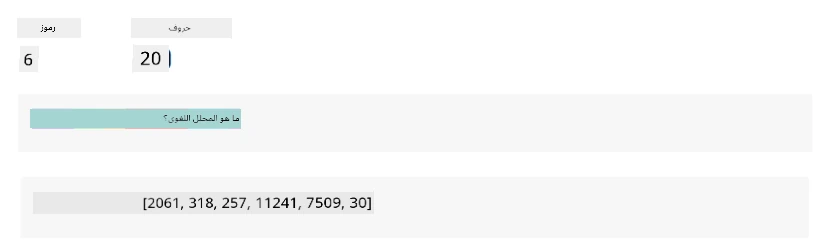
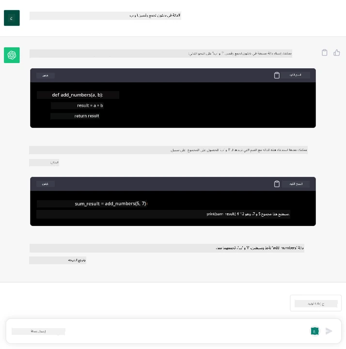

# مقدمة في الذكاء الاصطناعي التوليدي ونماذج اللغة الكبيرة

_(انقر على الصورة أعلاه لمشاهدة فيديو هذا الدرس)_

الذكاء الاصطناعي التوليدي هو ذكاء اصطناعي قادر على توليد النصوص، الصور وأنواع أخرى من المحتويات. ما يجعله تقنية رائعة هو أنه يدمقرط الذكاء الاصطناعي، حيث يمكن لأي شخص استخدامه عبر مجرد موجه نصي بسيط، جملة مكتوبة بلغة طبيعية. لا تحتاج لتعلم لغة مثل جافا أو SQL لتحقيق شيء مفيد، كل ما تحتاجه هو استخدام لغتك، وذكر ما تريده، فتأتيك اقتراحات من نموذج ذكاء اصطناعي. التطبيقات والتأثيرات لهذا هائلة، تكتب أو تفهم تقارير، تكتب تطبيقات والمزيد، كله في ثوانٍ.

في هذا المنهج سنتناول كيف تستغل شركتنا الناشئة الذكاء الاصطناعي التوليدي لفتح سيناريوهات جديدة في عالم التعليم وكيف نتعامل مع التحديات الحتمية المرتبطة بالتبعات الاجتماعية لتطبيقه وقيود التكنولوجيا.

## مقدمة

سيغطي هذا الدرس:

- مقدمة عن سيناريو الأعمال: فكرة ومهمة شركتنا الناشئة.
- الذكاء الاصطناعي التوليدي وكيف وصلنا إلى مشهد التكنولوجيا الحالي.
- العمل الداخلي لنموذج اللغة الكبير.
- القدرات الرئيسية وحالات الاستخدام العملية لنماذج اللغة الكبيرة.

## أهداف التعلم

بعد إتمام هذا الدرس، ستفهم:

- ما هو الذكاء الاصطناعي التوليدي وكيف تعمل نماذج اللغة الكبيرة.
- كيف يمكنك استغلال نماذج اللغة الكبيرة في حالات مختلفة، مع التركيز على سيناريوهات التعليم.

## السيناريو: شركتنا الناشئة التعليمية

الذكاء الاصطناعي التوليدي يمثل قمة تكنولوجيا الذكاء الاصطناعي، يدفع حدود ما كان يعتقد أنه مستحيل. لنماذج الذكاء الاصطناعي التوليدي عدة قدرات وتطبيقات، ولكن في هذا المنهج سوف نستكشف كيف تُحدث ثورة في التعليم عبر شركة ناشئة وهمية. سنشير لتلك الشركة بوصفها _شركتنا الناشئة_. تعمل شركتنا الناشئة في مجال التعليم مع بيان مهمة طموح

> _تحسين الوصول إلى التعلم على نطاق عالمي، مع ضمان تكافؤ الفرص في التعليم وتوفير تجارب تعلم شخصية لكل متعلم حسب احتياجاته_.

فريق شركتنا الناشئة يدرك أنه لن يكون قادرًا على تحقيق هذا الهدف دون الاستفادة من واحدة من أقوى أدوات العصر الحديث – نماذج اللغة الكبيرة (LLMs).

من المتوقع أن يحدث الذكاء الاصطناعي التوليدي ثورة في طريقة تعلمنا وتعليمنا اليوم، مع توفير معلمين افتراضيين للطلاب على مدار 24 ساعة يقدمون كميات هائلة من المعلومات والأمثلة، ومعلمين قادرين على استغلال أدوات مبتكرة لتقييم طلابهم وتقديم التغذية الراجعة.

لنبدأ بتعريف بعض المفاهيم والمصطلحات الأساسية التي سنستخدمها طوال المنهج.

## كيف وصلنا إلى الذكاء الاصطناعي التوليدي؟

بالرغم من الضجة الهائلة التي أحدثها إعلان نماذج الذكاء الاصطناعي التوليدي مؤخرًا، هذه التكنولوجيا قيد التطوير منذ عقود، مع أولى محاولات البحث التي تعود إلى الستينيات. نحن الآن في نقطة يمتلك فيها الذكاء الاصطناعي قدرات إدراكية بشرية مثل المحادثة كما يظهر على سبيل المثال في [OpenAI ChatGPT](https://openai.com/chatgpt) أو [Microsoft Copilot](https://copilot.microsoft.com/?WT.mc_id=academic-105485-koreyst)، الذي يستخدم أيضًا نموذج GPT لتجربة البحث الحوارية على الويب.

لنعود قليلاً، كانت أولى النماذج الأولية للذكاء الاصطناعي تتكون من روبوتات محادثة مكتوبة، تعتمد على قاعدة معرفة مستخرجة من مجموعة من الخبراء وممثلة في الكمبيوتر. كانت الإجابات في قاعدة المعرفة تُفعل بواسطة كلمات مفتاحية تظهر في النص المدخل.
ومع ذلك، سرعان ما تبين أن هذا النهج، باستخدام روبوتات المحادثة المكتوبة، لا يتوسع بشكل جيد.

### نهج إحصائي للذكاء الاصطناعي: التعلم الآلي

وصلنا إلى نقطة تحول خلال التسعينيات، مع تطبيق نهج إحصائي لتحليل النصوص. أدى هذا إلى تطوير خوارزميات جديدة – تُعرف بالتعلم الآلي – قادرة على تعلم الأنماط من البيانات دون برمجة صريحة. هذا النهج يسمح للآلات بمحاكاة فهم اللغة البشرية: يتم تدريب نموذج إحصائي على أزواج نصوص-تسميات، مما يمكن النموذج من تصنيف نصوص غير معروفة بتسمية محددة تمثل نية الرسالة.

### الشبكات العصبية والمساعدين الافتراضيين الحديثين

في السنوات الأخيرة، شجع التطور التكنولوجي في العتاد، القادر على معالجة كميات أكبر من البيانات وحسابات أكثر تعقيدًا، البحث في الذكاء الاصطناعي، مما أدى إلى تطوير خوارزميات تعلم آلي متقدمة تُعرف بالشبكات العصبية أو التعلم العميق.

عززت الشبكات العصبية (وخاصة الشبكات العصبية المتكررة – RNNs) معالجة اللغة الطبيعية بشكل كبير، مما مكن من تمثيل معنى النص بطريقة أكثر معنى، مع تقدير سياق الكلمة في الجملة.

هذه هي التكنولوجيا التي غذت المساعدين الافتراضيين الذين ولدوا في العقد الأول من القرن الجديد، الذين يتمتعون بمهارة عالية في تفسير اللغة البشرية، وتحديد الحاجة، وأداء إجراء لتلبيتها – مثل الرد بسيناريو محدد أو استهلاك خدمة طرف ثالث.

### العصر الحالي، الذكاء الاصطناعي التوليدي

هكذا وصلنا إلى الذكاء الاصطناعي التوليدي اليوم، الذي يمكن اعتباره جزءًا من التعلم العميق.

بعد عقود من البحث في مجال الذكاء الاصطناعي، تغلبت بنية نموذج جديدة – تسمى _Transformer_ – على حدود الشبكات العصبية المتكررة، مما مكنها من معالجة تسلسلات نصية أطول بكثير كمدخلات. تعتمد المحولات على آلية الانتباه، التي تمكّن النموذج من إعطاء أوزان مختلفة للمدخلات التي يتلقاها، «مع إيلاء اهتمام أكبر» حيث تتجمع أكثر المعلومات ذات الصلة، بغض النظر عن ترتيبها في تسلسل النص.

معظم نماذج الذكاء الاصطناعي التوليدي الحديثة – المعروفة أيضًا بنماذج اللغة الكبيرة (LLMs)، لأنها تعمل بالنصوص الداخلة والخارجة – تعتمد فعليًا على هذه البنية. الشيء المثير في هذه النماذج – التي تدربت على كمية هائلة من البيانات الغير معنونة من مصادر متنوعة مثل الكتب والمقالات والمواقع الإلكترونية – هو أنها يمكن تكييفها لمجموعة واسعة من المهام وتوليد نص صحيح نحويًا مع لمسة من الإبداع. لذا، لم تضف فقط سعة هائلة لفهم النصوص، بل مكنت أيضًا قدرتها على توليد ردود أصلية بلغة بشرية.

## كيف تعمل نماذج اللغة الكبيرة؟

في الفصل التالي سنستكشف أنواعًا مختلفة من نماذج الذكاء الاصطناعي التوليدي، لكن الآن دعونا نلقي نظرة على كيفية عمل نماذج اللغة الكبيرة، مع التركيز على نماذج OpenAI GPT (محول مدرب مسبقًا توليدي).

- **محلل الرموز، تحويل النص إلى أرقام**: تستقبل نماذج اللغة الكبيرة نصًا كمدخلات وتنتج نصًا كمخرجات. ولكن، كونها نماذج إحصائية، تعمل بشكل أفضل مع الأرقام مقارنة بتسلسلات النصوص. لهذا السبب، يتم معالجة كل مدخل إلى النموذج بواسطة محلل رموز (tokenizer) قبل استخدامه بواسطة النموذج الأساسي. الرمز هو قطعة نصية – مكونة من عدد متغير من الأحرف، لذا فإن المهمة الرئيسية لمحلل الرموز هي تقسيم المدخل إلى مصفوفة من الرموز. ثم يتم ربط كل رمز بفهرس رمز، وهو التشفير الرقمي للقطعة النصية الأصلية.

- **تنبؤ الرموز المخرجة**: بالنظر إلى n رموز كمدخل (مع حد أقصى لـ n يختلف من نموذج لآخر)، يكون النموذج قادرًا على التنبؤ برمز واحد كمخرج. ثم يُدمج هذا الرمز في مدخلات التكرار التالي، بنمط نافذة متوسعة، مما يمكّن من تجربة مستخدم أفضل للحصول على جملة واحدة (أو أكثر) كرد. هذا يفسر لماذا، إذا جربت ChatGPT، قد تلاحظ أحيانًا أنه يتوقف في منتصف جملة.

- **عملية الاختيار، توزيع الاحتمالات**: يتم اختيار الرمز المخرج من النموذج وفقًا لاحتمالية حدوثه بعد تسلسل النص الحالي. وذلك لأن النموذج يتنبأ بتوزيع احتمالي لكافة «الرموز التالية» الممكنة، يتم حسابه بناءً على تدريبه. ولكن، ليس دائمًا يتم اختيار الرمز الذي له أعلى احتمال من التوزيع الناتج. يُضاف قدر من العشوائية إلى هذا الاختيار، بحيث يعمل النموذج بطريقة غير حتمية - لا نحصل على نفس المخرج تمامًا لكل مدخل مماثل. يمكن ضبط هذا القدر من العشوائية باستخدام معلمة في النموذج تسمى درجة الحرارة.

## كيف يمكن لشركتنا الناشئة الاستفادة من نماذج اللغة الكبيرة؟

الآن بعد أن أصبح لدينا فهم أفضل للعمل الداخلي لنموذج اللغة الكبير، لننظر إلى بعض الأمثلة العملية للمهام الأكثر شيوعًا التي يمكنهم أداءها بشكل جيد، مع التركيز على سيناريو أعمالنا.
قلنا إن القدرة الرئيسية لنموذج اللغة الكبير هي _توليد نص من البداية، بدءًا من مدخل نصي مكتوب بلغة طبيعية_.

لكن ما نوع المدخلات والمخرجات النصية؟
يسمى مدخل نموذج اللغة الكبير موجه (prompt)، أما المخرج فيعرف بإنهاء (completion)، وهو مصطلح يشير إلى آلية النموذج في توليد الرمز التالي لاستكمال المدخل الحالي. سنغوص عميقًا في ماهية الموجه وكيفية تصميمه للحصول على أفضل استفادة من نموذجنا. ولكن الآن، دعونا نقول فقط إن الموجه قد يشمل:

- **تعليمات** تحدد نوع المخرج الذي نتوقعه من النموذج. قد تتضمن هذه التعليمات أحيانًا بعض الأمثلة أو بيانات إضافية.

  1. تلخيص مقال، كتاب، مراجعات منتج والمزيد، مع استخراج رؤى من بيانات غير منظمة.
    
    
  
  2. توليد أفكار مبتكرة وتصميم مقال، مقال قصير، واجب أو أكثر.
      
     

- **سؤال**، يُطرح في شكل محادثة مع وكيل.
  
  

- جزء من **نص لاستكماله**، وهو طلب ضمني للمساعدة في الكتابة.
  
  

- جزء من **كود** مع طلب شرح وتوثيق له، أو تعليق يطلب توليد قطعة كود تقوم بمهمة محددة.
  
  

الأمثلة أعلاه بسيطة نسبيًا وليست مقصودة لتكون عرضًا شاملاً لقدرات نماذج اللغة الكبيرة. هي تهدف إلى إظهار إمكانات استخدام الذكاء الاصطناعي التوليدي، وخاصة ولكن ليس فقط في السياقات التعليمية.

كذلك، مخرج نموذج الذكاء الاصطناعي التوليدي ليس مثاليًا وأحيانًا قد يعمل إبداع النموذج ضده، مما يؤدي إلى مخرجات مكونة من كلمات قد يفسرها المستخدم البشري على أنها تغليف للواقع، أو قد تكون مسيئة. الذكاء الاصطناعي التوليدي ليس ذكيًا - على الأقل بالمعنى الشامل للذكاء، الذي يشمل التفكير النقدي والإبداعي أو الذكاء العاطفي؛ هو ليس حتميًا، ولا جديرًا بالثقة، حيث يمكن أن تتداخل الخيالات مثل المراجع الخاطئة أو المحتوى أو التصريحات مع المعلومات الصحيحة وتُقدم بطريقة مقنعة وواثقة. في الدروس القادمة سنتعامل مع كل هذه القيود وسنرى كيف يمكن التخفيف منها.

## الواجب

واجبك هو قراءة المزيد عن [الذكاء الاصطناعي التوليدي](https://en.wikipedia.org/wiki/Generative_artificial_intelligence?WT.mc_id=academic-105485-koreyst) ومحاولة تحديد مجال يمكنك إضافة الذكاء الاصطناعي التوليدي إليه اليوم وهو غير موجود فيه. كيف سيكون التأثير مختلفًا عن الطريقة "القديمة"؟ هل يمكنك فعل شيء لم تستطع فعله من قبل، أم أنك أسرع؟ اكتب ملخصًا من 300 كلمة حول كيف سيكون شكل شركتك الناشئة المثالية للذكاء الاصطناعي وضمن عناوين مثل "المشكلة"، "كيفية استخدامي للذكاء الاصطناعي"، "التأثير" وخطة عمل اختيارية.

إذا قمت بهذا المهمة، قد تكون حتى مستعدًا للتقديم في حاضنة مايكروسوفت، [Microsoft for Startups Founders Hub](https://www.microsoft.com/startups?WT.mc_id=academic-105485-koreyst)؛ نقدم اعتمادات لكل من Azure، OpenAI، الإرشاد والمزيد، اطلع عليها!

## اختبار المعرفة

ما هو الصحيح حول نماذج اللغة الكبيرة؟

1. تحصل على نفس الرد تمامًا في كل مرة.
1. تنجز الأشياء بشكل مثالي، ممتازة في جمع الأعداد، إنتاج الكود العامل، إلخ.
1. قد يختلف الرد رغم استخدام نفس الموجه. وهي أيضًا ممتازة في إعطائك مسودة أولى لشيء ما، سواء كان نصًا أو كودًا. لكن عليك تحسين النتائج.

أ: 3، نموذج اللغة الكبير غير حتمي، الرد يختلف، ومع ذلك يمكنك التحكم في تباينه عبر ضبط درجة الحرارة. ولا ينبغي أن تتوقع أن يقوم بالأشياء بشكل مثالي، هو هنا ليقوم بالعمل الشاق من أجلك، مما يعني غالبًا أنك تحصل على محاولة أولى جيدة لشيء تحتاج تدريجيًا لتحسينه.

## عمل رائع! استمر في الرحلة

بعد إتمام هذا الدرس، تفقد مجموعتنا [Generative AI Learning collection](https://aka.ms/genai-collection?WT.mc_id=academic-105485-koreyst) لتواصل تعزيز معرفتك بالذكاء الاصطناعي التوليدي!

انتقل إلى الدرس 2 حيث سنلقي نظرة على كيفية [استكشاف ومقارنة أنواع مختلفة من نماذج اللغة الكبيرة](../02-exploring-and-comparing-different-llms/README.md?WT.mc_id=academic-105485-koreyst)!

---

<!-- CO-OP TRANSLATOR DISCLAIMER START -->
**تنويه**:
تمت ترجمة هذا المستند باستخدام خدمة الترجمة بالذكاء الاصطناعي [Co-op Translator](https://github.com/Azure/co-op-translator). بينما نسعى للدقة، يرجى العلم أن الترجمات الآلية قد تحتوي على أخطاء أو عدم دقة. يجب اعتبار المستند الأصلي بلغته الأصلية المصدر الرسمي والمعتمد. للمعلومات الهامة، يُنصح بالاستعانة بترجمة بشرية محترفة. نحن غير مسؤولين عن أي سوء فهم أو تفسير ناتج عن استخدام هذه الترجمة.
<!-- CO-OP TRANSLATOR DISCLAIMER END -->