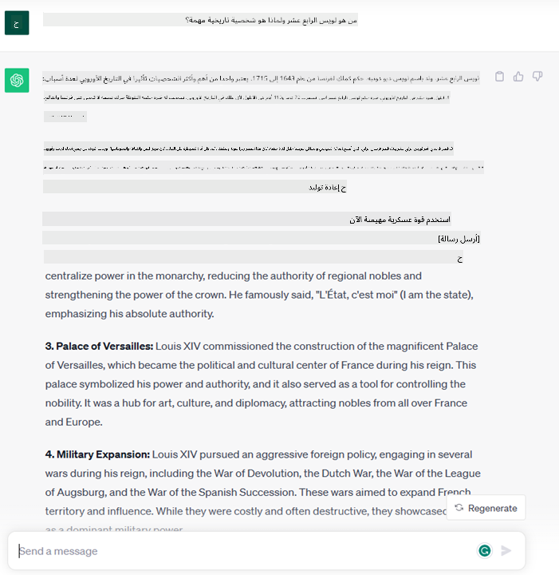

<!--
CO_OP_TRANSLATOR_METADATA:
{
  "original_hash": "f53ba0fa49164f9323043f1c6b11f2b1",
  "translation_date": "2025-07-09T07:42:13+00:00",
  "source_file": "01-introduction-to-genai/README.md",
  "language_code": "ar"
}
-->
# مقدمة في الذكاء الاصطناعي التوليدي ونماذج اللغة الكبيرة

_(انقر على الصورة أعلاه لمشاهدة فيديو هذا الدرس)_

الذكاء الاصطناعي التوليدي هو نوع من الذكاء الاصطناعي قادر على توليد نصوص، صور وأنواع أخرى من المحتوى. ما يجعله تقنية رائعة هو أنه يتيح للجميع استخدام الذكاء الاصطناعي، حيث يمكن لأي شخص استخدامه بمجرد كتابة جملة بلغة طبيعية. لا حاجة لتعلم لغات برمجة مثل Java أو SQL لتحقيق شيء مفيد، كل ما تحتاجه هو استخدام لغتك، التعبير عما تريد، وستحصل على اقتراح من نموذج ذكاء اصطناعي. التطبيقات والتأثيرات لهذا هائلة، يمكنك كتابة أو فهم تقارير، كتابة تطبيقات والمزيد، وكل ذلك في ثوانٍ.

في هذا المنهج، سنستكشف كيف تستخدم شركتنا الناشئة الذكاء الاصطناعي التوليدي لفتح سيناريوهات جديدة في عالم التعليم وكيف نتعامل مع التحديات الحتمية المرتبطة بالتداعيات الاجتماعية لتطبيقه وقيود التكنولوجيا.

## مقدمة

سيغطي هذا الدرس:

- مقدمة عن سيناريو العمل: فكرة شركتنا الناشئة ورسالتها.
- الذكاء الاصطناعي التوليدي وكيف وصلنا إلى المشهد التكنولوجي الحالي.
- كيفية عمل نموذج اللغة الكبير داخليًا.
- القدرات الرئيسية وحالات الاستخدام العملية لنماذج اللغة الكبيرة.

## أهداف التعلم

بعد إكمال هذا الدرس، ستفهم:

- ما هو الذكاء الاصطناعي التوليدي وكيف تعمل نماذج اللغة الكبيرة.
- كيف يمكنك الاستفادة من نماذج اللغة الكبيرة في حالات استخدام مختلفة، مع التركيز على سيناريوهات التعليم.

## السيناريو: شركتنا الناشئة التعليمية

يمثل الذكاء الاصطناعي التوليدي ذروة تكنولوجيا الذكاء الاصطناعي، حيث يدفع حدود ما كان يُعتقد سابقًا أنه مستحيل. لنماذج الذكاء الاصطناعي التوليدي عدة قدرات وتطبيقات، لكن في هذا المنهج سنستكشف كيف تُحدث ثورة في التعليم من خلال شركة ناشئة خيالية. سنشير إلى هذه الشركة باسم _شركتنا الناشئة_. تعمل شركتنا الناشئة في مجال التعليم مع بيان مهمة طموح:

> _تحسين إمكانية الوصول إلى التعلم على مستوى العالم، وضمان الوصول العادل إلى التعليم، وتوفير تجارب تعلم مخصصة لكل متعلم وفقًا لاحتياجاته_.

فريق شركتنا الناشئة يدرك أننا لن نتمكن من تحقيق هذا الهدف دون الاستفادة من أحد أقوى أدوات العصر الحديث – نماذج اللغة الكبيرة (LLMs).

من المتوقع أن يُحدث الذكاء الاصطناعي التوليدي ثورة في طريقة تعلمنا وتعليمنا اليوم، حيث يمتلك الطلاب معلمين افتراضيين متاحين على مدار الساعة يقدمون كميات هائلة من المعلومات والأمثلة، ويستطيع المعلمون استخدام أدوات مبتكرة لتقييم طلابهم وتقديم الملاحظات.

لنبدأ بتعريف بعض المفاهيم والمصطلحات الأساسية التي سنستخدمها طوال المنهج.

## كيف وصلنا إلى الذكاء الاصطناعي التوليدي؟

على الرغم من الضجة الكبيرة التي أُثيرت مؤخرًا حول نماذج الذكاء الاصطناعي التوليدي، فإن هذه التكنولوجيا قيد التطوير منذ عقود، حيث تعود أولى جهود البحث إلى الستينيات. نحن الآن في مرحلة يمتلك فيها الذكاء الاصطناعي قدرات معرفية بشرية، مثل المحادثة كما يظهر في [OpenAI ChatGPT](https://openai.com/chatgpt) أو [Bing Chat](https://www.microsoft.com/edge/features/bing-chat?WT.mc_id=academic-105485-koreyst)، الذي يستخدم أيضًا نموذج GPT لمحادثات البحث على الويب Bing.

لنعود قليلاً، كانت النماذج الأولية الأولى للذكاء الاصطناعي عبارة عن روبوتات محادثة مكتوبة، تعتمد على قاعدة معرفة مستخرجة من مجموعة من الخبراء وممثلة في الحاسوب. كانت الإجابات في قاعدة المعرفة تُفعّل بواسطة كلمات مفتاحية تظهر في النص المدخل. ومع ذلك، سرعان ما تبين أن هذا النهج، باستخدام روبوتات المحادثة المكتوبة، لا يتوسع بشكل جيد.

### نهج إحصائي للذكاء الاصطناعي: التعلم الآلي

حدث تحول في التسعينيات مع تطبيق نهج إحصائي لتحليل النصوص. أدى ذلك إلى تطوير خوارزميات جديدة – تعرف بالتعلم الآلي – قادرة على تعلم الأنماط من البيانات دون برمجة صريحة. يسمح هذا النهج للآلات بمحاكاة فهم اللغة البشرية: يتم تدريب نموذج إحصائي على أزواج نص-تسمية، مما يمكن النموذج من تصنيف نصوص غير معروفة بتسمية محددة تمثل نية الرسالة.

### الشبكات العصبية والمساعدين الافتراضيين الحديثين

في السنوات الأخيرة، شجعت التطورات التكنولوجية في الأجهزة، القادرة على معالجة كميات أكبر من البيانات وحسابات أكثر تعقيدًا، البحث في الذكاء الاصطناعي، مما أدى إلى تطوير خوارزميات تعلم آلي متقدمة تعرف بالشبكات العصبية أو خوارزميات التعلم العميق.

حسنت الشبكات العصبية (وخاصة الشبكات العصبية المتكررة – RNNs) بشكل كبير معالجة اللغة الطبيعية، مما مكن من تمثيل معنى النص بطريقة أكثر دقة، مع الأخذ في الاعتبار سياق الكلمة في الجملة.

هذه هي التكنولوجيا التي دعمت المساعدين الافتراضيين الذين ظهروا في العقد الأول من القرن الجديد، والذين كانوا بارعين جدًا في تفسير اللغة البشرية، وتحديد الحاجة، وأداء إجراء لتلبيتها – مثل الرد بنص محدد مسبقًا أو استخدام خدمة طرف ثالث.

### الحاضر، الذكاء الاصطناعي التوليدي

هكذا وصلنا إلى الذكاء الاصطناعي التوليدي اليوم، الذي يمكن اعتباره فرعًا من التعلم العميق.

بعد عقود من البحث في مجال الذكاء الاصطناعي، ظهرت بنية نموذج جديدة – تسمى _Transformer_ – تغلبت على حدود الشبكات العصبية المتكررة، حيث أصبحت قادرة على معالجة تسلسلات نصية أطول بكثير كمدخلات. تعتمد Transformers على آلية الانتباه، التي تمكن النموذج من إعطاء أوزان مختلفة للمدخلات التي يتلقاها، "مركّزًا الانتباه" حيث تتركز المعلومات الأكثر صلة، بغض النظر عن ترتيبها في تسلسل النص.

معظم نماذج الذكاء الاصطناعي التوليدي الحديثة – المعروفة أيضًا بنماذج اللغة الكبيرة (LLMs)، لأنها تعمل مع مدخلات ومخرجات نصية – تعتمد بالفعل على هذه البنية. ما يميز هذه النماذج – التي تم تدريبها على كمية هائلة من البيانات غير الموسومة من مصادر متنوعة مثل الكتب والمقالات والمواقع الإلكترونية – هو أنها يمكن تكييفها لمجموعة واسعة من المهام وتوليد نصوص صحيحة نحويًا مع لمسة من الإبداع. لذلك، لم تعزز فقط قدرة الآلة على "فهم" النص المدخل بشكل مذهل، بل مكنت أيضًا قدرتها على توليد رد أصلي بلغة بشرية.

## كيف تعمل نماذج اللغة الكبيرة؟

في الفصل التالي سنستكشف أنواعًا مختلفة من نماذج الذكاء الاصطناعي التوليدي، لكن الآن دعونا نلقي نظرة على كيفية عمل نماذج اللغة الكبيرة، مع التركيز على نماذج OpenAI GPT (المحول المدرب مسبقًا التوليدي).

- **المجزئ، تحويل النص إلى أرقام**: تستقبل نماذج اللغة الكبيرة نصًا كمدخل وتولد نصًا كمخرج. ومع ذلك، كونها نماذج إحصائية، فإنها تعمل بشكل أفضل مع الأرقام مقارنة بتسلسلات النصوص. لهذا السبب، يتم معالجة كل مدخل للنموذج بواسطة مجزئ (Tokenizer) قبل استخدامه في النموذج الأساسي. التوكن هو قطعة من النص – تتكون من عدد متغير من الأحرف، لذا فإن المهمة الرئيسية للمجزئ هي تقسيم المدخل إلى مصفوفة من التوكنات. ثم يتم تعيين كل توكن إلى مؤشر توكن، وهو الترميز الرقمي للقطعة النصية الأصلية.

- **توقع التوكنات المخرجة**: بالنظر إلى n توكن كمدخل (مع اختلاف الحد الأقصى لـ n من نموذج لآخر)، يكون النموذج قادرًا على توقع توكن واحد كمخرج. ثم يتم دمج هذا التوكن في مدخل التكرار التالي، بنمط نافذة متوسعة، مما يتيح تجربة مستخدم أفضل للحصول على جملة واحدة (أو عدة جمل) كإجابة. هذا يفسر لماذا، إذا جربت ChatGPT، قد تلاحظ أحيانًا أنه يتوقف في منتصف الجملة.

- **عملية الاختيار، توزيع الاحتمالات**: يتم اختيار التوكن المخرج بواسطة النموذج وفقًا لاحتمالية ظهوره بعد تسلسل النص الحالي. ذلك لأن النموذج يتوقع توزيع احتمالي على جميع "التوكنات التالية" الممكنة، محسوبًا بناءً على تدريبه. ومع ذلك، لا يتم دائمًا اختيار التوكن الأعلى احتمالًا من التوزيع الناتج. يتم إضافة درجة من العشوائية إلى هذا الاختيار، بحيث يعمل النموذج بطريقة غير حتمية – لا نحصل على نفس المخرج بالضبط لنفس المدخل. تُضاف هذه العشوائية لمحاكاة عملية التفكير الإبداعي ويمكن ضبطها باستخدام معلمة في النموذج تسمى temperature.

## كيف يمكن لشركتنا الناشئة الاستفادة من نماذج اللغة الكبيرة؟

الآن بعد أن أصبح لدينا فهم أفضل لكيفية عمل نموذج اللغة الكبير داخليًا، دعونا نرى بعض الأمثلة العملية على المهام الأكثر شيوعًا التي يمكنهم أداؤها بشكل جيد، مع التركيز على سيناريو عملنا.
قلنا إن القدرة الرئيسية لنموذج اللغة الكبير هي _توليد نص من الصفر، بدءًا من مدخل نصي مكتوب بلغة طبيعية_.

لكن ما نوع المدخلات والمخرجات النصية؟
يُعرف مدخل نموذج اللغة الكبير باسم prompt، بينما يُعرف المخرج باسم completion، وهو مصطلح يشير إلى آلية النموذج في توليد التوكن التالي لإكمال المدخل الحالي. سنغوص عميقًا في ما هو prompt وكيفية تصميمه للحصول على أفضل استفادة من نموذجنا. لكن الآن، لنقل فقط أن prompt قد يتضمن:

- **تعليمات** تحدد نوع المخرج المتوقع من النموذج. قد تتضمن هذه التعليمات أحيانًا بعض الأمثلة أو بيانات إضافية.

  1. تلخيص مقال، كتاب، مراجعات منتجات والمزيد، مع استخراج رؤى من بيانات غير منظمة.
    
    
  
  2. توليد أفكار إبداعية وتصميم مقال، موضوع، واجب أو أكثر.
      
     

- **سؤال** يُطرح في شكل محادثة مع وكيل.

  

- قطعة من **النص لإكمالها**، وهو طلب ضمني للمساعدة في الكتابة.

  

- قطعة من **الكود** مع طلب شرحها وتوثيقها، أو تعليق يطلب توليد قطعة كود تؤدي مهمة محددة.

  

الأمثلة أعلاه بسيطة وليست عرضًا شاملاً لقدرات نماذج اللغة الكبيرة. هي تهدف إلى إظهار إمكانيات استخدام الذكاء الاصطناعي التوليدي، خصوصًا في السياقات التعليمية وليس فقط.

أيضًا، مخرجات نموذج الذكاء الاصطناعي التوليدي ليست مثالية وأحيانًا قد تعمل إبداعية النموذج ضدها، مما يؤدي إلى مخرجات قد يفسرها المستخدم البشري على أنها تحريف للواقع، أو قد تكون مسيئة. الذكاء الاصطناعي التوليدي ليس ذكيًا – على الأقل بالمعنى الشامل للذكاء، الذي يشمل التفكير النقدي والإبداعي أو الذكاء العاطفي؛ هو ليس حتميًا، وليس موثوقًا به دائمًا، حيث قد يتم دمج معلومات خاطئة مثل مراجع أو محتوى أو تصريحات غير صحيحة مع معلومات صحيحة، وتُعرض بطريقة مقنعة وواثقة. في الدروس القادمة، سنتعامل مع كل هذه القيود وسنرى ما يمكننا فعله للتخفيف منها.

## الواجب

واجبك هو قراءة المزيد عن [الذكاء الاصطناعي التوليدي](https://en.wikipedia.org/wiki/Generative_artificial_intelligence?WT.mc_id=academic-105485-koreyst) ومحاولة تحديد مجال يمكنك إضافة الذكاء الاصطناعي التوليدي إليه اليوم وليس موجودًا فيه. كيف سيكون التأثير مختلفًا عن القيام بالأمر بالطريقة "القديمة"، هل يمكنك فعل شيء لم تكن تستطيع فعله من قبل، أم أنك أصبحت أسرع؟ اكتب ملخصًا من 300 كلمة عن شكل شركتك الناشئة المثالية في مجال الذكاء الاصطناعي، وضمنه عناوين مثل "المشكلة"، "كيف سأستخدم الذكاء الاصطناعي"، "التأثير" وخطة عمل اختيارية.

إذا أنجزت هذه المهمة، قد تكون مستعدًا للتقديم في حاضنة مايكروسوفت، [Microsoft for Startups Founders Hub](https://www.microsoft.com/startups?WT.mc_id=academic-105485-koreyst) حيث نقدم اعتمادات لكل من Azure، OpenAI، الإرشاد والمزيد، تحقق من ذلك!

## اختبار المعرفة

ما الصحيح عن نماذج اللغة الكبيرة؟

1. تحصل على نفس الرد بالضبط في كل مرة.
1. تقوم بالأشياء بشكل مثالي، ممتازة في جمع الأرقام، إنتاج كود يعمل، إلخ.
1. قد يختلف الرد رغم استخدام نفس الـ prompt. كما أنها ممتازة في إعطائك مسودة أولى لشيء ما، سواء كان نصًا أو كودًا. لكن عليك تحسين النتائج.

الإجابة: 3، نموذج اللغة الكبير غير حتمي، الرد يختلف، ومع ذلك يمكنك التحكم في تباينه عبر إعداد temperature. كما لا يجب أن تتوقع منه القيام بالأشياء بشكل مثالي، هو هنا ليقوم بالعمل الشاق من أجلك، مما يعني غالبًا أنك تحصل على محاولة أولى جيدة تحتاج إلى تحسين تدريجي.

## عمل رائع! استمر في الرحلة

بعد إكمال هذا الدرس، اطلع على [مجموعة تعلم الذكاء الاصطناعي التوليدي](https://aka.ms/genai-collection?WT.mc_id=academic-105485-koreyst) لمواصلة تطوير معرفتك في الذكاء الاصطناعي التوليدي!
توجه إلى الدرس 2 حيث سنستعرض كيفية [استكشاف ومقارنة أنواع مختلفة من LLM](../02-exploring-and-comparing-different-llms/README.md?WT.mc_id=academic-105485-koreyst)!

**إخلاء المسؤولية**:  
تمت ترجمة هذا المستند باستخدام خدمة الترجمة الآلية [Co-op Translator](https://github.com/Azure/co-op-translator). بينما نسعى لتحقيق الدقة، يرجى العلم أن الترجمات الآلية قد تحتوي على أخطاء أو عدم دقة. يجب اعتبار المستند الأصلي بلغته الأصلية المصدر الموثوق به. للمعلومات الهامة، يُنصح بالاعتماد على الترجمة البشرية المهنية. نحن غير مسؤولين عن أي سوء فهم أو تفسير ناتج عن استخدام هذه الترجمة.