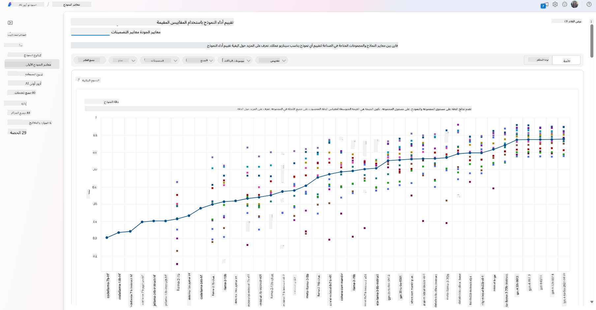
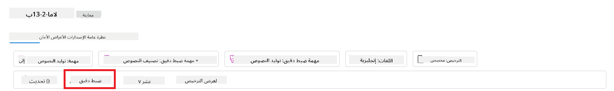
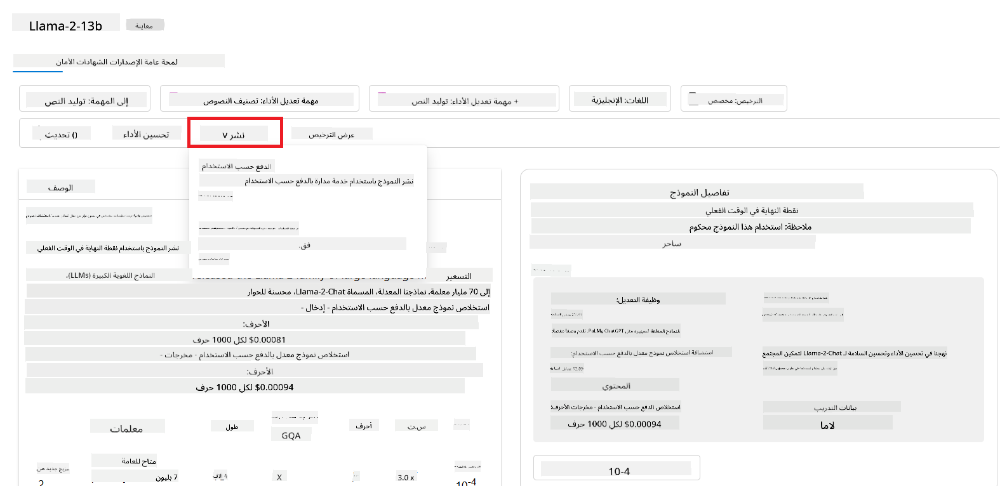
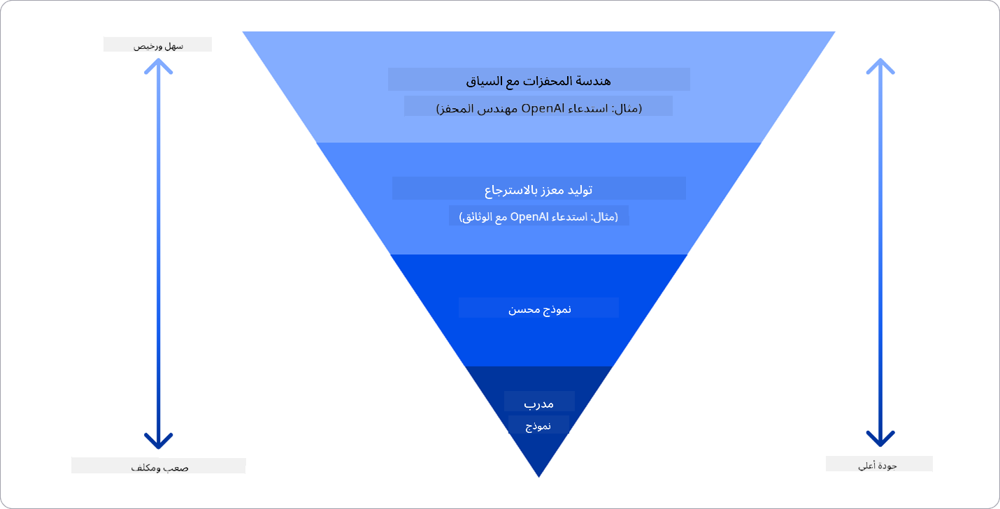

<!--
CO_OP_TRANSLATOR_METADATA:
{
  "original_hash": "e2f686f2eb794941761252ac5e8e090b",
  "translation_date": "2025-05-19T13:43:59+00:00",
  "source_file": "02-exploring-and-comparing-different-llms/README.md",
  "language_code": "ar"
}
-->
# استكشاف ومقارنة نماذج اللغة الكبيرة المختلفة

> _انقر على الصورة أعلاه لمشاهدة فيديو الدرس_

في الدرس السابق، رأينا كيف أن الذكاء الاصطناعي التوليدي يغير مشهد التكنولوجيا، وكيف تعمل نماذج اللغة الكبيرة (LLMs)، وكيف يمكن للأعمال التجارية - مثل شركتنا الناشئة - تطبيقها على حالات استخدامها والنمو! في هذا الفصل، سنقوم بمقارنة وتباين أنواع مختلفة من نماذج اللغة الكبيرة (LLMs) لفهم مزاياها وعيوبها.

الخطوة التالية في رحلة شركتنا الناشئة هي استكشاف مشهد نماذج اللغة الكبيرة الحالي وفهم أي منها مناسب لحالة استخدامنا.

## مقدمة

سيغطي هذا الدرس:

- أنواع مختلفة من نماذج اللغة الكبيرة في المشهد الحالي.
- اختبار وتكرار ومقارنة نماذج مختلفة لحالة استخدامك في Azure.
- كيفية نشر نموذج لغة كبير.

## أهداف التعلم

بعد إكمال هذا الدرس، ستكون قادرًا على:

- اختيار النموذج المناسب لحالة استخدامك.
- فهم كيفية اختبار وتكرار وتحسين أداء النموذج الخاص بك.
- معرفة كيفية نشر النماذج في الأعمال التجارية.

## فهم أنواع مختلفة من نماذج اللغة الكبيرة

يمكن أن تحتوي نماذج اللغة الكبيرة على تصنيفات متعددة بناءً على هيكلها وبيانات التدريب وحالة استخدامها. فهم هذه الاختلافات سيساعد شركتنا الناشئة في اختيار النموذج المناسب للسيناريو وفهم كيفية اختبار وتكرار وتحسين الأداء.

هناك العديد من أنواع نماذج اللغة الكبيرة المختلفة، واختيارك للنموذج يعتمد على ما تهدف إلى استخدامه، وبياناتك، وكم أنت مستعد للدفع والمزيد.

اعتمادًا على ما إذا كنت تهدف إلى استخدام النماذج للنصوص، الصوت، الفيديو، توليد الصور وما إلى ذلك، قد تختار نوعًا مختلفًا من النماذج.

- **التعرف على الصوت والكلام**. لهذا الغرض، تعتبر نماذج من نوع Whisper خيارًا رائعًا لأنها متعددة الأغراض وتهدف إلى التعرف على الكلام. تم تدريبها على مجموعة متنوعة من الصوت ويمكنها تنفيذ التعرف على الكلام بلغات متعددة. تعرف على المزيد حول [نماذج من نوع Whisper هنا](https://platform.openai.com/docs/models/whisper?WT.mc_id=academic-105485-koreyst).

- **توليد الصور**. لتوليد الصور، يعتبر DALL-E وMidjourney خياران معروفان جدًا. يتم تقديم DALL-E بواسطة Azure OpenAI. [اقرأ المزيد عن DALL-E هنا](https://platform.openai.com/docs/models/dall-e?WT.mc_id=academic-105485-koreyst) وأيضًا في الفصل التاسع من هذه المنهجية.

- **توليد النصوص**. معظم النماذج مدربة على توليد النصوص ولديك مجموعة واسعة من الخيارات من GPT-3.5 إلى GPT-4. تأتي بتكاليف مختلفة مع كون GPT-4 الأكثر تكلفة. يستحق النظر في [Azure OpenAI playground](https://oai.azure.com/portal/playground?WT.mc_id=academic-105485-koreyst) لتقييم أي النماذج تناسب احتياجاتك من حيث القدرة والتكلفة.

- **الوسائط المتعددة**. إذا كنت تبحث عن التعامل مع أنواع متعددة من البيانات في المدخلات والمخرجات، قد ترغب في النظر في نماذج مثل [gpt-4 turbo مع الرؤية أو gpt-4o](https://learn.microsoft.com/azure/ai-services/openai/concepts/models#gpt-4-and-gpt-4-turbo-models?WT.mc_id=academic-105485-koreyst) - أحدث إصدارات نماذج OpenAI - التي تستطيع الجمع بين معالجة اللغة الطبيعية وفهم الصور، مما يمكن من التفاعل عبر واجهات متعددة الوسائط.

اختيار نموذج يعني أنك تحصل على بعض القدرات الأساسية، التي قد لا تكون كافية. غالبًا ما يكون لديك بيانات محددة للشركة التي تحتاج بطريقة ما إلى إخبار النموذج عنها. هناك عدة خيارات مختلفة حول كيفية التعامل مع ذلك، المزيد عن ذلك في الأقسام القادمة.

### نماذج الأساس مقابل نماذج اللغة الكبيرة

تم صياغة مصطلح نموذج الأساس بواسطة [باحثين في جامعة ستانفورد](https://arxiv.org/abs/2108.07258?WT.mc_id=academic-105485-koreyst) وتم تعريفه كنموذج ذكاء اصطناعي يتبع بعض المعايير، مثل:

- **يتم تدريبه باستخدام التعلم غير المراقب أو التعلم الذاتي المراقب**، مما يعني أنه يتم تدريبه على بيانات متعددة الوسائط غير معنونة، ولا يتطلب الترقيم البشري أو توصيف البيانات لعملية تدريبه.
- **هي نماذج كبيرة جدًا**، تعتمد على شبكات عصبية عميقة جدًا مدربة على مليارات المعلمات.
- **عادة ما تهدف إلى أن تكون أساسًا لنماذج أخرى**، مما يعني أنه يمكن استخدامها كنقطة انطلاق لبناء نماذج أخرى عليها، وهو ما يمكن القيام به عن طريق ضبط النماذج.

لتوضيح هذا التمييز بشكل أكبر، دعونا نأخذ ChatGPT كمثال. لبناء النسخة الأولى من ChatGPT، كان النموذج المسمى GPT-3.5 بمثابة نموذج الأساس. هذا يعني أن OpenAI استخدمت بعض البيانات الخاصة بالدردشة لإنشاء نسخة مضبوطة من GPT-3.5 كانت متخصصة في الأداء الجيد في سيناريوهات المحادثة، مثل الروبوتات.

### نماذج مفتوحة المصدر مقابل نماذج ملكية

طريقة أخرى لتصنيف نماذج اللغة الكبيرة هي ما إذا كانت مفتوحة المصدر أو ملكية.

النماذج مفتوحة المصدر هي النماذج التي يتم توفيرها للجمهور ويمكن استخدامها من قبل أي شخص. غالبًا ما يتم توفيرها بواسطة الشركة التي أنشأتها، أو بواسطة المجتمع البحثي. تسمح هذه النماذج بالفحص والتعديل والتخصيص لحالات الاستخدام المختلفة في نماذج اللغة الكبيرة. ومع ذلك، فهي ليست دائمًا محسنة للاستخدام في الإنتاج، وقد لا تكون بنفس كفاءة النماذج الملكية. بالإضافة إلى ذلك، قد يكون التمويل للنماذج مفتوحة المصدر محدودًا، وقد لا يتم صيانتها على المدى الطويل أو قد لا يتم تحديثها بأحدث الأبحاث. أمثلة على النماذج مفتوحة المصدر الشهيرة تشمل [Alpaca](https://crfm.stanford.edu/2023/03/13/alpaca.html?WT.mc_id=academic-105485-koreyst)، [Bloom](https://huggingface.co/bigscience/bloom) و[LLaMA](https://llama.meta.com).

النماذج الملكية هي النماذج التي تملكها شركة ولا يتم توفيرها للجمهور. هذه النماذج غالبًا ما تكون محسنة للاستخدام في الإنتاج. ومع ذلك، لا يُسمح بفحصها أو تعديلها أو تخصيصها لحالات استخدام مختلفة. بالإضافة إلى ذلك، فهي ليست دائمًا متاحة مجانًا، وقد تتطلب اشتراكًا أو دفعًا لاستخدامها. أيضًا، لا يتمتع المستخدمون بالتحكم في البيانات التي يتم استخدامها لتدريب النموذج، مما يعني أنهم يجب أن يثقوا في مالك النموذج لضمان الالتزام بخصوصية البيانات والاستخدام المسؤول للذكاء الاصطناعي. أمثلة على النماذج الملكية الشهيرة تشمل [نماذج OpenAI](https://platform.openai.com/docs/models/overview?WT.mc_id=academic-105485-koreyst)، [Google Bard](https://sapling.ai/llm/bard?WT.mc_id=academic-105485-koreyst) أو [Claude 2](https://www.anthropic.com/index/claude-2?WT.mc_id=academic-105485-koreyst).

### التضمين مقابل توليد الصور مقابل توليد النصوص والرموز

يمكن أيضًا تصنيف نماذج اللغة الكبيرة بناءً على المخرجات التي تولدها.

التضمينات هي مجموعة من النماذج التي يمكنها تحويل النص إلى شكل عددي، يسمى التضمين، وهو تمثيل عددي للنص المدخل. تجعل التضمينات من السهل على الآلات فهم العلاقات بين الكلمات أو الجمل ويمكن استخدامها كمدخلات لنماذج أخرى، مثل نماذج التصنيف، أو نماذج التجميع التي لديها أداء أفضل على البيانات العددية. غالبًا ما تستخدم نماذج التضمين في التعلم الانتقالي، حيث يتم بناء نموذج لمهمة بديلة يوجد لها وفرة من البيانات، ثم يتم إعادة استخدام أوزان النموذج (التضمينات) لمهام أخرى تالية. مثال على هذه الفئة هو [OpenAI embeddings](https://platform.openai.com/docs/models/embeddings?WT.mc_id=academic-105485-koreyst).

نماذج توليد الصور هي نماذج تولد الصور. غالبًا ما تستخدم هذه النماذج في تحرير الصور، توليف الصور، وترجمة الصور. غالبًا ما يتم تدريب نماذج توليد الصور على مجموعات بيانات كبيرة من الصور، مثل [LAION-5B](https://laion.ai/blog/laion-5b/?WT.mc_id=academic-105485-koreyst)، ويمكن استخدامها لتوليد صور جديدة أو لتحرير الصور الموجودة بتقنيات مثل التلوين الفائق ودقة الألوان. أمثلة تشمل [DALL-E-3](https://openai.com/dall-e-3?WT.mc_id=academic-105485-koreyst) ونماذج [Stable Diffusion](https://github.com/Stability-AI/StableDiffusion?WT.mc_id=academic-105485-koreyst).

نماذج توليد النصوص والرموز هي نماذج تولد النصوص أو الرموز. غالبًا ما تستخدم هذه النماذج في تلخيص النصوص، الترجمة، والإجابة على الأسئلة. غالبًا ما يتم تدريب نماذج توليد النصوص على مجموعات بيانات كبيرة من النصوص، مثل [BookCorpus](https://www.cv-foundation.org/openaccess/content_iccv_2015/html/Zhu_Aligning_Books_and_ICCV_2015_paper.html?WT.mc_id=academic-105485-koreyst)، ويمكن استخدامها لتوليد نصوص جديدة، أو للإجابة على الأسئلة. نماذج توليد الرموز، مثل [CodeParrot](https://huggingface.co/codeparrot?WT.mc_id=academic-105485-koreyst)، غالبًا ما يتم تدريبها على مجموعات بيانات كبيرة من الرموز، مثل GitHub، ويمكن استخدامها لتوليد رموز جديدة، أو لإصلاح الأخطاء في الرموز الموجودة.

### المشفر-المفكك مقابل المفكك فقط

لنتحدث عن أنواع مختلفة من هياكل نماذج اللغة الكبيرة، دعونا نستخدم تشبيهًا.

تخيل أن مديرك أعطاك مهمة كتابة اختبار للطلاب. لديك زميلان؛ أحدهما مسؤول عن إنشاء المحتوى والآخر مسؤول عن مراجعته.

منشئ المحتوى يشبه نموذج المفكك فقط، يمكنهم النظر إلى الموضوع ورؤية ما كتبته بالفعل ثم يمكنهم كتابة دورة بناءً على ذلك. هم جيدون جدًا في كتابة محتوى جذاب ومعلوماتي، لكنهم ليسوا جيدين في فهم الموضوع وأهداف التعلم. بعض الأمثلة على نماذج المفكك هي نماذج عائلة GPT، مثل GPT-3.

المراجع يشبه نموذج المشفر فقط، ينظر إلى الدورة المكتوبة والإجابات، يلاحظ العلاقة بينها ويفهم السياق، لكنه ليس جيدًا في إنشاء المحتوى. مثال على نموذج المشفر فقط سيكون BERT.

تخيل أنه يمكننا أيضًا أن يكون لدينا شخص يمكنه إنشاء ومراجعة الاختبار، هذا هو نموذج المشفر-المفكك. بعض الأمثلة ستكون BART وT5.

### الخدمة مقابل النموذج

الآن، دعونا نتحدث عن الفرق بين الخدمة والنموذج. الخدمة هي منتج يتم تقديمه بواسطة مزود خدمة سحابي، وغالبًا ما تكون مزيجًا من النماذج والبيانات ومكونات أخرى. النموذج هو المكون الأساسي للخدمة، وغالبًا ما يكون نموذج أساس، مثل نموذج اللغة الكبيرة.

غالبًا ما تكون الخدمات محسنة للاستخدام في الإنتاج وغالبًا ما تكون أسهل في الاستخدام من النماذج، عبر واجهة مستخدم رسومية. ومع ذلك، الخدمات ليست دائمًا متاحة مجانًا، وقد تتطلب اشتراكًا أو دفعًا لاستخدامها، مقابل الاستفادة من معدات وموارد مالك الخدمة، مما يقلل من التكاليف ويسهل التوسع. مثال على الخدمة هو [خدمة Azure OpenAI](https://learn.microsoft.com/azure/ai-services/openai/overview?WT.mc_id=academic-105485-koreyst)، التي تقدم خطة دفع حسب الاستخدام، مما يعني أن المستخدمين يتم تحصيلهم بناءً على مقدار استخدامهم للخدمة. أيضًا، توفر خدمة Azure OpenAI أمانًا على مستوى المؤسسات وإطار عمل للذكاء الاصطناعي المسؤول بالإضافة إلى قدرات النماذج.

النماذج هي مجرد الشبكة العصبية، مع المعلمات والأوزان وغيرها. مما يسمح للشركات بتشغيلها محليًا، ولكنها تحتاج إلى شراء المعدات، وبناء هيكل للتوسع وشراء ترخيص أو استخدام نموذج مفتوح المصدر. نموذج مثل LLaMA متاح للاستخدام، ويتطلب قوة حاسوبية لتشغيل النموذج.

## كيفية اختبار وتكرار مع نماذج مختلفة لفهم الأداء على Azure

بمجرد أن يقوم فريقنا باستكشاف مشهد نماذج اللغة الكبيرة الحالي وتحديد بعض المرشحين الجيدين لسيناريوهاتهم، الخطوة التالية هي اختبارهم على بياناتهم وعلى عبء العمل الخاص بهم. هذه عملية تكرارية، تتم من خلال التجارب والقياسات.
معظم النماذج التي ذكرناها في الفقرات السابقة (نماذج OpenAI، نماذج مفتوحة المصدر مثل Llama2، ومحولات Hugging Face) متوفرة في [كتالوج النماذج](https://learn.microsoft.com/azure/ai-studio/how-to/model-catalog-overview?WT.mc_id=academic-105485-koreyst) في [Azure AI Studio](https://ai.azure.com/?WT.mc_id=academic-105485-koreyst).

[Azure AI Studio](https://learn.microsoft.com/azure/ai-studio/what-is-ai-studio?WT.mc_id=academic-105485-koreyst) هو منصة سحابية مصممة للمطورين لبناء تطبيقات الذكاء الاصطناعي التوليدية وإدارة دورة التطوير بأكملها - من التجريب إلى التقييم - من خلال الجمع بين جميع خدمات Azure AI في مركز واحد مع واجهة مستخدم سهلة. يتيح كتالوج النماذج في Azure AI Studio للمستخدم:

- العثور على نموذج الأساس ذو الاهتمام في الكتالوج - سواء كان ملكيًا أو مفتوح المصدر، مع إمكانية التصفية حسب المهمة أو الترخيص أو الاسم. لتحسين إمكانية البحث، يتم تنظيم النماذج في مجموعات، مثل مجموعة Azure OpenAI، مجموعة Hugging Face، والمزيد.

- مراجعة بطاقة النموذج، بما في ذلك وصف مفصل للاستخدام المقصود وبيانات التدريب، أمثلة على التعليمات البرمجية ونتائج التقييم على مكتبة التقييمات الداخلية.
- قارن بين المعايير عبر النماذج ومجموعات البيانات المتاحة في الصناعة لتقييم أي منها يناسب السيناريو التجاري، من خلال لوحة [معايير النماذج](https://learn.microsoft.com/azure/ai-studio/how-to/model-benchmarks?WT.mc_id=academic-105485-koreyst).

- قم بتحسين النموذج باستخدام بيانات تدريب مخصصة لتحسين أداء النموذج في عبء عمل محدد، مستفيدًا من قدرات التجربة والتتبع في Azure AI Studio.

- انشر النموذج الأصلي المدرب مسبقًا أو النسخة المحسنة إلى استنتاج عن بُعد في الوقت الفعلي - حوسبة مُدارة - أو نقطة نهاية api بدون خادم - [الدفع حسب الاستخدام](https://learn.microsoft.com/azure/ai-studio/how-to/model-catalog-overview#model-deployment-managed-compute-and-serverless-api-pay-as-you-go?WT.mc_id=academic-105485-koreyst) - لتمكين التطبيقات من استهلاكه.

> [!NOTE]
> ليست جميع النماذج في الكتالوج متاحة حاليًا للتحسين و/أو النشر بالدفع حسب الاستخدام. تحقق من بطاقة النموذج للحصول على تفاصيل حول قدرات النموذج وقيوده.

## تحسين نتائج LLM

لقد استكشفنا مع فريق بدء التشغيل لدينا أنواعًا مختلفة من LLM ومنصة سحابية (Azure Machine Learning) تمكننا من مقارنة النماذج المختلفة، تقييمها على بيانات الاختبار، تحسين الأداء ونشرها على نقاط نهاية الاستنتاج.

ولكن متى يجب أن يفكروا في تحسين النموذج بدلاً من استخدام نموذج مدرب مسبقًا؟ هل هناك طرق أخرى لتحسين أداء النموذج في عبء عمل محدد؟

هناك عدة طرق يمكن للأعمال استخدامها للحصول على النتائج التي تحتاجها من LLM. يمكنك اختيار أنواع مختلفة من النماذج بدرجات مختلفة من التدريب عند نشر LLM في الإنتاج، بمستويات مختلفة من التعقيد، التكلفة والجودة. هنا بعض الطرق المختلفة:

- **هندسة التوجيه مع السياق**. الفكرة هي توفير سياق كافٍ عند التوجيه لضمان الحصول على الاستجابات التي تحتاجها.

- **توليد معزز بالاسترجاع، RAG**. قد توجد بياناتك في قاعدة بيانات أو نقطة نهاية ويب على سبيل المثال، لضمان تضمين هذه البيانات أو جزء منها في وقت التوجيه، يمكنك جلب البيانات ذات الصلة وجعلها جزءًا من توجيه المستخدم.

- **نموذج محسّن**. هنا، قمت بتدريب النموذج بشكل أكبر على بياناتك الخاصة مما أدى إلى أن يصبح النموذج أكثر دقة واستجابة لاحتياجاتك ولكنه قد يكون مكلفًا.

مصدر الصورة: [أربع طرق لنشر LLMs في الشركات | مدونة Fiddler AI](https://www.fiddler.ai/blog/four-ways-that-enterprises-deploy-llms?WT.mc_id=academic-105485-koreyst)

### هندسة التوجيه مع السياق

تعمل LLMs المدربة مسبقًا بشكل جيد جدًا في مهام اللغة الطبيعية العامة، حتى عند استدعائها بتوجيه قصير، مثل جملة لإكمالها أو سؤال - ما يسمى بـ "التعلم بدون أمثلة".

ومع ذلك، كلما تمكن المستخدم من صياغة استفساره، بطلب مفصل وأمثلة - السياق - كلما كانت الإجابة أكثر دقة وقربًا من توقعات المستخدم. في هذه الحالة، نتحدث عن "التعلم بأمثلة واحدة" إذا كان التوجيه يحتوي على مثال واحد فقط و"التعلم بأمثلة قليلة" إذا كان يحتوي على أمثلة متعددة.
هندسة التوجيه مع السياق هي النهج الأكثر فعالية من حيث التكلفة للبدء.

### توليد معزز بالاسترجاع (RAG)

لدى LLMs القيد الذي يسمح لها باستخدام البيانات التي تم استخدامها أثناء تدريبها فقط لتوليد الإجابة. هذا يعني أنها لا تعرف شيئًا عن الحقائق التي حدثت بعد عملية التدريب الخاصة بها، ولا يمكنها الوصول إلى المعلومات غير العامة (مثل بيانات الشركة).
يمكن التغلب على هذا من خلال RAG، وهي تقنية تعزز التوجيه ببيانات خارجية في شكل أجزاء من المستندات، مع مراعاة حدود طول التوجيه. يتم دعم ذلك بواسطة أدوات قاعدة بيانات المتجهات (مثل [Azure Vector Search](https://learn.microsoft.com/azure/search/vector-search-overview?WT.mc_id=academic-105485-koreyst)) التي تسترجع الأجزاء المفيدة من مصادر البيانات المحددة مسبقًا وتضيفها إلى سياق التوجيه.

هذه التقنية مفيدة جدًا عندما لا تمتلك الأعمال بيانات كافية، أو وقتًا كافيًا، أو موارد لتحسين LLM، لكنها لا تزال ترغب في تحسين الأداء في عبء عمل محدد وتقليل مخاطر التزييف، أي تشويه الواقع أو المحتوى الضار.

### نموذج محسّن

التحسين هو عملية تستفيد من التعلم الانتقالي لـ "تكييف" النموذج لمهمة لاحقة أو لحل مشكلة محددة. بشكل مختلف عن التعلم بأمثلة قليلة وRAG، ينتج عن ذلك نموذج جديد يتم إنشاؤه، مع أوزان وتحيزات محدثة. يتطلب مجموعة من أمثلة التدريب التي تتكون من إدخال واحد (التوجيه) ومخرجه المرتبط (الإكمال).
سيكون هذا هو النهج المفضل إذا:

- **استخدام نماذج محسّنة**. ترغب الأعمال في استخدام نماذج محسّنة أقل قدرة (مثل نماذج التضمين) بدلاً من النماذج عالية الأداء، مما يؤدي إلى حل أكثر فعالية من حيث التكلفة وسرعة.

- **مراعاة زمن الاستجابة**. زمن الاستجابة مهم لحالة استخدام محددة، لذا لا يمكن استخدام توجيهات طويلة جدًا أو عدد الأمثلة التي يجب تعلمها من النموذج لا يتناسب مع حدود طول التوجيه.

- **البقاء محدثًا**. تمتلك الأعمال الكثير من البيانات عالية الجودة وملصقات الحقيقة الأساسية والموارد المطلوبة للحفاظ على تحديث هذه البيانات بمرور الوقت.

### نموذج مدرب

تدريب LLM من الصفر هو بلا شك النهج الأكثر صعوبة وتعقيدًا لاعتماده، ويتطلب كميات هائلة من البيانات، موارد ماهرة، وقوة حسابية مناسبة. يجب النظر في هذا الخيار فقط في سيناريو حيث تمتلك الأعمال حالة استخدام محددة المجال وكميات كبيرة من البيانات المركزة على المجال.

## اختبار المعرفة

ما يمكن أن يكون نهجًا جيدًا لتحسين نتائج إكمال LLM؟

1. هندسة التوجيه مع السياق
1. RAG
1. نموذج محسّن

ج:3، إذا كان لديك الوقت والموارد والبيانات عالية الجودة، فإن التحسين هو الخيار الأفضل للبقاء محدثًا. ومع ذلك، إذا كنت تبحث عن تحسين الأمور وتفتقر إلى الوقت، فمن الأفضل النظر في RAG أولاً.

## 🚀 التحدي

اقرأ المزيد حول كيفية [استخدام RAG](https://learn.microsoft.com/azure/search/retrieval-augmented-generation-overview?WT.mc_id=academic-105485-koreyst) لأعمالك.

## عمل رائع، تابع التعلم

بعد إكمال هذا الدرس، تحقق من مجموعة [تعلم الذكاء الاصطناعي التوليدي](https://aka.ms/genai-collection?WT.mc_id=academic-105485-koreyst) لتواصل رفع مستوى معرفتك بالذكاء الاصطناعي التوليدي!

انتقل إلى الدرس 3 حيث سننظر في كيفية [البناء بالذكاء الاصطناعي التوليدي بمسؤولية](../03-using-generative-ai-responsibly/README.md?WT.mc_id=academic-105485-koreyst)!

**إخلاء المسؤولية**:  
تم ترجمة هذه الوثيقة باستخدام خدمة ترجمة الذكاء الاصطناعي [Co-op Translator](https://github.com/Azure/co-op-translator). بينما نسعى لتحقيق الدقة، يرجى العلم أن الترجمات الآلية قد تحتوي على أخطاء أو معلومات غير دقيقة. يجب اعتبار الوثيقة الأصلية بلغتها الأصلية المصدر الموثوق. بالنسبة للمعلومات الحساسة، يُوصى بالترجمة البشرية المهنية. نحن غير مسؤولين عن أي سوء فهم أو تفسيرات خاطئة تنشأ عن استخدام هذه الترجمة.