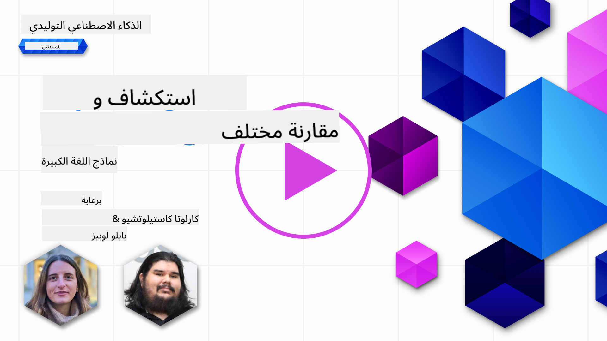
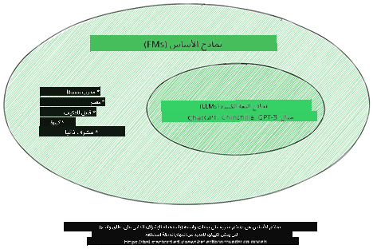
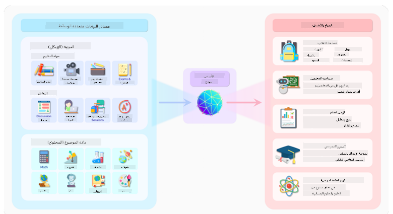
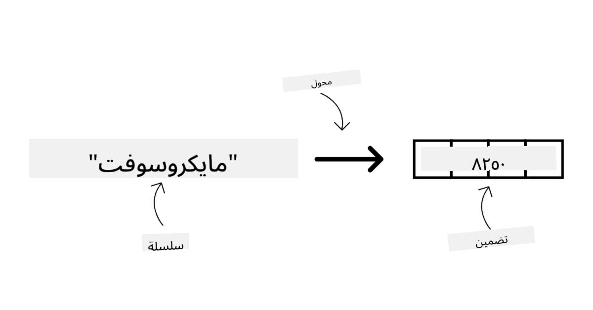
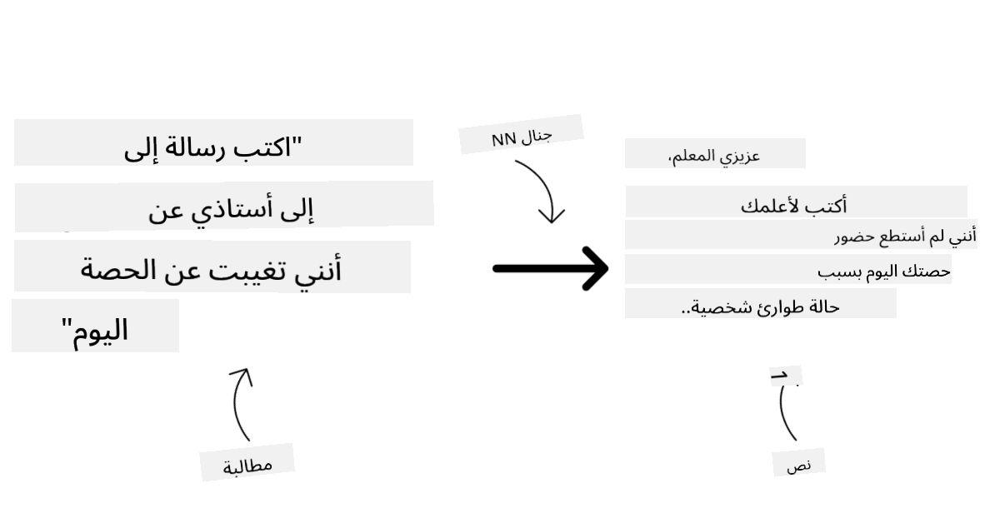
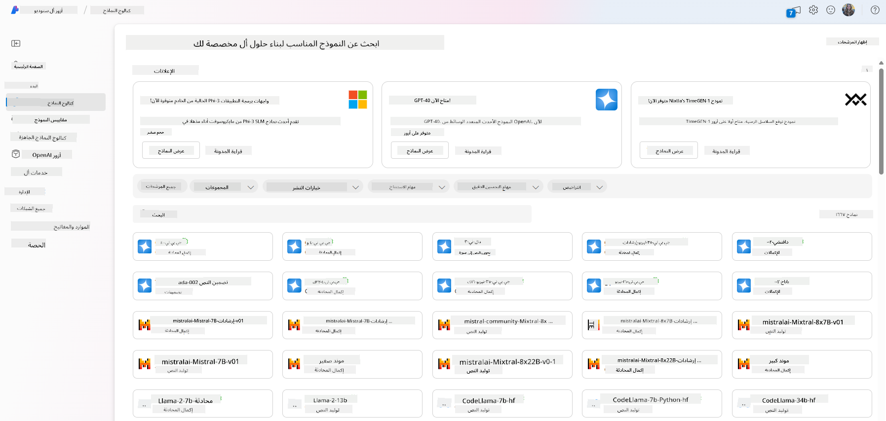
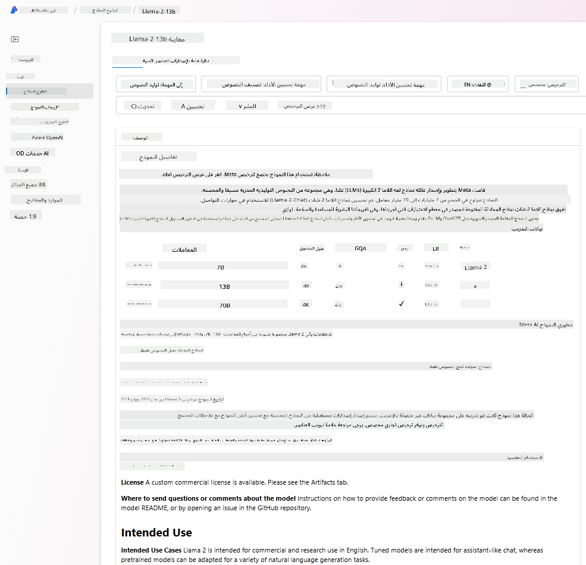
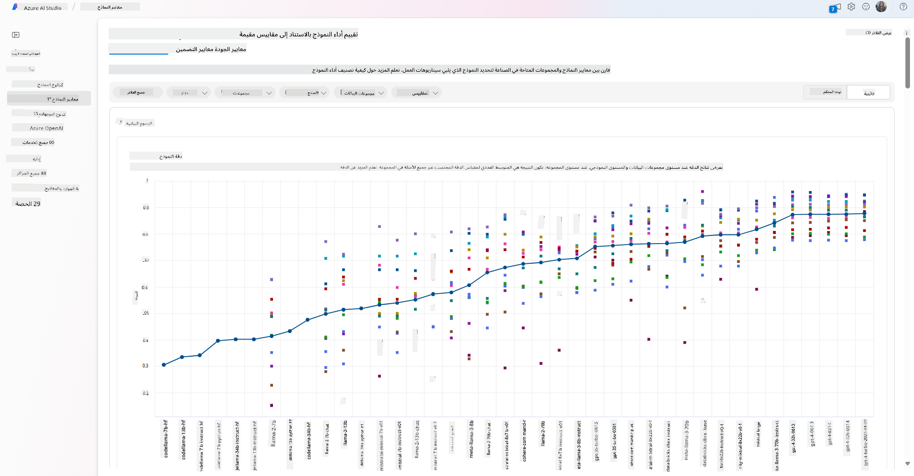
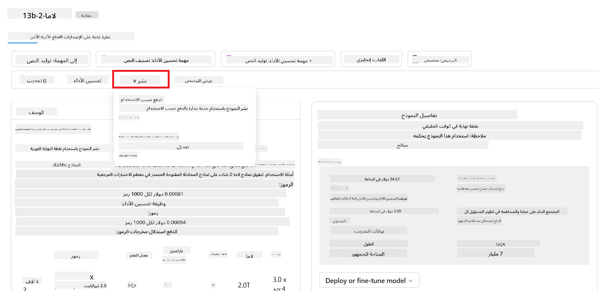

<!--
CO_OP_TRANSLATOR_METADATA:
{
  "original_hash": "6b7629b8ee4d7d874a27213e903d86a7",
  "translation_date": "2025-10-17T13:00:14+00:00",
  "source_file": "02-exploring-and-comparing-different-llms/README.md",
  "language_code": "ar"
}
-->
# استكشاف ومقارنة نماذج اللغة الكبيرة (LLMs)

> _اضغط على الصورة أعلاه لمشاهدة فيديو الدرس_

في الدرس السابق، رأينا كيف أن الذكاء الاصطناعي التوليدي يغير مشهد التكنولوجيا، وكيف تعمل نماذج اللغة الكبيرة (LLMs)، وكيف يمكن للأعمال - مثل شركتنا الناشئة - تطبيقها على حالات الاستخدام الخاصة بها والنمو! في هذا الفصل، سنقوم بمقارنة وتباين أنواع مختلفة من نماذج اللغة الكبيرة لفهم مزاياها وعيوبها.

الخطوة التالية في رحلة شركتنا الناشئة هي استكشاف المشهد الحالي لنماذج اللغة الكبيرة وفهم أيها مناسب لحالة الاستخدام الخاصة بنا.

## المقدمة

سيغطي هذا الدرس:

- أنواع مختلفة من نماذج اللغة الكبيرة في المشهد الحالي.
- اختبار وتكرار ومقارنة النماذج المختلفة لحالة الاستخدام الخاصة بك في Azure.
- كيفية نشر نموذج لغة كبير.

## أهداف التعلم

بعد إكمال هذا الدرس، ستكون قادرًا على:

- اختيار النموذج المناسب لحالة الاستخدام الخاصة بك.
- فهم كيفية اختبار وتكرار وتحسين أداء النموذج.
- معرفة كيفية نشر الشركات للنماذج.

## فهم الأنواع المختلفة لنماذج اللغة الكبيرة

يمكن تصنيف نماذج اللغة الكبيرة بناءً على هيكلها، بيانات التدريب، وحالة الاستخدام. فهم هذه الاختلافات سيساعد شركتنا الناشئة في اختيار النموذج المناسب للسيناريو، وفهم كيفية اختبار وتكرار وتحسين الأداء.

هناك العديد من الأنواع المختلفة لنماذج اللغة الكبيرة، ويعتمد اختيارك للنموذج على ما تهدف إلى استخدامه، بياناتك، ومدى استعدادك للدفع والمزيد.

اعتمادًا على ما إذا كنت تهدف إلى استخدام النماذج للنصوص، الصوت، الفيديو، توليد الصور وما إلى ذلك، قد تختار نوعًا مختلفًا من النماذج.

- **التعرف على الصوت والكلام**. لهذا الغرض، تعتبر نماذج من نوع Whisper خيارًا رائعًا لأنها متعددة الأغراض وموجهة نحو التعرف على الكلام. يتم تدريبها على صوت متنوع ويمكنها أداء التعرف على الكلام متعدد اللغات. تعرف على المزيد حول [نماذج Whisper هنا](https://platform.openai.com/docs/models/whisper?WT.mc_id=academic-105485-koreyst).

- **توليد الصور**. لتوليد الصور، يعد DALL-E وMidjourney خيارين معروفين جدًا. يتم تقديم DALL-E بواسطة Azure OpenAI. [اقرأ المزيد عن DALL-E هنا](https://platform.openai.com/docs/models/dall-e?WT.mc_id=academic-105485-koreyst) وأيضًا في الفصل التاسع من هذا المنهج.

- **توليد النصوص**. معظم النماذج مدربة على توليد النصوص وهناك مجموعة واسعة من الخيارات من GPT-3.5 إلى GPT-4. تأتي بتكاليف مختلفة مع كون GPT-4 الأكثر تكلفة. من المفيد استكشاف [ملعب Azure OpenAI](https://oai.azure.com/portal/playground?WT.mc_id=academic-105485-koreyst) لتقييم أي النماذج تناسب احتياجاتك من حيث القدرة والتكلفة.

- **التعددية الوسائطية**. إذا كنت تبحث عن التعامل مع أنواع متعددة من البيانات في المدخلات والمخرجات، قد ترغب في النظر في نماذج مثل [gpt-4 turbo مع الرؤية أو gpt-4o](https://learn.microsoft.com/azure/ai-services/openai/concepts/models#gpt-4-and-gpt-4-turbo-models?WT.mc_id=academic-105485-koreyst) - أحدث إصدارات نماذج OpenAI - التي تجمع بين معالجة اللغة الطبيعية والفهم البصري، مما يتيح التفاعل عبر واجهات متعددة الوسائط.

اختيار النموذج يعني أنك تحصل على بعض القدرات الأساسية، التي قد لا تكون كافية. غالبًا ما يكون لديك بيانات خاصة بالشركة تحتاج بطريقة ما إلى إخبار النموذج بها. هناك بعض الخيارات المختلفة حول كيفية التعامل مع ذلك، المزيد عن ذلك في الأقسام القادمة.

### النماذج الأساسية مقابل نماذج اللغة الكبيرة

تم صياغة مصطلح النموذج الأساسي من قبل [باحثي جامعة ستانفورد](https://arxiv.org/abs/2108.07258?WT.mc_id=academic-105485-koreyst) وتم تعريفه كنموذج ذكاء اصطناعي يتبع بعض المعايير، مثل:

- **يتم تدريبه باستخدام التعلم غير المراقب أو التعلم الذاتي المراقب**، مما يعني أنه يتم تدريبه على بيانات متعددة الوسائط غير موسومة، ولا يتطلب التوضيح أو التوسيم البشري للبيانات لعملية التدريب.
- **نماذج كبيرة جدًا**، تعتمد على شبكات عصبية عميقة جدًا مدربة على مليارات المعلمات.
- **عادةً ما تكون مخصصة لتكون "أساسًا" لنماذج أخرى**، مما يعني أنه يمكن استخدامها كنقطة انطلاق لبناء نماذج أخرى عليها، وهو ما يمكن القيام به من خلال التخصيص.

مصدر الصورة: [Essential Guide to Foundation Models and Large Language Models | by Babar M Bhatti | Medium
](https://thebabar.medium.com/essential-guide-to-foundation-models-and-large-language-models-27dab58f7404)

لتوضيح هذا التمييز بشكل أكبر، دعونا نأخذ ChatGPT كمثال. لبناء النسخة الأولى من ChatGPT، تم استخدام نموذج يسمى GPT-3.5 كنموذج أساسي. هذا يعني أن OpenAI استخدمت بعض البيانات الخاصة بالدردشة لإنشاء نسخة مخصصة من GPT-3.5 متخصصة في الأداء الجيد في سيناريوهات المحادثة، مثل روبوتات الدردشة.

مصدر الصورة: [2108.07258.pdf (arxiv.org)](https://arxiv.org/pdf/2108.07258.pdf?WT.mc_id=academic-105485-koreyst)

### النماذج مفتوحة المصدر مقابل النماذج الملكية

طريقة أخرى لتصنيف نماذج اللغة الكبيرة هي ما إذا كانت مفتوحة المصدر أو ملكية.

النماذج مفتوحة المصدر هي نماذج متاحة للجمهور ويمكن لأي شخص استخدامها. غالبًا ما يتم توفيرها من قبل الشركة التي أنشأتها، أو من قبل المجتمع البحثي. هذه النماذج يمكن فحصها، تعديلها، وتخصيصها لحالات الاستخدام المختلفة في نماذج اللغة الكبيرة. ومع ذلك، فهي ليست دائمًا محسنة للاستخدام الإنتاجي، وقد لا تكون بنفس كفاءة النماذج الملكية. بالإضافة إلى ذلك، قد يكون تمويل النماذج مفتوحة المصدر محدودًا، وقد لا يتم صيانتها على المدى الطويل أو تحديثها بأحدث الأبحاث. أمثلة على النماذج مفتوحة المصدر الشهيرة تشمل [Alpaca](https://crfm.stanford.edu/2023/03/13/alpaca.html?WT.mc_id=academic-105485-koreyst)، [Bloom](https://huggingface.co/bigscience/bloom) و [LLaMA](https://llama.meta.com).

النماذج الملكية هي نماذج مملوكة لشركة وليست متاحة للجمهور. غالبًا ما تكون هذه النماذج محسنة للاستخدام الإنتاجي. ومع ذلك، لا يُسمح بفحصها، تعديلها، أو تخصيصها لحالات الاستخدام المختلفة. بالإضافة إلى ذلك، فهي ليست دائمًا متاحة مجانًا، وقد تتطلب اشتراكًا أو دفعًا لاستخدامها. أيضًا، لا يتحكم المستخدمون في البيانات المستخدمة لتدريب النموذج، مما يعني أنهم يجب أن يثقوا في مالك النموذج لضمان الالتزام بخصوصية البيانات والاستخدام المسؤول للذكاء الاصطناعي. أمثلة على النماذج الملكية الشهيرة تشمل [نماذج OpenAI](https://platform.openai.com/docs/models/overview?WT.mc_id=academic-105485-koreyst)، [Google Bard](https://sapling.ai/llm/bard?WT.mc_id=academic-105485-koreyst) أو [Claude 2](https://www.anthropic.com/index/claude-2?WT.mc_id=academic-105485-koreyst).

### التضمين مقابل توليد الصور مقابل توليد النصوص والرموز

يمكن أيضًا تصنيف نماذج اللغة الكبيرة بناءً على المخرجات التي تولدها.

التضمينات هي مجموعة من النماذج التي يمكنها تحويل النص إلى شكل رقمي، يسمى التضمين، وهو تمثيل رقمي للنص المدخل. التضمينات تجعل من السهل على الآلات فهم العلاقات بين الكلمات أو الجمل ويمكن استهلاكها كمدخلات بواسطة نماذج أخرى، مثل نماذج التصنيف، أو نماذج التجميع التي تتمتع بأداء أفضل على البيانات الرقمية. غالبًا ما تُستخدم نماذج التضمين في التعلم الانتقالي، حيث يتم بناء نموذج لمهمة بديلة تتوفر لها وفرة من البيانات، ثم يتم إعادة استخدام أوزان النموذج (التضمينات) لمهام أخرى. مثال على هذه الفئة هو [تضمينات OpenAI](https://platform.openai.com/docs/models/embeddings?WT.mc_id=academic-105485-koreyst).

نماذج توليد الصور هي نماذج تولد صورًا. غالبًا ما تُستخدم هذه النماذج لتحرير الصور، تركيب الصور، وترجمة الصور. غالبًا ما يتم تدريب نماذج توليد الصور على مجموعات بيانات كبيرة من الصور، مثل [LAION-5B](https://laion.ai/blog/laion-5b/?WT.mc_id=academic-105485-koreyst)، ويمكن استخدامها لتوليد صور جديدة أو لتحرير الصور الموجودة باستخدام تقنيات مثل التلوين، تحسين الدقة، وتقنيات التلوين. أمثلة تشمل [DALL-E-3](https://openai.com/dall-e-3?WT.mc_id=academic-105485-koreyst) و [نماذج Stable Diffusion](https://github.com/Stability-AI/StableDiffusion?WT.mc_id=academic-105485-koreyst).

نماذج توليد النصوص والرموز هي نماذج تولد نصوصًا أو رموزًا. غالبًا ما تُستخدم هذه النماذج لتلخيص النصوص، الترجمة، والإجابة على الأسئلة. غالبًا ما يتم تدريب نماذج توليد النصوص على مجموعات بيانات كبيرة من النصوص، مثل [BookCorpus](https://www.cv-foundation.org/openaccess/content_iccv_2015/html/Zhu_Aligning_Books_and_ICCV_2015_paper.html?WT.mc_id=academic-105485-koreyst)، ويمكن استخدامها لتوليد نصوص جديدة، أو للإجابة على الأسئلة. نماذج توليد الرموز، مثل [CodeParrot](https://huggingface.co/codeparrot?WT.mc_id=academic-105485-koreyst)، غالبًا ما يتم تدريبها على مجموعات بيانات كبيرة من الرموز، مثل GitHub، ويمكن استخدامها لتوليد رموز جديدة، أو لإصلاح الأخطاء في الرموز الموجودة.

### التشفير-الفك مقابل الفك فقط

لنتحدث عن الأنواع المختلفة من هيكليات نماذج اللغة الكبيرة باستخدام تشبيه.

تخيل أن مديرك أعطاك مهمة كتابة اختبار للطلاب. لديك زميلان؛ أحدهما مسؤول عن إنشاء المحتوى والآخر مسؤول عن مراجعته.

منشئ المحتوى يشبه نموذج فك فقط، يمكنه النظر إلى الموضوع ورؤية ما كتبته بالفعل ثم كتابة دورة بناءً على ذلك. هم جيدون جدًا في كتابة محتوى جذاب ومعلوماتي، لكنهم ليسوا جيدين في فهم الموضوع وأهداف التعلم. بعض أمثلة نماذج الفك فقط هي نماذج عائلة GPT، مثل GPT-3.

المراجع يشبه نموذج تشفير فقط، ينظر إلى الدورة المكتوبة والإجابات، يلاحظ العلاقة بينها ويفهم السياق، لكنه ليس جيدًا في إنشاء المحتوى. مثال على نموذج تشفير فقط سيكون BERT.

تخيل أنه يمكننا أيضًا أن يكون لدينا شخص يمكنه إنشاء ومراجعة الاختبار، هذا هو نموذج تشفير-فك. بعض الأمثلة ستكون BART وT5.

### الخدمة مقابل النموذج

الآن، دعونا نتحدث عن الفرق بين الخدمة والنموذج. الخدمة هي منتج يتم تقديمه بواسطة مزود خدمة السحابة، وغالبًا ما تكون مزيجًا من النماذج، البيانات، والمكونات الأخرى. النموذج هو المكون الأساسي للخدمة، وغالبًا ما يكون نموذجًا أساسيًا، مثل نموذج لغة كبير.

الخدمات غالبًا ما تكون محسنة للاستخدام الإنتاجي وغالبًا ما تكون أسهل في الاستخدام من النماذج، عبر واجهة مستخدم رسومية. ومع ذلك، الخدمات ليست دائمًا متاحة مجانًا، وقد تتطلب اشتراكًا أو دفعًا لاستخدامها، مقابل الاستفادة من معدات وموارد مالك الخدمة، تحسين النفقات والتوسع بسهولة. مثال على الخدمة هو [خدمة Azure OpenAI](https://learn.microsoft.com/azure/ai-services/openai/overview?WT.mc_id=academic-105485-koreyst)، التي تقدم خطة دفع حسب الاستخدام، مما يعني أن المستخدمين يتم تحصيل رسومهم بشكل متناسب مع مقدار استخدامهم للخدمة. أيضًا، تقدم خدمة Azure OpenAI أمانًا على مستوى المؤسسات وإطار عمل ذكاء اصطناعي مسؤول فوق قدرات النماذج.

النماذج هي فقط الشبكة العصبية، مع المعلمات، الأوزان، وغيرها. مما يسمح للشركات بتشغيلها محليًا، ومع ذلك، ستحتاج إلى شراء معدات، بناء هيكل للتوسع وشراء ترخيص أو استخدام نموذج مفتوح المصدر. نموذج مثل LLaMA متاح للاستخدام، ويتطلب قوة حسابية لتشغيل النموذج.

## كيفية اختبار وتكرار النماذج المختلفة لفهم الأداء على Azure

بمجرد أن يستكشف فريقنا مشهد نماذج اللغة الكبيرة الحالي ويحدد بعض المرشحين الجيدين لسيناريوهاتهم، الخطوة التالية هي اختبارهم على بياناتهم وعلى عبء العمل الخاص بهم. هذه عملية تكرارية، تتم من خلال التجارب والقياسات.
معظم النماذج التي ذكرناها في الفقرات السابقة (نماذج OpenAI، النماذج مفتوحة المصدر مثل Llama2، و Hugging Face transformers) متوفرة في [كتالوج النماذج](https://learn.microsoft.com/azure/ai-studio/how-to/model-catalog-overview?WT.mc_id=academic-105485-koreyst) في [Azure AI Studio](https://ai.azure.com/?WT.mc_id=academic-105485-koreyst).

[Azure AI Studio](https://learn.microsoft.com/azure/ai-studio/what-is-ai-studio?WT.mc_id=academic-105485-koreyst) هو منصة سحابية مصممة للمطورين لبناء تطبيقات الذكاء الاصطناعي التوليدي وإدارة دورة التطوير بالكامل - من التجربة إلى التقييم - من خلال دمج جميع خدمات Azure AI في مركز واحد بواجهة مستخدم سهلة الاستخدام. يتيح كتالوج النماذج في Azure AI Studio للمستخدم:

- العثور على نموذج الأساس المطلوب في الكتالوج - سواء كان مملوكًا أو مفتوح المصدر، مع إمكانية التصفية حسب المهمة أو الترخيص أو الاسم. لتحسين إمكانية البحث، يتم تنظيم النماذج في مجموعات، مثل مجموعة Azure OpenAI، مجموعة Hugging Face، والمزيد.

- مراجعة بطاقة النموذج، بما في ذلك وصف مفصل للاستخدام المقصود وبيانات التدريب، أمثلة على التعليمات البرمجية ونتائج التقييم في مكتبة التقييمات الداخلية.

- مقارنة الأداء بين النماذج ومجموعات البيانات المتاحة في الصناعة لتقييم أي منها يناسب سيناريو العمل، من خلال لوحة [معايير النماذج](https://learn.microsoft.com/azure/ai-studio/how-to/model-benchmarks?WT.mc_id=academic-105485-koreyst).

- تحسين النموذج باستخدام بيانات تدريب مخصصة لتحسين أداء النموذج في عبء عمل معين، بالاستفادة من قدرات التجربة والتتبع في Azure AI Studio.

- نشر النموذج المدرب مسبقًا أو النسخة المحسنة منه للاستدلال في الوقت الحقيقي - الحوسبة المدارة - أو نقطة نهاية API بدون خادم - [الدفع حسب الاستخدام](https://learn.microsoft.com/azure/ai-studio/how-to/model-catalog-overview#model-deployment-managed-compute-and-serverless-api-pay-as-you-go?WT.mc_id=academic-105485-koreyst) - لتمكين التطبيقات من استخدامه.

> [!NOTE]
> ليست كل النماذج في الكتالوج متاحة حاليًا للتحسين و/أو النشر بالدفع حسب الاستخدام. تحقق من بطاقة النموذج للحصول على تفاصيل حول قدرات النموذج وقيوده.

## تحسين نتائج LLM

لقد استكشفنا مع فريقنا الناشئ أنواعًا مختلفة من LLMs ومنصة سحابية (Azure Machine Learning) تمكننا من مقارنة النماذج المختلفة، تقييمها على بيانات الاختبار، تحسين الأداء ونشرها على نقاط نهاية الاستدلال.

ولكن متى يجب أن يفكروا في تحسين نموذج بدلاً من استخدام نموذج مدرب مسبقًا؟ هل هناك طرق أخرى لتحسين أداء النموذج في عبء عمل معين؟

هناك عدة طرق يمكن للشركات استخدامها للحصول على النتائج التي تحتاجها من LLM. يمكنك اختيار أنواع مختلفة من النماذج بدرجات مختلفة من التدريب عند نشر LLM في الإنتاج، مع مستويات مختلفة من التعقيد، التكلفة، والجودة. إليك بعض الطرق المختلفة:

- **هندسة التوجيه مع السياق**. الفكرة هي تقديم سياق كافٍ عند التوجيه لضمان الحصول على الإجابات المطلوبة.

- **توليد معزز بالاسترجاع (RAG)**. قد تكون بياناتك موجودة في قاعدة بيانات أو نقطة نهاية ويب على سبيل المثال، لضمان تضمين هذه البيانات أو جزء منها في وقت التوجيه، يمكنك استرجاع البيانات ذات الصلة وجعلها جزءًا من توجيه المستخدم.

- **نموذج محسّن**. هنا، يتم تدريب النموذج بشكل إضافي على بياناتك الخاصة مما يؤدي إلى أن يصبح النموذج أكثر دقة واستجابة لاحتياجاتك ولكنه قد يكون مكلفًا.

مصدر الصورة: [أربع طرق لنشر LLMs في المؤسسات | مدونة Fiddler AI](https://www.fiddler.ai/blog/four-ways-that-enterprises-deploy-llms?WT.mc_id=academic-105485-koreyst)

### هندسة التوجيه مع السياق

تعمل LLMs المدربة مسبقًا بشكل جيد جدًا في مهام اللغة الطبيعية العامة، حتى عند استدعائها بتوجيه قصير، مثل جملة لإكمالها أو سؤال – ما يسمى بـ "التعلم بدون أمثلة".

ومع ذلك، كلما استطاع المستخدم صياغة استفساره بشكل أفضل، مع طلب مفصل وأمثلة – السياق – كلما كانت الإجابة أكثر دقة وأقرب لتوقعات المستخدم. في هذه الحالة، نتحدث عن "التعلم بأمثلة واحدة" إذا كان التوجيه يتضمن مثالًا واحدًا فقط و"التعلم بأمثلة قليلة" إذا كان يتضمن أمثلة متعددة. هندسة التوجيه مع السياق هي الطريقة الأكثر فعالية من حيث التكلفة للبدء.

### توليد معزز بالاسترجاع (RAG)

تواجه LLMs قيودًا حيث يمكنها استخدام فقط البيانات التي تم استخدامها أثناء تدريبها لتوليد الإجابة. هذا يعني أنها لا تعرف أي شيء عن الحقائق التي حدثت بعد عملية تدريبها، ولا يمكنها الوصول إلى المعلومات غير العامة (مثل بيانات الشركة).
يمكن التغلب على ذلك من خلال RAG، وهي تقنية تعزز التوجيه ببيانات خارجية على شكل أجزاء من الوثائق، مع مراعاة حدود طول التوجيه. يتم دعم ذلك بواسطة أدوات قواعد البيانات المتجهية (مثل [Azure Vector Search](https://learn.microsoft.com/azure/search/vector-search-overview?WT.mc_id=academic-105485-koreyst)) التي تسترجع الأجزاء المفيدة من مصادر البيانات المحددة مسبقًا وتضيفها إلى سياق التوجيه.

هذه التقنية مفيدة جدًا عندما لا تمتلك الشركة بيانات كافية، أو وقتًا كافيًا، أو موارد لتحسين LLM، ولكنها لا تزال ترغب في تحسين الأداء في عبء عمل معين وتقليل مخاطر التزييف، أي تشويه الواقع أو المحتوى الضار.

### النموذج المحسّن

التحسين هو عملية تستفيد من التعلم الانتقالي لـ "تكييف" النموذج لمهمة لاحقة أو لحل مشكلة معينة. على عكس التعلم بأمثلة قليلة وRAG، فإنه يؤدي إلى إنشاء نموذج جديد، مع تحديث الأوزان والتحيزات. يتطلب مجموعة من أمثلة التدريب تتكون من إدخال واحد (التوجيه) ومخرجه المرتبط (الإكمال).
سيكون هذا النهج المفضل إذا:

- **استخدام النماذج المحسّنة**. ترغب الشركة في استخدام نماذج محسّنة أقل قدرة (مثل نماذج التضمين) بدلاً من النماذج عالية الأداء، مما يؤدي إلى حل أكثر فعالية من حيث التكلفة وسرعة.

- **مراعاة التأخير**. التأخير مهم لحالة استخدام معينة، لذا لا يمكن استخدام توجيهات طويلة جدًا أو عدد الأمثلة التي يجب أن يتعلمها النموذج لا تتناسب مع حدود طول التوجيه.

- **البقاء على اطلاع دائم**. تمتلك الشركة الكثير من البيانات عالية الجودة وعلامات الحقيقة الأرضية والموارد اللازمة للحفاظ على تحديث هذه البيانات بمرور الوقت.

### النموذج المدرب

تدريب LLM من الصفر هو بلا شك النهج الأكثر صعوبة وتعقيدًا لاعتماده، حيث يتطلب كميات هائلة من البيانات، موارد ماهرة، وقوة حسابية مناسبة. يجب النظر في هذا الخيار فقط في سيناريو حيث تمتلك الشركة حالة استخدام خاصة بالمجال وكمية كبيرة من البيانات الخاصة بالمجال.

## اختبار المعرفة

ما هو النهج الجيد لتحسين نتائج إكمال LLM؟

1. هندسة التوجيه مع السياق  
1. RAG  
1. النموذج المحسّن  

الإجابة: 3، إذا كان لديك الوقت والموارد والبيانات عالية الجودة، فإن التحسين هو الخيار الأفضل للبقاء على اطلاع دائم. ومع ذلك، إذا كنت تبحث عن تحسين الأمور وتفتقر إلى الوقت، فمن المفيد النظر في RAG أولاً.

## 🚀 التحدي

اقرأ المزيد حول كيفية [استخدام RAG](https://learn.microsoft.com/azure/search/retrieval-augmented-generation-overview?WT.mc_id=academic-105485-koreyst) لشركتك.

## عمل رائع، استمر في التعلم

بعد إكمال هذا الدرس، تحقق من [مجموعة تعلم الذكاء الاصطناعي التوليدي](https://aka.ms/genai-collection?WT.mc_id=academic-105485-koreyst) لمواصلة تعزيز معرفتك بالذكاء الاصطناعي التوليدي!

انتقل إلى الدرس الثالث حيث سنستعرض كيفية [البناء باستخدام الذكاء الاصطناعي التوليدي بمسؤولية](../03-using-generative-ai-responsibly/README.md?WT.mc_id=academic-105485-koreyst)!

---

**إخلاء المسؤولية**:  
تم ترجمة هذا المستند باستخدام خدمة الترجمة بالذكاء الاصطناعي [Co-op Translator](https://github.com/Azure/co-op-translator). بينما نسعى لتحقيق الدقة، يرجى العلم أن الترجمات الآلية قد تحتوي على أخطاء أو عدم دقة. يجب اعتبار المستند الأصلي بلغته الأصلية المصدر الموثوق. للحصول على معلومات حاسمة، يُوصى بالترجمة البشرية الاحترافية. نحن غير مسؤولين عن أي سوء فهم أو تفسيرات خاطئة ناتجة عن استخدام هذه الترجمة.