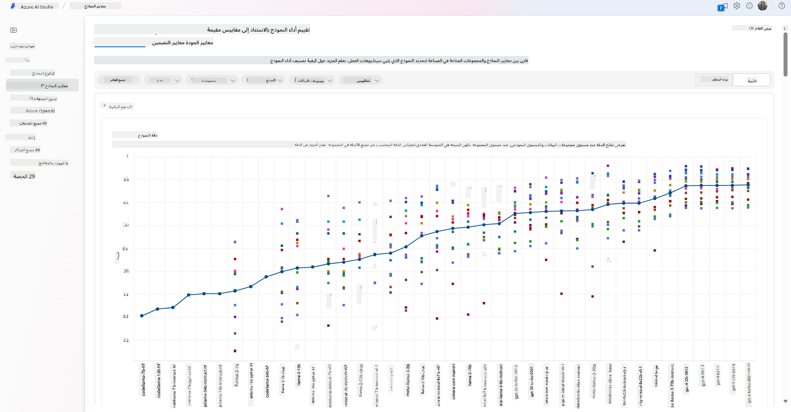
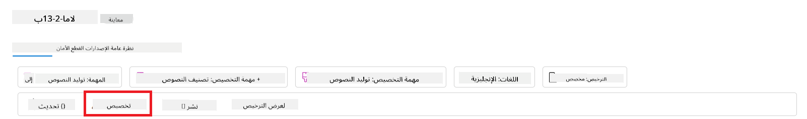
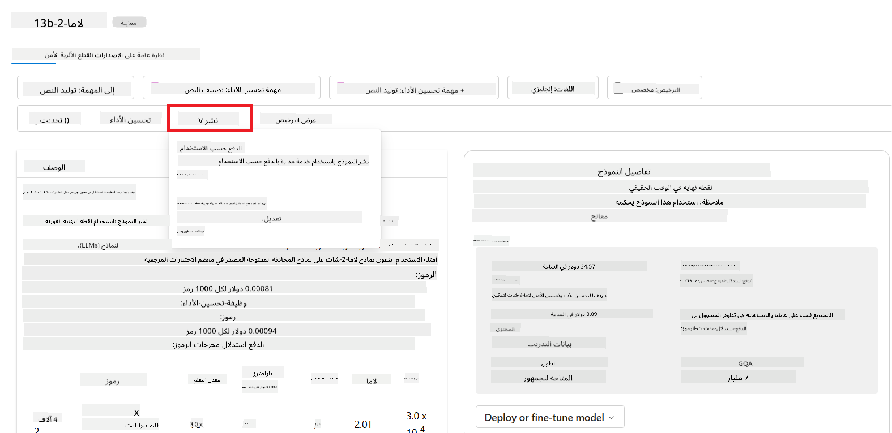

<!--
CO_OP_TRANSLATOR_METADATA:
{
  "original_hash": "e2f686f2eb794941761252ac5e8e090b",
  "translation_date": "2025-06-25T10:16:48+00:00",
  "source_file": "02-exploring-and-comparing-different-llms/README.md",
  "language_code": "ar"
}
-->
# استكشاف ومقارنة نماذج اللغات الكبيرة المختلفة

> _انقر على الصورة أعلاه لمشاهدة فيديو هذه الدرس_

في الدرس السابق، رأينا كيف يغير الذكاء الاصطناعي التوليدي مشهد التكنولوجيا، وكيف تعمل نماذج اللغات الكبيرة (LLMs) وكيف يمكن للأعمال التجارية - مثل شركتنا الناشئة - تطبيقها على حالات الاستخدام الخاصة بها والنمو! في هذا الفصل، سنقوم بمقارنة وتباين أنواع مختلفة من نماذج اللغات الكبيرة (LLMs) لفهم مزاياها وعيوبها.

الخطوة التالية في رحلة شركتنا الناشئة هي استكشاف المشهد الحالي لنماذج اللغات الكبيرة وفهم أيها مناسب لحالة الاستخدام لدينا.

## المقدمة

سيتناول هذا الدرس:

- أنواع مختلفة من نماذج اللغات الكبيرة في المشهد الحالي.
- اختبار وتكرار ومقارنة النماذج المختلفة لحالة الاستخدام الخاصة بك في Azure.
- كيفية نشر نموذج لغة كبيرة.

## أهداف التعلم

بعد إكمال هذا الدرس، ستكون قادرًا على:

- اختيار النموذج المناسب لحالة الاستخدام الخاصة بك.
- فهم كيفية اختبار وتكرار وتحسين أداء النموذج الخاص بك.
- معرفة كيفية نشر الشركات للنماذج.

## فهم أنواع مختلفة من نماذج اللغات الكبيرة

يمكن أن يكون لنماذج اللغات الكبيرة تصنيفات متعددة بناءً على هيكلها وبيانات التدريب وحالة الاستخدام. فهم هذه الاختلافات سيساعد شركتنا الناشئة في اختيار النموذج المناسب للسيناريو، وفهم كيفية اختبار وتكرار وتحسين الأداء.

هناك العديد من الأنواع المختلفة لنماذج اللغات الكبيرة، يعتمد اختيار النموذج على ما تهدف لاستخدامه من أجله، بياناتك، مقدار ما أنت مستعد لدفعه والمزيد.

اعتمادًا على ما إذا كنت تهدف لاستخدام النماذج في النص، الصوت، الفيديو، توليد الصور وما إلى ذلك، قد تختار نوعًا مختلفًا من النموذج.

- **التعرف على الصوت والكلام**. لهذا الغرض، تعتبر نماذج من نوع Whisper خيارًا رائعًا لأنها متعددة الأغراض وتهدف إلى التعرف على الكلام. تم تدريبها على مجموعة متنوعة من الصوت ويمكنها أداء التعرف على الكلام متعدد اللغات. تعرف على المزيد حول [نماذج من نوع Whisper هنا](https://platform.openai.com/docs/models/whisper?WT.mc_id=academic-105485-koreyst).

- **توليد الصور**. بالنسبة لتوليد الصور، DALL-E و Midjourney هما خياران معروفان جدًا. يتم تقديم DALL-E بواسطة Azure OpenAI. [اقرأ المزيد عن DALL-E هنا](https://platform.openai.com/docs/models/dall-e?WT.mc_id=academic-105485-koreyst) وأيضًا في الفصل التاسع من هذا المنهج.

- **توليد النصوص**. معظم النماذج مدربة على توليد النصوص ولديك مجموعة متنوعة من الخيارات من GPT-3.5 إلى GPT-4. تأتي بتكاليف مختلفة مع GPT-4 كونها الأغلى. من المفيد النظر في [الملعب الخاص بـ Azure OpenAI](https://oai.azure.com/portal/playground?WT.mc_id=academic-105485-koreyst) لتقييم أي النماذج تناسب احتياجاتك من حيث القدرة والتكلفة.

- **متعدد الوسائط**. إذا كنت تبحث عن التعامل مع أنواع متعددة من البيانات في المدخلات والمخرجات، قد ترغب في النظر في نماذج مثل [gpt-4 turbo with vision أو gpt-4o](https://learn.microsoft.com/azure/ai-services/openai/concepts/models#gpt-4-and-gpt-4-turbo-models?WT.mc_id=academic-105485-koreyst) - الإصدارات الأخيرة من نماذج OpenAI - التي تتمكن من الجمع بين معالجة اللغة الطبيعية والفهم البصري، مما يمكن من التفاعلات عبر واجهات متعددة الوسائط.

اختيار النموذج يعني أنك تحصل على بعض القدرات الأساسية، التي قد لا تكون كافية مع ذلك. غالبًا ما يكون لديك بيانات محددة للشركة التي تحتاج بطريقة ما إلى إخبار نموذج اللغة الكبيرة عنها. هناك بعض الخيارات المختلفة حول كيفية التعامل مع ذلك، المزيد حول ذلك في الأقسام القادمة.

### نماذج الأساس مقابل نماذج اللغات الكبيرة

تم صياغة مصطلح نموذج الأساس بواسطة [باحثي جامعة ستانفورد](https://arxiv.org/abs/2108.07258?WT.mc_id=academic-105485-koreyst) ويعرف كنموذج ذكاء اصطناعي يتبع بعض المعايير، مثل:

- **يتم تدريبه باستخدام التعلم غير المراقب أو التعلم الذاتي المراقب**، مما يعني أنه يتم تدريبه على بيانات متعددة الوسائط غير المعلّمة، ولا يتطلب تعيين أو تصنيف البيانات البشري لعملية التدريب الخاصة به.
- **هي نماذج كبيرة جدًا**، تعتمد على شبكات عصبية عميقة جدًا مدربة على مليارات المعلمات.
- **عادة ما تهدف إلى أن تكون "أساس" لنماذج أخرى**، مما يعني أنها يمكن استخدامها كنقطة انطلاق لبناء نماذج أخرى فوقها، والذي يمكن القيام به عن طريق التخصيص الدقيق.

لتوضيح هذا التمييز بشكل أكبر، دعونا نأخذ ChatGPT كمثال. لبناء الإصدار الأول من ChatGPT، خدم نموذج يسمى GPT-3.5 كنموذج الأساس. هذا يعني أن OpenAI استخدمت بعض البيانات الخاصة بالدردشة لإنشاء نسخة محسنة من GPT-3.5 التي كانت متخصصة في الأداء الجيد في السيناريوهات الحوارية، مثل روبوتات الدردشة.

### النماذج المفتوحة المصدر مقابل النماذج المملوكة

طريقة أخرى لتصنيف نماذج اللغات الكبيرة هي ما إذا كانت مفتوحة المصدر أو مملوكة.

النماذج المفتوحة المصدر هي نماذج متاحة للجمهور ويمكن استخدامها من قبل أي شخص. غالبًا ما يتم توفيرها من قبل الشركة التي أنشأتها، أو من قبل المجتمع البحثي. هذه النماذج مسموح لها بالفحص والتعديل والتخصيص لحالات الاستخدام المختلفة في نماذج اللغات الكبيرة. ومع ذلك، فهي ليست دائمًا محسنة للاستخدام الإنتاجي، وقد لا تكون بنفس أداء النماذج المملوكة. بالإضافة إلى ذلك، يمكن أن تكون التمويل للنماذج المفتوحة المصدر محدودًا، وقد لا يتم صيانتها على المدى الطويل أو قد لا يتم تحديثها بأحدث الأبحاث. أمثلة على النماذج المفتوحة المصدر الشهيرة تشمل [Alpaca](https://crfm.stanford.edu/2023/03/13/alpaca.html?WT.mc_id=academic-105485-koreyst)، [Bloom](https://huggingface.co/bigscience/bloom) و[LLaMA](https://llama.meta.com).

النماذج المملوكة هي نماذج مملوكة لشركة وليست متاحة للجمهور. غالبًا ما تكون هذه النماذج محسنة للاستخدام الإنتاجي. ومع ذلك، لا يسمح بفحصها أو تعديلها أو تخصيصها لحالات الاستخدام المختلفة. بالإضافة إلى ذلك، فهي ليست متاحة دائمًا مجانًا، وقد تتطلب اشتراكًا أو دفعًا لاستخدامها. أيضًا، لا يمتلك المستخدمون السيطرة على البيانات التي يتم استخدامها لتدريب النموذج، مما يعني أنه يجب عليهم الثقة في مالك النموذج لضمان الالتزام بخصوصية البيانات والاستخدام المسؤول للذكاء الاصطناعي. أمثلة على النماذج المملوكة الشهيرة تشمل [نماذج OpenAI](https://platform.openai.com/docs/models/overview?WT.mc_id=academic-105485-koreyst)، [Google Bard](https://sapling.ai/llm/bard?WT.mc_id=academic-105485-koreyst) أو [Claude 2](https://www.anthropic.com/index/claude-2?WT.mc_id=academic-105485-koreyst).

### التضمين مقابل توليد الصور مقابل توليد النصوص والرموز

يمكن أيضًا تصنيف نماذج اللغات الكبيرة بناءً على المخرجات التي تولدها.

التضمين هو مجموعة من النماذج التي يمكنها تحويل النص إلى شكل رقمي، يسمى تضمين، وهو تمثيل رقمي للنص المدخل. يجعل التضمين من السهل على الآلات فهم العلاقات بين الكلمات أو الجمل ويمكن استهلاكها كمداخل لنماذج أخرى، مثل نماذج التصنيف، أو نماذج التجميع التي تتمتع بأداء أفضل على البيانات الرقمية. غالبًا ما تستخدم نماذج التضمين في التعلم بالنقل، حيث يتم بناء نموذج لمهمة بديلة تتوفر لها وفرة من البيانات، ثم يتم إعادة استخدام أوزان النموذج (التضمين) لمهام أخرى لاحقة. مثال على هذه الفئة هو [تضمين OpenAI](https://platform.openai.com/docs/models/embeddings?WT.mc_id=academic-105485-koreyst).

نماذج توليد الصور هي نماذج تولد الصور. غالبًا ما تستخدم هذه النماذج لتحرير الصور، توليف الصور، وترجمة الصور. غالبًا ما يتم تدريب نماذج توليد الصور على مجموعات بيانات كبيرة من الصور، مثل [LAION-5B](https://laion.ai/blog/laion-5b/?WT.mc_id=academic-105485-koreyst)، ويمكن استخدامها لتوليد صور جديدة أو لتحرير الصور الموجودة بتقنيات التلوين الفائق، التلوين، وتقنيات التلوين. تشمل الأمثلة [DALL-E-3](https://openai.com/dall-e-3?WT.mc_id=academic-105485-koreyst) ونماذج [Stable Diffusion](https://github.com/Stability-AI/StableDiffusion?WT.mc_id=academic-105485-koreyst).

نماذج توليد النصوص والرموز هي نماذج تولد النصوص أو الرموز. غالبًا ما تستخدم هذه النماذج لتلخيص النصوص، الترجمة، والإجابة على الأسئلة. غالبًا ما يتم تدريب نماذج توليد النصوص على مجموعات بيانات كبيرة من النصوص، مثل [BookCorpus](https://www.cv-foundation.org/openaccess/content_iccv_2015/html/Zhu_Aligning_Books_and_ICCV_2015_paper.html?WT.mc_id=academic-105485-koreyst)، ويمكن استخدامها لتوليد نصوص جديدة، أو للإجابة على الأسئلة. نماذج توليد الرموز، مثل [CodeParrot](https://huggingface.co/codeparrot?WT.mc_id=academic-105485-koreyst)، غالبًا ما يتم تدريبها على مجموعات بيانات كبيرة من الرموز، مثل GitHub، ويمكن استخدامها لتوليد رموز جديدة، أو لإصلاح الأخطاء في الرموز الموجودة.

### نموذج التشفير-فك التشفير مقابل نموذج فك التشفير فقط

للحديث عن أنواع مختلفة من هيكليات نماذج اللغات الكبيرة، دعونا نستخدم تشبيهًا.

تخيل أن مديرك أعطاك مهمة كتابة اختبار للطلاب. لديك زميلان؛ أحدهما يشرف على إنشاء المحتوى والآخر يشرف على مراجعته.

منشئ المحتوى يشبه نموذج فك التشفير فقط، يمكنه النظر إلى الموضوع ورؤية ما كتبته بالفعل ثم يمكنه كتابة دورة بناءً على ذلك. هم جيدون جدًا في كتابة محتوى جذاب ومعلوماتي، لكنهم ليسوا جيدين جدًا في فهم الموضوع وأهداف التعلم. بعض الأمثلة على نماذج فك التشفير هي نماذج عائلة GPT، مثل GPT-3.

المراجع يشبه نموذج التشفير فقط، ينظر إلى الدورة المكتوبة والإجابات، ملاحظًا العلاقة بينها وفهم السياق، لكنه ليس جيدًا في توليد المحتوى. مثال على نموذج التشفير فقط سيكون BERT.

تخيل أننا يمكن أن نحصل على شخص أيضًا يمكنه إنشاء ومراجعة الاختبار، هذا هو نموذج التشفير-فك التشفير. بعض الأمثلة ستكون BART وT5.

### الخدمة مقابل النموذج

الآن، دعونا نتحدث عن الفرق بين الخدمة والنموذج. الخدمة هي منتج يتم تقديمه من قبل مزود خدمة السحابة، وغالبًا ما يكون مزيجًا من النماذج والبيانات ومكونات أخرى. النموذج هو المكون الأساسي للخدمة، وغالبًا ما يكون نموذج أساس، مثل نموذج لغة كبيرة.

غالبًا ما تكون الخدمات محسنة للاستخدام الإنتاجي وغالبًا ما تكون أسهل في الاستخدام من النماذج، عبر واجهة مستخدم رسومية. ومع ذلك، الخدمات ليست دائمًا متاحة مجانًا، وقد تتطلب اشتراكًا أو دفعًا لاستخدامها، مقابل الاستفادة من معدات وموارد مالك الخدمة، تحسين النفقات وتوسيع النطاق بسهولة. مثال على الخدمة هو [خدمة Azure OpenAI](https://learn.microsoft.com/azure/ai-services/openai/overview?WT.mc_id=academic-105485-koreyst)، التي تقدم خطة دفع حسب الاستخدام، مما يعني أن المستخدمين يتم تحصيلهم بشكل متناسب مع مقدار استخدامهم للخدمة. أيضًا، تقدم خدمة Azure OpenAI أمانًا على مستوى المؤسسة وإطار عمل للذكاء الاصطناعي المسؤول فوق قدرات النماذج.

النماذج هي فقط الشبكة العصبية، مع المعلمات والأوزان وغيرها. السماح للشركات بتشغيل محلي، ومع ذلك، سيحتاج إلى شراء المعدات، بناء هيكل للتوسع وشراء ترخيص أو استخدام نموذج مفتوح المصدر. نموذج مثل LLaMA متاح للاستخدام، يتطلب قوة حاسوبية لتشغيل النموذج.

## كيفية اختبار وتكرار النماذج المختلفة لفهم الأداء على Azure

بمجرد أن يستكشف فريقنا مشهد نماذج اللغات الكبيرة الحالي ويحدد بعض المرشحين الجيدين لسيناريوهاتهم، الخطوة التالية هي اختبارها على بياناتهم وعلى عبء العمل الخاص بهم. هذه عملية تكرارية، تتم بواسطة تجارب وقياسات.
معظم النماذج التي ذكرناها في الفقرات السابقة (نماذج OpenAI، نماذج مفتوحة المصدر مثل Llama2، ومحول Hugging Face) متاحة في [كتالوج النماذج](https://learn.microsoft.com/azure/ai-studio/how-to/model-catalog-overview?WT.mc_id=academic-105485-koreyst) في [Azure AI Studio](https://ai.azure.com/?WT.mc_id=academic-105485-koreyst).

[Azure AI Studio](https://learn.microsoft.com/azure/ai-studio/what-is-ai-studio?WT.mc_id=academic-105485-koreyst) هو منصة سحابية مصممة للمطورين لبناء تطبيقات الذكاء الاصطناعي التوليدية وإدارة دورة التطوير بأكملها - من التجربة إلى التقييم - عن طريق دمج جميع خدمات Azure AI في مركز واحد بواجهة مستخدم سهلة الاستخدام. يتيح كتالوج النماذج في Azure AI Studio للمستخدم:

- العثور على نموذج الأساس المطلوب في الكتالوج - سواء كان مملوكًا أو مفتوح المصدر، يتم تصفيته حسب المهمة أو الترخيص أو الاسم. لتحسين إمكانية البحث، يتم تنظيم النماذج في مجموعات، مثل مجموعة Azure OpenAI، مجموعة Hugging Face، والمزيد.

- مراجعة بطاقة النموذج، بما في ذلك وصف مفصل للاستخدام المقصود وبيانات التدريب، أمثلة على الرموز ونتائج التقييم على مكتبة التقييمات الداخلية.
- قارن بين المعايير عبر النماذج ومجموعات البيانات المتاحة في الصناعة لتقييم أي منها يلبي السيناريو التجاري، من خلال لوحة [معايير النماذج](https://learn.microsoft.com/azure/ai-studio/how-to/model-benchmarks?WT.mc_id=academic-105485-koreyst).

- ضبط النموذج على بيانات تدريب مخصصة لتحسين أداء النموذج في عبء عمل محدد، مستفيدًا من إمكانيات التجربة والتتبع في Azure AI Studio.

- نشر النموذج المدرب مسبقًا أو النسخة المضبوطة إلى استدلال عن بعد في الوقت الحقيقي - حوسبة مدارة - أو نقطة نهاية API بلا خادم - [الدفع حسب الاستخدام](https://learn.microsoft.com/azure/ai-studio/how-to/model-catalog-overview#model-deployment-managed-compute-and-serverless-api-pay-as-you-go?WT.mc_id=academic-105485-koreyst) - لتمكين التطبيقات من استهلاكه.

> [!NOTE]
> ليست جميع النماذج في الكتالوج متاحة حاليًا للضبط و/أو النشر بالدفع حسب الاستخدام. تحقق من بطاقة النموذج للحصول على تفاصيل حول قدرات النموذج وقيوده.

## تحسين نتائج LLM

لقد استكشفنا مع فريقنا الناشئ أنواعًا مختلفة من LLM ومنصة سحابية (Azure Machine Learning) تتيح لنا مقارنة النماذج المختلفة، تقييمها على بيانات الاختبار، تحسين الأداء ونشرها على نقاط استدلال.

لكن متى ينبغي لهم النظر في ضبط نموذج بدلاً من استخدام نموذج مدرب مسبقًا؟ هل هناك طرق أخرى لتحسين أداء النموذج في أعباء عمل محددة؟

هناك عدة طرق يمكن للأعمال استخدامها للحصول على النتائج التي تحتاجها من LLM. يمكنك اختيار أنواع مختلفة من النماذج بدرجات تدريب مختلفة عند نشر LLM في الإنتاج، مع مستويات مختلفة من التعقيد والتكلفة والجودة. إليك بعض الطرق المختلفة:

- **هندسة الطلب مع السياق**. الفكرة هي تقديم سياق كافٍ عند الطلب لضمان الحصول على الردود التي تحتاجها.

- **توليد معزز بالاسترجاع، RAG**. قد تكون بياناتك موجودة في قاعدة بيانات أو نقطة نهاية ويب على سبيل المثال، لضمان تضمين هذه البيانات أو جزء منها في وقت الطلب، يمكنك استرجاع البيانات ذات الصلة وجعلها جزءًا من طلب المستخدم.

- **نموذج مضبوط**. هنا، قمت بتدريب النموذج بشكل إضافي على بياناتك الخاصة مما أدى إلى أن يكون النموذج أكثر دقة واستجابة لاحتياجاتك ولكن قد يكون مكلفًا.

مصدر الصورة: [أربع طرق تنشر بها الشركات LLMs | مدونة Fiddler AI](https://www.fiddler.ai/blog/four-ways-that-enterprises-deploy-llms?WT.mc_id=academic-105485-koreyst)

### هندسة الطلب مع السياق

تعمل LLMs المدربة مسبقًا بشكل جيد جدًا في مهام اللغة الطبيعية العامة، حتى عند استدعائها بطلب قصير، مثل جملة لإكمالها أو سؤال - ما يسمى "التعلم بدون لقطة".

ومع ذلك، كلما تمكن المستخدم من صياغة استفساره، بطلب مفصل وأمثلة - السياق - كلما كانت الإجابة أكثر دقة وأقرب لتوقعات المستخدم. في هذه الحالة، نتحدث عن "التعلم بلقطة واحدة" إذا تضمن الطلب مثالًا واحدًا فقط و"التعلم ببضع لقطات" إذا تضمن عدة أمثلة. هندسة الطلب مع السياق هي النهج الأكثر فعالية من حيث التكلفة للبدء به.

### توليد معزز بالاسترجاع (RAG)

تقتصر LLMs على استخدام البيانات التي تم استخدامها أثناء تدريبها لتوليد إجابة. وهذا يعني أنها لا تعرف أي شيء عن الحقائق التي حدثت بعد عملية التدريب الخاصة بها، ولا يمكنها الوصول إلى المعلومات غير العامة (مثل بيانات الشركة).
يمكن التغلب على هذا من خلال RAG، وهي تقنية تعزز الطلب ببيانات خارجية في شكل أجزاء من المستندات، مع مراعاة حدود طول الطلب. يتم دعم ذلك بواسطة أدوات قاعدة البيانات المتجهية (مثل [Azure Vector Search](https://learn.microsoft.com/azure/search/vector-search-overview?WT.mc_id=academic-105485-koreyst)) التي تسترجع الأجزاء المفيدة من مصادر بيانات متنوعة محددة مسبقًا وتضيفها إلى سياق الطلب.

تكون هذه التقنية مفيدة جدًا عندما لا يكون لدى الأعمال بيانات كافية أو وقت كافٍ أو موارد لضبط LLM، ولكنها لا تزال ترغب في تحسين الأداء في عبء عمل محدد وتقليل مخاطر التزييف، أي، تشويه الواقع أو المحتوى الضار.

### نموذج مضبوط

الضبط هو عملية تستفيد من التعلم الانتقالي لـ "تكييف" النموذج لمهمة لاحقة أو لحل مشكلة معينة. على عكس التعلم ببضع لقطات وRAG، يؤدي إلى توليد نموذج جديد، مع أوزان وانحيازات محدثة. يتطلب مجموعة من أمثلة التدريب تتكون من إدخال واحد (الطلب) ومخرجه المرتبط (الإكمال).
هذا سيكون النهج المفضل إذا:

- **استخدام نماذج مضبوطة**. ترغب الأعمال في استخدام نماذج مضبوطة أقل قدرة (مثل نماذج التضمين) بدلاً من النماذج عالية الأداء، مما يؤدي إلى حل أكثر فعالية من حيث التكلفة وسريع.

- **النظر في التأخير**. التأخير مهم لحالة استخدام محددة، لذا لا يمكن استخدام طلبات طويلة جدًا أو عدد الأمثلة التي يجب أن يتعلمها النموذج لا يتناسب مع حد طول الطلب.

- **البقاء على اطلاع**. تمتلك الأعمال الكثير من البيانات عالية الجودة والتسميات الحقيقية والموارد اللازمة للحفاظ على تحديث هذه البيانات بمرور الوقت.

### نموذج مدرب

تدريب LLM من الصفر هو بلا شك النهج الأكثر صعوبة وتعقيدًا لاعتماده، ويتطلب كميات هائلة من البيانات، وموارد ماهرة، وقوة حسابية مناسبة. يجب النظر في هذا الخيار فقط في سيناريو حيث تمتلك الأعمال حالة استخدام خاصة بالمجال وكمية كبيرة من البيانات المركزية بالمجال.

## اختبار المعرفة

ما الذي يمكن أن يكون نهجًا جيدًا لتحسين نتائج إكمال LLM؟

1. هندسة الطلب مع السياق
1. RAG
1. نموذج مضبوط

ج:3، إذا كان لديك الوقت والموارد والبيانات عالية الجودة، فإن الضبط هو الخيار الأفضل للبقاء على اطلاع. ومع ذلك، إذا كنت تبحث عن تحسين الأمور وتفتقر إلى الوقت، فإن الأمر يستحق النظر في RAG أولاً.

## 🚀 تحدي

اقرأ المزيد حول كيفية [استخدام RAG](https://learn.microsoft.com/azure/search/retrieval-augmented-generation-overview?WT.mc_id=academic-105485-koreyst) لأعمالك.

## عمل رائع، واصل التعلم

بعد إكمال هذا الدرس، تحقق من [مجموعة تعلم الذكاء الاصطناعي التوليدي](https://aka.ms/genai-collection?WT.mc_id=academic-105485-koreyst) لمواصلة رفع مستوى معرفتك بالذكاء الاصطناعي التوليدي!

توجه إلى الدرس 3 حيث سننظر في كيفية [البناء بالذكاء الاصطناعي التوليدي بمسؤولية](../03-using-generative-ai-responsibly/README.md?WT.mc_id=academic-105485-koreyst)!

**إخلاء المسؤولية**:  
تمت ترجمة هذه الوثيقة باستخدام خدمة الترجمة الآلية [Co-op Translator](https://github.com/Azure/co-op-translator). بينما نسعى لتحقيق الدقة، يرجى العلم أن الترجمات الآلية قد تحتوي على أخطاء أو عدم دقة. يجب اعتبار الوثيقة الأصلية بلغتها الأم هي المصدر الرسمي. للحصول على معلومات هامة، يُوصى بالترجمة البشرية الاحترافية. نحن غير مسؤولين عن أي سوء فهم أو تفسيرات خاطئة ناتجة عن استخدام هذه الترجمة.