# استكشاف ومقارنة نماذج اللغات الكبيرة المختلفة

[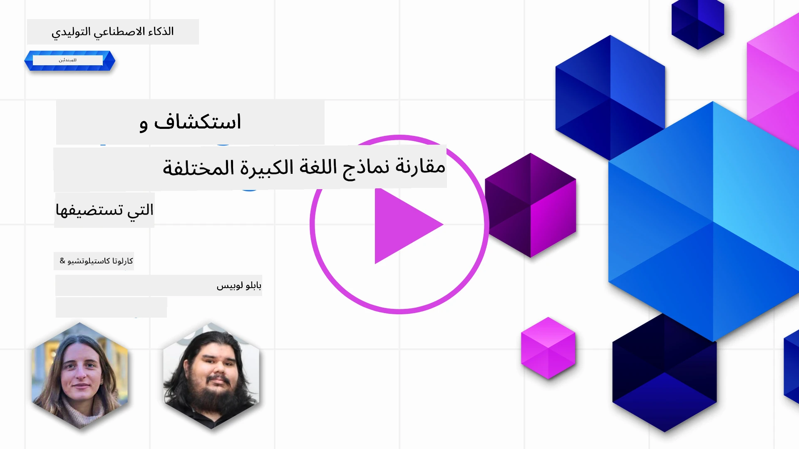](https://youtu.be/KIRUeDKscfI?si=8BHX1zvwzQBn-PlK)

> _انقر على الصورة أعلاه لمشاهدة فيديو هذا الدرس_

مع الدرس السابق، شاهدنا كيف يغير الذكاء الاصطناعي التوليدي مشهد التكنولوجيا، وكيف تعمل نماذج اللغات الكبيرة (LLMs) وكيف يمكن للأعمال - مثل شركتنا الناشئة - تطبيقها على حالات الاستخدام الخاصة بها والنمو! في هذا الفصل، نهدف إلى مقارنة وتباين أنواع مختلفة من نماذج اللغات الكبيرة (LLMs) لفهم مزاياها وعيوبها.

الخطوة التالية في رحلة شركتنا الناشئة هي استكشاف مشهد نماذج اللغات الكبيرة الحالي وفهم أيها مناسبة لحالة الاستخدام الخاصة بنا.

## مقدمة

سيغطي هذا الدرس:

- أنواع مختلفة من نماذج اللغات الكبيرة في المشهد الحالي.
- اختبار، تكرار، ومقارنة نماذج مختلفة لحالة الاستخدام الخاصة بك في Azure.
- كيفية نشر نموذج لغة كبير (LLM).

## أهداف التعلم

بعد إكمال هذا الدرس، ستتمكن من:

- اختيار النموذج المناسب لحالة الاستخدام الخاصة بك.
- فهم كيفية اختبار، تكرار، وتحسين أداء النموذج الخاص بك.
- معرفة كيف تنشر الشركات النماذج.

## فهم أنواع نماذج اللغات الكبيرة المختلفة

يمكن تصنيف نماذج اللغات الكبيرة بعدة طرق بناءً على هيكليتها، بيانات التدريب، وحالة الاستخدام. فهم هذه الاختلافات سيساعد شركتنا الناشئة على اختيار النموذج المناسب للسيناريو، وفهم كيفية الاختبار، التكرار، وتحسين الأداء.

هناك العديد من أنواع نماذج اللغات الكبيرة المختلفة، يعتمد اختيار النموذج على ما تهدف لاستخدامه، بياناتك، مدى استعدادك للدفع، والمزيد.

اعتمادًا على ما إذا كنت تهدف لاستخدام النماذج للنص، الصوت، الفيديو، توليد الصور وغيرها، قد تختار نوعًا مختلفًا من النموذج.

- **التعرف على الصوت والكلام**. نماذج نمط Whisper لا تزال مفيدة كنماذج عامة للتعرف على الكلام، لكن الخيارات الإنتاجية الآن تشمل أيضًا نماذج أحدث لتحويل الكلام إلى نص مثل `gpt-4o-transcribe`، `gpt-4o-mini-transcribe`، والأنواع المتخصصة في التمييز الصوتي. قيم تغطية اللغة، التمييز الصوتي، الدعم الفوري، التأخير، والتكلفة لحالتك. تعلم المزيد في [توثيق OpenAI لتحويل الكلام إلى نص](https://platform.openai.com/docs/guides/speech-to-text?WT.mc_id=academic-105485-koreyst).

- **توليد الصور**. DALL-E وMidjourney خيارات معروفة لتوليد الصور، لكن واجهات برمجة تطبيقات الصور الحالية من OpenAI تتركز حول نماذج GPT Image مثل `gpt-image-2`، بينما تُعد Stable Diffusion وImagen وFlux وعائلات نماذج أخرى أيضًا خيارات شائعة. قارن مدى التزام النماذج بالأوامر، دعم التحرير، التحكم في الأسلوب، متطلبات الأمان، والترخيص. تعلم المزيد في [دليل توليد الصور من OpenAI](https://platform.openai.com/docs/guides/images?WT.mc_id=academic-105485-koreyst) والفصل 9 من هذا المنهج.

- **توليد النصوص**. تمتد نماذج النصوص الآن من النماذج الحدودية، نماذج الاستدلال، نماذج صغيرة ذات زمن استجابة منخفض، ونماذج بوزن مفتوح. أمثلة حالية تشمل نماذج GPT-5.x من OpenAI، نماذج Anthropic Claude 4.x، نماذج Google Gemini 3.x، نماذج Meta Llama 4، ونماذج Mistral. لا تختار فقط بناءً على تاريخ الإصدار أو السعر؛ قارن جودة المهمة، التأخير، نافذة السياق، استخدام الأدوات، سلوك الأمان، التوفر الإقليمي، والتكلفة الكلية. [فهرس نماذج Microsoft Foundry](https://ai.azure.com/catalog?WT.mc_id=academic-105485-koreyst) مكان جيد لمقارنة النماذج المتاحة على Azure.

- **تعدد الوسائط**. العديد من النماذج الحالية يمكنها معالجة أكثر من النص فقط. بعضها يقبل إدخالات صورة، صوت، أو فيديو؛ وبعضها يمكنه استدعاء الأدوات؛ والنماذج المتخصصة يمكنها توليد الصور، الصوت أو الفيديو. على سبيل المثال، تدعم نماذج OpenAI الحالية إدخال النص والصورة، تدعم نماذج Gemini النص، الشفرة، الصورة، الصوت، والفيديو حسب النوع، ونماذج Llama 4 Scout وMaverick هي نماذج ذات وزن مفتوح ومتعددة الوسائط أصلًا. تحقق دائمًا من بطاقة كل نموذج للأنماط المدعومة للإدخال والإخراج قبل بناء سير عمل حوله.

اختيار نموذج يعني أنك تحصل على بعض القدرات الأساسية، قد لا تكون كافية بالضرورة. غالبًا ما تمتلك الشركة بيانات خاصة تحتاج بطريقة ما لإخبار نموذج اللغة الكبير عنها. هناك عدة خيارات مختلفة لمعالجة ذلك، المزيد عن هذا في الأقسام القادمة.

### النماذج الأساسية مقابل نماذج اللغات الكبيرة

مصطلح النموذج الأساسي تم [صياغته بواسطة باحثين في ستانفورد](https://arxiv.org/abs/2108.07258?WT.mc_id=academic-105485-koreyst) وتم تعريفه كنموذج ذكاء اصطناعي يتبع بعض المعايير، مثل:

- **تُدرّب باستخدام التعلم غير المراقب أو التعلم الذاتي الإشراف**، مما يعني أنها تُدرّب على بيانات متعددة الوسائط غير معنونة، ولا تتطلب تعليق بشري أو تعليمات ملصقة لعملية التدريب.
- **هي نماذج كبيرة جدًا**، تستند إلى شبكات عصبية عميقة جدًا مدربة على بلايين المعاملات.
- **يُقصد بها عادة أن تكون 'أساسًا' لنماذج أخرى**، بمعنى أنه يمكن استخدامها كنقطة انطلاق لبناء نماذج أخرى فوقها، وهذا يمكن تحقيقه عبر التخصيص الدقيق (fine-tuning).

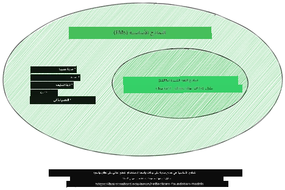

مصدر الصورة: [الدليل الأساسي للنماذج الأساسية ونماذج اللغات الكبيرة | بقلم بابار م باتي | Medium
](https://thebabar.medium.com/essential-guide-to-foundation-models-and-large-language-models-27dab58f7404)

لتوضيح هذا التمييز أكثر، خذ ChatGPT كمثال تاريخي. استخدمت الإصدارات المبكرة من ChatGPT نموذج GPT-3.5 كنموذج أساسي. ثم استخدمت OpenAI بيانات خاصة بالمحادثات وتقنيات المحاذاة لإنشاء نسخة محسنة تقدم أداءً أفضل في سيناريوهات المحادثة، مثل روبوتات الدردشة. غالبًا ما توجه خدمات الذكاء الاصطناعي الحديثة بين عدة نسخ من النماذج، لذا اسم الخدمة واسم النموذج الأساسي ليسا دائمًا الشيء نفسه.

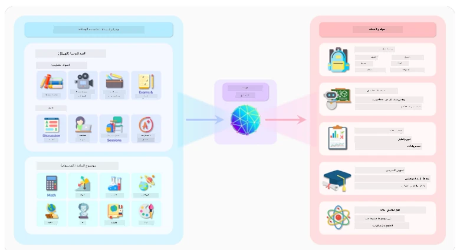

مصدر الصورة: [2108.07258.pdf (arxiv.org)](https://arxiv.org/pdf/2108.07258.pdf?WT.mc_id=academic-105485-koreyst)

### نماذج مفتوحة الوزن/المصدر مقابل نماذج مملوكة

طريقة أخرى لتصنيف نماذج اللغات الكبيرة هي ما إذا كانت مفتوحة الوزن، مفتوحة المصدر، أو مملوكة.

نماذج المصدر المفتوح ومفتوحة الوزن تجعل مخرجات النموذج متاحة للفحص، التنزيل، أو التخصيص، لكن تراخيصها تختلف. بعضها مفتوح المصدر بشكل كامل، وبعضها نماذج مفتوحة الوزن مع قيود على الاستخدام. يمكن أن تكون مفيدة عندما تحتاج الشركة إلى مزيد من التحكم في النشر، محلية البيانات، التكلفة، أو التخصيص. مع ذلك، يجب على الفرق مراجعة شروط الترخيص، تكاليف الخدمة، الصيانة، تحديثات الأمان، وجودة التقييم قبل استخدامها في الإنتاج. من الأمثلة [Meta Llama 4](https://ai.meta.com/blog/llama-4-multimodal-intelligence/?WT.mc_id=academic-105485-koreyst)، وبعض [نماذج Mistral](https://docs.mistral.ai/models/overview?WT.mc_id=academic-105485-koreyst)، والعديد من النماذج المستضافة على [Hugging Face](https://huggingface.co/models?WT.mc_id=academic-105485-koreyst).

النماذج المملوكة مملوكة ومستضافة بواسطة مزود. غالبًا ما تكون هذه النماذج مُحسّنة للاستخدام الإنتاجي المدار ويمكن أن تقدم دعمًا قويًا، نظم أمان، تكامل أدوات، وقدرات مقياس. مع ذلك، عادة لا يمكن للعملاء فحص أو تعديل أوزان النموذج، ويجب عليهم مراجعة شروط المزود للخصوصية، الاحتفاظ، الامتثال، والاستخدام المقبول. من الأمثلة [نماذج OpenAI](https://platform.openai.com/docs/models?WT.mc_id=academic-105485-koreyst)، [Google Gemini](https://deepmind.google/models/gemini/pro/?WT.mc_id=academic-105485-koreyst)، و[Anthropic Claude](https://platform.claude.com/docs/en/about-claude/models/overview?WT.mc_id=academic-105485-koreyst).

### التضمين مقابل توليد الصور مقابل توليد النص والشفرة

يمكن تصنيف نماذج اللغات الكبيرة أيضًا بحسب نوع المخرجات التي تولدها.

التضمينات هي مجموعة من النماذج التي يمكنها تحويل النص إلى شكل رقمي، يسمى التضمين، وهو تمثيل رقمي للنص المُدخل. تجعل التضمينات الأمر أسهل للآلات لفهم العلاقات بين الكلمات أو الجمل ويمكن استهلاكها كمدخلات من قبل نماذج أخرى، مثل نماذج التصنيف، أو نماذج التجميع التي تؤدي أداءً أفضل على البيانات الرقمية. غالبًا ما تستخدم نماذج التضمين للتعلم الانتقالي، حيث يُبنى نموذج لمهمة بديلة تتوفر لها بيانات كثيرة، ثم تُعاد استخدام أوزان النموذج (التضمينات) لمهام لاحقة. مثال على هذه الفئة هو [تضمينات OpenAI](https://platform.openai.com/docs/models/embeddings?WT.mc_id=academic-105485-koreyst).

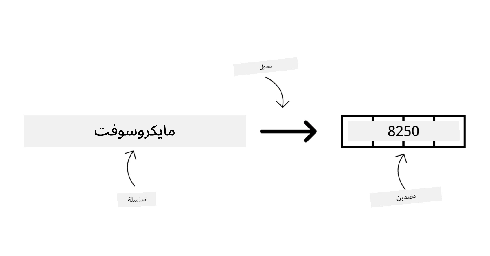

نماذج توليد الصور هي نماذج تولد الصور. غالبًا ما تُستخدم هذه النماذج لتحرير الصور، تركيب الصور، وترجمة الصور. تُدرّب نماذج توليد الصور عادة على مجموعات بيانات ضخمة من الصور، مثل [LAION-5B](https://laion.ai/blog/laion-5b/?WT.mc_id=academic-105485-koreyst)، ويمكن استخدامها لتوليد صور جديدة أو لتحرير الصور الموجودة باستخدام تقنيات التداخل، الدقة الفائقة، وتلوين الصور. من الأمثلة [نماذج GPT Image](https://platform.openai.com/docs/guides/images?WT.mc_id=academic-105485-koreyst)، [نماذج Stable Diffusion](https://github.com/Stability-AI/StableDiffusion?WT.mc_id=academic-105485-koreyst)، ونماذج Imagen.

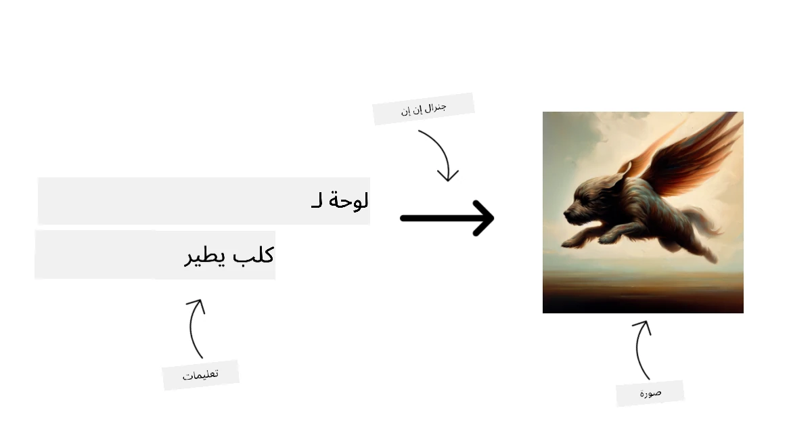

نماذج توليد النص والشفرة هي نماذج تولد نصًا أو شفرة برمجية. تُستخدم هذه النماذج عادة في تلخيص النص، الترجمة، والإجابة على الأسئلة. تُدرّب نماذج توليد النصوص غالبًا على مجموعات بيانات نصية ضخمة، مثل [BookCorpus](https://www.cv-foundation.org/openaccess/content_iccv_2015/html/Zhu_Aligning_Books_and_ICCV_2015_paper.html?WT.mc_id=academic-105485-koreyst)، ويمكن استخدامها لتوليد نص جديد، أو للإجابة على الأسئلة. نماذج توليد الشفرة، مثل [CodeParrot](https://huggingface.co/codeparrot?WT.mc_id=academic-105485-koreyst)، غالبًا ما تُدرّب على مجموعات بيانات ضخمة من الشفرة البرمجية، مثل GitHub، ويمكن استخدامها لتوليد شفرة جديدة، أو لإصلاح أخطاء في الشفرة الموجودة.

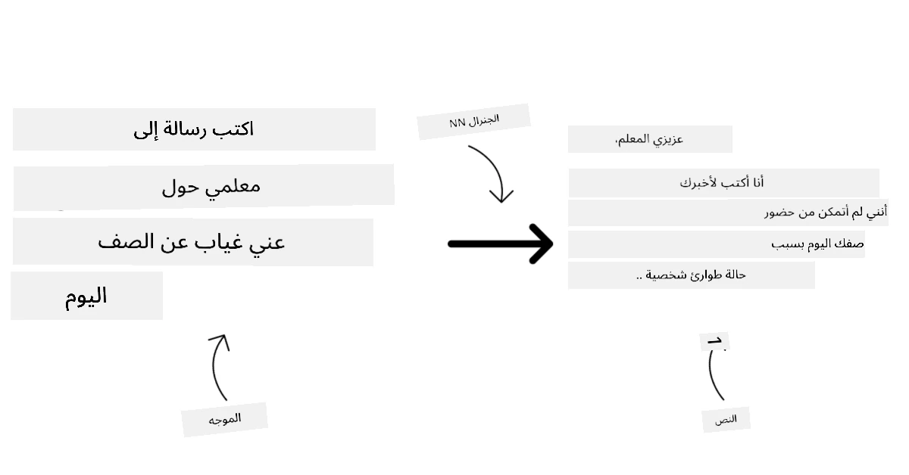

### نموذج المُرمّز-المُرمّز العكسي مقابل نموذج المرمّز العكسي فقط

للحديث عن أنواع معمارية نماذج اللغات الكبيرة، دعنا نستخدم تمثيلًا تشبيهيًا.

تخيل أن مديرك أعطاك مهمة لكتابة اختبار للطلاب. لديك زميلان؛ أحدهما مسؤول عن إنشاء المحتوى والآخر مسؤول عن مراجعته.

منشئ المحتوى يشبه نموذج المرمّز العكسي فقط: يمكنه النظر إلى الموضوع، رؤية ما كتبته بالفعل، ثم الاستمرار في توليد المحتوى بناءً على هذا السياق. هم بارعون جدًا في كتابة محتوى جذاب ومعلوماتي، لكنهم ليسوا دائمًا الخيار الأفضل عندما تكون المهمة فقط تصنيف أو استرجاع أو ترميز المعلومات. أمثلة على نماذج المرمّز العكسي فقط تشمل نماذج GPT وLlama.

المراجع يشبه نموذج مُرمّز فقط، ينظر إلى المادة المكتوبة والإجابات، يلاحظ العلاقة بينها ويفهم السياق، لكنه ليس جيدًا في توليد المحتوى. مثال على نموذج مُرمّز فقط هو BERT.

تخيل أنه يمكن أن يكون لدينا شخص يمكنه أيضًا إنشاء واختبار الاختبار، هذا هو نموذج المُرمّز-المُرمّز العكسي. بعض الأمثلة ستكون BART وT5.

### الخدمة مقابل النموذج

الآن، دعنا نتحدث عن الفرق بين الخدمة والنموذج. الخدمة هي منتج يقدمه مزود الخدمة السحابية، وغالبًا ما تكون مزيجًا من نماذج وبيانات ومكونات أخرى. النموذج هو المكون الأساسي للخدمة، وغالبًا ما يكون نموذجًا أساسيًا، مثل نموذج لغة كبير (LLM).

غالبًا ما تُحسّن الخدمات للاستخدام الإنتاجي، وغالبًا ما تكون أسهل في الاستخدام من النماذج عبر واجهة مستخدم رسومية. مع ذلك، ليست جميع الخدمات متاحة مجانًا، وقد تتطلب اشتراكًا أو دفعًا لاستخدامها، مقابل الاستفادة من معدات وموارد مالك الخدمة، وتحسين التكاليف، والتوسع بسهولة. مثال على خدمة هو [خدمة Azure OpenAI](https://learn.microsoft.com/azure/ai-services/openai/overview?WT.mc_id=academic-105485-koreyst)، التي تقدم خطط أسعار حسب الاستخدام، ما يعني تحميل المستخدمين رسومًا متناسبة مع مقدار استخدامهم للخدمة. كما توفر خدمة Azure OpenAI أمانًا على مستوى المؤسسات وإطار ذكاء اصطناعي مسؤول فوق قدرات النماذج.

النماذج هي قطع الشبكة العصبية: المعاملات، الأوزان، الهيكل، المشفر، والتهيئة الداعمة. تشغيل نموذج محليًا أو في بيئة خاصة يتطلب أجهزة مناسبة، بنية خدمة، مراقبة، وترخيص مفتوح المصدر/مفتوح الوزن متوافق أو ترخيص تجاري. يمكن استضافة نماذج مفتوحة الوزن مثل Llama 4 أو نماذج Mistral ذاتيًا، لكنها مع ذلك تحتاج قوة حوسبة وخبرة تشغيلية.

## كيفية اختبار والتكرار مع نماذج مختلفة لفهم الأداء على Azure

بمجرد أن تستكشف فرقنا مشهد نماذج اللغة الكبيرة الحالية (LLMs) وتحدد بعض المرشحين المناسبين لسيناريوهاتهم، تكون الخطوة التالية اختبارهم على بياناتهم وعبء العمل الخاص بهم. هذه عملية تكرارية، تتم من خلال التجارب والقياسات.
معظم النماذج التي ذكرناها في الفقرات السابقة (نماذج OpenAI، النماذج مفتوحة الوزن مثل Llama 4 و Mistral، ونماذج Hugging Face) متوفرة في [نماذج Microsoft Foundry](https://learn.microsoft.com/azure/foundry/concepts/foundry-models-overview?WT.mc_id=academic-105485-koreyst).

[مايكروسوفت فاوندري](https://learn.microsoft.com/azure/foundry/what-is-foundry?WT.mc_id=academic-105485-koreyst)، سابقاً Azure AI Studio / Azure AI Foundry، هي منصة موحدة على Azure لبناء تطبيقات ووكلاء الذكاء الاصطناعي. تساعد المطورين على إدارة دورة الحياة بدءًا من التجريب والتقييم إلى النشر والمراقبة والحوكمة. يتيح كتالوج النماذج في Microsoft Foundry للمستخدم:

- العثور على نموذج الأساس المهتم به في الكتالوج، بما في ذلك النماذج التي تبيعها Azure ونماذج من شركاء ومزودي المجتمع. يمكن للمستخدمين التصفية حسب المهمة أو المزود أو الترخيص أو خيار النشر أو الاسم.

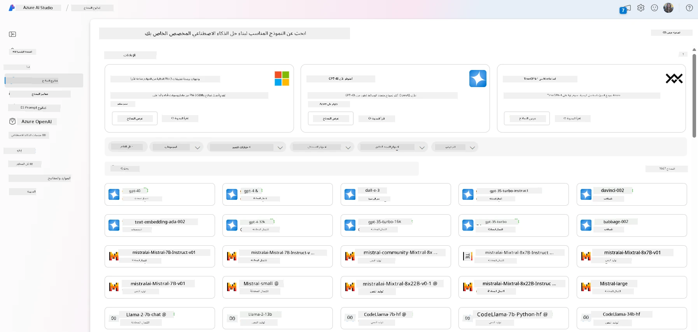

- مراجعة بطاقة النموذج، بما في ذلك وصف تفصيلي للاستخدام المقصود وبيانات التدريب، عينات الكود ونتائج التقييم على مكتبة التقييمات الداخلية.

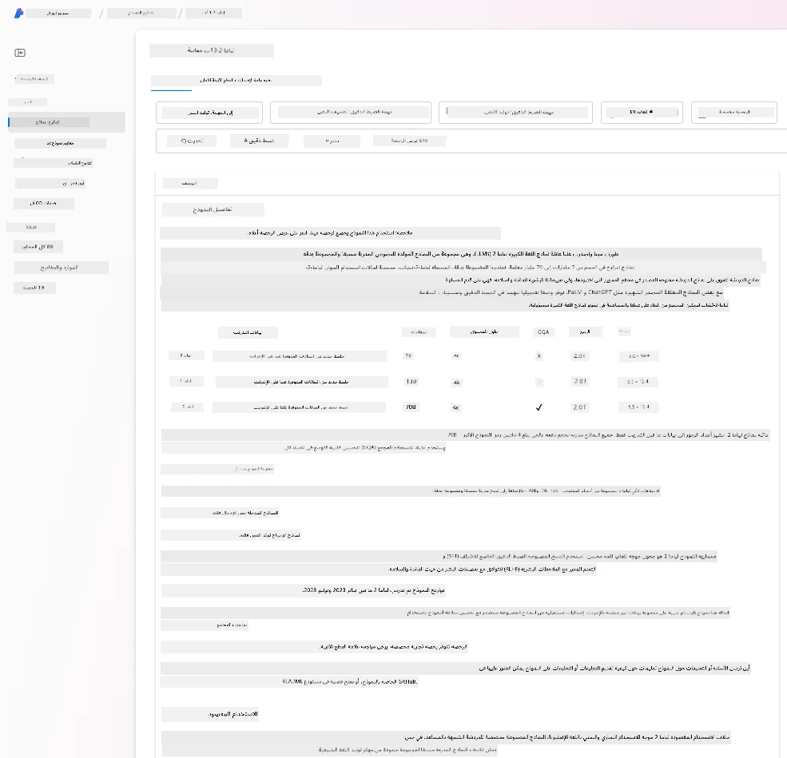

- مقارنة الأداء عبر النماذج ومجموعات البيانات المتاحة في الصناعة لتقييم أي منها يلبي سيناريو العمل، من خلال لوحة [معايير النماذج](https://learn.microsoft.com/azure/ai-studio/how-to/model-benchmarks?WT.mc_id=academic-105485-koreyst).

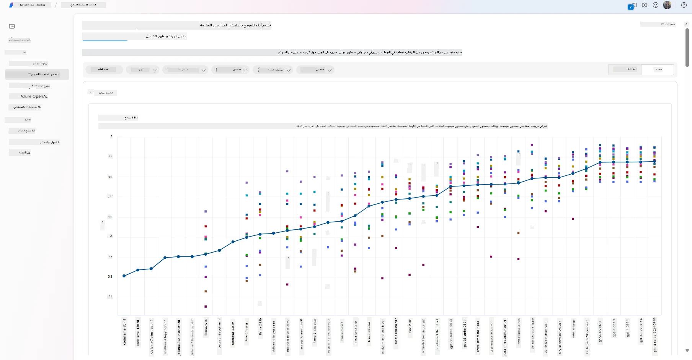

- ضبط النماذج المدعومة على بيانات تدريب مخصصة لتحسين أداء النموذج في عبء عمل معين، مع الاستفادة من قدرات التجريب والتعقب في Microsoft Foundry.

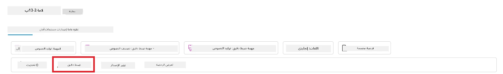

- نشر النموذج الأصلي المدرَّب مسبقاً أو النسخة المضبوطة إلى نقطة استدلال حية عن بُعد، باستخدام خيارات الحوسبة المُدارة أو النشر الخالي من الخوادم، لتمكين التطبيقات من استهلاكه.

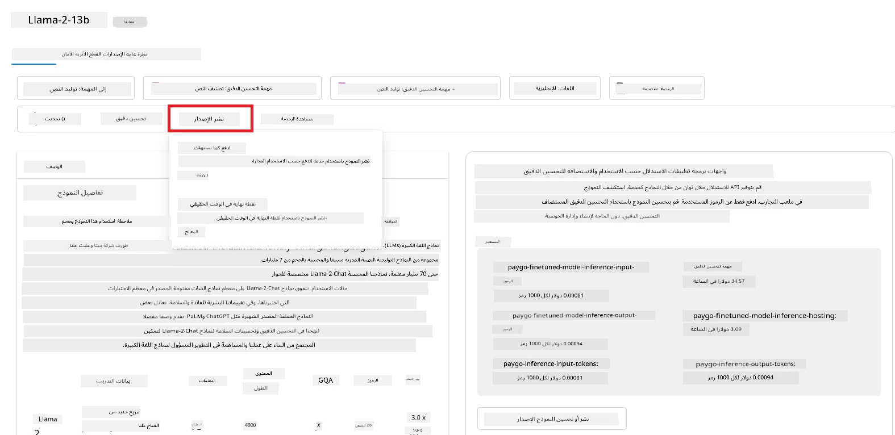

> [!NOTE]
> ليست جميع النماذج في الكتالوج متاحة حالياً للضبط الدقيق و/أو النشر بالدفع حسب الاستخدام. تحقق من بطاقة النموذج للحصول على تفاصيل حول قدرات النموذج والقيود.

## تحسين نتائج LLM

استكشفنا مع فريق شركتنا الناشئة أنواعاً مختلفة من نماذج اللغة الكبيرة (LLMs) ومنصة سحابية (Microsoft Foundry) تتيح لنا مقارنة النماذج المختلفة، وتقييمها على بيانات الاختبار، وتحسين أدائها، ونشرها على نقاط الاستدلال.

ولكن متى ينبغي عليهم التفكير في ضبط نموذج بدلاً من استخدام نموذج مُدرّب مسبقاً؟ هل هناك طرق أخرى لتحسين أداء النموذج على أعباء العمل الخاصة؟

هناك عدة نهج يمكن للأعمال استخدامها للحصول على النتائج التي تحتاجها من نموذج اللغة الكبير. يمكنك اختيار أنواع مختلفة من النماذج بدرجات مختلفة من التدريب عند نشر نموذج LLM في الإنتاج، مع مستويات مختلفة من التعقيد والتكلفة والجودة. إليك بعض النهج المختلفة:

- **هندسة المطالبات مع السياق**. الفكرة هي توفير سياق كافٍ عند إعطاء الطلب لضمان الحصول على الردود التي تحتاجها.

- **التوليد المعزز بالاستدعاء (RAG)**. قد توجد بياناتك في قاعدة بيانات أو نقطة نهاية ويب على سبيل المثال، لضمان تضمين هذه البيانات، أو جزء منها، في وقت الطلب، يمكنك استرداد البيانات ذات الصلة وجعلها جزءًا من مطالبة المستخدم.

- **النموذج المضبوط**. هنا، قمت بتدريب النموذج بشكل إضافي على بياناتك الخاصة، مما أدى إلى أن يكون النموذج أكثر دقة واستجابة لاحتياجاتك ولكنه قد يكون مكلفاً.

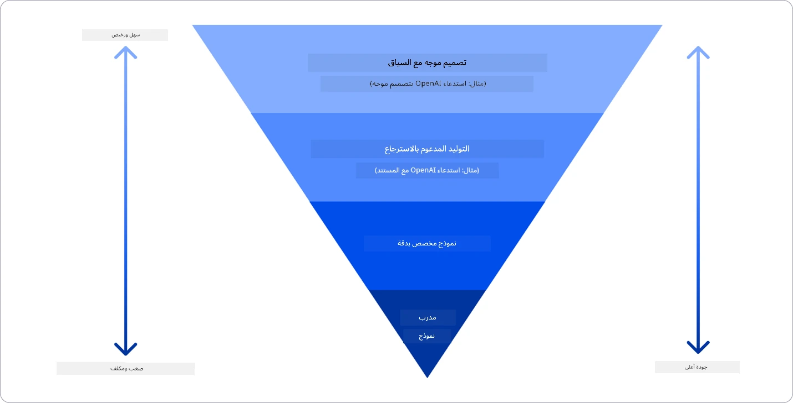

مصدر الصورة: [Four Ways that Enterprises Deploy LLMs | Fiddler AI Blog](https://www.fiddler.ai/blog/four-ways-that-enterprises-deploy-llms?WT.mc_id=academic-105485-koreyst)

### هندسة المطالبات مع السياق

تعمل نماذج اللغة الكبيرة المدربة مسبقًا بشكل جيد جداً في المهام العامة للغة الطبيعية، حتى عند استدعائها بمطالبة قصيرة، مثل إتمام جملة أو سؤال - ما يسمى بالتعلم "بدون أمثلة" (zero-shot).

ومع ذلك، كلما تمكن المستخدم من تأطير استفساره، بطلب مفصل وأمثلة – أي السياق – كانت الإجابة أكثر دقة وأقرب لتوقعات المستخدم. في هذه الحالة، نتحدث عن "تعلم مع مثال واحد" إذا كانت المطالبة تحتوي فقط على مثال واحد و"تعلم مع عدد قليل من الأمثلة" إذا كانت تحتوي على عدة أمثلة.
هندسة المطالبات مع السياق هي النهج الأكثر كفاءة من حيث التكلفة للبدء به.

### التوليد المعزز بالاستدعاء (RAG)

تمتلك نماذج اللغة الكبيرة محدودية في أنها يمكنها استخدام فقط البيانات التي تم تدريبها عليها لتوليد إجابة. وهذا يعني أنها لا تعرف شيئًا عن الحقائق التي حدثت بعد عملية التدريب، ولا يمكنها الوصول إلى المعلومات غير العامة (مثل بيانات الشركة).
يمكن تجاوز هذا من خلال RAG، وهي تقنية تعزز المطالبة ببيانات خارجية على شكل أجزاء من المستندات، مع مراعاة حدود طول المطالبة. يتم دعم هذا باستخدام أدوات قواعد البيانات المتجهة (مثل [Azure Vector Search](https://learn.microsoft.com/azure/search/vector-search-overview?WT.mc_id=academic-105485-koreyst)) التي تسترجع الأجزاء المفيدة من مصادر البيانات المُعرفة مسبقًا وتضيفها إلى سياق المطالبة.

هذه التقنية مفيدة جداً عندما لا تمتلك الشركة بيانات كافية، أو وقتًا كافيًا، أو موارد لضبط نموذج لغوي كبير، لكنها لا تزال ترغب في تحسين الأداء على عبء عمل محدد وتقليل مخاطر الإجابات الوهمية، القديمة، أو غير المدعومة.

### النموذج المضبوط

الضبط الدقيق هو عملية تستخدم التعلم الانتقالي لـ "تكييف" النموذج مع مهمة معينة أو لحل مشكلة محددة. تختلف عن التعلم بعدد قليل من الأمثلة وRAG، حيث ينتج عنها نموذج جديد مع أوزان وتحاملات محدثة. يتطلب مجموعة من أمثلة التدريب تتكون من مدخل واحد (المطالبة) والمخرجات المرتبطة بها (الإكمال).
هذا سيكون النهج المفضل إذا:

- **استخدام نماذج أصغر مخصصة لمهمة محددة**. ترغب الشركة في ضبط نموذج أصغر لمهمة محدودة بدلاً من إعادة استخدام نموذج كبير متقدم عدة مرات، مما يؤدي إلى حل أكثر فعالية من حيث التكلفة وأسرع.

- **مراعاة زمن الاستجابة**. حيث أن زمن الاستجابة مهم لحالة استخدام معينة، لذلك لا يمكن استخدام مطالبات طويلة جداً أو عدد الأمثلة التي يجب أن يتعلمها النموذج لا يتناسب مع حد طول المطالبة.

- **تكييف السلوك المستقر**. لدى الشركة العديد من الأمثلة عالية الجودة وتريد أن يتبع النموذج باستمرار نمط المهمة أو صيغة الإخراج أو النغمة أو الأسلوب الخاص بالمجال. إذا كانت المشكلة الرئيسية هي الحقائق الحديثة أو المعرفة الخاصة التي تتغير كثيرًا، فاستخدم RAG بدلاً من الاعتماد فقط على الضبط الدقيق.

### التدريب من الصفر

تدريب نموذج لغة كبير من الصفر هو بلا شك النهج الأصعب والأكثر تعقيدًا، يتطلب كميات ضخمة من البيانات، موارد ماهرة، وقدرة حاسوبية مناسبة. ينبغي النظر في هذا الخيار فقط في حالة وجود حالة استخدام محددة بالنطاق وكمية كبيرة من البيانات المرتبطة بالمجال.

## اختبار المعرفة

ما الذي يمكن أن يكون نهجاً جيداً لتحسين نتائج إكمال LLM؟

1. هندسة المطالبات مع السياق
1. RAG
1. النموذج المضبوط

ج: كل الثلاثة يمكن أن يساعدوا. ابدأ بهندسة المطالبات والسياق للتحسينات السريعة، واستخدم RAG عندما يحتاج النموذج لحقائق حديثة أو بيانات أعمال خاصة. اختر الضبط الدقيق عندما يكون لديك أمثلة عالية الجودة كافية وتريد أن يتبع النموذج باستمرار مهمة أو صيغة أو نغمة أو نمط مجال محدد.

## 🚀 التحدي

اقرأ المزيد عن كيفية [استخدام RAG](https://learn.microsoft.com/azure/search/retrieval-augmented-generation-overview?WT.mc_id=academic-105485-koreyst) لعملك.

## عمل رائع، استمر في التعلم

بعد إكمال هذا الدرس، تحقق من مجموعتنا [لتعلم الذكاء الاصطناعي التوليدي](https://aka.ms/genai-collection?WT.mc_id=academic-105485-koreyst) لمواصلة رفع مستوى معرفتك عن الذكاء الاصطناعي التوليدي!

توجه إلى الدرس 3 حيث سننظر في كيفية [البناء باستخدام الذكاء الاصطناعي التوليدي بمسؤولية](../03-using-generative-ai-responsibly/README.md?WT.mc_id=academic-105485-koreyst)!

---

<!-- CO-OP TRANSLATOR DISCLAIMER START -->
**تنويه**:
تمت ترجمة هذا المستند باستخدام خدمة الترجمة بالذكاء الاصطناعي [Co-op Translator](https://github.com/Azure/co-op-translator). بينما نسعى للدقة، يرجى العلم أن الترجمات الآلية قد تحتوي على أخطاء أو عدم دقة. يجب اعتبار المستند الأصلي بلغته الأصلية المصدر الرسمي والمعتمد. للمعلومات الهامة، يُنصح بالاستعانة بترجمة بشرية محترفة. نحن غير مسؤولين عن أي سوء فهم أو تفسير ناتج عن استخدام هذه الترجمة.
<!-- CO-OP TRANSLATOR DISCLAIMER END -->