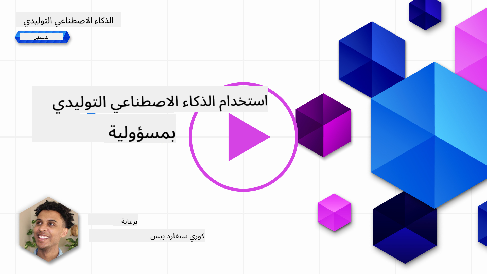
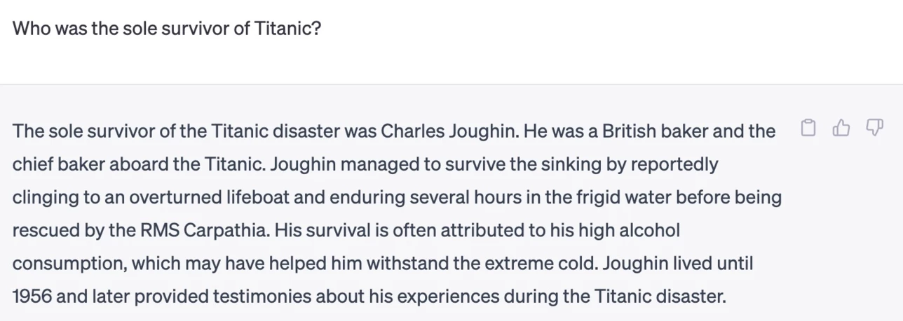
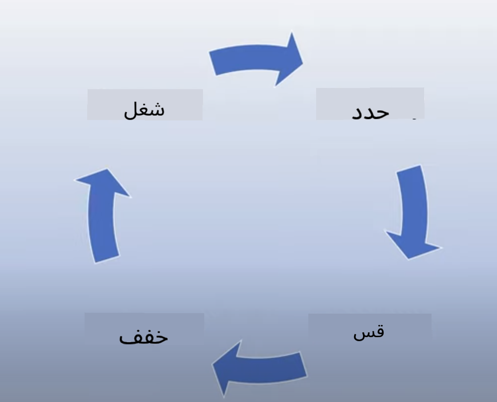
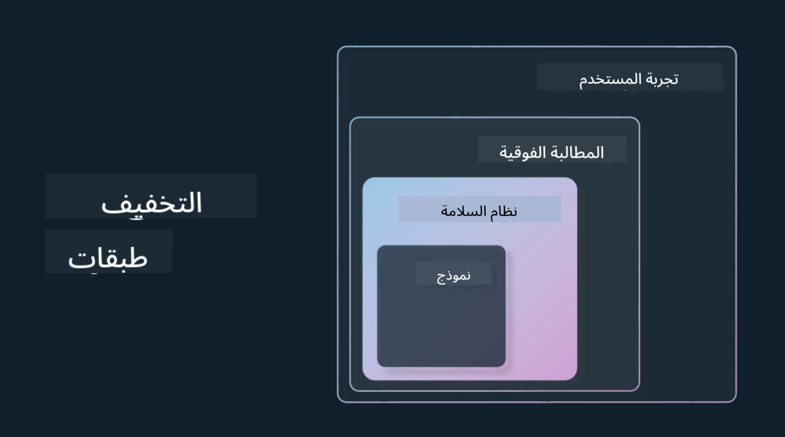

<!--
CO_OP_TRANSLATOR_METADATA:
{
  "original_hash": "4d57fad773cbeb69c5dd62e65c34200d",
  "translation_date": "2025-10-17T12:54:53+00:00",
  "source_file": "03-using-generative-ai-responsibly/README.md",
  "language_code": "ar"
}
-->
# استخدام الذكاء الاصطناعي التوليدي بمسؤولية

> _اضغط على الصورة أعلاه لمشاهدة فيديو الدرس_

من السهل أن تنبهر بالذكاء الاصطناعي وخاصة الذكاء الاصطناعي التوليدي، ولكن يجب أن تفكر في كيفية استخدامه بمسؤولية. يجب أن تأخذ في الاعتبار كيفية ضمان أن تكون النتائج عادلة وغير ضارة وغير ذلك. يهدف هذا الفصل إلى تزويدك بالسياق المذكور، وما يجب التفكير فيه، وكيفية اتخاذ خطوات فعالة لتحسين استخدامك للذكاء الاصطناعي.

## المقدمة

سيتناول هذا الدرس:

- لماذا يجب أن تعطي الأولوية للذكاء الاصطناعي المسؤول عند بناء تطبيقات الذكاء الاصطناعي التوليدي.
- المبادئ الأساسية للذكاء الاصطناعي المسؤول وكيفية ارتباطها بالذكاء الاصطناعي التوليدي.
- كيفية تطبيق هذه المبادئ من خلال الاستراتيجيات والأدوات.

## أهداف التعلم

بعد إكمال هذا الدرس ستعرف:

- أهمية الذكاء الاصطناعي المسؤول عند بناء تطبيقات الذكاء الاصطناعي التوليدي.
- متى يجب التفكير وتطبيق المبادئ الأساسية للذكاء الاصطناعي المسؤول عند بناء تطبيقات الذكاء الاصطناعي التوليدي.
- الأدوات والاستراتيجيات المتاحة لتطبيق مفهوم الذكاء الاصطناعي المسؤول.

## مبادئ الذكاء الاصطناعي المسؤول

لم يكن الحماس تجاه الذكاء الاصطناعي التوليدي أعلى مما هو عليه الآن. هذا الحماس جلب العديد من المطورين الجدد والاهتمام والتمويل لهذا المجال. بينما يعتبر هذا إيجابيًا جدًا لأي شخص يسعى لبناء منتجات وشركات باستخدام الذكاء الاصطناعي التوليدي، من المهم أيضًا أن نتقدم بمسؤولية.

خلال هذه الدورة، نركز على بناء شركتنا الناشئة ومنتجنا التعليمي للذكاء الاصطناعي. سنستخدم مبادئ الذكاء الاصطناعي المسؤول: العدالة، الشمولية، الموثوقية/السلامة، الأمن والخصوصية، الشفافية والمساءلة. من خلال هذه المبادئ، سنستكشف كيفية ارتباطها باستخدامنا للذكاء الاصطناعي التوليدي في منتجاتنا.

## لماذا يجب أن تعطي الأولوية للذكاء الاصطناعي المسؤول

عند بناء منتج، فإن اتباع نهج يركز على الإنسان مع مراعاة مصلحة المستخدمين يؤدي إلى أفضل النتائج.

ما يميز الذكاء الاصطناعي التوليدي هو قدرته على إنشاء إجابات مفيدة، معلومات، إرشادات، ومحتوى للمستخدمين. يمكن القيام بذلك دون الحاجة إلى العديد من الخطوات اليدوية مما يؤدي إلى نتائج مثيرة للإعجاب. ولكن بدون تخطيط واستراتيجيات مناسبة، يمكن أن يؤدي ذلك للأسف إلى نتائج ضارة للمستخدمين، المنتج، والمجتمع ككل.

دعونا نلقي نظرة على بعض (ولكن ليس كل) هذه النتائج الضارة المحتملة:

### الهلوسة

الهلوسة هي مصطلح يستخدم لوصف عندما ينتج نموذج اللغة الكبير محتوى إما غير منطقي تمامًا أو شيء نعرف أنه غير صحيح بناءً على مصادر أخرى للمعلومات.

على سبيل المثال، إذا قمنا ببناء ميزة لشركتنا الناشئة تسمح للطلاب بطرح أسئلة تاريخية على النموذج. يسأل الطالب السؤال: `من كان الناجي الوحيد من تيتانيك؟`

ينتج النموذج إجابة مثل الإجابة أدناه:

> _(المصدر: [Flying bisons](https://flyingbisons.com?WT.mc_id=academic-105485-koreyst))_

هذه إجابة واثقة وشاملة جدًا. للأسف، هي غير صحيحة. حتى مع القليل من البحث، يمكن للمرء أن يكتشف أن هناك أكثر من ناجٍ واحد من كارثة تيتانيك. بالنسبة لطالب بدأ للتو في البحث عن هذا الموضوع، يمكن أن تكون هذه الإجابة مقنعة بما يكفي لعدم التشكيك فيها ومعاملتها كحقيقة. يمكن أن تؤدي عواقب ذلك إلى أن يصبح نظام الذكاء الاصطناعي غير موثوق به ويؤثر سلبًا على سمعة شركتنا الناشئة.

مع كل تكرار لأي نموذج لغة كبير، رأينا تحسينات في الأداء حول تقليل الهلوسة. حتى مع هذا التحسن، يجب علينا كمطوري تطبيقات ومستخدمين أن نظل على دراية بهذه القيود.

### المحتوى الضار

تناولنا في القسم السابق عندما ينتج نموذج اللغة الكبير استجابات غير صحيحة أو غير منطقية. خطر آخر يجب أن نكون على دراية به هو عندما يرد النموذج بمحتوى ضار.

يمكن تعريف المحتوى الضار على النحو التالي:

- تقديم تعليمات أو تشجيع على إيذاء النفس أو إيذاء مجموعات معينة.
- محتوى كراهية أو مهين.
- توجيه التخطيط لأي نوع من الهجمات أو الأعمال العنيفة.
- تقديم تعليمات حول كيفية العثور على محتوى غير قانوني أو ارتكاب أعمال غير قانونية.
- عرض محتوى جنسي صريح.

بالنسبة لشركتنا الناشئة، نريد التأكد من أن لدينا الأدوات والاستراتيجيات المناسبة لمنع هذا النوع من المحتوى من الوصول إلى الطلاب.

### نقص العدالة

يُعرّف الإنصاف بأنه "ضمان أن يكون نظام الذكاء الاصطناعي خاليًا من التحيز والتمييز وأن يعامل الجميع بشكل عادل ومتساوٍ." في عالم الذكاء الاصطناعي التوليدي، نريد ضمان ألا تعزز وجهات النظر الإقصائية للمجموعات المهمشة من خلال مخرجات النموذج.

هذه الأنواع من المخرجات ليست فقط مدمرة لبناء تجارب منتج إيجابية لمستخدمينا، ولكنها تسبب أيضًا ضررًا اجتماعيًا إضافيًا. كمطوري تطبيقات، يجب أن نضع دائمًا قاعدة مستخدمين واسعة ومتنوعة في الاعتبار عند بناء حلول باستخدام الذكاء الاصطناعي التوليدي.

## كيفية استخدام الذكاء الاصطناعي التوليدي بمسؤولية

الآن بعد أن حددنا أهمية الذكاء الاصطناعي التوليدي المسؤول، دعونا نلقي نظرة على 4 خطوات يمكننا اتخاذها لبناء حلول الذكاء الاصطناعي بمسؤولية:

### قياس الأضرار المحتملة

في اختبار البرمجيات، نختبر الإجراءات المتوقعة للمستخدم على التطبيق. وبالمثل، فإن اختبار مجموعة متنوعة من الطلبات التي من المرجح أن يستخدمها المستخدمون هو طريقة جيدة لقياس الأضرار المحتملة.

نظرًا لأن شركتنا الناشئة تبني منتجًا تعليميًا، سيكون من الجيد إعداد قائمة بالطلبات المتعلقة بالتعليم. يمكن أن يشمل ذلك تغطية موضوع معين، حقائق تاريخية، وطلبات حول حياة الطلاب.

### تخفيف الأضرار المحتملة

حان الوقت الآن للبحث عن طرق يمكننا من خلالها منع أو تقليل الضرر المحتمل الذي يسببه النموذج واستجاباته. يمكننا النظر إلى هذا في 4 طبقات مختلفة:

- **النموذج**. اختيار النموذج المناسب للحالة المناسبة. النماذج الأكبر والأكثر تعقيدًا مثل GPT-4 يمكن أن تسبب خطرًا أكبر للمحتوى الضار عند تطبيقها على حالات استخدام أصغر وأكثر تحديدًا. استخدام بيانات التدريب الخاصة بك لضبط النموذج يقلل أيضًا من خطر المحتوى الضار.

- **نظام الأمان**. نظام الأمان هو مجموعة من الأدوات والتكوينات على المنصة التي تخدم النموذج وتساعد في تخفيف الضرر. مثال على ذلك هو نظام تصفية المحتوى في خدمة Azure OpenAI. يجب أن تكتشف الأنظمة أيضًا هجمات الاختراق والنشاط غير المرغوب فيه مثل الطلبات من الروبوتات.

- **الميتابرومبت**. الميتابرومبت والتأريض هما طرق يمكننا من خلالها توجيه أو تقييد النموذج بناءً على سلوكيات ومعلومات معينة. يمكن أن يشمل ذلك استخدام مدخلات النظام لتحديد حدود معينة للنموذج. بالإضافة إلى ذلك، تقديم مخرجات أكثر صلة بالنطاق أو المجال الخاص بالنظام.

يمكن أيضًا استخدام تقنيات مثل توليد المعلومات المعزز بالاسترجاع (RAG) لجعل النموذج يسحب المعلومات فقط من مجموعة مختارة من المصادر الموثوقة. هناك درس لاحق في هذه الدورة حول [بناء تطبيقات البحث](../08-building-search-applications/README.md?WT.mc_id=academic-105485-koreyst)

- **تجربة المستخدم**. الطبقة الأخيرة هي حيث يتفاعل المستخدم مباشرة مع النموذج من خلال واجهة التطبيق الخاصة بنا بطريقة ما. بهذه الطريقة يمكننا تصميم واجهة المستخدم/تجربة المستخدم لتقييد المستخدم على أنواع المدخلات التي يمكنه إرسالها إلى النموذج وكذلك النصوص أو الصور المعروضة للمستخدم. عند نشر تطبيق الذكاء الاصطناعي، يجب أن نكون أيضًا شفافين بشأن ما يمكن وما لا يمكن لتطبيق الذكاء الاصطناعي التوليدي القيام به.

لدينا درس كامل مخصص لـ [تصميم تجربة المستخدم لتطبيقات الذكاء الاصطناعي](../12-designing-ux-for-ai-applications/README.md?WT.mc_id=academic-105485-koreyst)

- **تقييم النموذج**. العمل مع نماذج اللغة الكبيرة يمكن أن يكون تحديًا لأننا لا نملك دائمًا السيطرة على البيانات التي تم تدريب النموذج عليها. ومع ذلك، يجب علينا دائمًا تقييم أداء النموذج ومخرجاته. لا يزال من المهم قياس دقة النموذج، التشابه، التأريض، وملاءمة المخرجات. يساعد ذلك في توفير الشفافية والثقة لأصحاب المصلحة والمستخدمين.

### تشغيل حل الذكاء الاصطناعي التوليدي المسؤول

بناء ممارسة تشغيلية حول تطبيقات الذكاء الاصطناعي الخاصة بك هو المرحلة النهائية. يشمل ذلك التعاون مع أجزاء أخرى من شركتنا الناشئة مثل القسم القانوني والأمن لضمان الامتثال لجميع السياسات التنظيمية. قبل الإطلاق، نريد أيضًا بناء خطط حول التسليم، التعامل مع الحوادث، والتراجع لمنع أي ضرر للمستخدمين من النمو.

## الأدوات

بينما قد يبدو العمل على تطوير حلول الذكاء الاصطناعي المسؤول كثيرًا، إلا أنه عمل يستحق الجهد. مع نمو مجال الذكاء الاصطناعي التوليدي، ستتطور المزيد من الأدوات لمساعدة المطورين على دمج المسؤولية بكفاءة في سير عملهم. على سبيل المثال، يمكن لـ [Azure AI Content Safety](https://learn.microsoft.com/azure/ai-services/content-safety/overview?WT.mc_id=academic-105485-koreyst) المساعدة في اكتشاف المحتوى والصور الضارة عبر طلب API.

## اختبار المعرفة

ما هي بعض الأشياء التي تحتاج إلى الاهتمام بها لضمان استخدام الذكاء الاصطناعي بمسؤولية؟

1. أن تكون الإجابة صحيحة.
1. الاستخدام الضار، أن الذكاء الاصطناعي لا يُستخدم لأغراض إجرامية.
1. ضمان أن الذكاء الاصطناعي خالٍ من التحيز والتمييز.

الإجابة: 2 و3 صحيحتان. يساعد الذكاء الاصطناعي المسؤول في التفكير في كيفية تخفيف الآثار الضارة والتحيزات وغير ذلك.

## 🚀 التحدي

اقرأ عن [Azure AI Content Safety](https://learn.microsoft.com/azure/ai-services/content-safety/overview?WT.mc_id=academic-105485-koreyst) وانظر ما يمكنك تبنيه لاستخدامك.

## عمل رائع، واصل التعلم

بعد إكمال هذا الدرس، تحقق من [مجموعة تعلم الذكاء الاصطناعي التوليدي](https://aka.ms/genai-collection?WT.mc_id=academic-105485-koreyst) لمواصلة تطوير معرفتك بالذكاء الاصطناعي التوليدي!

انتقل إلى الدرس الرابع حيث سنلقي نظرة على [أساسيات هندسة الطلبات](../04-prompt-engineering-fundamentals/README.md?WT.mc_id=academic-105485-koreyst)!

---

**إخلاء المسؤولية**:  
تم ترجمة هذا المستند باستخدام خدمة الترجمة بالذكاء الاصطناعي [Co-op Translator](https://github.com/Azure/co-op-translator). بينما نسعى لتحقيق الدقة، يرجى العلم أن الترجمات الآلية قد تحتوي على أخطاء أو عدم دقة. يجب اعتبار المستند الأصلي بلغته الأصلية المصدر الرسمي. للحصول على معلومات حاسمة، يُوصى بالترجمة البشرية الاحترافية. نحن غير مسؤولين عن أي سوء فهم أو تفسيرات خاطئة تنشأ عن استخدام هذه الترجمة.