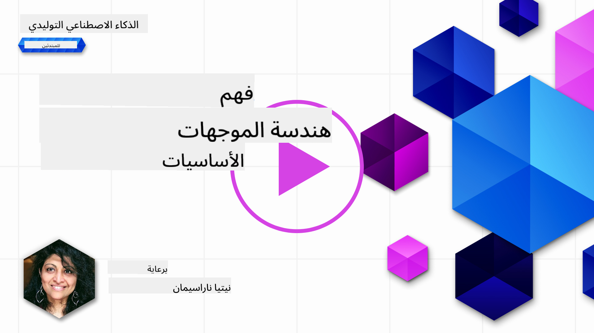
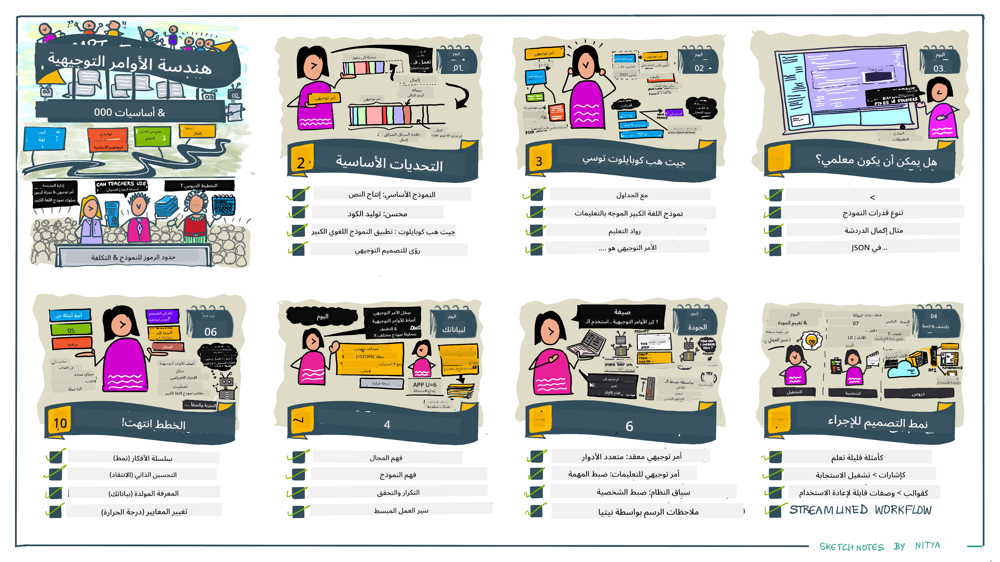
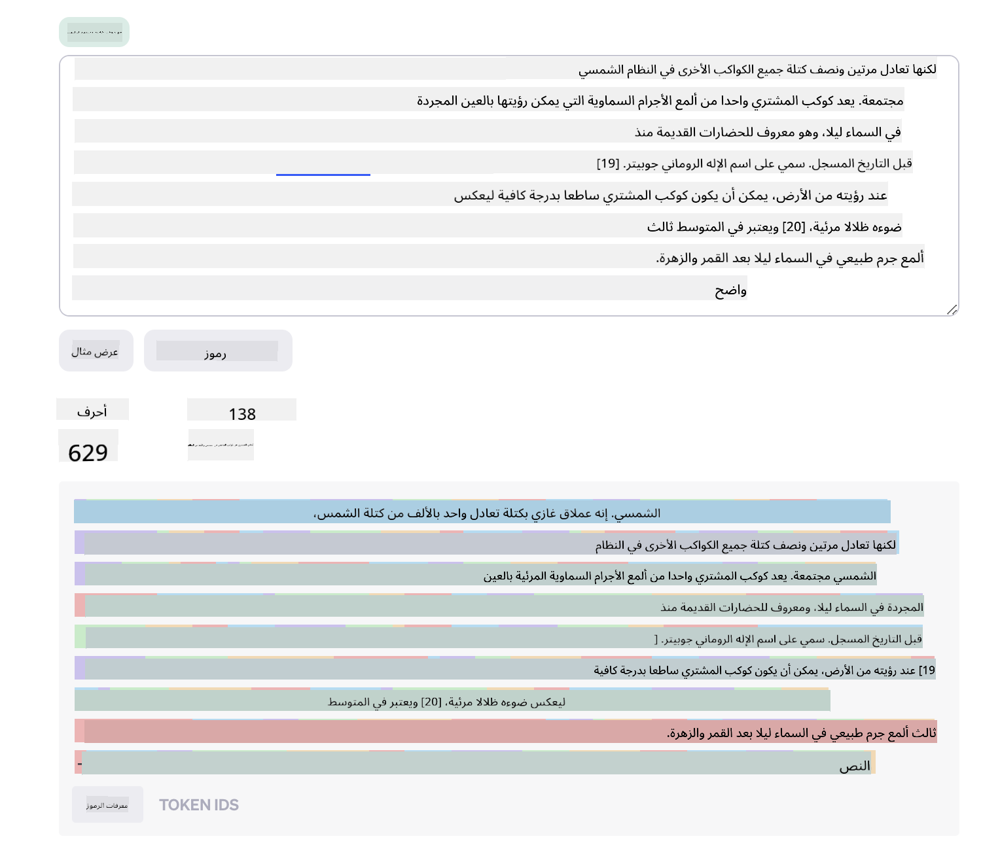
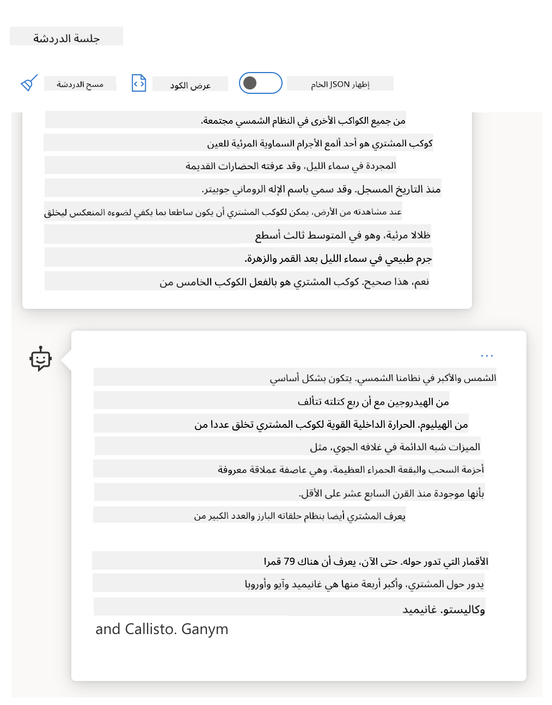
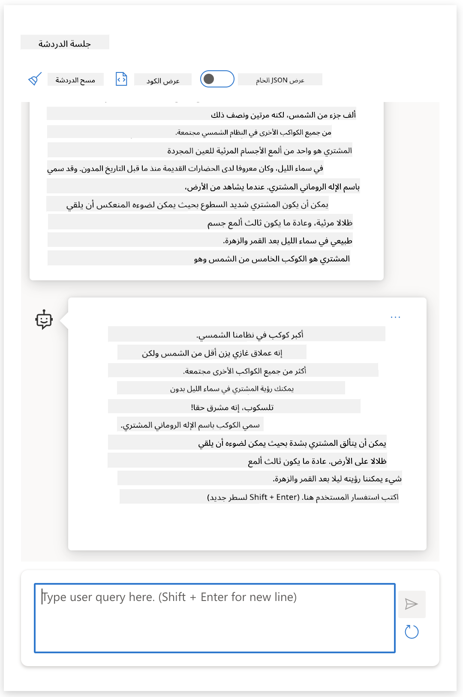
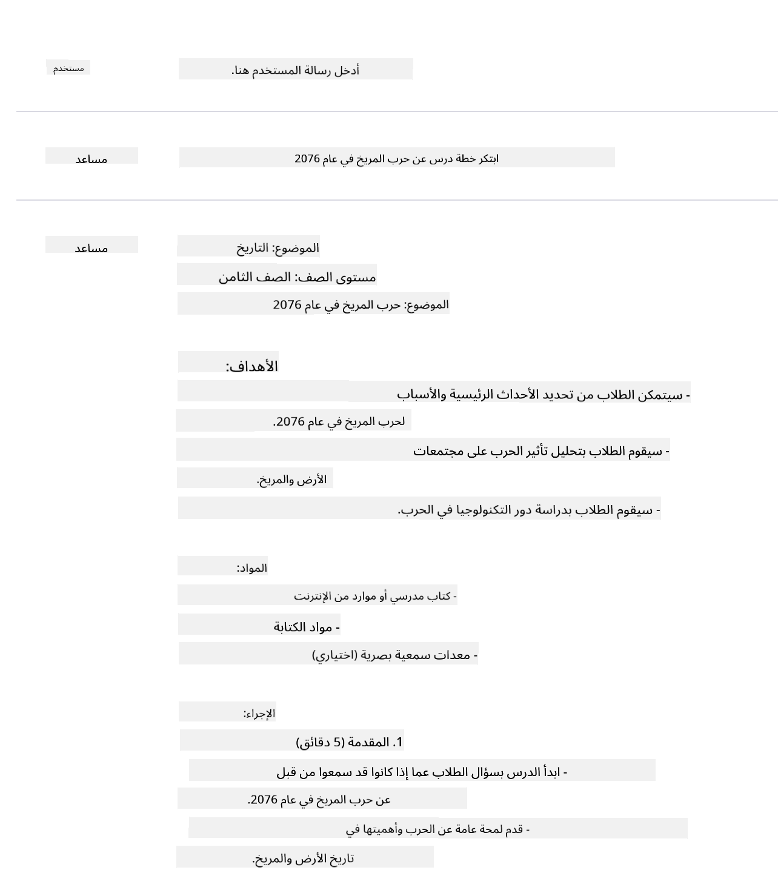
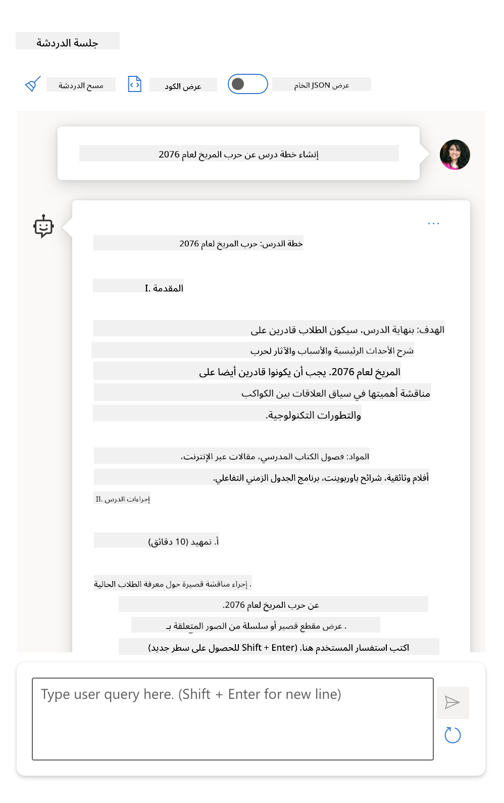
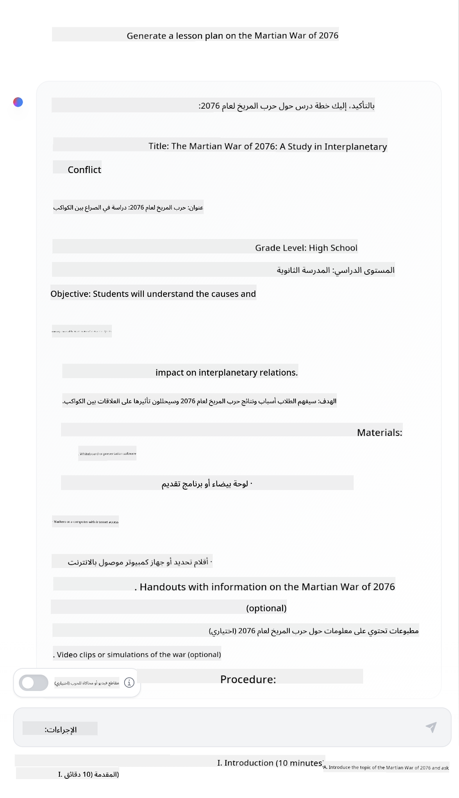

<!--
CO_OP_TRANSLATOR_METADATA:
{
  "original_hash": "dcbaaae026cb50fee071e690685b5843",
  "translation_date": "2025-08-26T14:04:04+00:00",
  "source_file": "04-prompt-engineering-fundamentals/README.md",
  "language_code": "ar"
}
-->
# أساسيات هندسة التوجيه

[](https://aka.ms/gen-ai-lesson4-gh?WT.mc_id=academic-105485-koreyst)

## المقدمة
يغطي هذا الدرس مفاهيم وتقنيات أساسية لإنشاء توجيهات فعّالة لنماذج الذكاء الاصطناعي التوليدي. طريقة كتابتك للتوجيه (prompt) إلى نموذج اللغة الكبير (LLM) لها تأثير كبير أيضاً. التوجيه المصاغ بعناية يمكن أن يحقق جودة أفضل في الاستجابة. لكن ما معنى مصطلحات مثل _التوجيه_ و _هندسة التوجيه_ بالضبط؟ وكيف يمكنني تحسين _مدخل التوجيه_ الذي أرسله إلى النموذج؟ هذه هي الأسئلة التي سنحاول الإجابة عليها في هذا الفصل والفصل التالي.

الذكاء الاصطناعي التوليدي قادر على إنشاء محتوى جديد (مثل النصوص، الصور، الصوت، الشيفرة البرمجية، وغيرها) استجابةً لطلبات المستخدمين. يتم ذلك باستخدام _نماذج اللغة الكبيرة_ مثل سلسلة GPT ("المحوّل المدرب مسبقاً على التوليد") من OpenAI، والتي تم تدريبها على استخدام اللغة الطبيعية والشيفرة.

يمكن للمستخدمين الآن التفاعل مع هذه النماذج باستخدام طرق مألوفة مثل الدردشة، دون الحاجة لأي خبرة تقنية أو تدريب. هذه النماذج تعتمد على _التوجيه_ - حيث يرسل المستخدم نصاً (توجيه) ويحصل على استجابة من الذكاء الاصطناعي (إكمال). يمكنهم بعد ذلك "الدردشة مع الذكاء الاصطناعي" بشكل تكراري، في محادثات متعددة الجولات، وتحسين التوجيه حتى تتوافق الاستجابة مع توقعاتهم.

أصبحت "التوجيهات" الآن هي _واجهة البرمجة_ الأساسية لتطبيقات الذكاء الاصطناعي التوليدي، حيث تحدد للنماذج ما يجب فعله وتؤثر على جودة الاستجابات. "هندسة التوجيه" هي مجال سريع النمو يركز على _تصميم وتحسين_ التوجيهات لتحقيق استجابات متسقة وعالية الجودة على نطاق واسع.

## أهداف التعلم

في هذا الدرس، سنتعرف على ماهية هندسة التوجيه، ولماذا هي مهمة، وكيف يمكننا صياغة توجيهات أكثر فعالية لنموذج وهدف تطبيقي معين. سنفهم المفاهيم الأساسية وأفضل الممارسات في هندسة التوجيه - ونتعرف على بيئة "صندوق الرمل" التفاعلية باستخدام Jupyter Notebooks حيث يمكننا رؤية هذه المفاهيم مطبقة على أمثلة واقعية.

بنهاية هذا الدرس سنكون قادرين على:

1. شرح ما هي هندسة التوجيه ولماذا هي مهمة.
2. وصف مكونات التوجيه وكيفية استخدامها.
3. تعلم أفضل الممارسات والتقنيات في هندسة التوجيه.
4. تطبيق التقنيات المكتسبة على أمثلة واقعية باستخدام نقطة نهاية OpenAI.

## المصطلحات الأساسية

هندسة التوجيه: ممارسة تصميم وتحسين المدخلات لتوجيه نماذج الذكاء الاصطناعي نحو إنتاج المخرجات المطلوبة.
التجزئة إلى رموز (Tokenization): عملية تحويل النص إلى وحدات أصغر تسمى الرموز (tokens) يمكن للنموذج فهمها ومعالجتها.
نماذج اللغة الكبيرة المضبوطة بالتعليمات: نماذج لغة كبيرة تم تحسينها بتعليمات محددة لتحسين دقة وملاءمة الاستجابة.

## صندوق التعلم

هندسة التوجيه حالياً أقرب للفن منها للعلم. أفضل طريقة لتحسين حدسنا فيها هي _الممارسة المستمرة_ واتباع أسلوب التجربة والخطأ الذي يجمع بين خبرة المجال والتقنيات الموصى بها والتحسينات الخاصة بالنموذج.

دفتر Jupyter المرفق مع هذا الدرس يوفر بيئة _صندوق رمل_ حيث يمكنك تجربة ما تتعلمه - أثناء الدرس أو ضمن تحدي البرمجة في النهاية. لتنفيذ التمارين، ستحتاج إلى:

1. **مفتاح Azure OpenAI API** - نقطة الخدمة لنموذج اللغة الكبير المنشور.
2. **بيئة تشغيل بايثون** - لتشغيل الدفتر.
3. **متغيرات بيئة محلية** - _أكمل الآن خطوات [الإعداد](./../00-course-setup/02-setup-local.md?WT.mc_id=academic-105485-koreyst) لتكون جاهزاً_.

يحتوي الدفتر على تمارين _بداية_ - لكن يُشجعك على إضافة أقسامك الخاصة من _Markdown_ (وصف) و _Code_ (طلبات التوجيه) لتجربة المزيد من الأمثلة أو الأفكار - وبناء حدسك في تصميم التوجيهات.

## دليل مصور

هل ترغب في الحصول على نظرة شاملة لما يغطيه هذا الدرس قبل أن تبدأ؟ اطلع على هذا الدليل المصور، الذي يمنحك فكرة عن المواضيع الرئيسية والنقاط الأساسية التي يجب التفكير فيها في كل جزء. خارطة الدرس تأخذك من فهم المفاهيم والتحديات الأساسية إلى معالجتها باستخدام تقنيات وأفضل ممارسات هندسة التوجيه المناسبة. لاحظ أن قسم "التقنيات المتقدمة" في هذا الدليل يشير إلى محتوى سيتم تغطيته في الفصل _التالي_ من هذا المنهاج.



## شركتنا الناشئة

الآن، دعونا نتحدث عن كيف يرتبط _هذا الموضوع_ بمهمتنا في الشركة الناشئة [لجلب الابتكار في الذكاء الاصطناعي إلى التعليم](https://educationblog.microsoft.com/2023/06/collaborating-to-bring-ai-innovation-to-education?WT.mc_id=academic-105485-koreyst). نرغب في بناء تطبيقات تعليمية مدعومة بالذكاء الاصطناعي للتعلم _الشخصي_ - فلنفكر كيف يمكن لمستخدمي تطبيقنا المختلفين "تصميم" التوجيهات:

- **المديرون** قد يطلبون من الذكاء الاصطناعي _تحليل بيانات المنهج الدراسي لتحديد الثغرات في التغطية_. يمكن للذكاء الاصطناعي تلخيص النتائج أو عرضها بصرياً باستخدام الشيفرة.
- **المعلمون** قد يطلبون من الذكاء الاصطناعي _إنشاء خطة درس لجمهور وموضوع محددين_. يمكن للذكاء الاصطناعي بناء خطة شخصية بالتنسيق المطلوب.
- **الطلاب** قد يطلبون من الذكاء الاصطناعي _مساعدتهم في مادة صعبة_. يمكن للذكاء الاصطناعي الآن إرشاد الطلاب بدروس ونصائح وأمثلة تناسب مستواهم.

وهذا مجرد غيض من فيض. اطلع على [توجيهات للتعليم](https://github.com/microsoft/prompts-for-edu/tree/main?WT.mc_id=academic-105485-koreyst) - مكتبة توجيهات مفتوحة المصدر منسقة من خبراء التعليم - لتتعرف على المزيد من الإمكانيات! _جرّب تنفيذ بعض هذه التوجيهات في صندوق الرمل أو باستخدام OpenAI Playground لترى النتائج بنفسك!_

<!--
قالب الدرس:
يجب أن يغطي هذا الجزء المفهوم الأساسي رقم 1.
عزز المفهوم بالأمثلة والمراجع.

المفهوم #1:
هندسة التوجيه.
عرّفها واشرح لماذا هي ضرورية.
-->

## ما هي هندسة التوجيه؟

بدأنا هذا الدرس بتعريف **هندسة التوجيه** بأنها عملية _تصميم وتحسين_ مدخلات النص (التوجيهات) لتحقيق استجابات متسقة وعالية الجودة (إكمالات) لهدف تطبيقي ونموذج معين. يمكننا اعتبارها عملية من خطوتين:

- _تصميم_ التوجيه الأولي لنموذج وهدف معين
- _تحسين_ التوجيه بشكل تكراري لتحسين جودة الاستجابة

هذه العملية تعتمد بالضرورة على التجربة والخطأ وتتطلب حدس وجهد المستخدم للحصول على أفضل النتائج. لماذا هي مهمة؟ للإجابة على هذا السؤال، نحتاج أولاً لفهم ثلاثة مفاهيم:

- _التجزئة إلى رموز (Tokenization)_ = كيف "يرى" النموذج التوجيه
- _نماذج اللغة الأساسية (Base LLMs)_ = كيف "يعالج" النموذج الأساسي التوجيه
- _نماذج اللغة المضبوطة بالتعليمات (Instruction-Tuned LLMs)_ = كيف يمكن للنموذج الآن رؤية "المهام"

### التجزئة إلى رموز (Tokenization)

يرى نموذج اللغة الكبير التوجيهات كسلسلة من _الرموز_، حيث يمكن لنماذج مختلفة (أو إصدارات من نفس النموذج) أن تجزئ نفس التوجيه بطرق مختلفة. بما أن النماذج مدربة على الرموز (وليس النص الخام)، فإن طريقة تجزئة التوجيه تؤثر بشكل مباشر على جودة الاستجابة الناتجة.

لتكوين فكرة عن كيفية عمل التجزئة، جرب أدوات مثل [OpenAI Tokenizer](https://platform.openai.com/tokenizer?WT.mc_id=academic-105485-koreyst) الموضحة أدناه. انسخ توجيهك وشاهد كيف يتحول إلى رموز، مع الانتباه لكيفية التعامل مع الفراغات وعلامات الترقيم. لاحظ أن هذا المثال يعرض نموذجاً قديماً (GPT-3) - لذا قد تحصل على نتيجة مختلفة مع نموذج أحدث.



### المفهوم: النماذج الأساسية

بعد تجزئة التوجيه، الوظيفة الأساسية لـ ["النموذج الأساسي"](https://blog.gopenai.com/an-introduction-to-base-and-instruction-tuned-large-language-models-8de102c785a6?WT.mc_id=academic-105485-koreyst) (أو نموذج الأساس) هي توقع الرمز التالي في السلسلة. بما أن النماذج مدربة على مجموعات ضخمة من النصوص، فهي تملك فهماً جيداً للعلاقات الإحصائية بين الرموز ويمكنها التنبؤ بذلك بثقة معينة. لاحظ أنها لا تفهم _معنى_ الكلمات أو الرموز في التوجيه؛ بل ترى نمطاً يمكنها "إكماله" بتوقعها التالي. يمكنها الاستمرار في التنبؤ حتى يتوقف المستخدم أو يتحقق شرط محدد مسبقاً.

هل ترغب في رؤية كيف يعمل الإكمال بناءً على التوجيه؟ أدخل التوجيه أعلاه في [_Chat Playground_ في Azure OpenAI Studio](https://oai.azure.com/playground?WT.mc_id=academic-105485-koreyst) بالإعدادات الافتراضية. النظام مضبوط على اعتبار التوجيهات طلبات معلومات - لذا يجب أن ترى إكمالاً يناسب هذا السياق.

لكن ماذا لو أراد المستخدم رؤية شيء محدد يحقق معايير أو هدف مهمة معينة؟ هنا تظهر أهمية نماذج اللغة المضبوطة بالتعليمات.



### المفهوم: نماذج اللغة المضبوطة بالتعليمات

يبدأ [نموذج اللغة المضبوط بالتعليمات](https://blog.gopenai.com/an-introduction-to-base-and-instruction-tuned-large-language-models-8de102c785a6?WT.mc_id=academic-105485-koreyst) من النموذج الأساسي ويتم تحسينه بأمثلة أو أزواج مدخلات/مخرجات (مثل "رسائل" متعددة الجولات) يمكن أن تحتوي على تعليمات واضحة - ويستجيب الذكاء الاصطناعي بمحاولة اتباع تلك التعليمات.

يستخدم ذلك تقنيات مثل التعلم المعزز بتغذية راجعة بشرية (RLHF) التي تدرب النموذج على _اتباع التعليمات_ و _التعلم من التغذية الراجعة_ ليقدم استجابات أكثر ملاءمة للتطبيقات العملية وأكثر ارتباطاً بأهداف المستخدم.

لنجرّب ذلك - أعد استخدام التوجيه أعلاه، لكن غيّر الآن _رسالة النظام_ لتوفير التعليمات التالية كسياق:

> _لخص المحتوى المقدم لك لطالب في الصف الثاني. اجعل النتيجة في فقرة واحدة مع 3-5 نقاط رئيسية._

لاحظ كيف أصبحت النتيجة الآن مضبوطة لتعكس الهدف والشكل المطلوب؟ يمكن للمعلم الآن استخدام هذه الاستجابة مباشرة في شرائح الدرس.



## لماذا نحتاج إلى هندسة التوجيه؟

الآن بعد أن عرفنا كيف تتم معالجة التوجيهات من قبل النماذج، دعونا نتحدث عن _لماذا_ نحتاج إلى هندسة التوجيه. الجواب يكمن في أن النماذج الحالية تواجه عدداً من التحديات التي تجعل تحقيق _إكمالات موثوقة ومتسقة_ أمراً صعباً بدون بذل جهد في بناء وتحسين التوجيهات. على سبيل المثال:

1. **استجابات النماذج عشوائية.** من المرجح أن ينتج _نفس التوجيه_ استجابات مختلفة مع نماذج أو إصدارات مختلفة. وقد ينتج أيضاً نتائج مختلفة مع _نفس النموذج_ في أوقات مختلفة. _تقنيات هندسة التوجيه تساعدنا في تقليل هذه التباينات من خلال توفير ضوابط أفضل_.

1. **النماذج قد تختلق استجابات.** النماذج مدربة مسبقاً على مجموعات بيانات _كبيرة لكنها محدودة_، ما يعني أنها تفتقر للمعرفة حول مفاهيم خارج نطاق التدريب. ونتيجة لذلك، قد تنتج إكمالات غير دقيقة أو متخيلة أو حتى متناقضة مع الحقائق المعروفة. _تقنيات هندسة التوجيه تساعد المستخدمين على اكتشاف وتخفيف مثل هذه الاختلاقات، مثلاً بطلب مصادر أو تبريرات من الذكاء الاصطناعي_.

1. **قدرات النماذج تختلف.** النماذج الأحدث أو الأجيال الجديدة منها تملك قدرات أغنى لكنها تجلب أيضاً خصائص فريدة ومقايضات في التكلفة والتعقيد. _هندسة التوجيه تساعدنا في تطوير أفضل الممارسات وسير العمل التي تتجاوز الفروقات وتتكيف مع متطلبات كل نموذج بطريقة قابلة للتوسع وسلسة_.

لنرَ ذلك عملياً في OpenAI أو Azure OpenAI Playground:

- استخدم نفس التوجيه مع عمليات نشر مختلفة للنماذج (مثل OpenAI، Azure OpenAI، Hugging Face) - هل لاحظت التباينات؟
- استخدم نفس التوجيه عدة مرات مع نفس النموذج (مثلاً في Azure OpenAI playground) - كيف اختلفت النتائج؟

### مثال على الاختلاقات

في هذا المقرر، نستخدم مصطلح **"الاختلاق"** للإشارة إلى الظاهرة التي تنتج فيها النماذج أحياناً معلومات غير صحيحة بسبب قيود في تدريبها أو عوامل أخرى. ربما سمعت أيضاً بهذا تحت اسم _"الهلوسة"_ في مقالات أو أبحاث. مع ذلك، نوصي بشدة باستخدام مصطلح _"الاختلاق"_ حتى لا ننسب سلوكاً بشرياً إلى نتيجة آلية. هذا يعزز أيضاً [إرشادات الذكاء الاصطناعي المسؤول](https://www.microsoft.com/ai/responsible-ai?WT.mc_id=academic-105485-koreyst) من ناحية المصطلحات، ويزيل تعبيرات قد تعتبر مسيئة أو غير شاملة في بعض السياقات.

هل ترغب في فهم كيف تحدث الاختلاقات؟ فكّر في توجيه يطلب من الذكاء الاصطناعي إنشاء محتوى حول موضوع غير موجود (لضمان عدم وجوده في بيانات التدريب). على سبيل المثال - جربت هذا التوجيه:
# خطة درس: حرب المريخ عام 2076

## الأهداف التعليمية

- فهم الأسباب الرئيسية لنشوب حرب المريخ عام 2076.
- تحليل تأثير الحرب على سكان المريخ والأرض.
- مناقشة الدروس المستفادة من الصراع وكيف يمكن تطبيقها في المستقبل.

## المقدمة

في عام 2076، اندلعت حرب كبيرة بين مستعمرات البشر على كوكب المريخ وقوات الأرض. كان هذا الصراع نقطة تحول في تاريخ الاستعمار الفضائي، حيث غيرت نتائج الحرب شكل العلاقات بين الكواكب.

## خلفية تاريخية

قبل الحرب، شهدت مستعمرات المريخ نمواً سريعاً في عدد السكان والتكنولوجيا. ومع ذلك، ظهرت خلافات حول الموارد، والاستقلال السياسي، وطرق إدارة المستعمرات. تصاعدت التوترات بين قادة المريخ وحكومات الأرض، حتى وصلت إلى نقطة الانفجار في منتصف عام 2076.

## أسباب الحرب

- النزاع على الموارد الطبيعية في المريخ، مثل المياه والمعادن النادرة.
- رغبة سكان المريخ في الاستقلال عن سيطرة الأرض.
- اختلافات في السياسات الاقتصادية والتكنولوجية بين الكوكبين.

## أحداث الحرب الرئيسية

- بداية الحرب: هجوم مفاجئ من قوات المريخ على منشآت أرضية في المنطقة القطبية.
- معركة المدار: اشتباكات عنيفة بين السفن الفضائية في مدار المريخ.
- حصار المستعمرات: فرض حصار على أهم المدن المريخية، مما أدى إلى نقص في الإمدادات.
- نهاية الحرب: توقيع اتفاقية سلام بعد تدخل وسطاء من كواكب أخرى.

## نتائج الحرب

- حصول المريخ على استقلال جزئي وإقامة حكومة محلية.
- تطور تقنيات الدفاع الفضائي بشكل كبير.
- تعزيز التعاون بين الكواكب لتجنب صراعات مستقبلية.

## الأنشطة الصفية

1. مناقشة جماعية حول أسباب الحرب وكيف كان يمكن تجنبها.
2. كتابة مقال قصير عن تأثير الحرب على الحياة اليومية في المريخ.
3. رسم خريطة توضح مواقع المعارك الرئيسية خلال الحرب.

## التقييم

- المشاركة في المناقشة الصفية.
- تقديم المقال القصير.
- عرض الخريطة وتفسيرها أمام الصف.

## الخاتمة

حرب المريخ عام 2076 كانت حدثاً مفصلياً في تاريخ البشرية، علمتنا أهمية الحوار والتعاون بين الكواكب، وأظهرت كيف يمكن أن تؤدي الخلافات إلى صراعات كبيرة إذا لم يتم التعامل معها بحكمة.
أظهر لي البحث على الإنترنت أن هناك روايات خيالية (مثل المسلسلات التلفزيونية أو الكتب) عن حروب المريخ - لكن لا يوجد أي منها في عام 2076. المنطق أيضاً يخبرنا أن عام 2076 هو _في المستقبل_، وبالتالي لا يمكن ربطه بحدث حقيقي.

ماذا يحدث إذا جربنا هذا الطلب مع مزودي نماذج لغوية مختلفة؟

> **الرد 1**: OpenAI Playground (GPT-35)



> **الرد 2**: Azure OpenAI Playground (GPT-35)



> **الرد 3**: : Hugging Face Chat Playground (LLama-2)



كما هو متوقع، كل نموذج (أو إصدار النموذج) ينتج ردوداً مختلفة قليلاً بسبب السلوك العشوائي واختلاف قدرات النماذج. على سبيل المثال، أحد النماذج يستهدف جمهور الصف الثامن بينما الآخر يفترض أنه يتعامل مع طالب في المرحلة الثانوية. لكن جميع النماذج الثلاثة قدمت ردوداً يمكن أن تقنع مستخدماً غير مطلع بأن الحدث كان حقيقياً.

تقنيات هندسة الطلبات مثل _الميتابرومبتينغ_ و _ضبط درجة الحرارة_ قد تقلل من اختلاق النماذج إلى حد ما. كما أن هندسات هندسة الطلبات الجديدة تدمج أدوات وتقنيات حديثة بسلاسة في تدفق الطلبات، للتقليل أو الحد من بعض هذه التأثيرات.

## دراسة حالة: GitHub Copilot

لنختم هذا القسم بإلقاء نظرة على كيفية استخدام هندسة الطلبات في حلول العالم الحقيقي من خلال دراسة حالة: [GitHub Copilot](https://github.com/features/copilot?WT.mc_id=academic-105485-koreyst).

GitHub Copilot هو "مساعدك البرمجي الذكي" - يحول الطلبات النصية إلى إكمالات برمجية ويتكامل مع بيئة التطوير الخاصة بك (مثل Visual Studio Code) لتجربة مستخدم سلسة. كما هو موضح في سلسلة المدونات أدناه، كان الإصدار الأول مبنياً على نموذج OpenAI Codex - حيث أدرك المهندسون بسرعة الحاجة إلى ضبط النموذج وتطوير تقنيات هندسة طلبات أفضل لتحسين جودة الكود. في يوليو، [أطلقوا نموذج ذكاء اصطناعي محسن يتجاوز Codex](https://github.blog/2023-07-28-smarter-more-efficient-coding-github-copilot-goes-beyond-codex-with-improved-ai-model/?WT.mc_id=academic-105485-koreyst) لتقديم اقتراحات أسرع.

اقرأ المنشورات بالترتيب لتتابع رحلة تعلمهم.

- **مايو 2023** | [GitHub Copilot يتحسن في فهم الكود الخاص بك](https://github.blog/2023-05-17-how-github-copilot-is-getting-better-at-understanding-your-code/?WT.mc_id=academic-105485-koreyst)
- **مايو 2023** | [داخل GitHub: العمل مع النماذج اللغوية وراء GitHub Copilot](https://github.blog/2023-05-17-inside-github-working-with-the-llms-behind-github-copilot/?WT.mc_id=academic-105485-koreyst).
- **يونيو 2023** | [كيف تكتب طلبات أفضل لـ GitHub Copilot](https://github.blog/2023-06-20-how-to-write-better-prompts-for-github-copilot/?WT.mc_id=academic-105485-koreyst).
- **يوليو 2023** | [.. GitHub Copilot يتجاوز Codex بنموذج ذكاء اصطناعي محسن](https://github.blog/2023-07-28-smarter-more-efficient-coding-github-copilot-goes-beyond-codex-with-improved-ai-model/?WT.mc_id=academic-105485-koreyst)
- **يوليو 2023** | [دليل المطور لهندسة الطلبات والنماذج اللغوية](https://github.blog/2023-07-17-prompt-engineering-guide-generative-ai-llms/?WT.mc_id=academic-105485-koreyst)
- **سبتمبر 2023** | [كيف تبني تطبيق نماذج لغوية للمؤسسات: دروس من GitHub Copilot](https://github.blog/2023-09-06-how-to-build-an-enterprise-llm-application-lessons-from-github-copilot/?WT.mc_id=academic-105485-koreyst)

يمكنك أيضاً تصفح [مدونة الهندسة الخاصة بهم](https://github.blog/category/engineering/?WT.mc_id=academic-105485-koreyst) لمزيد من المنشورات مثل [هذا المنشور](https://github.blog/2023-09-27-how-i-used-github-copilot-chat-to-build-a-reactjs-gallery-prototype/?WT.mc_id=academic-105485-koreyst) الذي يوضح كيف يتم _تطبيق_ هذه النماذج والتقنيات لدفع تطبيقات العالم الحقيقي.

---

<!--
قالب الدرس:
يجب أن يغطي هذا الجزء المفهوم الأساسي رقم 2.
عزز المفهوم بالأمثلة والمراجع.

المفهوم #2:
تصميم الطلبات.
موضح بالأمثلة.
-->

## بناء الطلبات

لقد رأينا لماذا هندسة الطلبات مهمة - الآن دعونا نفهم كيف يتم _بناء_ الطلبات حتى نتمكن من تقييم تقنيات مختلفة لتصميم طلبات أكثر فعالية.

### الطلب الأساسي

لنبدأ بالطلب الأساسي: إدخال نصي يُرسل إلى النموذج بدون أي سياق إضافي. إليك مثال - عندما نرسل الكلمات الأولى من النشيد الوطني الأمريكي إلى [واجهة برمجة تطبيقات الإكمال من OpenAI](https://platform.openai.com/docs/api-reference/completions?WT.mc_id=academic-105485-koreyst) يكمل النموذج الرد فوراً بالسطر التالي، موضحاً سلوك التنبؤ الأساسي.

| الطلب (الإدخال)     | الإكمال (الإخراج)                                                                                                                        |
| :------------------ | :---------------------------------------------------------------------------------------------------------------------------------------- |
| Oh say can you see  | يبدو أنك بدأت كلمات "The Star-Spangled Banner"، النشيد الوطني للولايات المتحدة. الكلمات الكاملة هي ... |

### الطلب المركب

الآن دعونا نضيف سياق وتعليمات لهذا الطلب الأساسي. تتيح لنا [واجهة برمجة تطبيقات إكمال المحادثة](https://learn.microsoft.com/azure/ai-services/openai/how-to/chatgpt?WT.mc_id=academic-105485-koreyst) بناء طلب مركب كمجموعة من _الرسائل_ مع:

- أزواج إدخال/إخراج تعكس إدخال _المستخدم_ ورد _المساعد_.
- رسالة نظام تحدد سياق سلوك أو شخصية المساعد.

يصبح الطلب الآن بالشكل التالي، حيث أن _التقسيم إلى رموز_ يلتقط المعلومات ذات الصلة من السياق والمحادثة. الآن، يمكن أن يكون تغيير سياق النظام مؤثراً على جودة الإكمالات مثل إدخالات المستخدم المقدمة.

```python
response = openai.chat.completions.create(
    model="gpt-3.5-turbo",
    messages=[
        {"role": "system", "content": "You are a helpful assistant."},
        {"role": "user", "content": "Who won the world series in 2020?"},
        {"role": "assistant", "content": "The Los Angeles Dodgers won the World Series in 2020."},
        {"role": "user", "content": "Where was it played?"}
    ]
)
```

### طلب التعليمات

في الأمثلة السابقة، كان طلب المستخدم عبارة عن استفسار نصي بسيط يمكن تفسيره كطلب معلومات. مع طلبات _التعليمات_، يمكننا استخدام هذا النص لتحديد المهمة بمزيد من التفصيل، وتقديم إرشادات أفضل للذكاء الاصطناعي. إليك مثالاً:

| الطلب (الإدخال)                                                                                                                                                                                                                         | الإكمال (الإخراج)                                                                                                        | نوع التعليمات       |
| :-------------------------------------------------------------------------------------------------------------------------------------------------------------------------------------------------------------------------------------- | :------------------------------------------------------------------------------------------------------------------------ | :------------------ |
| اكتب وصفاً للحرب الأهلية                                                                                                                                                                         | _تم إرجاع فقرة بسيطة_                                                                                                    | بسيط                |
| اكتب وصفاً للحرب الأهلية. قدم تواريخ وأحداث رئيسية ووضح أهميتها                                                                                                                                   | _تم إرجاع فقرة متبوعة بقائمة تواريخ الأحداث الرئيسية مع وصف لكل منها_                                                     | مركب                |
| اكتب وصفاً للحرب الأهلية في فقرة واحدة. قدم 3 نقاط رئيسية مع التواريخ وأهميتها. قدم 3 نقاط أخرى مع الشخصيات التاريخية الرئيسية ومساهماتهم. أرجع الناتج كملف JSON | _تم إرجاع تفاصيل موسعة في مربع نص، منسقة كـ JSON يمكنك نسخها ولصقها في ملف والتحقق منها حسب الحاجة_                      | مركب. منسق.         |

## المحتوى الأساسي

في الأمثلة السابقة، كان الطلب لا يزال مفتوحاً إلى حد ما، مما يسمح للنموذج اللغوي باختيار الجزء المناسب من بياناته المدربة مسبقاً. مع نمط تصميم _المحتوى الأساسي_، يتم تقسيم النص المدخل إلى جزئين:

- تعليمات (إجراء)
- محتوى ذو صلة (يؤثر على الإجراء)

إليك مثالاً حيث التعليمات هي "لخص هذا في جملتين".

| الطلب (الإدخال)                                                                                                                                                                                                                                                                                                                                                                                                                                                                                                                                                                                                                                                                                      | الإكمال (الإخراج)                                                                                                                                                                                                                                                                             |
| :-------------------------------------------------------------------------------------------------------------------------------------------------------------------------------------------------------------------------------------------------------------------------------------------------------------------------------------------------------------------------------------------------------------------------------------------------------------------------------------------------------------------------------------------------------------------------------------------------------------------------------------------------------------------------------------------------- | :---------------------------------------------------------------------------------------------------------------------------------------------------------------------------------------------------------------------------------------------------------------------------------------------- |
| المشتري هو الكوكب الخامس من الشمس وأكبر كواكب المجموعة الشمسية. إنه عملاق غازي كتلته تعادل واحد بالألف من كتلة الشمس، لكنه يعادل اثنين ونصف من كتلة جميع الكواكب الأخرى مجتمعة. المشتري من أكثر الأجرام لمعاناً في السماء ليلاً ويمكن رؤيته بالعين المجردة، وكان معروفاً للحضارات القديمة قبل التاريخ. سمي على اسم الإله الروماني المشتري.[19] عند رؤيته من الأرض، يمكن أن يكون المشتري ساطعاً بما يكفي ليعكس الضوء ويلقي بظلال مرئية،[20] ويعتبر في المتوسط ثالث ألمع جرم طبيعي في السماء بعد القمر والزهرة. <br/> **لخص هذا في جملتين قصيرتين** | المشتري، الكوكب الخامس من الشمس، هو الأكبر في المجموعة الشمسية ويشتهر بكونه من ألمع الأجرام في السماء ليلاً. سمي على اسم الإله الروماني المشتري، وهو عملاق غازي كتلته تعادل اثنين ونصف من كتلة جميع الكواكب الأخرى مجتمعة. |

يمكن استخدام جزء المحتوى الأساسي بطرق متنوعة لتقديم تعليمات أكثر فعالية:

- **أمثلة** - بدلاً من إخبار النموذج بما يجب فعله بتعليمات صريحة، قدم له أمثلة لما يجب فعله ودعه يستنتج النمط.
- **إشارات** - اتبع التعليمات بـ "إشارة" تمهد للإكمال، وتوجه النموذج نحو ردود أكثر صلة.
- **قوالب** - هذه وصفات قابلة للتكرار للطلبات مع متغيرات يمكن تخصيصها بالبيانات لحالات استخدام محددة.

دعونا نستكشف هذه الطرق عملياً.

### استخدام الأمثلة

هذه طريقة تستخدم فيها المحتوى الأساسي لـ "تغذية النموذج" ببعض الأمثلة على الإخراج المطلوب لمهمة معينة، وتدعه يستنتج النمط للإخراج المطلوب. بناءً على عدد الأمثلة المقدمة، يمكن أن يكون لدينا طلبات بدون أمثلة (zero-shot)، أو مع مثال واحد (one-shot)، أو مع عدة أمثلة (few-shot).

يتكون الطلب الآن من ثلاثة عناصر:

- وصف المهمة
- بعض الأمثلة على الإخراج المطلوب
- بداية مثال جديد (يصبح وصف مهمة ضمني)

| نوع التعلم   | الطلب (الإدخال)                                                                                                                                        | الإكمال (الإخراج)         |
| :----------- | :------------------------------------------------------------------------------------------------------------------------------------------------------ | :------------------------ |
| بدون أمثلة   | "The Sun is Shining". Translate to Spanish                                                                                                             | "El Sol está brillando".  |
| مثال واحد    | "The Sun is Shining" => ""El Sol está brillando". <br> "It's a Cold and Windy Day" =>                                                                  | "Es un día frío y ventoso".|
| عدة أمثلة    | The player ran the bases => Baseball <br/> The player hit an ace => Tennis <br/> The player hit a six => Cricket <br/> The player made a slam-dunk => | Basketball                |
|              |                                                                                                                                                         |                           |

لاحظ كيف اضطررنا لتقديم تعليمات صريحة ("Translate to Spanish") في الطلب بدون أمثلة، لكنها أصبحت مستنتجة في مثال المثال الواحد. ويظهر المثال بعدة أمثلة كيف أن إضافة المزيد من الأمثلة يسمح للنماذج باستنتاجات أدق دون تعليمات إضافية.

### إشارات الطلب

تقنية أخرى لاستخدام المحتوى الأساسي هي تقديم _إشارات_ بدلاً من الأمثلة. في هذه الحالة، نعطي النموذج دفعة في الاتجاه الصحيح من خلال _بدء الرد_ بمقطع يعكس تنسيق الرد المطلوب. ثم "يأخذ النموذج الإشارة" ليكمل بنفس الأسلوب.

| عدد الإشارات | الطلب (الإدخال)                                                                                                                                                                                                                                                                                                                                                                                                                                               | الإكمال (الإخراج)                                                                                                                                                                                                                                                                                       |
| :----------- | :----------------------------------------------------------------------------------------------------------------------------------------------------------------------------------------------------------------------------------------------------------------------------------------------------------------------------------------------------------------------------------------------------------------------------------------------------------- | :-------------------------------------------------------------------------------------------------------------------------------------------------------------------------------------------------------------------------------------------------------------------------------------------------------- |
| 0            | المشتري هو الكوكب الخامس من الشمس وأكبر كواكب المجموعة الشمسية. إنه عملاق غازي كتلته تعادل واحد بالألف من كتلة الشمس، لكنه يعادل اثنين ونصف من كتلة جميع الكواكب الأخرى مجتمعة. المشتري من أكثر الأجرام لمعاناً في السماء ليلاً ويمكن رؤيته بالعين المجردة، وكان معروفاً للحضارات القديمة قبل التاريخ.

**لخص هذا**                                       | كوكب المشتري هو أكبر كوكب في نظامنا الشمسي والخامس من حيث البعد عن الشمس. هو عملاق غازي كتلته تعادل واحد من ألف من كتلة الشمس، لكنه أثقل من جميع الكواكب الأخرى مجتمعة. عرفت الحضارات القديمة كوكب المشتري منذ زمن بعيد، ويمكن رؤيته بسهولة في السماء ليلاً. |
| 1              | كوكب المشتري هو الكوكب الخامس من الشمس والأكبر في النظام الشمسي. هو عملاق غازي كتلته تعادل واحد من ألف من كتلة الشمس، لكنه يعادل مرتين ونصف كتلة جميع الكواكب الأخرى في النظام الشمسي مجتمعة. كوكب المشتري من أكثر الأجرام لمعاناً التي يمكن رؤيتها بالعين المجردة في السماء ليلاً، وقد عرفته الحضارات القديمة منذ ما قبل التاريخ. <br/>**لخص هذا** <br/> ما تعلمناه هو أن كوكب المشتري | هو الكوكب الخامس من الشمس والأكبر في النظام الشمسي. هو عملاق غازي كتلته تعادل واحد من ألف من كتلة الشمس، لكنه يعادل مرتين ونصف كتلة جميع الكواكب الأخرى مجتمعة. يمكن رؤيته بسهولة بالعين المجردة ومعروف منذ العصور القديمة.                        |
| 2              | كوكب المشتري هو الكوكب الخامس من الشمس والأكبر في النظام الشمسي. هو عملاق غازي كتلته تعادل واحد من ألف من كتلة الشمس، لكنه يعادل مرتين ونصف كتلة جميع الكواكب الأخرى في النظام الشمسي مجتمعة. كوكب المشتري من أكثر الأجرام لمعاناً التي يمكن رؤيتها بالعين المجردة في السماء ليلاً، وقد عرفته الحضارات القديمة منذ ما قبل التاريخ. <br/>**لخص هذا** <br/> أهم 3 حقائق تعلمناها:         | 1. كوكب المشتري هو الكوكب الخامس من الشمس والأكبر في النظام الشمسي. <br/> 2. هو عملاق غازي كتلته تعادل واحد من ألف من كتلة الشمس...<br/> 3. كوكب المشتري يمكن رؤيته بالعين المجردة منذ العصور القديمة ...                                                                       |
|                |                                                                                                                                                                                                                                                                                                                                                                                                                                                              |                                                                                                                                                                                                                                                                                                           |

### قوالب التعليمات

قالب التعليمات هو _وصفة جاهزة للتعليمات_ يمكن حفظها وإعادة استخدامها عند الحاجة، لتوفير تجارب مستخدم أكثر اتساقاً على نطاق واسع. في أبسط أشكالها، هي مجرد مجموعة من أمثلة التعليمات مثل [هذا المثال من OpenAI](https://platform.openai.com/examples?WT.mc_id=academic-105485-koreyst) الذي يوفر مكونات التعليمات التفاعلية (رسائل المستخدم والنظام) وصيغة الطلب عبر الـ API - لدعم إعادة الاستخدام.

في شكلها الأكثر تعقيداً مثل [هذا المثال من LangChain](https://python.langchain.com/docs/concepts/prompt_templates/?WT.mc_id=academic-105485-koreyst) تحتوي على _حقول قابلة للتبديل_ يمكن استبدالها ببيانات من مصادر متنوعة (إدخال المستخدم، سياق النظام، مصادر بيانات خارجية، إلخ) لإنشاء التعليمات بشكل ديناميكي. هذا يسمح لنا بإنشاء مكتبة من التعليمات القابلة لإعادة الاستخدام والتي يمكن استخدامها لتوفير تجارب مستخدم متسقة **برمجياً** على نطاق واسع.

وأخيراً، تكمن القيمة الحقيقية للقوالب في القدرة على إنشاء ونشر _مكتبات تعليمات_ لمجالات تطبيقية محددة - حيث يتم الآن _تحسين_ قالب التعليمات ليعكس سياق أو أمثلة خاصة بالتطبيق، مما يجعل الردود أكثر ملاءمة ودقة للجمهور المستهدف. مستودع [Prompts For Edu](https://github.com/microsoft/prompts-for-edu?WT.mc_id=academic-105485-koreyst) هو مثال رائع على هذا النهج، حيث يجمع مكتبة تعليمات لمجال التعليم مع التركيز على أهداف رئيسية مثل تخطيط الدروس، تصميم المناهج، دعم الطلاب، وغيرها.

## محتوى داعم

إذا اعتبرنا بناء التعليمات يتكون من مهمة (تعليمات) ومحتوى أساسي (المحتوى الرئيسي)، فإن _المحتوى الثانوي_ هو سياق إضافي نقدمه لـ **توجيه المخرجات بطريقة معينة**. قد يكون ذلك عبر ضبط المعايير، تعليمات التنسيق، تصنيفات الموضوعات، إلخ، والتي تساعد النموذج على _تخصيص_ رده ليتناسب مع أهداف أو توقعات المستخدم.

على سبيل المثال: إذا كان لدينا دليل دورات دراسية مع بيانات وصفية موسعة (الاسم، الوصف، المستوى، الوسوم، اسم المدرس، إلخ) لكل الدورات المتاحة في المنهج:

- يمكننا تحديد تعليمات "تلخيص دليل الدورات لخريف 2023"
- يمكننا استخدام المحتوى الرئيسي لتقديم بعض الأمثلة على المخرجات المطلوبة
- يمكننا استخدام المحتوى الثانوي لتحديد أهم 5 "وسوم" ذات اهتمام.

الآن، يمكن للنموذج أن يقدم ملخصاً بالتنسيق المعروض في الأمثلة، وإذا كان هناك نتيجة بها عدة وسوم، يمكنه إعطاء الأولوية للوسوم الخمسة المحددة في المحتوى الثانوي.

---

<!--
قالب الدرس:
يجب أن تغطي هذه الوحدة المفهوم الأساسي رقم 1.
عزز المفهوم بأمثلة ومراجع.

المفهوم #3:
تقنيات هندسة التعليمات.
ما هي بعض التقنيات الأساسية لهندسة التعليمات؟
وضح ذلك ببعض التمارين.
-->

## أفضل الممارسات في كتابة التعليمات

الآن بعد أن عرفنا كيف يمكن _بناء_ التعليمات، يمكننا البدء في التفكير بكيفية _تصميمها_ لتعكس أفضل الممارسات. يمكننا تقسيم ذلك إلى جزئين - امتلاك _عقلية_ صحيحة وتطبيق _تقنيات_ مناسبة.

### عقلية هندسة التعليمات

هندسة التعليمات هي عملية تعتمد على التجربة والخطأ، لذا ضع في اعتبارك ثلاثة عوامل رئيسية:

1. **فهم المجال مهم.** دقة وملاءمة الرد تعتمد على _المجال_ الذي يعمل فيه التطبيق أو المستخدم. استخدم حدسك وخبرتك في المجال لـ **تخصيص التقنيات** أكثر. على سبيل المثال، حدد _شخصيات خاصة بالمجال_ في تعليمات النظام، أو استخدم _قوالب خاصة بالمجال_ في تعليمات المستخدم. قدم محتوى ثانوي يعكس سياقات المجال، أو استخدم _إشارات وأمثلة خاصة بالمجال_ لتوجيه النموذج نحو أنماط استخدام مألوفة.

2. **فهم النموذج مهم.** نعلم أن النماذج بطبيعتها احتمالية. لكن تطبيقات النماذج قد تختلف أيضاً من حيث مجموعة البيانات التي تم تدريبها عليها (المعرفة المسبقة)، والقدرات التي توفرها (مثلاً عبر API أو SDK) ونوع المحتوى الذي تم تحسينها له (مثل الكود أو الصور أو النصوص). افهم نقاط القوة والقيود في النموذج الذي تستخدمه، واستخدم هذه المعرفة لـ _تحديد الأولويات_ أو بناء _قوالب مخصصة_ تتناسب مع قدرات النموذج.

3. **التكرار والتحقق مهمان.** النماذج تتطور بسرعة، وكذلك تقنيات هندسة التعليمات. كخبير في المجال، قد يكون لديك سياق أو معايير أخرى خاصة بتطبيقك، قد لا تنطبق على المجتمع الأوسع. استخدم أدوات وتقنيات هندسة التعليمات لـ "إطلاق شرارة" بناء التعليمات، ثم كرر وحقق النتائج باستخدام حدسك وخبرتك. سجل ملاحظاتك وأنشئ **قاعدة معرفة** (مثل مكتبات التعليمات) يمكن للآخرين استخدامها كنقطة انطلاق جديدة لتسريع التكرار مستقبلاً.

## أفضل الممارسات

لنلقِ نظرة الآن على أفضل الممارسات الشائعة التي يوصي بها [OpenAI](https://help.openai.com/en/articles/6654000-best-practices-for-prompt-engineering-with-openai-api?WT.mc_id=academic-105485-koreyst) و [Azure OpenAI](https://learn.microsoft.com/azure/ai-services/openai/concepts/prompt-engineering#best-practices?WT.mc_id=academic-105485-koreyst).

| ماذا                              | لماذا                                                                                                                                                                                                                                               |
| :-------------------------------- | :------------------------------------------------------------------------------------------------------------------------------------------------------------------------------------------------------------------------------------------------ |
| تقييم أحدث النماذج.       | الأجيال الجديدة من النماذج غالباً ما تقدم ميزات وجودة محسنة - لكنها قد تكون أكثر تكلفة. قيّم تأثيرها ثم قرر بشأن الانتقال إليها.                                                                                |
| فصل التعليمات عن السياق   | تحقق مما إذا كان النموذج أو المزود يحدد _فواصل_ لتمييز التعليمات، والمحتوى الأساسي والثانوي بشكل أوضح. هذا يمكن أن يساعد النماذج على إعطاء أوزان أدق للكلمات.                                                         |
| كن محدداً وواضحاً             | قدم تفاصيل أكثر عن السياق المطلوب، النتيجة، الطول، التنسيق، الأسلوب، إلخ. هذا سيحسن جودة واتساق الردود. احفظ الوصفات في قوالب قابلة لإعادة الاستخدام.                                                          |
| كن وصفياً، واستخدم أمثلة      | قد تستجيب النماذج بشكل أفضل لأسلوب "أرني وقل لي". ابدأ بأسلوب `zero-shot` حيث تعطيه تعليمات فقط (بدون أمثلة) ثم جرب `few-shot` كتحسين، مع تقديم بعض الأمثلة على المخرجات المطلوبة. استخدم التشبيهات. |
| استخدم إشارات لبدء الإكمال | وجه النموذج نحو النتيجة المطلوبة بإعطائه بعض الكلمات أو العبارات التي يمكن أن يستخدمها كنقطة انطلاق للرد.                                                                                                               |
| كرر التعليمات                       | أحياناً قد تحتاج لتكرار التعليمات للنموذج. قدم التعليمات قبل وبعد المحتوى الأساسي، استخدم تعليمات وإشارة، إلخ. كرر وحقق لترى ما الذي يعمل.                                                         |
| الترتيب مهم                     | ترتيب تقديم المعلومات للنموذج قد يؤثر على المخرجات، حتى في أمثلة التعلم، بسبب انحياز الحداثة. جرب خيارات مختلفة لترى ما الأنسب.                                                               |
| أعطِ النموذج "مخرجاً"           | قدم للنموذج رد افتراضي يمكنه استخدامه إذا لم يستطع إكمال المهمة لأي سبب. هذا قد يقلل من احتمالية إنتاج ردود خاطئة أو مختلقة.                                                         |
|                                   |                                                                                                                                                                                                                                                   |

وكما هو الحال مع أي ممارسة جيدة، تذكر أن _النتائج قد تختلف_ حسب النموذج والمهمة والمجال. استخدم هذه النقاط كنقطة انطلاق، وكرر حتى تجد ما يناسبك. أعد تقييم عملية هندسة التعليمات باستمرار مع توفر نماذج وأدوات جديدة، مع التركيز على قابلية التوسع وجودة الردود.

<!--
قالب الدرس:
يجب أن توفر هذه الوحدة تحدياً برمجياً إذا كان ذلك مناسباً

التحدي:
رابط إلى Jupyter Notebook مع وجود تعليقات الكود فقط في التعليمات (أقسام الكود فارغة).

الحل:
رابط إلى نسخة من ذلك الـ Notebook مع التعليمات مكتوبة ومشغلة، توضح مثالاً واحداً على الأقل.
-->

## الواجب

تهانينا! لقد وصلت إلى نهاية الدرس! حان الوقت لتطبيق بعض هذه المفاهيم والتقنيات على أمثلة واقعية!

في هذا الواجب، سنستخدم Jupyter Notebook مع تمارين يمكنك حلها بشكل تفاعلي. يمكنك أيضاً توسيع الـ Notebook بإضافة خلايا Markdown وكود خاصة بك لاستكشاف أفكار وتقنيات بنفسك.

### للبدء، قم بعمل fork للمستودع، ثم

- (موصى به) شغّل GitHub Codespaces
- (بديل) استنسخ المستودع إلى جهازك المحلي واستخدمه مع Docker Desktop
- (بديل) افتح الـ Notebook ببيئة التشغيل المفضلة لديك.

### بعد ذلك، قم بضبط متغيرات البيئة

- انسخ ملف `.env.copy` الموجود في جذر المستودع إلى `.env` واملأ قيم `AZURE_OPENAI_API_KEY` و `AZURE_OPENAI_ENDPOINT` و `AZURE_OPENAI_DEPLOYMENT`. عد إلى [قسم Learning Sandbox](../../../04-prompt-engineering-fundamentals/04-prompt-engineering-fundamentals) لمعرفة الطريقة.

### بعد ذلك، افتح Jupyter Notebook

- اختر نواة التشغيل. إذا استخدمت الخيارين 1 أو 2، اختر نواة Python 3.10.x الافتراضية التي يوفرها dev container.

أنت الآن جاهز لحل التمارين. لاحظ أنه لا توجد _إجابات صحيحة أو خاطئة_ هنا - فقط استكشاف الخيارات بالتجربة والخطأ وبناء حدسك لما يناسب النموذج ومجال التطبيق.

_لهذا السبب لا توجد أقسام حل الكود في هذا الدرس. بدلاً من ذلك، سيحتوي الـ Notebook على خلايا Markdown بعنوان "الحل الخاص بي:" تعرض مثالاً واحداً للإجابة للرجوع إليه._

 <!--
قالب الدرس:
اختم القسم بملخص وموارد للتعلم الذاتي.
-->

## اختبار المعرفة

أي من التعليمات التالية تعتبر جيدة وتراعي بعض أفضل الممارسات؟

1. أرني صورة لسيارة حمراء
2. أرني صورة لسيارة حمراء من نوع فولفو وطراز XC90 متوقفة بجانب منحدر مع غروب الشمس
3. أرني صورة لسيارة حمراء من نوع فولفو وطراز XC90

الإجابة: 2، فهي أفضل تعليمات لأنها تقدم تفاصيل عن "ما هو المطلوب" وتدخل في التفاصيل (ليست أي سيارة بل نوع وطراز محددين) كما تصف المشهد العام. 3 هي الأفضل بعدها لأنها أيضاً تحتوي على الكثير من الوصف.

## 🚀 التحدي

جرب استخدام تقنية "الإشارة" مع التعليمات: أكمل الجملة "أرني صورة لسيارة حمراء من نوع فولفو و ". ماذا كان رد النموذج، وكيف يمكنك تحسينه؟

## عمل رائع! واصل التعلم

هل ترغب في معرفة المزيد عن مفاهيم هندسة التعليمات المختلفة؟ انتقل إلى [صفحة التعلم المستمر](https://aka.ms/genai-collection?WT.mc_id=academic-105485-koreyst) للعثور على موارد رائعة أخرى حول هذا الموضوع.

توجه إلى الدرس الخامس حيث سنستعرض [تقنيات متقدمة في كتابة التعليمات](../05-advanced-prompts/README.md?WT.mc_id=academic-105485-koreyst)!

---

**إخلاء المسؤولية**:  
تمت ترجمة هذا المستند باستخدام خدمة الترجمة بالذكاء الاصطناعي [Co-op Translator](https://github.com/Azure/co-op-translator). بينما نسعى لتحقيق الدقة، يرجى العلم أن الترجمات الآلية قد تحتوي على أخطاء أو معلومات غير دقيقة. يجب اعتبار المستند الأصلي بلغته الأصلية هو المصدر الرسمي والموثوق. بالنسبة للمعلومات الحساسة أو الهامة، يُنصح بالاستعانة بترجمة بشرية احترافية. نحن غير مسؤولين عن أي سوء فهم أو تفسير خاطئ ينشأ عن استخدام هذه الترجمة.