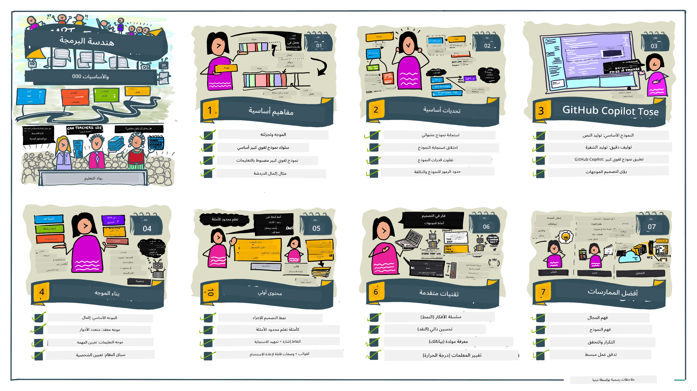
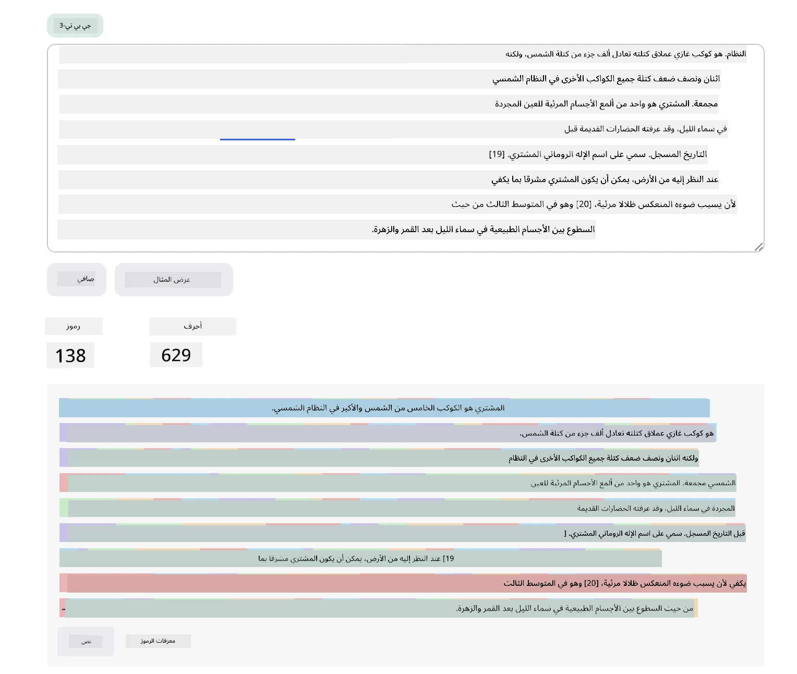
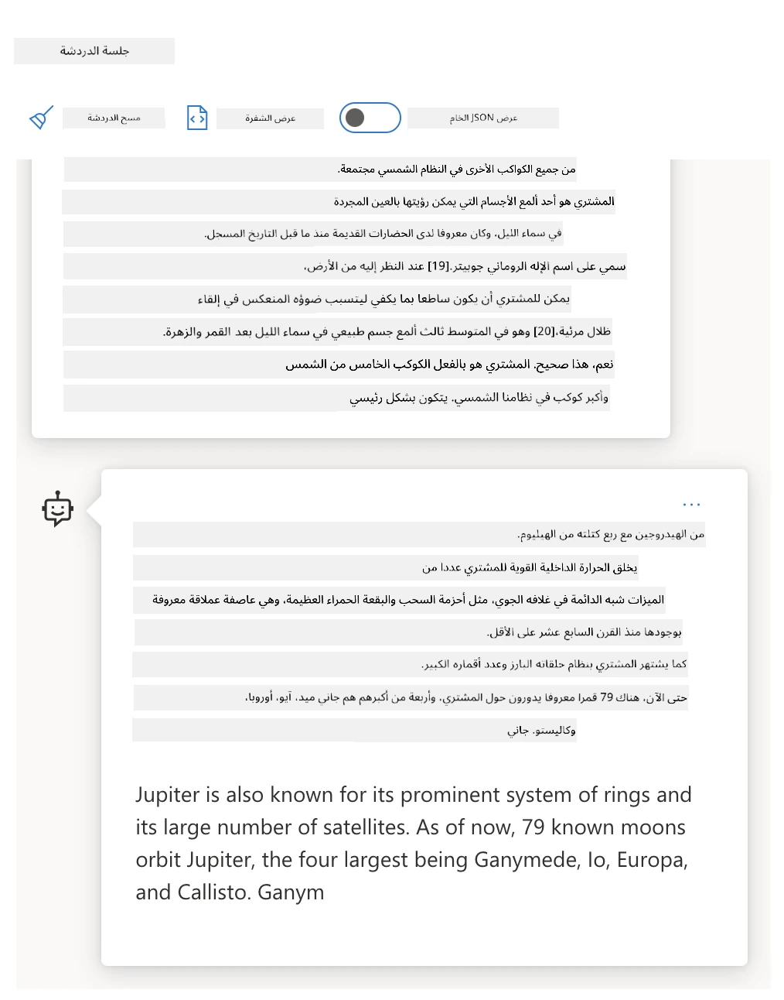
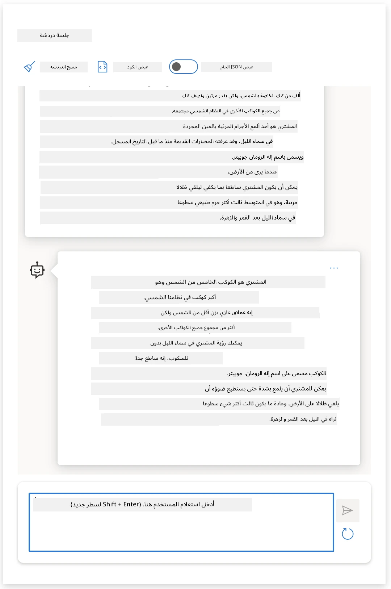
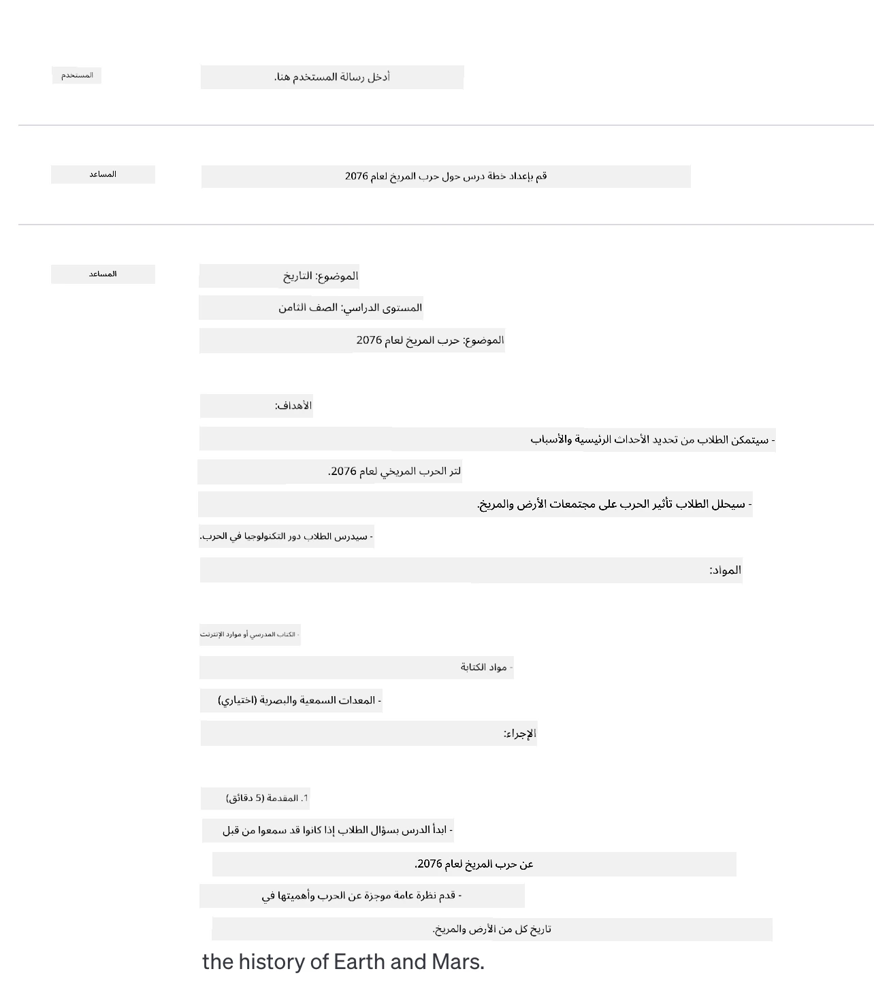
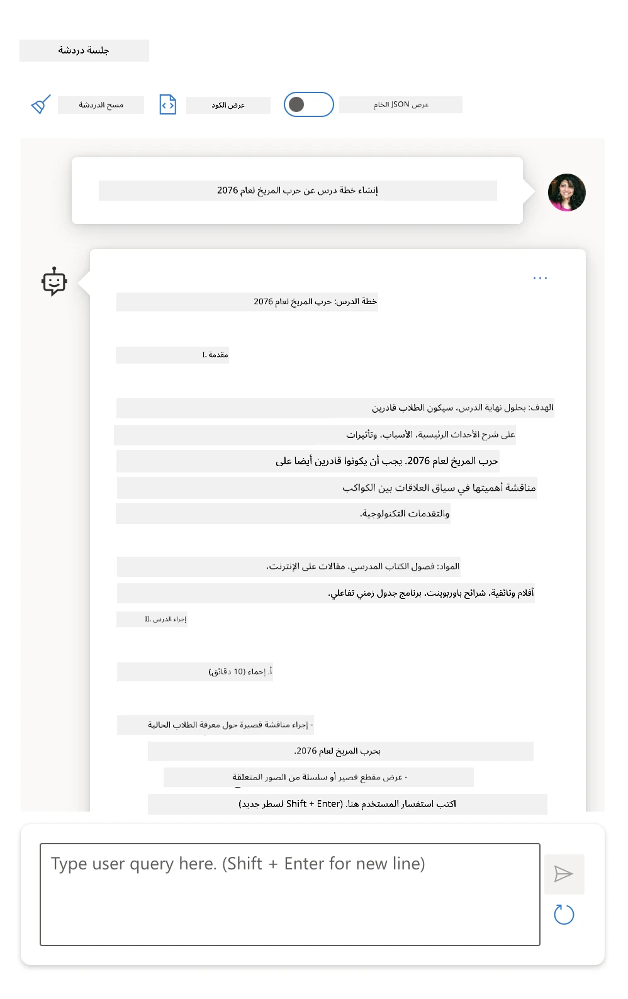

# أساسيات هندسة التوجيه

[](https://youtu.be/GElCu2kUlRs?si=qrXsBvXnCW12epb8)

## مقدمة
يغطي هذا الوحدة مفاهيم وتقنيات أساسية لإنشاء توجيهات فعالة في نماذج الذكاء الاصطناعي التوليدية. طريقة كتابة التوجيه الخاص بك ل‍ LLM مهمة أيضًا. يمكن لتوجيه مصمم بعناية أن يحقق جودة أفضل في الاستجابة. ولكن ماذا تعني بالضبط مصطلحات مثل _التوجيه_ و _هندسة التوجيه_؟ وكيف يمكنني تحسين _المدخلات_ التي أرسلها إلى LLM؟ هذه هي الأسئلة التي سنحاول الإجابة عليها في هذا الفصل والفصل التالي.

_الذكاء الاصطناعي التوليدي_ قادر على إنشاء محتوى جديد (مثل النصوص، الصور، الصوت، الكود، إلخ) استجابة لطلبات المستخدم. يحقق ذلك باستخدام _نماذج اللغة الكبيرة_ مثل سلسلة GPT الخاصة بـ OpenAI ("محول مُدرّب مسبقًا للتوليد") التي تم تدريبها على استخدام اللغة الطبيعية والكود.

يمكن للمستخدمين الآن التفاعل مع هذه النماذج باستخدام نماذج مألوفة مثل المحادثة، دون الحاجة إلى أية خبرة تقنية أو تدريب. النماذج _تعتمد على التوجيه_ - يرسل المستخدم مدخلاً نصيًا (التوجيه) ويحصل على استجابة الذكاء الاصطناعي (الإكمال). يمكنهم بعدها "التحدث مع الذكاء الاصطناعي" بشكل تكراري، في محادثات ذات عدة جولات، مع تحسين توجيههم حتى تتطابق الاستجابة مع توقعاتهم.

أصبح "التوجيه" الآن هو واجهة _البرمجة الأساسية_ لتطبيقات الذكاء الاصطناعي التوليدي، حيث تخبر النماذج بما يجب القيام به وتؤثر على جودة الاستجابات المرجعة. تُعتبر "هندسة التوجيه" مجالًا سريع النمو يركز على _تصميم وتحسين_ التوجيهات لتقديم استجابات متسقة وعالية الجودة على نطاق واسع.

## أهداف التعلم

في هذا الدرس، نتعلم ما هي هندسة التوجيه، ولماذا هي مهمة، وكيف يمكننا صياغة توجيهات أكثر فعالية لنموذج وهدف تطبيق معين. سنفهم المفاهيم الأساسية وأفضل الممارسات لهندسة التوجيه - ونتعرف على بيئة تفاعلية من دفاتر جوبتر "صندوق اختبار" حيث يمكننا رؤية هذه المفاهيم مطبقة على أمثلة حقيقية.

بحلول نهاية هذا الدرس سنكون قادرين على:

1. شرح ما هي هندسة التوجيه ولماذا هي مهمة.
2. وصف مكونات التوجيه وكيفية استخدامها.
3. تعلم أفضل الممارسات والتقنيات لهندسة التوجيه.
4. تطبيق التقنيات المتعلمة على أمثلة حقيقية، باستخدام نقطة نهاية OpenAI.

## المصطلحات الأساسية

هندسة التوجيه: ممارسة تصميم وتحسين المدخلات لتوجيه نماذج الذكاء الاصطناعي نحو إنتاج المخرجات المطلوبة.  
التقطيع (Tokenization): عملية تحويل النص إلى وحدات أصغر تُسمى توكنات، يمكن للنموذج فهمها ومعالجتها.  
نماذج اللغة الكبيرة المزودة بالتعليمات: نماذج كبيرة تم ضبطها بدقة باستخدام تعليمات محددة لتحسين دقة وملاءمة الاستجابة.

## صندوق اختبار التعلم

هندسة التوجيه حاليًا هي فن أكثر منها علم. أفضل طريقة لتحسين حدسنا فيها هي _الممارسة أكثر_ واتباع نهج التجربة والخطأ الذي يجمع بين خبرة مجال التطبيق مع التقنيات الموصى بها والتحسينات الخاصة بالنموذج.

يوفر دفتر جوبتر المرافق لهذا الدرس بيئة _صندوق اختبار_ حيث يمكنك تجربة ما تعلمته - أثناء التقدم في الدرس أو كجزء من تحدي الشيفرة في النهاية. لتنفيذ التمارين، ستحتاج إلى:

1. **مفتاح API لـ Azure OpenAI** - نقطة نهاية الخدمة لنموذج LLM منشور.  
2. **بيئة تشغيل بايثون** - حيث يمكن تنفيذ دفتر الملاحظات.  
3. **متغيرات بيئية محلية** - _أكمل خطوات [الإعداد](./../00-course-setup/02-setup-local.md?WT.mc_id=academic-105485-koreyst) الآن للإستعداد_.

يأتي الدفتر مع تمارين _مبدئية_ - لكن يتم تشجيعك على إضافة أقسام _وصفية (Markdown)_ و _شيفرة (Code)_ خاصة بك لتجربة المزيد من الأمثلة أو الأفكار - وبناء حدسك لتصميم التوجيه.

## دليل مصور

هل تريد الحصول على الصورة الكبيرة لما يغطيه هذا الدرس قبل الغوص؟ اطلع على هذا الدليل المصور، الذي يمنحك إحساسًا بالمواضيع الرئيسية المغطاة والنقاط الرئيسية التي يجب التفكير فيها في كل منها. تأخذك خارطة الدرس من فهم المفاهيم الأساسية والتحديات إلى معالجتها بتقنيات أفضل هندسة التوجيه والممارسات الفضلى ذات الصلة. لاحظ أن قسم "التقنيات المتقدمة" في هذا الدليل يشير إلى محتوى يُغطى في الفصل _التالي_ من هذه المنهجية.



## مشروعنا الناشئ

الآن، دعونا نتحدث عن كيف يرتبط _هذا الموضوع_ بمهمة شركتنا الناشئة في [جلب الابتكار في الذكاء الاصطناعي إلى التعليم](https://educationblog.microsoft.com/2023/06/collaborating-to-bring-ai-innovation-to-education?WT.mc_id=academic-105485-koreyst). نريد بناء تطبيقات مدعومة بالذكاء الاصطناعي للتعلم _المخصص_ - فلنفكر كيف يمكن لمستخدمي تطبيقنا المختلفين أن "يصمموا" التوجيهات:

- **الإداريون** قد يطلبون من الذكاء الاصطناعي _تحليل بيانات المناهج لتحديد الثغرات في التغطية_. يمكن للذكاء الاصطناعي تلخيص النتائج أو تصورها بالكود.  
- **المعلمون** قد يطلبون من الذكاء الاصطناعي _إنشاء خطة درس لجمهور وموضوع هدف_. يمكن للذكاء الاصطناعي بناء الخطة الشخصية بالتنسيق المحدد.  
- **الطلاب** قد يطلبون من الذكاء الاصطناعي _تدريبهم في مادة صعبة_. يمكن للذكاء الاصطناعي أن يوجه الطلاب الآن من خلال دروس وتلميحات وأمثلة مخصصة لمستواهم.

وهذا مجرد غيض من فيض. اطلع على [Prompts For Education](https://github.com/microsoft/prompts-for-edu/tree/main?WT.mc_id=academic-105485-koreyst) - مكتبة مفتوحة المصدر من التوجيهات منسقة على يد خبراء التعليم - لتتعرف على نطاق أوسع من الإمكانيات! _جرّب تشغيل بعض تلك التوجيهات في صندوق الاختبار أو باستخدام OpenAI Playground لترى ماذا يحدث!_

<!--
قالب الدرس:
يجب أن تغطي هذه الوحدة المفهوم الأساسي #1.
تعزز المفهوم بالأمثلة والمراجع.

المفهوم #1:
هندسة التوجيه.
عرفه واشرح لماذا هو مطلوب.
-->

## ما هي هندسة التوجيه؟

بدأنا هذا الدرس بتعريف **هندسة التوجيه** على أنها عملية _تصميم وتحسين_ مدخلات النص (التوجيهات) لتوفير استجابات متسقة وعالية الجودة (الإكمالات) لهدف وتطبيق معين ونموذج معين. يمكننا التفكير في هذا كعملية من خطوتين:

- _تصميم_ التوجيه الأولي لنموذج وهدف معين  
- _تحسين_ التوجيه بشكل تكراري لتحسين جودة الاستجابة

هذه عملية بالضرورة قائمة على التجربة والخطأ تتطلب حدس المستخدم وجهده للحصول على نتائج مثالية. فلماذا هي مهمة؟ للإجابة على هذا السؤال، نحتاج أولًا لفهم ثلاثة مفاهيم:

- _التقطيع_ = كيف "يرى" النموذج التوجيه  
- _نماذج اللغة الأساسية_ = كيف "يعالج" النموذج الأساسي التوجيه  
- _نماذج اللغة المزودة بالتعليمات_ = كيف يمكن للنموذج الآن أن يرى "المهام"

### التقطيع

يرى LLM التوجيهات كسلسلة من _التوكنات_ حيث يمكن لنماذج مختلفة (أو إصدارات لنموذج واحد) تقطيع نفس التوجيه بطرق مختلفة. بما أن نماذج اللغة الكبيرة مدربة على التوكنات (وليس النص الخام)، فإن طريقة تقطيع التوجيه تؤثر مباشرة على جودة الاستجابة الناتجة.

للحصول على حدس كيف يعمل التقطيع، جرّب أدوات مثل [OpenAI Tokenizer](https://platform.openai.com/tokenizer?WT.mc_id=academic-105485-koreyst) الموضحة أدناه. انسخ توجيهك - وانظر كيف يُحول إلى توكنات، مع الانتباه إلى كيفية تعامل الحروف البيضاء وعلامات الترقيم. لاحظ أن هذا المثال يعرض نموذج LLM أقدم (GPT-3) - لذا قد تنتج تجربة هذا مع نموذج أحدث نتائج مختلفة.



### مفهوم: النماذج الأساسية

بعد تقطيع التوجيه، الوظيفة الأساسية لـ ["نموذج اللغة الأساسي"](https://blog.gopenai.com/an-introduction-to-base-and-instruction-tuned-large-language-models-8de102c785a6?WT.mc_id=academic-105485-koreyst) هي التنبؤ بالتوكن التالي في تلك السلسلة. بما أن نماذج اللغة الكبيرة مدربة على مجموعات نصية ضخمة، فهي تفهم العلاقات الإحصائية بين التوكنات ويمكنها التنبؤ بثقة إلى حد ما. لاحظ أنها لا تفهم _معنى_ الكلمات في التوجيه أو التوكن؛ إنما تراها كنمط يمكنها "إكماله" بالتنبؤ التالي. يمكنها الاستمرار في التنبؤ بالسلسلة حتى يتم وقفها بتدخل المستخدم أو بموجب شرط مُحدد مسبقًا.

هل تريد رؤية كيف يعمل الإكمال المعتمد على التوجيه؟ أدخل التوجيه أعلاه في Azure OpenAI Studio [_Chat Playground_](https://oai.azure.com/playground?WT.mc_id=academic-105485-koreyst) مع الإعدادات الافتراضية. تم تكوين النظام للتعامل مع التوجيهات كطلبات معلومات - لذا يجب أن ترى إكمالًا يرضي هذا السياق.

لكن ماذا لو أراد المستخدم رؤية شيء محدد يفي بمعيار أو هدف معين؟ هنا تظهر نماذج اللغة المزودة بالتعليمات في الصورة.



### مفهوم: نماذج اللغة المزودة بالتعليمات

يبدأ [نموذج اللغة المزود بالتعليمات](https://blog.gopenai.com/an-introduction-to-base-and-instruction-tuned-large-language-models-8de102c785a6?WT.mc_id=academic-105485-koreyst) بنموذج أساسي ثم يتم ضبطه بدقة باستخدام أمثلة أو أزواج مدخلات/مخرجات (مثل "رسائل" متعددة الجولات) التي قد تتضمن تعليمات واضحة - ويحاول الذكاء الاصطناعي الاستجابة لمتابعة تلك التعليمات.

يستخدم هذا تقنيات مثل التدريب المعزز مع التغذية الراجعة البشرية (RLHF) التي يمكن أن تُدرّب النموذج على _اتباع التعليمات_ و_التعلم من التغذية الراجعة_ ليُنتج استجابات أكثر ملاءمة للتطبيقات العملية وأكثر ارتباطًا بأهداف المستخدم.

لنجرب - أعد النظر في التوجيه أعلاه، لكن غير الآن _رسالة النظام_ لتزود التعليمات التالية كسياق:

> _لخص المحتوى المقدم لك لطلاب الصف الثاني الابتدائي. احتفظ بالنتيجة في فقرة واحدة مع 3-5 نقاط رئيسية._

هل ترى كيف أصبح الناتج معدّلًا ليعكس الهدف والشكل المرغوب؟ يمكن للمعلم الآن استخدام هذه الاستجابة مباشرة في شرائح الدرس.



## لماذا نحتاج إلى هندسة التوجيه؟

الآن بعد أن فهمنا كيف تعالج نماذج اللغة التوجيهات، لنتحدث عن _لماذا_ نحتاج إلى هندسة التوجيه. يكمن الجواب في حقيقة أن نماذج اللغة الحالية تواجه عددًا من التحديات التي تجعل _الإكمالات الموثوقة والمتسقة_ أكثر صعوبة لتحقيقها دون بذل جهد في بناء التوجيه وتحسينه. على سبيل المثال:

1. **استجابات النماذج عشوائية.** نفس التوجيه _من المرجح_ أن ينتج استجابات مختلفة مع نماذج أو إصدارات مختلفة. وقد ينتج حتى نتائج مختلفة مع _نفس النموذج_ في أوقات مختلفة. _تقنيات هندسة التوجيه تساعدنا في تقليل هذه التباينات من خلال توفير حواجز أمان أفضل_.

1. **النماذج قد تختلق استجابات.** تدرّب النماذج على مجموعات بيانات _كبيرة لكنها محدودة_، مما يعني أنها تفتقر إلى المعرفة حول مفاهيم خارج نطاق التدريب. نتيجة لذلك، يمكنها إنتاج إكمالات غير دقيقة، أو خيالية، أو تتناقض مباشرةً مع الحقائق المعروفة. _تقنيات هندسة التوجيه تساعد المستخدمين على تحديد وتخفيف هذه الاختلاقات مثل طلب الاستشهادات أو التفكير المنطقي من الذكاء الاصطناعي_.

1. **تختلف قدرات النماذج.** النماذج أو الأجيال الأحدث تجلب قدرات أغنى لكنها تأتي أيضًا بمميزات فريدة وتحديات فيما يتعلق بالتكلفة والتعقيد. _يمكن لهندسة التوجيه مساعدتنا في تطوير ممارسات أفضل وسير عمل تجريدي يعزل الفروق ويتكيف مع متطلبات النموذج الخاصة بشكل مرن وقابل للتوسع_.

لنرى هذا عمليًا في OpenAI أو Azure OpenAI Playground:

- استخدم نفس التوجيه مع نشرات مختلفة للنموذج (مثل OpenAI و Azure OpenAI و Hugging Face) - هل لاحظت التباينات؟  
- استخدم نفس التوجيه مرارًا مع نفس نشر النموذج (مثل Azure OpenAI playground) - كيف اختلفت هذه التباينات؟

### مثال على الاختلاقات

في هذا المقرر، نستخدم مصطلح **"الاختلاق"** للإشارة إلى ظاهرة حيث تولد نماذج اللغة أحيانًا معلومات غير صحيحة حقائقياً بسبب محدوديات في التدريب أو قيود أخرى. قد تكون سمعت هذا يُشار إليه كمصطلح _"هلوسات"_ في مقالات أو أبحاث شعبية. مع ذلك، نوصي بشدة باستخدام مصطلح _"الاختلاق"_ كي لا نعطي سلوكًا ميكانيكيًا صفة إنسانية عن طريق الخطأ. هذا يعزز أيضًا [إرشادات الذكاء الاصطناعي المسؤول](https://www.microsoft.com/ai/responsible-ai?WT.mc_id=academic-105485-koreyst) من منظور المصطلحات، مع إزالة المصطلحات التي قد تُعتبر مسيئة أو غير شاملة في بعض السياقات.

هل تريد فهم كيف تعمل الاختلاقات؟ فكر في توجيه يطلب من الذكاء الاصطناعي إنشاء محتوى حول موضوع غير موجود (لضمان عدم وجوده في مجموعة التدريب). على سبيل المثال - جربت هذا التوجيه:

> **التوجيه:** أنشئ خطة درس حول حرب المريخ لعام 2076.
أظهر بحث على الويب أن هناك روايات خيالية (مثل مسلسلات تلفزيونية أو كتب) عن الحروب المريخية - لكن ليس في عام 2076. كما يخبرنا الحس السليم أن 2076 هي _في المستقبل_ وبالتالي، لا يمكن ربطها بحدث حقيقي.

فماذا يحدث عندما نقوم بتشغيل هذا الطلب مع مزودي LLM مختلفين؟

> **الرد 1**: OpenAI Playground (GPT-35)



> **الرد 2**: Azure OpenAI Playground (GPT-35)



> **الرد 3**: : Hugging Face Chat Playground (LLama-2)


كما هو متوقع، ينتج كل نموذج (أو إصدار نموذج) ردودًا مختلفة قليلاً بفضل السلوك العشوائي واختلافات قدرات النموذج. على سبيل المثال، يستهدف نموذج واحد جمهور الصف الثامن بينما يفترض الآخر طالبًا في المدرسة الثانوية. ولكن جميع النماذج الثلاثة أنتجت ردودًا يمكن أن تقنع مستخدمًا غير مطلع أن الحدث كان حقيقيًا.

قد تقلل تقنيات هندسة الطلب مثل _الميتابرومبتينغ_ وإعدادات _درجة الحرارة_ من اختلاقات النموذج إلى حد ما. وتدمج _الهياكل_ الجديدة لهندسة الطلب أدوات وتقنيات جديدة بسلاسة في تدفق الطلب، لتخفيف أو تقليل بعض هذه التأثيرات.

## دراسة حالة: GitHub Copilot

لنختم هذا القسم بإعطاء فكرة عن كيفية استخدام هندسة الطلب في الحلول العملية من خلال دراسة حالة واحدة: [GitHub Copilot](https://github.com/features/copilot?WT.mc_id=academic-105485-koreyst).

GitHub Copilot هو "مساعد البرمجة بالذكاء الاصطناعي" الخاص بك - يحول مطالبات النص إلى إكمالات كود ومتكامل في بيئة التطوير الخاصة بك (مثل Visual Studio Code) لتجربة مستخدم سلسة. كما هو موثق في سلسلة المدونات أدناه، كانت النسخة الأولى مبنية على نموذج OpenAI Codex - حيث أدرك المهندسون بسرعة الحاجة إلى ضبط نموذجي وتحسين تقنيات هندسة الطلب لتحسين جودة الكود. في يوليو، [أطلقوا نموذج ذكاء اصطناعي محسّن يتجاوز Codex](https://github.blog/2023-07-28-smarter-more-efficient-coding-github-copilot-goes-beyond-codex-with-improved-ai-model/?WT.mc_id=academic-105485-koreyst) لتقديم اقتراحات أسرع.

اقرأ المنشورات بالترتيب لتتبع رحلة تعلمهم.

- **مايو 2023** | [GitHub Copilot يتحسن في فهم الكود الخاص بك](https://github.blog/2023-05-17-how-github-copilot-is-getting-better-at-understanding-your-code/?WT.mc_id=academic-105485-koreyst)
- **مايو 2023** | [داخل GitHub: العمل مع نماذج اللغة الكبيرة خلف GitHub Copilot](https://github.blog/2023-05-17-inside-github-working-with-the-llms-behind-github-copilot/?WT.mc_id=academic-105485-koreyst)
- **يونيو 2023** | [كيفية كتابة مطالبات أفضل لـ GitHub Copilot](https://github.blog/2023-06-20-how-to-write-better-prompts-for-github-copilot/?WT.mc_id=academic-105485-koreyst)
- **يوليو 2023** | [.. GitHub Copilot يتجاوز Codex بنموذج ذكاء اصطناعي محسّن](https://github.blog/2023-07-28-smarter-more-efficient-coding-github-copilot-goes-beyond-codex-with-improved-ai-model/?WT.mc_id=academic-105485-koreyst)
- **يوليو 2023** | [دليل المطور لهندسة الطلب ونماذج اللغة الكبيرة](https://github.blog/2023-07-17-prompt-engineering-guide-generative-ai-llms/?WT.mc_id=academic-105485-koreyst)
- **سبتمبر 2023** | [كيفية بناء تطبيق مؤسسي لنموذج لغة كبير: دروس من GitHub Copilot](https://github.blog/2023-09-06-how-to-build-an-enterprise-llm-application-lessons-from-github-copilot/?WT.mc_id=academic-105485-koreyst)

يمكنك أيضًا تصفح [مدونة الهندسة](https://github.blog/category/engineering/?WT.mc_id=academic-105485-koreyst) الخاصة بهم لمزيد من المنشورات مثل [هذا](https://github.blog/2023-09-27-how-i-used-github-copilot-chat-to-build-a-reactjs-gallery-prototype/?WT.mc_id=academic-105485-koreyst) الذي يوضح كيف تُطبق هذه النماذج والتقنيات في قيادة التطبيقات العملية.

---

## بناء الطلب

لقد رأينا لماذا هندسة الطلب مهمة - الآن دعونا نفهم كيف يتم _بناء_ الطلبات حتى نتمكن من تقييم تقنيات مختلفة لتصميم طلبات أكثر فعالية.

### الطلب الأساسي

لنبدأ بالطلب الأساسي: مدخل نصي يُرسل للنموذج بدون سياق آخر. إليك مثالًا - عندما نرسل أول كلمات النشيد الوطني الأمريكي إلى OpenAI [Completion API](https://platform.openai.com/docs/api-reference/completions?WT.mc_id=academic-105485-koreyst) فإنه يكمل الاستجابة فورًا بالأسطر التالية، مما يوضح سلوك التنبؤ الأساسي.

| الطلب (المدخل)       | الإتمام (الناتج)                                                                                                                       |
| :----------------- | :----------------------------------------------------------------------------------------------------------------------------------------- |
| Oh say can you see | يبدو أنك تبدأ كلمات "The Star-Spangled Banner"، النشيد الوطني للولايات المتحدة. الكلمات الكاملة هي ... |

### الطلب المعقد

الآن دعنا نضيف سياقًا وتعليمات لهذا الطلب الأساسي. يتيح لنا [Chat Completion API](https://learn.microsoft.com/azure/ai-services/openai/how-to/chatgpt?WT.mc_id=academic-105485-koreyst) بناء طلب معقد كمجموعة من _الرسائل_ مع:

- أزواج مدخلات/مخرجات تعكس مدخلات _المستخدم_ وردود _المساعد_.
- رسالة نظام تحدد سياق سلوك المساعد أو شخصيته.

الطلب الآن يكون في الشكل أدناه، حيث تلتقط _عملية الترميز_ المعلومات ذات الصلة من السياق والمحادثة بشكل فعال. الآن، يمكن أن يكون لتغيير سياق النظام تأثير كبير على جودة الإكمال، مثلما هو الحال مع مدخلات المستخدم المقدمة.

```python
response = openai.chat.completions.create(
    model="gpt-3.5-turbo",
    messages=[
        {"role": "system", "content": "You are a helpful assistant."},
        {"role": "user", "content": "Who won the world series in 2020?"},
        {"role": "assistant", "content": "The Los Angeles Dodgers won the World Series in 2020."},
        {"role": "user", "content": "Where was it played?"}
    ]
)
```

### طلب تعليمات

في الأمثلة أعلاه، كان طلب المستخدم عبارة عن استعلام نصي بسيط يمكن تفسيره كطلب معلومات. مع طلبات _التعليمات_، يمكننا استخدام ذلك النص لتحديد مهمة بمزيد من التفاصيل، وتوفير إرشادات أفضل للذكاء الاصطناعي. إليك مثال:

| الطلب (المدخل)                                                                                                                                                                                                                         | الإكمال (الناتج)                                                                                                        | نوع التعليمات      |
| :------------------------------------------------------------------------------------------------------------------------------------------------------------------------------------------------------------------------------------- | :------------------------------------------------------------------------------------------------------------------------- | :------------------ |
| Write a description of the Civil War                                                                                                                                                                                                   | _أرجع فقرة بسيطة_                                                                                              | بسيط              |
| Write a description of the Civil War. Provide key dates and events and describe their significance                                                                                                                                     | _أرجع فقرة تليها قائمة بمواعيد الأحداث الرئيسية مع أوصاف_                                             | معقد             |
| Write a description of the Civil War in 1 paragraph. Provide 3 bullet points with key dates and their significance. Provide 3 more bullet points with key historical figures and their contributions. Return the output as a JSON file | _يرجع تفاصيل أكثر موسعة في مربع نص، منسقة كملف JSON يمكنك نسخه ولصقه للتحقق حسب الحاجة_ | معقد. منسق. |

## المحتوى الأساسي

في الأمثلة أعلاه، كان الطلب لا يزال مفتوحًا إلى حد ما، مما يسمح لنموذج اللغة الكبيرة بتحديد أي جزء من بياناته المدربة مسبقًا ذات صلة. مع نمط تصميم _المحتوى الأساسي_، يقسم النص المدخل إلى جزأين:

- تعليمات (إجراء)
- المحتوى ذي الصلة (الذي يؤثر على الإجراء)

إليك مثالًا حيث التعليمات هي "لخص هذا في جملتين".

| الطلب (المدخل)                                                                                                                                                                                                                                                                                                                                                                                                                                                                                                                                                                                                                                                                                      | الإكمال (الناتج)                                                                                                                                                                                                                                                                             |
| :-------------------------------------------------------------------------------------------------------------------------------------------------------------------------------------------------------------------------------------------------------------------------------------------------------------------------------------------------------------------------------------------------------------------------------------------------------------------------------------------------------------------------------------------------------------------------------------------------------------------------------------------------------------------------------------------------- | :---------------------------------------------------------------------------------------------------------------------------------------------------------------------------------------------------------------------------------------------------------------------------------------------- |
| Jupiter is the fifth planet from the Sun and the largest in the Solar System. It is a gas giant with a mass one-thousandth that of the Sun, but two-and-a-half times that of all the other planets in the Solar System combined. Jupiter is one of the brightest objects visible to the naked eye in the night sky, and has been known to ancient civilizations since before recorded history. It is named after the Roman god Jupiter.[19] When viewed from Earth, Jupiter can be bright enough for its reflected light to cast visible shadows,[20] and is on average the third-brightest natural object in the night sky after the Moon and Venus. <br/> **Summarize this in 2 short sentences** | كوكب المشتري، الكوكب الخامس من الشمس، هو الأكبر في النظام الشمسي ومعروف بكونه من ألمع الأجسام في السماء ليلاً. سُمي على اسم الإله الروماني المشتري، وهو عملاق غازي كتلته تعادل مرتين ونصف مجموع كتل الكواكب الأخرى في النظام الشمسي. |

يمكن استخدام جزء المحتوى الأساسي بطرق مختلفة لتوجيه تعليمات أكثر فاعلية:

- **الأمثلة** - بدلاً من إخبار النموذج بما يجب فعله بتعليمات صريحة، قدم له أمثلة لما يجب فعله ودعه يستنتج النمط.
- **الإشارات** - اتبع التعليمات بـ "إشارة" تمهد لاستكمال الطلب، توجه النموذج نحو ردود أكثر صلة.
- **القوالب** - هذه وصفات قابلة للتكرار للطلبات مع أماكن (متغيرات) يمكن تخصيصها بالبيانات لحالات استخدام محددة.

دعنا نستكشف هذه في التطبيق.

### استخدام الأمثلة

هذه طريقة حيث تستخدم المحتوى الأساسي "لتغذية النموذج" ببعض الأمثلة على المخرجات المرغوبة لتعليمات معينة، وتدعوه يستنتج النمط للمخرجات المطلوبة. بناءً على عدد الأمثلة المقدمة، يمكننا أن نحصل على مطالبات بدون أمثلة، أو بمثال واحد، أو بعدة أمثلة.

الطلب الآن يتضمن ثلاث مكونات:

- وصف المهمة
- بعض الأمثلة على المخرجات المرغوبة
- بداية مثال جديد (يصبح وصفًا ضمنيًا للمهمة)

| نوع التعلم | الطلب (المدخل)                                                                                                                                        | الإكمال (الناتج)         |
| :------------ | :---------------------------------------------------------------------------------------------------------------------------------------------------- | :-------------------------- |
| بدون أمثلة    | "The Sun is Shining". Translate to Spanish                                                                                                            | "El Sol está brillando".    |
| بمثال واحد      | "The Sun is Shining" => ""El Sol está brillando". <br> "It's a Cold and Windy Day" =>                                                                 | "Es un día frío y ventoso". |
| بعدة أمثلة      | The player ran the bases => Baseball <br/> The player hit an ace => Tennis <br/> The player hit a six => Cricket <br/> The player made a slam-dunk => | Basketball                  |
|               |                                                                                                                                                       |                             |

لاحظ كيف كان علينا تقديم تعليمات صريحة ("Translate to Spanish") في التوجيه بدون أمثلة، لكنها تُستنتج في مثال التوجيه بمثال واحد. يُظهر المثال بعدة أمثلة كيف يسمح إضافة المزيد من الأمثلة للنماذج باستخلاص استنتاجات أكثر دقة دون تعليمات مضافة.

### إشارات الطلب

تقنية أخرى لاستخدام المحتوى الأساسي هي توفير _إشارات_ بدلاً من الأمثلة. في هذه الحالة، نعطي النموذج دفعة في الاتجاه الصحيح عن طريق _بدءه_ بمقتطف يعكس تنسيق الاستجابة المرغوب. ثم يأخذ النموذج "الإشارة" للاستمرار على هذا النحو.

| عدد الإشارات | الطلب (المدخل)                                                                                                                                                                                                                                                                                                                                                                                                                                               | الإكمال (الناتج)                                                                                                                                                                                                                                                                                       |
| :------------- | :----------------------------------------------------------------------------------------------------------------------------------------------------------------------------------------------------------------------------------------------------------------------------------------------------------------------------------------------------------------------------------------------------------------------------------------------------------- | :-------------------------------------------------------------------------------------------------------------------------------------------------------------------------------------------------------------------------------------------------------------------------------------------------------- |
| 0              | Jupiter is the fifth planet from the Sun and the largest in the Solar System. It is a gas giant with a mass one-thousandth that of the Sun, but two-and-a-half times that of all the other planets in the Solar System combined. Jupiter is one of the brightest objects visible to the naked eye in the night sky, and has been known to ancient civilizations since before recorded history. <br/>**Summarize This**                                       | كوكب المشتري هو أكبر كواكب نظامنا الشمسي والخامس من حيث قربه من الشمس. إنه عملاق غازي كتلته تعادل 1/1000 من كتلة الشمس، لكنه أثقل من مجموع كتل كل الكواكب الأخرى مجتمعة. كان معروفًا لدى الحضارات القديمة، ويمكن رؤيته بسهولة في السماء ليلاً. |
| 1              | المشتري هو الكوكب الخامس من الشمس والأكبر في النظام الشمسي. إنه عملاق غازي كتلته تعادل ثلث ألف كتلة الشمس، ولكنه يزيد بمرتين ونصف عن مجموع كتلة كل الكواكب الأخرى في النظام الشمسي مجتمعة. المشتري هو واحد من ألمع الأجسام التي يمكن رؤيتها بالعين المجردة في السماء ليلاً، وقد عرفت الحضارات القديمة به منذ قبل التاريخ المسجل. <br/>**لخص هذا** <br/> ما تعلمناه هو أن المشتري | هو الكوكب الخامس من الشمس والأكبر في النظام الشمسي. إنه عملاق غازي كتلته تعادل ثلث ألف كتلة الشمس، ولكنه يزيد بمرتين ونصف عن مجموع كتلة كل الكواكب الأخرى مجتمعة. يمكن رؤيته بسهولة بالعين المجردة وقد عُرف منذ العصور القديمة.                        |
| 2              | المشتري هو الكوكب الخامس من الشمس والأكبر في النظام الشمسي. إنه عملاق غازي كتلته تعادل ثلث ألف كتلة الشمس، ولكنه يزيد بمرتين ونصف عن مجموع كتلة كل الكواكب الأخرى في النظام الشمسي مجتمعة. المشتري هو واحد من ألمع الأجسام التي يمكن رؤيتها بالعين المجردة في السماء ليلاً، وقد عرفت الحضارات القديمة به منذ قبل التاريخ المسجل. <br/>**لخص هذا** <br/> أهم 3 حقائق تعلمناها:         | 1. المشتري هو الكوكب الخامس من الشمس والأكبر في النظام الشمسي. <br/> 2. إنه عملاق غازي كتلته تعادل ثلث ألف كتلة الشمس...<br/> 3. المشتري كان مرئياً بالعين المجردة منذ العصور القديمة ...                                                                       |
|                |                                                                                                                                                                                                                                                                                                                                                                                                                                                              |                                                                                                                                                                                                                                                                                                           |

### قوالب المطالبات

قالب المطالبة هو _وصفة معرفة مسبقًا للمطالبة_ يمكن تخزينها وإعادة استخدامها حسب الحاجة، لتعزيز تجارب المستخدم المتسقة على نطاق واسع. في أبسط أشكاله، هو مجموعة من أمثلة المطالبات مثل [هذا المثال من OpenAI](https://platform.openai.com/examples?WT.mc_id=academic-105485-koreyst) التي توفر مكونات المطالبة التفاعلية (رسائل المستخدم والنظام) بالإضافة إلى صيغة الطلب المدعومة بواسطة API - لدعم إعادة الاستخدام.

في شكله الأكثر تعقيدًا مثل [هذا المثال من LangChain](https://python.langchain.com/docs/concepts/prompt_templates/?WT.mc_id=academic-105485-koreyst) يحتوي على _عناصر نائبة_ يمكن استبدالها ببيانات من مصادر متنوعة (إدخال المستخدم، سياق النظام، مصادر بيانات خارجية، إلخ) لإنشاء مطالبة بشكل ديناميكي. وهذا يسمح لنا بإنشاء مكتبة من المطالبات القابلة لإعادة الاستخدام التي يمكن استخدامها لقيادة تجارب مستخدمين متناسقة **برمجيًا** على نطاق واسع.

أخيرًا، تكمن القيمة الحقيقية للقوالب في القدرة على إنشاء ونشر _مكتبات مطالبات_ لتطبيقات رأسية متخصصة - حيث يصبح قالب المطالبة _محسنًا_ ليعكس السياق أو الأمثلة الخاصة بالتطبيق، مما يجعل الردود أكثر صلة ودقة لجمهور المستخدمين المستهدف. مستودع [Prompts For Edu](https://github.com/microsoft/prompts-for-edu?WT.mc_id=academic-105485-koreyst) هو مثال رائع على هذا النهج، حيث يجمع مكتبة من المطالبات لمجال التعليم مع التركيز على الأهداف الرئيسية مثل تخطيط الدروس، تصميم المناهج، التدريس للطلاب، إلخ.

## المحتوى الداعم

إذا اعتبرنا بناء المطالبة يشتمل على تعليمات (مهمة) ومحتوى هدف (المحتوى الأساسي)، فإن _المحتوى الثانوي_ هو سياق إضافي نقدمه لـ **التأثير على المخرجات بطريقة ما**. قد يكون هذا ضبط المعاملات، تعليمات التنسيق، تصنيفات الموضوعات، إلخ، التي تساعد النموذج على _تكييف_ رده ليناسب الأهداف أو التوقعات المرجوة من المستخدم.

على سبيل المثال: بالنظر إلى كتالوج دورات مع بيانات وصفية واسعة (الاسم، الوصف، المستوى، العلامات الوصفية، المدرب، إلخ) لكل الدورات المتوفرة في المنهج الدراسي:

- يمكننا تعريف تعليمات لـ "تلخيص كتالوج دورات خريف 2023"
- يمكننا استخدام المحتوى الأساسي لتوفير بعض الأمثلة على المخرجات المطلوبة
- يمكننا استخدام المحتوى الثانوي لتحديد أهم 5 "علامات" ذات اهتمام.

الآن، يمكن للنموذج توفير ملخص بالتنسيق الموضح في الأمثلة القليلة - ولكن إذا كان النتيجة تحتوي على علامات متعددة، يمكنه إعطاء الأولوية للعلامات الخمسة المحددة في المحتوى الثانوي.

---

<!--
LESSON TEMPLATE:
يجب أن تغطي هذه الوحدة المفهوم الأساسي رقم 1.
عزز المفهوم بأمثلة ومراجع.

المفهوم رقم 3:
تقنيات هندسة المطالبات.
ما هي بعض التقنيات الأساسية لهندسة المطالبات؟
وضّح ذلك ببعض التمارين.
-->

## أفضل الممارسات في إنشاء المطالبات

الآن بعد أن عرفنا كيف يمكن _بناء_ المطالبات، يمكننا البدء بالتفكير في كيفية _تصميم_ هذه المطالبات لتعكس أفضل الممارسات. يمكننا التفكير في ذلك على جزأين - امتلاك _عقلية_ صحيحة وتطبيق _تقنيات_ صحيحة.

### عقلية هندسة المطالبات

هندسة المطالبات عملية تجريبية تعتمد على المحاولة والخطأ، لذا احفظ ثلاثة عوامل إرشادية رئيسية في ذهنك:

1. **فهم المجال مهم.** دقة وملاءمة الرد تعتمد على _المجال_ الذي يعمل فيه المستخدم أو التطبيق. طبق حدسك وخبرتك في المجال لـ **تخصيص التقنيات** أكثر. على سبيل المثال، عرّف _شخصيات محددة للمجال_ في مطالبات النظام لديك، أو استخدم _قوالب خاصة بالمجال_ في مطالبات المستخدم. قدم محتوى ثانوي يعكس سياقات المجال، أو استخدم _إشارات وأمثلة خاصة بالمجال_ لتوجيه النموذج نحو أنماط استخدام مألوفة.

2. **فهم النموذج مهم.** نعلم أن النماذج احتمالية بطبيعتها. لكن تطبيقات النماذج يمكن أن تختلف أيضًا من حيث مجموعة بيانات التدريب المستخدمة (المعرفة المدربة مسبقًا)، والقدرات المقدمة (مثل عبر API أو SDK) ونوع المحتوى الذي يتم تحسينها له (كود مقابل صور مقابل نص). افهم نقاط القوة والقيود للنموذج الذي تستخدمه، واستخدم تلك المعرفة لـ _إعطاء الأولوية للمهام_ أو بناء _قوالب مخصصة_ محسنة لقدرات النموذج.

3. **التكرار والتحقق مهمان.** النماذج تتطور بسرعة، وكذلك تقنيات هندسة المطالبات. بصفتك خبيرًا في المجال، قد يكون لديك سياقات أو معايير خاصة _بتطبيقك_ قد لا تنطبق على المجتمع الأوسع. استخدم أدوات وتقنيات هندسة المطالبات لـ "بدء بناء" المطالبة، ثم كرر وحقق النتائج باستخدام حدسك وخبرتك في المجال. سجل استنتاجاتك وأنشئ **قاعدة معرفة** (مثل مكتبات المطالبات) يمكن للآخرين استخدامها كأساس جديد لمزيد من التكرار السريع مستقبلاً.

## أفضل الممارسات

لنلق نظرة على الممارسات الشائعة التي يوصي بها ممارسو [OpenAI](https://help.openai.com/en/articles/6654000-best-practices-for-prompt-engineering-with-openai-api?WT.mc_id=academic-105485-koreyst) و [Azure OpenAI](https://learn.microsoft.com/azure/ai-services/openai/concepts/prompt-engineering#best-practices?WT.mc_id=academic-105485-koreyst).

| ماذا                              | لماذا                                                                                                                                                                                                                                               |
| :-------------------------------- | :------------------------------------------------------------------------------------------------------------------------------------------------------------------------------------------------------------------------------------------------ |
| تقييم أحدث النماذج.               | من المحتمل أن تحتوي أجيال النماذج الجديدة على ميزات وجودة محسنة - لكنها قد تتطلب أيضًا تكاليف أعلى. قيّمها من حيث الأثر، ثم اتخذ قرارات الترحيل.                                                                                                  |
| فصل التعليمات والسياق             | تحقق مما إذا كان النموذج/المزود لديك يحدد _فواصل_ لتمييز التعليمات، والمحتوى الأساسي والثانوي بوضوح أكثر. يمكن أن يساعد ذلك النماذج على تخصيص الأوزان بدقة أكبر للرموز.                                                                         |
| كن محددًا وواضحًا                | قدم تفاصيل أكثر حول السياق المطلوب، والنتيجة، والطول، والتنسيق، والأسلوب، إلخ. هذا سيُحسن جودة واتساق الردود. سجّل الوصفات في قوالب قابلة لإعادة الاستخدام.                                                                                      |
| كن وصفيًا، واستخدم أمثلة          | قد تستجيب النماذج بشكل أفضل لمنهج "عرض وشرح". ابدأ بطريقة `zero-shot` حيث تعطيها تعليمات (دون أمثلة)، ثم جرب `few-shot` كتحسين مع تقديم بعض الأمثلة على المخرجات المطلوبة. استخدم التشبيهات.                                                     |
| استخدم إشارات لبدء الإكمالات     | حثّ النموذج باتجاه نتيجة مرغوبة بإعطائه بعض الكلمات أو العبارات القيادية يمكن أن يستخدمها كنقطة انطلاق للرد.                                                                                                                                    |
| كرر وتحقق من النتائج             | أحيانًا قد تحتاج إلى تكرار التعليمات للنموذج. قدم التعليمات قبل وبعد المحتوى الأساسي، استخدم تعليمات وإشارات، إلخ. كرر وتحقق لمعرفة ما ينجح.                                                                                                     |
| الترتيب مهم                     | للترتيب الذي تقدم به المعلومات للنموذج تأثير على المخرجات، حتى في أمثلة التعلم، بسبب انحياز الحداثة. جرّب خيارات مختلفة لترى ما يناسبك.                                                                                                         |
| أعطِ للنموذج "خيار خروج"         | اعطِ للنموذج استجابة _احتياطية_ يمكن تقديمها إذا لم يتمكن من إكمال المهمة لأي سبب. هذا يمكن أن يقلل من احتمالية إنتاج نماذج ردود خاطئة أو مختلقة.                                                                                                |
|                                   |                                                                                                                                                                                                                                                   |

كما هو الحال في أي ممارسة جيدة، تذكر أن _نتيجة تجربتك قد تختلف_ بناءً على النموذج والمهمة والمجال. استخدم هذه كنقطة انطلاق، وكرر للعثور على ما يناسبك. أعد تقييم عملية هندسة المطالبات باستمرار مع ظهور نماذج وأدوات جديدة، مع التركيز على قابلية توسعة العملية وجودة الرد.

<!--
LESSON TEMPLATE:
يجب أن توفر هذه الوحدة تحدي برمجي إن أمكن

التحدي:
رابط إلى دفتر Jupyter يحتوي فقط على تعليقات الكود في التعليمات (أجزاء الكود فارغة).

الحل:
رابط إلى نسخة من ذلك الدفتر مع ملء المطالبات وتشغيلها، تبين مثال واحد ممكن.
-->

## المهمة

تهانينا! وصلت إلى نهاية الدرس! حان الوقت لوضع بعض هذه المفاهيم والتقنيات قيد الاختبار بأمثلة حقيقية!

لمهمتنا، سنستخدم دفتر Jupyter مع تمارين يمكنك إكمالها تفاعليًا. يمكنك أيضًا توسيع الدفتر بخلايا Markdown و Code خاصة بك لاستكشاف الأفكار والتقنيات بنفسك.

### للبدء، قم بعمل fork للمستودع، ثم

- (موصى به) تشغيل GitHub Codespaces
- (بديلًا) استنساخ المستودع إلى جهازك المحلي واستخدامه مع Docker Desktop
- (بديلًا) فتح الدفتر باستخدام بيئة تنفيذ دفتر الملاحظات المفضلة لديك.

### بعد ذلك، قم بتكوين متغيرات البيئة الخاصة بك

- انسخ ملف `.env.copy` في جذر المستودع إلى `.env` واملأ قيم `AZURE_OPENAI_API_KEY`، `AZURE_OPENAI_ENDPOINT` و `AZURE_OPENAI_DEPLOYMENT`. عد إلى قسم [Learning Sandbox](../../../04-prompt-engineering-fundamentals) لتعلم كيفية ذلك.

### بعد ذلك، افتح دفتر Jupyter

- اختر نواة التشغيل. إذا كنت تستخدم الخيار 1 أو 2، اختر ببساطة نواة Python 3.10.x الافتراضية التي يوفرها حاوية التطوير.

أنت جاهز لتشغيل التمارين. لاحظ أنه لا توجد إجابات _صحيحة أو خاطئة_ هنا - فقط استكشاف الخيارات بالتجربة وبناء حدس لما يعمل مع نموذج معين ومجال تطبيق.

_لهذا السبب لا توجد أقسام حلول برمجية في هذا الدرس. بدلاً من ذلك، سيحتوي الدفتر على خلايا Markdown بعنوان "حلي:" تعرض مثالاً واحدًا للمخرجات كمرجع._

 <!--
LESSON TEMPLATE:
اختم القسم بملخص وموارد للتعلم الذاتي.
-->

## اختبار المعرفة

أي من التالي يعتبر مطالبة جيدة تتبع بعض أفضل الممارسات المعقولة؟

1. أعطني صورة لسيارة حمراء  
2. أعطني صورة لسيارة حمراء من نوع فولفو وطراز XC90 مركونة بجانب جرف مع غروب الشمس  
3. أعطني صورة لسيارة حمراء من نوع فولفو وطراز XC90  

الجواب: 2، لأنها أفضل مطالبة لأنها تقدم تفاصيل عن "ماذا" وتغوص في التفاصيل (ليست أي سيارة ولكن نوع وطراز محدد) كما أنها تصف الإعداد العام. الرقم 3 هو التالي لأنه يحتوي أيضًا على كثير من الوصف.

## 🚀 التحدي

حاول استخدام تقنية "الإشارة" مع المطالبة: أكمل الجملة "أعطني صورة لسيارة حمراء من نوع فولفو و". ماذا يرد؟ وكيف تحسنها؟

## عمل رائع! واصل التعلم

هل تريد تعلم المزيد عن مفاهيم هندسة المطالبات المختلفة؟ انتقل إلى [صفحة التعلم المستمر](https://aka.ms/genai-collection?WT.mc_id=academic-105485-koreyst) للعثور على موارد رائعة أخرى حول هذا الموضوع.

توجه إلى الدرس 5 حيث سنستعرض [تقنيات المطالبات المتقدمة](../05-advanced-prompts/README.md?WT.mc_id=academic-105485-koreyst)!

---

<!-- CO-OP TRANSLATOR DISCLAIMER START -->
**تنويه**:
تمت ترجمة هذا المستند باستخدام خدمة الترجمة الآلية [Co-op Translator](https://github.com/Azure/co-op-translator). بينما نسعى للدقة، يرجى العلم أن الترجمات الآلية قد تحتوي على أخطاء أو عدم دقة. يجب اعتبار المستند الأصلي بلغته الأصلية المصدر المعتمد. للمعلومات الحرجة، يُنصح بالاعتماد على الترجمة البشرية المحترفة. نحن لسنا مسؤولين عن أي سوء فهم أو تفسير ناتج عن استخدام هذه الترجمة.
<!-- CO-OP TRANSLATOR DISCLAIMER END -->