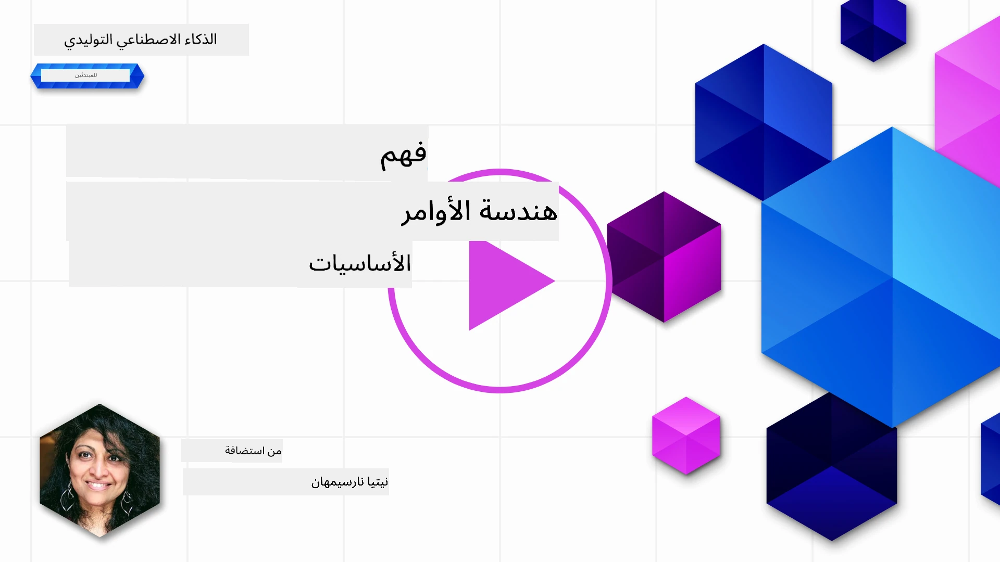
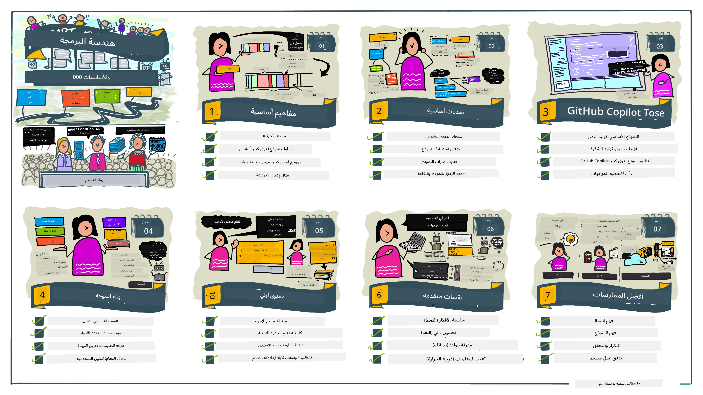
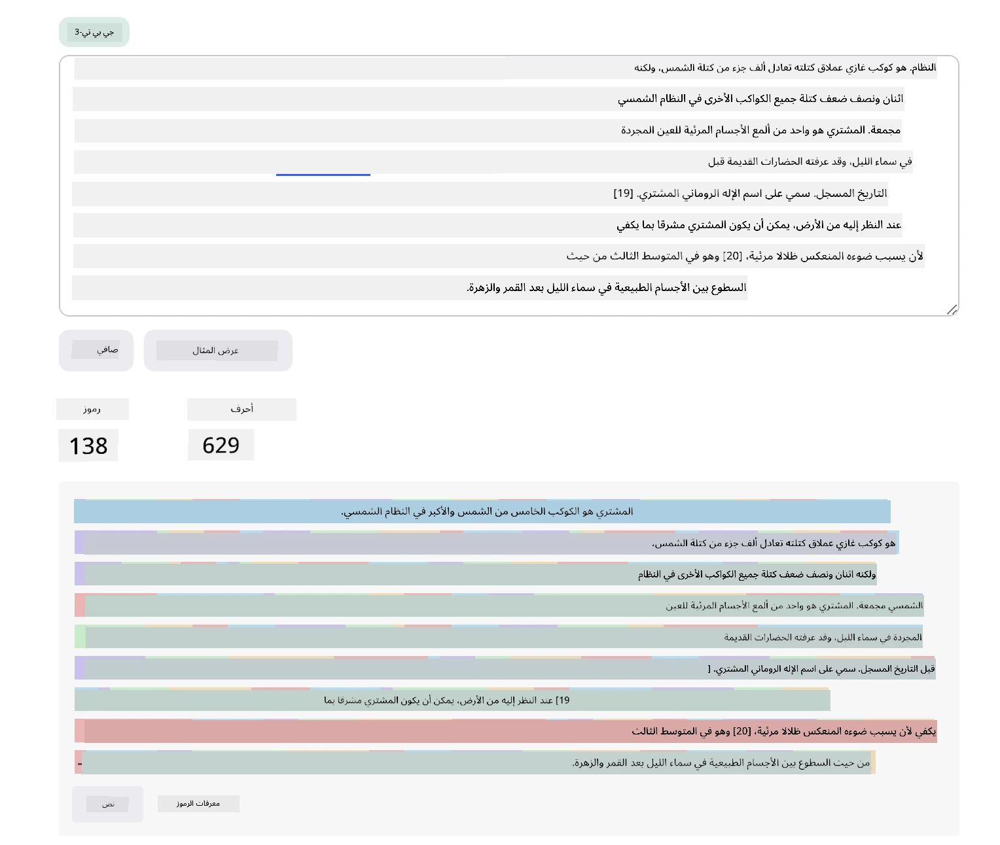
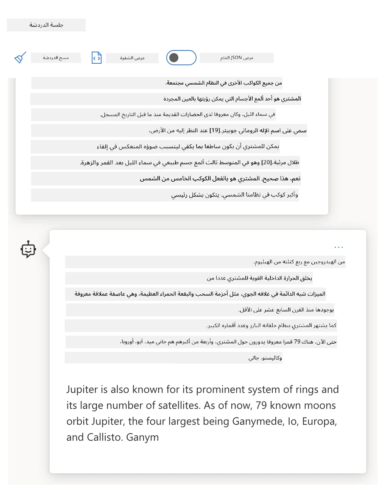
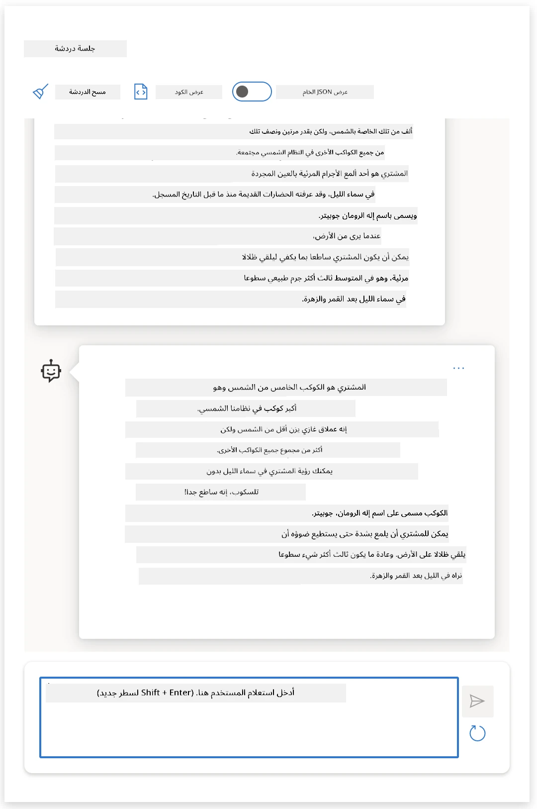
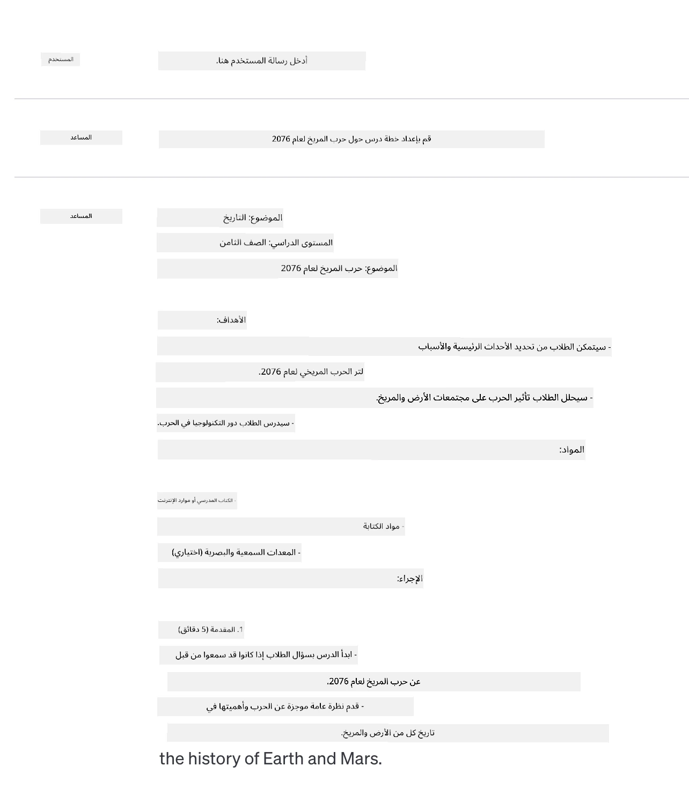
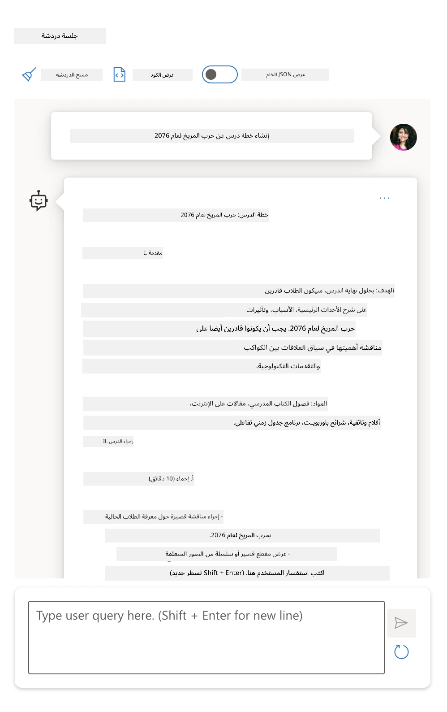
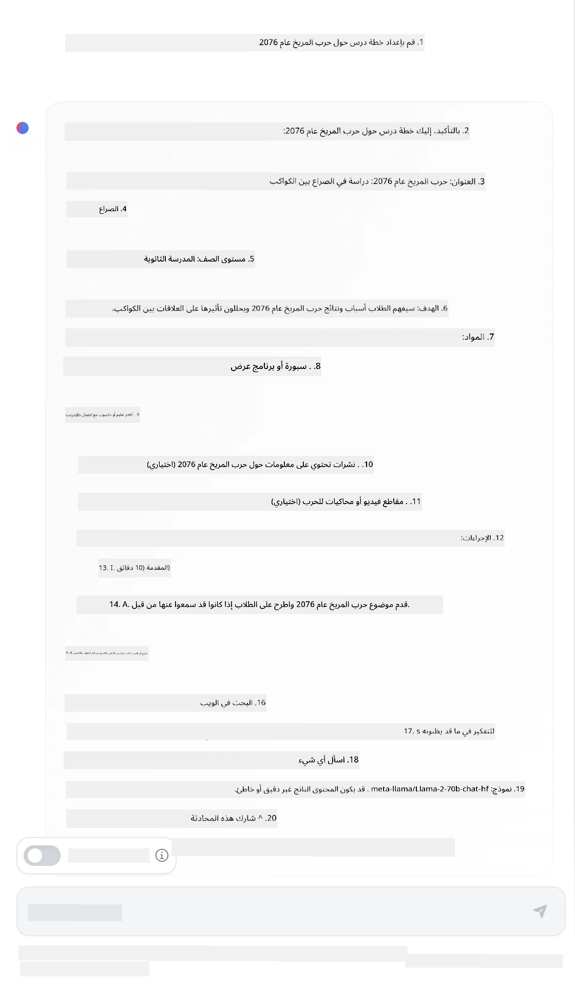

# أساسيات هندسة المطالبات

[](https://youtu.be/GElCu2kUlRs?si=qrXsBvXnCW12epb8)

## المقدمة
يغطي هذا الوحدة مفاهيم وتقنيات أساسية لإنشاء مطالبات فعالة في نماذج الذكاء الاصطناعي التوليدية. الطريقة التي تكتب بها مطالبتك إلى نموذج اللغة الكبير مهمّة أيضاً. فالمطالبة المصممة بعناية يمكن أن تحقق جودة أفضل في الاستجابة. لكن، ما المقصود تماماً بمصطلحات مثل _المطالبة_ و_هندسة المطالبات_؟ وكيف يمكنني تحسين _الإدخال_ الذي أرسله إلى نموذج اللغة الكبير؟ هذه هي الأسئلة التي سنحاول الإجابة عليها في هذا الفصل والفصل التالي.

الذكاء الاصطناعي التوليدي_ قادر على إنشاء محتوى جديد (مثل النصوص، الصور، الصوت، الكود، إلخ) استجابةً لطلبات المستخدم. ويحقق ذلك باستخدام _نماذج اللغة الكبيرة_ مثل سلسلة GPT من OpenAI ("المحول المدرب توليدياً") التي تم تدريبها لاستخدام اللغة الطبيعية والكود.

يمكن للمستخدمين الآن التفاعل مع هذه النماذج باستخدام أنماط مألوفة مثل الدردشة، دون الحاجة إلى أي خبرة تقنية أو تدريب. النماذج _تعتمد على المطالبات_ - حيث يرسل المستخدم نصًا (مطالبة) ويتلقى استجابة الذكاء الاصطناعي (اكتمال). ثم يمكنهم "الدردشة مع الذكاء الاصطناعي" بشكل تكراري، في محادثات متعددة الأدوار، مع تحسين مطالبتهم حتى تتطابق الاستجابة مع توقعاتهم.

تصبح "المطالبات" الآن الواجهة _البرمجية الأساسية_ لتطبيقات الذكاء الاصطناعي التوليدي، إذ تخبر النماذج بما يجب فعله وتؤثر على جودة الردود المُعادة. "هندسة المطالبات" هي مجال دراسة سريع النمو يركز على _تصميم وتحسين_ المطالبات لتقديم استجابات متسقة وعالية الجودة على نطاق واسع.

## أهداف التعلم

في هذا الدرس، سنتعلم ما هي هندسة المطالبات، ولماذا هي مهمة، وكيف يمكننا صياغة مطالبات أكثر فعالية لنموذج معين وهدف تطبيقي محدد. سنفهم المفاهيم الأساسية وأفضل الممارسات لهندسة المطالبات - ونتعرف على بيئة "صندوق رمل" تفاعلية باستخدام دفاتر Jupyter حيث يمكننا رؤية هذه المفاهيم مطبقة على أمثلة حقيقية.

بنهاية هذا الدرس سنكون قادرين على:

1. شرح ما هي هندسة المطالبات ولماذا هي مهمة.
2. وصف مكونات المطالبة وكيفية استخدامها.
3. تعلّم أفضل الممارسات والتقنيات لهندسة المطالبات.
4. تطبيق التقنيات المكتسبة على أمثلة حقيقية باستخدام نقطة نهاية OpenAI.

## المصطلحات الرئيسية

هندسة المطالبات: ممارسة تصميم وتحسين المدخلات لتوجيه نماذج الذكاء الاصطناعي نحو إنتاج المخرجات المرغوبة.  
التقطيع (Tokenization): عملية تحويل النص إلى وحدات أصغر تسمى "توكنات" يمكن للنموذج فهمها ومعالجتها.  
نُظم اللغة الكبيرة المُوجهة بالتعليمات (Instruction-Tuned LLMs): نماذج اللغة الكبيرة التي تم تحسينها باستخدام تعليمات محددة لتحسين دقة واستجابة الردود.

## صندوق التعلم

هندسة المطالبات حالياً أكثر فناً منها علماً. أفضل طريقة لتحسين حدسنا حولها هي _المزيد من التدرب_ وتبني نهج تجريبي يجمع بين خبرة مجال التطبيق والتقنيات الموصى بها وتحسينات خاصة بالنموذج.

يوفر دفتر Jupyter المصاحب لهذا الدرس بيئة _صندوق رمل_ حيث يمكنك تجربة ما تتعلمه - أثناء التقدم أو كجزء من تحدي الكود في النهاية. لتنفيذ التمارين، ستحتاج إلى:

1. **مفتاح API لخدمة Azure OpenAI** - نقطة النهاية لخدمة نموذج لغة كبير منشور.  
2. **بيئة تشغيل بايثون** - يمكن تشغيل الدفتر فيها.  
3. **متغيرات البيئة المحلية** - _أكمل خطوات [الإعداد](./../00-course-setup/02-setup-local.md?WT.mc_id=academic-105485-koreyst) الآن للتحضير_.

يأتي الدفتر مع تمارين _مبدئية_ - لكن يُشجعك على إضافة أقسام _ماركداون_ (وصف) و_كود_ (طلبات مطالبة) خاصة بك لتجربة المزيد من الأمثلة أو الأفكار - ولتطوير حدسك في تصميم المطالبات.

## الدليل المصور

هل ترغب في رؤية الصورة العامة لما يغطيه هذا الدرس قبل أن تبدأ؟ اطلع على هذا الدليل المصور، الذي يعطيك فكرة عن الموضوعات الرئيسية المغطاة والنقاط الأساسية للتفكير فيها في كل منها. تأخذك خارطة طريق الدرس من فهم المفاهيم والتحديات الأساسية إلى معالجتها بتقنيات أفضل لهندسة المطالبات وممارسات متقدمة مرتبطة. لاحظ أن قسم "التقنيات المتقدمة" في هذا الدليل يشير إلى محتوى يُغطى في _الفصل التالي_ من منهجنا.



## شركتنا الناشئة

الآن، دعونا نتحدث عن كيف يرتبط _هذا الموضوع_ بمهمة شركتنا الناشئة لـ [جلب ابتكارات الذكاء الاصطناعي إلى التعليم](https://educationblog.microsoft.com/2023/06/collaborating-to-bring-ai-innovation-to-education?WT.mc_id=academic-105485-koreyst). نرغب في بناء تطبيقات مدعومة بالذكاء الاصطناعي للتعلم _الشخصي_ - فلنفكر كيف قد "يصمم" مستخدمو تطبيقنا مطالباتهم:

- **الإداريون** قد يطلبون من الذكاء الاصطناعي _تحليل بيانات المناهج للكشف عن الثغرات في التغطية_. يمكن للذكاء الاصطناعي تلخيص النتائج أو تصورها باستخدام كود.
- **المربون** قد يطلبون من الذكاء الاصطناعي _إنشاء خطة درس لجمهور وموضوع محددين_. يمكن للذكاء الاصطناعي بناء الخطة الشخصية بالتنسيق المطلوب.
- **الطلاب** قد يطلبون من الذكاء الاصطناعي _مساعدتهم في موضوع صعب_. يمكن للذكاء الاصطناعي توجيه الطلاب من خلال دروس وتلميحات وأمثلة مخصصة لمستواهم.

هذا مجرد غيض من فيض. تصفح [المطالبات من أجل التعليم](https://github.com/microsoft/prompts-for-edu/tree/main?WT.mc_id=academic-105485-koreyst) - مكتبة مفتوحة المصدر من المطالبات من إعداد خبراء التعليم - لكي تحصل على فكرة أوسع عن الإمكانيات! _جرب تشغيل بعض تلك المطالبات في صندوق الرمل أو باستخدام ملعب OpenAI لترى النتائج!_

<!--
LESSON TEMPLATE:
This unit should cover core concept #1.
Reinforce the concept with examples and references.

CONCEPT #1:
Prompt Engineering.
Define it and explain why it is needed.
-->

## ما هي هندسة المطالبات؟

بدأنا هذا الدرس بتعريف **هندسة المطالبات** على أنها عملية _تصميم وتحسين_ مدخلات النص (المطالبات) لتقديم استجابات متسقة وعالية الجودة (اكتمالات) لهدف تطبيقي ونموذج معين. يمكننا التفكير في ذلك كعملية من خطوتين:

- _تصميم_ المطالبة الأولية لنموذج وهدف معين  
- _تحسين_ المطالبة بشكل تكراري لتحسين جودة الاستجابة

هذه العملية بطبيعتها تعتمد على التجربة والخطأ وتتطلب حدس المستخدم وجهده للحصول على نتائج مثلى. فلماذا هي مهمة؟ للإجابة عن ذلك، يجب أولاً أن نفهم ثلاثة مفاهيم:

- _التقطيع (Tokenization)_ = كيف "يرى" النموذج المطالبة  
- _نماذج قاعدة اللغة الكبيرة (Base LLMs)_ = كيف "تعالج" نموذج الأساس المطالبة  
- _نماذج اللغة الكبيرة الموجهة بالتعليمات (Instruction-Tuned LLMs)_ = كيف يرى النموذج الآن "المهام"

### التقطيع (Tokenization)

يرى النموذج الكبير للمسائل المطالبات كسلسلة من التوكنات حيث يمكن للنماذج المختلفة (أو إصدارات النموذج المختلفة) أن تقطع نفس المطالبة بطرق مختلفة. ونظراً لأن النماذج الكبيرة مدربة على التوكنات (وليس النص الخام)، فإن طريقة تقطيع المطالبات تؤثر مباشرة على جودة الاستجابة المولدة.

لتكوين حدس عملي حول كيفية عمل التقطيع، جرّب أدوات مثل [أداة OpenAI للتقطيع](https://platform.openai.com/tokenizer?WT.mc_id=academic-105485-koreyst) الموضحة أدناه. انسخ مطالبتك هناك - وراجع كيف تتحول إلى توكنات، مع الانتباه لكيفية التعامل مع فواصل المسافات وعلامات الترقيم. لاحظ أن هذا المثال يعرض نموذجًا أقدم (GPT-3) - لذا قد يعطي نموذج أحدث نتيجة مختلفة.



### المفهوم: نماذج الأساس

حالما تُقطع المطالبة إلى توكنات، فإن الوظيفة الأساسية لـ ["نموذج اللغة الأساسي"](https://blog.gopenai.com/an-introduction-to-base-and-instruction-tuned-large-language-models-8de102c785a6?WT.mc_id=academic-105485-koreyst) (أو نموذج الأساس) هي التنبؤ بالتوكن التالي في تلك السلسلة. وبما أن النماذج الكبيرة مدربة على مجموعات نصوص ضخمة، فلديها فهم جيد للعلاقات الإحصائية بين التوكنات ويمكنها إجراء التنبؤ بثقة ما. مع ملاحظة أنها لا تفهم _معنى_ الكلمات في المطالبة أو التوكن؛ هي فقط ترى نمطًا يمكنها "إكماله" بالتنبؤ التالي. يمكنها الاستمرار في التنبؤ بالسلسلة حتى يتوقفها المستخدم أو تحقق شرطًا معينًا مسبقاً.

هل تريد أن ترى كيف يعمل الإكمال القائم على المطالبات؟ أدخل المطالبة السابقة في استوديو Azure OpenAI [_Chat Playground_](https://oai.azure.com/playground?WT.mc_id=academic-105485-koreyst) مع الإعدادات الافتراضية. النظام مهيأ للتعامل مع المطالبات كطلبات معلومات - لذلك سترى استجابة تلبي هذا السياق.

لكن ماذا لو أراد المستخدم شيئًا محددًا يحقق بعض المعايير أو أهداف المهمة؟ هنا تأتي نماذج اللغة الكبيرة _الموجهة بالتعليمات_.



### المفهوم: نماذج اللغة الموجهة بالتعليمات

نموذج [اللغة الكبير الموجه بالتعليمات](https://blog.gopenai.com/an-introduction-to-base-and-instruction-tuned-large-language-models-8de102c785a6?WT.mc_id=academic-105485-koreyst) يبدأ من نموذج الأساس ويُحسن بواسطة أمثلة أو أزواج مدخلات/مخرجات (مثل "رسائل" متعددة الأدوار) يمكن أن تحتوي على تعليمات واضحة - ويحاول الرد من الذكاء الاصطناعي اتباع هذه التعليمات.

يستخدم هذا تقنيات مثل التعلم التعزيزي مع تغذية راجعة بشرية (RLHF) التي تُمكن النموذج من _اتباع التعليمات_ و_التعلم من التغذية الراجعة_ بحيث ينتج استجابات أكثر ملاءمة للتطبيقات العملية وأكثر صلة بأهداف المستخدم.

لنجرب ذلك - أعد النظر في المطالبة أعلاه، وغيّر _رسالة النظام_ لتحتوي على التعليمات التالية كالسياق:

> _لخص المحتوى المقدم لك لطالب في الصف الثاني الابتدائي. اجعل الملخص فقرة واحدة مع 3-5 نقاط رئيسية._

هل ترى كيف أصبح النتيجة مضبوطة لتعكس الهدف والتنسيق المرغوب؟ يمكن للمربّي استخدام هذه الاستجابة مباشرة في شرائح العرض لتلك الحصة.



## لماذا نحتاج إلى هندسة المطالبات؟

الآن بعد أن فهمنا كيف تتم معالجة المطالبات بواسطة نماذج اللغة الكبيرة، دعنا نتحدث عن _لماذا_ نحتاج هندسة المطالبات. الجواب يكمن في أن النماذج الحالية تطرح عدة تحديات تجعل _الحصول على اكتمالات موثوقة ومتسقة_ أكثر تعقيدًا دون بذل جهد في بناء وتحسين المطالبات. على سبيل المثال:

1. **استجابات النماذج إحصائية ومتغيرة.** _نفس المطالبة_ قد ينتج عنها ردود مختلفة مع نماذج أو إصدارات نماذج مختلفة. وقد تحصل أيضًا على نتائج مختلفة مع _نفس النموذج_ في أوقات مختلفة. _تقنيات هندسة المطالبات تساعدنا على تقليل هذه التباينات من خلال توفير ضوابط أفضل_.

1. **النماذج قد تختلق ردوداً.** النماذج مدربة على مجموعات بيانات _كبيرة لكنها محدودة_، مما يعني أنها تفتقر إلى المعرفة بشأن مفاهيم خارج نطاق التدريب. ونتيجة لذلك، قد تولد اكتمالات غير دقيقة أو خيالية أو تناقض بشكل مباشر مع الحقيقة المعروفة. _تقنيات الهندسة تساعد المستخدمين على تحديد وتقليل هذا الاختلاق مثلاً بطلب الاستشهادات أو تفسير الأسباب_.

1. **قدرات النماذج تختلف.** النماذج الأحدث أو أجيال النماذج تقدم قدرات أغنى لكنها تجلب أيضاً خصائص فريدة ومقايضات في التكلفة والتعقيد. _هندسة المطالبات تساعدنا على تطوير أفضل الممارسات وسير العمل التي تخفي الفوارق وتتأقلم مع متطلبات كل نموذج بطريقة قابلة للتوسع وسلسة_.

لنفحص ذلك عملياً في ملعب OpenAI أو Azure OpenAI:

- استخدم نفس المطالبة مع عمليات نشر نماذج مختلفة (مثل OpenAI, Azure OpenAI, Hugging Face) - هل لاحظت التباين؟  
- استخدم نفس المطالبة بشكل متكرر مع _نفس_ عملية نشر نموذج (مثل ملعب Azure OpenAI) - كيف اختلفت هذه التباينات؟

### مثال على الاختلاقات

في هذا المقرر، نستخدم مصطلح **"الاختلاق"** للإشارة إلى الظاهرة التي تولد فيها نماذج اللغة الكبيرة أحيانًا معلومات غير صحيحة فعليًا بسبب محدوديات في تدريبها أو قيود أخرى. قد تكون سمعت مصطلح _"الهلوسات"_ في مقالات أو أوراق بحثية شهيرة. مع ذلك، نوصي بشدة باستخدام مصطلح _"الاختلاق"_ حتى لا نُشيّء تصورات بشرية بالخطأ بتوصيف سلوك النموذج بتسمية إنسانية، أي نسب سمة إنسانية لنتيجة تنتج عن آلة. هذا يعزز أيضًا [إرشادات الذكاء الاصطناعي المسؤول](https://www.microsoft.com/ai/responsible-ai?WT.mc_id=academic-105485-koreyst) من الناحية اللفظية، عبر إزالة مصطلحات قد تُعتبر مهينة أو غير شاملة في بعض السياقات.

هل تريد فهم كيف تتجلى الاختلاقات؟ فكر في مطالبة تأمر الذكاء الاصطناعي بإنشاء محتوى لموضوع غير موجود (للتأكد من أن الموضوع غير موجود في مجموعة التدريب). على سبيل المثال - جربت هذه المطالبة:

> **المطالبة:** انشئ خطة درس عن حرب المريخ لعام 2076.
أظهر بحث على الويب وجود حسابات خيالية (مثل المسلسلات التلفزيونية أو الكتب) عن حروب المريخ - لكن لا شيء في عام 2076. كما يخبرنا الحس السليم أن عام 2076 _في المستقبل_، وبالتالي لا يمكن ربطه بحدث حقيقي.

فماذا يحدث عندما نجري هذا الاستعلام على مقدمي نماذج اللغات المختلفة؟

> **الرد 1**: OpenAI Playground (GPT-35)



> **الرد 2**: Azure OpenAI Playground (GPT-35)



> **الرد 3**: : Hugging Face Chat Playground (LLama-2)



كما هو متوقع، ينتج كل نموذج (أو إصدار نموذج) ردودًا مختلفة قليلاً بفضل السلوك العشوائي وتباين قدرات النماذج. على سبيل المثال، يستهدف نموذج واحد جمهور الصف الثامن بينما يفترض الآخر طالبًا في المدرسة الثانوية. ولكن تولدت ردود من النماذج الثلاثة يمكن أن تُقنع مستخدمًا غير مطلع أن الحدث كان حقيقيًا.

تقنيات هندسة الاستعلام مثل _الميتابرومبتنج_ و _تكوين درجة الحرارة_ قد تقلل من تلفيقات النموذج إلى حد ما. كما أن _الهياكل_ الجديدة لهندسةالاستعلام تدمج أدوات وتقنيات جديدة بسلاسة في تدفق الاستعلام، للتخفيف أو الحد من بعض هذه التأثيرات.

## دراسة حالة: GitHub Copilot

لنختم هذا القسم بالتعرف على كيفية استخدام هندسة الاستعلام في الحلول العملية من خلال مراجعة دراسة حالة واحدة: [GitHub Copilot](https://github.com/features/copilot?WT.mc_id=academic-105485-koreyst).

يعتبر GitHub Copilot "مساعد البرمجة الذكي الخاص بك" - حيث يحول استعلامات النص إلى إكمالات كود وهو مدمج في بيئة تطويرك (مثل Visual Studio Code) لتجربة مستخدم سلسة. كما هو موثق في سلسلة المدونات أدناه، كان الإصدار الأولي يعتمد على نموذج OpenAI Codex - مع إدراك المهندسين بسرعة الحاجة لتخصيص النموذج وتحسين تقنيات هندسة الاستعلام لتحسين جودة الكود. وفي يوليو، قدموا [نموذج ذكاء اصطناعي محسّن يتجاوز Codex](https://github.blog/2023-07-28-smarter-more-efficient-coding-github-copilot-goes-beyond-codex-with-improved-ai-model/?WT.mc_id=academic-105485-koreyst) للحصول على اقتراحات أسرع.

اقرأ المنشورات بالترتيب لمتابعة رحلة تعلمهم.

- **مايو 2023** | [GitHub Copilot يتحسن في فهم الكود الخاص بك](https://github.blog/2023-05-17-how-github-copilot-is-getting-better-at-understanding-your-code/?WT.mc_id=academic-105485-koreyst)
- **مايو 2023** | [داخل GitHub: التعامل مع نماذج اللغات الكبيرة وراء GitHub Copilot](https://github.blog/2023-05-17-inside-github-working-with-the-llms-behind-github-copilot/?WT.mc_id=academic-105485-koreyst)
- **يونيو 2023** | [كيفية كتابة استعلامات أفضل لـ GitHub Copilot](https://github.blog/2023-06-20-how-to-write-better-prompts-for-github-copilot/?WT.mc_id=academic-105485-koreyst)
- **يوليو 2023** | [.. GitHub Copilot يتجاوز Codex بنموذج ذكاء اصطناعي محسّن](https://github.blog/2023-07-28-smarter-more-efficient-coding-github-copilot-goes-beyond-codex-with-improved-ai-model/?WT.mc_id=academic-105485-koreyst)
- **يوليو 2023** | [دليل المطور لهندسة الاستعلام ونماذج اللغات الكبيرة](https://github.blog/2023-07-17-prompt-engineering-guide-generative-ai-llms/?WT.mc_id=academic-105485-koreyst)
- **سبتمبر 2023** | [كيفية بناء تطبيق مؤسسي باستخدام نماذج لغات كبيرة: دروس من GitHub Copilot](https://github.blog/2023-09-06-how-to-build-an-enterprise-llm-application-lessons-from-github-copilot/?WT.mc_id=academic-105485-koreyst)

يمكنك أيضًا تصفح [مدونتهم الهندسية](https://github.blog/category/engineering/?WT.mc_id=academic-105485-koreyst) لمزيد من المنشورات مثل [هذا](https://github.blog/2023-09-27-how-i-used-github-copilot-chat-to-build-a-reactjs-gallery-prototype/?WT.mc_id=academic-105485-koreyst) الذي يوضح كيف يتم _تطبيق_ هذه النماذج والتقنيات لتحريك التطبيقات العملية في العالم الحقيقي.

---

<!--
LESSON TEMPLATE:
This unit should cover core concept #2.
Reinforce the concept with examples and references.

CONCEPT #2:
Prompt Design.
Illustrated with examples.
-->

## بناء الاستعلام

لقد رأينا لماذا هندسة الاستعلام مهمة - والآن دعنا نفهم كيف يتم _بناء_ الاستعلامات لنتمكن من تقييم تقنيات مختلفة لتصميم استعلامات أكثر فعالية.

### الاستعلام الأساسي

لنبدأ بالاستعلام الأساسي: نص مدخل يُرسل إلى النموذج بدون سياق إضافي. إليك مثالًا - عندما نرسل الكلمات الأولى من النشيد الوطني الأمريكي إلى OpenAI [Completion API](https://platform.openai.com/docs/api-reference/completions?WT.mc_id=academic-105485-koreyst) فإنه ي _يكمل_ الرد فورًا بالسطور التالية، موضحًا سلوك التنبؤ الأساسي.

| الاستعلام (المدخل)        | الإكمال (المخرجات)                                                                                                                          |
| :----------------------- | :----------------------------------------------------------------------------------------------------------------------------------------- |
| Oh say can you see       | يبدو أنك تبدأ كلمات "The Star-Spangled Banner"، النشيد الوطني للولايات المتحدة. الكلمات الكاملة هي ...                                      |

### الاستعلام المعقد

الآن لنضيف سياقًا وتعليمات إلى ذلك الاستعلام الأساسي. يتيح لنا [Chat Completion API](https://learn.microsoft.com/azure/ai-services/openai/how-to/chatgpt?WT.mc_id=academic-105485-koreyst) بناء استعلام معقد كمجموعة من _الرسائل_ تحتوي على:

- أزواج الإدخال/الإخراج التي تعكس مدخل المستخدم ورد المساعد.
- رسالة نظام تحدد سياق سلوك أو شخصية المساعد.

الطلب الآن يكون بالشكل أدناه، حيث يلتقط _التجزئة_ بفعالية المعلومات ذات الصلة من السياق والمحادثة. يمكن أن يكون لتغيير سياق النظام تأثير كبير على جودة الإكمالات بقدر تأثير مدخلات المستخدم المقدمة.

```python
response = openai.chat.completions.create(
    model="gpt-3.5-turbo",
    messages=[
        {"role": "system", "content": "You are a helpful assistant."},
        {"role": "user", "content": "Who won the world series in 2020?"},
        {"role": "assistant", "content": "The Los Angeles Dodgers won the World Series in 2020."},
        {"role": "user", "content": "Where was it played?"}
    ]
)
```

### استعلام التعليمات

في الأمثلة أعلاه، كان استعلام المستخدم استعلامًا نصيًا بسيطًا يمكن تفسيره كطلب معلومات. مع استعلامات _التعليمات_، يمكننا استخدام هذا النص لتحديد مهمة بمزيد من التفاصيل، مقدمين توجيهًا أفضل للذكاء الاصطناعي. إليك مثالًا:

| الاستعلام (المدخل)                                                                                 | الإكمال (الإخراج)                                                                                   | نوع التعليمات       |
| :------------------------------------------------------------------------------------------------ | :------------------------------------------------------------------------------------------------ | :------------------ |
| اكتب وصفًا للحرب الأهلية                                                                           | _أعاد فقرة بسيطة_                                                                                   | بسيط               |
| اكتب وصفًا للحرب الأهلية. قدم تواريخ وأحداثًا رئيسية واشرح أهميتها                                 | _أعاد فقرة تليها قائمة بتواريخ أحداث رئيسية مع أوصاف_                                             | معقد               |
| اكتب وصفًا للحرب الأهلية في فقرة واحدة. قدم 3 نقاط مع التواريخ الرئيسية وأهميتها. قدم 3 نقاط أخرى مع الشخصيات التاريخية المهمة ومساهماتها. أعد الإخراج كملف JSON | _يعيد تفاصيل أكثر توسعاً في مربع نص، منسق بصيغة JSON يمكنك نسخه ولصقه في ملف والتحقق منه حسب الحاجة_ | معقد. منسق.        |

## المحتوى الأساسي

في الأمثلة أعلاه، كان الاستعلام لا يزال مفتوحًا إلى حد كبير، مما يسمح للنموذج باختيار جزء من مجموعة بياناته المدربة ذات الصلة. مع نمط تصميم _المحتوى الأساسي_، يُقسم نص الإدخال إلى قسمين:

- تعليمات (فعل)
- محتوى ذي صلة (يؤثر على الفعل)

إليك مثال حيث تكون التعليمات "لخص هذا في جملتين".

| الاستعلام (المدخل)                                                                                                                                                                                                                                                                                                                                                                                                                                                                                                                                                                                                                                                                                      | الإكمال (المخرجات)                                                                                                                                                                                                                                                                             |
| :-------------------------------------------------------------------------------------------------------------------------------------------------------------------------------------------------------------------------------------------------------------------------------------------------------------------------------------------------------------------------------------------------------------------------------------------------------------------------------------------------------------------------------------------------------------------------------------------------------------------------------------------------------------------------------------------------- | :---------------------------------------------------------------------------------------------------------------------------------------------------------------------------------------------------------------------------------------------------------------------------------------------- |
| كوكب المشتري هو الكوكب الخامس من الشمس والأكبر في النظام الشمسي. هو كوكب غازي كتّلته تساوي ألف جزء من كتلة الشمس، ولكنه أكثر من مرتين ونصف كتلة جميع الكواكب الأخرى في النظام الشمسي مجتمعة. المشتري هو واحد من ألمع الأجسام التي تراها العين المجردة في السماء الليلية، وكان معروفًا للحضارات القديمة قبل التاريخ المكتوب. سُمي على اسم الإله الروماني جوبيتر.[19] عند رؤيته من الأرض، يمكن أن يكون المشتري لامعًا بما يكفي ليُلقي ظلًا مرئيًا،[20] وهو ثالث أرجح جسم طبيعي في السماء بعد القمر والزهرة.<br/> **لخص هذا في جملتين قصيرتين** | المشتري، الكوكب الخامس من الشمس، هو الأكبر في النظام الشمسي ومعروف كأحد ألمع الأجسام في السماء الليلية. سُمي على اسم الإله الروماني جوبيتر، وهو كوكب غازي كتّلته أكثر من مرتين ونصف كتلة جميع الكواكب الأخرى في النظام الشمسي مجتمعة. |

يمكن استخدام قسم المحتوى الأساسي بطرق مختلفة لتوجيه تعليمات أكثر فعالية:

- **الأمثلة** - بدلاً من إخبار النموذج بما يجب فعله بتعليمات صريحة، أعطه أمثلة لما يجب فعله ودعه يستنتج النمط.
- **المؤشرات** - تتبع التعليمات بـ"مؤشر" يمهد الإكمال، موجهًا النموذج نحو ردود أكثر صلة.
- **القوالب** - هي وصفات متكررة للاستعلامات مع متغيرات (عناصر نائب) يمكن تخصيصها بالبيانات لحالات استخدام محددة.

دعونا نستكشف هذه أثناء التطبيق.

### استخدام الأمثلة

هذه طريقة حيث تستخدم المحتوى الأساسي لـ "تغذية النموذج" ببعض الأمثلة للنتيجة المطلوبة لتعليمات معينة، وتدع النموذج يستنتج النمط للنتيجة المطلوبة. بناءً على عدد الأمثلة المقدمة، يمكننا وجود استعلام بدون أمثلة (zero-shot)، استعلام بحالة واحدة (one-shot)، أو استعلام بعدة حالات (few-shot) وهكذا.

يتكون الاستعلام الآن من ثلاثة مكونات:

- وصف المهمة
- عدد قليل من الأمثلة للنتيجة المرغوبة
- بداية مثال جديد (تصبح وصفًا ضمنيًا للمهمة)

| نوع التعلم    | الاستعلام (المدخل)                                                                                   | الإكمال (الإخراج)         |
| :------------ | :------------------------------------------------------------------------------------------------- | :------------------------ |
| بدون أمثلة    | "الشمس تشرق". ترجم إلى الإسبانية                                                                      | "El Sol está brillando".  |
| حالة واحدة   | "الشمس تشرق" => "El Sol está brillando". <br> "إنه يوم بارد وعاصف" =>                               | "Es un día frío y ventoso". |
| قليل الأمثلة | اللاعب جرى القواعد => كرة القاعدة <br/> اللاعب ضرب آيس => تنس <br/> اللاعب ضرب ستة => كريكيت <br/> اللاعب نفذ سليمة دامبك => كرة السلة | كرة السلة                  |
|               |                                                                                                    |                           |

لاحظ كيف اضطررنا لتقديم تعليمات صريحة ("ترجم إلى الإسبانية") في استعلام بدون أمثلة، لكنه يُستنتج في مثال الحالة الواحدة. يوضح مثال الاستعلام بعدة حالات كيف أن إضافة المزيد من الأمثلة تسمح للنماذج بإجراء استنتاجات أكثر دقة بدون تعليمات إضافية.

### مؤشرات الاستعلام

تقنية أخرى لاستخدام المحتوى الأساسي هي تقديم _مؤشرات_ بدلاً من الأمثلة. في هذه الحالة، نعطي النموذج دفعة في الاتجاه الصحيح بـ _بدءه_ بمقتطف يعكس تنسيق الرد المرغوب. بعد ذلك "يأخذ النموذج المؤشر" ليواصل بنفس الأسلوب.

| عدد المؤشرات | الاستعلام (المدخل)                                                                                                                                                                                                                                                                                                                                                                                                                                               | الإكمال (الإخراج)                                                                                                                                                                                                                                                                                       |
| :------------- | :----------------------------------------------------------------------------------------------------------------------------------------------------------------------------------------------------------------------------------------------------------------------------------------------------------------------------------------------------------------------------------------------------------------------------------------------------------- | :-------------------------------------------------------------------------------------------------------------------------------------------------------------------------------------------------------------------------------------------------------------------------------------------------------- |
| 0              | كوكب المشتري هو الكوكب الخامس من الشمس والأكبر في النظام الشمسي. هو كوكب غازي كتّلته تساوي ألف جزء من كتلة الشمس، ولكنه أكثر من مرتين ونصف كتلة جميع الكواكب الأخرى في النظام الشمسي مجتمعة. المشتري هو واحد من ألمع الأجسام التي تراها العين المجردة في السماء الليلية، وكان معروفًا للحضارات القديمة قبل التاريخ المكتوب. <br/>**لخص هذا**                                       | المشتري هو أكبر كوكب في نظامنا الشمسي وهو الخامس من الشمس. هو كوكب غازي كتّلته 1/1000 من كتلة الشمس، لكنه أثقل من جميع الكواكب الأخرى مجتمعة. قامت الحضارات القديمة بمعرفة المشتري منذ زمن طويل، وهو يظهر بوضوح في السماء الليلية. |
| 1              | المشترى هو الكوكب الخامس من الشمس والأكبر في النظام الشمسي. إنه عملاق غازي كتلته تعادل ألفي جزء من كتلة الشمس، لكنه يساوي مرتين ونصف مجموع كتل جميع الكواكب الأخرى في النظام الشمسي مجتمعة. المشترى هو أحد ألمع الأجرام المرئية بالعين المجردة في سماء الليل، وكان معروفًا للحضارات القديمة منذ قبل التاريخ المسجل. <br/>**اختصر هذا** <br/> ما تعلمناه هو أن المشترى | هو الكوكب الخامس من الشمس والأكبر في النظام الشمسي. إنه عملاق غازي كتلته تعادل ألفي جزء من كتلة الشمس، لكنه يساوي مرتين ونصف مجموع كتل جميع الكواكب الأخرى مجتمعة. من السهل رؤيته بالعين المجردة وكان معروفًا منذ العصور القديمة.                        |
| 2              | المشترى هو الكوكب الخامس من الشمس والأكبر في النظام الشمسي. إنه عملاق غازي كتلته تعادل ألفي جزء من كتلة الشمس، لكنه يساوي مرتين ونصف مجموع كتل جميع الكواكب الأخرى في النظام الشمسي مجتمعة. المشترى هو أحد ألمع الأجرام المرئية بالعين المجردة في سماء الليل، وكان معروفًا للحضارات القديمة منذ قبل التاريخ المسجل. <br/>**اختصر هذا** <br/> أهم 3 حقائق تعلمناها:         | 1. المشترى هو الكوكب الخامس من الشمس والأكبر في النظام الشمسي. <br/> 2. إنه عملاق غازي كتلته تعادل ألفي جزء من كتلة الشمس...<br/> 3. كان المشترى مرئيًا بالعين المجردة منذ العصور القديمة ...                                                                       |
|                |                                                                                                                                                                                                                                                                                                                                                                                                                                                              |                                                                                                                                                                                                                                                                                                           |

### قوالب المطالبات

قالب المطالبة هو _وصفة معرفة مسبقًا لمطالبة_ يمكن تخزينها وإعادة استخدامها حسب الحاجة، لدعم تجارب مستخدم أكثر اتساقًا على نطاق واسع. في أبسط صوره، هو مجرد مجموعة من أمثلة المطالبات مثل [هذا من OpenAI](https://cookbook.openai.com/examples/gpt4-1_prompting_guide?WT.mc_id=academic-105485-koreyst) التي تقدم مكونات مطالبة تفاعلية (رسائل من المستخدم والنظام) وصيغة طلب API - لدعم إعادة الاستخدام.

في صورته الأكثر تعقيدًا، مثل [هذا المثال من LangChain](https://python.langchain.com/docs/concepts/prompt_templates/?WT.mc_id=academic-105485-koreyst) يحتوي على _عناصر نائب_ يمكن استبدالها ببيانات من مصادر متنوعة (مدخلات المستخدم، سياق النظام، مصادر بيانات خارجية، إلخ) لإنشاء مطالبة ديناميكيًا. يسمح لنا ذلك بإنشاء مكتبة من المطالبات القابلة لإعادة الاستخدام التي يمكن استخدامها لقيادة تجارب مستخدم متسقة **برمجيًا** وعلى نطاق واسع.

أخيرًا، القيمة الحقيقية للقوالب تكمن في القدرة على إنشاء ونشر _مكتبات مطالبات_ لمجالات تطبيق عمودية - حيث يتم _تحسين_ قالب المطالبة ليعكس سياقًا محددًا للتطبيق أو أمثلة تجعل الردود أكثر صلة ودقة للجمهور المستهدف. مستودع [المطالبات للتعليم](https://github.com/microsoft/prompts-for-edu?WT.mc_id=academic-105485-koreyst) هو مثال رائع لهذا النهج، حيث يجمع مكتبة من المطالبات لمجال التعليم مع التركيز على أهداف رئيسية مثل تخطيط الدروس، تصميم المناهج، توجيه الطلاب، إلخ.

## محتوى داعم

إذا اعتبرنا بناء المطالبة كاحتواء على تعليمات (مهمة) ومحتوى أساسي (محتوى رئيسي)، فإن _المحتوى الثانوي_ يشبه السياق الإضافي الذي نوفره ل**توجيه المخرجات بطريقة ما**. قد يكون ذلك معلمات ضبط، تعليمات تنسيق، تصنيفات موضوعية، إلخ التي تساعد النموذج على _تفصيل_ استجابته لتناسب أهداف أو توقعات المستخدم المطلوبة.

على سبيل المثال: بالنظر إلى كتالوج دورة يحتوي على بيانات وصفية واسعة (اسم، وصف، مستوى، علامات بيانات وصفية، مدرب، إلخ) لكل الدورات المتاحة في المنهج:

- يمكننا تحديد تعليمات "اختصر كتالوج الدورة لفصل خريف 2023"
- يمكننا استخدام المحتوى الأساسي لتقديم بعض أمثلة النتيجة المطلوبة
- يمكننا استخدام المحتوى الثانوي لتحديد أعلى 5 "علامات" للاهتمام.

الآن، يمكن للنموذج تقديم ملخص بالتنسيق المعروض في الأمثلة القليلة - ولكن إذا كان للنتيجة عدة علامات، فيمكنه إعطاء أولوية للعلامات الخمسة المحددة في المحتوى الثانوي.

---

<!--
LESSON TEMPLATE:
This unit should cover core concept #1.
Reinforce the concept with examples and references.

CONCEPT #3:
Prompt Engineering Techniques.
What are some basic techniques for prompt engineering?
Illustrate it with some exercises.
-->

## أفضل الممارسات في صياغة المطالبات

الآن بعد أن نعلم كيف يمكن _بناء_ المطالبات، يمكننا البدء بالتفكير في كيفية _تصميمها_ لتعكس أفضل الممارسات. يمكننا التفكير في ذلك على جزأين - امتلاك _عقلية_ صحيحة وتطبيق _تقنيات_ صحيحة.

### عقلية هندسة المطالبات

هندسة المطالبات هي عملية تجريب وخطأ، لذا احتفظ بثلاثة عوامل إرشادية عامة في ذهنك:

1. **فهم المجال مهم.** دقة الرد والملاءمة تعتمد على _المجال_ الذي يعمل فيه التطبيق أو المستخدم. طبق حدسك وخبرتك في المجال لـ **تخصيص التقنيات** بشكل أفضل. على سبيل المثال، عرف _الشخصيات الخاصة بالمجال_ في مطالبات النظام، أو استخدم _قوالب خاصة بالمجال_ في مطالبات المستخدم. قدم محتوى ثانوي يعكس سياقات خاصة بالمجال، أو استخدم _إشارات وأمثلة خاصة بالمجال_ لتوجيه النموذج نحو أنماط الاستخدام المألوفة.

2. **فهم النموذج مهم.** نعلم أن النماذج ذات طبيعة عشوائية. لكن تنفيذات النماذج يمكن أن تختلف أيضًا من حيث مجموعة بيانات التدريب (المعرفة المدربة مسبقًا)، والقدرات المقدمة (مثل عبر API أو SDK) ونوع المحتوى التي تم تحسينها له (مثلاً: كود مقابل صور مقابل نص). افهم نقاط القوة والقيود للنموذج الذي تستخدمه، واستخدم تلك المعرفة لـ _تحديد الأولويات_ أو بناء _قوالب مخصصة_ محسّنة لقدرات النموذج.

3. **التكرار والتحقق مهمان.** النماذج تتطور بسرعة، وكذلك تقنيات هندسة المطالبات. بصفتك خبيرًا في المجال، قد يكون لديك سياقات أو معايير أخرى خاصة بتطبيقك، قد لا تنطبق على المجتمع الأوسع. استخدم أدوات وتقنيات هندسة المطالبات لبدء بناء المطالبة، ثم كرر وتحقق من النتائج باستخدام حدسك وخبرتك بالمجال. سجّل أفكارك وأنشئ **قاعدة معرفة** (مثلاً، مكتبات المطالبات) يمكن للآخرين استخدامها كخط أساس جديد لتسريع التكرار مستقبلاً.

## أفضل الممارسات

الآن دعونا نلقي نظرة على الممارسات الشائعة التي توصي بها ممارسو [OpenAI](https://help.openai.com/en/articles/6654000-best-practices-for-prompt-engineering-with-openai-api?WT.mc_id=academic-105485-koreyst) و[Azure OpenAI](https://learn.microsoft.com/azure/ai-services/openai/concepts/prompt-engineering#best-practices?WT.mc_id=academic-105485-koreyst).

| ما                               | لماذا                                                                                                                                                                                                                                             |
| :-------------------------------- | :------------------------------------------------------------------------------------------------------------------------------------------------------------------------------------------------------------------------------------------------ |
| تقييم أحدث النماذج               | من المحتمل أن تكون أجيال النماذج الجديدة تمتلك ميزات وجودة محسنة - لكنها قد تكلف أكثر أيضًا. قيم تأثيرها ثم قرر الترحيل.                                                                                                                    |
| فصل التعليمات والسياق            | تحقق مما إذا كان نموذجك/مزودك يحدد _فواصل_ لتمييز التعليمات، المحتوى الأساسي والثانوي بشكل أوضح. هذا يساعد النماذج على تعيين أوزان أدق للوحدات النصية.                                                                                      |
| كن محددًا وواضحًا              | قدم تفاصيل أكثر عن السياق المطلوب، النتيجة، الطول، التنسيق، الأسلوب، إلخ. هذا يحسن جودة وتناسق الردود. احتفظ بالوصفات في قوالب قابلة لإعادة الاستخدام.                                                                                   |
| كن وصفيًا، استخدم أمثلة         | قد تستجيب النماذج بشكل أفضل لأسلوب "عرض وشرح". ابدأ بأسلوب `صفري الشوط` حيث تعطيها تعليمات (دون أمثلة) ثم جرب `قليل الشوط` كتحسين، بتقديم بعض الأمثلة للنتيجة المرجوة. استخدم تشبيهات.                                                    |
| استخدم إشارات لبدء الاستكمالات  | حث النموذج على نتيجة معينة بإعطائه بعض الكلمات أو العبارات التي يمكنها استخدامها كنقطة بداية للرد.                                                                                                                                            |
| التكرار                        | أحيانًا قد تحتاج لتكرار نفسك مع النموذج. أعطِ تعليمات قبل وبعد المحتوى الأساسي، استخدم تعليمات وإشارة، إلخ. كرر وتحقق لمعرفة ما يصلح.                                                                                                        |
| الترتيب مهم                   | ترتيب المعلومات المقدمة للنموذج قد يؤثر على النتيجة، حتى في أمثلة التعلم، بسبب تحيز الحداثة. جرب خيارات مختلفة لترى الأنسب.                                                                                                             |
| امنح النموذج "مخرجًا"            | امنح النموذج رد احتياطي يمكنه استخدامه إذا لم يستطع إتمام المهمة لأي سبب. هذا يقلل فرص توليد ردود خاطئة أو ملفقة.                                                                                                                             |
|                                  |                                                                                                                                                                                                                                                 |

كما هو الحال مع أي ممارسة جيدة، تذكر أن _نتيجتك قد تختلف_ حسب النموذج، المهمة والمجال. استخدم هذه كم نقطة انطلاق، وكرر للعثور على ما يناسبك. أعد تقييم عملية هندسة المطالبات لديك باستمرار مع توفر نماذج وأدوات جديدة، مع التركيز على قابلية التوسع وجودة الردود.

<!--
LESSON TEMPLATE:
This unit should provide a code challenge if applicable

CHALLENGE:
Link to a Jupyter Notebook with only the code comments in the instructions (code sections are empty).

SOLUTION:
Link to a copy of that Notebook with the prompts filled in and run, showing what one example could be.
-->

## الواجب

مبروك! وصلت إلى نهاية الدرس! حان الوقت لتطبيق بعض المفاهيم والتقنيات مع أمثلة حقيقية!

في واجبنا، سنستخدم دفتر Jupyter مع تمارين يمكنك تنفيذها تفاعليًا. يمكنك أيضًا توسيع دفتر الدفتر بخلايا Markdown وCode خاصة بك لاستكشاف الأفكار والتقنيات بنفسك.

### للبدء، قم فورك للمستودع، ثم

- (مستحسن) شغّل GitHub Codespaces
- (بديلًا) استنخ المستودع على جهازك المحلي واستخدمه مع Docker Desktop
- (بديلًا) افتح الدفتر ببيئة تشغيل الدفتر المفضلة لديك.

### بعد ذلك، قم بتكوين متغيرات البيئة

- انسخ ملف `.env.copy` في جذر المستودع إلى `.env` واملأ القيم لـ `AZURE_OPENAI_API_KEY` و `AZURE_OPENAI_ENDPOINT` و `AZURE_OPENAI_DEPLOYMENT`. عد إلى [قسم Learning Sandbox](#صندوق-التعلم) لتعلم كيفية ذلك.

### بعد ذلك، افتح دفتر Jupyter

- اختر نواة التشغيل. إذا كنت تستخدم الخيارين 1 أو 2، ببساطة اختر نواة Python 3.10.x الافتراضية التي يوفرها حاوية التطوير.

أنت جاهز الآن لتنفيذ التمارين. لاحظ أنه لا توجد إجابات صحيحة أو خاطئة هنا - فقط استكشاف الخيارات بالتجريب وبناء حدسك لما يناسب نموذجًا معينًا ومجال تطبيق.

_لهذا السبب لا توجد أقسام حلول كود في هذا الدرس. بدلاً من ذلك، سيكون لدى الدفتر خلايا Markdown بعنوان "حلي:" تُظهر مثالًا واحدًا للإخراج كمرجع._

 <!--
LESSON TEMPLATE:
Wrap the section with a summary and resources for self-guided learning.
-->

## اختبار المعرفة

أي مما يلي هو مطالبة جيدة تتبع بعض أفضل الممارسات المعقولة؟

1. أظهر لي صورة لسيارة حمراء
2. أظهر لي صورة لسيارة حمراء ماركة فولفو وطراز XC90 مركونة بجانب منحدر مع غروب الشمس
3. أظهر لي صورة لسيارة حمراء ماركة فولفو وطراز XC90

الإجابة: 2، هي أفضل مطالبة لأنها توفر تفاصيل عن "ماذا" وتدخل في التفاصيل (ليست أي سيارة بل ماركة وطراز محدد) وتصف أيضًا الإعداد العام. 3 تليها لأنها تحتوي أيضًا على الكثير من الوصف.

## 🚀 التحدي

حاول الاستفادة من تقنية "الإشارة" مع المطالبة: أكمل الجملة "أظهر لي صورة لسيارة حمراء ماركة فولفو و". ما هو الرد الذي تحصل عليه، وكيف يمكنك تحسينه؟

## عمل رائع! واصل تعلمك

هل ترغب في معرفة المزيد عن مفاهيم هندسة المطالبات المختلفة؟ توجه إلى [صفحة التعلم المستمر](https://aka.ms/genai-collection?WT.mc_id=academic-105485-koreyst) لتجد موارد رائعة أخرى حول هذا الموضوع.

انتقل إلى الدرس 5 حيث سننظر في [تقنيات المطالبات المتقدمة](../05-advanced-prompts/README.md?WT.mc_id=academic-105485-koreyst)!

---

<!-- CO-OP TRANSLATOR DISCLAIMER START -->
**تنويه**:
تمت ترجمة هذا المستند باستخدام خدمة الترجمة بالذكاء الاصطناعي [Co-op Translator](https://github.com/Azure/co-op-translator). بينما نسعى للدقة، يرجى العلم أن الترجمات الآلية قد تحتوي على أخطاء أو عدم دقة. يجب اعتبار المستند الأصلي بلغته الأصلية المصدر الرسمي والمعتمد. للمعلومات الهامة، يُنصح بالاستعانة بترجمة بشرية محترفة. نحن غير مسؤولين عن أي سوء فهم أو تفسير ناتج عن استخدام هذه الترجمة.
<!-- CO-OP TRANSLATOR DISCLAIMER END -->