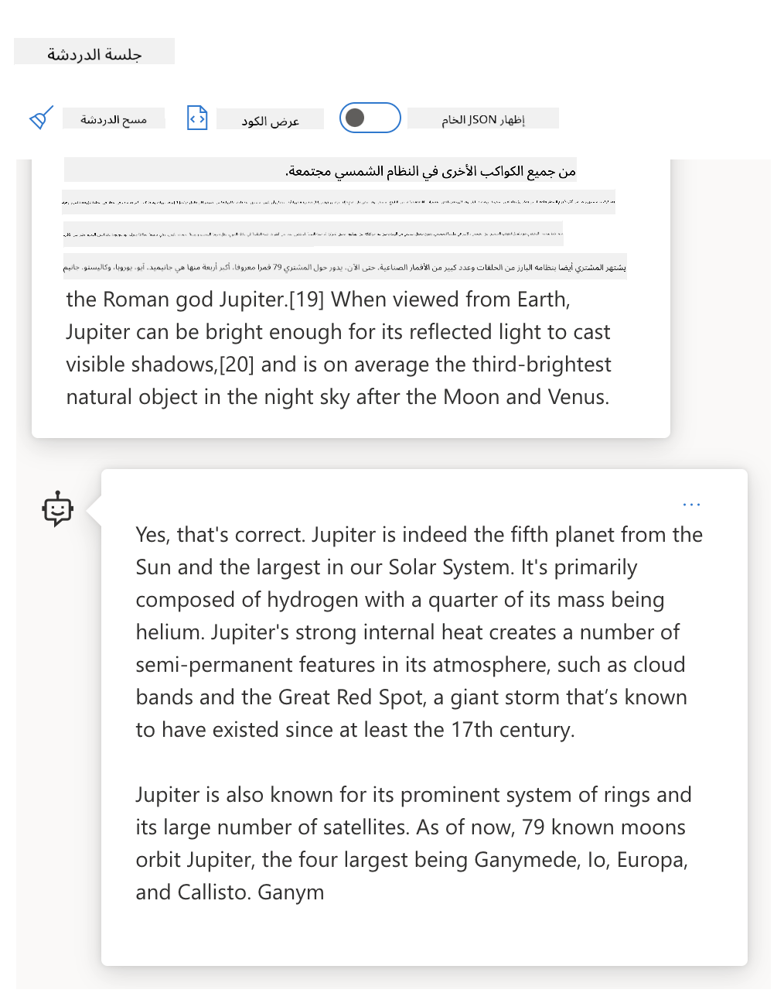

<!--
CO_OP_TRANSLATOR_METADATA:
{
  "original_hash": "a45c318dc6ebc2604f35b8b829f93af2",
  "translation_date": "2025-07-09T09:21:20+00:00",
  "source_file": "04-prompt-engineering-fundamentals/README.md",
  "language_code": "ar"
}
-->
# أساسيات هندسة المطالبات

[](https://aka.ms/gen-ai-lesson4-gh?WT.mc_id=academic-105485-koreyst)

## المقدمة  
يغطي هذا الوحدة المفاهيم والتقنيات الأساسية لإنشاء مطالبات فعالة في نماذج الذكاء الاصطناعي التوليدي. طريقة كتابة المطالبة إلى نموذج اللغة الكبير (LLM) مهمة أيضًا. فالمطالبة المصممة بعناية يمكن أن تحقق جودة أفضل في الاستجابة. لكن ما المقصود فعلاً بمصطلحات مثل _المطالبة_ و_هندسة المطالبات_؟ وكيف يمكنني تحسين _مدخلات_ المطالبة التي أرسلها إلى نموذج اللغة الكبير؟ هذه هي الأسئلة التي سنحاول الإجابة عليها في هذا الفصل والفصل التالي.

الذكاء الاصطناعي التوليدي قادر على إنشاء محتوى جديد (مثل النصوص، الصور، الصوت، الشيفرة البرمجية، إلخ) استجابةً لطلبات المستخدم. ويحقق ذلك باستخدام _نماذج اللغة الكبيرة_ مثل سلسلة GPT من OpenAI ("المحول المدرب مسبقًا التوليدي") التي تم تدريبها على استخدام اللغة الطبيعية والشيفرة.

يمكن للمستخدمين الآن التفاعل مع هذه النماذج باستخدام أساليب مألوفة مثل الدردشة، دون الحاجة إلى خبرة تقنية أو تدريب. النماذج تعتمد على _المطالبات_ - يرسل المستخدم نصًا (المطالبة) ويحصل على استجابة الذكاء الاصطناعي (الإكمال). يمكنهم بعد ذلك "التحدث مع الذكاء الاصطناعي" بشكل تكراري، في محادثات متعددة الجولات، مع تحسين المطالبة حتى تتطابق الاستجابة مع توقعاتهم.

أصبحت "المطالبات" الآن الواجهة _البرمجية الأساسية_ لتطبيقات الذكاء الاصطناعي التوليدي، حيث تخبر النماذج بما يجب فعله وتؤثر على جودة الاستجابات المعادة. "هندسة المطالبات" هي مجال دراسي سريع النمو يركز على _تصميم وتحسين_ المطالبات لتقديم استجابات متسقة وعالية الجودة على نطاق واسع.

## أهداف التعلم

في هذا الدرس، سنتعلم ما هي هندسة المطالبات، ولماذا هي مهمة، وكيف يمكننا صياغة مطالبات أكثر فعالية لنموذج معين وهدف تطبيقي محدد. سنفهم المفاهيم الأساسية وأفضل الممارسات لهندسة المطالبات - ونتعرف على بيئة تفاعلية في دفاتر Jupyter حيث يمكننا رؤية هذه المفاهيم مطبقة على أمثلة حقيقية.

بنهاية هذا الدرس سنكون قادرين على:

1. شرح ما هي هندسة المطالبات ولماذا هي مهمة.
2. وصف مكونات المطالبة وكيفية استخدامها.
3. تعلم أفضل الممارسات والتقنيات لهندسة المطالبات.
4. تطبيق التقنيات المكتسبة على أمثلة حقيقية، باستخدام نقطة نهاية OpenAI.

## المصطلحات الرئيسية

هندسة المطالبات: ممارسة تصميم وتحسين المدخلات لتوجيه نماذج الذكاء الاصطناعي نحو إنتاج المخرجات المرغوبة.  
التقطيع (Tokenization): عملية تحويل النص إلى وحدات أصغر تُسمى رموزًا (Tokens)، يمكن للنموذج فهمها ومعالجتها.  
نماذج اللغة الكبيرة المضبوطة بالتعليمات: نماذج اللغة الكبيرة التي تم تحسينها باستخدام تعليمات محددة لتحسين دقة وملاءمة الاستجابة.

## بيئة التعلم التجريبية

هندسة المطالبات هي حاليًا فن أكثر منها علمًا. أفضل طريقة لتحسين حدسنا فيها هي _الممارسة المستمرة_ واعتماد نهج التجربة والخطأ الذي يجمع بين خبرة مجال التطبيق والتقنيات الموصى بها والتحسينات الخاصة بالنموذج.

يوفر دفتر Jupyter المرفق مع هذا الدرس بيئة _تجريبية_ حيث يمكنك تجربة ما تتعلمه - أثناء التقدم أو كجزء من تحدي الشيفرة في النهاية. لتنفيذ التمارين، ستحتاج إلى:

1. **مفتاح API لـ Azure OpenAI** - نقطة نهاية الخدمة لنموذج لغة كبير منشور.  
2. **بيئة تشغيل Python** - لتشغيل دفتر الملاحظات.  
3. **متغيرات بيئة محلية** - _أكمل خطوات [الإعداد](./../00-course-setup/SETUP.md?WT.mc_id=academic-105485-koreyst) الآن للتحضير_.

يأتي الدفتر مع تمارين _مبدئية_ - لكن يُشجعك على إضافة أقسام _Markdown_ (وصف) و_Code_ (طلبات المطالبات) خاصة بك لتجربة المزيد من الأمثلة أو الأفكار - وبناء حدسك في تصميم المطالبات.

## الدليل المصور

هل تريد نظرة عامة على ما يغطيه هذا الدرس قبل الغوص فيه؟ اطلع على هذا الدليل المصور، الذي يمنحك فكرة عن المواضيع الرئيسية التي يغطيها وأهم النقاط التي يجب التفكير فيها في كل منها. يأخذك مخطط الدرس من فهم المفاهيم الأساسية والتحديات إلى معالجتها باستخدام تقنيات هندسة المطالبات ذات الصلة وأفضل الممارسات. لاحظ أن قسم "التقنيات المتقدمة" في هذا الدليل يشير إلى محتوى يتم تغطيته في _الفصل التالي_ من هذا المنهج.


## شركتنا الناشئة

الآن، دعونا نتحدث عن كيف يرتبط _هذا الموضوع_ بمهمة شركتنا الناشئة في [جلب الابتكار في الذكاء الاصطناعي إلى التعليم](https://educationblog.microsoft.com/2023/06/collaborating-to-bring-ai-innovation-to-education?WT.mc_id=academic-105485-koreyst). نريد بناء تطبيقات مدعومة بالذكاء الاصطناعي للتعلم _الشخصي_ - فلنفكر كيف قد "يصمم" مستخدمو تطبيقنا مطالباتهم:

- **الإداريون** قد يطلبون من الذكاء الاصطناعي _تحليل بيانات المنهج لتحديد الثغرات في التغطية_. يمكن للذكاء الاصطناعي تلخيص النتائج أو تصورها باستخدام الشيفرة.  
- **المعلمون** قد يطلبون من الذكاء الاصطناعي _إنشاء خطة درس لجمهور وموضوع معين_. يمكن للذكاء الاصطناعي بناء الخطة الشخصية بصيغة محددة.  
- **الطلاب** قد يطلبون من الذكاء الاصطناعي _تدريسهم في مادة صعبة_. يمكن للذكاء الاصطناعي الآن إرشاد الطلاب بدروس، تلميحات وأمثلة تناسب مستواهم.

هذا مجرد غيض من فيض. اطلع على [Prompts For Education](https://github.com/microsoft/prompts-for-edu/tree/main?WT.mc_id=academic-105485-koreyst) - مكتبة مطالبات مفتوحة المصدر منسقة بواسطة خبراء التعليم - للحصول على فكرة أوسع عن الإمكانيات! _جرب تشغيل بعض هذه المطالبات في البيئة التجريبية أو باستخدام OpenAI Playground لترى ماذا يحدث!_

<!--  
قالب الدرس:  
يجب أن يغطي هذا الوحدة المفهوم الأساسي #1.  
عزز المفهوم بأمثلة ومراجع.  

المفهوم #1:  
هندسة المطالبات.  
عرفه واشرح لماذا هو ضروري.  
-->

## ما هي هندسة المطالبات؟

بدأنا هذا الدرس بتعريف **هندسة المطالبات** على أنها عملية _تصميم وتحسين_ مدخلات النص (المطالبات) لتقديم استجابات متسقة وعالية الجودة (الإكمالات) لهدف تطبيقي ونموذج معين. يمكننا التفكير في هذا كعملية من خطوتين:

- _تصميم_ المطالبة الأولية لنموذج وهدف معين  
- _تحسين_ المطالبة بشكل تكراري لتحسين جودة الاستجابة

هذه عملية تعتمد بالضرورة على التجربة والخطأ وتتطلب حدس المستخدم وجهدًا للحصول على أفضل النتائج. فلماذا هي مهمة؟ للإجابة على هذا السؤال، نحتاج أولاً إلى فهم ثلاثة مفاهيم:

- _التقطيع_ = كيف "يرى" النموذج المطالبة  
- _نماذج اللغة الأساسية_ = كيف "تعالج" نموذج الأساس المطالبة  
- _نماذج اللغة المضبوطة بالتعليمات_ = كيف يمكن للنموذج الآن رؤية "المهام"

### التقطيع (Tokenization)

يرى نموذج اللغة الكبير المطالبات كسلسلة من _الرموز_ حيث يمكن لنماذج مختلفة (أو إصدارات مختلفة من نموذج) تقطيع نفس المطالبة بطرق مختلفة. بما أن نماذج اللغة الكبيرة مدربة على الرموز (وليس النص الخام)، فإن طريقة تقطيع المطالبات تؤثر مباشرة على جودة الاستجابة المولدة.

للحصول على فكرة عن كيفية عمل التقطيع، جرب أدوات مثل [OpenAI Tokenizer](https://platform.openai.com/tokenizer?WT.mc_id=academic-105485-koreyst) الموضحة أدناه. انسخ مطالبتك - وشاهد كيف تتحول إلى رموز، مع الانتباه إلى كيفية التعامل مع فراغات النص وعلامات الترقيم. لاحظ أن هذا المثال يعرض نموذجًا أقدم (GPT-3) - لذا قد ينتج عن تجربة هذا مع نموذج أحدث نتيجة مختلفة.


### المفهوم: نماذج الأساس

بمجرد تقطيع المطالبة، الوظيفة الأساسية لـ ["نموذج اللغة الأساسي"](https://blog.gopenai.com/an-introduction-to-base-and-instruction-tuned-large-language-models-8de102c785a6?WT.mc_id=academic-105485-koreyst) (أو نموذج الأساس) هي التنبؤ بالرمز التالي في تلك السلسلة. بما أن نماذج اللغة الكبيرة مدربة على مجموعات بيانات نصية ضخمة، فهي تمتلك فهمًا جيدًا للعلاقات الإحصائية بين الرموز ويمكنها إجراء هذا التنبؤ بثقة معقولة. لاحظ أنها لا تفهم _معنى_ الكلمات في المطالبة أو الرمز؛ بل ترى نمطًا يمكنها "إكماله" بالتنبؤ التالي. يمكنها الاستمرار في التنبؤ بالسلسلة حتى يتم إيقافها بواسطة تدخل المستخدم أو شرط محدد مسبقًا.

هل تريد رؤية كيف يعمل الإكمال المعتمد على المطالبة؟ أدخل المطالبة أعلاه في Azure OpenAI Studio [_Chat Playground_](https://oai.azure.com/playground?WT.mc_id=academic-105485-koreyst) بالإعدادات الافتراضية. النظام مهيأ للتعامل مع المطالبات كطلبات معلومات - لذا يجب أن ترى إكمالًا يرضي هذا السياق.

لكن ماذا لو أراد المستخدم رؤية شيء محدد يفي بمعايير أو هدف مهمة؟ هنا تظهر نماذج اللغة المضبوطة بالتعليمات.



### المفهوم: نماذج اللغة المضبوطة بالتعليمات

يبدأ [نموذج اللغة المضبوط بالتعليمات](https://blog.gopenai.com/an-introduction-to-base-and-instruction-tuned-large-language-models-8de102c785a6?WT.mc_id=academic-105485-koreyst) بنموذج الأساس ويتم تحسينه باستخدام أمثلة أو أزواج مدخلات/مخرجات (مثل "رسائل" متعددة الجولات) التي يمكن أن تحتوي على تعليمات واضحة - وتحاول استجابة الذكاء الاصطناعي اتباع تلك التعليمات.

يستخدم هذا تقنيات مثل التعلم المعزز مع التغذية الراجعة البشرية (RLHF) التي يمكنها تدريب النموذج على _اتباع التعليمات_ و_التعلم من الملاحظات_ بحيث ينتج استجابات أكثر ملاءمة للتطبيقات العملية وأكثر ارتباطًا بأهداف المستخدم.

دعونا نجرب ذلك - أعد زيارة المطالبة أعلاه، لكن الآن غيّر _رسالة النظام_ لتوفير التعليمات التالية كسياق:

> _لخص المحتوى المقدم لك لطلاب الصف الثاني. اجعل النتيجة فقرة واحدة مع 3-5 نقاط رئيسية._

هل ترى كيف أصبح الناتج الآن مضبوطًا ليعكس الهدف والصيغة المطلوبة؟ يمكن للمعلم الآن استخدام هذه الاستجابة مباشرة في شرائح الدرس.


## لماذا نحتاج إلى هندسة المطالبات؟

الآن بعد أن عرفنا كيف تعالج نماذج اللغة الكبيرة المطالبات، دعونا نتحدث عن _لماذا_ نحتاج إلى هندسة المطالبات. الجواب يكمن في أن نماذج اللغة الحالية تواجه عددًا من التحديات التي تجعل _الحصول على إكمالات موثوقة ومتسقة_ أكثر صعوبة دون بذل جهد في بناء وتحسين المطالبات. على سبيل المثال:

1. **استجابات النماذج عشوائية.** _نفس المطالبة_ من المحتمل أن تنتج استجابات مختلفة مع نماذج أو إصدارات مختلفة. وقد تنتج أيضًا نتائج مختلفة مع _نفس النموذج_ في أوقات مختلفة. _تقنيات هندسة المطالبات تساعدنا في تقليل هذه التباينات من خلال توفير ضوابط أفضل_.

2. **النماذج قد تختلق استجابات.** النماذج مدربة على مجموعات بيانات _كبيرة لكنها محدودة_، مما يعني أنها تفتقر إلى المعرفة حول مفاهيم خارج نطاق التدريب. ونتيجة لذلك، قد تنتج إكمالات غير دقيقة أو خيالية أو متناقضة مع الحقائق المعروفة. _تقنيات هندسة المطالبات تساعد المستخدمين على التعرف على هذه الاختلاقات والتقليل منها، مثلاً بطلب الاستشهادات أو التبرير من الذكاء الاصطناعي_.

3. **قدرات النماذج تختلف.** النماذج الأحدث أو أجيال النماذج الجديدة تمتلك قدرات أغنى لكنها تجلب أيضًا خصائص فريدة وتوازنات في التكلفة والتعقيد. _هندسة المطالبات تساعدنا على تطوير أفضل الممارسات وسير العمل التي تخفي هذه الاختلافات وتتأقلم مع متطلبات النموذج الخاصة بطريقة قابلة للتوسع وسلسة_.

دعونا نرى هذا عمليًا في OpenAI أو Azure OpenAI Playground:

- استخدم نفس المطالبة مع نشرات مختلفة لنماذج اللغة الكبيرة (مثل OpenAI، Azure OpenAI، Hugging Face) - هل لاحظت التباينات؟  
- استخدم نفس المطالبة مرارًا مع نفس نشر نموذج اللغة الكبير (مثل Azure OpenAI playground) - كيف اختلفت هذه التباينات؟

### مثال على الاختلاقات

في هذا المقرر، نستخدم مصطلح **"الاختلاق"** للإشارة إلى الظاهرة التي تولد فيها نماذج اللغة الكبيرة أحيانًا معلومات غير صحيحة واقعيًا بسبب محدودية تدريبها أو قيود أخرى. قد تكون سمعت هذا يُشار إليه أحيانًا بـ _"الهلوسات"_ في المقالات الشعبية أو الأوراق البحثية. ومع ذلك، نوصي بشدة باستخدام مصطلح _"الاختلاق"_ حتى لا نمنح السلوك صفة إنسانية عن طريق الخطأ من خلال نسب سمة بشرية إلى نتيجة مدفوعة بالآلة. وهذا يعزز أيضًا [إرشادات الذكاء الاصطناعي المسؤول](https://www.microsoft.com/ai/responsible-ai?WT.mc_id=academic-105485-koreyst) من منظور المصطلحات، بإزالة مصطلحات قد تُعتبر مسيئة أو غير شاملة في بعض السياقات.

هل تريد أن تفهم كيف تعمل الاختلاقات؟ فكر في مطالبة تطلب من الذكاء الاصطناعي إنشاء محتوى لموضوع غير موجود (للتأكد من أنه غير موجود في مجموعة بيانات التدريب). على سبيل المثال - جربت هذه المطالبة:
# خطة درس: حرب المريخ لعام 2076

## مقدمة
في هذا الدرس، سنتعرف على حرب المريخ التي وقعت في عام 2076، والتي كانت واحدة من أبرز الصراعات في تاريخ البشرية والمستعمرات الفضائية. سنناقش أسباب الحرب، الأحداث الرئيسية، والنتائج التي أثرت على مستقبل استكشاف الفضاء.

## الأهداف التعليمية
- فهم الأسباب التي أدت إلى اندلاع حرب المريخ.
- التعرف على الأطراف المشاركة في الحرب وأدوارهم.
- تحليل الأحداث الرئيسية خلال الصراع.
- تقييم تأثير الحرب على العلاقات بين الأرض والمستعمرات الفضائية.

## المواد المطلوبة
- خرائط للمريخ والمستعمرات الفضائية في عام 2076.
- مقاطع فيديو توضيحية عن الحرب.
- نصوص ووثائق تاريخية مختارة.

## خطة الدرس

### 1. مقدمة عامة (10 دقائق)
- تقديم خلفية عن استيطان المريخ قبل عام 2076.
- شرح الظروف السياسية والاقتصادية التي سبقت الحرب.

### 2. أسباب الحرب (15 دقيقة)
- مناقشة النزاعات حول الموارد والسيادة.
- دور التكنولوجيا والتسلح في تصعيد التوترات.

### 3. الأحداث الرئيسية (20 دقيقة)
- استعراض المعارك الكبرى والتكتيكات المستخدمة.
- تحليل دور الشخصيات الرئيسية والقادة العسكريين.

### 4. نتائج الحرب (10 دقائق)
- تأثير الحرب على المستعمرات المريخية.
- التغييرات في السياسات الفضائية بعد الحرب.

### 5. نشاط تفاعلي (15 دقيقة)
- تقسيم الطلاب إلى مجموعات لمناقشة سيناريوهات بديلة للحرب.
- عرض نتائج المناقشات ومشاركة الأفكار.

## التقييم
- اختبار قصير حول أسباب وأحداث الحرب.
- مشروع بحثي عن تأثير الحرب على استكشاف الفضاء.

## ملاحظات
[!TIP] شجع الطلاب على التفكير النقدي حول الصراعات المستقبلية في الفضاء وكيف يمكن تجنبها.
أظهر بحث على الويب أن هناك حسابات خيالية (مثل المسلسلات التلفزيونية أو الكتب) عن حروب المريخ - لكن لا شيء في عام 2076. والمنطق السليم يخبرنا أيضًا أن عام 2076 هو _في المستقبل_ وبالتالي، لا يمكن ربطه بحدث حقيقي.

فماذا يحدث عندما نشغل هذا الطلب مع مزودي نماذج اللغة الكبيرة المختلفين؟

> **الرد 1**: OpenAI Playground (GPT-35)


> **الرد 2**: Azure OpenAI Playground (GPT-35)


> **الرد 3**: : Hugging Face Chat Playground (LLama-2)


كما هو متوقع، كل نموذج (أو نسخة من النموذج) ينتج ردودًا مختلفة قليلاً بفضل السلوك العشوائي واختلاف قدرات النماذج. على سبيل المثال، يستهدف نموذج واحد جمهور الصف الثامن بينما يفترض الآخر طالبًا في المدرسة الثانوية. لكن جميع النماذج الثلاثة أنتجت ردودًا يمكن أن تقنع مستخدمًا غير مطلع بأن الحدث كان حقيقيًا.

تقنيات هندسة الطلبات مثل _الميتابرومبتينغ_ و_تكوين درجة الحرارة_ قد تقلل من اختلاق النماذج إلى حد ما. كما أن _الهياكل_ الجديدة لهندسة الطلبات تدمج أدوات وتقنيات جديدة بسلاسة في تدفق الطلب، لتخفيف أو تقليل بعض هذه التأثيرات.

## دراسة حالة: GitHub Copilot

لنختم هذا القسم بفهم كيف تُستخدم هندسة الطلبات في حلول العالم الحقيقي من خلال دراسة حالة واحدة: [GitHub Copilot](https://github.com/features/copilot?WT.mc_id=academic-105485-koreyst).

GitHub Copilot هو "المبرمج المساعد بالذكاء الاصطناعي" الخاص بك - يحول طلبات النص إلى إكمالات للكود وهو مدمج في بيئة تطويرك (مثل Visual Studio Code) لتجربة مستخدم سلسة. كما هو موثق في سلسلة المدونات أدناه، كانت النسخة الأولى مبنية على نموذج OpenAI Codex - حيث أدرك المهندسون بسرعة الحاجة إلى ضبط النموذج بدقة وتطوير تقنيات أفضل لهندسة الطلبات لتحسين جودة الكود. في يوليو، [أطلقوا نموذج ذكاء اصطناعي محسّن يتجاوز Codex](https://github.blog/2023-07-28-smarter-more-efficient-coding-github-copilot-goes-beyond-codex-with-improved-ai-model/?WT.mc_id=academic-105485-koreyst) لتقديم اقتراحات أسرع.

اقرأ المشاركات بالترتيب لتتبع رحلة تعلمهم.

- **مايو 2023** | [GitHub Copilot يتحسن في فهم كودك](https://github.blog/2023-05-17-how-github-copilot-is-getting-better-at-understanding-your-code/?WT.mc_id=academic-105485-koreyst)
- **مايو 2023** | [داخل GitHub: العمل مع نماذج اللغة الكبيرة خلف GitHub Copilot](https://github.blog/2023-05-17-inside-github-working-with-the-llms-behind-github-copilot/?WT.mc_id=academic-105485-koreyst)
- **يونيو 2023** | [كيفية كتابة طلبات أفضل لـ GitHub Copilot](https://github.blog/2023-06-20-how-to-write-better-prompts-for-github-copilot/?WT.mc_id=academic-105485-koreyst)
- **يوليو 2023** | [.. GitHub Copilot يتجاوز Codex بنموذج ذكاء اصطناعي محسّن](https://github.blog/2023-07-28-smarter-more-efficient-coding-github-copilot-goes-beyond-codex-with-improved-ai-model/?WT.mc_id=academic-105485-koreyst)
- **يوليو 2023** | [دليل المطور لهندسة الطلبات ونماذج اللغة الكبيرة](https://github.blog/2023-07-17-prompt-engineering-guide-generative-ai-llms/?WT.mc_id=academic-105485-koreyst)
- **سبتمبر 2023** | [كيفية بناء تطبيق LLM للمؤسسات: دروس من GitHub Copilot](https://github.blog/2023-09-06-how-to-build-an-enterprise-llm-application-lessons-from-github-copilot/?WT.mc_id=academic-105485-koreyst)

يمكنك أيضًا تصفح [مدونتهم الهندسية](https://github.blog/category/engineering/?WT.mc_id=academic-105485-koreyst) لمزيد من المشاركات مثل [هذه](https://github.blog/2023-09-27-how-i-used-github-copilot-chat-to-build-a-reactjs-gallery-prototype/?WT.mc_id=academic-105485-koreyst) التي توضح كيف تُطبَّق هذه النماذج والتقنيات في دفع تطبيقات العالم الحقيقي.

---

<!--
قالب الدرس:
يجب أن يغطي هذا الوحدة المفهوم الأساسي رقم 2.
تعزيز المفهوم بأمثلة ومراجع.

المفهوم رقم 2:
تصميم الطلب.
موضح بأمثلة.
-->

## بناء الطلب

لقد رأينا لماذا هندسة الطلبات مهمة - الآن دعونا نفهم كيف يتم _بناء_ الطلبات حتى نتمكن من تقييم تقنيات مختلفة لتصميم طلبات أكثر فاعلية.

### الطلب الأساسي

لنبدأ بالطلب الأساسي: إدخال نصي يُرسل إلى النموذج بدون أي سياق آخر. إليك مثالًا - عندما نرسل الكلمات القليلة الأولى من النشيد الوطني الأمريكي إلى OpenAI [Completion API](https://platform.openai.com/docs/api-reference/completions?WT.mc_id=academic-105485-koreyst) فإنه يكمل الرد على الفور بالسطور التالية، موضحًا سلوك التنبؤ الأساسي.

| الطلب (الإدخال)     | الإكمال (الإخراج)                                                                                                                        |
| :----------------- | :----------------------------------------------------------------------------------------------------------------------------------------- |
| Oh say can you see | يبدو أنك تبدأ كلمات "The Star-Spangled Banner"، النشيد الوطني للولايات المتحدة. الكلمات الكاملة هي ... |

### الطلب المعقد

الآن دعونا نضيف سياقًا وتعليمات إلى ذلك الطلب الأساسي. تتيح لنا [Chat Completion API](https://learn.microsoft.com/azure/ai-services/openai/how-to/chatgpt?WT.mc_id=academic-105485-koreyst) بناء طلب معقد كمجموعة من _الرسائل_ مع:

- أزواج الإدخال/الإخراج التي تعكس إدخال _المستخدم_ ورد _المساعد_.
- رسالة النظام التي تحدد سياق سلوك المساعد أو شخصيته.

الطلب الآن في الشكل أدناه، حيث تلتقط _التقطيع_ بفعالية المعلومات ذات الصلة من السياق والمحادثة. الآن، يمكن أن يكون تغيير سياق النظام مؤثرًا على جودة الإكمالات بقدر تأثير مدخلات المستخدم المقدمة.

```python
response = openai.chat.completions.create(
    model="gpt-3.5-turbo",
    messages=[
        {"role": "system", "content": "You are a helpful assistant."},
        {"role": "user", "content": "Who won the world series in 2020?"},
        {"role": "assistant", "content": "The Los Angeles Dodgers won the World Series in 2020."},
        {"role": "user", "content": "Where was it played?"}
    ]
)
```

### طلب التعليمات

في الأمثلة أعلاه، كان طلب المستخدم استعلامًا نصيًا بسيطًا يمكن تفسيره كطلب معلومات. مع طلبات _التعليمات_، يمكننا استخدام ذلك النص لتحديد مهمة بمزيد من التفصيل، مما يوفر توجيهًا أفضل للذكاء الاصطناعي. إليك مثالًا:

| الطلب (الإدخال)                                                                                                                                                                                                                         | الإكمال (الإخراج)                                                                                                        | نوع التعليمات    |
| :------------------------------------------------------------------------------------------------------------------------------------------------------------------------------------------------------------------------------------- | :------------------------------------------------------------------------------------------------------------------------- | :------------------ |
| Write a description of the Civil War                                                                                                                                                                                                   | _أعاد فقرة بسيطة_                                                                                              | بسيط              |
| Write a description of the Civil War. Provide key dates and events and describe their significance                                                                                                                                     | _أعاد فقرة تليها قائمة بتواريخ الأحداث الرئيسية مع أوصاف_                                             | معقد             |
| Write a description of the Civil War in 1 paragraph. Provide 3 bullet points with key dates and their significance. Provide 3 more bullet points with key historical figures and their contributions. Return the output as a JSON file | _يعيد تفاصيل أكثر شمولاً في مربع نص، منسقة كملف JSON يمكنك نسخه ولصقه للتحقق حسب الحاجة_ | معقد. منسق. |

## المحتوى الأساسي

في الأمثلة أعلاه، كان الطلب لا يزال مفتوحًا إلى حد ما، مما يسمح لنموذج اللغة الكبير بتحديد أي جزء من مجموعة البيانات المدربة مسبقًا ذات صلة. مع نمط تصميم _المحتوى الأساسي_، يُقسم النص المدخل إلى جزأين:

- تعليمات (إجراء)
- محتوى ذي صلة (يؤثر على الإجراء)

إليك مثالًا حيث التعليمات هي "لخص هذا في جملتين".

| الطلب (الإدخال)                                                                                                                                                                                                                                                                                                                                                                                                                                                                                                                                                                                                                                                                                      | الإكمال (الإخراج)                                                                                                                                                                                                                                                                             |
| :-------------------------------------------------------------------------------------------------------------------------------------------------------------------------------------------------------------------------------------------------------------------------------------------------------------------------------------------------------------------------------------------------------------------------------------------------------------------------------------------------------------------------------------------------------------------------------------------------------------------------------------------------------------------------------------------------- | :---------------------------------------------------------------------------------------------------------------------------------------------------------------------------------------------------------------------------------------------------------------------------------------------- |
| كوكب المشتري هو الكوكب الخامس من الشمس والأكبر في النظام الشمسي. إنه عملاق غازي كتلته تعادل ألف جزء من كتلة الشمس، لكنه يزيد بمرتين ونصف عن مجموع كتل جميع الكواكب الأخرى في النظام الشمسي مجتمعة. المشتري هو أحد ألمع الأجسام التي يمكن رؤيتها بالعين المجردة في السماء ليلاً، وكان معروفًا للحضارات القديمة منذ ما قبل التاريخ المسجل. سُمي على اسم الإله الروماني جوبيتر.[19] عند النظر إليه من الأرض، يمكن أن يكون المشتري ساطعًا بما يكفي ليُلقي ظلالًا مرئية،[20] وهو في المتوسط ثالث ألمع جسم طبيعي في السماء ليلاً بعد القمر والزهرة. <br/> **لخص هذا في جملتين قصيرتين** | المشتري، الكوكب الخامس من الشمس، هو الأكبر في النظام الشمسي ويُعرف بكونه أحد ألمع الأجسام في السماء ليلاً. سُمي على اسم الإله الروماني جوبيتر، وهو عملاق غازي كتلته تعادل مرتين ونصف مجموع كتل جميع الكواكب الأخرى في النظام الشمسي مجتمعة. |

يمكن استخدام جزء المحتوى الأساسي بطرق مختلفة لتوجيه تعليمات أكثر فاعلية:

- **أمثلة** - بدلاً من إخبار النموذج بما يجب فعله بتعليمات صريحة، قدم له أمثلة لما يجب فعله ودعه يستنتج النمط.
- **إشارات** - اتبع التعليمات بـ "إشارة" تهيئ الإكمال، موجهًا النموذج نحو ردود أكثر صلة.
- **قوالب** - هذه وصفات قابلة للتكرار للطلبات مع متغيرات يمكن تخصيصها بالبيانات لحالات استخدام محددة.

دعونا نستكشف هذه في التطبيق.

### استخدام الأمثلة

هذه طريقة تستخدم المحتوى الأساسي لـ "تغذية النموذج" ببعض الأمثلة على المخرجات المطلوبة لمهمة معينة، وتترك له استنتاج نمط المخرجات المطلوبة. بناءً على عدد الأمثلة المقدمة، يمكننا استخدام طلبات بدون أمثلة (zero-shot)، أو بمثال واحد (one-shot)، أو بعدة أمثلة (few-shot) وهكذا.

يتكون الطلب الآن من ثلاثة مكونات:

- وصف المهمة
- بعض الأمثلة على المخرجات المطلوبة
- بداية مثال جديد (يصبح وصفًا ضمنيًا للمهمة)

| نوع التعلم | الطلب (الإدخال)                                                                                                                                        | الإكمال (الإخراج)         |
| :------------ | :---------------------------------------------------------------------------------------------------------------------------------------------------- | :-------------------------- |
| بدون أمثلة     | "The Sun is Shining". ترجم إلى الإسبانية                                                                                                            | "El Sol está brillando".    |
| بمثال واحد      | "The Sun is Shining" => ""El Sol está brillando". <br> "It's a Cold and Windy Day" =>                                                                 | "Es un día frío y ventoso". |
| بعدة أمثلة      | اللاعب ركض القواعد => كرة القاعدة <br/> اللاعب ضرب إيس => تنس <br/> اللاعب ضرب ستة => كريكيت <br/> اللاعب نفذ سلام-دانك => | كرة السلة                  |
|               |                                                                                                                                                       |                             |

لاحظ كيف كان علينا تقديم تعليمات صريحة ("ترجم إلى الإسبانية") في طلب بدون أمثلة، لكنها تُستنتج في مثال بمثال واحد. ويُظهر مثال بعدة أمثلة كيف أن إضافة المزيد من الأمثلة يسمح للنماذج باستنتاجات أكثر دقة بدون تعليمات إضافية.

### إشارات الطلب

تقنية أخرى لاستخدام المحتوى الأساسي هي تقديم _إشارات_ بدلاً من الأمثلة. في هذه الحالة، نعطي النموذج دفعة في الاتجاه الصحيح عن طريق _بدءه_ بمقتطف يعكس تنسيق الرد المطلوب. ثم "يأخذ النموذج الإشارة" ليكمل على هذا النحو.

| عدد الإشارات | الطلب (الإدخال)                                                                                                                                                                                                                                                                                                                                                                                                                                               | الإكمال (الإخراج)                                                                                                                                                                                                                                                                                       |
| :------------- | :----------------------------------------------------------------------------------------------------------------------------------------------------------------------------------------------------------------------------------------------------------------------------------------------------------------------------------------------------------------------------------------------------------------------------------------------------------- | :-------------------------------------------------------------------------------------------------------------------------------------------------------------------------------------------------------------------------------------------------------------------------------------------------------- |
| 0              | كوكب المشتري هو الكوكب الخامس من الشمس والأكبر في النظام الشمسي. إنه عملاق غازي كتلته تعادل ألف جزء من كتلة الشمس، لكنه يزيد بمرتين ونصف عن مجموع كتل جميع الكواكب الأخرى في النظام الشمسي مجتمعة. المشتري هو أحد ألمع الأجسام التي يمكن رؤيتها بالعين المجردة في السماء ليلاً، وكان معروفًا للحضارات القديمة منذ ما قبل التاريخ المسجل.

**لخص هذا**                                       | كوكب المشتري هو أكبر كواكب نظامنا الشمسي والخامس بعدًا عن الشمس. إنه عملاق غازي كتلته تعادل 1/1000 من كتلة الشمس، لكنه أثقل من جميع الكواكب الأخرى مجتمعة. عرفته الحضارات القديمة منذ زمن بعيد، وهو واضح للعين المجردة في السماء ليلاً.. |
| 1              | المشتري هو الكوكب الخامس من الشمس والأكبر في النظام الشمسي. إنه عملاق غازي كتلته تعادل جزءًا من الألف من كتلة الشمس، لكنه أثقل بمرتين ونصف من مجموع كتلة جميع الكواكب الأخرى في النظام الشمسي. المشتري من ألمع الأجسام التي يمكن رؤيتها بالعين المجردة في السماء ليلاً، وقد عرفته الحضارات القديمة منذ ما قبل التاريخ المسجل. <br/>**لخص هذا** <br/> ما تعلمناه هو أن المشتري | هو الكوكب الخامس من الشمس والأكبر في النظام الشمسي. إنه عملاق غازي كتلته تعادل جزءًا من الألف من كتلة الشمس، لكنه أثقل بمرتين ونصف من مجموع كتلة جميع الكواكب الأخرى مجتمعة. يمكن رؤيته بسهولة بالعين المجردة وقد عرف منذ العصور القديمة.                        |
| 2              | المشتري هو الكوكب الخامس من الشمس والأكبر في النظام الشمسي. إنه عملاق غازي كتلته تعادل جزءًا من الألف من كتلة الشمس، لكنه أثقل بمرتين ونصف من مجموع كتلة جميع الكواكب الأخرى في النظام الشمسي. المشتري من ألمع الأجسام التي يمكن رؤيتها بالعين المجردة في السماء ليلاً، وقد عرفته الحضارات القديمة منذ ما قبل التاريخ المسجل. <br/>**لخص هذا** <br/> أهم 3 حقائق تعلمناها:         | 1. المشتري هو الكوكب الخامس من الشمس والأكبر في النظام الشمسي. <br/> 2. إنه عملاق غازي كتلته تعادل جزءًا من الألف من كتلة الشمس...<br/> 3. المشتري كان مرئيًا بالعين المجردة منذ العصور القديمة ...                                                                       |
|                |                                                                                                                                                                                                                                                                                                                                                                                                                                                              |                                                                                                                                                                                                                                                                                                           |

### قوالب المطالبات

قالب المطالبة هو _وصفة محددة مسبقًا للمطالبة_ يمكن تخزينها وإعادة استخدامها حسب الحاجة، لتوفير تجارب مستخدم أكثر اتساقًا على نطاق واسع. في أبسط أشكاله، هو مجرد مجموعة من أمثلة المطالبات مثل [هذا المثال من OpenAI](https://platform.openai.com/examples?WT.mc_id=academic-105485-koreyst) الذي يوفر مكونات المطالبة التفاعلية (رسائل المستخدم والنظام) وصيغة الطلب المدفوعة عبر API - لدعم إعادة الاستخدام.

في شكله الأكثر تعقيدًا مثل [هذا المثال من LangChain](https://python.langchain.com/docs/concepts/prompt_templates/?WT.mc_id=academic-105485-koreyst) يحتوي على _نقاط استبدال_ يمكن ملؤها ببيانات من مصادر متنوعة (مدخلات المستخدم، سياق النظام، مصادر بيانات خارجية، إلخ) لإنشاء مطالبة ديناميكيًا. هذا يسمح لنا بإنشاء مكتبة من المطالبات القابلة لإعادة الاستخدام التي يمكن استخدامها لقيادة تجارب مستخدم متسقة **برمجيًا** على نطاق واسع.

وأخيرًا، القيمة الحقيقية للقوالب تكمن في القدرة على إنشاء ونشر _مكتبات مطالبات_ لمجالات تطبيق عمودية - حيث يتم الآن _تحسين_ قالب المطالبة ليعكس سياقًا أو أمثلة خاصة بالتطبيق تجعل الردود أكثر صلة ودقة للجمهور المستهدف. مستودع [Prompts For Edu](https://github.com/microsoft/prompts-for-edu?WT.mc_id=academic-105485-koreyst) هو مثال رائع على هذا النهج، حيث يجمع مكتبة من المطالبات لمجال التعليم مع التركيز على أهداف رئيسية مثل تخطيط الدروس، تصميم المناهج، تدريس الطلاب، إلخ.

## المحتوى الداعم

إذا اعتبرنا بناء المطالبة كوجود تعليمات (مهمة) ومحتوى رئيسي (المحتوى الأساسي)، فإن _المحتوى الثانوي_ يشبه السياق الإضافي الذي نقدمه لـ **التأثير على الناتج بطريقة ما**. قد يكون ذلك معلمات ضبط، تعليمات تنسيق، تصنيفات موضوعية، إلخ، التي تساعد النموذج على _تخصيص_ استجابته لتناسب الأهداف أو التوقعات المرجوة للمستخدم.

على سبيل المثال: بالنظر إلى كتالوج دورات يحتوي على بيانات وصفية واسعة (الاسم، الوصف، المستوى، علامات البيانات الوصفية، المدرب، إلخ) لجميع الدورات المتاحة في المنهج:

- يمكننا تحديد تعليمات لـ "تلخيص كتالوج الدورات لفصل خريف 2023"
- يمكننا استخدام المحتوى الرئيسي لتقديم بعض الأمثلة على الناتج المطلوب
- يمكننا استخدام المحتوى الثانوي لتحديد أهم 5 "علامات" ذات اهتمام.

الآن، يمكن للنموذج تقديم ملخص بالشكل الموضح في الأمثلة القليلة - ولكن إذا كان الناتج يحتوي على علامات متعددة، يمكنه إعطاء أولوية للعلامات الخمسة المحددة في المحتوى الثانوي.

---

<!--
قالب الدرس:
يجب أن يغطي هذا الوحدة المفهوم الأساسي رقم 1.
عزز المفهوم بأمثلة ومراجع.

المفهوم رقم 3:
تقنيات هندسة المطالبات.
ما هي بعض التقنيات الأساسية لهندسة المطالبات؟
وضح ذلك ببعض التمارين.
-->

## أفضل ممارسات المطالبة

الآن بعد أن عرفنا كيف يمكن _بناء_ المطالبات، يمكننا البدء بالتفكير في كيفية _تصميمها_ لتعكس أفضل الممارسات. يمكننا التفكير في ذلك على جزأين - امتلاك _عقلية_ صحيحة وتطبيق _تقنيات_ مناسبة.

### عقلية هندسة المطالبات

هندسة المطالبات هي عملية تجريبية، لذا احتفظ بثلاثة عوامل إرشادية عامة في ذهنك:

1. **فهم المجال مهم.** دقة وملاءمة الاستجابة تعتمد على _المجال_ الذي يعمل فيه التطبيق أو المستخدم. استخدم حدسك وخبرتك في المجال لـ **تخصيص التقنيات** بشكل أعمق. على سبيل المثال، عرّف _شخصيات خاصة بالمجال_ في مطالبات النظام، أو استخدم _قوالب خاصة بالمجال_ في مطالبات المستخدم. قدم محتوى ثانوي يعكس سياقات خاصة بالمجال، أو استخدم _إشارات وأمثلة خاصة بالمجال_ لتوجيه النموذج نحو أنماط استخدام مألوفة.

2. **فهم النموذج مهم.** نعلم أن النماذج عشوائية بطبيعتها. لكن تطبيقات النماذج قد تختلف أيضًا من حيث مجموعة البيانات التدريبية المستخدمة (المعرفة المسبقة)، والقدرات التي توفرها (مثلًا عبر API أو SDK) ونوع المحتوى الذي تم تحسينها له (كود، صور، نصوص). افهم نقاط القوة والقيود للنموذج الذي تستخدمه، واستخدم هذه المعرفة لـ _تحديد أولويات المهام_ أو بناء _قوالب مخصصة_ محسنة لقدرات النموذج.

3. **التكرار والتحقق مهمان.** النماذج تتطور بسرعة، وكذلك تقنيات هندسة المطالبات. بصفتك خبيرًا في المجال، قد يكون لديك سياق أو معايير خاصة _بتطبيقك_ قد لا تنطبق على المجتمع الأوسع. استخدم أدوات وتقنيات هندسة المطالبات لـ "الانطلاق السريع" في بناء المطالبات، ثم كرر وحقق النتائج باستخدام حدسك وخبرتك في المجال. سجّل ملاحظاتك وأنشئ **قاعدة معرفة** (مثل مكتبات المطالبات) يمكن للآخرين استخدامها كأساس جديد لتسريع التكرارات المستقبلية.

## أفضل الممارسات

لننظر الآن إلى أفضل الممارسات الشائعة التي يوصي بها ممارسو [OpenAI](https://help.openai.com/en/articles/6654000-best-practices-for-prompt-engineering-with-openai-api?WT.mc_id=academic-105485-koreyst) و[Azure OpenAI](https://learn.microsoft.com/azure/ai-services/openai/concepts/prompt-engineering#best-practices?WT.mc_id=academic-105485-koreyst).

| ماذا                              | لماذا                                                                                                                                                                                                                                               |
| :-------------------------------- | :------------------------------------------------------------------------------------------------------------------------------------------------------------------------------------------------------------------------------------------------ |
| تقييم أحدث النماذج.               | من المحتمل أن تحتوي أجيال النماذج الجديدة على ميزات وجودة محسنة - لكنها قد تكلف أكثر. قيّمها من حيث التأثير، ثم اتخذ قرارات الترحيل.                                                                                                            |
| فصل التعليمات والسياق            | تحقق مما إذا كان مزود النموذج يحدد _فواصل_ لتمييز التعليمات، المحتوى الأساسي والثانوي بوضوح أكبر. هذا يساعد النماذج على تعيين أوزان أكثر دقة للرموز.                                                                                             |
| كن محددًا وواضحًا                | قدم تفاصيل أكثر عن السياق المطلوب، النتيجة، الطول، التنسيق، الأسلوب، إلخ. هذا يحسن جودة واتساق الردود. سجّل الوصفات في قوالب قابلة لإعادة الاستخدام.                                                                                         |
| كن وصفيًا، استخدم أمثلة           | قد تستجيب النماذج بشكل أفضل لنهج "عرض وشرح". ابدأ بنهج `صفر-لقطة` حيث تعطي تعليمات (دون أمثلة) ثم جرب `عدة لقطات` كتحسين، مع تقديم بعض الأمثلة على الناتج المطلوب. استخدم التشبيهات.                                                        |
| استخدم إشارات لبدء الإكمالات     | حفّز النموذج نحو نتيجة مرغوبة بإعطائه كلمات أو عبارات تمهيدية يمكنه استخدامها كنقطة انطلاق للرد.                                                                                                                                            |
| كرر التأكيد                      | أحيانًا قد تحتاج إلى تكرار التعليمات للنموذج. قدم التعليمات قبل وبعد المحتوى الأساسي، استخدم تعليمات وإشارة، إلخ. كرر وحقق لترى ما الذي يعمل.                                                                                                  |
| الترتيب مهم                     | ترتيب تقديم المعلومات للنموذج قد يؤثر على الناتج، حتى في أمثلة التعلم، بسبب تحيز الحداثة. جرب خيارات مختلفة لترى الأفضل.                                                                                                                     |
| أعطِ للنموذج "مخرجًا"            | امنح النموذج استجابة _احتياطية_ يمكنه تقديمها إذا لم يتمكن من إكمال المهمة لأي سبب. هذا يقلل من فرص توليد ردود خاطئة أو ملفقة.                                                                                                                |
|                                   |                                                                                                                                                                                                                                                   |

كما هو الحال مع أي أفضل ممارسة، تذكر أن _تجربتك قد تختلف_ بناءً على النموذج، المهمة والمجال. استخدم هذه كنقطة انطلاق، وكرر لتجد ما يناسبك. أعد تقييم عملية هندسة المطالبات باستمرار مع توفر نماذج وأدوات جديدة، مع التركيز على قابلية التوسع وجودة الاستجابة.

<!--
قالب الدرس:
يجب أن توفر هذه الوحدة تحدي برمجي إذا كان ذلك مناسبًا

التحدي:
رابط إلى دفتر Jupyter يحتوي على تعليقات الكود فقط في التعليمات (أقسام الكود فارغة).

الحل:
رابط إلى نسخة من ذلك الدفتر مع ملء المطالبات وتشغيلها، مع عرض مثال واحد للمرجعية.
-->

## الواجب

تهانينا! وصلت إلى نهاية الدرس! حان الوقت لتطبيق بعض هذه المفاهيم والتقنيات من خلال أمثلة حقيقية!

بالنسبة لواجبنا، سنستخدم دفتر Jupyter مع تمارين يمكنك إكمالها تفاعليًا. يمكنك أيضًا توسيع الدفتر بخلايا Markdown وCode خاصة بك لاستكشاف الأفكار والتقنيات بنفسك.

### للبدء، قم بعمل نسخة من المستودع، ثم

- (موصى به) شغّل GitHub Codespaces
- (بديلًا) استنسخ المستودع إلى جهازك المحلي واستخدمه مع Docker Desktop
- (بديلًا) افتح الدفتر في بيئة تشغيل الدفاتر المفضلة لديك.

### بعد ذلك، قم بتكوين متغيرات البيئة

- انسخ ملف `.env.copy` من جذر المستودع إلى `.env` واملأ قيم `AZURE_OPENAI_API_KEY`، `AZURE_OPENAI_ENDPOINT` و `AZURE_OPENAI_DEPLOYMENT`. عد إلى [قسم Learning Sandbox](../../../04-prompt-engineering-fundamentals/04-prompt-engineering-fundamentals) لتتعلم كيف.

### بعد ذلك، افتح دفتر Jupyter

- اختر نواة التشغيل. إذا كنت تستخدم الخيارين 1 أو 2، فقط اختر نواة Python 3.10.x الافتراضية المقدمة من حاوية التطوير.

أنت جاهز لتشغيل التمارين. لاحظ أنه لا توجد إجابات _صحيحة أو خاطئة_ هنا - فقط استكشاف الخيارات بالتجربة والخطأ وبناء حدس لما يناسب نموذجًا ومجال تطبيق معين.

_لهذا السبب لا توجد أقسام حلول كود في هذا الدرس. بدلاً من ذلك، سيكون في الدفتر خلايا Markdown بعنوان "حلي:" تعرض مثالًا واحدًا للناتج كمرجع._

 <!--
قالب الدرس:
اختم القسم بملخص وموارد للتعلم الذاتي.
-->

## اختبار المعرفة

أي من التالي يُعد مطالبة جيدة تتبع بعض أفضل الممارسات المعقولة؟

1. أرني صورة لسيارة حمراء
2. أرني صورة لسيارة حمراء من نوع فولفو وطراز XC90 متوقفة بجانب جرف مع غروب الشمس
3. أرني صورة لسيارة حمراء من نوع فولفو وطراز XC90

الإجابة: 2، هي أفضل مطالبة لأنها تقدم تفاصيل عن "ما" وتدخل في التفاصيل (ليست أي سيارة بل نوع وطراز محدد) كما تصف المشهد العام. 3 هي الثانية لأنها تحتوي أيضًا على وصف كثير.

## 🚀 التحدي

حاول استخدام تقنية "الإشارة" مع المطالبة: أكمل الجملة "أرني صورة لسيارة حمراء من نوع فولفو و". ماذا يرد النموذج، وكيف تحسنها؟

## عمل رائع! واصل تعلمك

هل تريد معرفة المزيد عن مفاهيم هندسة المطالبات المختلفة؟ توجه إلى [صفحة التعلم المستمر](https://aka.ms/genai-collection?WT.mc_id=academic-105485-koreyst) لتجد موارد رائعة أخرى حول هذا الموضوع.

انتقل إلى الدرس 5 حيث سنستعرض [تقنيات المطالبات المتقدمة](../05-advanced-prompts/README.md?WT.mc_id=academic-105485-koreyst)!

**إخلاء المسؤولية**:  
تمت ترجمة هذا المستند باستخدام خدمة الترجمة الآلية [Co-op Translator](https://github.com/Azure/co-op-translator). بينما نسعى لتحقيق الدقة، يرجى العلم أن الترجمات الآلية قد تحتوي على أخطاء أو عدم دقة. يجب اعتبار المستند الأصلي بلغته الأصلية المصدر الموثوق به. للمعلومات الهامة، يُنصح بالاعتماد على الترجمة البشرية المهنية. نحن غير مسؤولين عن أي سوء فهم أو تفسير ناتج عن استخدام هذه الترجمة.