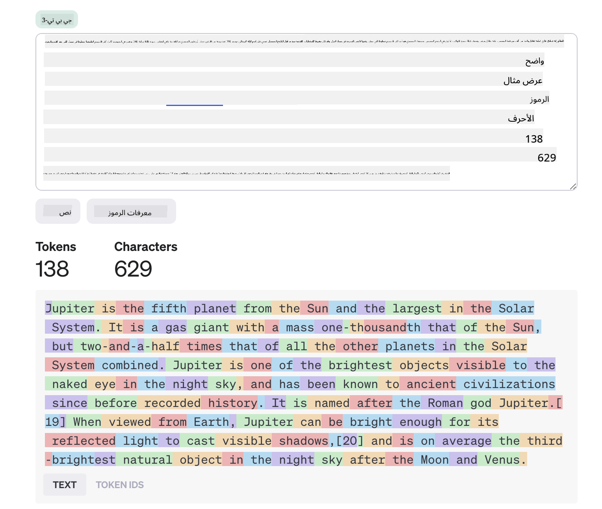
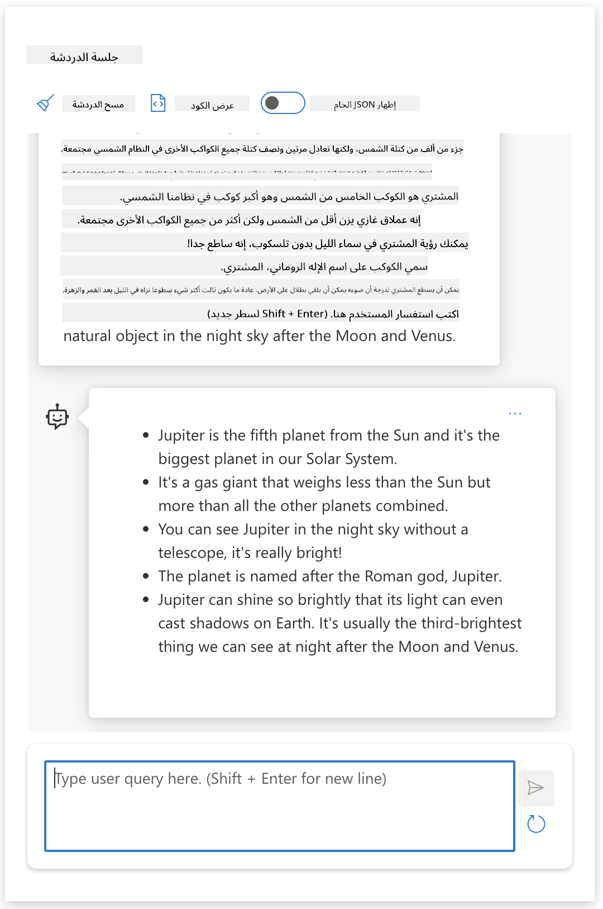
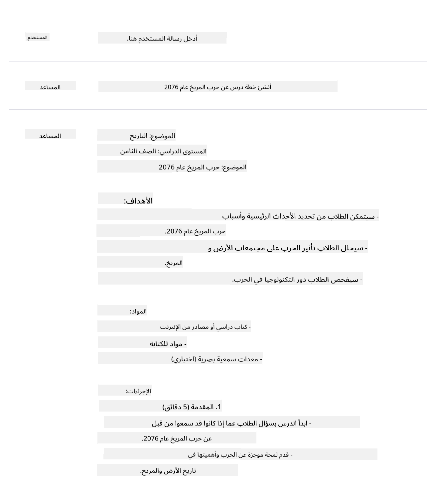
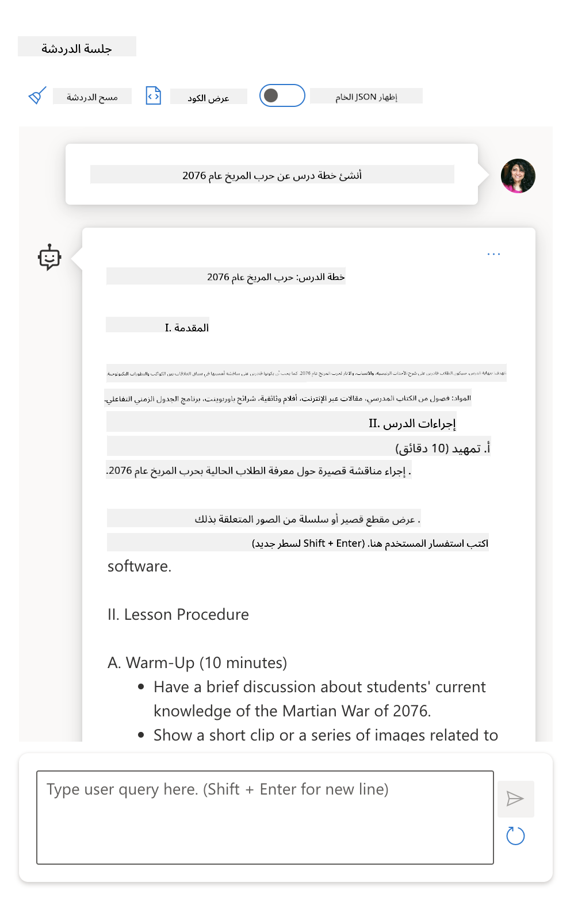
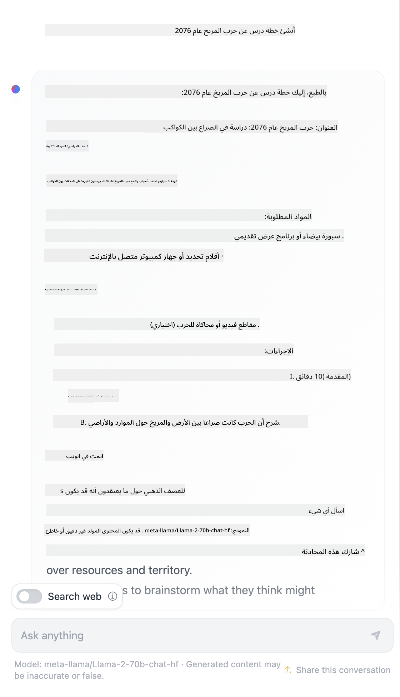

<!--
CO_OP_TRANSLATOR_METADATA:
{
  "original_hash": "0135e6c271f3ece8699050d4debbce88",
  "translation_date": "2025-10-17T12:55:16+00:00",
  "source_file": "04-prompt-engineering-fundamentals/README.md",
  "language_code": "ar"
}
-->
# أساسيات هندسة التوجيه

[](https://youtu.be/GElCu2kUlRs?si=qrXsBvXnCW12epb8)

## المقدمة
يغطي هذا الفصل مفاهيم وتقنيات أساسية لإنشاء توجيهات فعالة لنماذج الذكاء الاصطناعي التوليدي. الطريقة التي تكتب بها التوجيه لنموذج اللغة الكبير (LLM) لها تأثير كبير. يمكن للتوجيه المصمم بعناية أن يحقق استجابة ذات جودة أفضل. ولكن ماذا تعني مصطلحات مثل _التوجيه_ و_هندسة التوجيه_؟ وكيف يمكنني تحسين مدخلات التوجيه التي أرسلها إلى النموذج؟ هذه هي الأسئلة التي سنحاول الإجابة عليها في هذا الفصل والفصل التالي.

الذكاء الاصطناعي التوليدي قادر على إنشاء محتوى جديد (مثل النصوص، الصور، الصوت، الأكواد، إلخ) استجابةً لطلبات المستخدم. يتم تحقيق ذلك باستخدام نماذج اللغة الكبيرة مثل سلسلة GPT ("المحول المدرب مسبقًا التوليدي") من OpenAI التي تم تدريبها على استخدام اللغة الطبيعية والأكواد.

يمكن للمستخدمين الآن التفاعل مع هذه النماذج باستخدام أنماط مألوفة مثل الدردشة، دون الحاجة إلى أي خبرة تقنية أو تدريب. تعتمد النماذج على _التوجيه_ - حيث يرسل المستخدمون إدخال نصي (توجيه) ويحصلون على استجابة الذكاء الاصطناعي (الإكمال). يمكنهم بعد ذلك "الدردشة مع الذكاء الاصطناعي" بشكل تكراري، في محادثات متعددة، لتحسين التوجيه حتى تتطابق الاستجابة مع توقعاتهم.

أصبحت "التوجيهات" الآن الواجهة البرمجية الأساسية لتطبيقات الذكاء الاصطناعي التوليدي، حيث تخبر النماذج بما يجب القيام به وتؤثر على جودة الردود المقدمة. "هندسة التوجيه" هي مجال دراسة سريع النمو يركز على _تصميم وتحسين_ التوجيهات لتقديم ردود متسقة وعالية الجودة على نطاق واسع.

## أهداف التعلم

في هذا الدرس، سنتعلم ما هي هندسة التوجيه، ولماذا هي مهمة، وكيف يمكننا صياغة توجيهات أكثر فعالية لنموذج معين وهدف تطبيق محدد. سنفهم المفاهيم الأساسية وأفضل الممارسات لهندسة التوجيه - ونتعرف على بيئة "صندوق الرمل" التفاعلية في Jupyter Notebooks حيث يمكننا تطبيق هذه المفاهيم على أمثلة حقيقية.

بنهاية هذا الدرس، سنكون قادرين على:

1. شرح ما هي هندسة التوجيه ولماذا هي مهمة.
2. وصف مكونات التوجيه وكيفية استخدامها.
3. تعلم أفضل الممارسات والتقنيات لهندسة التوجيه.
4. تطبيق التقنيات المكتسبة على أمثلة حقيقية باستخدام نقطة نهاية OpenAI.

## المصطلحات الرئيسية

هندسة التوجيه: ممارسة تصميم وتحسين المدخلات لتوجيه نماذج الذكاء الاصطناعي نحو إنتاج المخرجات المطلوبة.  
التجزئة: عملية تحويل النص إلى وحدات أصغر، تُسمى الرموز، يمكن للنموذج فهمها ومعالجتها.  
نماذج اللغة الكبيرة المعدلة بالتعليمات: نماذج اللغة الكبيرة (LLMs) التي تم تحسينها بتعليمات محددة لتحسين دقة الردود وملاءمتها.

## صندوق التعلم

هندسة التوجيه هي حاليًا أكثر فنًا من كونها علمًا. أفضل طريقة لتحسين حدسنا لها هي _الممارسة أكثر_ واعتماد نهج التجربة والخطأ الذي يجمع بين خبرة المجال التطبيقي والتقنيات الموصى بها والتحسينات الخاصة بالنموذج.

يوفر دفتر Jupyter Notebook المرافق لهذا الدرس بيئة _صندوق الرمل_ حيث يمكنك تجربة ما تعلمته - أثناء تقدمك أو كجزء من تحدي الكود في النهاية. لتنفيذ التمارين، ستحتاج إلى:

1. **مفتاح API لـ Azure OpenAI** - نقطة النهاية للخدمة لنموذج LLM المنشور.  
2. **بيئة تشغيل Python** - حيث يمكن تنفيذ الدفتر.  
3. **متغيرات البيئة المحلية** - _أكمل [الإعداد](./../00-course-setup/02-setup-local.md?WT.mc_id=academic-105485-koreyst) الآن لتكون جاهزًا_.  

يأتي الدفتر مع تمارين _بداية_ - ولكن يُشجعك على إضافة أقسام _Markdown_ (وصف) و_Code_ (طلبات التوجيه) الخاصة بك لتجربة المزيد من الأمثلة أو الأفكار - وبناء حدسك لتصميم التوجيه.

## دليل مصور

هل تريد الحصول على صورة عامة لما يغطيه هذا الدرس قبل أن تغوص فيه؟ تحقق من هذا الدليل المصور، الذي يمنحك فكرة عن الموضوعات الرئيسية التي يتم تناولها والنقاط الرئيسية التي يجب التفكير فيها في كل منها. يأخذك مخطط الدرس من فهم المفاهيم الأساسية والتحديات إلى معالجتها باستخدام تقنيات هندسة التوجيه ذات الصلة وأفضل الممارسات. لاحظ أن قسم "التقنيات المتقدمة" في هذا الدليل يشير إلى المحتوى الذي يتم تغطيته في الفصل _التالي_ من هذا المنهج.


## شركتنا الناشئة

الآن، دعونا نتحدث عن كيفية ارتباط _هذا الموضوع_ بمهمة شركتنا الناشئة [لجلب الابتكار في الذكاء الاصطناعي إلى التعليم](https://educationblog.microsoft.com/2023/06/collaborating-to-bring-ai-innovation-to-education?WT.mc_id=academic-105485-koreyst). نريد بناء تطبيقات تعليمية مدعومة بالذكاء الاصطناعي لتوفير _تعلم مخصص_ - لذا دعونا نفكر في كيفية "تصميم" التوجيهات من قبل المستخدمين المختلفين لتطبيقنا:

- **المسؤولون** قد يطلبون من الذكاء الاصطناعي _تحليل بيانات المناهج لتحديد الفجوات في التغطية_. يمكن للذكاء الاصطناعي تلخيص النتائج أو تصويرها باستخدام الأكواد.  
- **المعلمون** قد يطلبون من الذكاء الاصطناعي _إنشاء خطة درس لجمهور مستهدف وموضوع معين_. يمكن للذكاء الاصطناعي بناء خطة مخصصة بتنسيق محدد.  
- **الطلاب** قد يطلبون من الذكاء الاصطناعي _تدريسهم في موضوع صعب_. يمكن للذكاء الاصطناعي الآن توجيه الطلاب بدروس ونصائح وأمثلة تناسب مستواهم.  

وهذا مجرد غيض من فيض. تحقق من [توجيهات للتعليم](https://github.com/microsoft/prompts-for-edu/tree/main?WT.mc_id=academic-105485-koreyst) - مكتبة توجيهات مفتوحة المصدر تم تنسيقها بواسطة خبراء التعليم - للحصول على فكرة أوسع عن الإمكانيات! _جرب تشغيل بعض تلك التوجيهات في صندوق الرمل أو باستخدام OpenAI Playground لترى ما يحدث!_

## ما هي هندسة التوجيه؟

بدأنا هذا الدرس بتعريف **هندسة التوجيه** كعملية _تصميم وتحسين_ المدخلات النصية (التوجيهات) لتقديم ردود متسقة وعالية الجودة (إكمالات) لهدف تطبيق معين ونموذج. يمكننا التفكير في هذا كعملية من خطوتين:

- _تصميم_ التوجيه الأولي لنموذج معين وهدف معين  
- _تحسين_ التوجيه بشكل تكراري لتحسين جودة الاستجابة  

هذه العملية تعتمد بالضرورة على التجربة والخطأ وتتطلب حدس المستخدم وجهوده للحصول على أفضل النتائج. فلماذا هي مهمة؟ للإجابة على هذا السؤال، نحتاج أولاً إلى فهم ثلاثة مفاهيم:

- _التجزئة_ = كيف يرى النموذج التوجيه  
- _نماذج LLM الأساسية_ = كيف يعالج نموذج الأساس التوجيه  
- _نماذج LLM المعدلة بالتعليمات_ = كيف يمكن للنموذج الآن رؤية "المهام"  

### التجزئة

يرى نموذج اللغة الكبير التوجيهات كسلسلة من _الرموز_ حيث يمكن للنماذج المختلفة (أو إصدارات النموذج) أن تقوم بتجزئة نفس التوجيه بطرق مختلفة. نظرًا لأن نماذج اللغة الكبيرة يتم تدريبها على الرموز (وليس النص الخام)، فإن الطريقة التي يتم بها تجزئة التوجيهات لها تأثير مباشر على جودة الاستجابة المولدة.

للحصول على حدس حول كيفية عمل التجزئة، جرب أدوات مثل [OpenAI Tokenizer](https://platform.openai.com/tokenizer?WT.mc_id=academic-105485-koreyst) الموضحة أدناه. انسخ توجيهك - وشاهد كيف يتم تحويله إلى رموز، مع الانتباه إلى كيفية التعامل مع أحرف المسافات وعلامات الترقيم. لاحظ أن هذا المثال يظهر نموذجًا أقدم (GPT-3) - لذا فإن تجربة هذا مع نموذج أحدث قد تنتج نتيجة مختلفة.



### المفهوم: نماذج الأساس

بمجرد تجزئة التوجيه، فإن الوظيفة الأساسية لـ ["نموذج LLM الأساسي"](https://blog.gopenai.com/an-introduction-to-base-and-instruction-tuned-large-language-models-8de102c785a6?WT.mc_id=academic-105485-koreyst) (أو نموذج الأساس) هي التنبؤ بالرمز التالي في تلك السلسلة. نظرًا لأن نماذج اللغة الكبيرة يتم تدريبها على مجموعات بيانات نصية ضخمة، فإن لديها فهمًا جيدًا للعلاقات الإحصائية بين الرموز ويمكنها إجراء هذا التنبؤ بثقة معينة. لاحظ أنها لا تفهم _معنى_ الكلمات في التوجيه أو الرمز؛ بل ترى نمطًا يمكنها "إكماله" بتنبؤها التالي. يمكنها الاستمرار في التنبؤ بالسلسلة حتى يتم إنهاؤها بواسطة تدخل المستخدم أو شرط محدد مسبقًا.

هل تريد أن ترى كيف يعمل الإكمال القائم على التوجيه؟ أدخل التوجيه أعلاه في [_Chat Playground_](https://oai.azure.com/playground?WT.mc_id=academic-105485-koreyst) في Azure OpenAI Studio مع الإعدادات الافتراضية. النظام مهيأ للتعامل مع التوجيهات كطلبات للحصول على معلومات - لذا يجب أن ترى إكمالًا يلبي هذا السياق.

ولكن ماذا لو أراد المستخدم رؤية شيء محدد يلبي بعض المعايير أو هدف المهمة؟ هنا تأتي نماذج LLM المعدلة بالتعليمات إلى الصورة.


### المفهوم: نماذج LLM المعدلة بالتعليمات

يبدأ [نموذج LLM المعدل بالتعليمات](https://blog.gopenai.com/an-introduction-to-base-and-instruction-tuned-large-language-models-8de102c785a6?WT.mc_id=academic-105485-koreyst) بنموذج الأساس ويقوم بتحسينه باستخدام أمثلة أو أزواج إدخال/إخراج (مثل "رسائل" متعددة الأدوار) التي يمكن أن تحتوي على تعليمات واضحة - ويقوم الذكاء الاصطناعي بمحاولة اتباع تلك التعليمات.

يستخدم هذا تقنيات مثل التعلم المعزز مع ردود الفعل البشرية (RLHF) التي يمكنها تدريب النموذج على _اتباع التعليمات_ و_التعلم من الردود_ بحيث ينتج استجابات أكثر ملاءمة للتطبيقات العملية وأكثر ارتباطًا بأهداف المستخدم.

دعونا نجرب ذلك - أعد النظر في التوجيه أعلاه، ولكن الآن قم بتغيير _رسالة النظام_ لتوفير التعليمات التالية كالسياق:

> _قم بتلخيص المحتوى الذي يتم تقديمه لك لطالب في الصف الثاني. اجعل النتيجة فقرة واحدة تحتوي على 3-5 نقاط رئيسية._

شاهد كيف أن النتيجة الآن معدلة لتعكس الهدف والتنسيق المطلوب؟ يمكن للمعلم الآن استخدام هذه الاستجابة مباشرة في شرائح العرض لتلك الحصة.



## لماذا نحتاج إلى هندسة التوجيه؟

الآن بعد أن عرفنا كيف يتم معالجة التوجيهات بواسطة نماذج اللغة الكبيرة، دعونا نتحدث عن _لماذا_ نحتاج إلى هندسة التوجيه. الإجابة تكمن في حقيقة أن نماذج اللغة الكبيرة الحالية تواجه عددًا من التحديات التي تجعل تحقيق _الإكمالات الموثوقة والمتسقة_ أكثر صعوبة دون بذل جهد في بناء وتحسين التوجيه. على سبيل المثال:

1. **استجابات النموذج عشوائية.** من المحتمل أن ينتج _نفس التوجيه_ استجابات مختلفة مع نماذج مختلفة أو إصدارات مختلفة من النموذج. وقد ينتج أيضًا نتائج مختلفة مع _نفس النموذج_ في أوقات مختلفة. _تقنيات هندسة التوجيه يمكن أن تساعدنا في تقليل هذه التباينات من خلال توفير حدود أفضل_.  

1. **النماذج قد تختلق استجابات.** يتم تدريب النماذج مسبقًا على مجموعات بيانات _كبيرة ولكن محدودة_، مما يعني أنها تفتقر إلى المعرفة حول المفاهيم خارج نطاق التدريب. نتيجة لذلك، يمكن أن تنتج إكمالات غير دقيقة أو خيالية أو متناقضة مباشرة مع الحقائق المعروفة. _تقنيات هندسة التوجيه تساعد المستخدمين على تحديد وتخفيف مثل هذه الاختلاقات، على سبيل المثال، من خلال طلب مراجع أو تبريرات من الذكاء الاصطناعي_.  

1. **قدرات النماذج ستختلف.** النماذج الأحدث أو أجيال النماذج ستتمتع بقدرات أغنى ولكنها ستجلب أيضًا خصائص فريدة وتنازلات في التكلفة والتعقيد. _هندسة التوجيه يمكن أن تساعدنا في تطوير أفضل الممارسات وسير العمل التي تتجاوز الفروقات وتتكيف مع متطلبات النموذج الخاصة بطرق قابلة للتوسع وسلسة_.  

دعونا نرى هذا عمليًا في OpenAI أو Azure OpenAI Playground:

- استخدم نفس التوجيه مع عمليات نشر LLM مختلفة (مثل OpenAI، Azure OpenAI، Hugging Face) - هل لاحظت التباينات؟  
- استخدم نفس التوجيه بشكل متكرر مع نفس عملية نشر LLM (مثل Azure OpenAI Playground) - كيف اختلفت هذه التباينات؟  

### مثال على الاختلاقات

في هذه الدورة، نستخدم مصطلح **"الاختلاق"** للإشارة إلى الظاهرة التي تولد فيها نماذج اللغة الكبيرة معلومات غير صحيحة بسبب قيود في تدريبها أو عوامل أخرى. قد تكون قد سمعت أيضًا عن هذا المصطلح باسم _"الهلوسة"_ في المقالات الشعبية أو الأوراق البحثية. ومع ذلك، نوصي بشدة باستخدام مصطلح _"الاختلاق"_ حتى لا ننسب سلوكًا يشبه الإنسان إلى نتيجة مدفوعة بالآلة. هذا يعزز أيضًا [إرشادات الذكاء الاصطناعي المسؤول](https://www.microsoft.com/ai/responsible-ai?WT.mc_id=academic-105485-koreyst) من منظور المصطلحات، مما يزيل المصطلحات التي قد تعتبر مسيئة أو غير شاملة في بعض السياقات.

هل تريد الحصول على فكرة عن كيفية عمل الاختلاقات؟ فكر في توجيه يطلب من الذكاء الاصطناعي إنشاء محتوى لموضوع غير موجود (لضمان عدم وجوده في مجموعة بيانات التدريب). على سبيل المثال - جربت هذا التوجيه:

> **التوجيه:** قم بإنشاء خطة درس عن حرب المريخ لعام 2076.
أظهرت لي عملية البحث على الإنترنت وجود روايات خيالية (مثل المسلسلات التلفزيونية أو الكتب) عن حروب المريخ - ولكن لا شيء منها في عام 2076. المنطق السليم يخبرنا أن عام 2076 هو _في المستقبل_ وبالتالي لا يمكن ربطه بحدث حقيقي.

إذن ماذا يحدث عندما نجرب هذا الطلب مع مزودي نماذج اللغة المختلفة؟

> **الرد الأول**: OpenAI Playground (GPT-35)



> **الرد الثاني**: Azure OpenAI Playground (GPT-35)



> **الرد الثالث**: Hugging Face Chat Playground (LLama-2)



كما هو متوقع، كل نموذج (أو إصدار النموذج) ينتج ردودًا مختلفة قليلاً بفضل السلوك العشوائي وتفاوت قدرات النموذج. على سبيل المثال، يستهدف أحد النماذج جمهورًا في الصف الثامن بينما يفترض الآخر جمهورًا من طلاب الثانوية. ولكن جميع النماذج الثلاثة قدمت ردودًا قد تقنع مستخدمًا غير مطلع بأن الحدث كان حقيقيًا.

تقنيات هندسة الطلب مثل _metaprompting_ و _temperature configuration_ قد تقلل من اختلاقات النموذج إلى حد ما. كما أن هندسة الطلب الجديدة _architectures_ تدمج أدوات وتقنيات جديدة بسلاسة في تدفق الطلب، لتخفيف أو تقليل بعض هذه التأثيرات.

## دراسة حالة: GitHub Copilot

لنختتم هذا القسم بالحصول على فكرة عن كيفية استخدام هندسة الطلب في الحلول الواقعية من خلال دراسة حالة: [GitHub Copilot](https://github.com/features/copilot?WT.mc_id=academic-105485-koreyst).

GitHub Copilot هو "مساعد البرمجة بالذكاء الاصطناعي" - يحول طلبات النصوص إلى إكمالات للرمز ومتكامل في بيئة التطوير الخاصة بك (مثل Visual Studio Code) لتجربة مستخدم سلسة. كما هو موثق في سلسلة المدونات أدناه، كان الإصدار الأول يعتمد على نموذج OpenAI Codex - حيث أدرك المهندسون بسرعة الحاجة إلى تحسين النموذج وتطوير تقنيات هندسة الطلب لتحسين جودة الكود. في يوليو، [أطلقوا نموذج ذكاء اصطناعي محسن يتجاوز Codex](https://github.blog/2023-07-28-smarter-more-efficient-coding-github-copilot-goes-beyond-codex-with-improved-ai-model/?WT.mc_id=academic-105485-koreyst) لتقديم اقتراحات أسرع.

اقرأ المنشورات بالترتيب لتتبع رحلتهم التعليمية.

- **مايو 2023** | [GitHub Copilot يتحسن في فهم الكود الخاص بك](https://github.blog/2023-05-17-how-github-copilot-is-getting-better-at-understanding-your-code/?WT.mc_id=academic-105485-koreyst)
- **مايو 2023** | [داخل GitHub: العمل مع نماذج اللغة الكبيرة وراء GitHub Copilot](https://github.blog/2023-05-17-inside-github-working-with-the-llms-behind-github-copilot/?WT.mc_id=academic-105485-koreyst).
- **يونيو 2023** | [كيفية كتابة طلبات أفضل لـ GitHub Copilot](https://github.blog/2023-06-20-how-to-write-better-prompts-for-github-copilot/?WT.mc_id=academic-105485-koreyst).
- **يوليو 2023** | [GitHub Copilot يتجاوز Codex مع نموذج ذكاء اصطناعي محسن](https://github.blog/2023-07-28-smarter-more-efficient-coding-github-copilot-goes-beyond-codex-with-improved-ai-model/?WT.mc_id=academic-105485-koreyst)
- **يوليو 2023** | [دليل المطور لهندسة الطلب ونماذج اللغة الكبيرة](https://github.blog/2023-07-17-prompt-engineering-guide-generative-ai-llms/?WT.mc_id=academic-105485-koreyst)
- **سبتمبر 2023** | [كيفية بناء تطبيق مؤسسي لنماذج اللغة الكبيرة: دروس من GitHub Copilot](https://github.blog/2023-09-06-how-to-build-an-enterprise-llm-application-lessons-from-github-copilot/?WT.mc_id=academic-105485-koreyst)

يمكنك أيضًا تصفح [مدونة الهندسة الخاصة بهم](https://github.blog/category/engineering/?WT.mc_id=academic-105485-koreyst) للحصول على المزيد من المنشورات مثل [هذا المنشور](https://github.blog/2023-09-27-how-i-used-github-copilot-chat-to-build-a-reactjs-gallery-prototype/?WT.mc_id=academic-105485-koreyst) الذي يوضح كيف يتم _تطبيق_ هذه النماذج والتقنيات لدفع التطبيقات الواقعية.

---

## بناء الطلب

لقد رأينا لماذا هندسة الطلب مهمة - الآن دعونا نفهم كيف يتم _بناء_ الطلبات حتى نتمكن من تقييم تقنيات مختلفة لتصميم طلبات أكثر فعالية.

### الطلب الأساسي

لنبدأ بالطلب الأساسي: إدخال نصي يتم إرساله إلى النموذج دون أي سياق آخر. إليك مثال - عندما نرسل الكلمات الأولى من النشيد الوطني الأمريكي إلى [واجهة برمجة التطبيقات للإكمال](https://platform.openai.com/docs/api-reference/completions?WT.mc_id=academic-105485-koreyst) فإنها تكمل الرد فورًا بالكلمات التالية، مما يوضح سلوك التنبؤ الأساسي.

| الطلب (الإدخال)     | الإكمال (الإخراج)                                                                                                                        |
| :----------------- | :----------------------------------------------------------------------------------------------------------------------------------------- |
| Oh say can you see | يبدو أنك تبدأ كلمات "The Star-Spangled Banner"، النشيد الوطني للولايات المتحدة. الكلمات الكاملة هي ... |

### الطلب المعقد

الآن دعونا نضيف سياقًا وتعليمات إلى الطلب الأساسي. [واجهة برمجة التطبيقات لإكمال المحادثة](https://learn.microsoft.com/azure/ai-services/openai/how-to/chatgpt?WT.mc_id=academic-105485-koreyst) تتيح لنا بناء طلب معقد كمجموعة من _الرسائل_ مع:

- أزواج الإدخال/الإخراج التي تعكس إدخال _المستخدم_ ورد _المساعد_.
- رسالة النظام التي تحدد سياق سلوك أو شخصية المساعد.

الطلب الآن في الشكل أدناه، حيث أن _التجزئة_ تلتقط بشكل فعال المعلومات ذات الصلة من السياق والمحادثة. الآن، يمكن أن يكون تغيير سياق النظام مؤثرًا على جودة الإكمالات بقدر تأثير إدخالات المستخدم المقدمة.

```python
response = openai.chat.completions.create(
    model="gpt-3.5-turbo",
    messages=[
        {"role": "system", "content": "You are a helpful assistant."},
        {"role": "user", "content": "Who won the world series in 2020?"},
        {"role": "assistant", "content": "The Los Angeles Dodgers won the World Series in 2020."},
        {"role": "user", "content": "Where was it played?"}
    ]
)
```

### طلب التعليمات

في الأمثلة أعلاه، كان طلب المستخدم عبارة عن استفسار نصي بسيط يمكن تفسيره كطلب للحصول على معلومات. مع طلبات _التعليمات_، يمكننا استخدام هذا النص لتحديد مهمة بمزيد من التفاصيل، مما يوفر توجيهًا أفضل للذكاء الاصطناعي. إليك مثال:

| الطلب (الإدخال)                                                                                                                                                                                                                         | الإكمال (الإخراج)                                                                                                        | نوع التعليمات       |
| :------------------------------------------------------------------------------------------------------------------------------------------------------------------------------------------------------------------------------------- | :------------------------------------------------------------------------------------------------------------------------- | :------------------ |
| اكتب وصفًا للحرب الأهلية                                                                                                                                                                                                   | _تم إرجاع فقرة بسيطة_                                                                                              | بسيط              |
| اكتب وصفًا للحرب الأهلية. قدم تواريخ وأحداث رئيسية ووصف أهميتها                                                                                                                                     | _تم إرجاع فقرة تليها قائمة بتواريخ الأحداث الرئيسية مع وصف_                                             | معقد             |
| اكتب وصفًا للحرب الأهلية في فقرة واحدة. قدم 3 نقاط رئيسية مع التواريخ وأهميتها. قدم 3 نقاط أخرى مع الشخصيات التاريخية الرئيسية ومساهماتهم. أعد الإخراج كملف JSON | _تم إرجاع تفاصيل أكثر شمولاً في مربع نص، تم تنسيقه كـ JSON يمكن نسخه ولصقه في ملف والتحقق من صحته حسب الحاجة_ | معقد. منسق. |

## المحتوى الأساسي

في الأمثلة أعلاه، كان الطلب لا يزال مفتوحًا إلى حد ما، مما يسمح لنموذج اللغة الكبير بتحديد أي جزء من مجموعة بياناته المدربة مسبقًا كان ذا صلة. مع نمط تصميم _المحتوى الأساسي_، يتم تقسيم النص المدخل إلى جزأين:

- تعليمات (إجراء)
- محتوى ذو صلة (يؤثر على الإجراء)

إليك مثال حيث تكون التعليمات هي "لخص هذا في جملتين".

| الطلب (الإدخال)                                                                                                                                                                                                                                                                                                                                                                                                                                                                                                                                                                                                                                                                                      | الإكمال (الإخراج)                                                                                                                                                                                                                                                                             |
| :-------------------------------------------------------------------------------------------------------------------------------------------------------------------------------------------------------------------------------------------------------------------------------------------------------------------------------------------------------------------------------------------------------------------------------------------------------------------------------------------------------------------------------------------------------------------------------------------------------------------------------------------------------------------------------------------------- | :---------------------------------------------------------------------------------------------------------------------------------------------------------------------------------------------------------------------------------------------------------------------------------------------- |
| المشتري هو الكوكب الخامس من الشمس وأكبر كوكب في النظام الشمسي. إنه عملاق غازي بكتلة تعادل واحد من ألف من كتلة الشمس، ولكنه يعادل ضعفين ونصف من كتلة جميع الكواكب الأخرى في النظام الشمسي مجتمعة. المشتري هو واحد من أكثر الأجسام سطوعًا التي يمكن رؤيتها بالعين المجردة في السماء الليلية، وقد عرفته الحضارات القديمة منذ ما قبل التاريخ المسجل. سمي على اسم الإله الروماني المشتري. عندما يُرى من الأرض، يمكن أن يكون المشتري ساطعًا بما يكفي ليعكس الضوء الذي يلقي بظلال مرئية، وهو في المتوسط ثالث أكثر الأجسام الطبيعية سطوعًا في السماء الليلية بعد القمر والزهرة. <br/> **لخص هذا في جملتين قصيرتين** | المشتري، الكوكب الخامس من الشمس، هو الأكبر في النظام الشمسي ويُعرف بكونه واحدًا من أكثر الأجسام سطوعًا في السماء الليلية. سمي على اسم الإله الروماني المشتري، وهو عملاق غازي بكتلة تعادل ضعفين ونصف من كتلة جميع الكواكب الأخرى مجتمعة. |

يمكن استخدام جزء المحتوى الأساسي بطرق مختلفة لتحفيز تعليمات أكثر فعالية:

- **أمثلة** - بدلاً من إخبار النموذج بما يجب فعله بتعليمات صريحة، قدم له أمثلة عما يجب فعله ودعه يستنتج النمط.
- **إشارات** - اتبع التعليمات بـ "إشارة" توجه الإكمال، مما يوجه النموذج نحو ردود أكثر صلة.
- **قوالب** - هذه وصفات قابلة للتكرار للطلبات مع أماكن فارغة (متغيرات) يمكن تخصيصها بالبيانات لاستخدامات محددة.

دعونا نستكشف هذه الطرق عمليًا.

### استخدام الأمثلة

هذه طريقة تستخدم فيها المحتوى الأساسي "لتغذية النموذج" ببعض الأمثلة على الإخراج المطلوب لمهمة معينة، ودعه يستنتج النمط للإخراج المطلوب. بناءً على عدد الأمثلة المقدمة، يمكن أن يكون لدينا طلب بدون أمثلة، طلب بمثال واحد، طلب بعدة أمثلة، إلخ.

يتكون الطلب الآن من ثلاثة مكونات:

- وصف المهمة
- بعض الأمثلة على الإخراج المطلوب
- بداية مثال جديد (يصبح وصفًا ضمنيًا للمهمة)

| نوع التعلم | الطلب (الإدخال)                                                                                                                                        | الإكمال (الإخراج)         |
| :------------ | :---------------------------------------------------------------------------------------------------------------------------------------------------- | :-------------------------- |
| بدون أمثلة     | "الشمس مشرقة". ترجم إلى الإسبانية                                                                                                            | "El Sol está brillando".    |
| بمثال واحد      | "الشمس مشرقة" => ""El Sol está brillando". <br> "إنه يوم بارد وعاصف" =>                                                                 | "Es un día frío y ventoso". |
| بعدة أمثلة      | اللاعب ركض القواعد => البيسبول <br/> اللاعب ضرب إيس => التنس <br/> اللاعب ضرب ستة => الكريكيت <br/> اللاعب قام بضربة ساحقة => | كرة السلة                  |
|               |                                                                                                                                                       |                             |

لاحظ كيف كان علينا تقديم تعليمات صريحة ("ترجم إلى الإسبانية") في طلب بدون أمثلة، ولكن يتم استنتاجها في مثال الطلب بمثال واحد. يظهر المثال بعدة أمثلة كيف أن إضافة المزيد من الأمثلة يسمح للنماذج باستنتاجات أكثر دقة دون تعليمات إضافية.

### إشارات الطلب

تقنية أخرى لاستخدام المحتوى الأساسي هي تقديم _إشارات_ بدلاً من الأمثلة. في هذه الحالة، نحن نعطي النموذج دفعة في الاتجاه الصحيح من خلال _بدءه_ بمقتطف يعكس تنسيق الرد المطلوب. ثم يأخذ النموذج "الإشارة" ليكمل بنفس الطريقة.

| عدد الإشارات | الطلب (الإدخال)                                                                                                                                                                                                                                                                                                                                                                                                                                               | الإكمال (الإخراج)                                                                                                                                                                                                                                                                                       |
| :------------- | :----------------------------------------------------------------------------------------------------------------------------------------------------------------------------------------------------------------------------------------------------------------------------------------------------------------------------------------------------------------------------------------------------------------------------------------------------------- | :-------------------------------------------------------------------------------------------------------------------------------------------------------------------------------------------------------------------------------------------------------------------------------------------------------- |
| 0              | المشتري هو الكوك
| 1              | كوكب المشتري هو الكوكب الخامس من الشمس وأكبر كوكب في النظام الشمسي. إنه عملاق غازي بكتلة تعادل واحد على ألف من كتلة الشمس، ولكنه يعادل مرتين ونصف كتلة جميع الكواكب الأخرى في النظام الشمسي مجتمعة. كوكب المشتري هو واحد من أكثر الأجسام سطوعًا التي يمكن رؤيتها بالعين المجردة في السماء الليلية، وقد كان معروفًا لدى الحضارات القديمة منذ ما قبل التاريخ المسجل. <br/>**ملخص** <br/> ما تعلمناه هو أن كوكب المشتري | هو الكوكب الخامس من الشمس وأكبر كوكب في النظام الشمسي. إنه عملاق غازي بكتلة تعادل واحد على ألف من كتلة الشمس، ولكنه يعادل مرتين ونصف كتلة جميع الكواكب الأخرى مجتمعة. يمكن رؤيته بسهولة بالعين المجردة وكان معروفًا منذ العصور القديمة.                        |
| 2              | كوكب المشتري هو الكوكب الخامس من الشمس وأكبر كوكب في النظام الشمسي. إنه عملاق غازي بكتلة تعادل واحد على ألف من كتلة الشمس، ولكنه يعادل مرتين ونصف كتلة جميع الكواكب الأخرى في النظام الشمسي مجتمعة. كوكب المشتري هو واحد من أكثر الأجسام سطوعًا التي يمكن رؤيتها بالعين المجردة في السماء الليلية، وقد كان معروفًا لدى الحضارات القديمة منذ ما قبل التاريخ المسجل. <br/>**ملخص** <br/> أهم 3 حقائق تعلمناها:         | 1. كوكب المشتري هو الكوكب الخامس من الشمس وأكبر كوكب في النظام الشمسي. <br/> 2. إنه عملاق غازي بكتلة تعادل واحد على ألف من كتلة الشمس...<br/> 3. كوكب المشتري كان مرئيًا بالعين المجردة منذ العصور القديمة ...                                                                       |
|                |                                                                                                                                                                                                                                                                                                                                                                                                                                                              |                                                                                                                                                                                                                                                                                                           |

### قوالب التعليمات

قالب التعليمات هو _وصفة محددة مسبقًا للتعليمات_ يمكن تخزينها وإعادة استخدامها حسب الحاجة، لتحقيق تجارب مستخدم أكثر اتساقًا على نطاق واسع. في أبسط أشكاله، هو مجرد مجموعة من أمثلة التعليمات مثل [هذا المثال من OpenAI](https://platform.openai.com/examples?WT.mc_id=academic-105485-koreyst) الذي يوفر مكونات التعليمات التفاعلية (رسائل المستخدم والنظام) وتنسيق الطلب المدفوع بواسطة API - لدعم إعادة الاستخدام.

في شكله الأكثر تعقيدًا مثل [هذا المثال من LangChain](https://python.langchain.com/docs/concepts/prompt_templates/?WT.mc_id=academic-105485-koreyst) يحتوي على _أماكن فارغة_ يمكن استبدالها ببيانات من مصادر متنوعة (مدخلات المستخدم، سياق النظام، مصادر بيانات خارجية، إلخ) لإنشاء تعليمات ديناميكية. هذا يسمح لنا بإنشاء مكتبة من التعليمات القابلة لإعادة الاستخدام التي يمكن استخدامها لتحقيق تجارب مستخدم متسقة **برمجيًا** على نطاق واسع.

أخيرًا، تكمن القيمة الحقيقية للقوالب في القدرة على إنشاء ونشر _مكتبات التعليمات_ لتطبيقات المجالات العمودية - حيث يتم الآن _تحسين_ قالب التعليمات ليعكس سياق أو أمثلة خاصة بالتطبيق تجعل الردود أكثر صلة ودقة لجمهور المستخدم المستهدف. مستودع [Prompts For Edu](https://github.com/microsoft/prompts-for-edu?WT.mc_id=academic-105485-koreyst) هو مثال رائع على هذا النهج، حيث يتم تنسيق مكتبة من التعليمات لمجال التعليم مع التركيز على أهداف رئيسية مثل تخطيط الدروس، تصميم المناهج الدراسية، تدريس الطلاب، إلخ.

## المحتوى الداعم

إذا فكرنا في بناء التعليمات على أنه يحتوي على تعليمات (مهمة) وهدف (محتوى أساسي)، فإن _المحتوى الثانوي_ يشبه السياق الإضافي الذي نقدمه **للتأثير على النتيجة بطريقة ما**. يمكن أن يكون ذلك معلمات ضبط، تعليمات التنسيق، تصنيفات الموضوعات، إلخ، التي يمكن أن تساعد النموذج على _تخصيص_ استجابته لتناسب أهداف أو توقعات المستخدم المطلوبة.

على سبيل المثال: بالنظر إلى كتالوج دورة يحتوي على بيانات وصفية واسعة (الاسم، الوصف، المستوى، علامات البيانات الوصفية، المدرب، إلخ) لجميع الدورات المتاحة في المنهج الدراسي:

- يمكننا تحديد تعليمات لـ "تلخيص كتالوج الدورة لفصل الخريف 2023"
- يمكننا استخدام المحتوى الأساسي لتقديم بعض الأمثلة على النتيجة المطلوبة
- يمكننا استخدام المحتوى الثانوي لتحديد أهم 5 "علامات" ذات اهتمام.

الآن، يمكن للنموذج تقديم ملخص بالتنسيق الموضح بواسطة الأمثلة القليلة - ولكن إذا كانت النتيجة تحتوي على علامات متعددة، يمكنه إعطاء الأولوية للعلامات الخمس المحددة في المحتوى الثانوي.

---

<!--
قالب الدرس:
يجب أن يغطي هذا الوحدة المفهوم الأساسي #1.
تعزيز المفهوم بأمثلة ومراجع.

المفهوم #3:
تقنيات هندسة التعليمات.
ما هي بعض التقنيات الأساسية لهندسة التعليمات؟
قم بتوضيحها ببعض التمارين.
-->

## أفضل الممارسات للتعليمات

الآن بعد أن عرفنا كيف يمكن _بناء_ التعليمات، يمكننا البدء في التفكير في كيفية _تصميمها_ لتعكس أفضل الممارسات. يمكننا التفكير في هذا على جزئين - امتلاك _العقلية_ الصحيحة وتطبيق _التقنيات_ الصحيحة.

### عقلية هندسة التعليمات

هندسة التعليمات هي عملية تجريبية، لذا حافظ على ثلاثة عوامل توجيهية واسعة في ذهنك:

1. **فهم المجال مهم.** دقة الاستجابة وملاءمتها هي وظيفة _المجال_ الذي يعمل فيه التطبيق أو المستخدم. استخدم حدسك وخبرتك في المجال لتخصيص التقنيات بشكل أكبر. على سبيل المثال، قم بتحديد _شخصيات خاصة بالمجال_ في تعليمات النظام الخاص بك، أو استخدم _قوالب خاصة بالمجال_ في تعليمات المستخدم. قدم محتوى ثانوي يعكس سياقات خاصة بالمجال، أو استخدم _إشارات وأمثلة خاصة بالمجال_ لتوجيه النموذج نحو أنماط استخدام مألوفة.

2. **فهم النموذج مهم.** نحن نعلم أن النماذج عشوائية بطبيعتها. لكن تنفيذ النماذج يمكن أن يختلف أيضًا من حيث مجموعة البيانات التدريبية التي تستخدمها (المعرفة المدربة مسبقًا)، القدرات التي توفرها (مثل عبر API أو SDK) ونوع المحتوى الذي يتم تحسينه له (مثل الكود مقابل الصور مقابل النص). فهم نقاط القوة والقيود الخاصة بالنموذج الذي تستخدمه، واستخدم تلك المعرفة لتحديد الأولويات أو بناء قوالب مخصصة محسنة لقدرات النموذج.

3. **التكرار والتحقق مهم.** النماذج تتطور بسرعة، وكذلك تقنيات هندسة التعليمات. كخبير في المجال، قد يكون لديك سياق أو معايير أخرى خاصة بتطبيقك، والتي قد لا تنطبق على المجتمع الأوسع. استخدم أدوات وتقنيات هندسة التعليمات "لإطلاق" بناء التعليمات، ثم قم بالتكرار والتحقق من النتائج باستخدام حدسك وخبرتك في المجال. قم بتسجيل رؤيتك وإنشاء قاعدة معرفة (مثل مكتبات التعليمات) التي يمكن استخدامها كقاعدة جديدة من قبل الآخرين، لتكرارات أسرع في المستقبل.

## أفضل الممارسات

الآن دعونا نلقي نظرة على أفضل الممارسات الشائعة التي يوصي بها [OpenAI](https://help.openai.com/en/articles/6654000-best-practices-for-prompt-engineering-with-openai-api?WT.mc_id=academic-105485-koreyst) و[Azure OpenAI](https://learn.microsoft.com/azure/ai-services/openai/concepts/prompt-engineering#best-practices?WT.mc_id=academic-105485-koreyst).

| ماذا                              | لماذا                                                                                                                                                                                                                                               |
| :-------------------------------- | :------------------------------------------------------------------------------------------------------------------------------------------------------------------------------------------------------------------------------------------------ |
| تقييم أحدث النماذج.               | من المحتمل أن تحتوي أجيال النماذج الجديدة على ميزات وجودة محسنة - ولكن قد تتطلب أيضًا تكاليف أعلى. قم بتقييمها للتأثير، ثم اتخذ قرارات الهجرة.                                                                                              |
| فصل التعليمات والسياق             | تحقق مما إذا كان النموذج/المزود الخاص بك يحدد _فواصل_ لتمييز التعليمات، المحتوى الأساسي والثانوي بشكل أكثر وضوحًا. يمكن أن يساعد ذلك النماذج على تخصيص الأوزان بشكل أكثر دقة للرموز.                                                         |
| كن محددًا وواضحًا                 | قدم المزيد من التفاصيل حول السياق المطلوب، النتيجة، الطول، التنسيق، الأسلوب، إلخ. سيؤدي ذلك إلى تحسين جودة واستمرارية الردود. قم بتسجيل الوصفات في قوالب قابلة لإعادة الاستخدام.                                                          |
| كن وصفيًا، استخدم أمثلة           | قد تستجيب النماذج بشكل أفضل لنهج "عرض وتوضيح". ابدأ بنهج `zero-shot` حيث تقدم له تعليمات (ولكن بدون أمثلة) ثم جرب `few-shot` كتحسين، مع تقديم بعض الأمثلة على النتيجة المطلوبة. استخدم التشبيهات. |
| استخدم إشارات لبدء الإكمال        | قم بتوجيهه نحو النتيجة المطلوبة من خلال إعطائه بعض الكلمات أو العبارات الرائدة التي يمكنه استخدامها كنقطة انطلاق للاستجابة.                                                                                                               |
| كرر التعليمات                     | أحيانًا قد تحتاج إلى تكرار نفسك للنموذج. قدم التعليمات قبل وبعد المحتوى الأساسي، استخدم تعليمات وإشارة، إلخ. قم بالتكرار والتحقق لمعرفة ما يعمل.                                                         |
| الترتيب مهم                       | الترتيب الذي تقدم به المعلومات للنموذج قد يؤثر على النتيجة، حتى في أمثلة التعلم، بفضل تحيز الحداثة. جرب خيارات مختلفة لمعرفة ما يعمل بشكل أفضل.                                                               |
| أعط النموذج "مخرجًا"              | قدم للنموذج استجابة _احتياطية_ يمكنه تقديمها إذا لم يتمكن من إكمال المهمة لأي سبب. يمكن أن يقلل ذلك من فرص النماذج في تقديم ردود خاطئة أو ملفقة.                                                         |
|                                   |                                                                                                                                                                                                                                                   |

كما هو الحال مع أي أفضل ممارسة، تذكر أن _تجربتك قد تختلف_ بناءً على النموذج، المهمة والمجال. استخدم هذه كنقطة انطلاق، وقم بالتكرار لمعرفة ما يعمل بشكل أفضل بالنسبة لك. قم بإعادة تقييم عملية هندسة التعليمات الخاصة بك باستمرار مع توفر نماذج وأدوات جديدة، مع التركيز على قابلية التوسع في العملية وجودة الاستجابة.

<!--
قالب الدرس:
يجب أن توفر هذه الوحدة تحديًا برمجيًا إذا كان ذلك ممكنًا

التحدي:
رابط إلى دفتر Jupyter يحتوي فقط على تعليقات التعليمات في التعليمات (أقسام الكود فارغة).

الحل:
رابط إلى نسخة من ذلك الدفتر مع التعليمات مكتملة ومشغلة، تظهر ما يمكن أن يكون مثالًا واحدًا.
-->

## المهمة

تهانينا! لقد وصلت إلى نهاية الدرس! حان الوقت لتطبيق بعض تلك المفاهيم والتقنيات مع أمثلة حقيقية!

بالنسبة لمهمتنا، سنستخدم دفتر Jupyter مع تمارين يمكنك إكمالها بشكل تفاعلي. يمكنك أيضًا تمديد الدفتر بخلايا Markdown وكود لاستكشاف الأفكار والتقنيات بنفسك.

### للبدء، قم بعمل fork للمستودع، ثم

- (موصى به) قم بتشغيل GitHub Codespaces
- (بديل) قم باستنساخ المستودع إلى جهازك المحلي واستخدمه مع Docker Desktop
- (بديل) افتح الدفتر باستخدام بيئة تشغيل الدفاتر المفضلة لديك.

### بعد ذلك، قم بتكوين متغيرات البيئة الخاصة بك

- انسخ ملف `.env.copy` في جذر المستودع إلى `.env` واملأ القيم `AZURE_OPENAI_API_KEY`، `AZURE_OPENAI_ENDPOINT` و`AZURE_OPENAI_DEPLOYMENT`. عد إلى [قسم Sandbox التعليمي](../../../04-prompt-engineering-fundamentals/04-prompt-engineering-fundamentals) لتتعلم كيف.

### بعد ذلك، افتح دفتر Jupyter

- اختر نواة التشغيل. إذا كنت تستخدم الخيارين 1 أو 2، فقط اختر نواة Python 3.10.x الافتراضية المقدمة بواسطة حاوية التطوير.

أنت جاهز لتشغيل التمارين. لاحظ أنه لا توجد _إجابات صحيحة وخاطئة_ هنا - فقط استكشاف الخيارات من خلال التجربة وبناء حدس لما يعمل لنموذج معين ومجال التطبيق.

_لهذا السبب لا توجد أقسام حلول الكود في هذا الدرس. بدلاً من ذلك، سيكون الدفتر يحتوي على خلايا Markdown بعنوان "My Solution:" تظهر مثالًا واحدًا للإخراج كمرجع._

 <!--
قالب الدرس:
اختتم القسم بملخص وموارد للتعلم الذاتي.
-->

## اختبار المعرفة

أي من التعليمات التالية تعتبر تعليمات جيدة تتبع بعض أفضل الممارسات المعقولة؟

1. أرني صورة لسيارة حمراء
2. أرني صورة لسيارة حمراء من نوع فولفو وطراز XC90 متوقفة بجانب منحدر مع غروب الشمس
3. أرني صورة لسيارة حمراء من نوع فولفو وطراز XC90

الإجابة: 2، إنها أفضل تعليمات لأنها تقدم تفاصيل حول "ما" وتدخل في التفاصيل (ليس فقط أي سيارة بل نوع وطراز محدد) كما أنها تصف الإعداد العام. 3 هي الأفضل التالية لأنها تحتوي أيضًا على الكثير من الوصف.

## 🚀 التحدي

حاول استخدام تقنية "الإشارة" مع التعليمات: أكمل الجملة "أرني صورة لسيارة حمراء من نوع فولفو و". ماذا يرد، وكيف يمكنك تحسينه؟

## عمل رائع! استمر في التعلم

هل تريد معرفة المزيد عن مفاهيم هندسة التعليمات المختلفة؟ انتقل إلى [صفحة التعلم المستمر](https://aka.ms/genai-collection?WT.mc_id=academic-105485-koreyst) للعثور على موارد رائعة أخرى حول هذا الموضوع.

توجه إلى الدرس الخامس حيث سننظر في [تقنيات التعليمات المتقدمة](../05-advanced-prompts/README.md?WT.mc_id=academic-105485-koreyst)!

---

**إخلاء المسؤولية**:  
تم ترجمة هذا المستند باستخدام خدمة الترجمة بالذكاء الاصطناعي [Co-op Translator](https://github.com/Azure/co-op-translator). بينما نسعى لتحقيق الدقة، يرجى العلم أن الترجمات الآلية قد تحتوي على أخطاء أو عدم دقة. يجب اعتبار المستند الأصلي بلغته الأصلية المصدر الموثوق. للحصول على معلومات حاسمة، يُوصى بالترجمة البشرية الاحترافية. نحن غير مسؤولين عن أي سوء فهم أو تفسيرات خاطئة ناتجة عن استخدام هذه الترجمة.