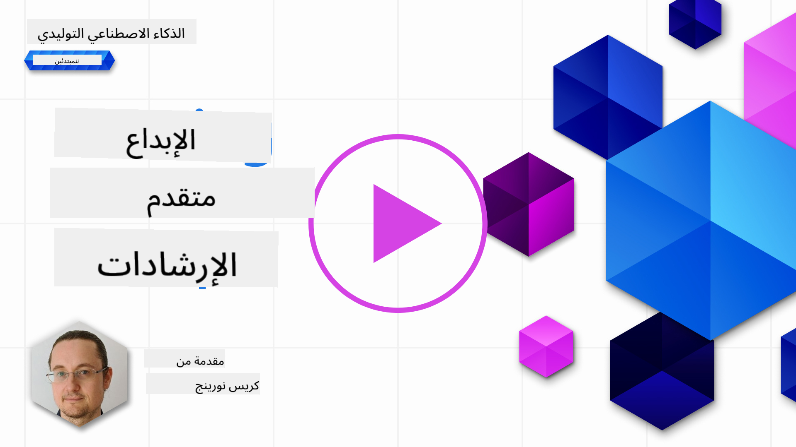

<!--
CO_OP_TRANSLATOR_METADATA:
{
  "original_hash": "ffb706de93ef518f31e0a675c66dfce1",
  "translation_date": "2025-10-17T12:57:48+00:00",
  "source_file": "05-advanced-prompts/README.md",
  "language_code": "ar"
}
-->
# إنشاء مطالبات متقدمة

[](https://youtu.be/BAjzkaCdRok?si=NmUIyRf7-cDgbjtt)

لنقم بمراجعة بعض ما تعلمناه في الفصل السابق:

> هندسة _المطالبات_ هي العملية التي من خلالها **نوجه النموذج نحو استجابات أكثر ملاءمة** من خلال تقديم تعليمات أو سياق أكثر فائدة.

هناك أيضًا خطوتان لكتابة المطالبات، الأولى هي بناء المطالبة من خلال تقديم سياق ملائم، والثانية هي _التحسين_، أي كيفية تحسين المطالبة تدريجيًا.

في هذه المرحلة، لدينا فهم أساسي لكيفية كتابة المطالبات، ولكننا بحاجة إلى التعمق أكثر. في هذا الفصل، ستنتقل من تجربة مطالبات مختلفة إلى فهم سبب كون مطالبة معينة أفضل من الأخرى. ستتعلم كيفية بناء المطالبات باستخدام بعض التقنيات الأساسية التي يمكن تطبيقها على أي نموذج لغوي كبير (LLM).

## المقدمة

في هذا الفصل، سنغطي المواضيع التالية:

- توسيع معرفتك بهندسة المطالبات من خلال تطبيق تقنيات مختلفة على مطالباتك.
- تكوين مطالباتك لتغيير النتائج.

## أهداف التعلم

بعد إكمال هذا الدرس، ستكون قادرًا على:

- تطبيق تقنيات هندسة المطالبات التي تحسن نتائج مطالباتك.
- تنفيذ مطالبات تكون إما متنوعة أو حتمية.

## هندسة المطالبات

هندسة المطالبات هي عملية إنشاء مطالبات تنتج النتيجة المطلوبة. هناك ما هو أكثر من هندسة المطالبات من مجرد كتابة نص المطالبة. هندسة المطالبات ليست تخصصًا هندسيًا، بل هي مجموعة من التقنيات التي يمكنك تطبيقها للحصول على النتيجة المطلوبة.

### مثال على مطالبة

لنأخذ مطالبة بسيطة مثل هذه:

> قم بإنشاء 10 أسئلة عن الجغرافيا.

في هذه المطالبة، أنت بالفعل تطبق مجموعة من تقنيات المطالبات المختلفة.

لنقم بتفصيل ذلك.

- **السياق**، حيث تحدد أنه يجب أن يكون عن "الجغرافيا".
- **تقييد النتيجة**، حيث تطلب ألا تزيد عن 10 أسئلة.

### قيود المطالبات البسيطة

قد تحصل أو لا تحصل على النتيجة المطلوبة. سيتم إنشاء الأسئلة، ولكن الجغرافيا موضوع كبير وقد لا تحصل على ما تريد بسبب الأسباب التالية:

- **موضوع واسع**، لا تعرف ما إذا كان سيكون عن الدول، العواصم، الأنهار، وما إلى ذلك.
- **التنسيق**، ماذا لو كنت تريد أن تكون الأسئلة بتنسيق معين؟

كما ترى، هناك الكثير يجب مراعاته عند إنشاء المطالبات.

حتى الآن، رأينا مثالًا بسيطًا على المطالبات، ولكن الذكاء الاصطناعي التوليدي قادر على تقديم المزيد لمساعدة الأشخاص في مجموعة متنوعة من الأدوار والصناعات. دعونا نستكشف بعض التقنيات الأساسية التالية.

### تقنيات المطالبات

أولاً، نحتاج إلى فهم أن المطالبات هي خاصية _ناشئة_ للنموذج اللغوي الكبير (LLM)، مما يعني أنها ليست ميزة مدمجة في النموذج بل شيء نكتشفه أثناء استخدام النموذج.

هناك بعض التقنيات الأساسية التي يمكننا استخدامها لطلب النموذج اللغوي الكبير. دعونا نستكشفها.

- **المطالبة بدون أمثلة**، وهي أبسط أشكال المطالبات. إنها مطالبة واحدة تطلب استجابة من النموذج بناءً فقط على بيانات تدريبه.
- **المطالبة مع أمثلة قليلة**، هذا النوع من المطالبات يوجه النموذج من خلال تقديم مثال أو أكثر يمكنه الاعتماد عليها لتوليد استجابته.
- **سلسلة التفكير**، هذا النوع من المطالبات يوضح للنموذج كيفية تقسيم المشكلة إلى خطوات.
- **المعرفة المولدة**، لتحسين استجابة المطالبة، يمكنك تقديم حقائق أو معرفة مولدة بالإضافة إلى المطالبة.
- **الأقل إلى الأكثر**، مثل سلسلة التفكير، هذه التقنية تتعلق بتقسيم المشكلة إلى سلسلة من الخطوات ثم طلب تنفيذ هذه الخطوات بالترتيب.
- **التنقيح الذاتي**، هذه التقنية تتعلق بانتقاد استجابة النموذج ثم طلب تحسينها.
- **المطالبة الماييوتيكية**، الهدف هنا هو ضمان صحة إجابة النموذج من خلال طلب شرح مختلف أجزاء الإجابة. هذا شكل من أشكال التنقيح الذاتي.

### المطالبة بدون أمثلة

هذا النوع من المطالبات بسيط جدًا، يتكون من مطالبة واحدة. هذه التقنية ربما تكون ما تستخدمه أثناء بدء تعلمك عن النماذج اللغوية الكبيرة. إليك مثال:

- مطالبة: "ما هو الجبر؟"
- الإجابة: "الجبر هو فرع من الرياضيات يدرس الرموز الرياضية وقواعد التعامل معها."

### المطالبة مع أمثلة قليلة

هذا النوع من المطالبات يساعد النموذج من خلال تقديم بعض الأمثلة مع الطلب. يتكون من مطالبة واحدة مع بيانات إضافية خاصة بالمهمة. إليك مثال:

- مطالبة: "اكتب قصيدة بأسلوب شكسبير. إليك بعض أمثلة السوناتات الشكسبيرية:
  السوناتة 18: 'هل أقارنك بيوم صيف؟ أنت أكثر جمالًا وأكثر اعتدالًا...'
  السوناتة 116: 'لا تدعني إلى زواج العقول الحقيقية أقبل العوائق. الحب ليس حبًا الذي يتغير عندما يجد التغيير...'
  السوناتة 132: 'أحب عينيك، وهما، كما لو كانتا تشفقان علي، تعرفان قلبك وتعذبني بالازدراء،...'
  الآن، اكتب سوناتة عن جمال القمر."
- الإجابة: "على السماء، يضيء القمر بلطف، في ضوء فضي يلقي جماله الرقيق،..."

تساعد الأمثلة النموذج على فهم السياق، التنسيق أو الأسلوب المطلوب للإجابة. إنها تساعد النموذج على فهم المهمة المحددة وتوليد استجابات أكثر دقة وملاءمة.

### سلسلة التفكير

سلسلة التفكير هي تقنية مثيرة جدًا لأنها تتعلق بأخذ النموذج عبر سلسلة من الخطوات. الفكرة هي تعليم النموذج بطريقة تجعله يفهم كيفية القيام بشيء ما. انظر إلى المثال التالي، مع وبدون سلسلة التفكير:

    - مطالبة: "أليس لديها 5 تفاحات، ترمي 3 تفاحات، تعطي 2 لبوب وبوب يعيد واحدة، كم تفاحة لديها أليس؟"
    - الإجابة: 5

النموذج يجيب بـ 5، وهو غير صحيح. الإجابة الصحيحة هي تفاحة واحدة، بناءً على الحساب (5 -3 -2 + 1 = 1).

كيف يمكننا تعليم النموذج القيام بذلك بشكل صحيح؟

دعونا نجرب سلسلة التفكير. تطبيق سلسلة التفكير يعني:

1. إعطاء النموذج مثالًا مشابهًا.
1. عرض الحساب، وكيفية حسابه بشكل صحيح.
1. تقديم المطالبة الأصلية.

إليك الطريقة:

- مطالبة: "ليزا لديها 7 تفاحات، ترمي تفاحة واحدة، تعطي 4 تفاحات لبارت وبارت يعيد واحدة:
  7 -1 = 6
  6 -4 = 2
  2 +1 = 3  
  أليس لديها 5 تفاحات، ترمي 3 تفاحات، تعطي 2 لبوب وبوب يعيد واحدة، كم تفاحة لديها أليس؟"
  الإجابة: 1

لاحظ كيف نكتب مطالبات أطول بشكل كبير مع مثال آخر، حساب ثم المطالبة الأصلية ونصل إلى الإجابة الصحيحة وهي 1.

كما ترى، سلسلة التفكير هي تقنية قوية جدًا.

### المعرفة المولدة

في كثير من الأحيان عندما تريد إنشاء مطالبة، ترغب في القيام بذلك باستخدام بيانات شركتك الخاصة. تريد أن يكون جزء من المطالبة من الشركة والجزء الآخر هو المطالبة التي تهتم بها.

كمثال، يمكن أن تبدو مطالبتك هكذا إذا كنت تعمل في مجال التأمين:

```text
{{company}}: {{company_name}}
{{products}}:
{{products_list}}
Please suggest an insurance given the following budget and requirements:
Budget: {{budget}}
Requirements: {{requirements}}
```

أعلاه، ترى كيف يتم إنشاء المطالبة باستخدام قالب. في القالب، هناك عدد من المتغيرات، المشار إليها بـ `{{variable}}`، والتي سيتم استبدالها بقيم فعلية من واجهة برمجة تطبيقات الشركة.

إليك مثال على كيف يمكن أن تبدو المطالبة بمجرد استبدال المتغيرات بمحتوى من شركتك:

```text
Insurance company: ACME Insurance
Insurance products (cost per month):
- Car, cheap, 500 USD
- Car, expensive, 1100 USD
- Home, cheap, 600 USD
- Home, expensive, 1200 USD
- Life, cheap, 100 USD

Please suggest an insurance given the following budget and requirements:
Budget: $1000
Requirements: Car, Home, and Life insurance
```

تشغيل هذه المطالبة عبر النموذج اللغوي الكبير سيؤدي إلى استجابة مثل هذه:

```output
Given the budget and requirements, we suggest the following insurance package from ACME Insurance:
- Car, cheap, 500 USD
- Home, cheap, 600 USD
- Life, cheap, 100 USD
Total cost: $1,200 USD
```

كما ترى، يقترح أيضًا التأمين على الحياة، وهو ما لا يجب أن يفعله. هذه النتيجة تشير إلى أننا بحاجة إلى تحسين المطالبة من خلال تغييرها لتكون أكثر وضوحًا بشأن ما يمكن السماح به. بعد بعض _التجربة والخطأ_، نصل إلى المطالبة التالية:

```text
Insurance company: ACME Insurance
Insurance products (cost per month):
- type: Car, cheap, cost: 500 USD
- type: Car, expensive, cost: 1100 USD
- type: Home, cheap, cost: 600 USD
- type: Home, expensive, cost: 1200 USD
- type: Life, cheap, cost: 100 USD

Please suggest an insurance given the following budget and requirements:
Budget: $1000 restrict choice to types: Car, Home
```

لاحظ كيف أن إضافة _النوع_ و_التكلفة_ واستخدام الكلمة المفتاحية _تقييد_ يساعد النموذج اللغوي الكبير على فهم ما نريده.

الآن نحصل على الاستجابة التالية:

```output
Given the budget and requirements, we suggest the Car, Cheap insurance product which costs 500 USD per month.
```

النقطة من هذا المثال كانت لإظهار أنه حتى عندما نستخدم تقنية أساسية مثل _المعرفة المولدة_، لا يزال يتعين علينا تحسين المطالبة في معظم الحالات للحصول على النتيجة المطلوبة.

### الأقل إلى الأكثر

الفكرة مع المطالبة الأقل إلى الأكثر هي تقسيم مشكلة أكبر إلى مشاكل فرعية. بهذه الطريقة، تساعد في توجيه النموذج اللغوي الكبير حول كيفية "التغلب" على المشكلة الأكبر. يمكن أن يكون مثالًا جيدًا في علم البيانات حيث يمكنك أن تطلب من النموذج اللغوي الكبير تقسيم المشكلة مثل:

> مطالبة: كيف يمكن تنفيذ علم البيانات في 5 خطوات؟

مع إجابة مساعد الذكاء الاصطناعي:

1. جمع البيانات
1. تنظيف البيانات
1. تحليل البيانات
1. رسم البيانات
1. تقديم البيانات

### التنقيح الذاتي، انتقاد النتائج

مع الذكاء الاصطناعي التوليدي والنماذج اللغوية الكبيرة، لا يمكنك الوثوق بالإخراج. تحتاج إلى التحقق منه. بعد كل شيء، النموذج اللغوي الكبير يقدم لك فقط ما هو الأكثر احتمالًا أن يُقال بعد ذلك، وليس ما هو صحيح. لذلك، فكرة جيدة هي أن تطلب من النموذج اللغوي الكبير انتقاد نفسه، مما يقودنا إلى تقنية التنقيح الذاتي.

كيف تعمل هذه التقنية هو أنك تتبع الخطوات التالية:

1. مطالبة أولية تطلب من النموذج اللغوي الكبير حل مشكلة
1. يجيب النموذج اللغوي الكبير
1. تنتقد الإجابة وتطلب من الذكاء الاصطناعي تحسينها
1. يجيب النموذج اللغوي الكبير مرة أخرى، هذه المرة يأخذ النقد في الاعتبار ويقترح الحلول التي توصل إليها

يمكنك تكرار هذه العملية بقدر ما تريد.

إليك مثال باستخدام هذه التقنية:

> مطالبة: "قم بإنشاء واجهة برمجة تطبيقات ويب بلغة بايثون مع مسارات المنتجات والعملاء"

إجابة الذكاء الاصطناعي:

```python
import flask
app = Flask(__name__)

@app.route('/products')
def products():
    return 'Products'

@app.route('/customers')
def customers():
    return 'Customers'
```

> مطالبة: اقترح 3 تحسينات على الكود أعلاه

إجابة الذكاء الاصطناعي:

```text
Sure, here are three suggestions to improve the code:

Import the correct module: The first line should import Flask instead of flask. The correct import statement should be from flask import Flask.

Add a main function: Add a if __name__ == '__main__': block to the end of the file to run the application when the file is executed.

Use f-strings: Use f-strings to format the return statements in the route functions. For example, return 'Products' can be changed to return f'This is the {request.path} page'.
```

```python
from flask import Flask, request

app = Flask(__name__)

@app.route('/products')
def products():
    return f'This is the {request.path} page'

@app.route('/customers')
def customers():
    return f'This is the {request.path} page'

if __name__ == '__main__':
    app.run()
```

كما ترى، استجابة الذكاء الاصطناعي أعلاه تحسن الكود المقترح الأول بفضل انتقاد الإجابة الأولى.

### المطالبة الماييوتيكية

المطالبة الماييوتيكية هي تقنية مشابهة للتنقيح الذاتي ولكنها تتعلق أكثر بطلب النموذج اللغوي الكبير شرح نفسه. الهدف هو تقليل التناقضات في إخراج النموذج اللغوي الكبير لضمان الوصول إلى الإجابة الصحيحة. سير العمل الذي يجب اتباعه هو:

1. اطلب من النموذج اللغوي الكبير الإجابة على سؤال
1. لكل جزء من الإجابة، اطلب من النموذج اللغوي الكبير شرحها بمزيد من العمق.
1. إذا كانت هناك تناقضات، قم باستبعاد الأجزاء التي تحتوي على تناقضات.

كرر الخطوتين 2 و3 حتى تكون قد مررت بجميع الأجزاء وتشعر بالرضا عن الإجابة.

إليك مثال على مطالبة:

> مطالبة: كيف يمكنني إنشاء خطة أزمة للتخفيف من جائحة في 5 خطوات؟
> إجابة النموذج اللغوي الكبير:

```text
1. Identify the risks
1. Identify the stakeholders
1. Identify the resources
1. Identify the actions
1. Identify the communication channels
```

لقد حدد 5 خطوات، ولكن هل يمكننا تحديد ما إذا كان هذا صحيحًا؟ دعونا نطلب من النموذج اللغوي الكبير شرح كل خطوة:

> مطالبة: اشرح الخطوة الأولى بمزيد من التفصيل، ما هي المخاطر بالتفصيل مع الجائحة؟

```text
The risks are the following:

- Loss of life
- Loss of business
- Loss of reputation
- Loss of customers
- Loss of employees
```

في هذه المرحلة، نريد التأكد من أن النموذج اللغوي الكبير صحيح، لذا نطلب منه شرح أول خطر بمزيد من التفصيل ونأمل أن يكون متسقًا مع الإجابة أعلاه:

> مطالبة: في الجائحة، ما هو أكبر خطر ولماذا؟

```text
The biggest risk is loss of life because it's the most important thing to protect.
```

> ما هما أكبر خطرين في الجائحة؟

```text
The two biggest risks are loss of life and loss of business.
```

في هذه المرحلة، النموذج اللغوي الكبير متسق ويذكر "الحياة" و"الأعمال" كأكبر خطرين. يمكننا الآن الانتقال إلى الخطوة التالية والشعور بالثقة إلى حد ما. ومع ذلك، لا يجب أن نثق بالنموذج اللغوي الكبير بشكل أعمى، يجب علينا دائمًا التحقق من الإخراج.

## تنويع الإخراج

النماذج اللغوية الكبيرة غير حتمية بطبيعتها، مما يعني أنك ستحصل على نتائج مختلفة في كل مرة تقوم فيها بتشغيل نفس المطالبة. جرب المطالبة التالية على سبيل المثال:

> "قم بإنشاء كود لواجهة برمجة تطبيقات ويب بلغة بايثون"

```python
# Import necessary modules
import flask
from flask import request, jsonify

# Create a Flask app
app = flask.Flask(__name__)

# Create a route for the API
@app.route('/api', methods=['GET'])
def api():
    # Get the data from the request
    data = request.args

    # Process the data
    result = process_data(data)

    # Return the result as JSON
    return jsonify(result)

# Function to process the data
def process_data(data):
    # Do something with the data
    result = data + 1

    # Return the result
    return result

# Run the app
if __name__ == '__main__':
    app.run()

```

تشغيل نفس المطالبة مرة أخرى يولد استجابة مختلفة قليلاً:

```python
#import necessary packages
import flask
from flask import request, jsonify

#create the Flask application
app = flask.Flask(__name__)
app.config["DEBUG"] = True

#create a list of books
books = [
    {'id': 0,
     'title': 'A Fire Upon the Deep',
     'author': 'Vernor Vinge',
     'first_sentence': 'The coldsleep itself was dreamless.',
     'year_published': '1992'},
    {'id': 1,
     'title': 'The Ones Who Walk Away From Omelas',
     'author': 'Ursula K. Le Guin',
     'first_sentence': 'With a clamor of bells that set the swallows soaring, the Festival of Summer came to the city Omelas, bright-towered by the sea.',
     'published': '1973'},
    {'id': 2,
     'title': 'Dhalgren',
     'author': 'Samuel R. Delany',
     'first_sentence': 'to wound the autumnal city.',
     'published': '1975'}
]

#create an endpoint for the API
@app.route('/', methods=['GET'])
def home():
    return '''<h1>Books API</h1>
<p>A prototype API for retrieving books.</p>'''

#create an endpoint to return all books
@app.route('/api/v1/resources/books/all', methods=['GET'])
def api_all():
    return jsonify(books)

#create an endpoint to return a single book
@app.route('/api/v1/resources/books', methods=['GET'])
def api_id():
    #check if an ID was provided as part of the URL
    #if ID is provided, assign it to a variable
    #if no ID is provided, display an error
    if 'id' in request.args:
        id = int(request.args['id'])
    else:
        return "Error: No id field provided. Please specify an id."

    #create an empty list for our results
    results = []

    #loop through the data and match results that fit the requested ID
    #IDs are unique, but other fields might return many results
    for book in books:
        if book['id'] == id:
            results.append(book)

    #use the jsonify function from Flask to convert our list of
    #Python dictionaries to the JSON format
    return jsonify(results)

app.run()
```

> هل الإخراج المتنوع مشكلة؟

يعتمد ذلك على ما تحاول القيام به. إذا كنت تريد استجابة محددة، فإنها تكون مشكلة. إذا كنت موافقًا على إخراج متنوع مثل "قم بإنشاء أي 3 أسئلة عن الجغرافيا"، فإنها ليست مشكلة.

### استخدام درجة الحرارة لتنويع الإخراج

حسنًا، لقد قررنا أننا نريد تقييد الإخراج ليكون أكثر قابلية للتنبؤ، أي أكثر حتمية. كيف نفعل ذلك؟

درجة الحرارة هي قيمة بين 0 و1، حيث 0 هي الأكثر حتمية و1 هي الأكثر تنوعًا. القيمة الافتراضية هي 0.7. دعونا نرى ما يحدث مع تشغيلين لنفس المطالبة مع درجة حرارة محددة عند 0.1:

> "قم بإنشاء كود لواجهة برمجة تطبيقات ويب بلغة بايثون"

```python
#import necessary libraries
import flask
from flask import request, jsonify

#create an instance of the Flask class
app = flask.Flask(__name__)

#create an endpoint for the API
@app.route('/api/v1/endpoint', methods=['GET'])
def api_endpoint():
    #get the request data
    data = request.get_json()

    #process the data
    result = process_data(data)

    #return the result
    return jsonify(result)

#function to process the data
def process_data(data):
    #process the data
    result = {'result': 'success'}

    #return the result
    return result

#run the Flask app
if __name__ == '__main__':
    app.run()

```

تشغيل المطالبة مرة أخرى يعطينا هذه النتيجة:

```python
#import necessary libraries
import flask
from flask import request, jsonify

#create a Flask app
app = flask.Flask(__name__)

#create a route for the API
@app.route('/api', methods=['GET'])
def api_call():
    #get the data from the request
    data = request.get_json()

    #process the data
    result = process_data(data)

    #return the result
    return jsonify(result)

#define the process_data function
def process_data(data):
    #do something with the data
    result = data + 1

    #return the result
    return result

#run the app
if __name__ == '__main__':
    app.run()

```

هناك فرق بسيط فقط بين هذين الإخراجين. دعونا نفعل العكس هذه المرة، دعونا نحدد درجة الحرارة عند 0.9:

```python
# Import necessary libraries
import flask
from flask import request, jsonify

# Create a Flask app
app = flask.Flask(__name__)

# Create a route for the API
@app.route('/api', methods=['GET'])
def api_call():
    # Get the data from the request
    data = request.args

    # Process the data
    result = process_data(data)

    # Return the result
    return jsonify(result)

# Function to process the data
def process_data(data):
    # Do something with the data
    result = data + 1

    # Return the result
    return result

# Run the app
if __name__ == '__main__':
    app.run()

```

والمحاولة الثانية عند درجة حرارة 0.9:

```python
import flask
from flask import request, jsonify

# create the Flask app
app = flask.Flask(__name__)
app.config['DEBUG'] = True

# create some test data
books = [
    {'id': 0, 'title': 'A Fire Upon The Deep', 'author': 'Vernor Vinge', 'first_sentence': 'The coldsleep itself was dreamless.', 'year_published': '1992'},
    {'id': 1, 'title': 'The Ones Who Walk Away From Omelas', 'author': 'Ursula K. Le Guin', 'first_sentence': 'With a clamor of bells that set the swallows soaring, the Festival of Summer came to the city Omelas, bright-towered by the sea.', 'published': '1973'},
    {'id': 2, 'title': 'Dhalgren', 'author': 'Samuel R. Delany', 'first_sentence': 'to wound the autumnal city.', 'published': '1975'}
]

# create an endpoint
@app.route('/', methods=['GET'])
def home():
    return '''<h1>Welcome to our book API!</h1>'''

@app.route('/api/v1/resources/books

```

كما ترى، النتائج لا يمكن أن تكون أكثر تنوعًا.

> لاحظ أن هناك المزيد من المعايير التي يمكنك تغييرها لتنوع المخرجات، مثل top-k، top-p، عقوبة التكرار، عقوبة الطول وعقوبة التنوع، ولكن هذه خارج نطاق هذا المنهج.

## ممارسات جيدة

هناك العديد من الممارسات التي يمكنك تطبيقها للحصول على ما تريد. ستجد أسلوبك الخاص مع استخدامك للتوجيه بشكل متزايد.

بالإضافة إلى التقنيات التي قمنا بتغطيتها، هناك بعض الممارسات الجيدة التي يجب أخذها في الاعتبار عند توجيه نموذج اللغة الكبير.

إليك بعض الممارسات الجيدة التي يجب أخذها في الاعتبار:

- **حدد السياق**. السياق مهم، كلما استطعت تحديده مثل المجال، الموضوع، وما إلى ذلك، كان ذلك أفضل.
- حدد المخرجات. إذا كنت تريد عددًا معينًا من العناصر أو طولًا معينًا، فقم بتحديد ذلك.
- **حدد ماذا وكيف**. تذكر أن تذكر ما تريد وكيف تريده، على سبيل المثال "قم بإنشاء واجهة برمجة تطبيقات ويب بلغة Python مع مسارات المنتجات والعملاء، وقسمها إلى 3 ملفات".
- **استخدم القوالب**. غالبًا، سترغب في إثراء توجيهاتك ببيانات من شركتك. استخدم القوالب للقيام بذلك. يمكن أن تحتوي القوالب على متغيرات تستبدلها بالبيانات الفعلية.
- **اكتب بشكل صحيح**. قد يقدم لك نموذج اللغة الكبير استجابة صحيحة، ولكن إذا كتبت بشكل صحيح، ستحصل على استجابة أفضل.

## المهمة

إليك كود بلغة Python يوضح كيفية بناء واجهة برمجة تطبيقات بسيطة باستخدام Flask:

```python
from flask import Flask, request

app = Flask(__name__)

@app.route('/')
def hello():
    name = request.args.get('name', 'World')
    return f'Hello, {name}!'

if __name__ == '__main__':
    app.run()
```

استخدم مساعد الذكاء الاصطناعي مثل GitHub Copilot أو ChatGPT وطبق تقنية "التنقيح الذاتي" لتحسين الكود.

## الحل

يرجى محاولة حل المهمة عن طريق إضافة توجيهات مناسبة إلى الكود.

> [!TIP]
> صياغة توجيه لتحسين الكود، من الجيد تحديد عدد التحسينات. يمكنك أيضًا طلب تحسينه بطريقة معينة، مثل الهندسة المعمارية، الأداء، الأمان، إلخ.

[الحل](../../../05-advanced-prompts/python/aoai-solution.py)

## اختبار المعرفة

لماذا قد أستخدم توجيه التفكير المتسلسل؟ أرني إجابة صحيحة واحدة وإجابتين غير صحيحتين.

1. لتعليم نموذج اللغة الكبير كيفية حل مشكلة.
1. ب، لتعليم نموذج اللغة الكبير كيفية العثور على أخطاء في الكود.
1. ج، لتوجيه نموذج اللغة الكبير لتقديم حلول مختلفة.

الإجابة: 1، لأن التفكير المتسلسل يتعلق بتوضيح كيفية حل المشكلة للنموذج من خلال تقديم سلسلة من الخطوات، ومشاكل مشابهة وكيف تم حلها.

## 🚀 التحدي

لقد استخدمت تقنية التنقيح الذاتي في المهمة. خذ أي برنامج قمت ببنائه وفكر في التحسينات التي ترغب في تطبيقها عليه. الآن استخدم تقنية التنقيح الذاتي لتطبيق التغييرات المقترحة. ما رأيك في النتيجة، هل أصبحت أفضل أم أسوأ؟

## عمل رائع! واصل التعلم

بعد إكمال هذا الدرس، تحقق من [مجموعة تعلم الذكاء الاصطناعي التوليدي](https://aka.ms/genai-collection?WT.mc_id=academic-105485-koreyst) لمواصلة تطوير معرفتك بالذكاء الاصطناعي التوليدي!

توجه إلى الدرس السادس حيث سنطبق معرفتنا في هندسة التوجيه من خلال [بناء تطبيقات توليد النصوص](../06-text-generation-apps/README.md?WT.mc_id=academic-105485-koreyst)

---

**إخلاء المسؤولية**:  
تم ترجمة هذا المستند باستخدام خدمة الترجمة بالذكاء الاصطناعي [Co-op Translator](https://github.com/Azure/co-op-translator). بينما نسعى لتحقيق الدقة، يرجى العلم أن الترجمات الآلية قد تحتوي على أخطاء أو عدم دقة. يجب اعتبار المستند الأصلي بلغته الأصلية المصدر الرسمي. للحصول على معلومات حاسمة، يُوصى بالترجمة البشرية الاحترافية. نحن غير مسؤولين عن أي سوء فهم أو تفسيرات خاطئة ناتجة عن استخدام هذه الترجمة.