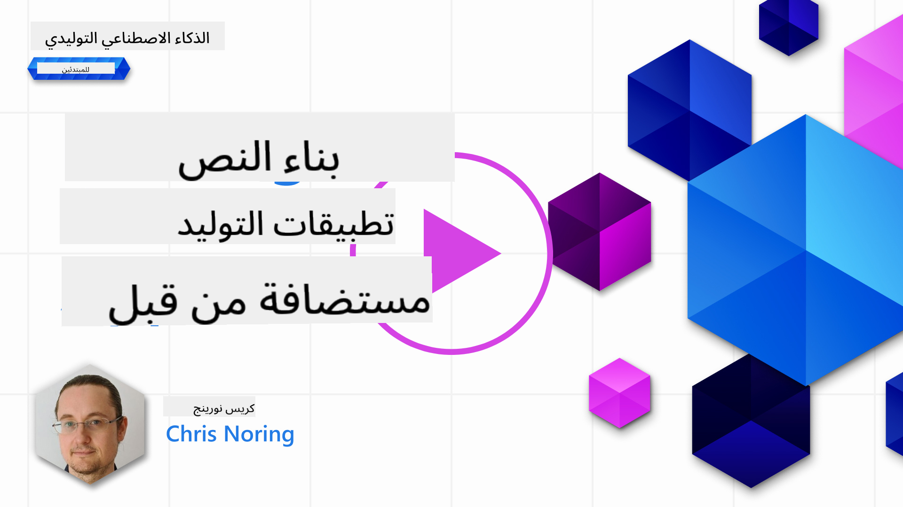

<!--
CO_OP_TRANSLATOR_METADATA:
{
  "original_hash": "ce8224073b86b728ed52b19bed7932fd",
  "translation_date": "2025-07-09T11:45:12+00:00",
  "source_file": "06-text-generation-apps/README.md",
  "language_code": "ar"
}
-->
# بناء تطبيقات توليد النصوص

[](https://aka.ms/gen-ai-lesson6-gh?WT.mc_id=academic-105485-koreyst)

> _(انقر على الصورة أعلاه لمشاهدة فيديو هذا الدرس)_

لقد رأيت حتى الآن من خلال هذا المنهج أن هناك مفاهيم أساسية مثل الـ prompts وحتى تخصص كامل يُسمى "هندسة الـ prompt". العديد من الأدوات التي يمكنك التفاعل معها مثل ChatGPT، Office 365، Microsoft Power Platform والمزيد، تدعمك باستخدام الـ prompts لإنجاز مهام معينة.

لكي تضيف مثل هذه التجربة إلى تطبيق، تحتاج إلى فهم مفاهيم مثل الـ prompts، الـ completions واختيار مكتبة للعمل معها. وهذا بالضبط ما ستتعلمه في هذا الفصل.

## مقدمة

في هذا الفصل، ستقوم بـ:

- التعرف على مكتبة openai ومفاهيمها الأساسية.
- بناء تطبيق لتوليد النصوص باستخدام openai.
- فهم كيفية استخدام مفاهيم مثل prompt، temperature، والـ tokens لبناء تطبيق توليد نصوص.

## أهداف التعلم

في نهاية هذا الدرس، ستكون قادرًا على:

- شرح ما هو تطبيق توليد النصوص.
- بناء تطبيق توليد نصوص باستخدام openai.
- ضبط تطبيقك لاستخدام عدد أكبر أو أقل من الـ tokens وكذلك تغيير درجة الحرارة للحصول على مخرجات متنوعة.

## ما هو تطبيق توليد النصوص؟

عادةً عند بناء تطبيق، يكون له نوع من الواجهة مثل:

- قائم على الأوامر. تطبيقات الكونسول هي تطبيقات نموذجية تكتب فيها أمرًا وينفذ مهمة. على سبيل المثال، `git` هو تطبيق قائم على الأوامر.
- واجهة المستخدم (UI). بعض التطبيقات تحتوي على واجهات مستخدم رسومية (GUIs) حيث تنقر على أزرار، تدخل نصًا، تختار خيارات والمزيد.

### تطبيقات الكونسول وواجهات المستخدم محدودة

قارن ذلك بتطبيق قائم على الأوامر حيث تكتب أمرًا:

- **محدود**. لا يمكنك كتابة أي أمر، فقط الأوامر التي يدعمها التطبيق.
- **خاص بلغة معينة**. بعض التطبيقات تدعم لغات متعددة، لكن بشكل افتراضي التطبيق مبني للغة معينة، حتى لو كان بإمكانك إضافة دعم لغات أخرى.

### فوائد تطبيقات توليد النصوص

فكيف يختلف تطبيق توليد النصوص؟

في تطبيق توليد النصوص، لديك مرونة أكبر، لست مقيدًا بمجموعة أوامر أو لغة إدخال محددة. بدلاً من ذلك، يمكنك استخدام اللغة الطبيعية للتفاعل مع التطبيق. فائدة أخرى هي أنك تتفاعل مع مصدر بيانات تم تدريبه على مجموعة ضخمة من المعلومات، بينما قد يكون التطبيق التقليدي محدودًا بما هو موجود في قاعدة بيانات.

### ماذا يمكنني أن أبني باستخدام تطبيق توليد النصوص؟

هناك أشياء كثيرة يمكنك بناؤها. على سبيل المثال:

- **دردشة آلية (Chatbot)**. دردشة ترد على أسئلة حول مواضيع مثل شركتك ومنتجاتها يمكن أن تكون مناسبة جدًا.
- **مساعد**. نماذج اللغة الكبيرة (LLMs) ممتازة في أشياء مثل تلخيص النصوص، استخراج الأفكار من النص، إنتاج نصوص مثل السير الذاتية والمزيد.
- **مساعد برمجي**. اعتمادًا على نموذج اللغة الذي تستخدمه، يمكنك بناء مساعد برمجي يساعدك في كتابة الكود. على سبيل المثال، يمكنك استخدام منتجات مثل GitHub Copilot بالإضافة إلى ChatGPT لمساعدتك في كتابة الكود.

## كيف أبدأ؟

حسنًا، تحتاج إلى إيجاد طريقة للتكامل مع نموذج لغة كبير (LLM) والذي عادةً ما يتضمن أحد النهجين التاليين:

- استخدام API. هنا تقوم ببناء طلبات ويب مع الـ prompt الخاص بك وتحصل على نص مولد كرد.
- استخدام مكتبة. تساعد المكتبات في تغليف استدعاءات الـ API وتجعل استخدامها أسهل.

## المكتبات / SDKs

هناك بعض المكتبات المعروفة للعمل مع نماذج اللغة الكبيرة مثل:

- **openai**، هذه المكتبة تسهل الاتصال بنموذجك وإرسال الـ prompts.

ثم هناك مكتبات تعمل على مستوى أعلى مثل:

- **Langchain**. Langchain معروفة وتدعم Python.
- **Semantic Kernel**. Semantic Kernel هي مكتبة من مايكروسوفت تدعم لغات C#، Python، وJava.

## أول تطبيق باستخدام openai

لنرَ كيف يمكننا بناء أول تطبيق لنا، ما هي المكتبات التي نحتاجها، كم هو المطلوب، وهكذا.

### تثبيت openai

هناك العديد من المكتبات للتفاعل مع OpenAI أو Azure OpenAI. من الممكن استخدام لغات برمجة متعددة مثل C#، Python، JavaScript، Java والمزيد. اخترنا استخدام مكتبة `openai` الخاصة بـ Python، لذا سنستخدم `pip` لتثبيتها.

```bash
pip install openai
```

### إنشاء مورد

عليك تنفيذ الخطوات التالية:

- إنشاء حساب على Azure [https://azure.microsoft.com/free/](https://azure.microsoft.com/free/?WT.mc_id=academic-105485-koreyst).
- الحصول على وصول إلى Azure OpenAI. اذهب إلى [https://learn.microsoft.com/azure/ai-services/openai/overview#how-do-i-get-access-to-azure-openai](https://learn.microsoft.com/azure/ai-services/openai/overview#how-do-i-get-access-to-azure-openai?WT.mc_id=academic-105485-koreyst) واطلب الوصول.

  > [!NOTE]
  > في وقت كتابة هذا، تحتاج إلى التقديم للحصول على وصول إلى Azure OpenAI.

- تثبيت Python <https://www.python.org/>
- إنشاء مورد Azure OpenAI Service. راجع هذا الدليل لكيفية [إنشاء مورد](https://learn.microsoft.com/azure/ai-services/openai/how-to/create-resource?pivots=web-portal?WT.mc_id=academic-105485-koreyst).

### تحديد مفتاح API ونقطة النهاية

في هذه المرحلة، تحتاج إلى إخبار مكتبة `openai` بمفتاح API الذي ستستخدمه. للعثور على مفتاح API الخاص بك، اذهب إلى قسم "Keys and Endpoint" في مورد Azure OpenAI الخاص بك ونسخ قيمة "Key 1".


الآن بعد أن نسخت هذه المعلومات، دعنا نوجه المكتبات لاستخدامها.

> [!NOTE]
> من الأفضل فصل مفتاح API الخاص بك عن الكود. يمكنك فعل ذلك باستخدام متغيرات البيئة.
>
> - قم بتعيين متغير البيئة `OPENAI_API_KEY` إلى مفتاح API الخاص بك.
>   `export OPENAI_API_KEY='sk-...'`

### إعداد تكوين Azure

إذا كنت تستخدم Azure OpenAI، فإليك كيفية إعداد التكوين:

```python
openai.api_type = 'azure'
openai.api_key = os.environ["OPENAI_API_KEY"]
openai.api_version = '2023-05-15'
openai.api_base = os.getenv("API_BASE")
```

في الأعلى نحدد ما يلي:

- `api_type` إلى `azure`. هذا يخبر المكتبة باستخدام Azure OpenAI وليس OpenAI.
- `api_key`، هذا هو مفتاح API الخاص بك الموجود في بوابة Azure.
- `api_version`، هذا هو إصدار الـ API الذي تريد استخدامه. في وقت الكتابة، أحدث إصدار هو `2023-05-15`.
- `api_base`، هذه هي نقطة نهاية الـ API. يمكنك العثور عليها في بوابة Azure بجانب مفتاح API الخاص بك.

> [!NOTE] > `os.getenv` هي دالة تقرأ متغيرات البيئة. يمكنك استخدامها لقراءة متغيرات البيئة مثل `OPENAI_API_KEY` و `API_BASE`. قم بتعيين هذه المتغيرات في الطرفية أو باستخدام مكتبة مثل `dotenv`.

## توليد النص

الطريقة لتوليد النص هي استخدام فئة `Completion`. إليك مثالًا:

```python
prompt = "Complete the following: Once upon a time there was a"

completion = openai.Completion.create(model="davinci-002", prompt=prompt)
print(completion.choices[0].text)
```

في الكود أعلاه، ننشئ كائن completion ونمرر النموذج الذي نريد استخدامه والـ prompt. ثم نطبع النص المولد.

### إكمالات الدردشة

حتى الآن، رأيت كيف نستخدم `Completion` لتوليد النص. لكن هناك فئة أخرى تسمى `ChatCompletion` وهي أكثر ملاءمة للدردشات الآلية. إليك مثالًا على استخدامها:

```python
import openai

openai.api_key = "sk-..."

completion = openai.ChatCompletion.create(model="gpt-3.5-turbo", messages=[{"role": "user", "content": "Hello world"}])
print(completion.choices[0].message.content)
```

المزيد عن هذه الوظيفة في فصل قادم.

## تمرين - تطبيقك الأول لتوليد النصوص

الآن بعد أن تعلمنا كيفية إعداد وتكوين openai، حان الوقت لبناء تطبيقك الأول لتوليد النصوص. لبناء تطبيقك، اتبع الخطوات التالية:

1. أنشئ بيئة افتراضية وثبت openai:

   ```bash
   python -m venv venv
   source venv/bin/activate
   pip install openai
   ```

   > [!NOTE]
   > إذا كنت تستخدم Windows اكتب `venv\Scripts\activate` بدلاً من `source venv/bin/activate`.

   > [!NOTE]
   > حدد مفتاح Azure OpenAI الخاص بك بالذهاب إلى [https://portal.azure.com/](https://portal.azure.com/?WT.mc_id=academic-105485-koreyst) وابحث عن `Open AI` واختر `Open AI resource` ثم اختر `Keys and Endpoint` ونسخ قيمة `Key 1`.

1. أنشئ ملف _app.py_ وأضف إليه الكود التالي:

   ```python
   import openai

   openai.api_key = "<replace this value with your open ai key or Azure OpenAI key>"

   openai.api_type = 'azure'
   openai.api_version = '2023-05-15'
   openai.api_base = "<endpoint found in Azure Portal where your API key is>"
   deployment_name = "<deployment name>"

   # add your completion code
   prompt = "Complete the following: Once upon a time there was a"
   messages = [{"role": "user", "content": prompt}]

   # make completion
   completion = openai.chat.completions.create(model=deployment_name, messages=messages)

   # print response
   print(completion.choices[0].message.content)
   ```

   > [!NOTE]
   > إذا كنت تستخدم Azure OpenAI، تحتاج إلى تعيين `api_type` إلى `azure` وتعيين `api_key` إلى مفتاح Azure OpenAI الخاص بك.

   يجب أن ترى مخرجات مثل التالية:

   ```output
    very unhappy _____.

   Once upon a time there was a very unhappy mermaid.
   ```

## أنواع مختلفة من الـ prompts لأغراض مختلفة

الآن رأيت كيف تولد نصًا باستخدام prompt. لديك حتى برنامج يعمل يمكنك تعديله وتغييره لتوليد أنواع مختلفة من النصوص.

يمكن استخدام الـ prompts لمهام متنوعة. على سبيل المثال:

- **توليد نوع معين من النصوص**. مثلًا، يمكنك توليد قصيدة، أسئلة لاختبار، إلخ.
- **البحث عن معلومات**. يمكنك استخدام الـ prompts للبحث عن معلومات مثل المثال التالي: "ماذا يعني CORS في تطوير الويب؟".
- **توليد كود**. يمكنك استخدام الـ prompts لتوليد كود، مثل تطوير تعبير منتظم للتحقق من صحة البريد الإلكتروني أو حتى توليد برنامج كامل، مثل تطبيق ويب.

## حالة استخدام أكثر عملية: مولد وصفات

تخيل أن لديك مكونات في المنزل وتريد طهي شيء ما. لذلك، تحتاج إلى وصفة. طريقة للعثور على وصفات هي استخدام محرك بحث أو يمكنك استخدام نموذج لغة كبير (LLM) للقيام بذلك.

يمكنك كتابة prompt مثل:

> "اعرض لي 5 وصفات لطبق يحتوي على المكونات التالية: دجاج، بطاطس، وجزر. لكل وصفة، اذكر جميع المكونات المستخدمة"

بناءً على الـ prompt أعلاه، قد تحصل على رد مشابه لـ:

```output
1. Roasted Chicken and Vegetables:
Ingredients:
- 4 chicken thighs
- 2 potatoes, cut into cubes
- 2 carrots, cut into cubes
- 2 tablespoons olive oil
- 2 cloves garlic, minced
- 1 teaspoon dried thyme
- 1 teaspoon dried oregano
- Salt and pepper, to taste

2. Chicken and Potato Stew:
Ingredients:
- 2 tablespoons olive oil
- 1 onion, diced
- 2 cloves garlic, minced
- 2 chicken breasts, cut into cubes
- 2 potatoes, cut into cubes
- 2 carrots, cut into cubes
- 1 teaspoon dried oregano
- 1 teaspoon dried thyme
- 1 cup chicken broth
- Salt and pepper, to taste

3. Chicken and Potato Bake:
Ingredients:
- 2 tablespoons olive oil
- 2 chicken breasts, cut into cubes
- 2 potatoes, cut into cubes
- 2 carrots, cut into cubes
- 1 onion, diced
- 2 cloves garlic, minced
- 1 teaspoon dried oregano
- 1 teaspoon dried thyme
- 1 cup chicken broth
- Salt and pepper, to taste

4. Chicken and Potato Soup:
Ingredients:
- 2 tablespoons olive oil
- 1 onion, diced
- 2 cloves garlic, minced
- 2 chicken breasts, cut into cubes
- 2 potatoes, cut into cubes
- 2 carrots, cut into cubes
- 1 teaspoon dried oregano
- 1 teaspoon dried thyme
- 4 cups chicken broth
- Salt and pepper, to taste

5. Chicken and Potato Hash:
Ingredients:
- 2 tablespoons olive oil
- 2 chicken breasts, cut into cubes
- 2 potatoes, cut into cubes
- 2 carrots, cut into cubes
- 1 onion, diced
- 2 cloves garlic, minced
- 1 teaspoon dried oregano
```

هذه النتيجة رائعة، أعرف ماذا سأطبخ. في هذه المرحلة، ما قد يكون تحسينات مفيدة هو:

- تصفية المكونات التي لا أحبها أو التي أعاني من حساسية تجاهها.
- إنتاج قائمة تسوق، في حال لم يكن لدي كل المكونات في المنزل.

للحالات أعلاه، دعنا نضيف prompt إضافي:

> "يرجى إزالة الوصفات التي تحتوي على الثوم لأنني أعاني من حساسية تجاهه واستبداله بشيء آخر. أيضًا، يرجى إنتاج قائمة تسوق للوصفات، مع الأخذ في الاعتبار أن لدي بالفعل دجاج، بطاطس وجزر في المنزل."

الآن لديك نتيجة جديدة، وهي:

```output
1. Roasted Chicken and Vegetables:
Ingredients:
- 4 chicken thighs
- 2 potatoes, cut into cubes
- 2 carrots, cut into cubes
- 2 tablespoons olive oil
- 1 teaspoon dried thyme
- 1 teaspoon dried oregano
- Salt and pepper, to taste

2. Chicken and Potato Stew:
Ingredients:
- 2 tablespoons olive oil
- 1 onion, diced
- 2 chicken breasts, cut into cubes
- 2 potatoes, cut into cubes
- 2 carrots, cut into cubes
- 1 teaspoon dried oregano
- 1 teaspoon dried thyme
- 1 cup chicken broth
- Salt and pepper, to taste

3. Chicken and Potato Bake:
Ingredients:
- 2 tablespoons olive oil
- 2 chicken breasts, cut into cubes
- 2 potatoes, cut into cubes
- 2 carrots, cut into cubes
- 1 onion, diced
- 1 teaspoon dried oregano
- 1 teaspoon dried thyme
- 1 cup chicken broth
- Salt and pepper, to taste

4. Chicken and Potato Soup:
Ingredients:
- 2 tablespoons olive oil
- 1 onion, diced
- 2 chicken breasts, cut into cubes
- 2 potatoes, cut into cubes
- 2 carrots, cut into cubes
- 1 teaspoon dried oregano
- 1 teaspoon dried thyme
- 4 cups chicken broth
- Salt and pepper, to taste

5. Chicken and Potato Hash:
Ingredients:
- 2 tablespoons olive oil
- 2 chicken breasts, cut into cubes
- 2 potatoes, cut into cubes
- 2 carrots, cut into cubes
- 1 onion, diced
- 1 teaspoon dried oregano

Shopping List:
- Olive oil
- Onion
- Thyme
- Oregano
- Salt
- Pepper
```

هذه هي وصفاتك الخمس، بدون ذكر الثوم ولديك أيضًا قائمة تسوق مع الأخذ في الاعتبار ما لديك في المنزل.

## تمرين - بناء مولد وصفات

الآن بعد أن استعرضنا سيناريو، دعنا نكتب كودًا يطابق السيناريو المعروض. للقيام بذلك، اتبع الخطوات التالية:

1. استخدم ملف _app.py_ الحالي كنقطة انطلاق
1. حدد متغير `prompt` وغيّر كوده إلى التالي:

   ```python
   prompt = "Show me 5 recipes for a dish with the following ingredients: chicken, potatoes, and carrots. Per recipe, list all the ingredients used"
   ```

   إذا شغلت الكود الآن، يجب أن ترى مخرجات مشابهة لـ:

   ```output
   -Chicken Stew with Potatoes and Carrots: 3 tablespoons oil, 1 onion, chopped, 2 cloves garlic, minced, 1 carrot, peeled and chopped, 1 potato, peeled and chopped, 1 bay leaf, 1 thyme sprig, 1/2 teaspoon salt, 1/4 teaspoon black pepper, 1 1/2 cups chicken broth, 1/2 cup dry white wine, 2 tablespoons chopped fresh parsley, 2 tablespoons unsalted butter, 1 1/2 pounds boneless, skinless chicken thighs, cut into 1-inch pieces
   -Oven-Roasted Chicken with Potatoes and Carrots: 3 tablespoons extra-virgin olive oil, 1 tablespoon Dijon mustard, 1 tablespoon chopped fresh rosemary, 1 tablespoon chopped fresh thyme, 4 cloves garlic, minced, 1 1/2 pounds small red potatoes, quartered, 1 1/2 pounds carrots, quartered lengthwise, 1/2 teaspoon salt, 1/4 teaspoon black pepper, 1 (4-pound) whole chicken
   -Chicken, Potato, and Carrot Casserole: cooking spray, 1 large onion, chopped, 2 cloves garlic, minced, 1 carrot, peeled and shredded, 1 potato, peeled and shredded, 1/2 teaspoon dried thyme leaves, 1/4 teaspoon salt, 1/4 teaspoon black pepper, 2 cups fat-free, low-sodium chicken broth, 1 cup frozen peas, 1/4 cup all-purpose flour, 1 cup 2% reduced-fat milk, 1/4 cup grated Parmesan cheese

   -One Pot Chicken and Potato Dinner: 2 tablespoons olive oil, 1 pound boneless, skinless chicken thighs, cut into 1-inch pieces, 1 large onion, chopped, 3 cloves garlic, minced, 1 carrot, peeled and chopped, 1 potato, peeled and chopped, 1 bay leaf, 1 thyme sprig, 1/2 teaspoon salt, 1/4 teaspoon black pepper, 2 cups chicken broth, 1/2 cup dry white wine

   -Chicken, Potato, and Carrot Curry: 1 tablespoon vegetable oil, 1 large onion, chopped, 2 cloves garlic, minced, 1 carrot, peeled and chopped, 1 potato, peeled and chopped, 1 teaspoon ground coriander, 1 teaspoon ground cumin, 1/2 teaspoon ground turmeric, 1/2 teaspoon ground ginger, 1/4 teaspoon cayenne pepper, 2 cups chicken broth, 1/2 cup dry white wine, 1 (15-ounce) can chickpeas, drained and rinsed, 1/2 cup raisins, 1/2 cup chopped fresh cilantro
   ```

   > ملاحظة، نموذج اللغة الكبير الخاص بك غير حتمي، لذا قد تحصل على نتائج مختلفة في كل مرة تشغل البرنامج.

   رائع، دعنا نرى كيف يمكننا تحسين الأمور. لتحسين الأمور، نريد التأكد من أن الكود مرن، بحيث يمكن تعديل المكونات وعدد الوصفات.

1. دعنا نغير الكود على النحو التالي:

   ```python
   no_recipes = input("No of recipes (for example, 5): ")

   ingredients = input("List of ingredients (for example, chicken, potatoes, and carrots): ")

   # interpolate the number of recipes into the prompt an ingredients
   prompt = f"Show me {no_recipes} recipes for a dish with the following ingredients: {ingredients}. Per recipe, list all the ingredients used"
   ```

   يمكن أن يبدو اختبار الكود كالتالي:

   ```output
   No of recipes (for example, 5): 3
   List of ingredients (for example, chicken, potatoes, and carrots): milk,strawberries

   -Strawberry milk shake: milk, strawberries, sugar, vanilla extract, ice cubes
   -Strawberry shortcake: milk, flour, baking powder, sugar, salt, unsalted butter, strawberries, whipped cream
   -Strawberry milk: milk, strawberries, sugar, vanilla extract
   ```

### تحسين بإضافة فلتر وقائمة تسوق

لدينا الآن تطبيق يعمل قادر على إنتاج وصفات ومرن لأنه يعتمد على مدخلات المستخدم، سواء عدد الوصفات أو المكونات المستخدمة.

لتحسينه أكثر، نريد إضافة ما يلي:

- **تصفية المكونات**. نريد أن نتمكن من تصفية المكونات التي لا نحبها أو التي نعاني من حساسية تجاهها. لتحقيق هذا التغيير، يمكننا تعديل الـ prompt الحالي وإضافة شرط فلترة في نهايته كما يلي:

  ```python
  filter = input("Filter (for example, vegetarian, vegan, or gluten-free): ")

  prompt = f"Show me {no_recipes} recipes for a dish with the following ingredients: {ingredients}. Per recipe, list all the ingredients used, no {filter}"
  ```

  في الأعلى، أضفنا `{filter}` إلى نهاية الـ prompt وأيضًا نلتقط قيمة الفلتر من المستخدم.

  مثال على إدخال عند تشغيل البرنامج يمكن أن يكون كالتالي:

  ```output
  No of recipes (for example, 5): 3
  List of ingredients (for example, chicken, potatoes, and carrots): onion,milk
  Filter (for example, vegetarian, vegan, or gluten-free): no milk

  1. French Onion Soup

  Ingredients:

  -1 large onion, sliced
  -3 cups beef broth
  -1 cup milk
  -6 slices french bread
  -1/4 cup shredded Parmesan cheese
  -1 tablespoon butter
  -1 teaspoon dried thyme
  -1/4 teaspoon salt
  -1/4 teaspoon black pepper

  Instructions:

  1. In a large pot, sauté onions in butter until golden brown.
  2. Add beef broth, milk, thyme, salt, and pepper. Bring to a boil.
  3. Reduce heat and simmer for 10 minutes.
  4. Place french bread slices on soup bowls.
  5. Ladle soup over bread.
  6. Sprinkle with Parmesan cheese.

  2. Onion and Potato Soup

  Ingredients:

  -1 large onion, chopped
  -2 cups potatoes, diced
  -3 cups vegetable broth
  -1 cup milk
  -1/4 teaspoon black pepper

  Instructions:

  1. In a large pot, sauté onions in butter until golden brown.
  2. Add potatoes, vegetable broth, milk, and pepper. Bring to a boil.
  3. Reduce heat and simmer for 10 minutes.
  4. Serve hot.

  3. Creamy Onion Soup

  Ingredients:

  -1 large onion, chopped
  -3 cups vegetable broth
  -1 cup milk
  -1/4 teaspoon black pepper
  -1/4 cup all-purpose flour
  -1/2 cup shredded Parmesan cheese

  Instructions:

  1. In a large pot, sauté onions in butter until golden brown.
  2. Add vegetable broth, milk, and pepper. Bring to a boil.
  3. Reduce heat and simmer for 10 minutes.
  4. In a small bowl, whisk together flour and Parmesan cheese until smooth.
  5. Add to soup and simmer for an additional 5 minutes, or until soup has thickened.
  ```

  كما ترى، تم تصفية أي وصفات تحتوي على الحليب. ولكن، إذا كنت تعاني من عدم تحمل اللاكتوز، قد ترغب في تصفية الوصفات التي تحتوي على الجبن أيضًا، لذا من المهم أن تكون واضحًا.

- **إنتاج قائمة تسوق**. نريد إنتاج قائمة تسوق مع الأخذ في الاعتبار ما لدينا بالفعل في المنزل.

  لهذه الوظيفة، يمكننا محاولة حل كل شيء في prompt واحد أو يمكننا تقسيمها إلى اثنين من الـ prompts. دعنا نجرب النهج الثاني. هنا نقترح إضافة prompt إضافي، ولكن لكي يعمل ذلك، نحتاج إلى إضافة نتيجة الـ prompt الأول كسياق للـ prompt الثاني.

  حدد الجزء في الكود الذي يطبع نتيجة الـ prompt الأول وأضف الكود التالي تحته:

  ```python
  old_prompt_result = completion.choices[0].message.content
  prompt = "Produce a shopping list for the generated recipes and please don't include ingredients that I already have."

  new_prompt = f"{old_prompt_result} {prompt}"
  messages = [{"role": "user", "content": new_prompt}]
  completion = openai.Completion.create(engine=deployment_name, messages=messages, max_tokens=1200)

  # print response
  print("Shopping list:")
  print(completion.choices[0].message.content)
  ```

  لاحظ ما يلي:

  1. نحن نبني prompt جديدًا بإضافة نتيجة الـ prompt الأول إلى الـ prompt الجديد:

     ```python
     new_prompt = f"{old_prompt_result} {prompt}"
     ```
1. نقوم بإنشاء طلب جديد، مع الأخذ في الاعتبار عدد التوكنز التي طلبناها في الموجه الأول، لذا هذه المرة نحدد `max_tokens` بقيمة 1200.

```python
     completion = openai.Completion.create(engine=deployment_name, prompt=new_prompt, max_tokens=1200)
     ```

بتجربة هذا الكود، نحصل الآن على النتيجة التالية:

```output
     No of recipes (for example, 5): 2
     List of ingredients (for example, chicken, potatoes, and carrots): apple,flour
     Filter (for example, vegetarian, vegan, or gluten-free): sugar


     -Apple and flour pancakes: 1 cup flour, 1/2 tsp baking powder, 1/2 tsp baking soda, 1/4 tsp salt, 1 tbsp sugar, 1 egg, 1 cup buttermilk or sour milk, 1/4 cup melted butter, 1 Granny Smith apple, peeled and grated
     -Apple fritters: 1-1/2 cups flour, 1 tsp baking powder, 1/4 tsp salt, 1/4 tsp baking soda, 1/4 tsp nutmeg, 1/4 tsp cinnamon, 1/4 tsp allspice, 1/4 cup sugar, 1/4 cup vegetable shortening, 1/4 cup milk, 1 egg, 2 cups shredded, peeled apples
     Shopping list:
     -Flour, baking powder, baking soda, salt, sugar, egg, buttermilk, butter, apple, nutmeg, cinnamon, allspice
     ```

## حسّن إعداداتك

ما لدينا حتى الآن هو كود يعمل، لكن هناك بعض التعديلات التي يجب القيام بها لتحسين الأمور أكثر. بعض الأشياء التي ينبغي فعلها هي:

- **فصل الأسرار عن الكود**، مثل مفتاح API. لا يجب أن تكون الأسرار داخل الكود ويجب تخزينها في مكان آمن. لفصل الأسرار عن الكود، يمكننا استخدام متغيرات البيئة ومكتبات مثل `python-dotenv` لتحميلها من ملف. هذا هو الشكل الذي سيكون عليه ذلك في الكود:

  1. أنشئ ملف `.env` بالمحتوى التالي:

     ```bash
     OPENAI_API_KEY=sk-...
     ```

     
> ملاحظة، بالنسبة لـ Azure، تحتاج إلى تعيين متغيرات البيئة التالية:

     ```bash
     OPENAI_API_TYPE=azure
     OPENAI_API_VERSION=2023-05-15
     OPENAI_API_BASE=<replace>
     ```

     في الكود، يمكنك تحميل متغيرات البيئة بهذه الطريقة:

     ```python
     from dotenv import load_dotenv

     load_dotenv()

     openai.api_key = os.environ["OPENAI_API_KEY"]
     ```

- **كلمة عن طول التوكنز**. يجب أن نأخذ بعين الاعتبار عدد التوكنز التي نحتاجها لتوليد النص المطلوب. التوكنز تكلف مالاً، لذا حيثما أمكن، يجب أن نحاول أن نكون اقتصاديين في عدد التوكنز المستخدمة. على سبيل المثال، هل يمكننا صياغة الموجه بحيث نستخدم توكنز أقل؟

  لتغيير عدد التوكنز المستخدمة، يمكنك استخدام معامل `max_tokens`. على سبيل المثال، إذا أردت استخدام 100 توكن، ستفعل:

  ```python
  completion = client.chat.completions.create(model=deployment, messages=messages, max_tokens=100)
  ```

- **التجربة مع درجة الحرارة (temperature)**. درجة الحرارة هي شيء لم نذكره حتى الآن لكنه مهم لفهم كيفية أداء برنامجنا. كلما زادت قيمة درجة الحرارة، كان الناتج أكثر عشوائية. وعلى العكس، كلما انخفضت قيمة درجة الحرارة، كان الناتج أكثر توقعاً. فكر فيما إذا كنت تريد تنوعاً في الناتج أم لا.

  لتغيير درجة الحرارة، يمكنك استخدام معامل `temperature`. على سبيل المثال، إذا أردت استخدام درجة حرارة 0.5، ستفعل:

  ```python
  completion = client.chat.completions.create(model=deployment, messages=messages, temperature=0.5)
  ```

  > ملاحظة، كلما اقتربت القيمة من 1.0، كان الناتج أكثر تنوعاً.

## المهمة

لهذه المهمة، يمكنك اختيار ما تريد بناءه.

إليك بعض الاقتراحات:

- عدّل تطبيق مولد الوصفات لتحسينه أكثر. جرب تغيير قيم درجة الحرارة والموجهات لترى ماذا يمكنك أن تبتكر.
- أنشئ "رفيق دراسة". يجب أن يكون هذا التطبيق قادراً على الإجابة عن أسئلة حول موضوع معين مثل بايثون، يمكنك أن تضع موجهات مثل "ما هو موضوع معين في بايثون؟"، أو موجه يطلب عرض كود لموضوع معين وهكذا.
- بوت التاريخ، اجعل التاريخ ينبض بالحياة، وجه البوت ليلعب دور شخصية تاريخية معينة واطرح عليه أسئلة عن حياته وأوقاته.

## الحل

### رفيق الدراسة

فيما يلي موجه بداية، جرب كيف يمكنك استخدامه وتعديله حسب رغبتك.

```text
- "You're an expert on the Python language

    Suggest a beginner lesson for Python in the following format:

    Format:
    - concepts:
    - brief explanation of the lesson:
    - exercise in code with solutions"
```

### بوت التاريخ

إليك بعض الموجهات التي يمكنك استخدامها:

```text
- "You are Abe Lincoln, tell me about yourself in 3 sentences, and respond using grammar and words like Abe would have used"
- "You are Abe Lincoln, respond using grammar and words like Abe would have used:

   Tell me about your greatest accomplishments, in 300 words"
```

## اختبار المعرفة

ما هو دور مفهوم درجة الحرارة (temperature)؟

1. يتحكم في مدى عشوائية الناتج.
1. يتحكم في حجم الاستجابة.
1. يتحكم في عدد التوكنز المستخدمة.

## 🚀 التحدي

أثناء العمل على المهمة، حاول تغيير درجة الحرارة، جرب تعيينها إلى 0، 0.5، و1. تذكر أن 0 تعني أقل تنوع و1 تعني أكثر تنوع. ما هي القيمة التي تناسب تطبيقك أكثر؟

## عمل رائع! واصل التعلم

بعد إكمال هذا الدرس، اطلع على [مجموعة تعلم الذكاء الاصطناعي التوليدي](https://aka.ms/genai-collection?WT.mc_id=academic-105485-koreyst) لمواصلة تطوير معرفتك في الذكاء الاصطناعي التوليدي!

توجه إلى الدرس 7 حيث سنستعرض كيفية [بناء تطبيقات الدردشة](../07-building-chat-applications/README.md?WT.mc_id=academic-105485-koreyst)!

**إخلاء المسؤولية**:  
تمت ترجمة هذا المستند باستخدام خدمة الترجمة الآلية [Co-op Translator](https://github.com/Azure/co-op-translator). بينما نسعى لتحقيق الدقة، يرجى العلم أن الترجمات الآلية قد تحتوي على أخطاء أو عدم دقة. يجب اعتبار المستند الأصلي بلغته الأصلية المصدر الموثوق به. للمعلومات الهامة، يُنصح بالاعتماد على الترجمة البشرية المهنية. نحن غير مسؤولين عن أي سوء فهم أو تفسير ناتج عن استخدام هذه الترجمة.