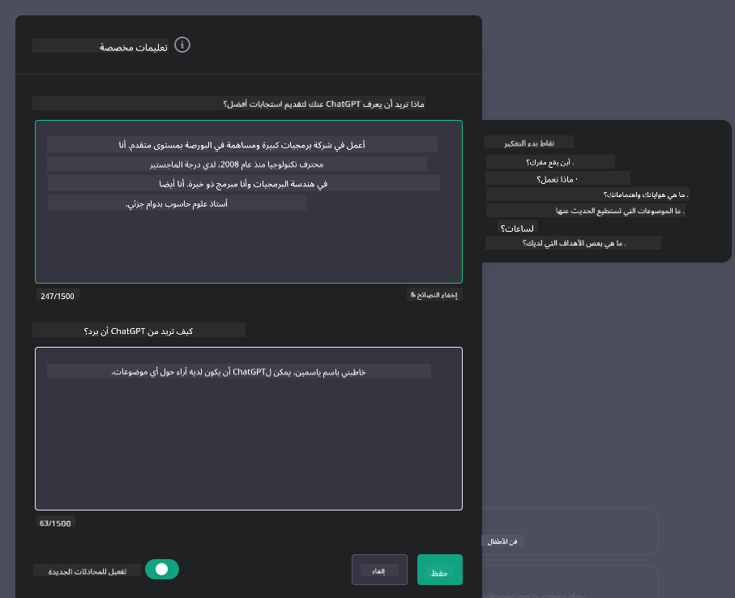
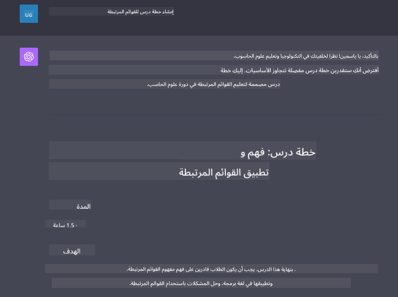

<!--
CO_OP_TRANSLATOR_METADATA:
{
  "original_hash": "ea4bbe640847aafbbba14dae4625e9af",
  "translation_date": "2025-05-19T17:29:45+00:00",
  "source_file": "07-building-chat-applications/README.md",
  "language_code": "ar"
}
-->
# بناء تطبيقات دردشة مدعومة بالذكاء الاصطناعي التوليدي

[](https://aka.ms/gen-ai-lessons7-gh?WT.mc_id=academic-105485-koreyst)

> _(اضغط على الصورة أعلاه لمشاهدة فيديو الدرس)_

الآن بعد أن رأينا كيف يمكننا بناء تطبيقات لتوليد النصوص، دعونا ننظر في تطبيقات الدردشة.

تطبيقات الدردشة أصبحت جزءًا لا يتجزأ من حياتنا اليومية، حيث تقدم أكثر من مجرد وسيلة للتواصل العادي. إنها جزء لا يتجزأ من خدمة العملاء، والدعم الفني، وحتى أنظمة الاستشارة المعقدة. من المحتمل أنك حصلت على بعض المساعدة من تطبيق دردشة مؤخرًا. مع دمج تقنيات أكثر تقدمًا مثل الذكاء الاصطناعي التوليدي في هذه المنصات، تزداد التعقيدات وكذلك التحديات.

بعض الأسئلة التي نحتاج إلى الإجابة عنها هي:

- **بناء التطبيق**. كيف يمكننا بناء ودمج هذه التطبيقات المدعومة بالذكاء الاصطناعي بكفاءة للاستخدامات المحددة؟
- **المراقبة**. بعد النشر، كيف يمكننا مراقبة وضمان أن التطبيقات تعمل بأعلى مستوى من الجودة، سواء من حيث الوظائف أو الالتزام بـ[المبادئ الستة للذكاء الاصطناعي المسؤول](https://www.microsoft.com/ai/responsible-ai?WT.mc_id=academic-105485-koreyst)؟

مع تقدمنا في عصر يتميز بالأتمتة وتفاعلات الإنسان والآلة السلسة، يصبح فهم كيف يغير الذكاء الاصطناعي التوليدي نطاق وعمق وقابلية التكيف لتطبيقات الدردشة أمرًا ضروريًا. هذا الدرس سيبحث في جوانب الهندسة المعمارية التي تدعم هذه الأنظمة المعقدة، ويغوص في المنهجيات لضبطها لمهام محددة في المجال، ويقيم المقاييس والاعتبارات المتعلقة بضمان نشر الذكاء الاصطناعي المسؤول.

## المقدمة

يغطي هذا الدرس:

- تقنيات بناء ودمج تطبيقات الدردشة بكفاءة.
- كيفية تطبيق التخصيص والضبط الدقيق على التطبيقات.
- استراتيجيات واعتبارات لمراقبة تطبيقات الدردشة بفعالية.

## أهداف التعلم

بحلول نهاية هذا الدرس، ستكون قادرًا على:

- وصف الاعتبارات لبناء ودمج تطبيقات الدردشة في الأنظمة الحالية.
- تخصيص تطبيقات الدردشة لحالات الاستخدام المحددة.
- تحديد المقاييس الرئيسية والاعتبارات لمراقبة وصيانة جودة تطبيقات الدردشة المدعومة بالذكاء الاصطناعي بفعالية.
- ضمان أن تطبيقات الدردشة تستفيد من الذكاء الاصطناعي بشكل مسؤول.

## دمج الذكاء الاصطناعي التوليدي في تطبيقات الدردشة

رفع مستوى تطبيقات الدردشة من خلال الذكاء الاصطناعي التوليدي لا يركز فقط على جعلها أكثر ذكاءً؛ بل يتعلق بتحسين هيكلها، أدائها، وواجهة المستخدم لتقديم تجربة مستخدم عالية الجودة. يتضمن ذلك التحقيق في الأسس المعمارية، تكاملات API، واعتبارات واجهة المستخدم. تهدف هذه القسم إلى تقديم خارطة طريق شاملة للتنقل في هذه المجالات المعقدة، سواء كنت تقوم بتوصيلها بأنظمة موجودة أو تبنيها كمنصات مستقلة.

بنهاية هذا القسم، ستكون مجهزًا بالخبرة اللازمة لبناء ودمج تطبيقات الدردشة بكفاءة.

### روبوت الدردشة أم تطبيق الدردشة؟

قبل أن نغوص في بناء تطبيقات الدردشة، دعونا نقارن بين "روبوتات الدردشة" و"تطبيقات الدردشة المدعومة بالذكاء الاصطناعي"، والتي تخدم أدوار ووظائف مختلفة. الهدف الرئيسي لروبوت الدردشة هو أتمتة مهام المحادثة المحددة، مثل الإجابة على الأسئلة المتكررة أو تتبع الطرود. عادة ما يتم التحكم به بواسطة منطق قائم على القواعد أو خوارزميات ذكاء اصطناعي معقدة. في المقابل، تطبيق الدردشة المدعوم بالذكاء الاصطناعي هو بيئة أكثر اتساعًا مصممة لتسهيل أشكال مختلفة من التواصل الرقمي، مثل النصوص، الصوت، والدردشة المرئية بين المستخدمين البشريين. الميزة الرئيسية هي دمج نموذج ذكاء اصطناعي توليدي يحاكي محادثات إنسانية دقيقة، ويولد ردودًا بناءً على مجموعة متنوعة من المدخلات والإشارات السياقية. يمكن لتطبيق الدردشة المدعوم بالذكاء الاصطناعي الانخراط في مناقشات مفتوحة المجال، التكيف مع سياقات المحادثة المتطورة، وحتى إنتاج حوارات إبداعية أو معقدة.

الجدول أدناه يوضح الاختلافات الرئيسية والتشابهات لمساعدتنا على فهم أدوارهم الفريدة في التواصل الرقمي.

| روبوت الدردشة                        | تطبيق الدردشة المدعوم بالذكاء الاصطناعي التوليدي |
| ------------------------------------- | ----------------------------------------------- |
| مركز على المهام وقائم على القواعد    | واعي للسياق                                    |
| غالبًا ما يتم دمجه في أنظمة أكبر     | قد يستضيف واحدًا أو عدة روبوتات دردشة          |
| محدود بوظائف مبرمجة                  | يتضمن نماذج الذكاء الاصطناعي التوليدي          |
| تفاعلات متخصصة ومنظمة               | قادر على المناقشات المفتوحة المجال             |

### الاستفادة من الوظائف المبنية مسبقًا باستخدام SDKs وAPIs

عند بناء تطبيق دردشة، خطوة أولى رائعة هي تقييم ما هو موجود بالفعل. استخدام SDKs وAPIs لبناء تطبيقات الدردشة هو استراتيجية مفيدة لأسباب متنوعة. من خلال دمج SDKs وAPIs موثقة جيدًا، فإنك تضع تطبيقك استراتيجيًا للنجاح على المدى الطويل، مع معالجة مخاوف التوسع والصيانة.

- **يسرع عملية التطوير ويقلل من النفقات العامة**: الاعتماد على الوظائف المبنية مسبقًا بدلاً من العملية المكلفة لبنائها بنفسك يسمح لك بالتركيز على جوانب أخرى من تطبيقك التي قد تجدها أكثر أهمية، مثل منطق الأعمال.
- **أداء أفضل**: عند بناء الوظائف من الصفر، ستسأل نفسك في النهاية "كيف يتوسع؟ هل هذا التطبيق قادر على التعامل مع تدفق مفاجئ للمستخدمين؟" غالبًا ما تحتوي SDKs وAPIs المدارة جيدًا على حلول مدمجة لهذه المخاوف.
- **صيانة أسهل**: التحديثات والتحسينات أسهل في الإدارة حيث أن معظم APIs وSDKs تتطلب ببساطة تحديثًا للمكتبة عند إصدار نسخة جديدة.
- **الوصول إلى التكنولوجيا الحديثة**: الاستفادة من النماذج التي تم ضبطها وتدريبها على مجموعات بيانات واسعة يوفر لتطبيقك قدرات اللغة الطبيعية.

الوصول إلى وظائف SDK أو API عادة ما يتضمن الحصول على إذن لاستخدام الخدمات المقدمة، والذي غالبًا ما يكون من خلال استخدام مفتاح فريد أو رمز مصادقة. سنستخدم مكتبة OpenAI Python لاستكشاف كيف يبدو ذلك. يمكنك أيضًا تجربته بنفسك في [دفتر الملاحظات لـ OpenAI](../../../07-building-chat-applications/python/oai-assignment.ipynb) أو [دفتر الملاحظات لـ Azure OpenAI Services](../../../07-building-chat-applications/python/aoai-assignment.ipynb) لهذا الدرس.

```python
import os
from openai import OpenAI

API_KEY = os.getenv("OPENAI_API_KEY","")

client = OpenAI(
    api_key=API_KEY
    )

chat_completion = client.chat.completions.create(model="gpt-3.5-turbo", messages=[{"role": "user", "content": "Suggest two titles for an instructional lesson on chat applications for generative AI."}])
```

المثال أعلاه يستخدم نموذج GPT-3.5 Turbo لإكمال الطلب، ولكن لاحظ أن مفتاح API يتم تعيينه قبل القيام بذلك. ستتلقى خطأ إذا لم تقم بتعيين المفتاح.

## تجربة المستخدم (UX)

مبادئ UX العامة تنطبق على تطبيقات الدردشة، ولكن هنا بعض الاعتبارات الإضافية التي تصبح مهمة بشكل خاص بسبب المكونات التعلم الآلي المتضمنة.

- **آلية لمعالجة الغموض**: نماذج الذكاء الاصطناعي التوليدي أحيانًا تولد إجابات غامضة. ميزة تسمح للمستخدمين بطلب التوضيح يمكن أن تكون مفيدة إذا واجهوا هذه المشكلة.
- **الاحتفاظ بالسياق**: نماذج الذكاء الاصطناعي التوليدي المتقدمة لديها القدرة على تذكر السياق داخل المحادثة، مما يمكن أن يكون أصلًا ضروريًا لتجربة المستخدم. إعطاء المستخدمين القدرة على التحكم وإدارة السياق يحسن تجربة المستخدم، ولكنه يقدم خطر الاحتفاظ بمعلومات المستخدم الحساسة. الاعتبارات حول مدة تخزين هذه المعلومات، مثل تقديم سياسة الاحتفاظ، يمكن أن توازن بين الحاجة للسياق والخصوصية.
- **التخصيص**: مع القدرة على التعلم والتكيف، تقدم نماذج الذكاء الاصطناعي تجربة فردية للمستخدم. تخصيص تجربة المستخدم من خلال ميزات مثل ملفات تعريف المستخدم لا تجعل المستخدم يشعر بأنه مفهوم فقط، بل تساعد أيضًا في سعيه للعثور على إجابات محددة، مما يخلق تفاعلًا أكثر كفاءة ورضا.

أحد الأمثلة على التخصيص هو إعدادات "التعليمات المخصصة" في ChatGPT من OpenAI. يسمح لك بتقديم معلومات عن نفسك قد تكون سياقًا مهمًا لطلباتك. إليك مثال على تعليمات مخصصة.



هذه "الملف الشخصي" تطلب من ChatGPT إنشاء خطة درس حول القوائم المرتبطة. لاحظ أن ChatGPT يأخذ بعين الاعتبار أن المستخدم قد يرغب في خطة درس أكثر عمقًا بناءً على خبرتها.



### إطار رسالة النظام من مايكروسوفت للنماذج اللغوية الكبيرة

[مايكروسوفت قدمت توجيهًا](https://learn.microsoft.com/azure/ai-services/openai/concepts/system-message#define-the-models-output-format?WT.mc_id=academic-105485-koreyst) لكتابة رسائل نظام فعالة عند توليد الردود من LLMs مقسمة إلى 4 مجالات:

1. تحديد لمن النموذج، وكذلك قدراته وقيوده.
2. تحديد صيغة إخراج النموذج.
3. تقديم أمثلة محددة توضح السلوك المقصود للنموذج.
4. توفير حواجز سلوكية إضافية.

### إمكانية الوصول

سواء كان المستخدم يعاني من إعاقات بصرية، سمعية، حركية، أو معرفية، يجب أن يكون تطبيق الدردشة المصمم جيدًا قابلًا للاستخدام من قبل الجميع. القائمة التالية تكسر ميزات محددة تهدف إلى تحسين إمكانية الوصول لمختلف إعاقات المستخدمين.

- **ميزات لضعف البصر**: موضوعات عالية التباين ونص قابل لتغيير الحجم، توافق مع قارئ الشاشة.
- **ميزات لضعف السمع**: وظائف تحويل النص إلى كلام وتحويل الكلام إلى نص، إشارات مرئية للإشعارات الصوتية.
- **ميزات لضعف الحركة**: دعم التنقل عبر لوحة المفاتيح، الأوامر الصوتية.
- **ميزات لضعف الإدراك**: خيارات لغة مبسطة.

## التخصيص والضبط الدقيق لنماذج اللغة الخاصة بالمجال

تخيل تطبيق دردشة يفهم مصطلحات شركتك ويتوقع الاستفسارات المحددة التي يمتلكها قاعدة مستخدميه بشكل شائع. هناك عدة نهج تستحق الذكر:

- **الاستفادة من نماذج DSL**. DSL يرمز إلى لغة خاصة بالمجال. يمكنك الاستفادة من ما يسمى بنموذج DSL المدرب على مجال معين لفهم مفاهيمه وسيناريوهاته.
- **تطبيق الضبط الدقيق**. الضبط الدقيق هو عملية تدريب النموذج بشكل إضافي باستخدام بيانات محددة.

## التخصيص: استخدام DSL

الاستفادة من نماذج اللغة الخاصة بالمجال (DSL Models) يمكن أن تعزز تفاعل المستخدم من خلال توفير تفاعلات متخصصة وذات صلة بالسياق. إنه نموذج مدرب أو مضبوط لفهم وتوليد نص يتعلق بمجال معين، صناعة، أو موضوع. الخيارات لاستخدام نموذج DSL يمكن أن تتنوع من تدريب واحد من الصفر، إلى استخدام نماذج موجودة مسبقًا من خلال SDKs وAPIs. خيار آخر هو الضبط الدقيق، الذي يتضمن أخذ نموذج مدرب مسبقًا وتكييفه لمجال معين.

## التخصيص: تطبيق الضبط الدقيق

غالبًا ما يعتبر الضبط الدقيق عندما يكون النموذج المدرب مسبقًا غير كافٍ في مجال متخصص أو مهمة محددة.

على سبيل المثال، الاستفسارات الطبية معقدة وتتطلب الكثير من السياق. عندما يقوم محترف طبي بتشخيص مريض، يكون ذلك بناءً على مجموعة متنوعة من العوامل مثل نمط الحياة أو الحالات الموجودة مسبقًا، وقد يعتمد حتى على المجلات الطبية الحديثة للتحقق من تشخيصهم. في مثل هذه السيناريوهات الدقيقة، لا يمكن لتطبيق الدردشة الذكاء الاصطناعي العام أن يكون مصدرًا موثوقًا.

### السيناريو: تطبيق طبي

فكر في تطبيق دردشة مصمم لمساعدة الممارسين الطبيين من خلال توفير مراجع سريعة لإرشادات العلاج، تفاعلات الأدوية، أو النتائج البحثية الحديثة.

قد يكون النموذج العام كافٍ للإجابة على الأسئلة الطبية الأساسية أو تقديم نصائح عامة، ولكنه قد يواجه صعوبة في الحالات التالية:

- **الحالات المحددة أو المعقدة للغاية**. على سبيل المثال، قد يسأل طبيب الأعصاب التطبيق، "ما هي أفضل الممارسات الحالية لإدارة الصرع المقاوم للعلاج في المرضى الأطفال؟"
- **عدم وجود التطورات الحديثة**. قد يواجه النموذج العام صعوبة في تقديم إجابة حالية تتضمن أحدث التطورات في علم الأعصاب وعلم الأدوية.

في حالات مثل هذه، يمكن أن يحسن الضبط الدقيق للنموذج باستخدام مجموعة بيانات طبية متخصصة بشكل كبير قدرته على التعامل مع هذه الاستفسارات الطبية المعقدة بشكل أكثر دقة وموثوقية. يتطلب ذلك الوصول إلى مجموعة بيانات كبيرة وذات صلة تمثل التحديات والأسئلة الخاصة بالمجال التي تحتاج إلى معالجة.

## الاعتبارات لتجربة دردشة عالية الجودة مدفوعة بالذكاء الاصطناعي

تحدد هذه القسم المعايير لتطبيقات الدردشة "عالية الجودة"، والتي تشمل التقاط المقاييس القابلة للتنفيذ والالتزام بإطار عمل يستفيد من تقنية الذكاء الاصطناعي بشكل مسؤول.

### المقاييس الرئيسية

للحفاظ على أداء عالي الجودة للتطبيق، من الضروري تتبع المقاييس والاعتبارات الرئيسية. هذه القياسات لا تضمن فقط وظيفة التطبيق بل تقيم أيضًا جودة النموذج الذكاء الاصطناعي وتجربة المستخدم. أدناه قائمة تغطي المقاييس الأساسية، الذكاء الاصطناعي، وتجربة المستخدم للنظر فيها.

| المقياس                        | التعريف                                                                                                             | الاعتبارات لمطور الدردشة                                                 |
| ----------------------------- | ---------------------------------------------------------------------------------------------------------------------- | ------------------------------------------------------------------------- |
| **وقت التشغيل**               | يقيس الوقت الذي يكون فيه التطبيق قيد التشغيل ويمكن الوصول إليه من قبل المستخدمين.                                    | كيف ستقلل من وقت التوقف؟                                                  |
| **وقت الاستجابة**            | الوقت الذي يستغرقه التطبيق للرد على استفسار المستخدم.                                                                  | كيف يمكنك تحسين معالجة الاستفسارات لتحسين وقت الاستجابة؟                 |
| **الدقة**                     | نسبة التنبؤات الإيجابية الحقيقية إلى إجمالي عدد التنبؤات الإيجابية                                                     | كيف ستتحقق من دقة النموذج الخاص بك؟                                       |
| **التذكر (الحساسية)**        | نسبة التنبؤات الإيجابية الحقيقية إلى العدد الفعلي للإيجابيات                                                            | كيف ستقيس وتحسن التذكر؟                                                   |
| **درجة F1**                   | المتوسط التوافقي للدقة والتذكر، الذي يوازن بين التبادل بينهما.                                                          | ما هي درجة F1 المستهدفة لديك؟ كيف ستوازن بين الدقة والتذكر؟               |
| **التعقيد**                  | يقيس مدى توافق توزيع الاحتمالية الذي يتنبأ به النموذج مع التوزيع الفعلي للبيانات.                                        | كيف ستقلل من التعقيد؟                                                      |
| **مقاييس رضا المستخدم**       | يقيس إدراك المستخدم للتطبيق. غالبًا ما يتم التقاطها من خلال الاستطلاعات.                                               | كم مرة ستجمع ملاحظات المستخدم؟ كيف ستتكيف بناءً عليها؟                    |
| **معدل الخطأ**                | معدل ارتكاب النموذج للأخطاء في الفهم أو الإخراج.                                                                        | ما هي الاستراتيجيات التي لديك لتقليل معدلات الخطأ؟                         |
| **دورات إعادة التدريب**       | التكرار الذي يتم فيه تحديث النموذج لدمج بيانات ورؤى جديدة.                                                             | كم مرة ستعيد تدريب النموذج؟ ما الذي يثير دورة إعادة التدريب؟               |
| **كشف الشذوذ**               | أدوات وتقنيات لتحديد الأنماط غير العادية التي لا تتوافق مع السلوك المتوقع.                                             | كيف ستستجيب للشذوذات؟                                                      |

### تنفيذ ممارسات الذكاء الاصطناعي المسؤول في تطبيقات الدردشة

نهج مايكروسوفت للذكاء الاصطناعي المسؤول حدد ستة مبادئ يجب أن توجه تطوير واستخدام الذكاء الاصطناعي. أدناه المبادئ، تعريفها، وما يجب على مطور الدردشة النظر فيه ولماذا يجب أن يأخذها على محمل الجد.

| المبادئ                   | تعريف مايكروسوفت                                        | الاعتبارات لمطور الدردشة                                               | لماذا هو مهم                                                                     |
| ------------------------ | ----------------------------------------------------- | --------------------------------------------------------------------- | -------------------------------------------------------------------------------- |
| الإنصاف                  | يجب أن تعامل أنظمة الذكاء الاصطناعي جميع الأشخاص بإنصاف. | ضمان أن تطبيق الدردشة لا يميز بناءً على بيانات المستخدم.             | لبناء الثقة والشمول بين المستخدمين؛ يتجنب العواقب القانونية.                   |
| الموثوقية والسلامة       | يجب أن تعمل أنظمة الذكاء الاصطناعي بشكل موثوق وآمن.    | تنفيذ الاختبارات ووسائل الأمان لتقليل الأخطاء والمخاطر.              | يضمن رضا المستخدم ويمنع الأضرار المحتملة.                                       |
| الخصوصية والأمان         | يجب أن تكون أنظمة الذكاء الاصطناعي آمنة وتحترم الخصوصية. | تنفيذ تشفير قوي وتدابير حماية البيانات.                             | لحماية بيانات المستخدم الحساسة والامتثال للقوانين المتعلقة بالخصوصية.         |
| الشمولية                 | يجب أن تمكّن أنظمة

**إخلاء المسؤولية**:  
تمت ترجمة هذه الوثيقة باستخدام خدمة الترجمة بالذكاء الاصطناعي [Co-op Translator](https://github.com/Azure/co-op-translator). بينما نسعى لتحقيق الدقة، يُرجى العلم أن الترجمات الآلية قد تحتوي على أخطاء أو عدم دقة. يجب اعتبار الوثيقة الأصلية بلغتها الأم هي المصدر الموثوق. للحصول على معلومات حاسمة، يُوصى بالترجمة البشرية المهنية. نحن غير مسؤولين عن أي سوء فهم أو تفسير خاطئ ناتج عن استخدام هذه الترجمة.