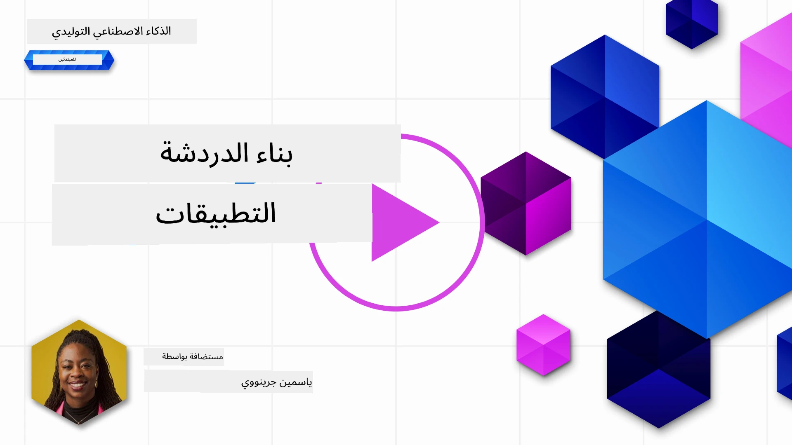
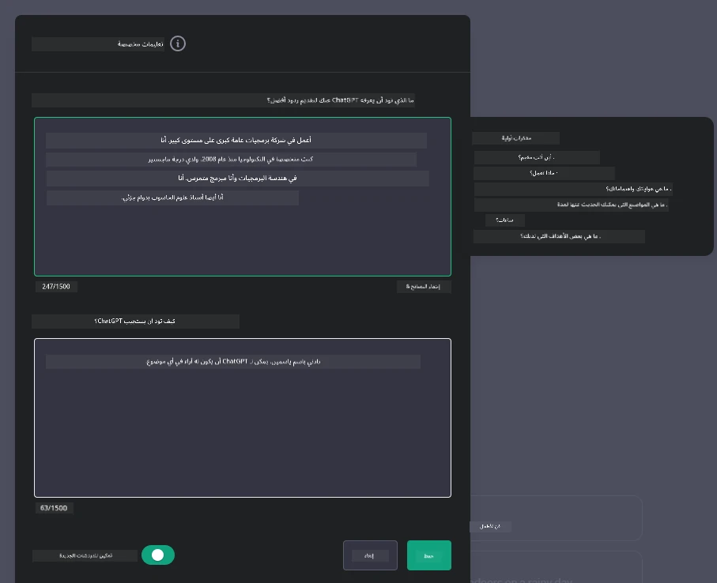
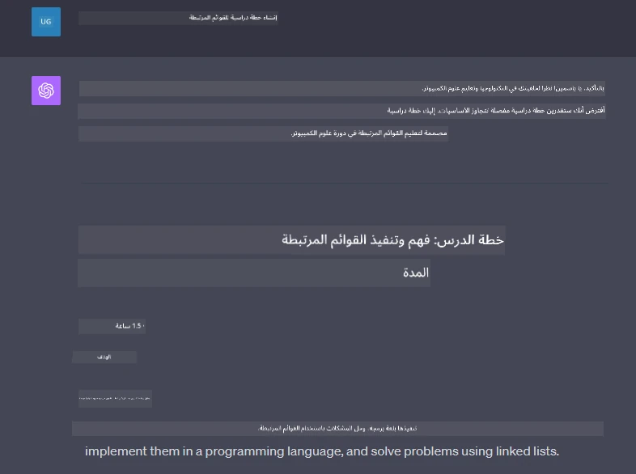

# بناء تطبيقات الدردشة المدعومة بالذكاء الاصطناعي التوليدي

[](https://youtu.be/R9V0ZY1BEQo?si=IHuU-fS9YWT8s4sA)

> _(انقر على الصورة أعلاه لمشاهدة فيديو هذا الدرس)_

الآن بعد أن رأينا كيف يمكننا بناء تطبيقات توليد النصوص، دعونا نلقي نظرة على تطبيقات الدردشة.

أصبحت تطبيقات الدردشة جزءًا لا يتجزأ من حياتنا اليومية، حيث تقدم أكثر من مجرد وسيلة للمحادثات العادية. فهي جزء أساسي من خدمة العملاء، والدعم الفني، وحتى أنظمة الاستشارات المتقدمة. من المحتمل أنك قد استفدت من تطبيق دردشة منذ وقت غير بعيد. مع دمج تقنيات أكثر تقدمًا مثل الذكاء الاصطناعي التوليدي في هذه المنصات، تزداد التعقيدات وكذلك التحديات.

بعض الأسئلة التي نحتاج لإيجاد إجابات لها هي:

- **بناء التطبيق**. كيف نبني هذه التطبيقات المدعومة بالذكاء الاصطناعي بكفاءة وندمجها بسلاسة لحالات استخدام محددة؟
- **المراقبة**. بعد النشر، كيف يمكننا مراقبة وضمان عمل التطبيقات على أعلى مستوى من الجودة، سواء من حيث الوظائف أو الالتزام بـ [مبادئ الذكاء الاصطناعي المسؤول الستة](https://www.microsoft.com/ai/responsible-ai?WT.mc_id=academic-105485-koreyst)؟

بينما نتقدم أكثر في عصر يعرف بالأتمتة والتفاعلات البشرية-الآلية السلسة، يصبح فهم كيف يحول الذكاء الاصطناعي التوليدي نطاق وعمق وقابلية التكيف لتطبيقات الدردشة أمرًا ضروريًا. سيتناول هذا الدرس جوانب البنية التي تدعم هذه الأنظمة المعقدة، ويتعمق في منهجيات ضبطها لمهام مخصصة، ويقيم المقاييس والاعتبارات المتعلقة بضمان نشر الذكاء الاصطناعي بمسؤولية.

## مقدمة

يغطي هذا الدرس:

- تقنيات بناء ودمج تطبيقات الدردشة بكفاءة.
- كيفية تطبيق التخصيص وضبط الأداء للتطبيقات.
- استراتيجيات واعتبارات لمراقبة تطبيقات الدردشة بفعالية.

## أهداف التعلم

بحلول نهاية هذا الدرس، ستكون قادرًا على:

- وصف الاعتبارات لبناء ودمج تطبيقات الدردشة في الأنظمة القائمة.
- تخصيص تطبيقات الدردشة لحالات استخدام محددة.
- تحديد المقاييس الرئيسية والاعتبارات لمراقبة وصيانة جودة تطبيقات الدردشة المدعومة بالذكاء الاصطناعي.
- ضمان أن تستغل تطبيقات الدردشة الذكاء الاصطناعي بمسؤولية.

## دمج الذكاء الاصطناعي التوليدي في تطبيقات الدردشة

رفع مستوى تطبيقات الدردشة من خلال الذكاء الاصطناعي التوليدي لا يقتصر فقط على جعلها أكثر ذكاءً؛ بل يتعلق بتحسين بنيتها وأدائها وواجهة المستخدم لتوفير تجربة مستخدم عالية الجودة. وهذا يشمل دراسة الأسس المعمارية، ودمج واجهات برمجة التطبيقات، واعتبارات واجهة المستخدم. يهدف هذا القسم إلى تقديم خارطة طريق شاملة لتوجيهك عبر هذه المجالات المعقدة، سواء كنت توصلها بالأنظمة القائمة أو تبنيها كمنصات مستقلة.

بنهاية هذا القسم، ستكون مجهزًا بالخبرة اللازمة لبناء ودمج تطبيقات الدردشة بكفاءة.

### روبوت الدردشة أم تطبيق الدردشة؟

قبل أن نغوص في بناء تطبيقات الدردشة، دعونا نقارن بين "روبوتات الدردشة" و"تطبيقات الدردشة المدعومة بالذكاء الاصطناعي"، التي تخدم أدوارًا ووظائف مختلفة. الغرض الرئيسي من روبوت الدردشة هو أتمتة مهام محادثة محددة، مثل الإجابة على الأسئلة الشائعة أو تتبع طرد. عادةً ما يستند إلى منطق قائم على قواعد أو خوارزميات معقدة. بالمقابل، تطبيق الدردشة المدعوم بالذكاء الاصطناعي هو بيئة أوسع بكثير مصممة لتسهيل أشكال مختلفة من الاتصال الرقمي، مثل الدردشات النصية، والصوتية، والفيديو بين المستخدمين البشر. يتميز بدمج نموذج الذكاء الاصطناعي التوليدي الذي يحاكي المحادثات البشرية المفصلة، مولدًا ردودًا بناءً على مجموعة واسعة من المدخلات والسياقات. يمكن لتطبيق الدردشة المدعوم بالذكاء الاصطناعي التوليدي المشاركة في مناقشات مفتوحة المجال، والتكيف مع سياقات المحادثة المتغيرة، وحتى إنتاج حوارات إبداعية أو معقدة.

يوضح الجدول أدناه الفروقات والتشابهات الرئيسية لمساعدتنا على فهم أدوارهم الفريدة في الاتصال الرقمي.

| روبوت الدردشة                       | تطبيق الدردشة المدعوم بالذكاء الاصطناعي التوليدي          |
| ---------------------------------- | -------------------------------------                       |
| يركز على المهام ومبني على قواعد   | مدرك للسياق                                                 |
| غالبًا ما يدمج في أنظمة أكبر       | قد يستضيف روبوت دردشة واحد أو عدة روبوتات                   |
| محدود بالوظائف المبرمجة             | يتضمن نماذج الذكاء الاصطناعي التوليدي                         |
| تفاعلات متخصصة ومنظمة               | قادر على مناقشات مفتوحة المجال                              |

### الاستفادة من الوظائف المدمجة مسبقًا مع SDKs وAPIs

عند بناء تطبيق دردشة، خطوة أولى رائعة هي تقييم ما هو موجود بالفعل. استخدام SDKs وAPIs لبناء تطبيقات الدردشة هو استراتيجية مفيدة لأسباب متعددة. من خلال دمج SDKs وAPIs موثقة جيدًا، تضع تطبيقك استراتيجيًا للنجاح على المدى الطويل، مع معالجة قضايا القابلية للتوسع والصيانة.

- **يسرع عملية التطوير ويقلل العبء**: الاعتماد على الوظائف المدمجة بدلاً من بناء كل شيء بنفسك، يتيح لك التركيز على جوانب أخرى من تطبيقك قد تجدها أكثر أهمية، مثل منطق العمل.
- **أداء أفضل**: عند بناء الوظائف من الصفر، في النهاية ستسأل نفسك "كيف يتوسع؟ هل هذا التطبيق قادر على التعامل مع زيادة مفاجئة في المستخدمين؟" غالبًا ما تحتوي SDKs وAPIs المُدارة جيدًا على حلول مدمجة لهذه المخاوف.
- **سهولة الصيانة**: التحديثات والتحسينات أسهل للإدارة حيث أن معظم APIs وSDKs تتطلب ببساطة تحديث مكتبة عند إصدار نسخة أحدث.
- **الوصول إلى أحدث التقنيات**: استغلال النماذج التي تم ضبطها وتدريبها على مجموعات بيانات واسعة يزود تطبيقك بقدرات اللغة الطبيعية.

عادةً ما يتطلب الوصول إلى وظائف SDK أو API الحصول على إذن لاستخدام الخدمات المقدمة، والذي غالبًا ما يكون من خلال مفتاح فريد أو رمز مصادقة. سنستخدم مكتبة OpenAI للبايثون لاستكشاف ما يشبه ذلك. يمكنك أيضًا تجربتها بنفسك في [دفتر ملاحظات OpenAI](./python/oai-assignment.ipynb?WT.mc_id=academic-105485-koreyst) أو [دفتر ملاحظات خدمات Azure OpenAI](./python/aoai-assignment.ipynb?WT.mc_id=academic-105485-koreys) لهذا الدرس.

```python
import os
from openai import OpenAI

API_KEY = os.getenv("OPENAI_API_KEY","")

client = OpenAI(
    api_key=API_KEY
    )

response = client.responses.create(model="gpt-5-mini", input="Suggest two titles for an instructional lesson on chat applications for generative AI.", store=False)
print(response.output_text)
```

المثال أعلاه يستخدم نموذج GPT-5 المصغر مع API الإجابات لإكمال الموجه، لكن لاحظ أن مفتاح API تم تعيينه مسبقًا. ستتلقى خطأ إذا لم تقم بتعيين المفتاح.

## تجربة المستخدم (UX)

تنطبق مبادئ تجربة المستخدم العامة على تطبيقات الدردشة، لكن هنا بعض الاعتبارات الإضافية التي تصبح مهمة بشكل خاص بسبب مكونات التعلم الآلي المشاركة.

- **آلية لمعالجة الغموض**: تنتج نماذج الذكاء الاصطناعي التوليدي أحيانًا إجابات غامضة. ميزة تسمح للمستخدمين بطلب توضيح يمكن أن تكون مفيدة إذا واجهوا هذه المشكلة.
- **الحفاظ على السياق**: تمتلك نماذج الذكاء الاصطناعي التوليدي المتقدمة القدرة على تذكر السياق داخل المحادثة، وهو أمر ضروري لتحسين تجربة المستخدم. منح المستخدمين القدرة على التحكم وإدارة السياق يعزز تجربة المستخدم، لكنه يقدم خطر احتفاظ المعلومات الحساسة. يمكن أن توازن اعتبارات مدة حفظ هذه المعلومات، مثل إدخال سياسة احتفاظ، بين الحاجة للسياق والخصوصية.
- **التخصيص**: بفضل القدرة على التعلم والتكيف، توفر النماذج تجربة مخصصة للمستخدم. تخصيص تجربة المستخدم من خلال ميزات مثل ملفات المستخدمين لا يجعل المستخدم يشعر بأنه مفهوم فحسب، بل يساعده أيضًا في العثور على إجابات محددة، مما يخلق تفاعلًا أكثر كفاءة ورضا.

مثال على ذلك هو إعدادات "التعليمات المخصصة" في ChatGPT من OpenAI. تتيح لك هذه الميزة تقديم معلومات عن نفسك قد تكون سياقًا مهمًا لموجهاتك. إليك مثال على تعليمات مخصصة.



هذه "الملف الشخصي" يوجه ChatGPT لإنشاء خطة درس حول القوائم المرتبطة. لاحظ أن ChatGPT يأخذ في الاعتبار أن المستخدم قد يرغب في خطة درس أكثر تفصيلًا بناءً على خبرتها.



### إطار رسائل النظام من مايكروسوفت للنماذج اللغوية الكبيرة

[قدمت مايكروسوفت إرشادات](https://learn.microsoft.com/azure/ai-foundry/openai/concepts/system-message#define-the-models-output-format?WT.mc_id=academic-105485-koreyst) لكتابة رسائل نظام فعالة عند توليد ردود من النماذج اللغوية الكبيرة مقسمة إلى 4 مجالات:

1. تحديد لمن النموذج مخصص، بالإضافة إلى قدراته وقيوده.
2. تعريف تنسيق مخرجات النموذج.
3. توفير أمثلة محددة تظهر سلوك النموذج المقصود.
4. توفير حواجز سلوكية إضافية.

### إمكانية الوصول

سواء كان لدى المستخدم إعاقات بصرية أو سمعية أو حركية أو معرفية، يجب أن يكون تطبيق الدردشة المصمم جيدًا قابلاً للاستخدام للجميع. القائمة التالية تفصل ميزات معينة تهدف إلى تحسين إمكانية الوصول لمختلف إعاقات المستخدمين.

- **ميزات للإعاقات البصرية**: سمات عالية التباين ونص قابل لتغيير الحجم، توافق مع قارئ الشاشة.
- **ميزات للإعاقات السمعية**: وظائف تحويل النص إلى كلام والكلام إلى نص، مؤشرات بصرية للإشعارات الصوتية.
- **ميزات للإعاقات الحركية**: دعم التنقل باستخدام لوحة المفاتيح، الأوامر الصوتية.
- **ميزات للإعاقات المعرفية**: خيارات لغة مبسطة.

## التخصيص والضبط الدقيق لنماذج اللغة الخاصة بالمجال

تخيل تطبيق دردشة يفهم مصطلحات شركتك ويتوقع الاستفسارات المحددة التي يطرحها المستخدمون عادةً. هناك نهجان يستحقان الذكر:

- **الاستفادة من نماذج DSL**. DSL تعني لغة خاصة بالمجال. يمكنك استخدام ما يسمى بنموذج DSL مدرب على مجال محدد لفهم مفاهيمه وسيناريوهاته.
- **تطبيق الضبط الدقيق**. الضبط الدقيق هو عملية تدريب إضافي لنموذجك ببيانات محددة.

## التخصيص: استخدام DSL

يمكن أن يعزز الاستفادة من نماذج اللغة الخاصة بالمجال (نماذج DSL) التفاعل مع المستخدم من خلال توفير تفاعلات متخصصة وذات صلة سياقية. هو نموذج تم تدريبه أو ضبطه لفهم وتوليد نص متعلق بمجال أو صناعة أو موضوع معين. خيارات استخدام نموذج DSL يمكن أن تتفاوت بين تدريبه من البداية، إلى استخدام النماذج الموجودة مسبقًا عبر SDKs وAPIs. خيار آخر هو الضبط الدقيق، والذي يتضمن أخذ نموذج مدرب مسبقاً وتكييفه لمجال محدد.

## التخصيص: تطبيق الضبط الدقيق

يُنظر إلى الضبط الدقيق عادة عندما لا يفي النموذج المدرب مسبقًا بأداء كافٍ في مجال متخصص أو مهمة محددة.

على سبيل المثال، الاستفسارات الطبية معقدة وتتطلب الكثير من السياق. عندما يقوم متخصص طبي بتشخيص مريض يعتمد على عوامل متنوعة مثل نمط الحياة أو الحالات المرضية المسبقة، وقد يعتمد أيضًا على المجلات الطبية الحديثة للتحقق من تشخيصه. في مثل هذه السيناريوهات الدقيقة، لا يمكن أن يكون تطبيق دردشة الذكاء الاصطناعي العام مصدرًا موثوقًا به.

### السيناريو: تطبيق طبي

فكر في تطبيق دردشة مصمم لمساعدة المختصين الطبيين من خلال توفير مراجع سريعة لإرشادات العلاج، تفاعلات الأدوية، أو نتائج الأبحاث الحديثة.

قد يكون نموذج عام كافياً للإجابة على أسئلة طبية أساسية أو تقديم نصائح عامة، لكنه قد يواجه صعوبة في:

- **حالات محددة أو معقدة للغاية**. على سبيل المثال، قد يسأل طبيب أعصاب التطبيق: "ما هي أفضل الممارسات الحالية لإدارة الصرع المقاوم للأدوية عند الأطفال؟"
- **نقص التقدمات الحديثة**. قد يجد النموذج العام صعوبة في توفير إجابة محدثة تتضمن آخر التطورات في علم الأعصاب وعلم العقاقير.

في مثل هذه الحالات، يمكن أن يحسن الضبط الدقيق للنموذج باستخدام مجموعة بيانات طبية متخصصة بشكل كبير من قدرته على التعامل بدقة وموثوقية مع هذه الاستفسارات الطبية المعقدة. وهذا يتطلب الوصول إلى مجموعة بيانات كبيرة وذات صلة تمثل التحديات والأسئلة الخاصة بالمجال.

## اعتبارات لتجربة دردشة مدفوعة بالذكاء الاصطناعي عالية الجودة

يحدد هذا القسم معايير تطبيقات الدردشة "عالية الجودة"، والتي تشمل التقاط المقاييس القابلة للتنفيذ والالتزام بإطار عمل يستغل تقنيات الذكاء الاصطناعي بمسؤولية.

### المقاييس الرئيسية

للحفاظ على أداء التطبيق عالي الجودة، من الضروري تتبع المقاييس والاعتبارات الرئيسية. هذه القياسات لا تضمن فقط وظيفة التطبيق، بل تقيم جودة نموذج الذكاء الاصطناعي وتجربة المستخدم. القائمة أدناه تغطي مقاييس أساسية، الذكاء الاصطناعي، وتجربة المستخدم للنظر فيها.

| المقياس                     | التعريف                                                                                                                  | اعتبارات لمطور الدردشة                                               |
| -------------------------- | ------------------------------------------------------------------------------------------------------------------------ | -------------------------------------------------------------------- |
| **مدة التشغيل**            | يقيس الوقت الذي يكون فيه التطبيق عمليًا ومتاحة للمستخدمين.                                                               | كيف ستقلل وقت التوقف؟                                                |
| **زمن الاستجابة**          | الوقت الذي يستغرقه التطبيق للرد على استفسار المستخدم.                                                                    | كيف يمكنك تحسين معالجة الاستعلامات لتحسين زمن الاستجابة؟           |
| **الدقة**                  | نسبة التنبؤات الإيجابية الصحيحة إلى إجمالي عدد التنبؤات الإيجابية.                                                        | كيف ستتحقق من دقة نموذجك؟                                           |
| **الاستدعاء (الحساسية)**   | نسبة التنبؤات الإيجابية الصحيحة إلى العدد الفعلي للحالات الإيجابية.                                                        | كيف ستقيس وتحسن الاستدعاء؟                                          |
| **مؤشر F1**                | المتوسط التوافقي للدقة والاستدعاء، الذي يوازن بين الاثنين.                                                                | ما هو مؤشر F1 المستهدف؟ كيف ستحقق التوازن بين الدقة والاستدعاء؟    |
| **الارتباك**               | يقيس مدى توافق توزيع الاحتمالات الذي يتنبأ به النموذج مع التوزيع الفعلي للبيانات.                                          | كيف ستقلل الارتباك؟                                                 |
| **مقاييس رضا المستخدم**    | تقيس إدراك المستخدم للتطبيق، غالبًا من خلال الاستبيانات.                                                                   | كم مرة ستجمع تعليقات المستخدمين؟ وكيف ستتأقلم بناءً عليها؟          |
| **معدل الخطأ**             | معدل الأخطاء التي يرتكبها النموذج في الفهم أو الإخراج.                                                                      | ما الاستراتيجيات التي لديك لتقليل معدلات الخطأ؟                    |
| **دورات إعادة التدريب**    | تكرار تحديث النموذج لإدخال بيانات ورؤى جديدة.                                                                               | كم مرة ستعيد تدريب النموذج؟ وما الذي يحفز دورة إعادة التدريب؟       |

| **كشف الشذوذ**             | أدوات وتقنيات لتحديد الأنماط غير العادية التي لا تتوافق مع السلوك المتوقع.                        | كيف ستستجيب للشذوذ؟                                        |

### تنفيذ ممارسات الذكاء الاصطناعي المسؤول في تطبيقات الدردشة

لقد حدد نهج مايكروسوفت تجاه الذكاء الاصطناعي المسؤول ستة مبادئ يجب أن توجه تطوير واستخدام الذكاء الاصطناعي. فيما يلي المبادئ، تعريفها، والأمور التي ينبغي لمطور الدردشة أخذها بعين الاعتبار ولماذا يجب أن يأخذها على محمل الجد.

| المبادئ                 | تعريف مايكروسوفت                                       | اعتبارات لمطور الدردشة                                            | لماذا هو مهم                                                                     |
| ---------------------- | ----------------------------------------------------- | ---------------------------------------------------------------- | -------------------------------------------------------------------------------- |
| العدالة                 | يجب على أنظمة الذكاء الاصطناعي معاملة جميع الأشخاص بعدل. | ضمان ألا يميز تطبيق الدردشة بناءً على بيانات المستخدم.            | لبناء الثقة والشمولية بين المستخدمين؛ لتجنب العواقب القانونية.                |
| الاعتمادية والسلامة    | يجب أن تعمل أنظمة الذكاء الاصطناعي بشكل موثوق وآمن.    | تنفيذ اختبارات وآليات أمان لتقليل الأخطاء والمخاطر.               | يضمن رضا المستخدم ويمنع الضرر المحتمل.                                         |
| الخصوصية والأمان        | يجب أن تكون أنظمة الذكاء الاصطناعي آمنة وتحترم الخصوصية. | تنفيذ تشفير قوي وتدابير حماية البيانات.                           | لحماية بيانات المستخدم الحساسة والامتثال لقوانين الخصوصية.                     |
| الشمولية                | يجب أن تمكّن أنظمة الذكاء الاصطناعي الجميع وتجذب الناس. | تصميم واجهة مستخدم/تجربة مستخدم يمكن الوصول إليها وسهلة الاستخدام لجماهير متنوعة. | يضمن أن مجموعة أوسع من الأشخاص يمكنهم استخدام التطبيق بفعالية.              |
| الشفافية                | يجب أن تكون أنظمة الذكاء الاصطناعي مفهومة.             | توفير توثيق واضح وتفسير لردود الذكاء الاصطناعي.                    | من المرجح أن يثق المستخدمون في النظام إذا تمكنوا من فهم كيفية اتخاذ القرارات.   |
| المساءلة                | يجب أن يكون الناس مسؤولين عن أنظمة الذكاء الاصطناعي.   | إنشاء عملية واضحة لتدقيق وتحسين قرارات الذكاء الاصطناعي.          | يتيح التحسين المستمر واتخاذ إجراءات تصحيحية في حالة حدوث أخطاء.                |

## المهمة

انظر [assignment](../../../07-building-chat-applications/python). سيأخذك خلال سلسلة من التدريبات بدءًا من تشغيل أول طلبات الدردشة، وتصنيف وتلخيص النصوص والمزيد. لاحظ أن المهام متاحة بلغات برمجة مختلفة!

## عمل رائع! واصل الرحلة

بعد إتمام هذا الدرس، تحقق من [مجموعة التعلم للذكاء الاصطناعي التوليدي](https://aka.ms/genai-collection?WT.mc_id=academic-105485-koreyst) لمواصلة تطوير معرفتك بالذكاء الاصطناعي التوليدي!

انتقل إلى الدرس 8 لترى كيف يمكنك البدء في [بناء تطبيقات البحث](../08-building-search-applications/README.md?WT.mc_id=academic-105485-koreyst)!

---

<!-- CO-OP TRANSLATOR DISCLAIMER START -->
**تنويه**:
تمت ترجمة هذا المستند باستخدام خدمة الترجمة بالذكاء الاصطناعي [Co-op Translator](https://github.com/Azure/co-op-translator). بينما نسعى للدقة، يرجى العلم أن الترجمات الآلية قد تحتوي على أخطاء أو عدم دقة. يجب اعتبار المستند الأصلي بلغته الأصلية المصدر الرسمي والمعتمد. للمعلومات الهامة، يُنصح بالاستعانة بترجمة بشرية محترفة. نحن غير مسؤولين عن أي سوء فهم أو تفسير ناتج عن استخدام هذه الترجمة.
<!-- CO-OP TRANSLATOR DISCLAIMER END -->