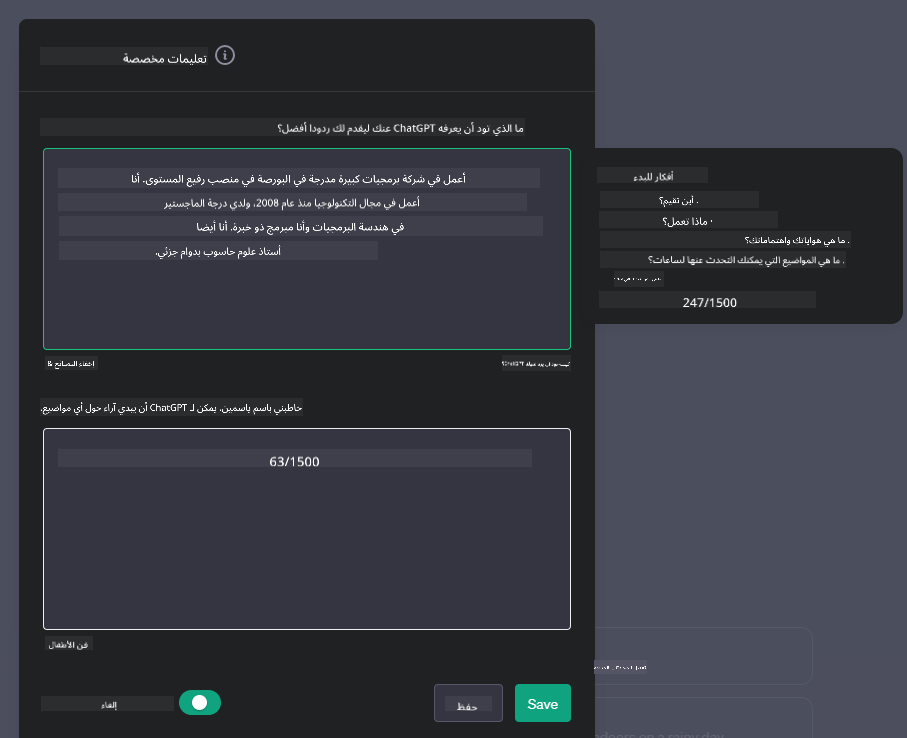

<!--
CO_OP_TRANSLATOR_METADATA:
{
  "original_hash": "a5308963a56cfbad2d73b0fa99fe84b3",
  "translation_date": "2025-10-17T23:05:43+00:00",
  "source_file": "07-building-chat-applications/README.md",
  "language_code": "ar"
}
-->
# بناء تطبيقات الدردشة المدعومة بالذكاء الاصطناعي التوليدي

[](https://youtu.be/R9V0ZY1BEQo?si=IHuU-fS9YWT8s4sA)

> _(انقر على الصورة أعلاه لمشاهدة فيديو الدرس)_

بعد أن رأينا كيفية بناء تطبيقات توليد النصوص، دعونا نلقي نظرة على تطبيقات الدردشة.

أصبحت تطبيقات الدردشة جزءًا لا يتجزأ من حياتنا اليومية، حيث تقدم أكثر من مجرد وسيلة للتواصل العادي. فهي جزء أساسي من خدمات العملاء، الدعم الفني، وحتى أنظمة الاستشارات المتقدمة. من المحتمل أنك تلقيت مساعدة من تطبيق دردشة مؤخرًا. ومع دمج تقنيات أكثر تقدمًا مثل الذكاء الاصطناعي التوليدي في هذه المنصات، تزداد التعقيدات وكذلك التحديات.

بعض الأسئلة التي تحتاج إلى إجابة هي:

- **بناء التطبيق**. كيف يمكننا بناء ودمج هذه التطبيقات المدعومة بالذكاء الاصطناعي بكفاءة لحالات استخدام محددة؟
- **المراقبة**. بمجرد نشر التطبيق، كيف يمكننا مراقبته وضمان عمله بأعلى مستوى من الجودة، سواء من حيث الوظائف أو الالتزام بـ [المبادئ الستة للذكاء الاصطناعي المسؤول](https://www.microsoft.com/ai/responsible-ai?WT.mc_id=academic-105485-koreyst)؟

مع تقدمنا في عصر يتميز بالأتمتة وتفاعلات سلسة بين الإنسان والآلة، يصبح فهم كيفية تحول الذكاء الاصطناعي التوليدي لنطاق وعمق وتكيف تطبيقات الدردشة أمرًا ضروريًا. سيتناول هذا الدرس جوانب الهندسة المعمارية التي تدعم هذه الأنظمة المعقدة، ويستعرض المنهجيات لتخصيصها لمهام محددة، ويقيّم المقاييس والاعتبارات المتعلقة بضمان نشر الذكاء الاصطناعي المسؤول.

## المقدمة

يغطي هذا الدرس:

- تقنيات بناء ودمج تطبيقات الدردشة بكفاءة.
- كيفية تطبيق التخصيص والتعديل على التطبيقات.
- استراتيجيات واعتبارات لمراقبة تطبيقات الدردشة بفعالية.

## أهداف التعلم

بنهاية هذا الدرس، ستكون قادرًا على:

- وصف الاعتبارات لبناء ودمج تطبيقات الدردشة في الأنظمة الحالية.
- تخصيص تطبيقات الدردشة لحالات استخدام محددة.
- تحديد المقاييس الرئيسية والاعتبارات لمراقبة وصيانة جودة تطبيقات الدردشة المدعومة بالذكاء الاصطناعي بفعالية.
- ضمان استخدام تطبيقات الدردشة للذكاء الاصطناعي بشكل مسؤول.

## دمج الذكاء الاصطناعي التوليدي في تطبيقات الدردشة

تحسين تطبيقات الدردشة من خلال الذكاء الاصطناعي التوليدي لا يقتصر فقط على جعلها أكثر ذكاءً؛ بل يتعلق بتحسين بنيتها وأدائها وواجهة المستخدم لتقديم تجربة مستخدم عالية الجودة. يتطلب ذلك استكشاف الأسس المعمارية، تكامل واجهات برمجة التطبيقات، واعتبارات واجهة المستخدم. تهدف هذه الفقرة إلى تقديم خارطة طريق شاملة للتنقل في هذه المجالات المعقدة، سواء كنت تقوم بدمجها في أنظمة موجودة أو بناءها كمنصات مستقلة.

بنهاية هذه الفقرة، ستكون مجهزًا بالخبرة اللازمة لبناء ودمج تطبيقات الدردشة بكفاءة.

### روبوت الدردشة أم تطبيق دردشة؟

قبل أن نتعمق في بناء تطبيقات الدردشة، دعونا نقارن بين "روبوتات الدردشة" و"تطبيقات الدردشة المدعومة بالذكاء الاصطناعي"، حيث تؤدي كل منهما أدوارًا ووظائف مختلفة. الهدف الرئيسي لروبوت الدردشة هو أتمتة مهام المحادثة المحددة، مثل الإجابة على الأسئلة الشائعة أو تتبع الطرود. عادةً ما يتم تشغيله بواسطة منطق قائم على القواعد أو خوارزميات ذكاء اصطناعي معقدة. في المقابل، يُعتبر تطبيق الدردشة المدعوم بالذكاء الاصطناعي بيئة أكثر شمولية مصممة لتسهيل أشكال مختلفة من التواصل الرقمي، مثل النصوص، الصوت، ومكالمات الفيديو بين المستخدمين. السمة المميزة له هي دمج نموذج ذكاء اصطناعي توليدي يحاكي المحادثات الدقيقة التي تشبه الإنسان، ويولد ردودًا بناءً على مجموعة متنوعة من المدخلات والإشارات السياقية. يمكن لتطبيق الدردشة المدعوم بالذكاء الاصطناعي التوليدي أن يشارك في مناقشات مفتوحة المجال، ويتكيف مع سياقات المحادثة المتغيرة، وحتى ينتج حوارات إبداعية أو معقدة.

يوضح الجدول أدناه الاختلافات والتشابهات الرئيسية لمساعدتنا في فهم أدوارها الفريدة في التواصل الرقمي.

| روبوت الدردشة                        | تطبيق الدردشة المدعوم بالذكاء الاصطناعي التوليدي |
| ------------------------------------- | -------------------------------------- |
| يركز على المهام وقائم على القواعد    | مدرك للسياق                           |
| غالبًا ما يتم دمجه في أنظمة أكبر      | قد يستضيف روبوت دردشة واحد أو أكثر    |
| محدود بالوظائف المبرمجة              | يدمج نماذج الذكاء الاصطناعي التوليدي  |
| تفاعلات متخصصة ومنظمة                | قادر على مناقشات مفتوحة المجال       |

### الاستفادة من الوظائف المدمجة مسبقًا باستخدام SDKs وAPIs

عند بناء تطبيق دردشة، الخطوة الأولى الجيدة هي تقييم ما هو متاح بالفعل. استخدام SDKs وAPIs لبناء تطبيقات الدردشة هو استراتيجية مفيدة لعدة أسباب. من خلال دمج SDKs وAPIs الموثقة جيدًا، فإنك تضع تطبيقك استراتيجيًا لتحقيق النجاح على المدى الطويل، مع معالجة مخاوف التوسع والصيانة.

- **تسريع عملية التطوير وتقليل التكاليف**: الاعتماد على الوظائف المدمجة مسبقًا بدلاً من عملية البناء المكلفة يسمح لك بالتركيز على جوانب أخرى من تطبيقك التي قد تجدها أكثر أهمية، مثل منطق الأعمال.
- **أداء أفضل**: عند بناء الوظائف من الصفر، ستسأل نفسك في النهاية "كيف يمكن أن يتوسع؟ هل هذا التطبيق قادر على التعامل مع تدفق مفاجئ للمستخدمين؟" غالبًا ما تحتوي SDKs وAPIs الموثوقة على حلول مدمجة لهذه المخاوف.
- **سهولة الصيانة**: التحديثات والتحسينات تكون أسهل في الإدارة حيث أن معظم APIs وSDKs تتطلب فقط تحديث مكتبة عند إصدار نسخة جديدة.
- **الوصول إلى التكنولوجيا المتقدمة**: الاستفادة من النماذج التي تم تحسينها وتدريبها على مجموعات بيانات واسعة يمنح تطبيقك قدرات طبيعية في اللغة.

الوصول إلى وظائف SDK أو API يتطلب عادةً الحصول على إذن لاستخدام الخدمات المقدمة، والذي يتم غالبًا من خلال استخدام مفتاح فريد أو رمز مصادقة. سنستخدم مكتبة OpenAI Python لاستكشاف كيف يبدو ذلك. يمكنك أيضًا تجربتها بنفسك في [دفتر الملاحظات الخاص بـ OpenAI](./python/oai-assignment.ipynb?WT.mc_id=academic-105485-koreyst) أو [دفتر الملاحظات الخاص بخدمات Azure OpenAI](./python/aoai-assignment.ipynb?WT.mc_id=academic-105485-koreys) لهذا الدرس.

```python
import os
from openai import OpenAI

API_KEY = os.getenv("OPENAI_API_KEY","")

client = OpenAI(
    api_key=API_KEY
    )

chat_completion = client.chat.completions.create(model="gpt-3.5-turbo", messages=[{"role": "user", "content": "Suggest two titles for an instructional lesson on chat applications for generative AI."}])
```

المثال أعلاه يستخدم نموذج GPT-3.5 Turbo لإكمال الطلب، ولكن لاحظ أن مفتاح API يتم تعيينه قبل القيام بذلك. ستتلقى خطأ إذا لم تقم بتعيين المفتاح.

## تجربة المستخدم (UX)

تنطبق مبادئ تجربة المستخدم العامة على تطبيقات الدردشة، ولكن هناك بعض الاعتبارات الإضافية التي تصبح مهمة بشكل خاص بسبب المكونات المتعلقة بالتعلم الآلي.

- **آلية لمعالجة الغموض**: نماذج الذكاء الاصطناعي التوليدي قد تولد أحيانًا إجابات غامضة. يمكن أن تكون ميزة تسمح للمستخدمين بطلب التوضيح مفيدة إذا واجهوا هذه المشكلة.
- **الاحتفاظ بالسياق**: تتمتع نماذج الذكاء الاصطناعي التوليدي المتقدمة بالقدرة على تذكر السياق داخل المحادثة، وهو ما يمكن أن يكون ميزة ضرورية لتجربة المستخدم. منح المستخدمين القدرة على التحكم وإدارة السياق يحسن تجربة المستخدم، ولكنه يقدم خطر الاحتفاظ بمعلومات حساسة عن المستخدم. يمكن أن توازن الاعتبارات المتعلقة بمدة تخزين هذه المعلومات، مثل تقديم سياسة الاحتفاظ، بين الحاجة إلى السياق والخصوصية.
- **التخصيص**: مع القدرة على التعلم والتكيف، تقدم نماذج الذكاء الاصطناعي تجربة فردية للمستخدم. تخصيص تجربة المستخدم من خلال ميزات مثل ملفات تعريف المستخدمين لا يجعل المستخدم يشعر بأنه مفهوم فقط، بل يساعده أيضًا في البحث عن إجابات محددة، مما يخلق تفاعلًا أكثر كفاءة ورضا.

أحد الأمثلة على التخصيص هو إعدادات "التعليمات المخصصة" في ChatGPT من OpenAI. يتيح لك تقديم معلومات عن نفسك قد تكون سياقًا مهمًا لطلباتك. إليك مثال على التعليمات المخصصة.



تطلب هذه "الملف الشخصي" من ChatGPT إنشاء خطة درس حول القوائم المرتبطة. لاحظ أن ChatGPT يأخذ في الاعتبار أن المستخدم قد يرغب في خطة درس أكثر تفصيلًا بناءً على خبرتها.


### إطار عمل رسائل النظام من مايكروسوفت لنماذج اللغة الكبيرة

[قدمت مايكروسوفت إرشادات](https://learn.microsoft.com/azure/ai-services/openai/concepts/system-message#define-the-models-output-format?WT.mc_id=academic-105485-koreyst) لكتابة رسائل نظام فعالة عند إنشاء ردود من نماذج اللغة الكبيرة (LLMs) مقسمة إلى 4 مجالات:

1. تحديد من هو النموذج، بالإضافة إلى قدراته وقيوده.
2. تحديد تنسيق إخراج النموذج.
3. تقديم أمثلة محددة توضح السلوك المقصود للنموذج.
4. توفير قواعد إضافية للسلوك.

### إمكانية الوصول

سواء كان المستخدم يعاني من إعاقات بصرية أو سمعية أو حركية أو معرفية، يجب أن يكون تطبيق الدردشة المصمم جيدًا قابلاً للاستخدام من قبل الجميع. القائمة التالية توضح الميزات المحددة التي تهدف إلى تحسين إمكانية الوصول لمختلف إعاقات المستخدمين.

- **ميزات للإعاقة البصرية**: سمات عالية التباين ونص قابل للتكبير، توافق مع قارئات الشاشة.
- **ميزات للإعاقة السمعية**: وظائف تحويل النص إلى كلام وتحويل الكلام إلى نص، إشارات بصرية للإشعارات الصوتية.
- **ميزات للإعاقة الحركية**: دعم التنقل عبر لوحة المفاتيح، أوامر صوتية.
- **ميزات للإعاقة المعرفية**: خيارات لغة مبسطة.

## التخصيص والتعديل لنماذج اللغة الخاصة بالمجالات

تخيل تطبيق دردشة يفهم مصطلحات شركتك ويتوقع الاستفسارات المحددة التي قد تكون لدى قاعدة مستخدميها. هناك بعض النهج التي تستحق الذكر:

- **الاستفادة من نماذج DSL**. DSL تعني لغة خاصة بالمجال. يمكنك الاستفادة من نموذج DSL المدرب على مجال معين لفهم مفاهيمه وسيناريوهاته.
- **تطبيق التعديل**. التعديل هو عملية تدريب إضافي لنموذجك باستخدام بيانات محددة.

## التخصيص: استخدام DSL

الاستفادة من نماذج اللغة الخاصة بالمجالات (DSL Models) يمكن أن يعزز تفاعل المستخدم من خلال توفير تفاعلات متخصصة وذات صلة بالسياق. إنه نموذج يتم تدريبه أو تعديله لفهم وتوليد نصوص تتعلق بمجال معين، صناعة معينة، أو موضوع معين. تتنوع الخيارات لاستخدام نموذج DSL من تدريب واحد من الصفر، إلى استخدام نماذج موجودة مسبقًا عبر SDKs وAPIs. خيار آخر هو التعديل، الذي يتضمن أخذ نموذج مدرب مسبقًا وتكييفه لمجال معين.

## التخصيص: تطبيق التعديل

يُعتبر التعديل غالبًا عندما يكون النموذج المدرب مسبقًا غير كافٍ في مجال متخصص أو مهمة محددة.

على سبيل المثال، الاستفسارات الطبية معقدة وتتطلب الكثير من السياق. عندما يقوم محترف طبي بتشخيص مريض، يعتمد ذلك على مجموعة متنوعة من العوامل مثل نمط الحياة أو الحالات الموجودة مسبقًا، وقد يعتمد حتى على المجلات الطبية الحديثة لتأكيد تشخيصه. في مثل هذه السيناريوهات الدقيقة، لا يمكن أن يكون تطبيق الدردشة العام القائم على الذكاء الاصطناعي مصدرًا موثوقًا.

### السيناريو: تطبيق طبي

تخيل تطبيق دردشة مصمم لمساعدة الممارسين الطبيين من خلال توفير مراجع سريعة لإرشادات العلاج، تفاعلات الأدوية، أو نتائج الأبحاث الحديثة.

قد يكون النموذج العام كافيًا للإجابة على الأسئلة الطبية الأساسية أو تقديم نصائح عامة، لكنه قد يواجه صعوبة في الحالات التالية:

- **الحالات المحددة أو المعقدة للغاية**. على سبيل المثال، قد يسأل طبيب الأعصاب التطبيق، "ما هي أفضل الممارسات الحالية لإدارة الصرع المقاوم للأدوية لدى المرضى الأطفال؟"
- **افتقار إلى التطورات الحديثة**. قد يواجه النموذج العام صعوبة في تقديم إجابة حديثة تتضمن أحدث التطورات في علم الأعصاب والصيدلة.

في مثل هذه الحالات، يمكن أن يؤدي تعديل النموذج باستخدام مجموعة بيانات طبية متخصصة إلى تحسين قدرته على التعامل مع هذه الاستفسارات الطبية المعقدة بدقة وموثوقية. يتطلب ذلك الوصول إلى مجموعة بيانات كبيرة وذات صلة تمثل التحديات والأسئلة الخاصة بالمجال التي تحتاج إلى معالجة.

## اعتبارات لتجربة دردشة مدفوعة بالذكاء الاصطناعي عالية الجودة

تحدد هذه الفقرة المعايير لتطبيقات الدردشة "عالية الجودة"، والتي تشمل التقاط المقاييس القابلة للتنفيذ والالتزام بإطار عمل يستفيد من تقنية الذكاء الاصطناعي بشكل مسؤول.

### المقاييس الرئيسية

للحفاظ على الأداء العالي الجودة للتطبيق، من الضروري تتبع المقاييس الرئيسية والاعتبارات. تضمن هذه القياسات ليس فقط وظيفة التطبيق ولكن أيضًا تقييم جودة نموذج الذكاء الاصطناعي وتجربة المستخدم. فيما يلي قائمة تغطي المقاييس الأساسية، الذكاء الاصطناعي، وتجربة المستخدم التي يجب أخذها في الاعتبار.

| المقياس                        | التعريف                                                                                                             | اعتبارات لمطور الدردشة                                                   |
| ----------------------------- | ---------------------------------------------------------------------------------------------------------------------- | ------------------------------------------------------------------------- |
| **وقت التشغيل**                | يقيس الوقت الذي يكون فيه التطبيق قيد التشغيل ويمكن الوصول إليه من قبل المستخدمين.                                    | كيف ستقلل من وقت التوقف؟                                                  |
| **وقت الاستجابة**             | الوقت الذي يستغرقه التطبيق للرد على استفسار المستخدم.                                                                | كيف يمكنك تحسين معالجة الاستفسارات لتحسين وقت الاستجابة؟                |
| **الدقة**                      | نسبة التنبؤات الإيجابية الصحيحة إلى العدد الإجمالي للتنبؤات الإيجابية.                                               | كيف ستتحقق من دقة النموذج؟                                                |
| **الاستدعاء (الحساسية)**       | نسبة التنبؤات الإيجابية الصحيحة إلى العدد الفعلي للإيجابيات.                                                         | كيف ستقيس وتحسن الاستدعاء؟                                                |
| **درجة F1**                   | المتوسط التوافقي بين الدقة والاستدعاء، الذي يوازن بين كلاهما.                                                        | ما هي درجة F1 المستهدفة؟ كيف ستوازن بين الدقة والاستدعاء؟                |
| **التعقيد**                    | يقيس مدى توافق توزيع الاحتمالات الذي يتنبأ به النموذج مع التوزيع الفعلي للبيانات.                                     | كيف ستقلل من التعقيد؟                                                     |
| **مقاييس رضا المستخدم**        | تقيس تصور المستخدم للتطبيق. غالبًا ما يتم جمعها من خلال الاستبيانات.                                                | كم مرة ستجمع ملاحظات المستخدم؟ كيف ستتكيف بناءً عليها؟                    |
| **معدل الخطأ**                 | معدل الأخطاء التي يرتكبها النموذج في الفهم أو الإخراج.                                                                | ما هي الاستراتيجيات التي لديك لتقليل معدلات الخطأ؟                        |
| **دورات إعادة التدريب**        | تكرار تحديث النموذج لدمج بيانات ورؤى جديدة.                                                                          | كم مرة ستعيد تدريب النموذج؟ ما الذي يحفز دورة إعادة التدريب؟              |
| **كشف الشذوذ**         | أدوات وتقنيات لتحديد الأنماط غير العادية التي لا تتوافق مع السلوك المتوقع.                        | كيف ستتعامل مع الشذوذ؟                                        |

### تنفيذ ممارسات الذكاء الاصطناعي المسؤول في تطبيقات الدردشة

حددت نهج مايكروسوفت للذكاء الاصطناعي المسؤول ستة مبادئ يجب أن توجه تطوير واستخدام الذكاء الاصطناعي. فيما يلي المبادئ وتعريفها والأمور التي يجب أن يأخذها مطور الدردشة بعين الاعتبار ولماذا يجب أن يأخذها بجدية.

| المبادئ               | تعريف مايكروسوفت                                | الاعتبارات لمطور الدردشة                                      | لماذا هو مهم                                                                     |
| ---------------------- | ----------------------------------------------------- | ---------------------------------------------------------------------- | -------------------------------------------------------------------------------------- |
| العدالة               | يجب أن تعامل أنظمة الذكاء الاصطناعي جميع الأشخاص بعدالة.            | تأكد من أن تطبيق الدردشة لا يميز بناءً على بيانات المستخدم.  | لبناء الثقة والشمول بين المستخدمين؛ وتجنب التداعيات القانونية.                |
| الموثوقية والسلامة    | يجب أن تعمل أنظمة الذكاء الاصطناعي بشكل موثوق وآمن.        | تنفيذ اختبارات وإجراءات أمان لتقليل الأخطاء والمخاطر.         | يضمن رضا المستخدم ويمنع الأضرار المحتملة.                                 |
| الخصوصية والأمان      | يجب أن تكون أنظمة الذكاء الاصطناعي آمنة وتحترم الخصوصية.      | تنفيذ تشفير قوي وإجراءات حماية البيانات.              | لحماية بيانات المستخدم الحساسة والامتثال لقوانين الخصوصية.                         |
| الشمولية              | يجب أن تمكن أنظمة الذكاء الاصطناعي الجميع وتشارك الناس. | تصميم واجهة المستخدم/تجربة المستخدم بحيث تكون متاحة وسهلة الاستخدام لجمهور متنوع. | يضمن أن يتمكن مجموعة واسعة من الأشخاص من استخدام التطبيق بفعالية.                   |
| الشفافية              | يجب أن تكون أنظمة الذكاء الاصطناعي مفهومة.                  | تقديم وثائق واضحة وتوضيح أسباب استجابات الذكاء الاصطناعي.            | من المرجح أن يثق المستخدمون بالنظام إذا تمكنوا من فهم كيفية اتخاذ القرارات. |
| المساءلة              | يجب أن يكون الأشخاص مسؤولين عن أنظمة الذكاء الاصطناعي.          | وضع عملية واضحة لمراجعة وتحسين قرارات الذكاء الاصطناعي.     | يتيح التحسين المستمر واتخاذ إجراءات تصحيحية في حالة حدوث أخطاء.               |

## المهمة

راجع [المهمة](../../../07-building-chat-applications/python). ستأخذك عبر سلسلة من التمارين بدءًا من تشغيل أول مطالبات الدردشة، إلى تصنيف النصوص وتلخيصها والمزيد. لاحظ أن المهام متوفرة بلغات برمجة مختلفة!

## عمل رائع! استمر في الرحلة

بعد إكمال هذا الدرس، تحقق من [مجموعة تعلم الذكاء الاصطناعي التوليدي](https://aka.ms/genai-collection?WT.mc_id=academic-105485-koreyst) لمواصلة تعزيز معرفتك بالذكاء الاصطناعي التوليدي!

توجه إلى الدرس الثامن لترى كيف يمكنك البدء في [بناء تطبيقات البحث](../08-building-search-applications/README.md?WT.mc_id=academic-105485-koreyst)!

---

**إخلاء المسؤولية**:  
تم ترجمة هذا المستند باستخدام خدمة الترجمة بالذكاء الاصطناعي [Co-op Translator](https://github.com/Azure/co-op-translator). بينما نسعى لتحقيق الدقة، يرجى العلم أن الترجمات الآلية قد تحتوي على أخطاء أو عدم دقة. يجب اعتبار المستند الأصلي بلغته الأصلية المصدر الموثوق. للحصول على معلومات حاسمة، يُوصى بالترجمة البشرية الاحترافية. نحن غير مسؤولين عن أي سوء فهم أو تفسيرات خاطئة ناتجة عن استخدام هذه الترجمة.