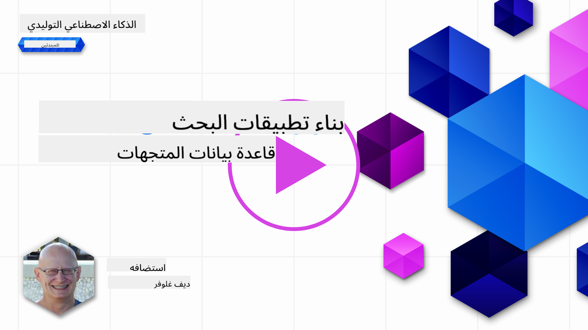
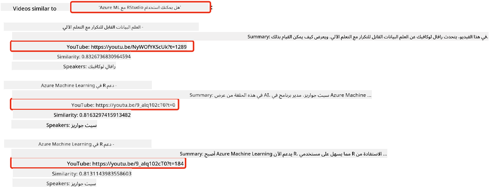
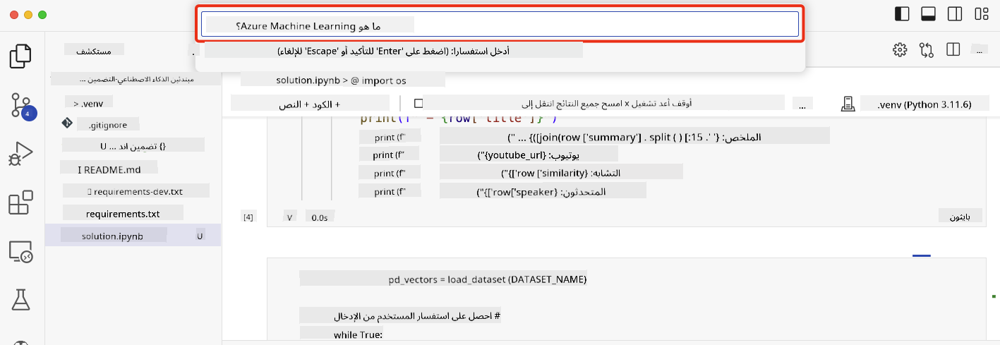

<!--
CO_OP_TRANSLATOR_METADATA:
{
  "original_hash": "58953c08b8ba7073b836d4270ea0fe86",
  "translation_date": "2025-10-17T12:54:33+00:00",
  "source_file": "08-building-search-applications/README.md",
  "language_code": "ar"
}
-->
# بناء تطبيقات البحث

[](https://youtu.be/W0-nzXjOjr0?si=GcsqiTTvd7RKbo7V)

> > _اضغط على الصورة أعلاه لمشاهدة فيديو الدرس_

هناك أكثر من مجرد روبوتات الدردشة وتوليد النصوص في نماذج اللغة الكبيرة (LLMs). يمكن أيضًا بناء تطبيقات بحث باستخدام التضمينات. التضمينات هي تمثيلات رقمية للبيانات تُعرف أيضًا باسم المتجهات، ويمكن استخدامها للبحث الدلالي عن البيانات.

في هذا الدرس، ستقوم ببناء تطبيق بحث لشركتنا الناشئة التعليمية. شركتنا الناشئة هي منظمة غير ربحية تقدم التعليم المجاني للطلاب في البلدان النامية. تمتلك شركتنا الناشئة عددًا كبيرًا من مقاطع الفيديو على YouTube يمكن للطلاب استخدامها لتعلم الذكاء الاصطناعي. ترغب شركتنا الناشئة في بناء تطبيق بحث يسمح للطلاب بالبحث عن فيديو على YouTube عن طريق كتابة سؤال.

على سبيل المثال، قد يكتب الطالب "ما هي دفاتر Jupyter؟" أو "ما هو Azure ML؟"، وسيقوم تطبيق البحث بإرجاع قائمة بمقاطع الفيديو ذات الصلة بالسؤال، والأفضل من ذلك، سيقوم تطبيق البحث بإرجاع رابط إلى المكان في الفيديو حيث توجد الإجابة على السؤال.

## المقدمة

في هذا الدرس، سنغطي:

- البحث الدلالي مقابل البحث بالكلمات المفتاحية.
- ما هي تضمينات النصوص.
- إنشاء فهرس لتضمينات النصوص.
- البحث في فهرس تضمينات النصوص.

## أهداف التعلم

بعد إكمال هذا الدرس، ستكون قادرًا على:

- التمييز بين البحث الدلالي والبحث بالكلمات المفتاحية.
- شرح ما هي تضمينات النصوص.
- إنشاء تطبيق باستخدام التضمينات للبحث عن البيانات.

## لماذا نبني تطبيق بحث؟

إنشاء تطبيق بحث سيساعدك على فهم كيفية استخدام التضمينات للبحث عن البيانات. ستتعلم أيضًا كيفية بناء تطبيق بحث يمكن للطلاب استخدامه للعثور على المعلومات بسرعة.

يتضمن الدرس فهرس تضمينات لنصوص مقاطع الفيديو على قناة YouTube الخاصة بـ [AI Show](https://www.youtube.com/playlist?list=PLlrxD0HtieHi0mwteKBOfEeOYf0LJU4O1). AI Show هي قناة على YouTube تعلمك عن الذكاء الاصطناعي وتعلم الآلة. يحتوي فهرس التضمينات على تضمينات لكل نصوص مقاطع الفيديو حتى أكتوبر 2023. ستستخدم فهرس التضمينات لبناء تطبيق بحث لشركتنا الناشئة. يقوم تطبيق البحث بإرجاع رابط إلى المكان في الفيديو حيث توجد الإجابة على السؤال. هذه طريقة رائعة للطلاب للعثور على المعلومات التي يحتاجونها بسرعة.

فيما يلي مثال على استعلام دلالي للسؤال "هل يمكن استخدام rstudio مع azure ml؟". تحقق من رابط YouTube، ستلاحظ أن الرابط يحتوي على طابع زمني يأخذك إلى المكان في الفيديو حيث توجد الإجابة على السؤال.



## ما هو البحث الدلالي؟

قد تتساءل الآن، ما هو البحث الدلالي؟ البحث الدلالي هو تقنية بحث تستخدم دلالات أو معاني الكلمات في الاستعلام لإرجاع نتائج ذات صلة.

إليك مثال على البحث الدلالي. لنفترض أنك كنت تبحث عن شراء سيارة، قد تبحث عن "سيارتي الحلم"، البحث الدلالي يفهم أنك لا "تحلم" بسيارة، بل تبحث عن شراء سيارتك "المثالية". البحث الدلالي يفهم نيتك ويعيد نتائج ذات صلة. البديل هو "البحث بالكلمات المفتاحية" الذي سيبحث حرفيًا عن أحلام حول السيارات وغالبًا ما يعيد نتائج غير ذات صلة.

## ما هي تضمينات النصوص؟

[تضمينات النصوص](https://en.wikipedia.org/wiki/Word_embedding?WT.mc_id=academic-105485-koreyst) هي تقنية تمثيل النصوص تُستخدم في [معالجة اللغة الطبيعية](https://en.wikipedia.org/wiki/Natural_language_processing?WT.mc_id=academic-105485-koreyst). تضمينات النصوص هي تمثيلات رقمية دلالية للنصوص. تُستخدم التضمينات لتمثيل البيانات بطريقة يسهل على الآلة فهمها. هناك العديد من النماذج لبناء تضمينات النصوص، في هذا الدرس، سنركز على إنشاء التضمينات باستخدام نموذج تضمينات OpenAI.

إليك مثال، تخيل أن النص التالي موجود في نصوص إحدى حلقات قناة AI Show على YouTube:

```text
Today we are going to learn about Azure Machine Learning.
```

سنمرر النص إلى واجهة برمجة التطبيقات لتضمينات OpenAI وستعيد التضمين التالي الذي يتكون من 1536 رقمًا يُعرف أيضًا باسم المتجه. يمثل كل رقم في المتجه جانبًا مختلفًا من النص. للتوضيح، إليك أول 10 أرقام في المتجه.

```python
[-0.006655829958617687, 0.0026128944009542465, 0.008792596869170666, -0.02446001023054123, -0.008540431968867779, 0.022071078419685364, -0.010703742504119873, 0.003311325330287218, -0.011632772162556648, -0.02187200076878071, ...]
```

## كيف يتم إنشاء فهرس التضمينات؟

تم إنشاء فهرس التضمينات لهذا الدرس باستخدام سلسلة من سكربتات Python. ستجد السكربتات مع التعليمات في [README](./scripts/README.md?WT.mc_id=academic-105485-koreyst) في مجلد 'scripts' لهذا الدرس. لا تحتاج إلى تشغيل هذه السكربتات لإكمال هذا الدرس حيث يتم توفير فهرس التضمينات لك.

تقوم السكربتات بالعمليات التالية:

1. يتم تنزيل النصوص لكل فيديو على YouTube في قائمة تشغيل [AI Show](https://www.youtube.com/playlist?list=PLlrxD0HtieHi0mwteKBOfEeOYf0LJU4O1).
2. باستخدام [وظائف OpenAI](https://learn.microsoft.com/azure/ai-services/openai/how-to/function-calling?WT.mc_id=academic-105485-koreyst)، يتم محاولة استخراج اسم المتحدث من أول 3 دقائق من نصوص الفيديو على YouTube. يتم تخزين اسم المتحدث لكل فيديو في فهرس التضمينات المسمى `embedding_index_3m.json`.
3. يتم تقسيم نصوص الفيديو إلى **مقاطع نصية مدتها 3 دقائق**. يتضمن المقطع حوالي 20 كلمة متداخلة من المقطع التالي لضمان أن التضمين للمقطع لا يتم قطعه ولتوفير سياق بحث أفضل.
4. يتم تمرير كل مقطع نصي إلى واجهة برمجة التطبيقات للدردشة من OpenAI لتلخيص النص في 60 كلمة. يتم أيضًا تخزين الملخص في فهرس التضمينات `embedding_index_3m.json`.
5. أخيرًا، يتم تمرير النص المقطعي إلى واجهة برمجة التطبيقات لتضمينات OpenAI. تعيد واجهة برمجة التطبيقات للتضمينات متجهًا مكونًا من 1536 رقمًا يمثل المعنى الدلالي للمقطع. يتم تخزين المقطع مع متجه تضمينات OpenAI في فهرس التضمينات `embedding_index_3m.json`.

### قواعد بيانات المتجهات

لأغراض تبسيط الدرس، يتم تخزين فهرس التضمينات في ملف JSON يسمى `embedding_index_3m.json` ويتم تحميله في إطار بيانات Pandas. ومع ذلك، في الإنتاج، سيتم تخزين فهرس التضمينات في قاعدة بيانات متجهات مثل [Azure Cognitive Search](https://learn.microsoft.com/training/modules/improve-search-results-vector-search?WT.mc_id=academic-105485-koreyst)، [Redis](https://cookbook.openai.com/examples/vector_databases/redis/readme?WT.mc_id=academic-105485-koreyst)، [Pinecone](https://cookbook.openai.com/examples/vector_databases/pinecone/readme?WT.mc_id=academic-105485-koreyst)، [Weaviate](https://cookbook.openai.com/examples/vector_databases/weaviate/readme?WT.mc_id=academic-105485-koreyst)، على سبيل المثال لا الحصر.

## فهم التشابه الكوني

لقد تعلمنا عن تضمينات النصوص، والخطوة التالية هي تعلم كيفية استخدام تضمينات النصوص للبحث عن البيانات، وبالأخص العثور على التضمينات الأكثر تشابهًا مع استعلام معين باستخدام التشابه الكوني.

### ما هو التشابه الكوني؟

التشابه الكوني هو مقياس للتشابه بين متجهين، ستسمع أيضًا أنه يُشار إليه بـ `البحث عن الجار الأقرب`. لإجراء بحث بالتشابه الكوني، تحتاج إلى _تحويل النص الاستعلامي إلى متجه_ باستخدام واجهة برمجة التطبيقات لتضمينات OpenAI. ثم حساب _التشابه الكوني_ بين متجه الاستعلام وكل متجه في فهرس التضمينات. تذكر، يحتوي فهرس التضمينات على متجه لكل مقطع نصي من نصوص الفيديو على YouTube. أخيرًا، قم بفرز النتائج حسب التشابه الكوني، والمقاطع النصية ذات التشابه الكوني الأعلى هي الأكثر تشابهًا مع الاستعلام.

من منظور رياضي، يقيس التشابه الكوني الزاوية بين متجهين في فضاء متعدد الأبعاد. هذا القياس مفيد، لأنه إذا كانت الوثيقتان بعيدتين عن بعضهما البعض بمسافة إقليدية بسبب الحجم، فقد تكون الزاوية بينهما أصغر وبالتالي يكون التشابه الكوني أعلى. لمزيد من المعلومات حول معادلات التشابه الكوني، راجع [التشابه الكوني](https://en.wikipedia.org/wiki/Cosine_similarity?WT.mc_id=academic-105485-koreyst).

## بناء تطبيق البحث الأول الخاص بك

بعد ذلك، سنتعلم كيفية بناء تطبيق بحث باستخدام التضمينات. سيسمح تطبيق البحث للطلاب بالبحث عن فيديو عن طريق كتابة سؤال. سيقوم تطبيق البحث بإرجاع قائمة بالفيديوهات ذات الصلة بالسؤال. سيقوم تطبيق البحث أيضًا بإرجاع رابط إلى المكان في الفيديو حيث توجد الإجابة على السؤال.

تم بناء هذا الحل واختباره على Windows 11 وmacOS وUbuntu 22.04 باستخدام Python 3.10 أو أحدث. يمكنك تنزيل Python من [python.org](https://www.python.org/downloads/?WT.mc_id=academic-105485-koreyst).

## المهمة - بناء تطبيق بحث لتمكين الطلاب

قدمنا شركتنا الناشئة في بداية هذا الدرس. الآن حان الوقت لتمكين الطلاب من بناء تطبيق بحث لتقييماتهم.

في هذه المهمة، ستقوم بإنشاء خدمات Azure OpenAI التي سيتم استخدامها لبناء تطبيق البحث. ستقوم بإنشاء خدمات Azure OpenAI التالية. ستحتاج إلى اشتراك Azure لإكمال هذه المهمة.

### بدء تشغيل Azure Cloud Shell

1. قم بتسجيل الدخول إلى [بوابة Azure](https://portal.azure.com/?WT.mc_id=academic-105485-koreyst).
2. اختر رمز Cloud Shell في الزاوية العلوية اليمنى من بوابة Azure.
3. اختر **Bash** كنوع البيئة.

#### إنشاء مجموعة موارد

> بالنسبة لهذه التعليمات، نستخدم مجموعة الموارد المسماة "semantic-video-search" في شرق الولايات المتحدة.
> يمكنك تغيير اسم مجموعة الموارد، ولكن عند تغيير الموقع للموارد،
> تحقق من [جدول توفر النموذج](https://aka.ms/oai/models?WT.mc_id=academic-105485-koreyst).

```shell
az group create --name semantic-video-search --location eastus
```

#### إنشاء مورد خدمة Azure OpenAI

من Azure Cloud Shell، قم بتشغيل الأمر التالي لإنشاء مورد خدمة Azure OpenAI.

```shell
az cognitiveservices account create --name semantic-video-openai --resource-group semantic-video-search \
    --location eastus --kind OpenAI --sku s0
```

#### الحصول على نقطة النهاية والمفاتيح للاستخدام في هذا التطبيق

من Azure Cloud Shell، قم بتشغيل الأوامر التالية للحصول على نقطة النهاية والمفاتيح لمورد خدمة Azure OpenAI.

```shell
az cognitiveservices account show --name semantic-video-openai \
   --resource-group  semantic-video-search | jq -r .properties.endpoint
az cognitiveservices account keys list --name semantic-video-openai \
   --resource-group semantic-video-search | jq -r .key1
```

#### نشر نموذج تضمينات OpenAI

من Azure Cloud Shell، قم بتشغيل الأمر التالي لنشر نموذج تضمينات OpenAI.

```shell
az cognitiveservices account deployment create \
    --name semantic-video-openai \
    --resource-group  semantic-video-search \
    --deployment-name text-embedding-ada-002 \
    --model-name text-embedding-ada-002 \
    --model-version "2"  \
    --model-format OpenAI \
    --sku-capacity 100 --sku-name "Standard"
```

## الحل

افتح [دفتر الحل](./python/aoai-solution.ipynb?WT.mc_id=academic-105485-koreyst) في GitHub Codespaces واتبع التعليمات في دفتر Jupyter.

عند تشغيل الدفتر، ستتم مطالبتك بإدخال استعلام. ستبدو نافذة الإدخال كما يلي:



## عمل رائع! استمر في التعلم

بعد إكمال هذا الدرس، تحقق من [مجموعة تعلم الذكاء الاصطناعي التوليدي](https://aka.ms/genai-collection?WT.mc_id=academic-105485-koreyst) لمواصلة تطوير معرفتك بالذكاء الاصطناعي التوليدي!

انتقل إلى الدرس التاسع حيث سننظر في كيفية [بناء تطبيقات توليد الصور](../09-building-image-applications/README.md?WT.mc_id=academic-105485-koreyst)!

---

**إخلاء المسؤولية**:  
تم ترجمة هذا المستند باستخدام خدمة الترجمة بالذكاء الاصطناعي [Co-op Translator](https://github.com/Azure/co-op-translator). بينما نسعى لتحقيق الدقة، يرجى العلم أن الترجمات الآلية قد تحتوي على أخطاء أو عدم دقة. يجب اعتبار المستند الأصلي بلغته الأصلية المصدر الرسمي. للحصول على معلومات حاسمة، يُوصى بالترجمة البشرية الاحترافية. نحن غير مسؤولين عن أي سوء فهم أو تفسير خاطئ ينشأ عن استخدام هذه الترجمة.