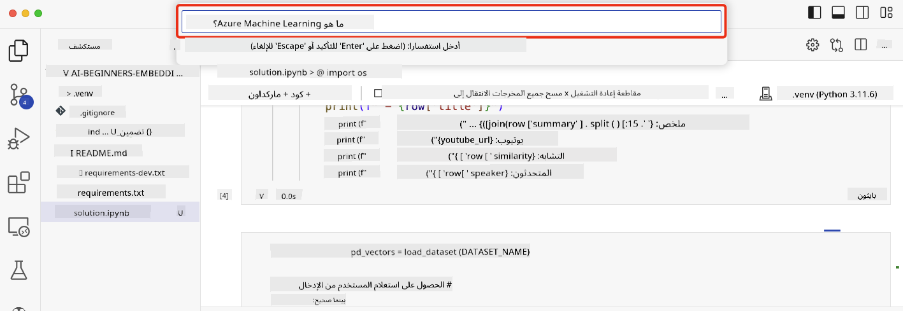

<!--
CO_OP_TRANSLATOR_METADATA:
{
  "original_hash": "d46aad0917a1a342d613e2c13d457da5",
  "translation_date": "2025-05-19T18:19:02+00:00",
  "source_file": "08-building-search-applications/README.md",
  "language_code": "ar"
}
-->
# بناء تطبيقات البحث

> > _انقر على الصورة أعلاه لمشاهدة فيديو الدرس_

هناك أكثر مما تقدمه نماذج اللغة الكبيرة LLMs من مجرد روبوتات الدردشة وتوليد النصوص. من الممكن أيضًا بناء تطبيقات بحث باستخدام التضمينات. التضمينات هي تمثيلات رقمية للبيانات تُعرف أيضًا باسم المتجهات، ويمكن استخدامها للبحث الدلالي عن البيانات.

في هذا الدرس، ستقوم ببناء تطبيق بحث لمشروعنا الناشئ في مجال التعليم. مشروعنا هو منظمة غير ربحية تقدم تعليمًا مجانيًا للطلاب في البلدان النامية. يمتلك مشروعنا عددًا كبيرًا من مقاطع الفيديو على يوتيوب التي يمكن للطلاب استخدامها لتعلم الذكاء الاصطناعي. يرغب مشروعنا في بناء تطبيق بحث يتيح للطلاب البحث عن مقطع فيديو على يوتيوب عن طريق كتابة سؤال.

على سبيل المثال، قد يكتب طالب 'ما هي دفاتر جوبتر؟' أو 'ما هو Azure ML' وسيعيد تطبيق البحث قائمة بمقاطع الفيديو على يوتيوب التي تتعلق بالسؤال، والأفضل من ذلك، سيعيد تطبيق البحث رابطًا إلى المكان في الفيديو حيث توجد الإجابة على السؤال.

## مقدمة

في هذا الدرس، سنغطي:

- البحث الدلالي مقابل البحث بالكلمات المفتاحية.
- ما هي تضمينات النص.
- إنشاء فهرس لتضمينات النص.
- البحث في فهرس تضمينات النص.

## أهداف التعلم

بعد إكمال هذا الدرس، ستكون قادرًا على:

- التفريق بين البحث الدلالي والبحث بالكلمات المفتاحية.
- شرح ما هي تضمينات النص.
- إنشاء تطبيق باستخدام التضمينات للبحث عن البيانات.

## لماذا نبني تطبيق بحث؟

إنشاء تطبيق بحث سيساعدك على فهم كيفية استخدام التضمينات للبحث عن البيانات. ستتعلم أيضًا كيفية بناء تطبيق بحث يمكن للطلاب استخدامه للعثور على المعلومات بسرعة.

يتضمن الدرس فهرس تضمينات لنصوص يوتيوب لقناة [AI Show](https://www.youtube.com/playlist?list=PLlrxD0HtieHi0mwteKBOfEeOYf0LJU4O1) على يوتيوب. AI Show هي قناة يوتيوب تعلمك عن الذكاء الاصطناعي وتعلم الآلة. يحتوي فهرس التضمينات على تضمينات لكل نصوص يوتيوب حتى أكتوبر 2023. ستستخدم فهرس التضمينات لبناء تطبيق بحث لمشروعنا الناشئ. يعيد تطبيق البحث رابطًا إلى المكان في الفيديو حيث توجد الإجابة على السؤال. هذه طريقة رائعة للطلاب للعثور على المعلومات التي يحتاجونها بسرعة.

فيما يلي مثال على استعلام دلالي للسؤال 'هل يمكنك استخدام rstudio مع azure ml؟'. تحقق من رابط يوتيوب، سترى أن الرابط يحتوي على توقيت يأخذك إلى المكان في الفيديو حيث توجد الإجابة على السؤال.

## ما هو البحث الدلالي؟

قد تتساءل الآن، ما هو البحث الدلالي؟ البحث الدلالي هو تقنية بحث تستخدم الدلالات، أو المعنى، للكلمات في استعلام لإعادة نتائج ذات صلة.

إليك مثال على البحث الدلالي. لنفترض أنك كنت تبحث عن شراء سيارة، قد تبحث عن 'سيارتي الحلمية'، البحث الدلالي يفهم أنك لا تتحدث عن سيارة، بل تبحث عن شراء سيارتك الحلمية. البحث الدلالي يفهم نيتك ويعيد نتائج ذات صلة. البديل هو البحث بالكلمات المفتاحية والذي سيبحث حرفيًا عن أحلام عن السيارات وغالبًا ما يعيد نتائج غير ذات صلة.

## ما هي تضمينات النص؟

[تضمينات النص](https://en.wikipedia.org/wiki/Word_embedding?WT.mc_id=academic-105485-koreyst) هي تقنية تمثيل نصوص تُستخدم في [معالجة اللغة الطبيعية](https://en.wikipedia.org/wiki/Natural_language_processing?WT.mc_id=academic-105485-koreyst). التضمينات النصية هي تمثيلات رقمية دلالية للنصوص. تُستخدم التضمينات لتمثيل البيانات بطريقة يسهل على الآلة فهمها. هناك العديد من النماذج لبناء التضمينات النصية، في هذا الدرس، سنركز على توليد التضمينات باستخدام نموذج تضمين OpenAI.

إليك مثال، تخيل أن النص التالي في نص من إحدى حلقات قناة AI Show على يوتيوب:

```text
Today we are going to learn about Azure Machine Learning.
```

سنقوم بتمرير النص إلى واجهة برمجة التطبيقات لتضمين OpenAI وستعيد التضمين التالي المكون من 1536 رقمًا المعروف أيضًا باسم المتجه. يمثل كل رقم في المتجه جانبًا مختلفًا من النص. للاختصار، إليك أول 10 أرقام في المتجه.

```python
[-0.006655829958617687, 0.0026128944009542465, 0.008792596869170666, -0.02446001023054123, -0.008540431968867779, 0.022071078419685364, -0.010703742504119873, 0.003311325330287218, -0.011632772162556648, -0.02187200076878071, ...]
```

## كيف يتم إنشاء فهرس التضمين؟

تم إنشاء فهرس التضمين لهذا الدرس باستخدام سلسلة من سكربتات بايثون. ستجد السكربتات مع التعليمات في [README](./scripts/README.md?WT.mc_id=academic-105485-koreyst) في مجلد 'scripts' لهذا الدرس. لست بحاجة لتشغيل هذه السكربتات لإكمال هذا الدرس حيث تم توفير فهرس التضمين لك.

تقوم السكربتات بالعمليات التالية:

1. يتم تنزيل النصوص لكل فيديو يوتيوب في قائمة التشغيل [AI Show](https://www.youtube.com/playlist?list=PLlrxD0HtieHi0mwteKBOfEeOYf0LJU4O1).
2. باستخدام [وظائف OpenAI](https://learn.microsoft.com/azure/ai-services/openai/how-to/function-calling?WT.mc_id=academic-105485-koreyst)، يتم محاولة استخراج اسم المتحدث من أول 3 دقائق من نص يوتيوب. يتم تخزين اسم المتحدث لكل فيديو في فهرس التضمين المسمى `embedding_index_3m.json`.
3. يتم تقسيم نصوص الفيديو إلى **مقاطع نصية مدتها 3 دقائق**. يتضمن المقطع حوالي 20 كلمة تتداخل مع المقطع التالي لضمان عدم انقطاع التضمين للمقطع ولتوفير سياق بحث أفضل.
4. يتم تمرير كل مقطع نصي إلى واجهة برمجة التطبيقات للدردشة في OpenAI لتلخيص النص في 60 كلمة. يتم أيضًا تخزين الملخص في فهرس التضمين `embedding_index_3m.json`.
5. أخيرًا، يتم تمرير النص المقطع إلى واجهة برمجة التطبيقات لتضمين OpenAI. تعيد واجهة برمجة التطبيقات للتضمين متجهًا مكونًا من 1536 رقمًا يمثل المعنى الدلالي للمقطع. يتم تخزين المقطع مع متجه تضمين OpenAI في فهرس التضمين `embedding_index_3m.json`.

### قواعد بيانات المتجهات

لتبسيط الدرس، يتم تخزين فهرس التضمين في ملف JSON يسمى `embedding_index_3m.json` ويتم تحميله في إطار بيانات Pandas. ومع ذلك، في الإنتاج، سيتم تخزين فهرس التضمين في قاعدة بيانات متجهات مثل [Azure Cognitive Search](https://learn.microsoft.com/training/modules/improve-search-results-vector-search?WT.mc_id=academic-105485-koreyst)، [Redis](https://cookbook.openai.com/examples/vector_databases/redis/readme?WT.mc_id=academic-105485-koreyst)، [Pinecone](https://cookbook.openai.com/examples/vector_databases/pinecone/readme?WT.mc_id=academic-105485-koreyst)، [Weaviate](https://cookbook.openai.com/examples/vector_databases/weaviate/readme?WT.mc_id=academic-105485-koreyst)، على سبيل المثال لا الحصر.

## فهم تشابه الجيب

لقد تعلمنا عن تضمينات النص، الخطوة التالية هي تعلم كيفية استخدام تضمينات النص للبحث عن البيانات وخاصة العثور على التضمينات الأكثر تشابهًا لاستعلام معين باستخدام تشابه الجيب.

### ما هو تشابه الجيب؟

تشابه الجيب هو مقياس للتشابه بين متجهين، ستسمع أيضًا أنه يُشار إليه بـ `nearest neighbor search`. لتنفيذ بحث تشابه الجيب تحتاج إلى _تحويل إلى متجه_ للنص _الاستعلام_ باستخدام واجهة برمجة التطبيقات لتضمين OpenAI. ثم حساب _تشابه الجيب_ بين متجه الاستعلام وكل متجه في فهرس التضمين. تذكر أن فهرس التضمين يحتوي على متجه لكل مقطع نصي من نصوص يوتيوب. أخيرًا، قم بترتيب النتائج حسب تشابه الجيب والمقاطع النصية ذات تشابه الجيب الأعلى هي الأكثر تشابهًا مع الاستعلام.

من منظور رياضي، يقيس تشابه الجيب الجيب للزاوية بين متجهين مسقطين في فضاء متعدد الأبعاد. هذا القياس مفيد، لأنه إذا كانت الوثيقتان بعيدتين عن بعضهما البعض بمسافة إقليدية بسبب الحجم، فقد يكون لديهما زاوية أصغر بينهما وبالتالي تشابه جيب أعلى. لمزيد من المعلومات حول معادلات تشابه الجيب، راجع [تشابه الجيب](https://en.wikipedia.org/wiki/Cosine_similarity?WT.mc_id=academic-105485-koreyst).

## بناء أول تطبيق بحث لك

الآن، سنتعلم كيفية بناء تطبيق بحث باستخدام التضمينات. سيسمح تطبيق البحث للطلاب بالبحث عن فيديو عن طريق كتابة سؤال. سيعيد تطبيق البحث قائمة بالفيديوهات التي تتعلق بالسؤال. سيعيد تطبيق البحث أيضًا رابطًا إلى المكان في الفيديو حيث توجد الإجابة على السؤال.

تم بناء واختبار هذا الحل على نظام التشغيل Windows 11 وmacOS وUbuntu 22.04 باستخدام بايثون 3.10 أو أحدث. يمكنك تنزيل بايثون من [python.org](https://www.python.org/downloads/?WT.mc_id=academic-105485-koreyst).

## مهمة - بناء تطبيق بحث، لتمكين الطلاب

قدمنا مشروعنا الناشئ في بداية هذا الدرس. الآن حان الوقت لتمكين الطلاب من بناء تطبيق بحث لتقييماتهم.

في هذه المهمة، ستقوم بإنشاء خدمات Azure OpenAI التي ستُستخدم لبناء تطبيق البحث. ستقوم بإنشاء خدمات Azure OpenAI التالية. ستحتاج إلى اشتراك Azure لإكمال هذه المهمة.

### بدء تشغيل Azure Cloud Shell

1. قم بتسجيل الدخول إلى [بوابة Azure](https://portal.azure.com/?WT.mc_id=academic-105485-koreyst).
2. حدد رمز Cloud Shell في الزاوية اليمنى العليا من بوابة Azure.
3. حدد **Bash** لنوع البيئة.

#### إنشاء مجموعة موارد

> في هذه التعليمات، نستخدم مجموعة الموارد المسماة "semantic-video-search" في شرق الولايات المتحدة.
> يمكنك تغيير اسم مجموعة الموارد، ولكن عند تغيير الموقع للموارد،
> تحقق من [جدول توفر النماذج](https://aka.ms/oai/models?WT.mc_id=academic-105485-koreyst).

```shell
az group create --name semantic-video-search --location eastus
```

#### إنشاء مورد خدمة Azure OpenAI

من Azure Cloud Shell، قم بتشغيل الأمر التالي لإنشاء مورد خدمة Azure OpenAI.

```shell
az cognitiveservices account create --name semantic-video-openai --resource-group semantic-video-search \
    --location eastus --kind OpenAI --sku s0
```

#### الحصول على نقطة النهاية والمفاتيح لاستخدامها في هذا التطبيق

من Azure Cloud Shell، قم بتشغيل الأوامر التالية للحصول على نقطة النهاية والمفاتيح لمورد خدمة Azure OpenAI.

```shell
az cognitiveservices account show --name semantic-video-openai \
   --resource-group  semantic-video-search | jq -r .properties.endpoint
az cognitiveservices account keys list --name semantic-video-openai \
   --resource-group semantic-video-search | jq -r .key1
```

#### نشر نموذج تضمين OpenAI

من Azure Cloud Shell، قم بتشغيل الأمر التالي لنشر نموذج تضمين OpenAI.

```shell
az cognitiveservices account deployment create \
    --name semantic-video-openai \
    --resource-group  semantic-video-search \
    --deployment-name text-embedding-ada-002 \
    --model-name text-embedding-ada-002 \
    --model-version "2"  \
    --model-format OpenAI \
    --sku-capacity 100 --sku-name "Standard"
```

## الحل

افتح [دفتر الحلول](../../../08-building-search-applications/python/aoai-solution.ipynb) في GitHub Codespaces واتبع التعليمات في دفتر Jupyter.

عند تشغيل الدفتر، سيُطلب منك إدخال استعلام. سيبدو مربع الإدخال كما يلي:



## عمل رائع! استمر في تعلمك

بعد إكمال هذا الدرس، تحقق من [مجموعة تعلم الذكاء الاصطناعي التوليدي](https://aka.ms/genai-collection?WT.mc_id=academic-105485-koreyst) لمواصلة تعزيز معرفتك بالذكاء الاصطناعي التوليدي!

توجه إلى الدرس 9 حيث سننظر في كيفية [بناء تطبيقات توليد الصور](../09-building-image-applications/README.md?WT.mc_id=academic-105485-koreyst)!

**إخلاء المسؤولية**:  
تمت ترجمة هذه الوثيقة باستخدام خدمة الترجمة بالذكاء الاصطناعي [Co-op Translator](https://github.com/Azure/co-op-translator). بينما نسعى جاهدين لتحقيق الدقة، يرجى العلم أن الترجمات الآلية قد تحتوي على أخطاء أو عدم دقة. يجب اعتبار الوثيقة الأصلية بلغتها الأصلية المصدر الموثوق. للحصول على معلومات حيوية، يُوصى بالترجمة البشرية الاحترافية. نحن غير مسؤولين عن أي سوء فهم أو تفسيرات خاطئة تنشأ عن استخدام هذه الترجمة.