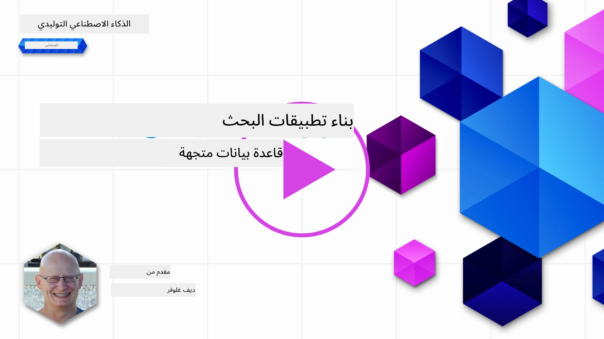
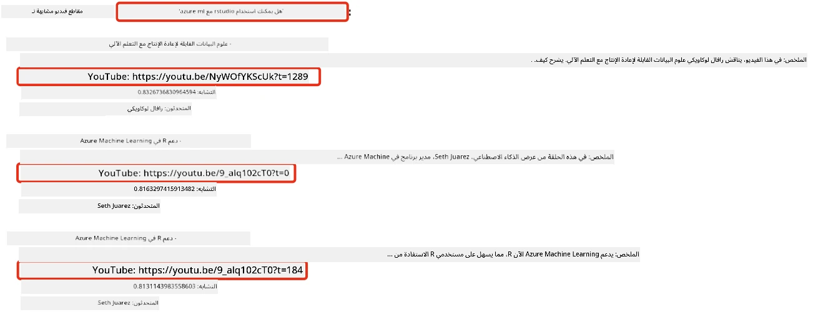
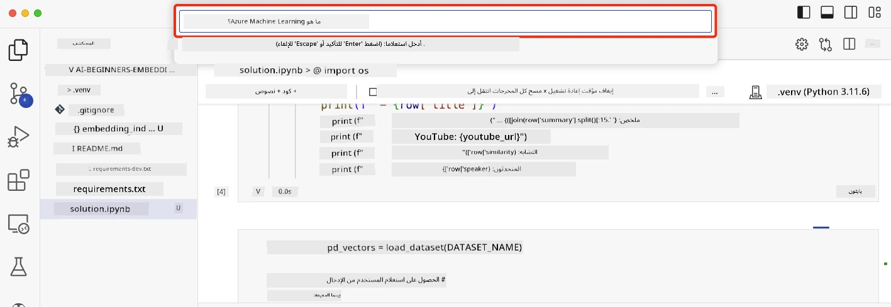

# بناء تطبيقات البحث

[](https://youtu.be/W0-nzXjOjr0?si=GcsqiTTvd7RKbo7V)

> > _انقر على الصورة أعلاه لعرض فيديو هذا الدرس_

هناك أكثر من روبوتات الدردشة وتوليد النصوص فيما يتعلق بنماذج اللغة الكبيرة. فمن الممكن أيضًا بناء تطبيقات بحث باستخدام التضمينات. التضمينات هي تمثيلات رقمية للبيانات تُعرف أيضًا باسم المتجهات، ويمكن استخدامها للبحث الدلالي عن البيانات.

في هذا الدرس، ستقوم ببناء تطبيق بحث لشركتنا الناشئة التعليمية. شركتنا الناشئة هي منظمة غير ربحية تقدم التعليم المجاني للطلاب في الدول النامية. تمتلك شركتنا الناشئة عددًا كبيرًا من فيديوهات YouTube التي يمكن للطلاب استخدامها لتعلم الذكاء الاصطناعي. ترغب شركتنا الناشئة في بناء تطبيق بحث يسمح للطلاب بالبحث عن فيديو في YouTube عن طريق كتابة سؤال.

على سبيل المثال، قد يكتب الطالب "ما هي دفاتر Jupyter؟" أو "ما هو Azure ML" وسيُرجع تطبيق البحث قائمة بفيديوهات YouTube التي تتعلق بالسؤال، والأفضل من ذلك، أن تطبيق البحث سيُرجع رابطًا للمكان في الفيديو حيث يقع جواب السؤال.

## مقدمة

في هذا الدرس، سنتناول:

- البحث الدلالي مقابل بحث الكلمات المفتاحية.
- ما هي تضمينات النص.
- إنشاء فهرس تضمينات نصية.
- البحث في فهرس التضمينات النصية.

## أهداف التعلم

بعد إتمام هذا الدرس، ستكون قادرًا على:

- التمييز بين البحث الدلالي وبحث الكلمات المفتاحية.
- شرح ما هي تضمينات النص.
- إنشاء تطبيق باستخدام التضمينات للبحث عن البيانات.

## لماذا نبني تطبيق بحث؟

بناء تطبيق بحث سيساعدك على فهم كيفية استخدام التضمينات للبحث عن البيانات. ستتعلم أيضًا كيفية بناء تطبيق بحث يمكن للطلاب استخدامه للعثور على المعلومات بسرعة.

يتضمن الدرس فهرس تضمينات لتفريغات فيديوهات YouTube الخاصة بقناة Microsoft [AI Show](https://www.youtube.com/playlist?list=PLlrxD0HtieHi0mwteKBOfEeOYf0LJU4O1). AI Show هي قناة يوتيوب تعلمك عن الذكاء الاصطناعي وتعلم الآلة. يحتوي فهرس التضمينات على تضمينات لكل تفريغات فيديوهات YouTube حتى أكتوبر 2023. ستستخدم فهرس التضمينات لبناء تطبيق بحث لبدء التشغيل الخاص بنا. يُرجع تطبيق البحث رابطًا للمكان في الفيديو حيث يقع جواب السؤال. هذه طريقة رائعة للطلاب للعثور على المعلومات التي يحتاجونها بسرعة.

المثال التالي هو استعلام دلالي للسؤال "هل يمكنك استخدام rstudio مع azure ml؟". تحقق من عنوان YouTube، ستلاحظ أن العنوان يحتوي على طابع زمني يأخذك إلى المكان في الفيديو حيث يقع جواب السؤال.



## ما هو البحث الدلالي؟

قد تتساءل الآن، ما هو البحث الدلالي؟ البحث الدلالي هو تقنية بحث تستخدم دلالة أو معنى الكلمات في الاستعلام لإرجاع نتائج ذات صلة.

إليك مثال على البحث الدلالي. لنفترض أنك كنت تبحث عن شراء سيارة، قد تبحث عن "سيارتي الحلم"، البحث الدلالي يفهم أنك لا "تحلم" بسيارة، بل تبحث عن سيارتك "المثالية". البحث الدلالي يفهم نيتك ويُرجع نتائج ذات صلة. البديل هو `بحث الكلمات المفتاحية` الذي يبحث حرفيًا عن أحلام عن السيارات وغالبًا ما يُرجع نتائج غير مناسبة.

## ما هي تضمينات النص؟

[تضمينات النص](https://en.wikipedia.org/wiki/Word_embedding?WT.mc_id=academic-105485-koreyst) هي تقنية تمثيل نص تُستخدم في [معالجة اللغة الطبيعية](https://en.wikipedia.org/wiki/Natural_language_processing?WT.mc_id=academic-105485-koreyst). تضمينات النص هي تمثيلات رقمية دلالية للنص. تُستخدم التضمينات لتمثيل البيانات بطريقة سهلة الفهم للآلة. هناك العديد من النماذج لبناء تضمينات النص، في هذا الدرس، سنركز على توليد التضمينات باستخدام نموذج OpenAI Embedding.

إليك مثال، تخيل النص التالي في تفريغ من إحدى حلقات قناة AI Show على YouTube:

```text
Today we are going to learn about Azure Machine Learning.
```

سنمرر النص إلى واجهة برمجة تطبيقات التضمين الخاصة بـ OpenAI وستُرجع التضمين التالي الذي يتكون من 1536 رقمًا يُعرف أيضًا بالمتجه. كل رقم في المتجه يمثل جانبًا مختلفًا من النص. للاختصار، هنا أول 10 أرقام في المتجه.

```python
[-0.006655829958617687, 0.0026128944009542465, 0.008792596869170666, -0.02446001023054123, -0.008540431968867779, 0.022071078419685364, -0.010703742504119873, 0.003311325330287218, -0.011632772162556648, -0.02187200076878071, ...]
```

## كيف يُنشأ فهرس التضمين؟

تم إنشاء فهرس التضمين لهذا الدرس باستخدام سلسلة من سكريبتات بايثون. ستجد السكريبتات مع التعليمات في [README](./scripts/README.md?WT.mc_id=academic-105485-koreyst) في مجلد 'scripts' لهذا الدرس. لا تحتاج لتشغيل هذه السكريبتات لإكمال هذا الدرس حيث يتم توفير فهرس التضمين لك.

تنفذ السكريبتات العمليات التالية:

1. يتم تنزيل التفريغ النصي لكل فيديو في قائمة تشغيل [AI Show](https://www.youtube.com/playlist?list=PLlrxD0HtieHi0mwteKBOfEeOYf0LJU4O1).
2. باستخدام [وظائف OpenAI](https://learn.microsoft.com/azure/ai-foundry/openai/how-to/function-calling?WT.mc_id=academic-105485-koreyst)، يُمحَص اسم المتحدث من الدقائق الثلاث الأولى من تفريغ النص لفيديو YouTube. يتم تخزين اسم المتحدث لكل فيديو في فهرس التضمين المسمى `embedding_index_3m.json`.
3. يُجزأ النص في التفريغ إلى مقاطع نصية مدتها **3 دقائق**. يشمل المقطع حوالي 20 كلمة متداخلة من المقطع التالي لضمان أن التضمين للمقطع لا يُقطع ولتوفير سياق بحث أفضل.
4. يُمرر كل مقطع نصي إلى واجهة برمجة تطبيقات المحادثة من OpenAI لتلخيص النص إلى 60 كلمة. يُخزن الملخص أيضًا في فهرس التضمين `embedding_index_3m.json`.
5. أخيرًا، يُمرر نص المقطع إلى واجهة برمجة تطبيقات التضمين من OpenAI. تُرجع API التضمين متجهًا مكونًا من 1536 رقمًا يمثل المعنى الدلالي للمقطع. يُخزن المقطع إلى جانب متجه التضمين الخاص بـ OpenAI في فهرس التضمين `embedding_index_3m.json`.

### قواعد البيانات المتجهية

لسهولة الدرس، يتم تخزين فهرس التضمين في ملف JSON يُسمى `embedding_index_3m.json` ويتم تحميله في إطار بيانات Pandas. مع ذلك، في الإنتاج، سيتم تخزين فهرس التضمين في قاعدة بيانات متجهية مثل [Azure Cognitive Search](https://learn.microsoft.com/training/modules/improve-search-results-vector-search?WT.mc_id=academic-105485-koreyst)، [Redis](https://cookbook.openai.com/examples/vector_databases/redis/readme?WT.mc_id=academic-105485-koreyst)، [Pinecone](https://cookbook.openai.com/examples/vector_databases/pinecone/readme?WT.mc_id=academic-105485-koreyst)، [Weaviate](https://cookbook.openai.com/examples/vector_databases/weaviate/readme?WT.mc_id=academic-105485-koreyst)، على سبيل المثال لا الحصر.

## فهم تشابه الكوزاين

تعلمنا عن تضمينات النص، والخطوة التالية هي تعلم كيفية استخدام تضمينات النص للبحث عن البيانات، وبشكل خاص إيجاد أكثر التضمينات تشابهًا مع استعلام معين باستخدام تشابه الكوزاين.

### ما هو تشابه الكوزاين؟

تشابه الكوزاين هو مقياس للتشابه بين متجهين، ستسمع أيضًا هذا يشار إليه باسم `بحث أقرب الجيران`. لإجراء بحث تشابه كوزاين، تحتاج إلى _تمثيل_ نص _الاستعلام_ باستخدام واجهة برمجة تطبيقات التضمين الخاصة بـ OpenAI. ثم تحسب _تشابه الكوزاين_ بين متجه الاستعلام وكل متجه في فهرس التضمين. تذكر، فهرس التضمين يحتوي على متجه لكل مقطع نصي من تفريغ فيديوهات YouTube. أخيرًا، قم بفرز النتائج حسب تشابه الكوزاين والنصوص التي لديها أعلى تشابه كوزاين هي الأقرب للاستعلام.

من منظور رياضي، يقيس تشابه الكوزاين جيب تمام الزاوية بين متجهين مسقطين في فضاء متعدد الأبعاد. هذا القياس مفيد، لأنه إذا كان مستندان بعيدين عن بعضهما بمسافة إقليدية بسبب الحجم، يمكن أن يكون لهما زاوية أصغر وبالتالي تشابه كوزاين أعلى. لمزيد من المعلومات عن معادلات تشابه الكوزاين، انظر [تشابه الكوزاين](https://en.wikipedia.org/wiki/Cosine_similarity?WT.mc_id=academic-105485-koreyst).

## بناء تطبيق البحث الأول لك

بعد ذلك، سنتعلم كيفية بناء تطبيق بحث باستخدام التضمينات. سيسمح تطبيق البحث للطلاب بالبحث عن فيديو بكتابة سؤال. سيرجع تطبيق البحث قائمة بالفيديوهات ذات الصلة بالسؤال. كما سيرجع تطبيق البحث رابطًا للمكان في الفيديو حيث يقع جواب السؤال.

تم بناء هذا الحل واختباره على Windows 11 وmacOS وUbuntu 22.04 باستخدام Python 3.10 أو أحدث. يمكنك تنزيل Python من [python.org](https://www.python.org/downloads/?WT.mc_id=academic-105485-koreyst).

## المهمة - بناء تطبيق بحث لتمكين الطلاب

قدمنا شركتنا الناشئة في بداية هذا الدرس. الآن حان الوقت لتمكين الطلاب من بناء تطبيق بحث لامتحاناتهم.

في هذه المهمة، ستنشئ خدمات Azure OpenAI التي ستستخدم لبناء تطبيق البحث. ستنشئ خدمات Azure OpenAI التالية. ستحتاج إلى اشتراك Azure لإتمام هذه المهمة.

### بدء تشغيل Azure Cloud Shell

1. سجّل الدخول إلى [بوابة Azure](https://portal.azure.com/?WT.mc_id=academic-105485-koreyst).
2. اختر أيقونة Cloud Shell في الزاوية العلوية اليمنى من بوابة Azure.
3. اختر **Bash** كنوع البيئة.

#### إنشاء مجموعة موارد

> لهذه التعليمات، نستخدم مجموعة الموارد المسماة "semantic-video-search" في شرق الولايات المتحدة.
> يمكنك تغيير اسم مجموعة الموارد، ولكن عند تغيير موقع الموارد،
> تحقق من [جدول توفر النماذج](https://aka.ms/oai/models?WT.mc_id=academic-105485-koreyst).

```shell
az group create --name semantic-video-search --location eastus
```

#### إنشاء مورد خدمة Azure OpenAI

من Azure Cloud Shell، شغّل الأمر التالي لإنشاء مورد خدمة Azure OpenAI.

```shell
az cognitiveservices account create --name semantic-video-openai --resource-group semantic-video-search \
    --location eastus --kind OpenAI --sku s0
```

#### الحصول على النقطة النهائية والمفاتيح لاستخدامها في هذا التطبيق

من Azure Cloud Shell، شغّل الأوامر التالية للحصول على النقطة النهائية والمفاتيح لمورد خدمة Azure OpenAI.

```shell
az cognitiveservices account show --name semantic-video-openai \
   --resource-group  semantic-video-search | jq -r .properties.endpoint
az cognitiveservices account keys list --name semantic-video-openai \
   --resource-group semantic-video-search | jq -r .key1
```

#### نشر نموذج OpenAI Embedding

من Azure Cloud Shell، شغّل الأمر التالي لنشر نموذج OpenAI Embedding.

```shell
az cognitiveservices account deployment create \
    --name semantic-video-openai \
    --resource-group  semantic-video-search \
    --deployment-name text-embedding-ada-002 \
    --model-name text-embedding-ada-002 \
    --model-version "2"  \
    --model-format OpenAI \
    --sku-capacity 100 --sku-name "Standard"
```

## الحل

افتح [دفتري الحل](./python/aoai-solution.ipynb?WT.mc_id=academic-105485-koreyst) في GitHub Codespaces واتبع التعليمات في دفترك Jupyter.

عند تشغيل الدفتر، ستظهر لك مطالبة لإدخال استعلام. ستبدو خانة الإدخال مثل هذا:



## عمل رائع! استمر في تعلمك

بعد إتمام هذا الدرس، اطلع على [مجموعة تعلم الذكاء الاصطناعي التوليدي](https://aka.ms/genai-collection?WT.mc_id=academic-105485-koreyst) لمواصلة رفع مستوى معرفتك بالذكاء الاصطناعي التوليدي!

انتقل إلى الدرس 9 حيث سنتعلم كيفية [بناء تطبيقات توليد الصور](../09-building-image-applications/README.md?WT.mc_id=academic-105485-koreyst)!

---

<!-- CO-OP TRANSLATOR DISCLAIMER START -->
**تنويه**:
تمت ترجمة هذا المستند باستخدام خدمة الترجمة بالذكاء الاصطناعي [Co-op Translator](https://github.com/Azure/co-op-translator). بينما نسعى للدقة، يرجى العلم أن الترجمات الآلية قد تحتوي على أخطاء أو عدم دقة. يجب اعتبار المستند الأصلي بلغته الأصلية المصدر الرسمي والمعتمد. للمعلومات الهامة، يُنصح بالاستعانة بترجمة بشرية محترفة. نحن غير مسؤولين عن أي سوء فهم أو تفسير ناتج عن استخدام هذه الترجمة.
<!-- CO-OP TRANSLATOR DISCLAIMER END -->