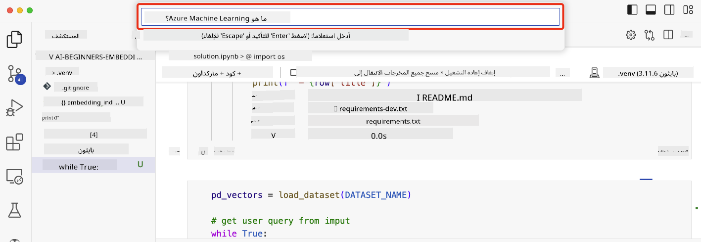

<!--
CO_OP_TRANSLATOR_METADATA:
{
  "original_hash": "d46aad0917a1a342d613e2c13d457da5",
  "translation_date": "2025-07-09T12:47:08+00:00",
  "source_file": "08-building-search-applications/README.md",
  "language_code": "ar"
}
-->
# بناء تطبيقات البحث

[](https://aka.ms/gen-ai-lesson8-gh?WT.mc_id=academic-105485-koreyst)

> > _انقر على الصورة أعلاه لمشاهدة فيديو هذا الدرس_

نماذج اللغة الكبيرة ليست مقتصرة فقط على الدردشة وتوليد النصوص. يمكن أيضًا بناء تطبيقات بحث باستخدام Embeddings. الـ Embeddings هي تمثيلات رقمية للبيانات تُعرف أيضًا بالمتجهات، ويمكن استخدامها للبحث الدلالي عن البيانات.

في هذا الدرس، ستقوم ببناء تطبيق بحث لشركتنا الناشئة في مجال التعليم. شركتنا الناشئة هي منظمة غير ربحية تقدم التعليم المجاني للطلاب في الدول النامية. تمتلك شركتنا عددًا كبيرًا من فيديوهات YouTube التي يمكن للطلاب استخدامها لتعلم الذكاء الاصطناعي. ترغب شركتنا في بناء تطبيق بحث يسمح للطلاب بالبحث عن فيديو على YouTube عن طريق كتابة سؤال.

على سبيل المثال، قد يكتب الطالب "ما هي دفاتر Jupyter؟" أو "ما هو Azure ML" وسيُرجع تطبيق البحث قائمة بفيديوهات YouTube ذات الصلة بالسؤال، والأفضل من ذلك، سيُرجع تطبيق البحث رابطًا للمكان في الفيديو حيث يوجد جواب السؤال.

## المقدمة

في هذا الدرس، سنغطي:

- البحث الدلالي مقابل البحث بالكلمات المفتاحية.
- ما هي Text Embeddings.
- إنشاء فهرس Text Embeddings.
- البحث في فهرس Text Embeddings.

## أهداف التعلم

بعد إكمال هذا الدرس، ستكون قادرًا على:

- التمييز بين البحث الدلالي والبحث بالكلمات المفتاحية.
- شرح ما هي Text Embeddings.
- إنشاء تطبيق يستخدم Embeddings للبحث عن البيانات.

## لماذا نبني تطبيق بحث؟

إنشاء تطبيق بحث سيساعدك على فهم كيفية استخدام Embeddings للبحث عن البيانات. كما ستتعلم كيفية بناء تطبيق بحث يمكن للطلاب استخدامه للعثور على المعلومات بسرعة.

يتضمن الدرس فهرس Embedding لنصوص فيديوهات YouTube لقناة Microsoft [AI Show](https://www.youtube.com/playlist?list=PLlrxD0HtieHi0mwteKBOfEeOYf0LJU4O1). قناة AI Show هي قناة على YouTube تعلمك عن الذكاء الاصطناعي وتعلم الآلة. يحتوي فهرس Embedding على Embeddings لكل نصوص فيديوهات YouTube حتى أكتوبر 2023. ستستخدم فهرس Embedding لبناء تطبيق بحث لشركتنا الناشئة. يُرجع تطبيق البحث رابطًا للمكان في الفيديو حيث يوجد جواب السؤال. هذه طريقة رائعة للطلاب للعثور على المعلومات التي يحتاجونها بسرعة.

فيما يلي مثال على استعلام دلالي للسؤال "هل يمكنك استخدام rstudio مع azure ml؟". تحقق من رابط YouTube، ستجد أن الرابط يحتوي على طابع زمني يأخذك إلى المكان في الفيديو حيث يوجد جواب السؤال.


## ما هو البحث الدلالي؟

قد تتساءل الآن، ما هو البحث الدلالي؟ البحث الدلالي هو تقنية بحث تستخدم دلالات أو معنى الكلمات في الاستعلام لإرجاع نتائج ذات صلة.

إليك مثال على البحث الدلالي. لنفترض أنك تبحث عن شراء سيارة، قد تبحث عن "سيارتي الحلم"، البحث الدلالي يفهم أنك لا تحلم فقط بسيارة، بل أنك تبحث عن سيارتك المثالية. البحث الدلالي يفهم نيتك ويُرجع نتائج ذات صلة. البديل هو البحث بالكلمات المفتاحية الذي يبحث حرفيًا عن أحلام تتعلق بالسيارات وغالبًا ما يُرجع نتائج غير ذات صلة.

## ما هي Text Embeddings؟

[Text embeddings](https://en.wikipedia.org/wiki/Word_embedding?WT.mc_id=academic-105485-koreyst) هي تقنية لتمثيل النص تُستخدم في [معالجة اللغة الطبيعية](https://en.wikipedia.org/wiki/Natural_language_processing?WT.mc_id=academic-105485-koreyst). Text embeddings هي تمثيلات رقمية دلالية للنص. تُستخدم Embeddings لتمثيل البيانات بطريقة يسهل على الآلة فهمها. هناك العديد من النماذج لبناء Text Embeddings، في هذا الدرس سنركز على توليد Embeddings باستخدام نموذج OpenAI Embedding.

إليك مثالًا، تخيل أن النص التالي موجود في نص أحد حلقات قناة AI Show على YouTube:

```text
Today we are going to learn about Azure Machine Learning.
```

سنمرر النص إلى واجهة برمجة تطبيقات OpenAI Embedding وستُرجع الـ Embedding التالية التي تتكون من 1536 رقمًا، أي متجه. كل رقم في المتجه يمثل جانبًا مختلفًا من النص. للاختصار، إليك أول 10 أرقام في المتجه.

```python
[-0.006655829958617687, 0.0026128944009542465, 0.008792596869170666, -0.02446001023054123, -0.008540431968867779, 0.022071078419685364, -0.010703742504119873, 0.003311325330287218, -0.011632772162556648, -0.02187200076878071, ...]
```

## كيف يتم إنشاء فهرس Embedding؟

تم إنشاء فهرس Embedding لهذا الدرس باستخدام سلسلة من سكريبتات Python. ستجد السكريبتات مع التعليمات في ملف [README](./scripts/README.md?WT.mc_id=academic-105485-koreyst) في مجلد 'scripts' لهذا الدرس. لا تحتاج إلى تشغيل هذه السكريبتات لإكمال الدرس لأن فهرس Embedding مُقدم لك.

تقوم السكريبتات بالعمليات التالية:

1. يتم تنزيل نص كل فيديو على YouTube في قائمة تشغيل [AI Show](https://www.youtube.com/playlist?list=PLlrxD0HtieHi0mwteKBOfEeOYf0LJU4O1).
2. باستخدام [OpenAI Functions](https://learn.microsoft.com/azure/ai-services/openai/how-to/function-calling?WT.mc_id=academic-105485-koreyst)، يتم محاولة استخراج اسم المتحدث من أول 3 دقائق من نص الفيديو على YouTube. يتم تخزين اسم المتحدث لكل فيديو في فهرس Embedding المسمى `embedding_index_3m.json`.
3. يتم تقسيم نص الفيديو إلى **مقاطع نصية مدتها 3 دقائق**. يتضمن المقطع حوالي 20 كلمة متداخلة من المقطع التالي لضمان عدم قطع الـ Embedding للمقطع ولتوفير سياق بحث أفضل.
4. يتم تمرير كل مقطع نصي إلى واجهة برمجة تطبيقات OpenAI Chat لتلخيص النص إلى 60 كلمة. يتم أيضًا تخزين الملخص في فهرس Embedding `embedding_index_3m.json`.
5. أخيرًا، يتم تمرير نص المقطع إلى واجهة برمجة تطبيقات OpenAI Embedding. تُرجع واجهة برمجة التطبيقات متجهًا مكونًا من 1536 رقمًا يمثل المعنى الدلالي للمقطع. يتم تخزين المقطع مع متجه OpenAI Embedding في فهرس Embedding `embedding_index_3m.json`.

### قواعد بيانات المتجهات

لأجل بساطة الدرس، يتم تخزين فهرس Embedding في ملف JSON باسم `embedding_index_3m.json` ويتم تحميله في Pandas DataFrame. ومع ذلك، في بيئة الإنتاج، يتم تخزين فهرس Embedding في قاعدة بيانات متجهات مثل [Azure Cognitive Search](https://learn.microsoft.com/training/modules/improve-search-results-vector-search?WT.mc_id=academic-105485-koreyst)، [Redis](https://cookbook.openai.com/examples/vector_databases/redis/readme?WT.mc_id=academic-105485-koreyst)، [Pinecone](https://cookbook.openai.com/examples/vector_databases/pinecone/readme?WT.mc_id=academic-105485-koreyst)، [Weaviate](https://cookbook.openai.com/examples/vector_databases/weaviate/readme?WT.mc_id=academic-105485-koreyst)، على سبيل المثال لا الحصر.

## فهم تشابه جيب التمام (cosine similarity)

تعلمنا عن Text Embeddings، والخطوة التالية هي تعلم كيفية استخدام Text Embeddings للبحث عن البيانات، وبشكل خاص إيجاد أكثر Embeddings تشابهًا لاستعلام معين باستخدام تشابه جيب التمام.

### ما هو تشابه جيب التمام؟

تشابه جيب التمام هو مقياس للتشابه بين متجهين، وستسمع أيضًا هذا يُشار إليه بـ `البحث عن أقرب جار`. لإجراء بحث بتشابه جيب التمام، تحتاج إلى _تحويل_ نص _الاستعلام_ إلى متجه باستخدام واجهة برمجة تطبيقات OpenAI Embedding. ثم تحسب _تشابه جيب التمام_ بين متجه الاستعلام وكل متجه في فهرس Embedding. تذكر، فهرس Embedding يحتوي على متجه لكل مقطع نصي من نصوص فيديوهات YouTube. أخيرًا، قم بترتيب النتائج حسب تشابه جيب التمام، والمقاطع النصية التي لها أعلى تشابه هي الأكثر تشابهًا مع الاستعلام.

من الناحية الرياضية، يقيس تشابه جيب التمام جيب زاوية بين متجهين مسقطين في فضاء متعدد الأبعاد. هذا القياس مفيد، لأنه إذا كان مستندان بعيدين عن بعضهما بمسافة إقليدية بسبب الحجم، فقد يكون لهما زاوية أصغر بينهما وبالتالي تشابه جيب تمام أعلى. لمزيد من المعلومات حول معادلات تشابه جيب التمام، راجع [Cosine similarity](https://en.wikipedia.org/wiki/Cosine_similarity?WT.mc_id=academic-105485-koreyst).

## بناء أول تطبيق بحث لك

بعد ذلك، سنتعلم كيفية بناء تطبيق بحث باستخدام Embeddings. سيسمح تطبيق البحث للطلاب بالبحث عن فيديو بكتابة سؤال. سيُرجع تطبيق البحث قائمة بالفيديوهات ذات الصلة بالسؤال. كما سيُرجع رابطًا للمكان في الفيديو حيث يوجد جواب السؤال.

تم بناء هذا الحل واختباره على Windows 11 وmacOS وUbuntu 22.04 باستخدام Python 3.10 أو أحدث. يمكنك تنزيل Python من [python.org](https://www.python.org/downloads/?WT.mc_id=academic-105485-koreyst).

## المهمة - بناء تطبيق بحث لتمكين الطلاب

قدمنا شركتنا الناشئة في بداية هذا الدرس. حان الوقت الآن لتمكين الطلاب من بناء تطبيق بحث لتقييماتهم.

في هذه المهمة، ستقوم بإنشاء خدمات Azure OpenAI التي ستُستخدم لبناء تطبيق البحث. ستنشئ خدمات Azure OpenAI التالية. ستحتاج إلى اشتراك Azure لإكمال هذه المهمة.

### بدء Azure Cloud Shell

1. سجّل الدخول إلى [بوابة Azure](https://portal.azure.com/?WT.mc_id=academic-105485-koreyst).
2. اختر أيقونة Cloud Shell في الزاوية العلوية اليمنى من بوابة Azure.
3. اختر **Bash** كنوع البيئة.

#### إنشاء مجموعة موارد

> لهذه التعليمات، نستخدم مجموعة الموارد المسماة "semantic-video-search" في شرق الولايات المتحدة.
> يمكنك تغيير اسم مجموعة الموارد، ولكن عند تغيير موقع الموارد،
> تحقق من [جدول توفر النماذج](https://aka.ms/oai/models?WT.mc_id=academic-105485-koreyst).

```shell
az group create --name semantic-video-search --location eastus
```

#### إنشاء مورد خدمة Azure OpenAI

من Azure Cloud Shell، شغّل الأمر التالي لإنشاء مورد خدمة Azure OpenAI.

```shell
az cognitiveservices account create --name semantic-video-openai --resource-group semantic-video-search \
    --location eastus --kind OpenAI --sku s0
```

#### الحصول على نقطة النهاية والمفاتيح لاستخدامها في هذا التطبيق

من Azure Cloud Shell، شغّل الأوامر التالية للحصول على نقطة النهاية والمفاتيح لمورد خدمة Azure OpenAI.

```shell
az cognitiveservices account show --name semantic-video-openai \
   --resource-group  semantic-video-search | jq -r .properties.endpoint
az cognitiveservices account keys list --name semantic-video-openai \
   --resource-group semantic-video-search | jq -r .key1
```

#### نشر نموذج OpenAI Embedding

من Azure Cloud Shell، شغّل الأمر التالي لنشر نموذج OpenAI Embedding.

```shell
az cognitiveservices account deployment create \
    --name semantic-video-openai \
    --resource-group  semantic-video-search \
    --deployment-name text-embedding-ada-002 \
    --model-name text-embedding-ada-002 \
    --model-version "2"  \
    --model-format OpenAI \
    --sku-capacity 100 --sku-name "Standard"
```

## الحل

افتح [دفتر الحل](python/aoai-solution.ipynb) في GitHub Codespaces واتبع التعليمات في دفتر Jupyter.

عند تشغيل الدفتر، سيُطلب منك إدخال استعلام. ستبدو خانة الإدخال كما يلي:



## عمل رائع! واصل تعلمك

بعد إكمال هذا الدرس، اطلع على [مجموعة تعلم الذكاء الاصطناعي التوليدي](https://aka.ms/genai-collection?WT.mc_id=academic-105485-koreyst) لمواصلة تطوير معرفتك في الذكاء الاصطناعي التوليدي!

توجه إلى الدرس 9 حيث سنستعرض كيفية [بناء تطبيقات توليد الصور](../09-building-image-applications/README.md?WT.mc_id=academic-105485-koreyst)!

**إخلاء المسؤولية**:  
تمت ترجمة هذا المستند باستخدام خدمة الترجمة الآلية [Co-op Translator](https://github.com/Azure/co-op-translator). بينما نسعى لتحقيق الدقة، يرجى العلم أن الترجمات الآلية قد تحتوي على أخطاء أو عدم دقة. يجب اعتبار المستند الأصلي بلغته الأصلية المصدر الموثوق به. للمعلومات الهامة، يُنصح بالاعتماد على الترجمة البشرية المهنية. نحن غير مسؤولين عن أي سوء فهم أو تفسير ناتج عن استخدام هذه الترجمة.