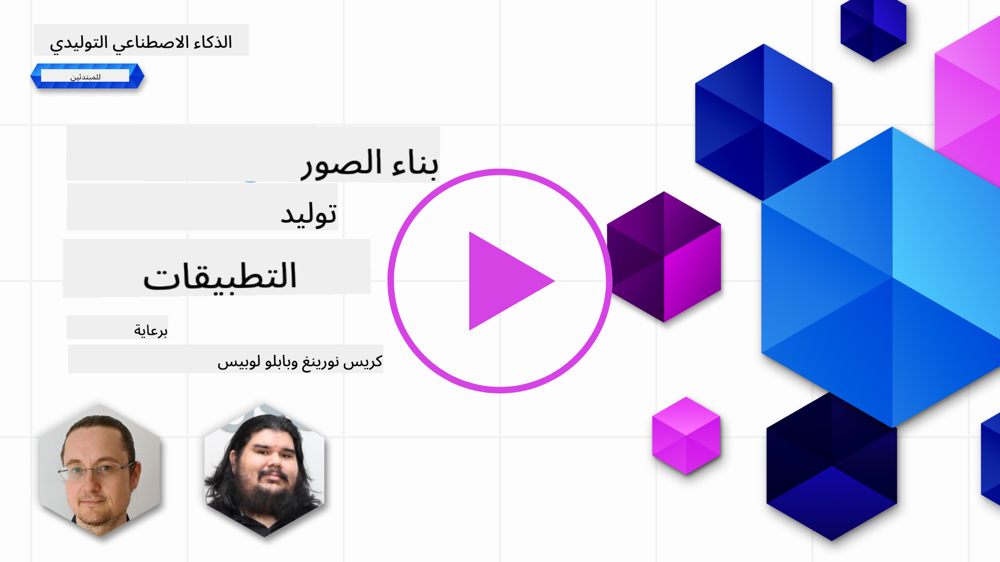

<!--
CO_OP_TRANSLATOR_METADATA:
{
  "original_hash": "ef74ad58fc01f7ad80788f79505f9816",
  "translation_date": "2025-08-26T14:06:58+00:00",
  "source_file": "09-building-image-applications/README.md",
  "language_code": "ar"
}
-->
# بناء تطبيقات توليد الصور

[](https://aka.ms/gen-ai-lesson9-gh?WT.mc_id=academic-105485-koreyst)

قدرات النماذج اللغوية الكبيرة لا تقتصر فقط على توليد النصوص. من الممكن أيضاً توليد صور من أوصاف نصية. وجود الصور كوسيلة يمكن أن يكون مفيداً جداً في مجالات عديدة مثل التكنولوجيا الطبية، والهندسة المعمارية، والسياحة، وتطوير الألعاب وغيرها. في هذا الفصل، سنستعرض أشهر نموذجين لتوليد الصور: DALL-E و Midjourney.

## المقدمة

في هذا الدرس، سنغطي:

- توليد الصور ولماذا هو مفيد.
- DALL-E و Midjourney، ما هما وكيف يعملان.
- كيف يمكنك بناء تطبيق لتوليد الصور.

## أهداف التعلم

بعد الانتهاء من هذا الدرس، ستكون قادراً على:

- بناء تطبيق لتوليد الصور.
- تحديد حدود لتطبيقك باستخدام الميتا برومبت.
- العمل مع DALL-E و Midjourney.

## لماذا نبني تطبيق لتوليد الصور؟

تطبيقات توليد الصور وسيلة رائعة لاستكشاف إمكانيات الذكاء الاصطناعي التوليدي. يمكن استخدامها مثلاً في:

- **تعديل الصور وتركيبها**. يمكنك توليد صور لحالات استخدام متنوعة، مثل تعديل الصور أو تركيب صور جديدة.

- **تطبيقها في صناعات مختلفة**. يمكن استخدامها أيضاً لتوليد صور لصناعات متعددة مثل التكنولوجيا الطبية، السياحة، تطوير الألعاب وغيرها.

## سيناريو: Edu4All

كجزء من هذا الدرس، سنواصل العمل مع شركتنا الناشئة Edu4All. سيقوم الطلاب بإنشاء صور لمهامهم، ونوع الصور متروك للطلاب، فقد تكون رسومات لقصتهم الخيالية أو ابتكار شخصية جديدة أو مساعدتهم في تصور أفكارهم ومفاهيمهم.

مثال على ما يمكن أن يولده طلاب Edu4All إذا كانوا يعملون في الصف على المعالم الأثرية:


باستخدام برومبت مثل

> "كلب بجانب برج إيفل في ضوء شمس الصباح الباكر"

## ما هو DALL-E و Midjourney؟

[DALL-E](https://openai.com/dall-e-2?WT.mc_id=academic-105485-koreyst) و [Midjourney](https://www.midjourney.com/?WT.mc_id=academic-105485-koreyst) هما من أشهر نماذج توليد الصور، حيث يسمحان لك باستخدام برومبتات نصية لتوليد الصور.

### DALL-E

لنبدأ مع DALL-E، وهو نموذج ذكاء اصطناعي توليدي يقوم بتوليد الصور من الأوصاف النصية.

> [DALL-E هو مزيج من نموذجين، CLIP والانتباه المنتشر](https://towardsdatascience.com/openais-dall-e-and-clip-101-a-brief-introduction-3a4367280d4e?WT.mc_id=academic-105485-koreyst).

- **CLIP**، هو نموذج يقوم بإنشاء تمثيلات رقمية (embeddings) للبيانات من الصور والنصوص.

- **الانتباه المنتشر**، هو نموذج يقوم بتوليد الصور من التمثيلات الرقمية. تم تدريب DALL-E على مجموعة بيانات من الصور والنصوص ويمكن استخدامه لتوليد صور من أوصاف نصية. على سبيل المثال، يمكن استخدام DALL-E لتوليد صورة لقطة ترتدي قبعة، أو كلب بتسريحة موهوك.

### Midjourney

يعمل Midjourney بطريقة مشابهة لـ DALL-E، حيث يولد صوراً من برومبتات نصية. يمكن أيضاً استخدام Midjourney لتوليد صور باستخدام برومبتات مثل "قطة ترتدي قبعة" أو "كلب بتسريحة موهوك".


_مصدر الصورة ويكيبيديا، الصورة مولدة بواسطة Midjourney_

## كيف يعمل DALL-E و Midjourney

أولاً، [DALL-E](https://arxiv.org/pdf/2102.12092.pdf?WT.mc_id=academic-105485-koreyst). DALL-E هو نموذج ذكاء اصطناعي توليدي مبني على بنية المحول (transformer) مع _محول ذاتي الترجيع_.

_المحول الذاتي الترجيع_ يحدد كيف يقوم النموذج بتوليد الصور من الأوصاف النصية، حيث يولد كل بكسل على حدة، ثم يستخدم البكسلات المولدة لتوليد البكسل التالي. يمر عبر عدة طبقات في الشبكة العصبية حتى تكتمل الصورة.

من خلال هذه العملية، يتحكم DALL-E في السمات، والأشياء، والخصائص، وغيرها في الصورة التي يولدها. ومع ذلك، لدى DALL-E 2 و 3 تحكم أكبر في الصورة المولدة.

## بناء أول تطبيق لتوليد الصور

فما الذي تحتاجه لبناء تطبيق لتوليد الصور؟ ستحتاج إلى المكتبات التالية:

- **python-dotenv**، يُنصح بشدة باستخدام هذه المكتبة للاحتفاظ بمعلوماتك السرية في ملف _.env_ بعيداً عن الكود.
- **openai**، هذه المكتبة ستستخدمها للتفاعل مع واجهة OpenAI البرمجية.
- **pillow**، للعمل مع الصور في بايثون.
- **requests**، لمساعدتك في إرسال طلبات HTTP.

## إنشاء ونشر نموذج Azure OpenAI

إذا لم تقم بذلك بالفعل، اتبع التعليمات في صفحة [Microsoft Learn](https://learn.microsoft.com/azure/ai-foundry/openai/how-to/create-resource?pivots=web-portal)
لإنشاء مورد ونموذج Azure OpenAI. اختر DALL-E 3 كنموذج.  

## إنشاء التطبيق

1. أنشئ ملف _.env_ بالمحتوى التالي:

   ```text
   AZURE_OPENAI_ENDPOINT=<your endpoint>
   AZURE_OPENAI_API_KEY=<your key>
   AZURE_OPENAI_DEPLOYMENT="dall-e-3"
   ```

   يمكنك العثور على هذه المعلومات في بوابة Azure OpenAI Foundry لموردك في قسم "Deployments".

1. اجمع المكتبات السابقة في ملف باسم _requirements.txt_ كالتالي:

   ```text
   python-dotenv
   openai
   pillow
   requests
   ```

1. بعد ذلك، أنشئ بيئة افتراضية وقم بتثبيت المكتبات:

   ```bash
   python3 -m venv venv
   source venv/bin/activate
   pip install -r requirements.txt
   ```

   في ويندوز، استخدم الأوامر التالية لإنشاء وتفعيل البيئة الافتراضية:

   ```bash
   python3 -m venv venv
   venv\Scripts\activate.bat
   ```

1. أضف الكود التالي في ملف باسم _app.py_:

    ```python
    import openai
    import os
    import requests
    from PIL import Image
    import dotenv
    from openai import OpenAI, AzureOpenAI
    
    # import dotenv
    dotenv.load_dotenv()
    
    # configure Azure OpenAI service client 
    client = AzureOpenAI(
      azure_endpoint = os.environ["AZURE_OPENAI_ENDPOINT"],
      api_key=os.environ['AZURE_OPENAI_API_KEY'],
      api_version = "2024-02-01"
      )
    try:
        # Create an image by using the image generation API
        generation_response = client.images.generate(
                                prompt='Bunny on horse, holding a lollipop, on a foggy meadow where it grows daffodils',
                                size='1024x1024', n=1,
                                model=os.environ['AZURE_OPENAI_DEPLOYMENT']
                              )

        # Set the directory for the stored image
        image_dir = os.path.join(os.curdir, 'images')

        # If the directory doesn't exist, create it
        if not os.path.isdir(image_dir):
            os.mkdir(image_dir)

        # Initialize the image path (note the filetype should be png)
        image_path = os.path.join(image_dir, 'generated-image.png')

        # Retrieve the generated image
        image_url = generation_response.data[0].url  # extract image URL from response
        generated_image = requests.get(image_url).content  # download the image
        with open(image_path, "wb") as image_file:
            image_file.write(generated_image)

        # Display the image in the default image viewer
        image = Image.open(image_path)
        image.show()

    # catch exceptions
    except openai.InvalidRequestError as err:
        print(err)
   ```

لنشرح هذا الكود:

- أولاً، نقوم باستيراد المكتبات التي نحتاجها، بما في ذلك مكتبة OpenAI، ومكتبة dotenv، ومكتبة requests، ومكتبة Pillow.

  ```python
  import openai
  import os
  import requests
  from PIL import Image
  import dotenv
  ```

- بعد ذلك، نقوم بتحميل متغيرات البيئة من ملف _.env_.

  ```python
  # import dotenv
  dotenv.load_dotenv()
  ```

- ثم، نقوم بإعداد عميل خدمة Azure OpenAI

  ```python
  # Get endpoint and key from environment variables
  client = AzureOpenAI(
      azure_endpoint = os.environ["AZURE_OPENAI_ENDPOINT"],
      api_key=os.environ['AZURE_OPENAI_API_KEY'],
      api_version = "2024-02-01"
      )
  ```

- بعد ذلك، نقوم بتوليد الصورة:

  ```python
  # Create an image by using the image generation API
  generation_response = client.images.generate(
                        prompt='Bunny on horse, holding a lollipop, on a foggy meadow where it grows daffodils',
                        size='1024x1024', n=1,
                        model=os.environ['AZURE_OPENAI_DEPLOYMENT']
                      )
  ```

  الكود أعلاه يعيد كائن JSON يحتوي على رابط الصورة المولدة. يمكننا استخدام الرابط لتحميل الصورة وحفظها في ملف.

- أخيراً، نقوم بفتح الصورة واستخدام عارض الصور الافتراضي لعرضها:

  ```python
  image = Image.open(image_path)
  image.show()
  ```

### تفاصيل أكثر حول توليد الصورة

لنلق نظرة على الكود الذي يولد الصورة بمزيد من التفصيل:

    ```python
      generation_response = client.images.generate(
                                prompt='Bunny on horse, holding a lollipop, on a foggy meadow where it grows daffodils',
                                size='1024x1024', n=1,
                                model=os.environ['AZURE_OPENAI_DEPLOYMENT']
                            )
    ```

- **prompt**، هو البرومبت النصي المستخدم لتوليد الصورة. في هذا المثال، نستخدم البرومبت "أرنب على حصان يحمل مصاصة في مرج ضبابي تنمو فيه أزهار النرجس".
- **size**، هو حجم الصورة التي سيتم توليدها. في هذا المثال، نولد صورة بحجم 1024x1024 بكسل.
- **n**، هو عدد الصور التي سيتم توليدها. في هذا المثال، نولد صورتين.
- **temperature**، هو معامل يتحكم في عشوائية مخرجات نموذج الذكاء الاصطناعي التوليدي. القيمة بين 0 و 1 حيث 0 تعني أن المخرجات حتمية و1 تعني أن المخرجات عشوائية. القيمة الافتراضية هي 0.7.

هناك أشياء أخرى يمكنك القيام بها مع الصور سنغطيها في القسم التالي.

## إمكانيات إضافية لتوليد الصور

رأيت حتى الآن كيف استطعنا توليد صورة باستخدام بضعة أسطر في بايثون. ومع ذلك، هناك المزيد مما يمكنك فعله مع الصور.

يمكنك أيضاً القيام بما يلي:

- **إجراء تعديلات**. من خلال تزويد صورة موجودة بقناع وبرومبت نصي، يمكنك تعديل الصورة. على سبيل المثال، يمكنك إضافة شيء إلى جزء من الصورة. تخيل صورة الأرنب، يمكنك إضافة قبعة للأرنب. يتم ذلك بتوفير الصورة، وقناع (لتحديد الجزء المراد تغييره) وبرومبت نصي يوضح ما يجب فعله.
> ملاحظة: هذا غير مدعوم في DALL-E 3.

إليك مثال باستخدام GPT Image:

    ```python
    response = client.images.edit(
        model="gpt-image-1",
        image=open("sunlit_lounge.png", "rb"),
        mask=open("mask.png", "rb"),
        prompt="A sunlit indoor lounge area with a pool containing a flamingo"
    )
    image_url = response.data[0].url
    ```

  الصورة الأساسية ستحتوي فقط على الصالة مع المسبح، لكن الصورة النهائية سيكون فيها فلامنغو:

<div style="display: flex; justify-content: space-between; align-items: center; margin: 20px 0;">
  
  
  
</div>


- **إنشاء تنويعات**. الفكرة هي أن تأخذ صورة موجودة وتطلب إنشاء تنويعات لها. لإنشاء تنويعة، توفر صورة وبرومبت نصي وكود مثل التالي:

  ```python
  response = openai.Image.create_variation(
    image=open("bunny-lollipop.png", "rb"),
    n=1,
    size="1024x1024"
  )
  image_url = response['data'][0]['url']
  ```

  > ملاحظة، هذا مدعوم فقط في OpenAI

## درجة الحرارة (Temperature)

درجة الحرارة هي معامل يتحكم في عشوائية مخرجات نموذج الذكاء الاصطناعي التوليدي. القيمة بين 0 و 1 حيث 0 تعني أن المخرجات حتمية و1 تعني أن المخرجات عشوائية. القيمة الافتراضية هي 0.7.

لننظر إلى مثال يوضح كيف تعمل درجة الحرارة، بتشغيل هذا البرومبت مرتين:

> برومبت: "أرنب على حصان يحمل مصاصة في مرج ضبابي تنمو فيه أزهار النرجس"


الآن دعنا نشغل نفس البرومبت مرة أخرى لنرى أننا لن نحصل على نفس الصورة مرتين:


كما ترى، الصور متشابهة لكن ليست متطابقة. دعنا نجرب تغيير قيمة درجة الحرارة إلى 0.1 ونرى النتيجة:

```python
 generation_response = client.images.create(
        prompt='Bunny on horse, holding a lollipop, on a foggy meadow where it grows daffodils',    # Enter your prompt text here
        size='1024x1024',
        n=2
    )
```

### تغيير درجة الحرارة

دعنا نحاول جعل الاستجابة أكثر حتمية. لاحظنا من الصورتين السابقتين أنه في الصورة الأولى يوجد أرنب وفي الثانية يوجد حصان، لذا الصور تختلف كثيراً.

لذلك، سنغير الكود ونضبط درجة الحرارة إلى 0، كالتالي:

```python
generation_response = client.images.create(
        prompt='Bunny on horse, holding a lollipop, on a foggy meadow where it grows daffodils',    # Enter your prompt text here
        size='1024x1024',
        n=2,
        temperature=0
    )
```

الآن عند تشغيل هذا الكود، ستحصل على هاتين الصورتين:

- 
- 

هنا يمكنك أن ترى بوضوح كيف أن الصور أصبحت أكثر تشابهاً.

## كيف تحدد حدوداً لتطبيقك باستخدام الميتا برومبت

مع العرض التجريبي لدينا، يمكننا بالفعل توليد صور لعملائنا. ومع ذلك، نحتاج إلى وضع بعض الحدود لتطبيقنا.

على سبيل المثال، لا نريد توليد صور غير مناسبة للعمل أو غير ملائمة للأطفال.

يمكننا فعل ذلك باستخدام _الميتا برومبت_. الميتا برومبت هي برومبتات نصية تُستخدم للتحكم في مخرجات نموذج الذكاء الاصطناعي التوليدي. على سبيل المثال، يمكننا استخدام الميتا برومبت للتحكم في المخرجات، وضمان أن الصور المولدة مناسبة للعمل أو للأطفال.

### كيف تعمل؟

كيف تعمل الميتا برومبت؟

الميتا برومبت هي برومبتات نصية تُستخدم للتحكم في مخرجات نموذج الذكاء الاصطناعي التوليدي، توضع قبل البرومبت النصي، وتُستخدم للتحكم في مخرجات النموذج وتُدمج في التطبيقات للتحكم في المخرجات. يتم دمج مدخل البرومبت ومدخل الميتا برومبت في برومبت نصي واحد.

مثال على ميتا برومبت سيكون كالتالي:

```text
You are an assistant designer that creates images for children.

The image needs to be safe for work and appropriate for children.

The image needs to be in color.

The image needs to be in landscape orientation.

The image needs to be in a 16:9 aspect ratio.

Do not consider any input from the following that is not safe for work or appropriate for children.

(Input)

```

الآن، دعنا نرى كيف يمكننا استخدام الميتا برومبت في العرض التجريبي.

```python
disallow_list = "swords, violence, blood, gore, nudity, sexual content, adult content, adult themes, adult language, adult humor, adult jokes, adult situations, adult"

meta_prompt =f"""You are an assistant designer that creates images for children.

The image needs to be safe for work and appropriate for children.

The image needs to be in color.

The image needs to be in landscape orientation.

The image needs to be in a 16:9 aspect ratio.

Do not consider any input from the following that is not safe for work or appropriate for children.
{disallow_list}
"""

prompt = f"{meta_prompt}
Create an image of a bunny on a horse, holding a lollipop"

# TODO add request to generate image
```

من البرومبت أعلاه، يمكنك أن ترى كيف أن جميع الصور التي يتم إنشاؤها تأخذ الميتا برومبت في الاعتبار.

## مهمة - لنمكّن الطلاب

قدمنا Edu4All في بداية هذا الدرس. الآن حان الوقت لتمكين الطلاب من توليد صور لمهامهم.

سيقوم الطلاب بإنشاء صور لمهامهم تحتوي على معالم أثرية، ونوع المعالم متروك للطلاب. يُطلب من الطلاب استخدام إبداعهم في هذه المهمة لوضع هذه المعالم في سياقات مختلفة.

## الحل

إليك حل ممكن:

```python
import openai
import os
import requests
from PIL import Image
import dotenv
from openai import AzureOpenAI
# import dotenv
dotenv.load_dotenv()

# Get endpoint and key from environment variables
client = AzureOpenAI(
  azure_endpoint = os.environ["AZURE_OPENAI_ENDPOINT"],
  api_key=os.environ['AZURE_OPENAI_API_KEY'],
  api_version = "2024-02-01"
  )


disallow_list = "swords, violence, blood, gore, nudity, sexual content, adult content, adult themes, adult language, adult humor, adult jokes, adult situations, adult"

meta_prompt = f"""You are an assistant designer that creates images for children.

The image needs to be safe for work and appropriate for children.

The image needs to be in color.

The image needs to be in landscape orientation.

The image needs to be in a 16:9 aspect ratio.

Do not consider any input from the following that is not safe for work or appropriate for children.
{disallow_list}
"""

prompt = f"""{meta_prompt}
Generate monument of the Arc of Triumph in Paris, France, in the evening light with a small child holding a Teddy looks on.
""""

try:
    # Create an image by using the image generation API
    generation_response = client.images.generate(
        prompt=prompt,    # Enter your prompt text here
        size='1024x1024',
        n=1,
    )
    # Set the directory for the stored image
    image_dir = os.path.join(os.curdir, 'images')

    # If the directory doesn't exist, create it
    if not os.path.isdir(image_dir):
        os.mkdir(image_dir)

    # Initialize the image path (note the filetype should be png)
    image_path = os.path.join(image_dir, 'generated-image.png')

    # Retrieve the generated image
    image_url = generation_response.data[0].url  # extract image URL from response
    generated_image = requests.get(image_url).content  # download the image
    with open(image_path, "wb") as image_file:
        image_file.write(generated_image)

    # Display the image in the default image viewer
    image = Image.open(image_path)
    image.show()

# catch exceptions
except openai.BadRequestError as err:
    print(err)
```

## عمل رائع! واصل التعلم
بعد الانتهاء من هذا الدرس، اطلع على [مجموعة تعلم الذكاء الاصطناعي التوليدي](https://aka.ms/genai-collection?WT.mc_id=academic-105485-koreyst) لمواصلة تطوير معرفتك في الذكاء الاصطناعي التوليدي!

انتقل إلى الدرس 10 حيث سنستعرض كيفية [بناء تطبيقات ذكاء اصطناعي باستخدام البرمجة منخفضة الكود](../10-building-low-code-ai-applications/README.md?WT.mc_id=academic-105485-koreyst)

---

**إخلاء المسؤولية**:  
تمت ترجمة هذا المستند باستخدام خدمة الترجمة بالذكاء الاصطناعي [Co-op Translator](https://github.com/Azure/co-op-translator). بينما نسعى لتحقيق الدقة، يرجى العلم أن الترجمات الآلية قد تحتوي على أخطاء أو معلومات غير دقيقة. يجب اعتبار المستند الأصلي بلغته الأصلية هو المصدر الموثوق. بالنسبة للمعلومات الهامة، يُنصح بالاستعانة بترجمة بشرية احترافية. نحن غير مسؤولين عن أي سوء فهم أو تفسير خاطئ ينشأ عن استخدام هذه الترجمة.