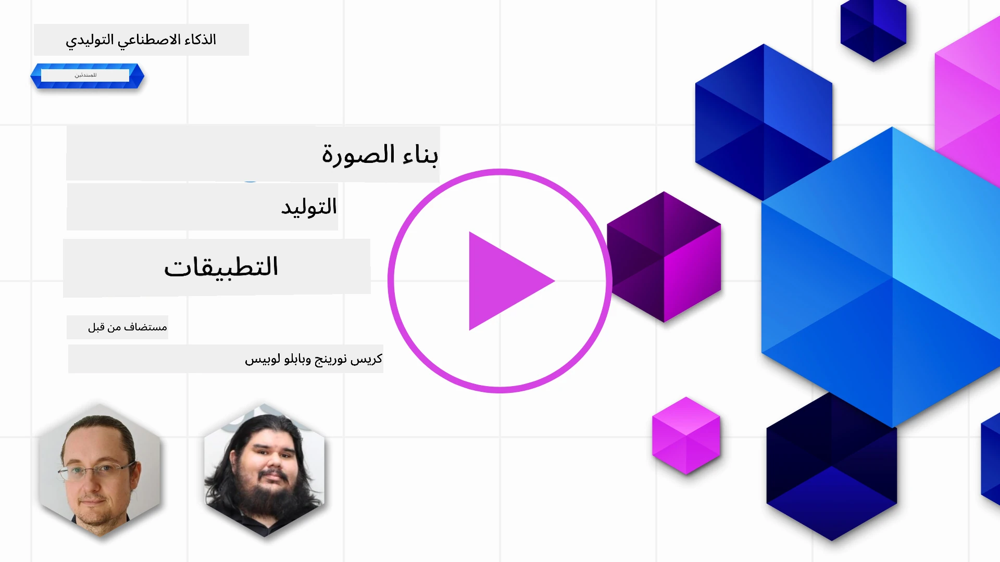

# بناء تطبيقات توليد الصور

[](https://aka.ms/gen-ai-lesson9-gh?WT.mc_id=academic-105485-koreyst)

هناك أكثر من توليد النصوص في نماذج اللغة الكبيرة. يمكنك أيضًا توليد الصور من الأوصاف النصية. تعد الصور كوسيلة مفيدة عبر مجالات مثل التكنولوجيا الطبية، والهندسة المعمارية، والسياحة، وتطوير الألعاب، والتسويق، وأكثر. في هذا الدرس ننظر إلى نماذج **GPT Image** الحالية ونبني تطبيق توليد الصور.

## مقدمة

يسمح توليد الصور بتحويل موجه بلغة طبيعية إلى صورة. في هذا الدرس نعمل مع عائلة نماذج **`gpt-image`** من OpenAI - الجيل الحالي من نماذج الصور المتاحة على **[Microsoft Foundry](https://ai.azure.com?WT.mc_id=academic-105485-koreyst)** ومنصة OpenAI. هذه النماذج تحل محل نماذج DALL·E القديمة (DALL·E 2/3 نماذج تراثية).

طوال الدرس نستخدم شركة ناشئة تخيلية، **Edu4All**، تبني أدوات تعلم. تريد الفريق توليد رسومات للواجبات ومواد الدراسة.

## أهداف التعلم

بحلول نهاية هذا الدرس ستتمكن من:

- شرح ما هو توليد الصور وأين يكون مفيدًا.
- فهم عائلة نماذج `gpt-image` وكيف تختلف عن نماذج DALL·E التراثية.
- بناء تطبيق توليد الصور بلغة بايثون (وTypeScript / .NET).
- تعديل الصور وتطبيق ضوابط الأمان باستخدام الميتا-موجهات.

## ما هو توليد الصور؟

نماذج توليد الصور تنشئ صورًا من موجه نصي. النماذج الحديثة مثل `gpt-image` مبنية على تقنيات المحولات + الانتشار: يتعلم النموذج العلاقة بين النصوص والصور أثناء التدريب، ثم بناءً على الموجه، يقوم بشكل تكراري "بنزع الضوضاء" من ضجيج عشوائي ليشكل صورة تطابق الوصف.

اثنتان من عائلات نماذج الصور المعروفة هما:

- **`gpt-image` (OpenAI)** - الجيل الحالي، المستخدم في هذا الدرس. يدعم توليد الصور من النص وتحرير الصور (التلوين مع قناع).
- **Midjourney** - نموذج شهير تابع لجهة خارجية مع خدمته الخاصة وسير عمل مستند إلى Discord.

> نماذج الصور القديمة من OpenAI - **DALL·E 2** و **DALL·E 3** - تراثية. DALL·E 3 لم يعد متاحًا للنشر الجديد، وميزات مثل `create_variation` كانت موجودة فقط في DALL·E 2. استخدم نماذج `gpt-image` للتطبيقات الجديدة.

### أي نموذج من `gpt-image` يجب أن أستخدم؟

على Microsoft Foundry النماذج التالية متاحة **عموماً:**

| النموذج | ملاحظات |
| --- | --- |
| **`gpt-image-2`** | أحدث وأقوى نموذج للصور - الافتراضي الموصى به. |
| `gpt-image-1.5` | متاح عموماً؛ جودة قوية بتكلفة أقل. |
| `gpt-image-1-mini` | متاح عموماً؛ الأسرع / الأقل تكلفة. |
| `gpt-image-1` | للمعاينة فقط. |

تحقق دائماً من قائمة نماذج الصور الحالية على [Foundry](https://learn.microsoft.com/azure/ai-foundry/openai/concepts/models?WT.mc_id=academic-105485-koreyst) للمدى والتوافر الإقليمي.

> **مهم:** نماذج `gpt-image` تعيد الصورة المولدة كـ **base64** (`b64_json`)، وليس كرابط URL. يقوم الكود بفك ترميز سلسلة base64 إلى بايتات ويحفظها - لا يوجد رابط صورة للتحميل.

## الإعداد

يمكنك تشغيل الأمثلة ضد **Azure OpenAI في Microsoft Foundry** (عينات `aoai-*`) أو منصة **OpenAI** (عينات `oai-*`).

### 1. إنشاء ونشر نموذج

اتبع دليل [إنشاء مورد](https://learn.microsoft.com/azure/ai-foundry/openai/how-to/create-resource?pivots=web-portal&WT.mc_id=academic-105485-koreyst) لإنشاء مورد Microsoft Foundry، ثم انشر نموذج صور - ينصح بـ **`gpt-image-2`**.

### 2. تكوين ملف `.env`

```text
AZURE_OPENAI_ENDPOINT=<your endpoint>
AZURE_OPENAI_API_KEY=<your key>
AZURE_OPENAI_DEPLOYMENT="gpt-image-2"
```

تجد هذه القيم في صفحة **النشر** لموردك في [بوابة Foundry](https://ai.azure.com?WT.mc_id=academic-105485-koreyst).

### 3. تثبيت المكتبات

أنشئ ملف `requirements.txt`:

```text
python-dotenv
openai
pillow
```

ثم أنشئ وفعل بيئة افتراضية وقم بالتثبيت:

```bash
python3 -m venv venv
source venv/bin/activate        # ويندوز: venv\Scripts\activate
pip install -r requirements.txt
```

## بناء التطبيق

أنشئ `app.py` بالكود التالي. يولد صورة ويحفظها كـ PNG.

```python
import os
import base64
from openai import AzureOpenAI
from PIL import Image
import dotenv

dotenv.load_dotenv()

# وجه العميل نحو مورد Azure OpenAI الخاص بك (Microsoft Foundry).
# تتطلب نماذج الصور نسخة حديثة من API - تحقق من مستندات Foundry للنموذج الذي تحتاجه.
client = AzureOpenAI(
    api_key=os.environ["AZURE_OPENAI_API_KEY"],
    api_version="2025-04-01-preview",
    azure_endpoint=os.environ["AZURE_OPENAI_ENDPOINT"],
)

deployment = os.environ["AZURE_OPENAI_DEPLOYMENT"]  # مثال: "gpt-image-2"

result = client.images.generate(
    model=deployment,
    prompt='Bunny on a horse, holding a lollipop, on a foggy meadow where it grows daffodils',
    size="1024x1024",   # أيضًا 1536x1024 (أفقي)، 1024x1536 (رأسي)، أو "تلقائي"
    n=1,
)

# نماذج gpt-image تعيد base64 (b64_json)، ليست عنوان URL - فقم بفك ترميزها إلى بايتات.
image_bytes = base64.b64decode(result.data[0].b64_json)

os.makedirs("images", exist_ok=True)
image_path = os.path.join("images", "generated-image.png")
with open(image_path, "wb") as f:
    f.write(image_bytes)

Image.open(image_path).show()
```

شغله بالأمر `python app.py`. ستحصل على صورة PNG محفوظة تحت `images/`.

> كل مكالمة إلى `images.generate` تنتج صورة مختلفة لنفس الموجه - نماذج الصور لا تأخذ معامل `temperature` (هذا تحكم لتوليد النصوص). للحصول على تنويع، استدعِ الـ API مجددًا؛ ولتقليل التنويع، اجعل موجهك أكثر تحديدًا.

## تحرير الصور

نماذج `gpt-image` يمكنها **تحرير** صورة موجودة: قدم الصورة، وقناعًا اختياريًا (يحدد المنطقة المراد تغييرها)، وموجهًا يصف التغيير. مثل التوليد، التعديلات تُعاد بصيغة base64.

```python
result = client.images.edit(
    model=deployment,
    image=open("sunlit_lounge.png", "rb"),
    mask=open("mask.png", "rb"),
    prompt="A sunlit indoor lounge area with a pool containing a flamingo",
)
image_bytes = base64.b64decode(result.data[0].b64_json)
with open("images/edited-image.png", "wb") as f:
    f.write(image_bytes)
```

<div style="display: flex; justify-content: space-between; align-items: center; margin: 20px 0;">
  
  
  
</div>

## ضبط الحدود باستخدام الميتا-موجهات

بمجرد أن تتمكن من توليد الصور، تحتاج إلى ضوابط أمنية لكي لا ينتج تطبيقك محتوى غير آمن أو خارج العلامة التجارية. **الميتا-موجه** هو نص تسبقه على موجه المستخدم لتقييد مخرجات النموذج.

```python
disallow_list = "swords, violence, blood, gore, nudity, sexual content, adult content, adult themes, adult language"

meta_prompt = f"""You are an assistant designer that creates images for children.

The image needs to be safe for work and appropriate for children.
The image needs to be in color, in landscape orientation, and in a 16:9 aspect ratio.

Do not consider any input that is not safe for work or appropriate for children, including:
{disallow_list}
"""

prompt = f"{meta_prompt}\nCreate an image of a bunny on a horse, holding a lollipop"
# مرر `prompt` إلى client.images.generate(...)
```

الآن كل صورة تُولد ضمن الحدود التي يحددها الميتا-موجه. اجمع ذلك مع مرشحات المحتوى المدمجة في Microsoft Foundry لتوفير دفاع متعدد الطبقات.

## المهمة - لنسهل على الطلاب

يحتاج طلاب Edu4All لصور لتقييماتهم. ابنِ تطبيقًا يولد صورًا لـ **الآثار** (اختيار الآثار يعود لك) موضوعًا في سياقات مختلفة ومبتكرة - على سبيل المثال، معلم شهير عند غروب الشمس مع طفل يطالع.

جرب بنفسك، ثم قارن مع الحلول المرجعية:

- بايثون (أزور): [aoai-solution.py](../../../09-building-image-applications/python/aoai-solution.py)
- تطبيق توليد كامل (أزور) بايثون: [aoai-app.py](../../../09-building-image-applications/python/aoai-app.py)
- بايثون (OpenAI): [oai-app.py](../../../09-building-image-applications/python/oai-app.py)
- TypeScript (أزور): [typescript/image-generation-app](../../../09-building-image-applications/typescript/image-generation-app)
- .NET (أزور): [dotnet/notebook-azure-openai.dib](../../../09-building-image-applications/dotnet/notebook-azure-openai.dib)

أيضًا اعمل عبر دفاتر الملاحظات في [python/](../../../09-building-image-applications/python) (`aoai-assignment.ipynb` للأزور، و`oai-assignment.ipynb` لـ OpenAI).

## عمل رائع! استمر في التعلم

بعد إكمال هذا الدرس، تحقق من [مجموعة تعلم الذكاء الاصطناعي التوليدي](https://aka.ms/genai-collection?WT.mc_id=academic-105485-koreyst) لتستمر في تطوير معرفتك بالذكاء الاصطناعي التوليدي!

توجه إلى الدرس 10 للاستمرار في التعلم.

---

<!-- CO-OP TRANSLATOR DISCLAIMER START -->
**تنويه**:
تمت ترجمة هذا المستند باستخدام خدمة الترجمة بالذكاء الاصطناعي [Co-op Translator](https://github.com/Azure/co-op-translator). بينما نسعى للدقة، يرجى العلم أن الترجمات الآلية قد تحتوي على أخطاء أو عدم دقة. يجب اعتبار المستند الأصلي بلغته الأصلية المصدر الرسمي والمعتمد. للمعلومات الهامة، يُنصح بالاستعانة بترجمة بشرية محترفة. نحن غير مسؤولين عن أي سوء فهم أو تفسير ناتج عن استخدام هذه الترجمة.
<!-- CO-OP TRANSLATOR DISCLAIMER END -->