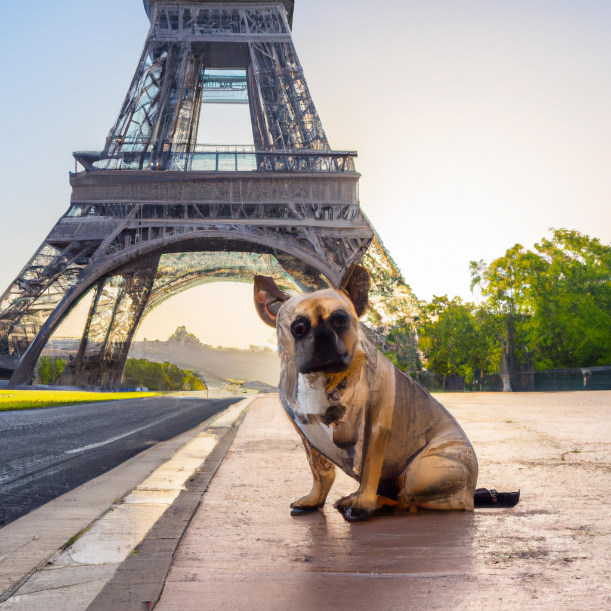

<!--
CO_OP_TRANSLATOR_METADATA:
{
  "original_hash": "1a7fd0f95f9eb673b79da47c0814f4d4",
  "translation_date": "2025-07-09T13:16:10+00:00",
  "source_file": "09-building-image-applications/README.md",
  "language_code": "ar"
}
-->
# بناء تطبيقات توليد الصور

[](https://aka.ms/gen-ai-lesson9-gh?WT.mc_id=academic-105485-koreyst)

تتجاوز قدرات نماذج اللغة الكبيرة (LLMs) توليد النصوص فقط، إذ يمكن أيضًا توليد الصور من أوصاف نصية. وجود الصور كوسيلة تواصل يمكن أن يكون مفيدًا جدًا في مجالات متعددة مثل التكنولوجيا الطبية، الهندسة المعمارية، السياحة، تطوير الألعاب والمزيد. في هذا الفصل، سنستعرض أشهر نموذجين لتوليد الصور، DALL-E وMidjourney.

## المقدمة

في هذا الدرس، سنغطي:

- توليد الصور ولماذا هو مفيد.
- ما هو DALL-E وMidjourney، وكيف يعملان.
- كيفية بناء تطبيق لتوليد الصور.

## أهداف التعلم

بعد إتمام هذا الدرس، ستكون قادرًا على:

- بناء تطبيق لتوليد الصور.
- تحديد حدود تطبيقك باستخدام الميتا برومبتس.
- العمل مع DALL-E وMidjourney.

## لماذا نبني تطبيقًا لتوليد الصور؟

تطبيقات توليد الصور طريقة رائعة لاستكشاف قدرات الذكاء الاصطناعي التوليدي. يمكن استخدامها، على سبيل المثال، في:

- **تحرير وتركيب الصور**. يمكنك توليد صور لمجموعة متنوعة من الاستخدامات مثل تحرير الصور وتركيبها.

- **تطبيقات في صناعات متعددة**. يمكن استخدامها لتوليد صور لقطاعات مختلفة مثل التكنولوجيا الطبية، السياحة، تطوير الألعاب والمزيد.

## السيناريو: Edu4All

كجزء من هذا الدرس، سنواصل العمل مع شركتنا الناشئة Edu4All. سيقوم الطلاب بإنشاء صور لتقييماتهم، ونوع الصور متروك لهم، فقد تكون رسومات لقصة خيالية خاصة بهم، أو إنشاء شخصية جديدة لقصة، أو مساعدتهم في تصور أفكارهم ومفاهيمهم.

إليك مثال لما يمكن أن يولده طلاب Edu4All إذا كانوا يعملون في الصف على المعالم:



باستخدام برومبت مثل

> "كلب بجانب برج إيفل في ضوء شمس الصباح الباكر"

## ما هو DALL-E وMidjourney؟

[DALL-E](https://openai.com/dall-e-2?WT.mc_id=academic-105485-koreyst) و[Midjourney](https://www.midjourney.com/?WT.mc_id=academic-105485-koreyst) هما من أشهر نماذج توليد الصور، حيث يسمحان لك باستخدام برومبتس لتوليد الصور.

### DALL-E

لنبدأ بـ DALL-E، وهو نموذج ذكاء اصطناعي توليدي يولد الصور من أوصاف نصية.

> [DALL-E هو مزيج من نموذجين، CLIP والانتباه المنتشر](https://towardsdatascience.com/openais-dall-e-and-clip-101-a-brief-introduction-3a4367280d4e?WT.mc_id=academic-105485-koreyst).

- **CLIP**، هو نموذج يولد تمثيلات رقمية (embeddings) للبيانات من الصور والنصوص.

- **الانتباه المنتشر (Diffused attention)**، هو نموذج يولد الصور من التمثيلات الرقمية. تم تدريب DALL-E على مجموعة بيانات من الصور والنصوص ويمكن استخدامه لتوليد صور من أوصاف نصية. على سبيل المثال، يمكن استخدام DALL-E لتوليد صور لقطة ترتدي قبعة، أو كلب ذو تسريحة موهوك.

### Midjourney

يعمل Midjourney بطريقة مشابهة لـ DALL-E، حيث يولد الصور من برومبتات نصية. يمكن استخدام Midjourney أيضًا لتوليد صور باستخدام برومبتات مثل "قطة ترتدي قبعة"، أو "كلب ذو تسريحة موهوك".


_مصدر الصورة ويكيبيديا، صورة مولدة بواسطة Midjourney_

## كيف يعمل DALL-E وMidjourney

أولًا، [DALL-E](https://arxiv.org/pdf/2102.12092.pdf?WT.mc_id=academic-105485-koreyst). DALL-E هو نموذج ذكاء اصطناعي توليدي يعتمد على بنية المحول (transformer) مع _محول ذاتي الانحدار_ (autoregressive transformer).

المحول الذاتي الانحدار يحدد كيف يولد النموذج الصور من الأوصاف النصية، حيث يولد بكسلًا واحدًا في كل مرة، ثم يستخدم البكسلات المولدة لتوليد البكسل التالي. يمر عبر عدة طبقات في شبكة عصبية حتى تكتمل الصورة.

بهذه العملية، يتحكم DALL-E في السمات، والأشياء، والخصائص، والمزيد في الصورة التي يولدها. ومع ذلك، فإن DALL-E 2 و3 يملكان تحكمًا أكبر في الصورة المولدة.

## بناء أول تطبيق لتوليد الصور

فما الذي تحتاجه لبناء تطبيق لتوليد الصور؟ تحتاج إلى المكتبات التالية:

- **python-dotenv**، يُنصح بشدة باستخدام هذه المكتبة للاحتفاظ بمعلوماتك السرية في ملف _.env_ بعيدًا عن الكود.
- **openai**، هذه المكتبة هي التي ستستخدمها للتفاعل مع واجهة برمجة تطبيقات OpenAI.
- **pillow**، للعمل مع الصور في بايثون.
- **requests**، لمساعدتك في إجراء طلبات HTTP.

1. أنشئ ملف _.env_ بالمحتوى التالي:

   ```text
   AZURE_OPENAI_ENDPOINT=<your endpoint>
   AZURE_OPENAI_API_KEY=<your key>
   ```

   يمكنك العثور على هذه المعلومات في بوابة Azure لموردك في قسم "المفاتيح ونقطة النهاية".

1. اجمع المكتبات السابقة في ملف يسمى _requirements.txt_ كما يلي:

   ```text
   python-dotenv
   openai
   pillow
   requests
   ```

1. بعد ذلك، أنشئ بيئة افتراضية وقم بتثبيت المكتبات:

   ```bash
   python3 -m venv venv
   source venv/bin/activate
   pip install -r requirements.txt
   ```

   بالنسبة لنظام ويندوز، استخدم الأوامر التالية لإنشاء وتفعيل البيئة الافتراضية:

   ```bash
   python3 -m venv venv
   venv\Scripts\activate.bat
   ```

1. أضف الكود التالي في ملف يسمى _app.py_:

   ```python
   import openai
   import os
   import requests
   from PIL import Image
   import dotenv

   # import dotenv
   dotenv.load_dotenv()

   # Get endpoint and key from environment variables
   openai.api_base = os.environ['AZURE_OPENAI_ENDPOINT']
   openai.api_key = os.environ['AZURE_OPENAI_API_KEY']

   # Assign the API version (DALL-E is currently supported for the 2023-06-01-preview API version only)
   openai.api_version = '2023-06-01-preview'
   openai.api_type = 'azure'


   try:
       # Create an image by using the image generation API
       generation_response = openai.Image.create(
           prompt='Bunny on horse, holding a lollipop, on a foggy meadow where it grows daffodils',    # Enter your prompt text here
           size='1024x1024',
           n=2,
           temperature=0,
       )
       # Set the directory for the stored image
       image_dir = os.path.join(os.curdir, 'images')

       # If the directory doesn't exist, create it
       if not os.path.isdir(image_dir):
           os.mkdir(image_dir)

       # Initialize the image path (note the filetype should be png)
       image_path = os.path.join(image_dir, 'generated-image.png')

       # Retrieve the generated image
       image_url = generation_response["data"][0]["url"]  # extract image URL from response
       generated_image = requests.get(image_url).content  # download the image
       with open(image_path, "wb") as image_file:
           image_file.write(generated_image)

       # Display the image in the default image viewer
       image = Image.open(image_path)
       image.show()

   # catch exceptions
   except openai.InvalidRequestError as err:
       print(err)

   ```

دعنا نشرح هذا الكود:

- أولًا، نستورد المكتبات التي نحتاجها، بما في ذلك مكتبة OpenAI، ومكتبة dotenv، ومكتبة requests، ومكتبة Pillow.

  ```python
  import openai
  import os
  import requests
  from PIL import Image
  import dotenv
  ```

- بعد ذلك، نقوم بتحميل متغيرات البيئة من ملف _.env_.

  ```python
  # import dotenv
  dotenv.load_dotenv()
  ```

- ثم نحدد نقطة النهاية، والمفتاح الخاص بواجهة برمجة تطبيقات OpenAI، والإصدار والنوع.

  ```python
  # Get endpoint and key from environment variables
  openai.api_base = os.environ['AZURE_OPENAI_ENDPOINT']
  openai.api_key = os.environ['AZURE_OPENAI_API_KEY']

  # add version and type, Azure specific
  openai.api_version = '2023-06-01-preview'
  openai.api_type = 'azure'
  ```

- بعد ذلك، نقوم بتوليد الصورة:

  ```python
  # Create an image by using the image generation API
  generation_response = openai.Image.create(
      prompt='Bunny on horse, holding a lollipop, on a foggy meadow where it grows daffodils',    # Enter your prompt text here
      size='1024x1024',
      n=2,
      temperature=0,
  )
  ```

  الكود أعلاه يرد بكائن JSON يحتوي على رابط URL للصورة المولدة. يمكننا استخدام الرابط لتحميل الصورة وحفظها في ملف.

- أخيرًا، نفتح الصورة ونستخدم عارض الصور الافتراضي لعرضها:

  ```python
  image = Image.open(image_path)
  image.show()
  ```

### مزيد من التفاصيل حول توليد الصورة

لننظر إلى الكود الذي يولد الصورة بمزيد من التفصيل:

```python
generation_response = openai.Image.create(
        prompt='Bunny on horse, holding a lollipop, on a foggy meadow where it grows daffodils',    # Enter your prompt text here
        size='1024x1024',
        n=2,
        temperature=0,
    )
```

- **prompt**، هو البرومبت النصي المستخدم لتوليد الصورة. في هذه الحالة، نستخدم البرومبت "أرنب على حصان، يحمل مصاصة، في مرج ضبابي حيث تنمو النرجسيات".
- **size**، هو حجم الصورة التي يتم توليدها. في هذه الحالة، نولد صورة بحجم 1024x1024 بكسل.
- **n**، هو عدد الصور التي يتم توليدها. في هذه الحالة، نولد صورتين.
- **temperature**، هو معامل يتحكم في عشوائية مخرجات نموذج الذكاء الاصطناعي التوليدي. تتراوح قيمته بين 0 و1 حيث تعني 0 أن المخرجات حتمية و1 تعني أن المخرجات عشوائية. القيمة الافتراضية هي 0.7.

هناك المزيد من الأمور التي يمكنك القيام بها مع الصور وسنغطيها في القسم التالي.

## القدرات الإضافية لتوليد الصور

لقد رأيت حتى الآن كيف استطعنا توليد صورة باستخدام بضعة أسطر في بايثون. ومع ذلك، هناك المزيد مما يمكنك فعله مع الصور.

يمكنك أيضًا القيام بما يلي:

- **إجراء تعديلات**. من خلال توفير صورة موجودة مع قناع (mask) وبرومبت، يمكنك تعديل الصورة. على سبيل المثال، يمكنك إضافة شيء إلى جزء من الصورة. تخيل صورة الأرنب لدينا، يمكنك إضافة قبعة للأرنب. كيف تفعل ذلك؟ بتوفير الصورة، والقناع (لتحديد الجزء المراد تغييره)، وبرومبت نصي يوضح ما يجب القيام به.

  ```python
  response = openai.Image.create_edit(
    image=open("base_image.png", "rb"),
    mask=open("mask.png", "rb"),
    prompt="An image of a rabbit with a hat on its head.",
    n=1,
    size="1024x1024"
  )
  image_url = response['data'][0]['url']
  ```

  الصورة الأساسية ستحتوي فقط على الأرنب، لكن الصورة النهائية ستحتوي على القبعة على الأرنب.

- **إنشاء تنويعات**. الفكرة هي أنك تأخذ صورة موجودة وتطلب إنشاء تنويعات لها. لإنشاء تنويعة، توفر صورة وبرومبت نصي وكود مثل التالي:

  ```python
  response = openai.Image.create_variation(
    image=open("bunny-lollipop.png", "rb"),
    n=1,
    size="1024x1024"
  )
  image_url = response['data'][0]['url']
  ```

  > ملاحظة، هذا مدعوم فقط على OpenAI

## درجة الحرارة (Temperature)

درجة الحرارة هي معامل يتحكم في عشوائية مخرجات نموذج الذكاء الاصطناعي التوليدي. تتراوح قيمتها بين 0 و1 حيث تعني 0 أن المخرجات حتمية و1 تعني أن المخرجات عشوائية. القيمة الافتراضية هي 0.7.

لننظر إلى مثال على كيفية عمل درجة الحرارة، من خلال تشغيل هذا البرومبت مرتين:

> البرومبت: "أرنب على حصان، يحمل مصاصة، في مرج ضبابي حيث تنمو النرجسيات"


الآن دعنا نشغل نفس البرومبت مرة أخرى لنرى أننا لن نحصل على نفس الصورة مرتين:


كما ترى، الصور متشابهة لكنها ليست متطابقة. دعنا نجرب تغيير قيمة درجة الحرارة إلى 0.1 ونرى ماذا يحدث:

```python
 generation_response = openai.Image.create(
        prompt='Bunny on horse, holding a lollipop, on a foggy meadow where it grows daffodils',    # Enter your prompt text here
        size='1024x1024',
        n=2
    )
```

### تغيير درجة الحرارة

لنجرب جعل الاستجابة أكثر حتمية. يمكننا ملاحظة من الصورتين اللتين ولّدناهما أنه في الصورة الأولى هناك أرنب وفي الثانية هناك حصان، لذا الصور تختلف كثيرًا.

لذلك، دعنا نغير الكود ونضبط درجة الحرارة إلى 0، كما يلي:

```python
generation_response = openai.Image.create(
        prompt='Bunny on horse, holding a lollipop, on a foggy meadow where it grows daffodils',    # Enter your prompt text here
        size='1024x1024',
        n=2,
        temperature=0
    )
```

الآن عند تشغيل هذا الكود، ستحصل على هاتين الصورتين:

- 
- 

هنا يمكنك بوضوح رؤية كيف أصبحت الصور أكثر تشابهًا.

## كيفية تحديد حدود لتطبيقك باستخدام الميتا برومبتس

مع العرض التوضيحي الخاص بنا، يمكننا بالفعل توليد صور لعملائنا. ومع ذلك، نحتاج إلى وضع بعض الحدود لتطبيقنا.

على سبيل المثال، لا نريد توليد صور غير مناسبة للعمل أو غير ملائمة للأطفال.

يمكننا فعل ذلك باستخدام _الميتا برومبتس_. الميتا برومبتس هي برومبتات نصية تُستخدم للتحكم في مخرجات نموذج الذكاء الاصطناعي التوليدي. على سبيل المثال، يمكننا استخدام الميتا برومبتس لضمان أن الصور المولدة آمنة للعمل أو مناسبة للأطفال.

### كيف تعمل؟

كيف تعمل الميتا برومبتس؟

الميتا برومبتس هي برومبتات نصية تُستخدم للتحكم في مخرجات نموذج الذكاء الاصطناعي التوليدي، توضع قبل البرومبت النصي، وتُستخدم للتحكم في مخرجات النموذج وتُدمج في التطبيقات للتحكم في مخرجات النموذج. حيث يتم تضمين مدخلات البرومبت والمدخلات الميتا برومبت في برومبت نصي واحد.

مثال على ميتا برومبت هو التالي:

```text
You are an assistant designer that creates images for children.

The image needs to be safe for work and appropriate for children.

The image needs to be in color.

The image needs to be in landscape orientation.

The image needs to be in a 16:9 aspect ratio.

Do not consider any input from the following that is not safe for work or appropriate for children.

(Input)

```

الآن، لنر كيف يمكننا استخدام الميتا برومبتس في عرضنا التوضيحي.

```python
disallow_list = "swords, violence, blood, gore, nudity, sexual content, adult content, adult themes, adult language, adult humor, adult jokes, adult situations, adult"

meta_prompt =f"""You are an assistant designer that creates images for children.

The image needs to be safe for work and appropriate for children.

The image needs to be in color.

The image needs to be in landscape orientation.

The image needs to be in a 16:9 aspect ratio.

Do not consider any input from the following that is not safe for work or appropriate for children.
{disallow_list}
"""

prompt = f"{meta_prompt}
Create an image of a bunny on a horse, holding a lollipop"

# TODO add request to generate image
```

من البرومبت أعلاه، يمكنك أن ترى كيف تأخذ جميع الصور التي يتم إنشاؤها الميتا برومبت بعين الاعتبار.

## المهمة - لتمكين الطلاب

قدمنا Edu4All في بداية هذا الدرس. حان الوقت الآن لتمكين الطلاب من توليد صور لتقييماتهم.

سيقوم الطلاب بإنشاء صور لتقييماتهم تحتوي على معالم، ونوع المعالم متروك للطلاب. يُطلب من الطلاب استخدام إبداعهم في هذه المهمة لوضع هذه المعالم في سياقات مختلفة.

## الحل

إليك حل ممكن:

```python
import openai
import os
import requests
from PIL import Image
import dotenv

# import dotenv
dotenv.load_dotenv()

# Get endpoint and key from environment variables
openai.api_base = "<replace with endpoint>"
openai.api_key = "<replace with api key>"

# Assign the API version (DALL-E is currently supported for the 2023-06-01-preview API version only)
openai.api_version = '2023-06-01-preview'
openai.api_type = 'azure'

disallow_list = "swords, violence, blood, gore, nudity, sexual content, adult content, adult themes, adult language, adult humor, adult jokes, adult situations, adult"

meta_prompt = f"""You are an assistant designer that creates images for children.

The image needs to be safe for work and appropriate for children.

The image needs to be in color.

The image needs to be in landscape orientation.

The image needs to be in a 16:9 aspect ratio.

Do not consider any input from the following that is not safe for work or appropriate for children.
{disallow_list}"""

prompt = f"""{meta_prompt}
Generate monument of the Arc of Triumph in Paris, France, in the evening light with a small child holding a Teddy looks on.
""""

try:
    # Create an image by using the image generation API
    generation_response = openai.Image.create(
        prompt=prompt,    # Enter your prompt text here
        size='1024x1024',
        n=2,
        temperature=0,
    )
    # Set the directory for the stored image
    image_dir = os.path.join(os.curdir, 'images')

    # If the directory doesn't exist, create it
    if not os.path.isdir(image_dir):
        os.mkdir(image_dir)

    # Initialize the image path (note the filetype should be png)
    image_path = os.path.join(image_dir, 'generated-image.png')

    # Retrieve the generated image
    image_url = generation_response["data"][0]["url"]  # extract image URL from response
    generated_image = requests.get(image_url).content  # download the image
    with open(image_path, "wb") as image_file:
        image_file.write(generated_image)

    # Display the image in the default image viewer
    image = Image.open(image_path)
    image.show()

# catch exceptions
except openai.InvalidRequestError as err:
    print(err)
```

## عمل رائع! واصل تعلمك

بعد إتمام هذا الدرس، اطلع على [مجموعة تعلم الذكاء الاصطناعي التوليدي](https://aka.ms/genai-collection?WT.mc_id=academic-105485-koreyst) لمواصلة تطوير معرفتك في الذكاء الاصطناعي التوليدي!

توجه إلى الدرس 10 حيث سنستعرض كيفية [بناء تطبيقات الذكاء الاصطناعي باستخدام البرمجة منخفضة الكود](../10-building-low-code-ai-applications/README.md?WT.mc_id=academic-105485-koreyst)

**إخلاء المسؤولية**:  
تمت ترجمة هذا المستند باستخدام خدمة الترجمة الآلية [Co-op Translator](https://github.com/Azure/co-op-translator). بينما نسعى لتحقيق الدقة، يرجى العلم أن الترجمات الآلية قد تحتوي على أخطاء أو عدم دقة. يجب اعتبار المستند الأصلي بلغته الأصلية المصدر الموثوق به. للمعلومات الهامة، يُنصح بالاعتماد على الترجمة البشرية المهنية. نحن غير مسؤولين عن أي سوء فهم أو تفسير ناتج عن استخدام هذه الترجمة.