# بناء تطبيقات الذكاء الاصطناعي منخفضة الكود

[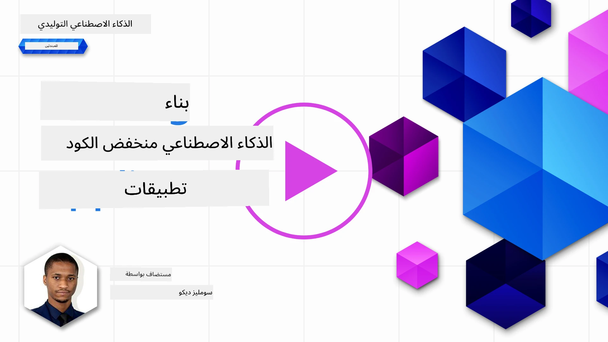](https://youtu.be/1vzq3Nd8GBA?si=h6LHWJXdmqf6mhDg)

> _(انقر على الصورة أعلاه لمشاهدة فيديو هذه الدرس)_

## مقدمة

الآن بعد أن تعلمنا كيفية بناء تطبيقات توليد الصور، دعونا نتحدث عن منخفض الكود. يمكن استخدام الذكاء الاصطناعي التوليدي في مجموعة متنوعة من المجالات المختلفة بما في ذلك منخفض الكود، لكن ما هو منخفض الكود وكيف يمكننا إضافة الذكاء الاصطناعي إليه؟

أصبح بناء التطبيقات والحلول أسهل للمطورين التقليديين وغير المطورين من خلال استخدام منصات تطوير منخفضة الكود. تتيح منصات تطوير منخفضة الكود بناء التطبيقات والحلول بقليل من الكود أو دون كود على الإطلاق. ويتم ذلك من خلال توفير بيئة تطوير بصرية تتيح لك السحب والإفلات للمكونات لبناء التطبيقات والحلول. هذا يمكّنك من بناء التطبيقات والحلول بشكل أسرع وبموارد أقل. في هذا الدرس، نغوص عميقًا في كيفية استخدام منخفض الكود وكيفية تحسين تطوير منخفض الكود باستخدام الذكاء الاصطناعي عبر منصة Power Platform.

توفر منصة Power Platform للمنظمات الفرصة لتمكين فرقها من بناء حلولهم الخاصة عبر بيئة سهلة الاستخدام منخفضة الكود أو بدون كود. تساعد هذه البيئة في تبسيط عملية بناء الحلول. مع Power Platform، يمكن بناء الحلول في أيام أو أسابيع بدلاً من شهور أو سنوات. تتكون Power Platform من خمسة منتجات رئيسية: Power Apps, Power Automate, Power BI, Power Pages و Copilot Studio.

يغطي هذا الدرس:

- مقدمة في الذكاء الاصطناعي التوليدي في Power Platform
- مقدمة في Copilot وكيفية استخدامه
- استخدام الذكاء الاصطناعي التوليدي لبناء التطبيقات والتدفقات في Power Platform
- فهم نماذج الذكاء الاصطناعي في Power Platform باستخدام AI Builder
- بناء وكلاء ذكيين باستخدام Microsoft Copilot Studio

## أهداف التعلم

بنهاية هذا الدرس، ستكون قادرًا على:

- فهم كيفية عمل Copilot في Power Platform.

- بناء تطبيق متعقب واجبات الطالب لشركتنا الناشئة في مجال التعليم.

- بناء تدفق معالجة الفواتير الذي يستخدم الذكاء الاصطناعي لاستخراج المعلومات من الفواتير.

- تطبيق أفضل الممارسات عند استخدام نموذج الذكاء الاصطناعي Create Text مع GPT.

- فهم ماهية Microsoft Copilot Studio وكيفية بناء وكلاء ذكيين باستخدامه.

الأدوات والتقنيات التي ستستخدمها في هذا الدرس هي:

- **Power Apps**، لتطبيق متعقب واجبات الطالب، والذي يوفر بيئة تطوير منخفضة الكود لبناء التطبيقات لتتبع وإدارة والتفاعل مع البيانات.

- **Dataverse**، لتخزين بيانات تطبيق متعقب واجبات الطالب حيث يوفر Dataverse منصة بيانات منخفضة الكود لتخزين بيانات التطبيق.

- **Power Automate**، لتدفق معالجة الفواتير حيث سيكون لديك بيئة تطوير منخفضة الكود لبناء سير عمل لأتمتة عملية معالجة الفواتير.

- **AI Builder**، لنموذج الذكاء الاصطناعي لمعالجة الفواتير حيث ستستخدم نماذج الذكاء الاصطناعي المبنية مسبقًا لمعالجة الفواتير لشركتنا الناشئة.

## الذكاء الاصطناعي التوليدي في Power Platform

تحسين تطوير منخفض الكود وتطبيقه بالذكاء الاصطناعي التوليدي هو مجال تركيز رئيسي لمنصة Power Platform. الهدف هو تمكين الجميع من بناء تطبيقات ومواقع ولوحات بيانات تعمل بالذكاء الاصطناعي وأتمتة العمليات باستخدام الذكاء الاصطناعي، _دون الحاجة إلى خبرة في علوم البيانات_. يتم تحقيق هذا الهدف من خلال دمج الذكاء الاصطناعي التوليدي في تجربة تطوير منخفض الكود في Power Platform عبر Copilot و AI Builder.

### كيف يعمل هذا؟

Copilot هو مساعد ذكاء اصطناعي يمكّنك من بناء حلول Power Platform بوصف متطلباتك في سلسلة من الخطوات الحوارية باستخدام اللغة الطبيعية. على سبيل المثال، يمكنك أن توجه مساعد الذكاء الاصطناعي الخاص بك ليحدد ما هي الحقول التي سيستخدمها تطبيقك وسيقوم بإنشاء التطبيق ونموذج البيانات الأساسي، أو يمكنك تحديد كيفية إعداد تدفق في Power Automate.

يمكنك استخدام وظائف Copilot كمِيزة في شاشات تطبيقك لتمكين المستخدمين من اكتشاف الأفكار من خلال تفاعلات محادثة.

AI Builder هو قدرة ذكاء اصطناعي منخفضة الكود متاحة في Power Platform تتيح لك استخدام نماذج الذكاء الاصطناعي لمساعدتك في أتمتة العمليات والتنبؤ بالنتائج. مع AI Builder يمكنك جلب الذكاء الاصطناعي إلى تطبيقاتك وتدفقاتك التي تتصل ببياناتك في Dataverse أو في مصادر بيانات سحابية متنوعة مثل SharePoint و OneDrive أو Azure.

Copilot متوفر في جميع منتجات Power Platform: Power Apps, Power Automate, Power BI, Power Pages و Copilot Studio (المعروف سابقًا بـ Power Virtual Agents). AI Builder متوفر في Power Apps و Power Automate. في هذا الدرس، سنركز على كيفية استخدام Copilot و AI Builder في Power Apps و Power Automate لبناء حل لشركتنا الناشئة في مجال التعليم.

### Copilot في Power Apps

كجزء من Power Platform، يوفر Power Apps بيئة تطوير منخفضة الكود لبناء تطبيقات تتبع وإدارة والتفاعل مع البيانات. إنها مجموعة من خدمات تطوير التطبيقات مع منصة بيانات قابلة للتوسع وقدرة على الاتصال بخدمات السحابة وبيانات داخل المؤسسة. يتيح Power Apps بناء تطبيقات تعمل على المتصفحات والأجهزة اللوحية والهواتف ويمكن مشاركتها مع زملاء العمل. يسهل Power Apps على المستخدمين بدء تطوير التطبيقات من خلال واجهة بسيطة، بحيث يمكن لكل مستخدم أعمال أو مطور محترف بناء تطبيقات مخصصة. كما تتحسن تجربة تطوير التطبيقات باستخدام الذكاء الاصطناعي التوليدي عبر Copilot.

ميزة مساعد الذكاء الاصطناعي Copilot في Power Apps تمكنك من وصف نوع التطبيق الذي تحتاج إليه وماذا تريد أن يتتبع أو يجمع أو يعرض التطبيق من معلومات. ثم يقوم Copilot بإنشاء تطبيق Canvas متجاوب بناءً على وصفك. يمكنك بعد ذلك تخصيص التطبيق لتلبية احتياجاتك. كما يولد مساعد الذكاء الاصطناعي Copilot جدول Dataverse مع الحقول التي تحتاجها لتخزين البيانات التي تريد تتبعها وبعض بيانات العينة. سنناقش ماهية Dataverse وكيفية استخدامه في Power Apps لاحقًا في هذا الدرس. ثم يمكنك تخصيص الجدول ليلبي احتياجاتك باستخدام ميزة مساعد الذكاء الاصطناعي Copilot من خلال خطوات حوارية. هذه الميزة متاحة مباشرة من شاشة البداية في Power Apps.

### Copilot في Power Automate

كجزء من Power Platform، يتيح Power Automate للمستخدمين إنشاء تدفقات عمل مؤتمتة بين التطبيقات والخدمات. يساعد في أتمتة العمليات التجارية المتكررة مثل التواصل وجمع البيانات والموافقات على القرارات. تتيح واجهته البسيطة للمستخدمين من جميع مستويات المهارة التقنية (من المبتدئين إلى المطورين المحترفين) أتمتة مهام العمل. كما تتحسن تجربة تطوير سير العمل باستخدام الذكاء الاصطناعي التوليدي عبر Copilot.

تتيح ميزة مساعد الذكاء الاصطناعي Copilot في Power Automate وصف نوع التدفق الذي تحتاجه وما هي الإجراءات التي تريد أن يقوم بها تدفقك. ثم يقوم Copilot بإنشاء تدفق بناءً على وصفك. يمكنك بعد ذلك تخصيص التدفق لتلبية احتياجاتك. كما يولد مساعد الذكاء الاصطناعي Copilot ويقترح الإجراءات التي تحتاجها لأداء المهمة التي تريد أتمتتها. سنناقش ماهية التدفقات وكيفية استخدامها في Power Automate لاحقًا في هذا الدرس. ثم يمكنك تخصيص الإجراءات لتلبية احتياجاتك باستخدام ميزة مساعد الذكاء الاصطناعي Copilot من خلال خطوات حوارية. هذه الميزة متاحة مباشرة من شاشة البداية في Power Automate.

## بناء وكلاء ذكيين باستخدام Microsoft Copilot Studio

[Microsoft Copilot Studio](https://learn.microsoft.com/microsoft-copilot-studio/fundamentals-what-is-copilot-studio?WT.mc_id=academic-105485-koreyst) (المعروف سابقًا بـ Power Virtual Agents) هو العضو منخفض الكود في Power Platform لبناء **وكلاء ذكاء اصطناعي** — مساعدين محادثين يمكنهم الإجابة على الأسئلة، اتخاذ الإجراءات، وأتمتة المهام نيابة عن المستخدمين. تمامًا مثل بقية Power Platform، تبني هؤلاء الوكلاء في تجربة بصرية وأولًا لغة طبيعية: تصف ما تريد من الوكيل القيام به، ويساعدك Copilot Studio في هيكلة تعليماته، معرفته، وأفعاله.

بالنسبة لشركتنا الناشئة في مجال التعليم، يمكنك بناء وكيل يجيب على أسئلة الطلاب حول الدورات، يتحقق من مواعيد تسليم الواجبات، وحتى يرسل بريدًا إلكترونيًا للمدرس — كل ذلك بدون كتابة كود.

هذه بعض القدرات الحديثة التي تجعل Copilot Studio قويًا:

- **أجوبة توليدية من معرفتك**. بدلاً من تأليف كل محادثة يدويًا، يمكنك ربط **مصادر المعرفة** — مواقع ويب عامة، SharePoint، OneDrive، Dataverse، ملفات تم تحميلها، أو بيانات مؤسسة عبر الموصلات — والوكيل يولد أجوبة مستندة لهذه المصادر.

- **تنسيق توليدي**. بدلًا من الاعتماد على عبارات تحفيز صارمة، يستخدم الوكيل الذكاء الاصطناعي لفهم الطلب ويقرر ديناميكيًا أي المعرفة والمواضيع والإجراءات التي يجب دمجها لتلبيته، بما في ذلك ربط عدة خطوات معًا.

- **إجراءات وموصلات**. الوكلاء يمكنهم *إنجاز* مهام، لا مجرد الدردشة. يمكنك إعطاء وكيل إجراءات مدعومة بأكثر من 1500 موصل مسبق البناء في Power Platform، تدفقات Power Automate، واجهات برمجة التطبيقات REST مخصصة، مطالبات، أو خوادم **Model Context Protocol (MCP)**.

- **وكلاء مستقلون**. الوكلاء لا يقتصرون على الاستجابة في نافذة الدردشة. يمكنك بناء **وكلاء مستقلون** يتم تفعيلهم بأحداث — مثل بريد إلكتروني جديد، سجل جديد في Dataverse، أو تحميل ملف — ومن ثم يعملون في الخلفية لإكمال مهمة.

- **تنسيق متعدد الوكلاء**. يمكن للوكلاء استدعاء وكلاء آخرين. يمكن لوكيل في Copilot Studio تحويل المهمة لوكيل آخر، أو توسعته بواسطة وكلاء آخرين، بما في ذلك وكلاء منشورين في Microsoft 365 Copilot ووكلاء مبنيين في Microsoft Foundry.

- **اختيار النموذج**. إلى جانب النماذج المدمجة، يمكنك جلب نماذج من كتالوج Microsoft Foundry لتخصيص كيفية تفكير الوكيل وردوده.

- **النشر في أي مكان**. بمجرد بناء الوكيل، يمكن نشره إلى قنوات متعددة — Microsoft Teams، Microsoft 365 Copilot، موقع ويب أو تطبيق مخصص، وأكثر — مع إدارة الأمان، المصادقة، والتحليلات عبر تجربة إدارة Power Platform.

يمكنك بدء بناء وكيلك الأول على [copilotstudio.microsoft.com](https://copilotstudio.microsoft.com?WT.mc_id=academic-105485-koreyst) وتعلم المزيد في [توثيق Microsoft Copilot Studio](https://learn.microsoft.com/microsoft-copilot-studio/?WT.mc_id=academic-105485-koreyst).

## المهمة: إدارة واجبات الطلاب والفواتير لشركتنا الناشئة باستخدام Copilot

تقدم شركتنا الناشئة دورات تعليمية عبر الإنترنت للطلاب. نمت الشركة بسرعة وتكافح الآن لمواكبة الطلب على دوراتها. قامت الشركة بتوظيفك كمطور Power Platform لمساعدتهم في بناء حل منخفض الكود يساعدهم في إدارة واجبات الطلاب والفواتير. يجب أن يكون حلهم قادرًا على مساعدتهم في تتبع وإدارة واجبات الطلاب عبر تطبيق وأتمتة عملية معالجة الفواتير عبر سير عمل. طُلب منك استخدام الذكاء الاصطناعي التوليدي لتطوير الحل.

عند البدء في استخدام Copilot، يمكنك استخدام [مكتبة مطالبات Copilot لمنصة Power Platform](https://github.com/pnp/powerplatform-prompts?WT.mc_id=academic-109639-somelezediko) للبدء بالمطالبات. تحتوي هذه المكتبة على قائمة من المطالبات التي يمكنك استخدامها لبناء التطبيقات والتدفقات مع Copilot. كما يمكنك استخدام هذه المطالبات للحصول على فكرة حول كيفية وصف متطلباتك لـ Copilot.

### بناء تطبيق متعقب واجبات الطلاب لشركتنا الناشئة

يعاني المعلمون في شركتنا الناشئة من صعوبة تتبع واجبات الطلاب. كانوا يستخدمون جدول بيانات لتتبع الواجبات لكنه أصبح من الصعب إدارته مع زيادة عدد الطلاب. طلبوا منك بناء تطبيق يساعدهم في تتبع وإدارة واجبات الطلاب. يجب أن يمكن التطبيق المعلمين من إضافة الواجبات الجديدة، عرض الواجبات، تحديث الواجبات وحذفها. كما يجب أن يمكن التطبيق المعلمين والطلاب من مشاهدة الواجبات التي تم تقييمها وتلك التي لم تُقيّم بعد.

ستبني التطبيق باستخدام Copilot في Power Apps باتباع الخطوات التالية:

1. انتقل إلى شاشة البداية في [Power Apps](https://make.powerapps.com?WT.mc_id=academic-105485-koreyst).

1. استخدم منطقة النص في شاشة البداية لوصف التطبيق الذي تريد بناءه. على سبيل المثال، **_أريد بناء تطبيق لتتبع وإدارة واجبات الطلاب_**. انقر على زر **إرسال** لإرسال المطالبة إلى مساعد الذكاء الاصطناعي Copilot.

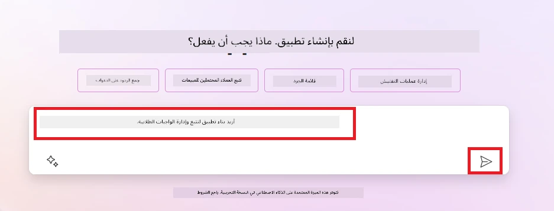

1. سيقترح مساعد الذكاء الاصطناعي Copilot جدول Dataverse مع الحقول التي تحتاجها لتخزين البيانات التي تريد تتبعها وبعض بيانات العينة. يمكنك بعد ذلك تخصيص الجدول ليلبي احتياجاتك باستخدام ميزة مساعد الذكاء الاصطناعي Copilot من خلال خطوات حوارية.

   > **مهم**: Dataverse هو منصة البيانات الأساسية لـ Power Platform. إنها منصة بيانات منخفضة الكود لتخزين بيانات التطبيق. هي خدمة مُدارة بالكامل تقوم بتخزين البيانات بأمان في سحابة مايكروسوفت ويتم توفيرها ضمن بيئة Power Platform الخاصة بك. تأتي مزودة بقدرات حوكمة بيانات مضمنة، مثل تصنيف البيانات، تتبع أصول البيانات، التحكم الدقيق في الوصول، وأكثر. يمكنك معرفة المزيد عن Dataverse [هنا](https://learn.microsoft.com/power-apps/maker/data-platform/data-platform-intro?WT.mc_id=academic-109639-somelezediko).

   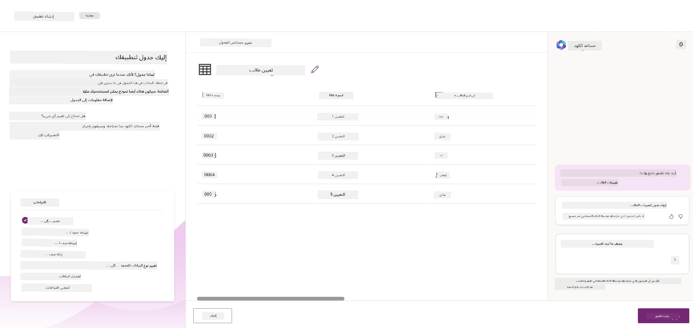

1. يرغب المعلمون في إرسال رسائل بريد إلكتروني إلى الطلاب الذين قدموا واجباتهم ليبقوهم على اطلاع بتقدم الواجبات. يمكنك استخدام Copilot لإضافة حقل جديد إلى الجدول لتخزين بريد الطالب الإلكتروني. على سبيل المثال، يمكنك استخدام المطالبة التالية لإضافة حقل جديد للجدول: **_أريد إضافة عمود لتخزين بريد الطالب الإلكتروني_**. انقر على زر **إرسال** لإرسال المطالبة إلى مساعد الذكاء الاصطناعي Copilot.

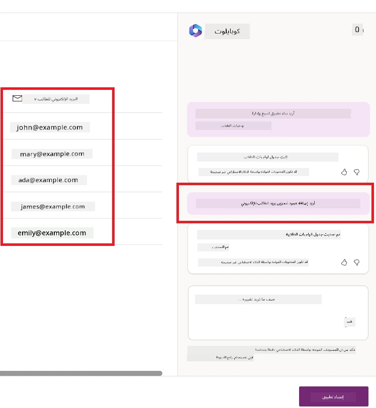

1. سيقوم مساعد الذكاء الاصطناعي Copilot بإنشاء حقل جديد ويمكنك بعد ذلك تخصيص الحقل ليلبي احتياجاتك.

1. بمجرد الانتهاء من الجدول، انقر على زر **إنشاء التطبيق** لإنشاء التطبيق.

1. سيقوم AI Copilot بإنشاء تطبيق Canvas متجاوب بناءً على وصفك. يمكنك بعد ذلك تخصيص التطبيق لتلبية احتياجاتك.

1. للمعلمين لإرسال رسائل إلكترونية إلى الطلاب، يمكنك استخدام Copilot لإضافة شاشة جديدة إلى التطبيق. على سبيل المثال، يمكنك استخدام المطالبة التالية لإضافة شاشة جديدة إلى التطبيق: **_أريد إضافة شاشة لإرسال رسائل إلكترونية إلى الطلاب_**. انقر على زر **إرسال** لإرسال المطالبة إلى AI Copilot.

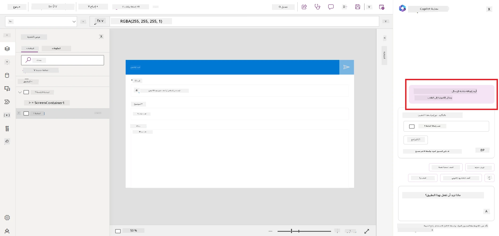

1. سيقوم AI Copilot بإنشاء شاشة جديدة ويمكنك بعد ذلك تخصيص الشاشة لتلبية احتياجاتك.

1. بمجرد الانتهاء من التطبيق، انقر على زر **حفظ** لحفظ التطبيق.

1. لمشاركة التطبيق مع المعلمين، انقر على زر **مشاركة** ثم انقر على زر **مشاركة** مرة أخرى. يمكنك بعد ذلك مشاركة التطبيق مع المعلمين عن طريق إدخال عناوين بريدهم الإلكتروني.

> **واجبك المنزلي**: التطبيق الذي أنشأته هو بداية جيدة لكنه يمكن تحسينه. مع ميزة البريد الإلكتروني، يمكن للمعلمين فقط إرسال رسائل إلكترونية إلى الطلاب يدويًا عن طريق كتابة عناوين بريدهم الإلكتروني. هل يمكنك استخدام Copilot لبناء أتمتة تمكن المعلمين من إرسال رسائل إلكترونية تلقائيًا إلى الطلاب عند تقديمهم واجباتهم؟ تلميحك هو أنه بالمطالبة الصحيحة يمكنك استخدام Copilot في Power Automate لبناء هذا.

### بناء جدول معلومات الفواتير لشركتنا الناشئة

كان فريق المالية في شركتنا الناشئة يعاني من صعوبة تتبع الفواتير. كانوا يستخدمون جدول بيانات لتتبع الفواتير لكن هذا أصبح صعب الإدارة مع زيادة عدد الفواتير. طلبوا منك بناء جدول سيساعدهم على تخزين وتتبع وإدارة معلومات الفواتير التي استلموها. يجب استخدام الجدول لبناء أتمتة تستخرج كل معلومات الفواتير وتخزنها في الجدول. يجب أن يمكن الجدول فريق المالية من عرض الفواتير التي تم دفعها وتلك التي لم تُدفع.

لدى Power Platform منصة بيانات أساسية تسمى Dataverse تتيح لك تخزين بيانات تطبيقاتك وحلولك. ويوفر Dataverse منصة بيانات منخفضة الكود لتخزين بيانات التطبيق. إنها خدمة مُدارة بالكامل تخزن البيانات بأمان في سحابة Microsoft ويتم توفيرها ضمن بيئة Power Platform الخاصة بك. تأتي مع قدرات حوكمة البيانات المدمجة، مثل تصنيف البيانات، وتتبع مصادر البيانات، والتحكم الدقيق في الوصول، والمزيد. يمكنك معرفة المزيد [عن Dataverse هنا](https://learn.microsoft.com/power-apps/maker/data-platform/data-platform-intro?WT.mc_id=academic-109639-somelezediko).

لماذا يجب أن نستخدم Dataverse لشركتنا الناشئة؟ الجداول القياسية والمخصصة ضمن Dataverse توفر خيار تخزين آمن وسحابي لبياناتك. الجداول تتيح لك تخزين أنواع مختلفة من البيانات، على غرار استخدامك لأوراق عمل متعددة في ملف Excel واحد. يمكنك استخدام الجداول لتخزين بيانات محددة لمؤسستك أو احتياجات عملك. بعض الفوائد التي ستحصل عليها شركتنا الناشئة من استخدام Dataverse تشمل، على سبيل المثال لا الحصر:

- **سهل الإدارة**: يتم تخزين كل من البيانات الوصفية والبيانات في السحابة، لذلك لا تحتاج للقلق حول التفاصيل الخاصة بكيفية تخزينها أو إدارتها. يمكنك التركيز على بناء تطبيقاتك وحلولك.

- **آمن**: يوفر Dataverse خيار تخزين آمن وسحابي لبياناتك. يمكنك التحكم في من لديه حق الوصول إلى البيانات في جداولك وكيف يمكنهم الوصول إليها باستخدام الأمن القائم على الدور.

- **بيانات وصفية غنية**: أنواع البيانات والعلاقات تُستخدم مباشرة ضمن Power Apps

- **المنطق والتحقق**: يمكنك استخدام قواعد العمل، والحقول المحسوبة، وقواعد التحقق لفرض منطق الأعمال والحفاظ على دقة البيانات.

الآن بعد أن عرفت ما هو Dataverse ولماذا يجب استخدامه، دعنا ننظر كيف يمكنك استخدام Copilot لإنشاء جدول في Dataverse لتلبية متطلبات فريق المالية لدينا.

> **ملاحظة** : ستستخدم هذا الجدول في القسم التالي لبناء أتمتة تستخرج كل معلومات الفواتير وتخزنها في الجدول.

لإنشاء جدول في Dataverse باستخدام Copilot، اتبع الخطوات أدناه:

1. انتقل إلى شاشة [Power Apps](https://make.powerapps.com?WT.mc_id=academic-105485-koreyst) الرئيسية.

2. في شريط التنقل الأيسر، اختر **الجداول** ثم انقر على **وصف الجدول الجديد**.

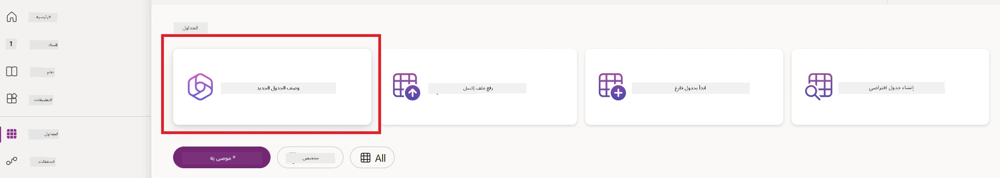

1. في شاشة **وصف الجدول الجديد**، استخدم منطقة النص لوصف الجدول الذي تريد إنشاؤه. على سبيل المثال، **_أريد إنشاء جدول لتخزين معلومات الفواتير_**. انقر على زر **إرسال** لإرسال المطالبة إلى AI Copilot.

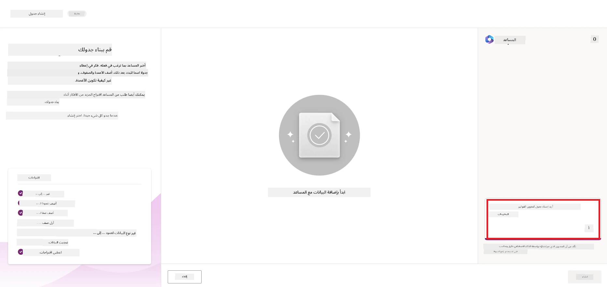

1. سيقترح AI Copilot جدول Dataverse مع الحقول التي تحتاجها لتخزين البيانات التي تريد تتبعها وبعض البيانات النموذجية. يمكنك بعد ذلك تخصيص الجدول لتلبية احتياجاتك باستخدام ميزة مساعد AI Copilot من خلال خطوات حوارية.

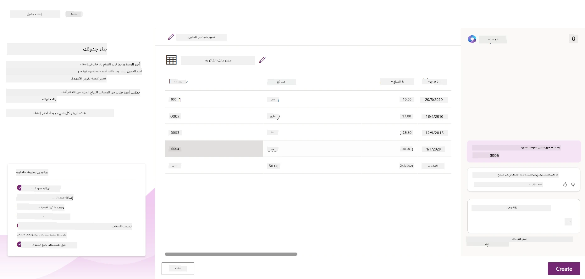

1. يريد فريق المالية إرسال بريد إلكتروني إلى المورد لتحديثه بحالة فاتورته الحالية. يمكنك استخدام Copilot لإضافة حقل جديد إلى الجدول لتخزين بريد المورد الإلكتروني. على سبيل المثال، يمكنك استخدام المطالبة التالية لإضافة حقل جديد إلى الجدول: **_أريد إضافة عمود لتخزين بريد المورد الإلكتروني_**. انقر على زر **إرسال** لإرسال المطالبة إلى AI Copilot.

1. سيقوم AI Copilot بإنشاء حقل جديد ويمكنك بعد ذلك تخصيص الحقل لتلبية احتياجاتك.

1. بمجرد الانتهاء من الجدول، انقر على زر **إنشاء** لإنشاء الجدول.

## نماذج الذكاء الاصطناعي في Power Platform مع AI Builder

AI Builder هي قدرة ذكاء اصطناعي منخفضة الكود متوفرة في Power Platform تتيح لك استخدام نماذج الذكاء الاصطناعي لمساعدتك في أتمتة العمليات والتنبؤ بالنتائج. مع AI Builder يمكنك جلب الذكاء الاصطناعي إلى تطبيقاتك وتدفقاتك التي تتصل ببياناتك في Dataverse أو في مصادر بيانات سحابية مختلفة، مثل SharePoint وOneDrive أو Azure.

## النماذج الجاهزة للذكاء الاصطناعي مقابل النماذج المخصصة

يوفر AI Builder نوعين من نماذج الذكاء الاصطناعي: نماذج جاهزة ونماذج مخصصة. النماذج الجاهزة هي نماذج مدربة من قبل Microsoft ومتوفرة في Power Platform. تساعدك هذه على إضافة الذكاء لتطبيقاتك وتدفقاتك دون الحاجة لجمع بيانات ثم بناء، تدريب، ونشر نماذجك الخاصة. يمكنك استخدام هذه النماذج لأتمتة العمليات والتنبؤ بالنتائج.

بعض النماذج الجاهزة المتوفرة في Power Platform تشمل:

- **استخراج العبارات المفتاحية**: يستخرج هذا النموذج العبارات المفتاحية من النص.
- **كشف اللغة**: يكتشف هذا النموذج لغة النص.
- **تحليل المشاعر**: يكتشف هذا النموذج المشاعر الإيجابية، السلبية، المحايدة، أو المختلطة في النص.
- **قارئ بطاقات الأعمال**: يستخرج هذا النموذج المعلومات من بطاقات الأعمال.
- **تعرّف النص**: يستخرج هذا النموذج النص من الصور.
- **كشف الأجسام**: يكتشف هذا النموذج ويستخرج الأجسام من الصور.
- **معالجة الوثائق**: يستخرج هذا النموذج المعلومات من النماذج.
- **معالجة الفواتير**: يستخرج هذا النموذج المعلومات من الفواتير.

مع النماذج المخصصة يمكنك إدخال نموذجك الخاص إلى AI Builder ليعمل كنموذج مخصص في AI Builder، مما يتيح لك تدريب النموذج باستخدام بياناتك الخاصة. يمكنك استخدام هذه النماذج لأتمتة العمليات والتنبؤ بالنتائج في كل من Power Apps وPower Automate. عند استخدام نموذجك الخاص هناك قيود تنطبق. اقرأ المزيد عن هذه [القيود](https://learn.microsoft.com/ai-builder/byo-model#limitations?WT.mc_id=academic-105485-koreyst).

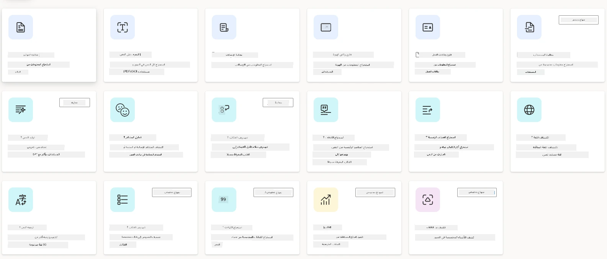

## المهمة #2 - بناء تدفق معالجة الفواتير لشركتنا الناشئة

كان فريق المالية يعاني من صعوبة معالجة الفواتير. كانوا يستخدمون جدول بيانات لتتبع الفواتير لكن الأمر أصبح صعب الإدارة مع زيادة عدد الفواتير. طلبوا منك بناء سير عمل يساعدهم في معالجة الفواتير باستخدام الذكاء الاصطناعي. يجب أن يمكن سير العمل من استخراج المعلومات من الفواتير وتخزينها في جدول Dataverse. كما يجب أن يمكنهم من إرسال بريد إلكتروني إلى فريق المالية مع المعلومات المستخرجة.

الآن بعد أن عرفت ما هو AI Builder ولماذا يجب استخدامه، دعنا ننظر كيف يمكنك استخدام نموذج معالجة الفواتير في AI Builder، الذي غطيناه سابقًا، لبناء سير عمل يساعد فريق المالية في معالجة الفواتير.

لبناء سير عمل يساعد فريق المالية في معالجة الفواتير باستخدام نموذج معالجة الفواتير في AI Builder، اتبع الخطوات أدناه:

1. انتقل إلى شاشة [Power Automate](https://make.powerautomate.com?WT.mc_id=academic-105485-koreyst) الرئيسية.

2. استخدم منطقة النص في الشاشة الرئيسية لوصف سير العمل الذي تريد بناؤه. على سبيل المثال، **_معالجة فاتورة عند وصولها إلى بريدي الإلكتروني_**. انقر على زر **إرسال** لإرسال المطالبة إلى AI Copilot.

   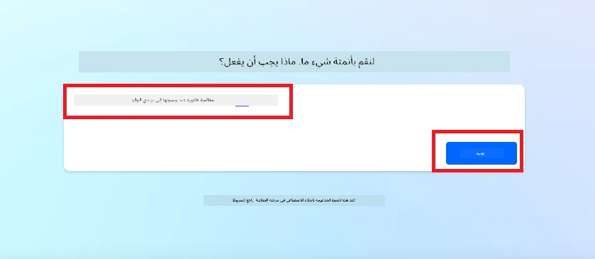

3. سيقترح AI Copilot الإجراءات التي تحتاج لتنفيذ المهمة التي تريد أتمتتها. يمكنك النقر على زر **التالي** للانتقال إلى الخطوات التالية.

4. في الخطوة التالية، سيطلب منك Power Automate إعداد الاتصالات المطلوبة للتدفق. بمجرد الانتهاء، انقر على زر **إنشاء تدفق** لإنشاء التدفق.

5. سيولد AI Copilot تدفقًا يمكنك تخصيصه بعد ذلك لتلبية احتياجاتك.

6. حدّث مشغل التدفق واضبط **المجلد** إلى المجلد الذي سيتم تخزين الفواتير فيه. على سبيل المثال، يمكنك تعيين المجلد إلى **الوارد**. انقر على **إظهار الخيارات المتقدمة** واضبط ** فقط مع المرفقات** إلى **نعم**. هذا سيضمن أن يتم تشغيل التدفق فقط عند استلام بريد إلكتروني يحتوي على مرفق في المجلد.

7. أزل الإجراءات التالية من التدفق: **تحويل HTML إلى نص**، **جمع**، **جمع 2**، **جمع 3** و**جمع 4** لأنك لن تستخدمها.

8. أزل إجراء **الشرط** من التدفق لأنك لن تستخدمه. يجب أن يبدو كما في لقطة الشاشة التالية:

   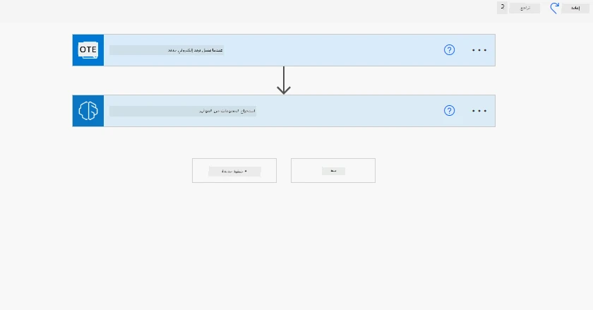

9. انقر على زر **إضافة إجراء** وابحث عن **Dataverse**. اختر إجراء **إضافة صف جديد**.

10. في إجراء **استخراج المعلومات من الفواتير**، حدّث **ملف الفاتورة** للإشارة إلى **محتوى المرفق** من البريد الإلكتروني. هذا سيؤكد أن التدفق يستخرج المعلومات من مرفق الفاتورة.

11. اختر **الجدول** الذي أنشأته سابقًا. على سبيل المثال، يمكنك اختيار جدول **معلومات الفاتورة**. اختر المحتوى الديناميكي من الإجراء السابق لملء الحقول التالية:

    - المعرف
    - المبلغ
    - التاريخ
    - الاسم
    - الحالة - اضبط **الحالة** إلى **قيد الانتظار**.
    - بريد المورد الإلكتروني - استخدم المحتوى الديناميكي **من** من مشغل **عندما يصل بريد إلكتروني جديد**.

    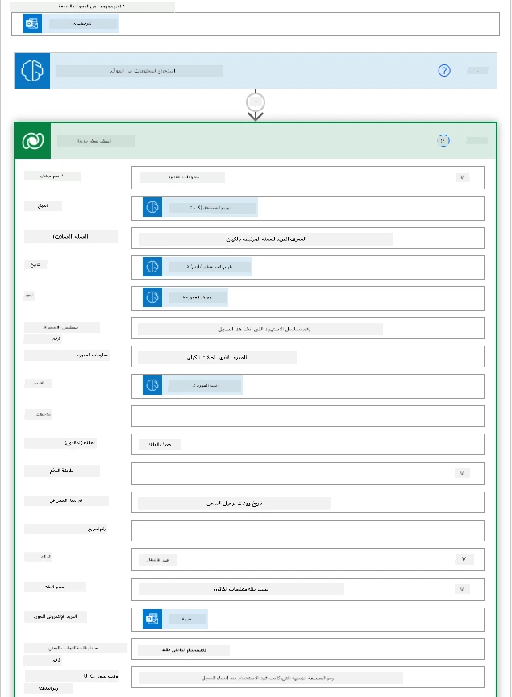

12. بمجرد الانتهاء من التدفق، انقر على زر **حفظ** لحفظ التدفق. يمكنك بعد ذلك اختبار التدفق بإرسال بريد إلكتروني يحتوي على فاتورة إلى المجلد الذي حددته في المشغل.

> **واجبك المنزلي**: التدفق الذي أنشأته هو بداية جيدة، الآن تحتاج للتفكير في كيفية بناء أتمتة تمكن فريق المالية من إرسال بريد إلكتروني إلى المورد لتحديثه بحالة فاتورته الحالية. تلميحك: يجب أن يعمل التدفق عند تغير حالة الفاتورة.

## استخدام نموذج توليد نص في Power Automate

نموذج إنشاء النص باستخدام GPT في AI Builder يتيح لك توليد نص بناءً على مطالبة ويتم تشغيله بخدمة Microsoft Azure OpenAI. مع هذه القدرة، يمكنك دمج تقنية GPT (المحول المدرب مسبقًا التوليدي) في تطبيقاتك وتدفقاتك لبناء مجموعة متنوعة من التدفقات الآلية والتطبيقات التحليلية.

تخضع نماذج GPT لتدريب مكثف على كميات ضخمة من البيانات، مما يمكنها من إنتاج نص يشبه لغة البشر عند تزويدها بمطالبة. عند دمجها مع أتمتة سير العمل، يمكن استخدام نماذج الذكاء الاصطناعي مثل GPT لتبسيط وأتمتة مجموعة واسعة من المهام.

على سبيل المثال، يمكنك بناء تدفقات لتوليد النص تلقائيًا لمجموعة من الاستخدامات مثل: مسودات الرسائل الإلكترونية، أوصاف المنتجات، والمزيد. يمكنك أيضًا استخدام النموذج لتوليد النص لمجموعة من التطبيقات، مثل روبوتات المحادثة وتطبيقات خدمة العملاء التي تتيح لوكلاء خدمة العملاء الرد بفعالية وكفاءة على استفسارات العملاء.

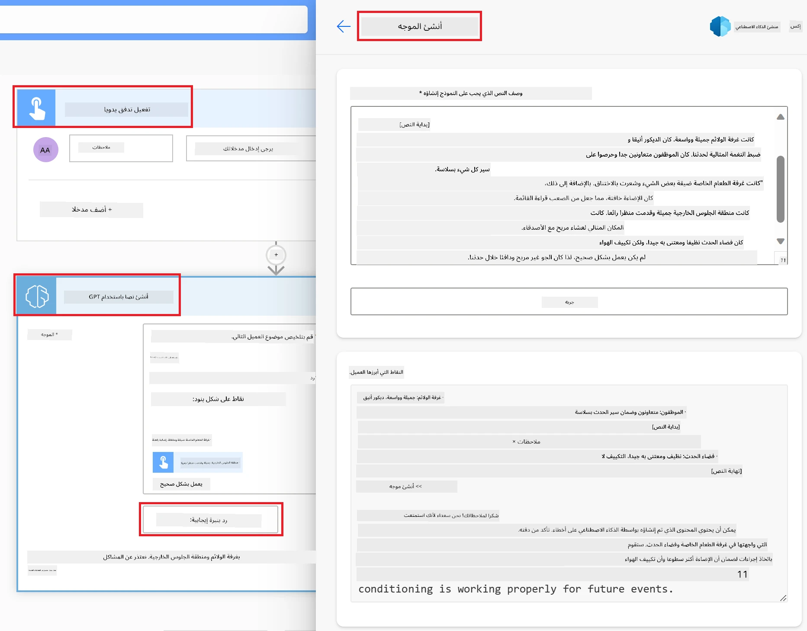

لتعلم كيفية استخدام نموذج الذكاء الاصطناعي هذا في Power Automate، تصفح وحدة [إضافة الذكاء باستخدام AI Builder و GPT](https://learn.microsoft.com/training/modules/ai-builder-text-generation/?WT.mc_id=academic-109639-somelezediko).

## عمل رائع! واصل تعلمك

بعد إكمال هذا الدرس، اطلع على [مجموعة تعلم الذكاء التوليدي](https://aka.ms/genai-collection?WT.mc_id=academic-105485-koreyst) لمواصلة تطوير معرفتك بالذكاء التوليدي!

هل تريد تخصيص Copilot والحصول على المزيد منه؟ استكشف [Awesome Copilot](https://github.com/github/awesome-copilot?WT.mc_id=academic-105485-koreyst) — مجموعة مساهمات من المجتمع من التعليمات والوكلاء والمهارات والتكوينات لمساعدتك في تحقيق أقصى استفادة من GitHub Copilot.

توجه إلى الدرس 11 حيث سنتعلم كيفية [دمج الذكاء التوليدي مع استدعاء الوظيفة](../11-integrating-with-function-calling/README.md?WT.mc_id=academic-105485-koreyst)!

---

<!-- CO-OP TRANSLATOR DISCLAIMER START -->
**تنويه**:
تمت ترجمة هذا المستند باستخدام خدمة الترجمة بالذكاء الاصطناعي [Co-op Translator](https://github.com/Azure/co-op-translator). بينما نسعى للدقة، يرجى العلم أن الترجمات الآلية قد تحتوي على أخطاء أو عدم دقة. يجب اعتبار المستند الأصلي بلغته الأصلية المصدر الرسمي والمعتمد. للمعلومات الهامة، يُنصح بالاستعانة بترجمة بشرية محترفة. نحن غير مسؤولين عن أي سوء فهم أو تفسير ناتج عن استخدام هذه الترجمة.
<!-- CO-OP TRANSLATOR DISCLAIMER END -->