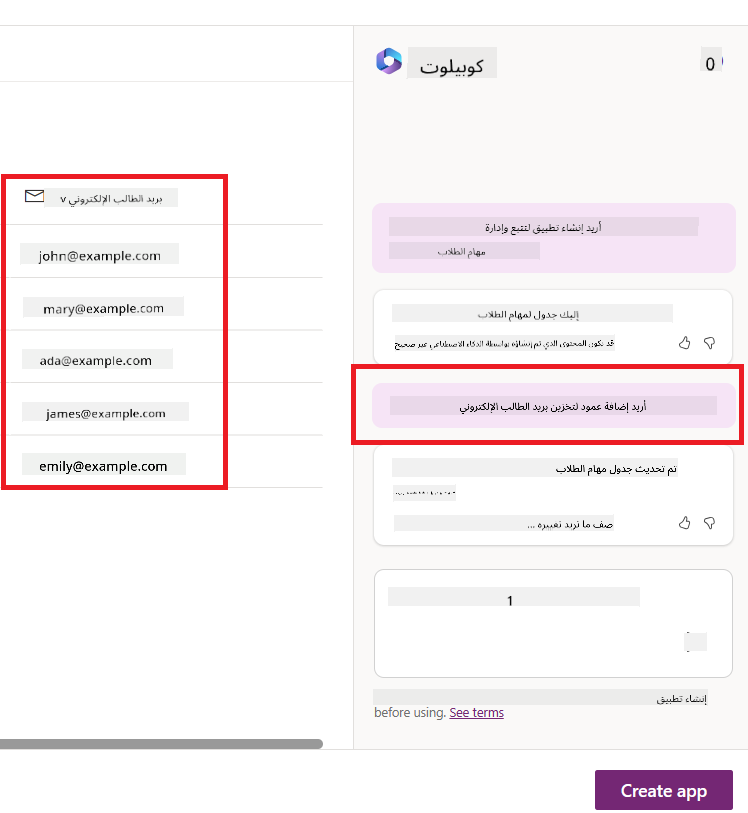
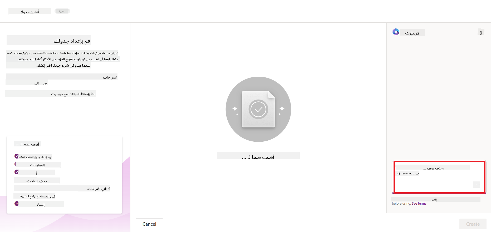

<!--
CO_OP_TRANSLATOR_METADATA:
{
  "original_hash": "f5ff3b6204a695a117d6f452403c95f7",
  "translation_date": "2025-07-09T13:41:37+00:00",
  "source_file": "10-building-low-code-ai-applications/README.md",
  "language_code": "ar"
}
-->
# بناء تطبيقات الذكاء الاصطناعي منخفضة الكود

> _(انقر على الصورة أعلاه لمشاهدة فيديو هذا الدرس)_

## المقدمة

بعد أن تعلمنا كيفية بناء تطبيقات توليد الصور، دعونا نتحدث عن منخفض الكود. يمكن استخدام الذكاء الاصطناعي التوليدي في مجالات متعددة بما في ذلك منخفض الكود، لكن ما هو منخفض الكود وكيف يمكننا إضافة الذكاء الاصطناعي إليه؟

أصبح بناء التطبيقات والحلول أسهل للمطورين التقليديين وغير المطورين من خلال استخدام منصات تطوير منخفضة الكود. تتيح لك منصات تطوير منخفضة الكود بناء التطبيقات والحلول بقليل من البرمجة أو بدونها. ويتم ذلك عبر توفير بيئة تطوير بصرية تتيح لك سحب وإفلات المكونات لبناء التطبيقات والحلول. هذا يمكّنك من بناء التطبيقات والحلول بشكل أسرع وبموارد أقل. في هذا الدرس، سنتعمق في كيفية استخدام منخفض الكود وكيفية تعزيز تطوير منخفض الكود بالذكاء الاصطناعي باستخدام Power Platform.

يوفر Power Platform للمنظمات فرصة تمكين فرقها لبناء حلولهم الخاصة من خلال بيئة منخفضة الكود أو بدون كود بديهية. تساعد هذه البيئة في تبسيط عملية بناء الحلول. مع Power Platform، يمكن بناء الحلول في أيام أو أسابيع بدلاً من شهور أو سنوات. يتكون Power Platform من خمسة منتجات رئيسية: Power Apps، Power Automate، Power BI، Power Pages و Copilot Studio.

يغطي هذا الدرس:

- مقدمة عن الذكاء الاصطناعي التوليدي في Power Platform  
- مقدمة عن Copilot وكيفية استخدامه  
- استخدام الذكاء الاصطناعي التوليدي لبناء التطبيقات والتدفقات في Power Platform  
- فهم نماذج الذكاء الاصطناعي في Power Platform باستخدام AI Builder  

## أهداف التعلم

بنهاية هذا الدرس، ستكون قادرًا على:

- فهم كيفية عمل Copilot في Power Platform.

- بناء تطبيق لتتبع مهام الطلاب لشركتنا الناشئة في مجال التعليم.

- بناء تدفق معالجة الفواتير الذي يستخدم الذكاء الاصطناعي لاستخراج المعلومات من الفواتير.

- تطبيق أفضل الممارسات عند استخدام نموذج الذكاء الاصطناعي Create Text with GPT.

الأدوات والتقنيات التي ستستخدمها في هذا الدرس هي:

- **Power Apps**، لتطبيق تتبع مهام الطلاب، الذي يوفر بيئة تطوير منخفضة الكود لبناء تطبيقات لتتبع وإدارة والتفاعل مع البيانات.

- **Dataverse**، لتخزين بيانات تطبيق تتبع مهام الطلاب حيث يوفر Dataverse منصة بيانات منخفضة الكود لتخزين بيانات التطبيق.

- **Power Automate**، لتدفق معالجة الفواتير حيث ستستخدم بيئة تطوير منخفضة الكود لبناء تدفقات عمل لأتمتة عملية معالجة الفواتير.

- **AI Builder**، لنموذج الذكاء الاصطناعي لمعالجة الفواتير حيث ستستخدم نماذج ذكاء اصطناعي جاهزة لمعالجة الفواتير لشركتنا الناشئة.

## الذكاء الاصطناعي التوليدي في Power Platform

تعزيز تطوير التطبيقات منخفضة الكود باستخدام الذكاء الاصطناعي التوليدي هو محور رئيسي في Power Platform. الهدف هو تمكين الجميع من بناء تطبيقات ومواقع ولوحات معلومات مدعومة بالذكاء الاصطناعي وأتمتة العمليات باستخدام الذكاء الاصطناعي، _دون الحاجة إلى خبرة في علوم البيانات_. يتحقق هذا الهدف من خلال دمج الذكاء الاصطناعي التوليدي في تجربة التطوير منخفض الكود في Power Platform على شكل Copilot و AI Builder.

### كيف يعمل هذا؟

Copilot هو مساعد ذكاء اصطناعي يمكّنك من بناء حلول Power Platform عبر وصف متطلباتك في سلسلة من الخطوات الحوارية باستخدام اللغة الطبيعية. يمكنك مثلاً أن تطلب من مساعدك الذكي تحديد الحقول التي سيستخدمها تطبيقك، وسيقوم بإنشاء التطبيق ونموذج البيانات الأساسي، أو يمكنك تحديد كيفية إعداد تدفق في Power Automate.

يمكنك استخدام وظائف مدفوعة بـ Copilot كميزة في شاشات تطبيقك لتمكين المستخدمين من اكتشاف الرؤى من خلال التفاعلات الحوارية.

AI Builder هو قدرة ذكاء اصطناعي منخفضة الكود متاحة في Power Platform تتيح لك استخدام نماذج الذكاء الاصطناعي لمساعدتك في أتمتة العمليات وتوقع النتائج. مع AI Builder يمكنك جلب الذكاء الاصطناعي إلى تطبيقاتك وتدفقاتك التي تتصل ببياناتك في Dataverse أو في مصادر بيانات سحابية مختلفة مثل SharePoint و OneDrive و Azure.

يتوفر Copilot في جميع منتجات Power Platform: Power Apps، Power Automate، Power BI، Power Pages و Power Virtual Agents. ويتوفر AI Builder في Power Apps و Power Automate. في هذا الدرس، سنركز على كيفية استخدام Copilot و AI Builder في Power Apps و Power Automate لبناء حل لشركتنا الناشئة في مجال التعليم.

### Copilot في Power Apps

كجزء من Power Platform، يوفر Power Apps بيئة تطوير منخفضة الكود لبناء تطبيقات لتتبع وإدارة والتفاعل مع البيانات. إنها مجموعة من خدمات تطوير التطبيقات مع منصة بيانات قابلة للتوسع وقدرة على الاتصال بخدمات السحابة والبيانات المحلية. يتيح Power Apps بناء تطبيقات تعمل على المتصفحات والأجهزة اللوحية والهواتف، ويمكن مشاركتها مع الزملاء. يسهل Power Apps على المستخدمين الدخول إلى تطوير التطبيقات بواجهة بسيطة، بحيث يمكن لكل مستخدم أعمال أو مطور محترف بناء تطبيقات مخصصة. كما يتم تعزيز تجربة تطوير التطبيقات بالذكاء الاصطناعي التوليدي عبر Copilot.

ميزة مساعد الذكاء الاصطناعي Copilot في Power Apps تتيح لك وصف نوع التطبيق الذي تحتاجه والمعلومات التي تريد لتطبيقك تتبعها أو جمعها أو عرضها. ثم يقوم Copilot بإنشاء تطبيق Canvas متجاوب بناءً على وصفك. يمكنك بعد ذلك تخصيص التطبيق ليلبي احتياجاتك. كما يقوم AI Copilot بإنشاء واقتراح جدول Dataverse يحتوي على الحقول التي تحتاجها لتخزين البيانات التي تريد تتبعها وبعض البيانات النموذجية. سنستعرض لاحقًا في هذا الدرس ما هو Dataverse وكيف يمكنك استخدامه في Power Apps. يمكنك بعد ذلك تخصيص الجدول ليتناسب مع احتياجاتك باستخدام ميزة مساعد AI Copilot عبر خطوات حوارية. هذه الميزة متاحة بسهولة من شاشة البداية في Power Apps.

### Copilot في Power Automate

كجزء من Power Platform، يتيح Power Automate للمستخدمين إنشاء تدفقات عمل مؤتمتة بين التطبيقات والخدمات. يساعد في أتمتة العمليات التجارية المتكررة مثل التواصل، جمع البيانات، والموافقات على القرارات. تتيح واجهته البسيطة للمستخدمين من جميع المستويات التقنية (من المبتدئين إلى المطورين المحترفين) أتمتة مهام العمل. كما يتم تعزيز تجربة تطوير تدفقات العمل بالذكاء الاصطناعي التوليدي عبر Copilot.

ميزة مساعد الذكاء الاصطناعي Copilot في Power Automate تتيح لك وصف نوع التدفق الذي تحتاجه والإجراءات التي تريد أن يقوم بها تدفقك. ثم يقوم Copilot بإنشاء تدفق بناءً على وصفك. يمكنك بعد ذلك تخصيص التدفق ليتناسب مع احتياجاتك. كما يقوم AI Copilot بإنشاء واقتراح الإجراءات التي تحتاجها لأداء المهمة التي تريد أتمتتها. سنستعرض لاحقًا في هذا الدرس ما هي التدفقات وكيف يمكنك استخدامها في Power Automate. يمكنك بعد ذلك تخصيص الإجراءات لتلبي احتياجاتك باستخدام ميزة مساعد AI Copilot عبر خطوات حوارية. هذه الميزة متاحة بسهولة من شاشة البداية في Power Automate.

## المهمة: إدارة مهام الطلاب والفواتير لشركتنا الناشئة باستخدام Copilot

توفر شركتنا الناشئة دورات تعليمية عبر الإنترنت للطلاب. نمت الشركة بسرعة وأصبحت تواجه صعوبة في مواكبة الطلب على دوراتها. قامت الشركة بتوظيفك كمطور في Power Platform لمساعدتهم في بناء حل منخفض الكود لإدارة مهام الطلاب والفواتير. يجب أن يساعد الحل في تتبع وإدارة مهام الطلاب من خلال تطبيق وأتمتة عملية معالجة الفواتير عبر تدفق عمل. طُلب منك استخدام الذكاء الاصطناعي التوليدي لتطوير الحل.

عند البدء باستخدام Copilot، يمكنك استخدام [مكتبة مطالبات Copilot في Power Platform](https://github.com/pnp/powerplatform-prompts?WT.mc_id=academic-109639-somelezediko) للانطلاق. تحتوي هذه المكتبة على قائمة من المطالبات التي يمكنك استخدامها لبناء التطبيقات والتدفقات مع Copilot. يمكنك أيضًا استخدام المطالبات في المكتبة للحصول على فكرة عن كيفية وصف متطلباتك لـ Copilot.

### بناء تطبيق تتبع مهام الطلاب لشركتنا الناشئة

كان المعلمون في شركتنا الناشئة يواجهون صعوبة في تتبع مهام الطلاب. كانوا يستخدمون جدول بيانات لتتبع المهام، لكن هذا أصبح صعب الإدارة مع زيادة عدد الطلاب. طلبوا منك بناء تطبيق يساعدهم في تتبع وإدارة مهام الطلاب. يجب أن يتيح التطبيق إضافة مهام جديدة، عرض المهام، تحديث المهام وحذفها. كما يجب أن يمكن المعلمين والطلاب من عرض المهام التي تم تقييمها وتلك التي لم تُقيّم بعد.

ستبني التطبيق باستخدام Copilot في Power Apps باتباع الخطوات التالية:

1. انتقل إلى شاشة البداية في [Power Apps](https://make.powerapps.com?WT.mc_id=academic-105485-koreyst).

2. استخدم منطقة النص في شاشة البداية لوصف التطبيق الذي تريد بناءه. على سبيل المثال، **_أريد بناء تطبيق لتتبع وإدارة مهام الطلاب_**. انقر على زر **إرسال** لإرسال المطالبة إلى AI Copilot.

3. سيقترح AI Copilot جدول Dataverse يحتوي على الحقول التي تحتاجها لتخزين البيانات التي تريد تتبعها وبعض البيانات النموذجية. يمكنك بعد ذلك تخصيص الجدول ليتناسب مع احتياجاتك باستخدام ميزة مساعد AI Copilot عبر خطوات حوارية.

   > **مهم**: Dataverse هو منصة البيانات الأساسية لـ Power Platform. إنها منصة بيانات منخفضة الكود لتخزين بيانات التطبيق. هي خدمة مُدارة بالكامل تخزن البيانات بأمان في سحابة Microsoft ويتم توفيرها ضمن بيئة Power Platform الخاصة بك. تأتي مع قدرات حوكمة بيانات مدمجة، مثل تصنيف البيانات، تتبع أصول البيانات، التحكم الدقيق في الوصول، والمزيد. يمكنك معرفة المزيد عن Dataverse [هنا](https://docs.microsoft.com/powerapps/maker/data-platform/data-platform-intro?WT.mc_id=academic-109639-somelezediko).

   

4. يرغب المعلمون في إرسال رسائل بريد إلكتروني إلى الطلاب الذين قدموا مهامهم لإبقائهم على اطلاع بتقدم مهامهم. يمكنك استخدام Copilot لإضافة حقل جديد إلى الجدول لتخزين بريد الطالب الإلكتروني. على سبيل المثال، يمكنك استخدام المطالبة التالية لإضافة حقل جديد إلى الجدول: **_أريد إضافة عمود لتخزين بريد الطالب الإلكتروني_**. انقر على زر **إرسال** لإرسال المطالبة إلى AI Copilot.

5. سيقوم AI Copilot بإنشاء حقل جديد ويمكنك بعد ذلك تخصيص الحقل ليتناسب مع احتياجاتك.

6. بمجرد الانتهاء من الجدول، انقر على زر **إنشاء التطبيق** لإنشاء التطبيق.

7. سيقوم AI Copilot بإنشاء تطبيق Canvas متجاوب بناءً على وصفك. يمكنك بعد ذلك تخصيص التطبيق ليتناسب مع احتياجاتك.

8. للسماح للمعلمين بإرسال رسائل بريد إلكتروني للطلاب، يمكنك استخدام Copilot لإضافة شاشة جديدة إلى التطبيق. على سبيل المثال، يمكنك استخدام المطالبة التالية لإضافة شاشة جديدة إلى التطبيق: **_أريد إضافة شاشة لإرسال رسائل بريد إلكتروني للطلاب_**. انقر على زر **إرسال** لإرسال المطالبة إلى AI Copilot.

9. سيقوم AI Copilot بإنشاء شاشة جديدة ويمكنك بعد ذلك تخصيص الشاشة ليتناسب مع احتياجاتك.

10. بمجرد الانتهاء من التطبيق، انقر على زر **حفظ** لحفظ التطبيق.

11. لمشاركة التطبيق مع المعلمين، انقر على زر **مشاركة** ثم انقر على زر **مشاركة** مرة أخرى. يمكنك بعد ذلك مشاركة التطبيق مع المعلمين عبر إدخال عناوين بريدهم الإلكتروني.

> **واجبك المنزلي**: التطبيق الذي أنشأته هو بداية جيدة لكنه قابل للتحسين. مع ميزة البريد الإلكتروني، يمكن للمعلمين فقط إرسال رسائل بريد إلكتروني للطلاب يدويًا عبر كتابة عناوين بريدهم. هل يمكنك استخدام Copilot لبناء أتمتة تمكّن المعلمين من إرسال رسائل بريد إلكتروني تلقائيًا للطلاب عند تقديم مهامهم؟ تلميحك هو أنه مع المطالبة الصحيحة يمكنك استخدام Copilot في Power Automate لبناء هذا.

### بناء جدول معلومات الفواتير لشركتنا الناشئة

كان فريق المالية في شركتنا الناشئة يواجه صعوبة في تتبع الفواتير. كانوا يستخدمون جدول بيانات لتتبع الفواتير، لكن هذا أصبح صعب الإدارة مع زيادة عدد الفواتير. طلبوا منك بناء جدول يساعدهم في تخزين وتتبع وإدارة معلومات الفواتير التي استلموها. يجب استخدام الجدول لبناء أتمتة تستخرج كل معلومات الفواتير وتخزنها في الجدول. كما يجب أن يمكن الجدول فريق المالية من عرض الفواتير التي تم دفعها وتلك التي لم تُدفع.

يحتوي Power Platform على منصة بيانات أساسية تسمى Dataverse تتيح لك تخزين بيانات تطبيقاتك وحلولك. يوفر Dataverse منصة بيانات منخفضة الكود لتخزين بيانات التطبيق. هي خدمة مُدارة بالكامل تخزن البيانات بأمان في سحابة Microsoft ويتم توفيرها ضمن بيئة Power Platform الخاصة بك. تأتي مع قدرات حوكمة بيانات مدمجة، مثل تصنيف البيانات، تتبع أصول البيانات، التحكم الدقيق في الوصول، والمزيد. يمكنك معرفة المزيد [عن Dataverse هنا](https://docs.microsoft.com/powerapps/maker/data-platform/data-platform-intro?WT.mc_id=academic-109639-somelezediko).

لماذا يجب أن نستخدم Dataverse لشركتنا الناشئة؟ توفر الجداول القياسية والمخصصة داخل Dataverse خيار تخزين آمن وسحابي لبياناتك. تتيح لك الجداول تخزين أنواع مختلفة من البيانات، مشابهًا لكيفية استخدامك لأوراق عمل متعددة في ملف Excel واحد. يمكنك استخدام الجداول لتخزين البيانات الخاصة بمنظمتك أو احتياجات عملك. بعض الفوائد التي ستحصل عليها شركتنا الناشئة من استخدام Dataverse تشمل، لكنها لا تقتصر على:
- **سهل الإدارة**: يتم تخزين كل من البيانات الوصفية والبيانات في السحابة، لذلك لا داعي للقلق بشأن تفاصيل كيفية تخزينها أو إدارتها. يمكنك التركيز على بناء تطبيقاتك وحلولك.

- **آمن**: يوفر Dataverse خيار تخزين آمن ومستند إلى السحابة لبياناتك. يمكنك التحكم في من يمكنه الوصول إلى البيانات في جداولك وكيفية الوصول إليها باستخدام الأمان المعتمد على الأدوار.

- **بيانات وصفية غنية**: تُستخدم أنواع البيانات والعلاقات مباشرة داخل Power Apps

- **المنطق والتحقق**: يمكنك استخدام قواعد العمل، الحقول المحسوبة، وقواعد التحقق لفرض منطق العمل والحفاظ على دقة البيانات.

الآن بعد أن عرفت ما هو Dataverse ولماذا يجب عليك استخدامه، دعنا نرى كيف يمكنك استخدام Copilot لإنشاء جدول في Dataverse لتلبية متطلبات فريق المالية لدينا.

> **ملاحظة** : ستستخدم هذا الجدول في القسم التالي لبناء أتمتة تستخرج كل معلومات الفاتورة وتخزنها في الجدول.

لإنشاء جدول في Dataverse باستخدام Copilot، اتبع الخطوات التالية:

1. انتقل إلى شاشة البداية في [Power Apps](https://make.powerapps.com?WT.mc_id=academic-105485-koreyst).

2. في شريط التنقل الأيسر، اختر **الجداول** ثم انقر على **وصف الجدول الجديد**.

3. في شاشة **وصف الجدول الجديد**، استخدم منطقة النص لوصف الجدول الذي تريد إنشاؤه. على سبيل المثال، **_أريد إنشاء جدول لتخزين معلومات الفاتورة_**. انقر على زر **إرسال** لإرسال الطلب إلى AI Copilot.

4. سيقترح AI Copilot جدول Dataverse مع الحقول التي تحتاجها لتخزين البيانات التي تريد تتبعها وبعض البيانات النموذجية. يمكنك بعد ذلك تخصيص الجدول لتلبية احتياجاتك باستخدام ميزة مساعد AI Copilot من خلال خطوات محادثة.

5. يريد فريق المالية إرسال بريد إلكتروني إلى المورد لتحديثه بالحالة الحالية لفاتورته. يمكنك استخدام Copilot لإضافة حقل جديد إلى الجدول لتخزين بريد المورد الإلكتروني. على سبيل المثال، يمكنك استخدام الطلب التالي لإضافة حقل جديد إلى الجدول: **_أريد إضافة عمود لتخزين بريد المورد الإلكتروني_**. انقر على زر **إرسال** لإرسال الطلب إلى AI Copilot.

6. سيقوم AI Copilot بإنشاء حقل جديد ويمكنك بعد ذلك تخصيص الحقل لتلبية احتياجاتك.

7. بمجرد الانتهاء من الجدول، انقر على زر **إنشاء** لإنشاء الجدول.

## نماذج الذكاء الاصطناعي في Power Platform مع AI Builder

AI Builder هي قدرة ذكاء اصطناعي منخفضة الكود متاحة في Power Platform تتيح لك استخدام نماذج الذكاء الاصطناعي لمساعدتك في أتمتة العمليات وتوقع النتائج. مع AI Builder يمكنك دمج الذكاء الاصطناعي في تطبيقاتك وتدفقات العمل التي تتصل ببياناتك في Dataverse أو في مصادر بيانات سحابية مختلفة مثل SharePoint وOneDrive وAzure.

## نماذج الذكاء الاصطناعي الجاهزة مقابل النماذج المخصصة

يوفر AI Builder نوعين من نماذج الذكاء الاصطناعي: نماذج جاهزة ونماذج مخصصة. النماذج الجاهزة هي نماذج مدربة مسبقًا من قبل مايكروسوفت ومتاحة في Power Platform. تساعدك هذه النماذج على إضافة الذكاء إلى تطبيقاتك وتدفقات العمل دون الحاجة إلى جمع البيانات ثم بناء وتدريب ونشر نماذجك الخاصة. يمكنك استخدام هذه النماذج لأتمتة العمليات وتوقع النتائج.

بعض نماذج الذكاء الاصطناعي الجاهزة المتوفرة في Power Platform تشمل:

- **استخراج العبارات المفتاحية**: هذا النموذج يستخرج العبارات المفتاحية من النص.
- **كشف اللغة**: هذا النموذج يكتشف لغة النص.
- **تحليل المشاعر**: هذا النموذج يحدد ما إذا كانت المشاعر في النص إيجابية، سلبية، محايدة، أو مختلطة.
- **قارئ بطاقات العمل**: هذا النموذج يستخرج المعلومات من بطاقات العمل.
- **التعرف على النص**: هذا النموذج يستخرج النص من الصور.
- **كشف الأجسام**: هذا النموذج يكتشف ويستخرج الأجسام من الصور.
- **معالجة المستندات**: هذا النموذج يستخرج المعلومات من النماذج.
- **معالجة الفواتير**: هذا النموذج يستخرج المعلومات من الفواتير.

مع النماذج المخصصة يمكنك إدخال نموذجك الخاص إلى AI Builder ليعمل كنموذج مخصص في AI Builder، مما يتيح لك تدريب النموذج باستخدام بياناتك الخاصة. يمكنك استخدام هذه النماذج لأتمتة العمليات وتوقع النتائج في كل من Power Apps وPower Automate. عند استخدام نموذجك الخاص هناك بعض القيود التي تنطبق. اقرأ المزيد عن هذه [القيود](https://learn.microsoft.com/ai-builder/byo-model#limitations?WT.mc_id=academic-105485-koreyst).

## المهمة #2 - بناء تدفق معالجة الفواتير لشركتنا الناشئة

كان فريق المالية يعاني من صعوبة في معالجة الفواتير. كانوا يستخدمون جدول بيانات لتتبع الفواتير لكن الأمر أصبح صعب الإدارة مع زيادة عدد الفواتير. طلبوا منك بناء سير عمل يساعدهم في معالجة الفواتير باستخدام الذكاء الاصطناعي. يجب أن يمكن سير العمل من استخراج المعلومات من الفواتير وتخزينها في جدول Dataverse. كما يجب أن يمكنهم من إرسال بريد إلكتروني إلى فريق المالية بالمعلومات المستخرجة.

الآن بعد أن عرفت ما هو AI Builder ولماذا يجب عليك استخدامه، دعنا نرى كيف يمكنك استخدام نموذج معالجة الفواتير في AI Builder، الذي تحدثنا عنه سابقًا، لبناء سير عمل يساعد فريق المالية في معالجة الفواتير.

لبناء سير عمل يساعد فريق المالية في معالجة الفواتير باستخدام نموذج معالجة الفواتير في AI Builder، اتبع الخطوات التالية:

1. انتقل إلى شاشة البداية في [Power Automate](https://make.powerautomate.com?WT.mc_id=academic-105485-koreyst).

2. استخدم منطقة النص في شاشة البداية لوصف سير العمل الذي تريد بناءه. على سبيل المثال، **_معالجة فاتورة عند وصولها إلى بريدي الإلكتروني_**. انقر على زر **إرسال** لإرسال الطلب إلى AI Copilot.

   

3. سيقترح AI Copilot الإجراءات التي تحتاجها لأداء المهمة التي تريد أتمتتها. يمكنك النقر على زر **التالي** للانتقال إلى الخطوات التالية.

4. في الخطوة التالية، سيطلب منك Power Automate إعداد الاتصالات المطلوبة للتدفق. بمجرد الانتهاء، انقر على زر **إنشاء تدفق** لإنشاء التدفق.

5. سيقوم AI Copilot بإنشاء تدفق ويمكنك بعد ذلك تخصيص التدفق لتلبية احتياجاتك.

6. حدّث مشغل التدفق واضبط **المجلد** إلى المجلد الذي ستُخزن فيه الفواتير. على سبيل المثال، يمكنك تعيين المجلد إلى **الوارد**. انقر على **إظهار الخيارات المتقدمة** واضبط **فقط مع المرفقات** على **نعم**. هذا سيضمن أن التدفق يعمل فقط عند استلام بريد إلكتروني يحتوي على مرفق في المجلد.

7. قم بإزالة الإجراءات التالية من التدفق: **HTML إلى نص**، **تكوين**، **تكوين 2**، **تكوين 3** و**تكوين 4** لأنك لن تستخدمها.

8. قم بإزالة إجراء **الشرط** من التدفق لأنك لن تستخدمه. يجب أن يبدو التدفق كما في لقطة الشاشة التالية:

   

9. انقر على زر **إضافة إجراء** وابحث عن **Dataverse**. اختر إجراء **إضافة صف جديد**.

10. في إجراء **استخراج المعلومات من الفواتير**، حدّث **ملف الفاتورة** ليشير إلى **محتوى المرفق** من البريد الإلكتروني. هذا سيضمن أن التدفق يستخرج المعلومات من مرفق الفاتورة.

11. اختر **الجدول** الذي أنشأته سابقًا. على سبيل المثال، يمكنك اختيار جدول **معلومات الفاتورة**. اختر المحتوى الديناميكي من الإجراء السابق لملء الحقول التالية:

    - ID
    - Amount
    - Date
    - Name
    - Status - اضبط **الحالة** على **قيد الانتظار**.
    - Supplier Email - استخدم المحتوى الديناميكي **من** من مشغل **عند وصول بريد إلكتروني جديد**.

    

12. بمجرد الانتهاء من التدفق، انقر على زر **حفظ** لحفظ التدفق. يمكنك بعد ذلك اختبار التدفق عن طريق إرسال بريد إلكتروني يحتوي على فاتورة إلى المجلد الذي حددته في المشغل.

> **واجبك المنزلي**: التدفق الذي أنشأته هو بداية جيدة، الآن عليك التفكير في كيفية بناء أتمتة تمكن فريق المالية من إرسال بريد إلكتروني إلى المورد لتحديثه بالحالة الحالية لفاتورته. تلميحك: يجب أن يعمل التدفق عندما تتغير حالة الفاتورة.

## استخدام نموذج ذكاء اصطناعي لتوليد النصوص في Power Automate

نموذج إنشاء النص باستخدام GPT في AI Builder يتيح لك توليد نص بناءً على طلب ويعتمد على خدمة Microsoft Azure OpenAI. مع هذه القدرة، يمكنك دمج تقنية GPT (المحول المدرب مسبقًا) في تطبيقاتك وتدفقات العمل لبناء مجموعة متنوعة من التدفقات الآلية والتطبيقات الذكية.

تخضع نماذج GPT لتدريب مكثف على كميات هائلة من البيانات، مما يمكنها من إنتاج نص يشبه اللغة البشرية عند تزويدها بطلب. عند دمجها مع أتمتة سير العمل، يمكن استخدام نماذج الذكاء الاصطناعي مثل GPT لتبسيط وأتمتة مجموعة واسعة من المهام.

على سبيل المثال، يمكنك بناء تدفقات لتوليد نصوص تلقائيًا لمجموعة متنوعة من الاستخدامات، مثل: مسودات البريد الإلكتروني، وصف المنتجات، والمزيد. يمكنك أيضًا استخدام النموذج لتوليد نصوص لمجموعة متنوعة من التطبيقات، مثل روبوتات الدردشة وتطبيقات خدمة العملاء التي تمكّن وكلاء الخدمة من الرد بفعالية وكفاءة على استفسارات العملاء.

لتعلم كيفية استخدام هذا النموذج في Power Automate، اطلع على وحدة [إضافة الذكاء باستخدام AI Builder وGPT](https://learn.microsoft.com/training/modules/ai-builder-text-generation/?WT.mc_id=academic-109639-somelezediko).

## عمل رائع! واصل التعلم

بعد إكمال هذا الدرس، اطلع على [مجموعة تعلم الذكاء الاصطناعي التوليدي](https://aka.ms/genai-collection?WT.mc_id=academic-105485-koreyst) لمواصلة تطوير معرفتك في الذكاء الاصطناعي التوليدي!

توجه إلى الدرس 11 حيث سنستعرض كيفية [دمج الذكاء الاصطناعي التوليدي مع استدعاء الدوال](../11-integrating-with-function-calling/README.md?WT.mc_id=academic-105485-koreyst)!

**إخلاء المسؤولية**:  
تمت ترجمة هذا المستند باستخدام خدمة الترجمة الآلية [Co-op Translator](https://github.com/Azure/co-op-translator). بينما نسعى لتحقيق الدقة، يرجى العلم أن الترجمات الآلية قد تحتوي على أخطاء أو عدم دقة. يجب اعتبار المستند الأصلي بلغته الأصلية المصدر الموثوق به. للمعلومات الهامة، يُنصح بالترجمة البشرية المهنية. نحن غير مسؤولين عن أي سوء فهم أو تفسير ناتج عن استخدام هذه الترجمة.