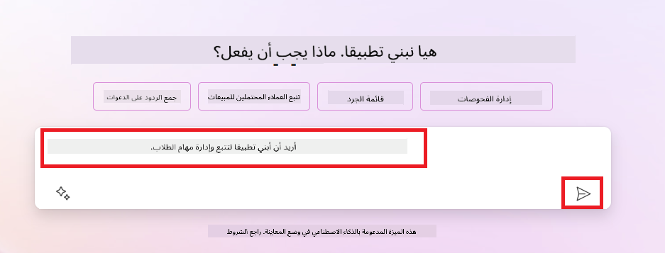
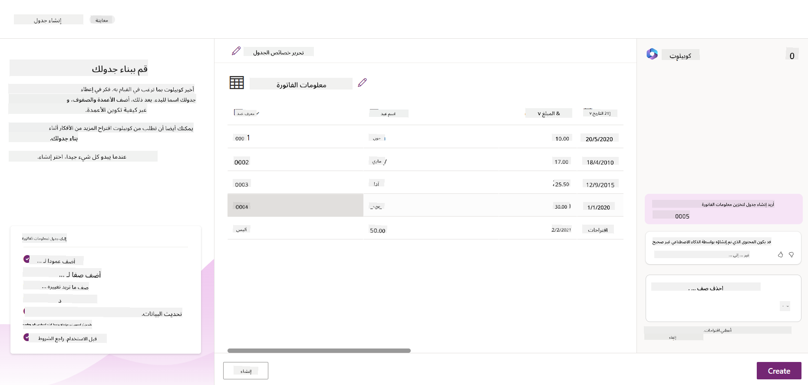
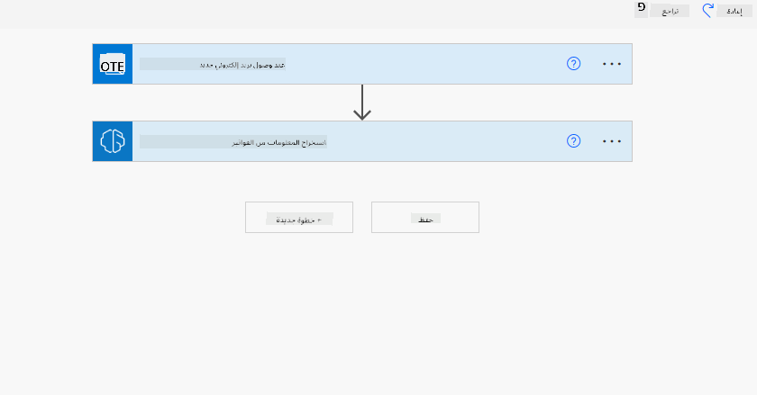

<!--
CO_OP_TRANSLATOR_METADATA:
{
  "original_hash": "846ac8e3b7dcfb697d3309fec05f0fea",
  "translation_date": "2025-10-17T12:53:10+00:00",
  "source_file": "10-building-low-code-ai-applications/README.md",
  "language_code": "ar"
}
-->
# بناء تطبيقات الذكاء الاصطناعي منخفضة الكود

> _(اضغط على الصورة أعلاه لمشاهدة فيديو الدرس)_

## المقدمة

بعد أن تعلمنا كيفية بناء تطبيقات توليد الصور، دعونا نتحدث عن البرمجة منخفضة الكود. يمكن استخدام الذكاء الاصطناعي التوليدي في مجموعة متنوعة من المجالات بما في ذلك البرمجة منخفضة الكود، ولكن ما هي البرمجة منخفضة الكود وكيف يمكننا إضافة الذكاء الاصطناعي إليها؟

أصبح بناء التطبيقات والحلول أسهل للمطورين التقليديين وغير المطورين من خلال استخدام منصات تطوير منخفضة الكود. تتيح هذه المنصات بناء التطبيقات والحلول باستخدام القليل من الكود أو بدون الحاجة إلى كتابة كود. يتم تحقيق ذلك من خلال توفير بيئة تطوير مرئية تتيح لك سحب وإفلات المكونات لبناء التطبيقات والحلول. هذا يتيح لك بناء التطبيقات والحلول بسرعة وبموارد أقل. في هذا الدرس، سنتعمق في كيفية استخدام البرمجة منخفضة الكود وكيفية تعزيز تطوير البرمجة منخفضة الكود باستخدام الذكاء الاصطناعي عبر منصة Power Platform.

توفر منصة Power Platform للشركات فرصة تمكين فرقها لبناء حلولها الخاصة من خلال بيئة برمجة منخفضة الكود أو بدون كود. هذه البيئة تساعد في تبسيط عملية بناء الحلول. باستخدام Power Platform، يمكن بناء الحلول في أيام أو أسابيع بدلاً من شهور أو سنوات. تتكون منصة Power Platform من خمسة منتجات رئيسية: Power Apps، Power Automate، Power BI، Power Pages و Copilot Studio.

يغطي هذا الدرس:

- مقدمة عن الذكاء الاصطناعي التوليدي في Power Platform
- مقدمة عن Copilot وكيفية استخدامه
- استخدام الذكاء الاصطناعي التوليدي لبناء التطبيقات والتدفقات في Power Platform
- فهم نماذج الذكاء الاصطناعي في Power Platform باستخدام AI Builder

## أهداف التعلم

بنهاية هذا الدرس، ستكون قادرًا على:

- فهم كيفية عمل Copilot في Power Platform.

- بناء تطبيق لتتبع مهام الطلاب لشركتنا الناشئة في مجال التعليم.

- بناء تدفق معالجة الفواتير باستخدام الذكاء الاصطناعي لاستخراج المعلومات من الفواتير.

- تطبيق أفضل الممارسات عند استخدام نموذج الذكاء الاصطناعي GPT لإنشاء النصوص.

الأدوات والتقنيات التي ستستخدمها في هذا الدرس هي:

- **Power Apps**، لتطوير تطبيق تتبع مهام الطلاب، والذي يوفر بيئة تطوير منخفضة الكود لبناء التطبيقات لتتبع وإدارة والتفاعل مع البيانات.

- **Dataverse**، لتخزين بيانات تطبيق تتبع مهام الطلاب حيث يوفر Dataverse منصة بيانات منخفضة الكود لتخزين بيانات التطبيق.

- **Power Automate**، لتطوير تدفق معالجة الفواتير حيث ستستخدم بيئة تطوير منخفضة الكود لبناء تدفقات عمل لأتمتة عملية معالجة الفواتير.

- **AI Builder**، لنموذج الذكاء الاصطناعي لمعالجة الفواتير حيث ستستخدم نماذج الذكاء الاصطناعي الجاهزة لمعالجة الفواتير لشركتنا الناشئة.

## الذكاء الاصطناعي التوليدي في Power Platform

تعزيز تطوير البرمجة منخفضة الكود والتطبيقات باستخدام الذكاء الاصطناعي التوليدي هو مجال تركيز رئيسي لمنصة Power Platform. الهدف هو تمكين الجميع من بناء تطبيقات، مواقع، لوحات معلومات وأتمتة العمليات باستخدام الذكاء الاصطناعي، _دون الحاجة إلى خبرة في علم البيانات_. يتم تحقيق هذا الهدف من خلال دمج الذكاء الاصطناعي التوليدي في تجربة تطوير البرمجة منخفضة الكود في Power Platform على شكل Copilot و AI Builder.

### كيف يعمل هذا؟

Copilot هو مساعد ذكاء اصطناعي يتيح لك بناء حلول Power Platform من خلال وصف متطلباتك في سلسلة من الخطوات الحوارية باستخدام اللغة الطبيعية. يمكنك على سبيل المثال توجيه مساعد الذكاء الاصطناعي لتحديد الحقول التي سيستخدمها تطبيقك وسيقوم بإنشاء التطبيق ونموذج البيانات الأساسي أو يمكنك تحديد كيفية إعداد تدفق في Power Automate.

يمكنك استخدام الوظائف المدعومة بـ Copilot كميزة في شاشات تطبيقك لتمكين المستخدمين من اكتشاف الأفكار من خلال التفاعلات الحوارية.

AI Builder هو قدرة ذكاء اصطناعي منخفضة الكود متاحة في Power Platform تتيح لك استخدام نماذج الذكاء الاصطناعي لمساعدتك في أتمتة العمليات وتوقع النتائج. باستخدام AI Builder يمكنك جلب الذكاء الاصطناعي إلى تطبيقاتك وتدفقاتك التي تتصل ببياناتك في Dataverse أو في مصادر البيانات السحابية المختلفة، مثل SharePoint، OneDrive أو Azure.

يتوفر Copilot في جميع منتجات Power Platform: Power Apps، Power Automate، Power BI، Power Pages و Power Virtual Agents. يتوفر AI Builder في Power Apps و Power Automate. في هذا الدرس، سنركز على كيفية استخدام Copilot و AI Builder في Power Apps و Power Automate لبناء حل لشركتنا الناشئة في مجال التعليم.

### Copilot في Power Apps

كجزء من Power Platform، يوفر Power Apps بيئة تطوير منخفضة الكود لبناء التطبيقات لتتبع وإدارة والتفاعل مع البيانات. إنها مجموعة من خدمات تطوير التطبيقات مع منصة بيانات قابلة للتوسع والقدرة على الاتصال بالخدمات السحابية والبيانات المحلية. يتيح Power Apps بناء تطبيقات تعمل على المتصفحات، الأجهزة اللوحية، والهواتف، ويمكن مشاركتها مع زملاء العمل. يسهل Power Apps على المستخدمين الدخول في تطوير التطبيقات بواجهة بسيطة، بحيث يمكن لكل مستخدم أعمال أو مطور محترف بناء تطبيقات مخصصة. تجربة تطوير التطبيقات يتم تعزيزها أيضًا بالذكاء الاصطناعي التوليدي من خلال Copilot.

ميزة مساعد الذكاء الاصطناعي Copilot في Power Apps تتيح لك وصف نوع التطبيق الذي تحتاجه والمعلومات التي تريد أن يتتبعها تطبيقك، يجمعها أو يعرضها. يقوم Copilot بعد ذلك بإنشاء تطبيق Canvas استجابةً لوصفك. يمكنك بعد ذلك تخصيص التطبيق لتلبية احتياجاتك. كما يقوم مساعد الذكاء الاصطناعي Copilot بإنشاء واقتراح جدول Dataverse مع الحقول التي تحتاجها لتخزين البيانات التي تريد تتبعها وبعض البيانات النموذجية. سنتعرف على ماهية Dataverse وكيف يمكنك استخدامه في Power Apps في هذا الدرس لاحقًا. يمكنك بعد ذلك تخصيص الجدول لتلبية احتياجاتك باستخدام ميزة مساعد الذكاء الاصطناعي Copilot من خلال خطوات حوارية. هذه الميزة متاحة مباشرة من شاشة البداية في Power Apps.

### Copilot في Power Automate

كجزء من Power Platform، يتيح Power Automate للمستخدمين إنشاء تدفقات عمل مؤتمتة بين التطبيقات والخدمات. يساعد في أتمتة العمليات التجارية المتكررة مثل التواصل، جمع البيانات، والموافقة على القرارات. واجهته البسيطة تسمح للمستخدمين من جميع مستويات الكفاءة التقنية (من المبتدئين إلى المطورين المحترفين) بأتمتة مهام العمل. تجربة تطوير التدفقات يتم تعزيزها أيضًا بالذكاء الاصطناعي التوليدي من خلال Copilot.

ميزة مساعد الذكاء الاصطناعي Copilot في Power Automate تتيح لك وصف نوع التدفق الذي تحتاجه والإجراءات التي تريد أن يقوم بها تدفقك. يقوم Copilot بعد ذلك بإنشاء تدفق بناءً على وصفك. يمكنك بعد ذلك تخصيص التدفق لتلبية احتياجاتك. كما يقوم مساعد الذكاء الاصطناعي Copilot بإنشاء واقتراح الإجراءات التي تحتاجها لتنفيذ المهمة التي تريد أتمتتها. سنتعرف على ماهية التدفقات وكيف يمكنك استخدامها في Power Automate في هذا الدرس لاحقًا. يمكنك بعد ذلك تخصيص الإجراءات لتلبية احتياجاتك باستخدام ميزة مساعد الذكاء الاصطناعي Copilot من خلال خطوات حوارية. هذه الميزة متاحة مباشرة من شاشة البداية في Power Automate.

## المهمة: إدارة مهام الطلاب والفواتير لشركتنا الناشئة باستخدام Copilot

تقدم شركتنا الناشئة دورات تعليمية عبر الإنترنت للطلاب. لقد نمت الشركة بسرعة وتواجه الآن صعوبة في مواكبة الطلب على دوراتها. قامت الشركة بتوظيفك كمطور لمنصة Power Platform لمساعدتها في بناء حل منخفض الكود لمساعدتها في إدارة مهام الطلاب والفواتير. يجب أن يكون الحل قادرًا على مساعدتهم في تتبع وإدارة مهام الطلاب من خلال تطبيق وأتمتة عملية معالجة الفواتير من خلال تدفق عمل. طُلب منك استخدام الذكاء الاصطناعي التوليدي لتطوير الحل.

عند البدء باستخدام Copilot، يمكنك استخدام [مكتبة Power Platform Copilot Prompt](https://github.com/pnp/powerplatform-prompts?WT.mc_id=academic-109639-somelezediko) للبدء في استخدام التعليمات. تحتوي هذه المكتبة على قائمة بالتعليمات التي يمكنك استخدامها لبناء التطبيقات والتدفقات باستخدام Copilot. يمكنك أيضًا استخدام التعليمات في المكتبة للحصول على فكرة عن كيفية وصف متطلباتك لـ Copilot.

### بناء تطبيق تتبع مهام الطلاب لشركتنا الناشئة

يعاني المعلمون في شركتنا الناشئة من صعوبة في تتبع مهام الطلاب. كانوا يستخدمون جدول بيانات لتتبع المهام ولكن أصبح من الصعب إدارته مع زيادة عدد الطلاب. طلبوا منك بناء تطبيق يساعدهم في تتبع وإدارة مهام الطلاب. يجب أن يتيح التطبيق لهم إضافة مهام جديدة، عرض المهام، تحديث المهام وحذف المهام. يجب أن يتيح التطبيق أيضًا للمعلمين والطلاب عرض المهام التي تم تقييمها والتي لم يتم تقييمها.

ستقوم ببناء التطبيق باستخدام Copilot في Power Apps باتباع الخطوات التالية:

1. انتقل إلى شاشة البداية في [Power Apps](https://make.powerapps.com?WT.mc_id=academic-105485-koreyst).

1. استخدم منطقة النص في شاشة البداية لوصف التطبيق الذي تريد بناءه. على سبيل المثال، **_أريد بناء تطبيق لتتبع وإدارة مهام الطلاب_**. اضغط على زر **إرسال** لإرسال التعليمات إلى مساعد الذكاء الاصطناعي Copilot.

1. سيقترح مساعد الذكاء الاصطناعي Copilot جدول Dataverse مع الحقول التي تحتاجها لتخزين البيانات التي تريد تتبعها وبعض البيانات النموذجية. يمكنك بعد ذلك تخصيص الجدول لتلبية احتياجاتك باستخدام ميزة مساعد الذكاء الاصطناعي Copilot من خلال خطوات حوارية.

   > **هام**: Dataverse هو منصة البيانات الأساسية لـ Power Platform. إنها منصة بيانات منخفضة الكود لتخزين بيانات التطبيق. إنها خدمة مُدارة بالكامل تخزن البيانات بأمان في سحابة Microsoft ويتم توفيرها داخل بيئة Power Platform الخاصة بك. تأتي مع قدرات حوكمة بيانات مدمجة، مثل تصنيف البيانات، تتبع البيانات، التحكم الدقيق في الوصول، والمزيد. يمكنك معرفة المزيد عن Dataverse [هنا](https://docs.microsoft.com/powerapps/maker/data-platform/data-platform-intro?WT.mc_id=academic-109639-somelezediko).

   

1. يرغب المعلمون في إرسال رسائل بريد إلكتروني إلى الطلاب الذين قدموا مهامهم لإبقائهم على اطلاع على تقدم مهامهم. يمكنك استخدام Copilot لإضافة حقل جديد إلى الجدول لتخزين بريد الطالب الإلكتروني. على سبيل المثال، يمكنك استخدام التعليمات التالية لإضافة حقل جديد إلى الجدول: **_أريد إضافة عمود لتخزين بريد الطالب الإلكتروني_**. اضغط على زر **إرسال** لإرسال التعليمات إلى مساعد الذكاء الاصطناعي Copilot.

1. سيقوم مساعد الذكاء الاصطناعي Copilot بإنشاء حقل جديد ويمكنك بعد ذلك تخصيص الحقل لتلبية احتياجاتك.

1. بمجرد الانتهاء من الجدول، اضغط على زر **إنشاء التطبيق** لإنشاء التطبيق.

1. سيقوم مساعد الذكاء الاصطناعي Copilot بإنشاء تطبيق Canvas استجابةً لوصفك. يمكنك بعد ذلك تخصيص التطبيق لتلبية احتياجاتك.

1. لكي يتمكن المعلمون من إرسال رسائل بريد إلكتروني للطلاب، يمكنك استخدام Copilot لإضافة شاشة جديدة إلى التطبيق. على سبيل المثال، يمكنك استخدام التعليمات التالية لإضافة شاشة جديدة إلى التطبيق: **_أريد إضافة شاشة لإرسال رسائل بريد إلكتروني للطلاب_**. اضغط على زر **إرسال** لإرسال التعليمات إلى مساعد الذكاء الاصطناعي Copilot.

1. سيقوم مساعد الذكاء الاصطناعي Copilot بإنشاء شاشة جديدة ويمكنك بعد ذلك تخصيص الشاشة لتلبية احتياجاتك.

1. بمجرد الانتهاء من التطبيق، اضغط على زر **حفظ** لحفظ التطبيق.

1. لمشاركة التطبيق مع المعلمين، اضغط على زر **مشاركة** ثم اضغط على زر **مشاركة** مرة أخرى. يمكنك بعد ذلك مشاركة التطبيق مع المعلمين عن طريق إدخال عناوين بريدهم الإلكتروني.

> **واجبك**: التطبيق الذي قمت ببنائه هو بداية جيدة ولكنه يمكن تحسينه. مع ميزة البريد الإلكتروني، يمكن للمعلمين فقط إرسال رسائل بريد إلكتروني للطلاب يدويًا عن طريق كتابة بريدهم الإلكتروني. هل يمكنك استخدام Copilot لبناء أتمتة تمكن المعلمين من إرسال رسائل بريد إلكتروني للطلاب تلقائيًا عند تقديم مهامهم؟ تلميحك هو أنه مع التعليمات الصحيحة يمكنك استخدام Copilot في Power Automate لبناء هذا.

### بناء جدول معلومات الفواتير لشركتنا الناشئة

يعاني فريق المالية في شركتنا الناشئة من صعوبة في تتبع الفواتير. كانوا يستخدمون جدول بيانات لتتبع الفواتير ولكن أصبح من الصعب إدارته مع زيادة عدد الفواتير. طلبوا منك بناء جدول يساعدهم في تخزين، تتبع وإدارة معلومات الفواتير التي يتلقونها. يجب استخدام الجدول لبناء أتمتة تقوم باستخراج جميع معلومات الفواتير وتخزينها في الجدول. يجب أن يتيح الجدول أيضًا لفريق المالية عرض الفواتير التي تم دفعها والتي لم يتم دفعها.

توفر منصة Power Platform منصة بيانات أساسية تسمى Dataverse تمكنك من تخزين البيانات لتطبيقاتك وحلولك. يوفر Dataverse منصة بيانات منخفضة الكود لتخزين بيانات التطبيق. إنها خدمة مُدارة بالكامل تخزن البيانات بأمان في سحابة Microsoft ويتم توفيرها داخل بيئة Power Platform الخاصة بك. تأتي مع قدرات حوكمة بيانات مدمجة، مثل تصنيف البيانات، تتبع البيانات، التحكم الدقيق في الوصول، والمزيد. يمكنك معرفة المزيد [عن Dataverse هنا](https://docs.microsoft.com/powerapps/maker/data-platform/data-platform-intro?WT.mc_id=academic-109639-somelezediko).
لماذا يجب أن نستخدم Dataverse لشركتنا الناشئة؟ توفر الجداول القياسية والمخصصة داخل Dataverse خيار تخزين آمن وقائم على السحابة لبياناتك. تتيح لك الجداول تخزين أنواع مختلفة من البيانات، تمامًا كما قد تستخدم أوراق عمل متعددة في ملف Excel واحد. يمكنك استخدام الجداول لتخزين البيانات التي تتعلق باحتياجات مؤسستك أو عملك. بعض الفوائد التي ستحصل عليها شركتنا الناشئة من استخدام Dataverse تشمل، ولكن لا تقتصر على:

- **سهولة الإدارة**: يتم تخزين البيانات والبيانات الوصفية في السحابة، لذا لا داعي للقلق بشأن تفاصيل كيفية تخزينها أو إدارتها. يمكنك التركيز على بناء تطبيقاتك وحلولك.

- **الأمان**: يوفر Dataverse خيار تخزين آمن وقائم على السحابة لبياناتك. يمكنك التحكم في من يمكنه الوصول إلى البيانات في الجداول وكيف يمكنهم الوصول إليها باستخدام الأمان القائم على الأدوار.

- **بيانات وصفية غنية**: يتم استخدام أنواع البيانات والعلاقات مباشرة داخل Power Apps.

- **المنطق والتحقق**: يمكنك استخدام قواعد العمل، الحقول المحسوبة، وقواعد التحقق لتطبيق منطق العمل والحفاظ على دقة البيانات.

الآن بعد أن تعرفت على Dataverse ولماذا يجب استخدامه، دعنا نلقي نظرة على كيفية استخدام Copilot لإنشاء جدول في Dataverse لتلبية متطلبات فريق المالية لدينا.

> **ملاحظة**: ستستخدم هذا الجدول في القسم التالي لبناء أتمتة ستقوم باستخراج جميع معلومات الفواتير وتخزينها في الجدول.

لإنشاء جدول في Dataverse باستخدام Copilot، اتبع الخطوات التالية:

1. انتقل إلى الشاشة الرئيسية لـ [Power Apps](https://make.powerapps.com?WT.mc_id=academic-105485-koreyst).

2. في شريط التنقل الأيسر، اختر **الجداول** ثم انقر على **وصف الجدول الجديد**.

3. في شاشة **وصف الجدول الجديد**، استخدم منطقة النص لوصف الجدول الذي تريد إنشاؤه. على سبيل المثال، **_أريد إنشاء جدول لتخزين معلومات الفواتير_**. انقر على زر **إرسال** لإرسال الطلب إلى AI Copilot.

4. سيقترح AI Copilot جدول Dataverse مع الحقول التي تحتاجها لتخزين البيانات التي تريد تتبعها وبعض البيانات النموذجية. يمكنك بعد ذلك تخصيص الجدول لتلبية احتياجاتك باستخدام ميزة مساعد AI Copilot من خلال خطوات محادثة.

5. يريد فريق المالية إرسال بريد إلكتروني إلى المورد لتحديثه بحالة فاتورته الحالية. يمكنك استخدام Copilot لإضافة حقل جديد إلى الجدول لتخزين بريد المورد الإلكتروني. على سبيل المثال، يمكنك استخدام الطلب التالي لإضافة حقل جديد إلى الجدول: **_أريد إضافة عمود لتخزين بريد المورد الإلكتروني_**. انقر على زر **إرسال** لإرسال الطلب إلى AI Copilot.

6. سيقوم AI Copilot بإنشاء حقل جديد ويمكنك بعد ذلك تخصيص الحقل لتلبية احتياجاتك.

7. بمجرد الانتهاء من الجدول، انقر على زر **إنشاء** لإنشاء الجدول.

## نماذج الذكاء الاصطناعي في Power Platform مع AI Builder

AI Builder هو قدرة ذكاء اصطناعي منخفضة الكود متاحة في Power Platform تمكنك من استخدام نماذج الذكاء الاصطناعي لمساعدتك في أتمتة العمليات وتوقع النتائج. مع AI Builder يمكنك إدخال الذكاء الاصطناعي إلى تطبيقاتك وتدفقاتك التي تتصل ببياناتك في Dataverse أو في مصادر بيانات السحابة المختلفة، مثل SharePoint، OneDrive أو Azure.

## نماذج الذكاء الاصطناعي الجاهزة مقابل النماذج المخصصة

يوفر AI Builder نوعين من نماذج الذكاء الاصطناعي: نماذج جاهزة ونماذج مخصصة. النماذج الجاهزة هي نماذج ذكاء اصطناعي جاهزة للاستخدام تم تدريبها بواسطة Microsoft ومتاحة في Power Platform. تساعدك هذه النماذج في إضافة الذكاء إلى تطبيقاتك وتدفقاتك دون الحاجة إلى جمع البيانات ثم بناء، تدريب ونشر نماذجك الخاصة. يمكنك استخدام هذه النماذج لأتمتة العمليات وتوقع النتائج.

بعض نماذج الذكاء الاصطناعي الجاهزة المتاحة في Power Platform تشمل:

- **استخراج العبارات الرئيسية**: يستخرج هذا النموذج العبارات الرئيسية من النص.
- **كشف اللغة**: يكشف هذا النموذج لغة النص.
- **تحليل المشاعر**: يكشف هذا النموذج المشاعر الإيجابية، السلبية، المحايدة أو المختلطة في النص.
- **قارئ بطاقات الأعمال**: يستخرج هذا النموذج المعلومات من بطاقات الأعمال.
- **التعرف على النصوص**: يستخرج هذا النموذج النصوص من الصور.
- **كشف الكائنات**: يكشف هذا النموذج الكائنات ويستخرجها من الصور.
- **معالجة المستندات**: يستخرج هذا النموذج المعلومات من النماذج.
- **معالجة الفواتير**: يستخرج هذا النموذج المعلومات من الفواتير.

مع النماذج المخصصة يمكنك إدخال نموذجك الخاص إلى AI Builder بحيث يمكنه العمل مثل أي نموذج مخصص في AI Builder، مما يتيح لك تدريب النموذج باستخدام بياناتك الخاصة. يمكنك استخدام هذه النماذج لأتمتة العمليات وتوقع النتائج في كل من Power Apps وPower Automate. عند استخدام نموذجك الخاص، هناك قيود تنطبق. اقرأ المزيد عن هذه [القيود](https://learn.microsoft.com/ai-builder/byo-model#limitations?WT.mc_id=academic-105485-koreyst).

## المهمة رقم 2 - بناء تدفق معالجة الفواتير لشركتنا الناشئة

يواجه فريق المالية صعوبة في معالجة الفواتير. كانوا يستخدمون جدول بيانات لتتبع الفواتير ولكن أصبح من الصعب إدارته مع زيادة عدد الفواتير. طلبوا منك بناء سير عمل يساعدهم في معالجة الفواتير باستخدام الذكاء الاصطناعي. يجب أن يمكن سير العمل من استخراج المعلومات من الفواتير وتخزين المعلومات في جدول Dataverse. كما يجب أن يمكنهم من إرسال بريد إلكتروني إلى فريق المالية بالمعلومات المستخرجة.

الآن بعد أن تعرفت على AI Builder ولماذا يجب استخدامه، دعنا نلقي نظرة على كيفية استخدام نموذج معالجة الفواتير في AI Builder، الذي تناولناه سابقًا، لبناء سير عمل يساعد فريق المالية في معالجة الفواتير.

لبناء سير عمل يساعد فريق المالية في معالجة الفواتير باستخدام نموذج معالجة الفواتير في AI Builder، اتبع الخطوات التالية:

1. انتقل إلى الشاشة الرئيسية لـ [Power Automate](https://make.powerautomate.com?WT.mc_id=academic-105485-koreyst).

2. استخدم منطقة النص في الشاشة الرئيسية لوصف سير العمل الذي تريد بناءه. على سبيل المثال، **_معالجة فاتورة عند وصولها إلى صندوق البريد الخاص بي_**. انقر على زر **إرسال** لإرسال الطلب إلى AI Copilot.

   

3. سيقترح AI Copilot الإجراءات التي تحتاجها لأداء المهمة التي تريد أتمتتها. يمكنك النقر على زر **التالي** للانتقال إلى الخطوات التالية.

4. في الخطوة التالية، سيطلب منك Power Automate إعداد الاتصالات المطلوبة للتدفق. بمجرد الانتهاء، انقر على زر **إنشاء تدفق** لإنشاء التدفق.

5. سيقوم AI Copilot بإنشاء تدفق ويمكنك بعد ذلك تخصيص التدفق لتلبية احتياجاتك.

6. قم بتحديث مشغل التدفق وحدد **المجلد** للمجلد الذي سيتم تخزين الفواتير فيه. على سبيل المثال، يمكنك تعيين المجلد إلى **صندوق الوارد**. انقر على **إظهار الخيارات المتقدمة** وقم بتعيين **فقط مع المرفقات** إلى **نعم**. سيضمن ذلك تشغيل التدفق فقط عند استلام بريد إلكتروني مع مرفق في المجلد.

7. قم بإزالة الإجراءات التالية من التدفق: **HTML إلى نص**، **تكوين**، **تكوين 2**، **تكوين 3** و**تكوين 4** لأنك لن تستخدمها.

8. قم بإزالة إجراء **الشرط** من التدفق لأنك لن تستخدمه. يجب أن يبدو كما في لقطة الشاشة التالية:

   

9. انقر على زر **إضافة إجراء** وابحث عن **Dataverse**. اختر إجراء **إضافة صف جديد**.

10. في إجراء **استخراج المعلومات من الفواتير**، قم بتحديث **ملف الفاتورة** للإشارة إلى **محتوى المرفق** من البريد الإلكتروني. سيضمن ذلك أن التدفق يستخرج المعلومات من مرفق الفاتورة.

11. اختر الجدول الذي أنشأته سابقًا. على سبيل المثال، يمكنك اختيار جدول **معلومات الفاتورة**. اختر المحتوى الديناميكي من الإجراء السابق لملء الحقول التالية:

    - المعرف
    - المبلغ
    - التاريخ
    - الاسم
    - الحالة - قم بتعيين **الحالة** إلى **قيد الانتظار**.
    - بريد المورد الإلكتروني - استخدم المحتوى الديناميكي **من** من مشغل **عند وصول بريد إلكتروني جديد**.

    

12. بمجرد الانتهاء من التدفق، انقر على زر **حفظ** لحفظ التدفق. يمكنك بعد ذلك اختبار التدفق عن طريق إرسال بريد إلكتروني مع فاتورة إلى المجلد الذي حددته في المشغل.

> **واجبك**: التدفق الذي قمت ببنائه هو بداية جيدة، الآن تحتاج إلى التفكير في كيفية بناء أتمتة تمكن فريق المالية من إرسال بريد إلكتروني إلى المورد لتحديثه بحالة فاتورته الحالية. تلميحك: يجب أن يعمل التدفق عند تغيير حالة الفاتورة.

## استخدام نموذج ذكاء اصطناعي لتوليد النصوص في Power Automate

يتيح نموذج إنشاء النصوص باستخدام GPT في AI Builder إمكانية توليد النصوص بناءً على طلب وهو مدعوم من خدمة Microsoft Azure OpenAI. مع هذه القدرة، يمكنك دمج تقنية GPT (Generative Pre-Trained Transformer) في تطبيقاتك وتدفقاتك لبناء مجموعة متنوعة من التدفقات الآلية والتطبيقات المفيدة.

تخضع نماذج GPT لتدريب مكثف على كميات هائلة من البيانات، مما يمكنها من إنتاج نصوص تشبه اللغة البشرية بشكل كبير عند تقديم طلب. عند دمجها مع أتمتة سير العمل، يمكن استغلال نماذج الذكاء الاصطناعي مثل GPT لتبسيط وأتمتة مجموعة واسعة من المهام.

على سبيل المثال، يمكنك بناء تدفقات لتوليد النصوص تلقائيًا لمجموعة متنوعة من الاستخدامات، مثل: مسودات البريد الإلكتروني، وصف المنتجات، والمزيد. يمكنك أيضًا استخدام النموذج لتوليد النصوص لتطبيقات متنوعة، مثل روبوتات الدردشة وتطبيقات خدمة العملاء التي تمكن وكلاء خدمة العملاء من الرد بفعالية وكفاءة على استفسارات العملاء.

لتعلم كيفية استخدام هذا النموذج في Power Automate، قم بمراجعة [إضافة الذكاء باستخدام AI Builder وGPT](https://learn.microsoft.com/training/modules/ai-builder-text-generation/?WT.mc_id=academic-109639-somelezediko) الوحدة.

## عمل رائع! استمر في التعلم

بعد إكمال هذا الدرس، تحقق من [مجموعة تعلم الذكاء الاصطناعي التوليدي](https://aka.ms/genai-collection?WT.mc_id=academic-105485-koreyst) لمواصلة تطوير معرفتك بالذكاء الاصطناعي التوليدي!

انتقل إلى الدرس 11 حيث سنلقي نظرة على كيفية [دمج الذكاء الاصطناعي التوليدي مع استدعاء الوظائف](../11-integrating-with-function-calling/README.md?WT.mc_id=academic-105485-koreyst)!

---

**إخلاء المسؤولية**:  
تم ترجمة هذا المستند باستخدام خدمة الترجمة بالذكاء الاصطناعي [Co-op Translator](https://github.com/Azure/co-op-translator). بينما نسعى لتحقيق الدقة، يرجى العلم أن الترجمات الآلية قد تحتوي على أخطاء أو عدم دقة. يجب اعتبار المستند الأصلي بلغته الأصلية المصدر الرسمي. للحصول على معلومات حاسمة، يُوصى بالترجمة البشرية الاحترافية. نحن غير مسؤولين عن أي سوء فهم أو تفسيرات خاطئة ناتجة عن استخدام هذه الترجمة.