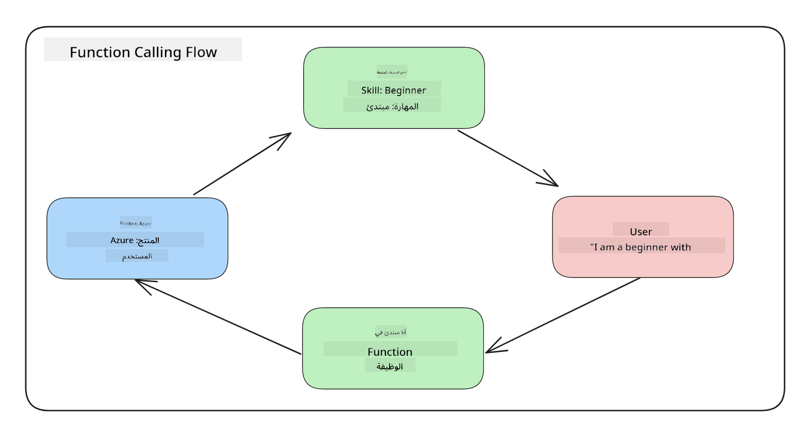
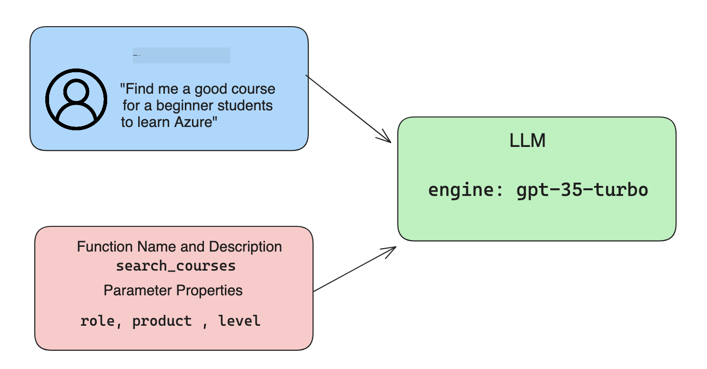

<!--
CO_OP_TRANSLATOR_METADATA:
{
  "original_hash": "f6f84f9ef2d066cd25850cab93580a50",
  "translation_date": "2025-10-17T12:53:52+00:00",
  "source_file": "11-integrating-with-function-calling/README.md",
  "language_code": "ar"
}
-->
# دمج مع استدعاء الوظائف

[](https://youtu.be/DgUdCLX8qYQ?si=f1ouQU5HQx6F8Gl2)

لقد تعلمت الكثير حتى الآن في الدروس السابقة. ومع ذلك، يمكننا تحسين الأمور أكثر. بعض الأشياء التي يمكننا معالجتها هي كيفية الحصول على تنسيق استجابة أكثر اتساقًا لتسهيل العمل مع الاستجابة في المراحل اللاحقة. أيضًا، قد نرغب في إضافة بيانات من مصادر أخرى لتعزيز تطبيقنا بشكل أكبر.

المشاكل المذكورة أعلاه هي ما يسعى هذا الفصل لمعالجته.

## المقدمة

سيتناول هذا الدرس:

- شرح ما هو استدعاء الوظائف وحالات استخدامه.
- إنشاء استدعاء وظيفة باستخدام Azure OpenAI.
- كيفية دمج استدعاء الوظيفة في تطبيق.

## أهداف التعلم

بنهاية هذا الدرس، ستكون قادرًا على:

- شرح الغرض من استخدام استدعاء الوظائف.
- إعداد استدعاء وظيفة باستخدام خدمة Azure OpenAI.
- تصميم استدعاءات وظائف فعالة لحالة استخدام تطبيقك.

## السيناريو: تحسين روبوت الدردشة باستخدام الوظائف

في هذا الدرس، نريد بناء ميزة لشركة ناشئة في مجال التعليم تسمح للمستخدمين باستخدام روبوت دردشة للعثور على دورات تقنية. سنوصي بالدورات التي تناسب مستوى مهاراتهم، دورهم الحالي، والتكنولوجيا التي يهتمون بها.

لإكمال هذا السيناريو، سنستخدم مزيجًا من:

- `Azure OpenAI` لإنشاء تجربة دردشة للمستخدم.
- `Microsoft Learn Catalog API` لمساعدة المستخدمين في العثور على الدورات بناءً على طلباتهم.
- `استدعاء الوظائف` لأخذ استفسار المستخدم وإرساله إلى وظيفة لإجراء طلب API.

لنبدأ بالنظر في سبب رغبتنا في استخدام استدعاء الوظائف في المقام الأول:

## لماذا استدعاء الوظائف؟

قبل استدعاء الوظائف، كانت الاستجابات من LLM غير منظمة وغير متسقة. كان على المطورين كتابة كود تحقق معقد للتأكد من قدرتهم على التعامل مع كل تنوع في الاستجابة. لم يكن بإمكان المستخدمين الحصول على إجابات مثل "ما هو الطقس الحالي في ستوكهولم؟". وذلك لأن النماذج كانت محدودة بالوقت الذي تم تدريب البيانات فيه.

استدعاء الوظائف هو ميزة في خدمة Azure OpenAI للتغلب على القيود التالية:

- **تنسيق استجابة متسق**. إذا تمكنا من التحكم بشكل أفضل في تنسيق الاستجابة، يمكننا دمج الاستجابة بسهولة أكبر في الأنظمة الأخرى.
- **البيانات الخارجية**. القدرة على استخدام بيانات من مصادر أخرى للتطبيق في سياق الدردشة.

## توضيح المشكلة من خلال سيناريو

> نوصي باستخدام [المفكرة المرفقة](./python/aoai-assignment.ipynb?WT.mc_id=academic-105485-koreyst) إذا كنت ترغب في تشغيل السيناريو أدناه. يمكنك أيضًا القراءة فقط حيث نحاول توضيح مشكلة يمكن للوظائف المساعدة في معالجتها.

لنلقِ نظرة على المثال الذي يوضح مشكلة تنسيق الاستجابة:

لنفترض أننا نريد إنشاء قاعدة بيانات لبيانات الطلاب حتى نتمكن من اقتراح الدورة المناسبة لهم. أدناه لدينا وصفان للطلاب متشابهان جدًا في البيانات التي يحتويان عليها.

1. إنشاء اتصال بمورد Azure OpenAI الخاص بنا:

   ```python
   import os
   import json
   from openai import AzureOpenAI
   from dotenv import load_dotenv
   load_dotenv()

   client = AzureOpenAI(
   api_key=os.environ['AZURE_OPENAI_API_KEY'],  # this is also the default, it can be omitted
   api_version = "2023-07-01-preview"
   )

   deployment=os.environ['AZURE_OPENAI_DEPLOYMENT']
   ```

   أدناه يوجد بعض كود Python لتكوين اتصالنا بـ Azure OpenAI حيث نحدد `api_type`، `api_base`، `api_version` و `api_key`.

1. إنشاء وصفين للطلاب باستخدام المتغيرين `student_1_description` و `student_2_description`.

   ```python
   student_1_description="Emily Johnson is a sophomore majoring in computer science at Duke University. She has a 3.7 GPA. Emily is an active member of the university's Chess Club and Debate Team. She hopes to pursue a career in software engineering after graduating."

   student_2_description = "Michael Lee is a sophomore majoring in computer science at Stanford University. He has a 3.8 GPA. Michael is known for his programming skills and is an active member of the university's Robotics Club. He hopes to pursue a career in artificial intelligence after finishing his studies."
   ```

   نريد إرسال أوصاف الطلاب أعلاه إلى LLM لتحليل البيانات. يمكن استخدام هذه البيانات لاحقًا في تطبيقنا وإرسالها إلى API أو تخزينها في قاعدة بيانات.

1. لنقم بإنشاء مطالبات متطابقة حيث نوجه LLM حول المعلومات التي نهتم بها:

   ```python
   prompt1 = f'''
   Please extract the following information from the given text and return it as a JSON object:

   name
   major
   school
   grades
   club

   This is the body of text to extract the information from:
   {student_1_description}
   '''

   prompt2 = f'''
   Please extract the following information from the given text and return it as a JSON object:

   name
   major
   school
   grades
   club

   This is the body of text to extract the information from:
   {student_2_description}
   '''
   ```

   توجه المطالبات أعلاه LLM لاستخراج المعلومات وإرجاع الاستجابة بتنسيق JSON.

1. بعد إعداد المطالبات والاتصال بـ Azure OpenAI، سنرسل الآن المطالبات إلى LLM باستخدام `openai.ChatCompletion`. نخزن المطالبة في متغير `messages` ونحدد الدور كـ `user`. هذا لمحاكاة رسالة من مستخدم يتم كتابتها إلى روبوت دردشة.

   ```python
   # response from prompt one
   openai_response1 = client.chat.completions.create(
   model=deployment,
   messages = [{'role': 'user', 'content': prompt1}]
   )
   openai_response1.choices[0].message.content

   # response from prompt two
   openai_response2 = client.chat.completions.create(
   model=deployment,
   messages = [{'role': 'user', 'content': prompt2}]
   )
   openai_response2.choices[0].message.content
   ```

الآن يمكننا إرسال كلا الطلبين إلى LLM وفحص الاستجابة التي نتلقاها من خلال العثور عليها مثل هذا `openai_response1['choices'][0]['message']['content']`.

1. أخيرًا، يمكننا تحويل الاستجابة إلى تنسيق JSON عن طريق استدعاء `json.loads`:

   ```python
   # Loading the response as a JSON object
   json_response1 = json.loads(openai_response1.choices[0].message.content)
   json_response1
   ```

   الاستجابة 1:

   ```json
   {
     "name": "Emily Johnson",
     "major": "computer science",
     "school": "Duke University",
     "grades": "3.7",
     "club": "Chess Club"
   }
   ```

   الاستجابة 2:

   ```json
   {
     "name": "Michael Lee",
     "major": "computer science",
     "school": "Stanford University",
     "grades": "3.8 GPA",
     "club": "Robotics Club"
   }
   ```

   على الرغم من أن المطالبات هي نفسها والأوصاف متشابهة، نرى قيم خاصية `Grades` بتنسيقات مختلفة، حيث يمكننا أحيانًا الحصول على التنسيق `3.7` أو `3.7 GPA` على سبيل المثال.

   هذه النتيجة لأن LLM يأخذ بيانات غير منظمة على شكل المطالبة المكتوبة ويعيد أيضًا بيانات غير منظمة. نحتاج إلى الحصول على تنسيق منظم حتى نعرف ما يمكن توقعه عند تخزين أو استخدام هذه البيانات.

إذن كيف نحل مشكلة التنسيق؟ باستخدام استدعاء الوظائف، يمكننا التأكد من أننا نتلقى بيانات منظمة. عند استخدام استدعاء الوظائف، لا يقوم LLM فعليًا باستدعاء أو تشغيل أي وظائف. بدلاً من ذلك، نقوم بإنشاء هيكل لـ LLM ليتبعه في استجاباته. ثم نستخدم تلك الاستجابات المنظمة لمعرفة الوظيفة التي يجب تشغيلها في تطبيقاتنا.



يمكننا بعد ذلك أخذ ما يتم إرجاعه من الوظيفة وإرساله مرة أخرى إلى LLM. سيستجيب LLM بعد ذلك باستخدام اللغة الطبيعية للإجابة على استفسار المستخدم.

## حالات استخدام استدعاء الوظائف

هناك العديد من حالات الاستخدام المختلفة حيث يمكن لاستدعاء الوظائف تحسين تطبيقك مثل:

- **استدعاء الأدوات الخارجية**. روبوتات الدردشة رائعة في تقديم إجابات على أسئلة المستخدمين. باستخدام استدعاء الوظائف، يمكن لروبوتات الدردشة استخدام رسائل المستخدمين لإكمال مهام معينة. على سبيل المثال، يمكن للطالب أن يطلب من روبوت الدردشة "إرسال بريد إلكتروني إلى مدرسي يقول إنني بحاجة إلى مزيد من المساعدة في هذا الموضوع". يمكن أن يقوم ذلك باستدعاء وظيفة `send_email(to: string, body: string)`.

- **إنشاء طلبات API أو قاعدة بيانات**. يمكن للمستخدمين العثور على معلومات باستخدام اللغة الطبيعية التي يتم تحويلها إلى طلبات API أو استعلامات مهيكلة. مثال على ذلك يمكن أن يكون مدرسًا يطلب "من هم الطلاب الذين أكملوا الواجب الأخير" والذي يمكن أن يستدعي وظيفة باسم `get_completed(student_name: string, assignment: int, current_status: string)`.

- **إنشاء بيانات منظمة**. يمكن للمستخدمين أخذ نص أو ملف CSV واستخدام LLM لاستخراج معلومات مهمة منه. على سبيل المثال، يمكن للطالب تحويل مقال ويكيبيديا حول اتفاقيات السلام لإنشاء بطاقات تعليمية بالذكاء الاصطناعي. يمكن القيام بذلك باستخدام وظيفة تسمى `get_important_facts(agreement_name: string, date_signed: string, parties_involved: list)`.

## إنشاء أول استدعاء وظيفة

عملية إنشاء استدعاء وظيفة تشمل 3 خطوات رئيسية:

1. **استدعاء** API إكمال الدردشة مع قائمة وظائفك ورسالة المستخدم.
2. **قراءة** استجابة النموذج لتنفيذ إجراء مثل تنفيذ وظيفة أو طلب API.
3. **إجراء** مكالمة أخرى إلى API إكمال الدردشة مع الاستجابة من وظيفتك لاستخدام تلك المعلومات لإنشاء استجابة للمستخدم.



### الخطوة 1 - إنشاء الرسائل

الخطوة الأولى هي إنشاء رسالة مستخدم. يمكن تعيين هذه الرسالة ديناميكيًا عن طريق أخذ قيمة إدخال نصي أو يمكنك تعيين قيمة هنا. إذا كانت هذه هي المرة الأولى التي تعمل فيها مع API إكمال الدردشة، نحتاج إلى تحديد `role` و `content` للرسالة.

يمكن أن يكون `role` إما `system` (إنشاء قواعد)، `assistant` (النموذج) أو `user` (المستخدم النهائي). لاستدعاء الوظائف، سنقوم بتعيين هذا كـ `user` وسؤال مثال.

```python
messages= [ {"role": "user", "content": "Find me a good course for a beginner student to learn Azure."} ]
```

من خلال تعيين أدوار مختلفة، يصبح من الواضح لـ LLM إذا كان النظام يقول شيئًا أو المستخدم، مما يساعد على بناء تاريخ محادثة يمكن لـ LLM البناء عليه.

### الخطوة 2 - إنشاء الوظائف

بعد ذلك، سنقوم بتعريف وظيفة ومعلمات تلك الوظيفة. سنستخدم وظيفة واحدة فقط هنا تسمى `search_courses` ولكن يمكنك إنشاء وظائف متعددة.

> **هام**: يتم تضمين الوظائف في رسالة النظام إلى LLM وستكون ضمن عدد الرموز المتاحة لديك.

أدناه، نقوم بإنشاء الوظائف كمصفوفة من العناصر. كل عنصر هو وظيفة وله خصائص `name`، `description` و `parameters`:

```python
functions = [
   {
      "name":"search_courses",
      "description":"Retrieves courses from the search index based on the parameters provided",
      "parameters":{
         "type":"object",
         "properties":{
            "role":{
               "type":"string",
               "description":"The role of the learner (i.e. developer, data scientist, student, etc.)"
            },
            "product":{
               "type":"string",
               "description":"The product that the lesson is covering (i.e. Azure, Power BI, etc.)"
            },
            "level":{
               "type":"string",
               "description":"The level of experience the learner has prior to taking the course (i.e. beginner, intermediate, advanced)"
            }
         },
         "required":[
            "role"
         ]
      }
   }
]
```

لنشرح كل مثيل وظيفة بمزيد من التفصيل أدناه:

- `name` - اسم الوظيفة التي نريد استدعاءها.
- `description` - هذا هو وصف كيفية عمل الوظيفة. هنا من المهم أن تكون محددًا وواضحًا.
- `parameters` - قائمة بالقيم والتنسيق الذي تريد أن ينتجه النموذج في استجابته. تتكون مصفوفة المعلمات من عناصر حيث تحتوي العناصر على الخصائص التالية:
  1.  `type` - نوع البيانات التي سيتم تخزين الخصائص فيها.
  1.  `properties` - قائمة القيم المحددة التي سيستخدمها النموذج في استجابته.
      1. `name` - المفتاح هو اسم الخاصية التي سيستخدمها النموذج في استجابته المهيكلة، على سبيل المثال، `product`.
      1. `type` - نوع البيانات لهذه الخاصية، على سبيل المثال، `string`.
      1. `description` - وصف الخاصية المحددة.

هناك أيضًا خاصية اختيارية `required` - الخاصية المطلوبة لإكمال استدعاء الوظيفة.

### الخطوة 3 - إجراء استدعاء الوظيفة

بعد تعريف وظيفة، نحتاج الآن إلى تضمينها في المكالمة إلى API إكمال الدردشة. نقوم بذلك عن طريق إضافة `functions` إلى الطلب. في هذه الحالة `functions=functions`.

هناك أيضًا خيار لتعيين `function_call` إلى `auto`. هذا يعني أننا سنترك LLM يقرر أي وظيفة يجب استدعاؤها بناءً على رسالة المستخدم بدلاً من تعيينها بأنفسنا.

إليك بعض الكود أدناه حيث نستدعي `ChatCompletion.create`، لاحظ كيف قمنا بتعيين `functions=functions` و `function_call="auto"` وبالتالي إعطاء LLM الخيار متى يتم استدعاء الوظائف التي نوفرها:

```python
response = client.chat.completions.create(model=deployment,
                                        messages=messages,
                                        functions=functions,
                                        function_call="auto")

print(response.choices[0].message)
```

الاستجابة القادمة الآن تبدو كالتالي:

```json
{
  "role": "assistant",
  "function_call": {
    "name": "search_courses",
    "arguments": "{\n  \"role\": \"student\",\n  \"product\": \"Azure\",\n  \"level\": \"beginner\"\n}"
  }
}
```

هنا يمكننا رؤية كيف تم استدعاء الوظيفة `search_courses` ومع أي حجج، كما هو مدرج في خاصية `arguments` في استجابة JSON.

الاستنتاج هو أن LLM كان قادرًا على العثور على البيانات لتناسب حجج الوظيفة حيث كان يستخرجها من القيمة المقدمة إلى خاصية `messages` في استدعاء إكمال الدردشة. أدناه تذكير بقيمة `messages`:

```python
messages= [ {"role": "user", "content": "Find me a good course for a beginner student to learn Azure."} ]
```

كما ترى، تم استخراج `student`، `Azure` و `beginner` من `messages` وتم تعيينها كمدخلات للوظيفة. استخدام الوظائف بهذه الطريقة هو طريقة رائعة لاستخراج المعلومات من المطالبة ولكن أيضًا لتوفير هيكل لـ LLM والحصول على وظائف قابلة لإعادة الاستخدام.

بعد ذلك، نحتاج إلى رؤية كيفية استخدام هذا في تطبيقنا.

## دمج استدعاء الوظائف في تطبيق

بعد اختبار الاستجابة المهيكلة من LLM، يمكننا الآن دمج هذا في تطبيق.

### إدارة التدفق

لدمج هذا في تطبيقنا، دعونا نتخذ الخطوات التالية:

1. أولاً، دعونا نجري المكالمة إلى خدمات OpenAI ونخزن الرسالة في متغير يسمى `response_message`.

   ```python
   response_message = response.choices[0].message
   ```

1. الآن سنقوم بتعريف الوظيفة التي ستستدعي Microsoft Learn API للحصول على قائمة بالدورات:

   ```python
   import requests

   def search_courses(role, product, level):
     url = "https://learn.microsoft.com/api/catalog/"
     params = {
        "role": role,
        "product": product,
        "level": level
     }
     response = requests.get(url, params=params)
     modules = response.json()["modules"]
     results = []
     for module in modules[:5]:
        title = module["title"]
        url = module["url"]
        results.append({"title": title, "url": url})
     return str(results)
   ```

   لاحظ كيف نقوم الآن بإنشاء وظيفة Python فعلية تتطابق مع أسماء الوظائف التي تم تقديمها في متغير `functions`. نحن أيضًا نقوم بإجراء مكالمات API خارجية حقيقية لجلب البيانات التي نحتاجها. في هذه الحالة، نذهب ضد Microsoft Learn API للبحث عن وحدات التدريب.

حسنًا، لقد أنشأنا متغيرات `functions` ووظيفة Python المقابلة، كيف نخبر LLM كيفية مطابقة هذين معًا حتى يتم استدعاء وظيفة Python الخاصة بنا؟

1. لمعرفة ما إذا كنا بحاجة إلى استدعاء وظيفة Python، نحتاج إلى النظر في استجابة LLM ومعرفة ما إذا كانت `function_call` جزءًا منها واستدعاء الوظيفة المشار إليها. إليك كيفية إجراء الفحص المذكور أدناه:

   ```python
   # Check if the model wants to call a function
   if response_message.function_call.name:
    print("Recommended Function call:")
    print(response_message.function_call.name)
    print()

    # Call the function.
    function_name = response_message.function_call.name

    available_functions = {
            "search_courses": search_courses,
    }
    function_to_call = available_functions[function_name]

    function_args = json.loads(response_message.function_call.arguments)
    function_response = function_to_call(**function_args)

    print("Output of function call:")
    print(function_response)
    print(type(function_response))


    # Add the assistant response and function response to the messages
    messages.append( # adding assistant response to messages
        {
            "role": response_message.role,
            "function_call": {
                "name": function_name,
                "arguments": response_message.function_call.arguments,
            },
            "content": None
        }
    )
    messages.append( # adding function response to messages
        {
            "role": "function",
            "name": function_name,
            "content":function_response,
        }
    )
   ```

   هذه الأسطر الثلاثة، تضمن أننا نستخرج اسم الوظيفة، الحجج ونقوم بالاستدعاء:

   ```python
   function_to_call = available_functions[function_name]

   function_args = json.loads(response_message.function_call.arguments)
   function_response = function_to_call(**function_args)
   ```

   أدناه هو الإخراج من تشغيل الكود الخاص بنا:

   **الإخراج**

   ```Recommended Function call:
   {
     "name": "search_courses",
     "arguments": "{\n  \"role\": \"student\",\n  \"product\": \"Azure\",\n  \"level\": \"beginner\"\n}"
   }

   Output of function call:
   [{'title': 'Describe concepts of cryptography', 'url': 'https://learn.microsoft.com/training/modules/describe-concepts-of-cryptography/?
   WT.mc_id=api_CatalogApi'}, {'title': 'Introduction to audio classification with TensorFlow', 'url': 'https://learn.microsoft.com/en-
   us/training/modules/intro-audio-classification-tensorflow/?WT.mc_id=api_CatalogApi'}, {'title': 'Design a Performant Data Model in Azure SQL
   Database with Azure Data Studio', 'url': 'https://learn.microsoft.com/training/modules/design-a-data-model-with-ads/?
   WT.mc_id=api_CatalogApi'}, {'title': 'Getting started with the Microsoft Cloud Adoption Framework for Azure', 'url':
   'https://learn.microsoft.com/training/modules/cloud-adoption-framework-getting-started/?WT.mc_id=api_CatalogApi'}, {'title': 'Set up the
   Rust development environment', 'url': 'https://learn.microsoft.com/training/modules/rust-set-up-environment/?WT.mc_id=api_CatalogApi'}]
   <class 'str'>
   ```

1. الآن سنرسل الرسالة المحدثة، `messages` إلى LLM حتى نتمكن من تلقي استجابة بلغة طبيعية بدلاً من استجابة JSON مهيكلة.

   ```python
   print("Messages in next request:")
   print(messages)
   print()

   second_response = client.chat.completions.create(
      messages=messages,
      model=deployment,
      function_call="auto",
      functions=functions,
      temperature=0
         )  # get a new response from GPT where it can see the function response


   print(second_response.choices[0].message)
   ```

   **الإخراج**

   ```python
   {
     "role": "assistant",
     "content": "I found some good courses for beginner students to learn Azure:\n\n1. [Describe concepts of cryptography] (https://learn.microsoft.com/training/modules/describe-concepts-of-cryptography/?WT.mc_id=api_CatalogApi)\n2. [Introduction to audio classification with TensorFlow](https://learn.microsoft.com/training/modules/intro-audio-classification-tensorflow/?WT.mc_id=api_CatalogApi)\n3. [Design a Performant Data Model in Azure SQL Database with Azure Data Studio](https://learn.microsoft.com/training/modules/design-a-data-model-with-ads/?WT.mc_id=api_CatalogApi)\n4. [Getting started with the Microsoft Cloud Adoption Framework for Azure](https://learn.microsoft.com/training/modules/cloud-adoption-framework-getting-started/?WT.mc_id=api_CatalogApi)\n5. [Set up the Rust development environment](https://learn.microsoft.com/training/modules/rust-set-up-environment/?WT.mc_id=api_CatalogApi)\n\nYou can click on the links to access the courses."
   }

   ```

## المهمة

لمواصلة تعلمك حول Azure OpenAI Function Calling يمكنك بناء:

- المزيد من معلمات الوظيفة التي قد تساعد المتعلمين في العثور على المزيد من الدورات.
- إنشاء استدعاء وظيفة آخر يأخذ المزيد من المعلومات من المتعلم مثل لغته الأم.
- قم بإنشاء معالجة للأخطاء عندما لا تُرجع استدعاء الدالة و/أو استدعاء API أي دورات مناسبة

تلميح: اتبع صفحة [وثائق مرجعية API التعلم](https://learn.microsoft.com/training/support/catalog-api-developer-reference?WT.mc_id=academic-105485-koreyst) لمعرفة كيفية وأين تتوفر هذه البيانات.

## عمل رائع! استمر في الرحلة

بعد إكمال هذا الدرس، تحقق من [مجموعة تعلم الذكاء الاصطناعي التوليدي](https://aka.ms/genai-collection?WT.mc_id=academic-105485-koreyst) لمواصلة تطوير معرفتك في الذكاء الاصطناعي التوليدي!

انتقل إلى الدرس 12، حيث سنستعرض كيفية [تصميم تجربة المستخدم لتطبيقات الذكاء الاصطناعي](../12-designing-ux-for-ai-applications/README.md?WT.mc_id=academic-105485-koreyst)!

---

**إخلاء المسؤولية**:  
تم ترجمة هذا المستند باستخدام خدمة الترجمة بالذكاء الاصطناعي [Co-op Translator](https://github.com/Azure/co-op-translator). بينما نسعى لتحقيق الدقة، يرجى العلم أن الترجمات الآلية قد تحتوي على أخطاء أو عدم دقة. يجب اعتبار المستند الأصلي بلغته الأصلية المصدر الرسمي. للحصول على معلومات حاسمة، يُوصى بالترجمة البشرية الاحترافية. نحن غير مسؤولين عن أي سوء فهم أو تفسير خاطئ ينشأ عن استخدام هذه الترجمة.