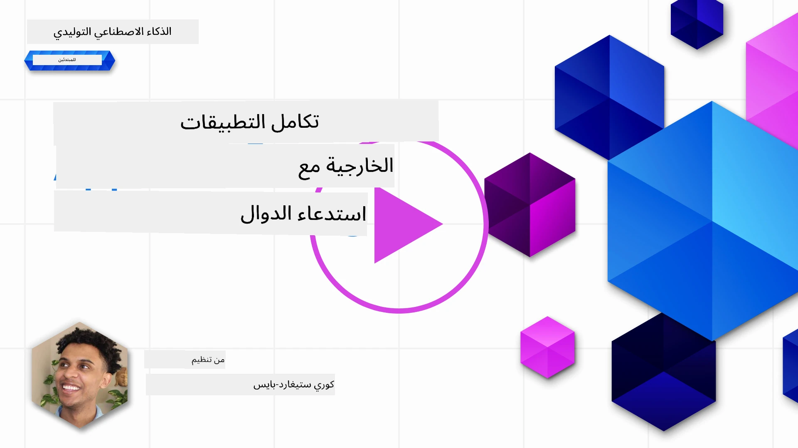
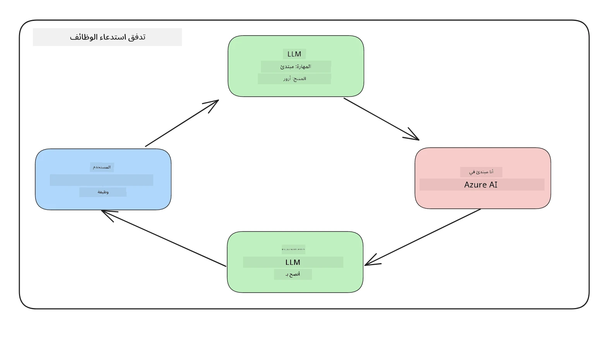
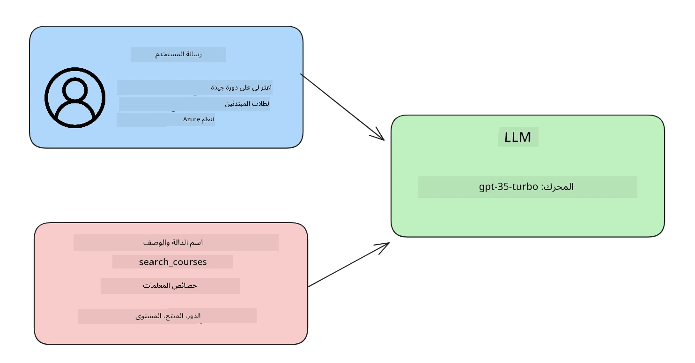

# التكامل مع استدعاء الدالة

[](https://youtu.be/DgUdCLX8qYQ?si=f1ouQU5HQx6F8Gl2)

لقد تعلمت الكثير حتى الآن في الدروس السابقة. ولكن، يمكننا التحسن أكثر. بعض الأمور التي يمكننا معالجتها هي كيفية الحصول على تنسيق استجابة أكثر اتساقًا لجعل التعامل مع الاستجابة في المراحل التالية أكثر سهولة. أيضًا، قد نرغب في إضافة بيانات من مصادر أخرى لتعزيز تطبيقنا.

المشاكل المذكورة أعلاه هي التي يسعى هذا الفصل لمعالجتها.

## مقدمة

ستغطي هذه الدرس:

- شرح ما هو استدعاء الدوال وحالات استخدامه.
- إنشاء استدعاء دالة باستخدام Azure OpenAI.
- كيفية دمج استدعاء الدالة في التطبيق.

## أهداف التعلم

بنهاية هذا الدرس، ستتمكن من:

- شرح الغرض من استخدام استدعاء الدوال.
- إعداد استدعاء الدالة باستخدام خدمة Azure OpenAI.
- تصميم استدعاءات دوال فعالة لحالة استخدام تطبيقك.

## السيناريو: تحسين روبوت الدردشة الخاص بنا باستخدام الدوال

لهذا الدرس، نريد بناء ميزة لشركتنا الناشئة التعليمية تتيح للمستخدمين استخدام روبوت دردشة للعثور على الدورات التقنية. سنوصي بدورات تناسب مستوى مهاراتهم، الدور الحالي، والتقنية التي يهتمون بها.

لإكمال هذا السيناريو، سنستخدم مزيجًا من:

- `Azure OpenAI` لإنشاء تجربة دردشة للمستخدم.
- `Microsoft Learn Catalog API` لمساعدة المستخدمين في العثور على الدورات بناءً على طلبهم.
- `Function Calling` لأخذ استعلام المستخدم وإرساله إلى دالة لتنفيذ طلب API.

للبدء، دعنا ننظر في سبب رغبتنا في استخدام استدعاء الدوال من الأساس:

## لماذا استدعاء الدوال

قبل استدعاء الدوال، كانت الردود من نموذج اللغة الكبير (LLM) غير منظمة وغير متسقة. كان على المطورين كتابة كود تحقق معقد للتأكد من قدرتهم على التعامل مع كل تنوع في الاستجابة. لم يكن المستخدمون قادرين على الحصول على إجابات مثل "ما هو الطقس الحالي في ستوكهولم؟". وذلك لأن النماذج كانت محدودة بوقت تدريب البيانات.

استدعاء الدوال هي ميزة في خدمة Azure OpenAI للتغلب على القيود التالية:

- **تنسيق استجابة متناسق**. إذا استطعنا التحكم بشكل أفضل في تنسيق الاستجابة، يمكننا دمج الرد بسهولة أكبر مع أنظمة أخرى لاحقًا.
- **بيانات خارجية**. القدرة على استخدام بيانات من مصادر أخرى في التطبيق في سياق الدردشة.

## توضيح المشكلة من خلال سيناريو

> نوصي باستخدام [المفكرة المرفقة](./python/aoai-assignment.ipynb?WT.mc_id=academic-105485-koreyst) إذا أردت تنفيذ السيناريو أدناه. يمكنك أيضًا القراءة فقط حيث نحاول توضيح مشكلة يمكن للدوال مساعدتك في حلها.

دعنا ننظر إلى المثال الذي يوضح مشكلة تنسيق الاستجابة:

لنفترض أننا نريد إنشاء قاعدة بيانات لبيانات الطلاب لنتمكن من اقتراح الدورة المناسبة لهم. أدناه لدينا وصفين لطلاب متشابهين جدًا في البيانات التي يحتويان عليها.

1. إنشاء اتصال بموارد Azure OpenAI الخاصة بنا:

   ```python
   import os
   import json
   from openai import OpenAI
   from dotenv import load_dotenv
   load_dotenv()

   # يتم تقديم واجهة برمجة التطبيقات للاستجابات من نقطة نهاية Azure OpenAI (Microsoft Foundry) الإصدار 1
   # لذلك نوجه عميل OpenAI إلى <your-endpoint>/openai/v1/.
   endpoint = os.environ['AZURE_OPENAI_ENDPOINT']
   client = OpenAI(
   api_key=os.environ['AZURE_OPENAI_API_KEY'],
   base_url=f"{endpoint.rstrip('/')}/openai/v1/",
   )

   deployment=os.environ['AZURE_OPENAI_DEPLOYMENT']
   ```

   أدناه هو بعض كود بايثون لتكوين اتصالنا بـ Azure OpenAI. لأننا نستخدم نقطة النهاية v1، نحتاج فقط لضبط `api_key` و `base_url` (لا حاجة لـ `api_version`).

1. إنشاء وصفين للطلاب باستخدام المتغيرين `student_1_description` و `student_2_description`.

   ```python
   student_1_description="Emily Johnson is a sophomore majoring in computer science at Duke University. She has a 3.7 GPA. Emily is an active member of the university's Chess Club and Debate Team. She hopes to pursue a career in software engineering after graduating."

   student_2_description = "Michael Lee is a sophomore majoring in computer science at Stanford University. He has a 3.8 GPA. Michael is known for his programming skills and is an active member of the university's Robotics Club. He hopes to pursue a career in artificial intelligence after finishing his studies."
   ```

   نريد إرسال أوصاف الطلاب أعلاه إلى نموذج لغة كبير لتحليل البيانات. يمكن استخدام هذه البيانات لاحقًا في تطبيقنا وإرسالها إلى API أو تخزينها في قاعدة بيانات.

1. لننشئ الآن اثنين من التنبيهات (prompts) المتطابقة التي نوجه فيها النموذج إلى المعلومات التي نرغب في الحصول عليها:

   ```python
   prompt1 = f'''
   Please extract the following information from the given text and return it as a JSON object:

   name
   major
   school
   grades
   club

   This is the body of text to extract the information from:
   {student_1_description}
   '''

   prompt2 = f'''
   Please extract the following information from the given text and return it as a JSON object:

   name
   major
   school
   grades
   club

   This is the body of text to extract the information from:
   {student_2_description}
   '''
   ```

   التنبيهات أعلاه توجه النموذج لاستخلاص المعلومات وإرجاع الاستجابة بصيغة JSON.

1. بعد إعداد التنبيهات والاتصال بـ Azure OpenAI، سنرسل الآن التنبيهات إلى النموذج باستخدام `client.responses.create`. نخزن التنبيه في متغير `input` ونعين الدور إلى `user`. هذا لمحاكاة رسالة من المستخدم إلى روبوت الدردشة.

   ```python
   # الاستجابة من الموجه الأول
   openai_response1 = client.responses.create(
   model=deployment,
   input = [{'role': 'user', 'content': prompt1}],
   store=False,
   )
   openai_response1.output_text

   # الاستجابة من الموجه الثاني
   openai_response2 = client.responses.create(
   model=deployment,
   input = [{'role': 'user', 'content': prompt2}],
   store=False,
   )
   openai_response2.output_text
   ```

الآن يمكننا إرسال الطلبين إلى النموذج وفحص الاستجابة المستلمة من خلال العثور عليها كالتالي `openai_response1.output_text`.

1. أخيرًا، يمكننا تحويل الاستجابة إلى صيغة JSON بواسطة استخدام `json.loads`:

   ```python
   # تحميل الاستجابة ككائن JSON
   json_response1 = json.loads(openai_response1.output_text)
   json_response1
   ```

   الاستجابة 1:

   ```json
   {
     "name": "Emily Johnson",
     "major": "computer science",
     "school": "Duke University",
     "grades": "3.7",
     "club": "Chess Club"
   }
   ```

   الاستجابة 2:

   ```json
   {
     "name": "Michael Lee",
     "major": "computer science",
     "school": "Stanford University",
     "grades": "3.8 GPA",
     "club": "Robotics Club"
   }
   ```

   رغم أن التنبيهات متطابقة والوصف متشابه، نرى أن قيم خاصية `Grades` منسقة بشكل مختلف، حيث نحصل أحيانًا على التنسيق `3.7` أو `3.7 GPA` مثلاً.

   هذا النتيجة لأن النموذج يأخذ بيانات غير منظمة على شكل التنبيه المكتوب ويرجع أيضًا بيانات غير منظمة. نحتاج إلى تنسيق منظم حتى نعرف ما الذي نتوقعه عند تخزين هذه البيانات أو استخدامها.

كيف نحل مشكلة التنسيق إذن؟ باستخدام استدعاء الدوال، يمكننا التأكد من استلام بيانات منظمة. عند استخدام استدعاء الدوال، لا يقوم النموذج فعليًا باستدعاء أو تشغيل أي دوال. بدلاً من ذلك، ننشئ هيكلًا ليتبعه النموذج في ردوده. نستخدم بعدها هذه الردود المنظمة لمعرفة أي دالة نقوم بتشغيلها في تطبيقاتنا.



بعد ذلك، يمكننا أخذ ما تم إرجاعه من الدالة وإرساله إلى النموذج. ثم يرد النموذج باستخدام اللغة الطبيعية للإجابة على استعلام المستخدم.

## حالات استخدام استدعاء الدوال

هناك العديد من حالات الاستخدام المختلفة حيث يمكن لاستدعاء الدوال تحسين تطبيقك مثل:

- **استدعاء الأدوات الخارجية**. روبوتات الدردشة ممتازة في تقديم الإجابات على أسئلة المستخدمين. باستخدام استدعاء الدوال، يمكن لروبوتات الدردشة استخدام رسائل المستخدمين لإكمال مهام معينة. على سبيل المثال، يمكن لطالب أن يطلب من روبوت الدردشة "إرسال بريد إلكتروني إلى مدرسي يقول فيه أنني أحتاج إلى مزيد من المساعدة في هذا الموضوع". يمكن حينها إجراء استدعاء دالة إلى `send_email(to: string, body: string)`

- **إنشاء استعلامات API أو قواعد بيانات**. يمكن للمستخدمين العثور على المعلومات باستخدام اللغة الطبيعية التي تتحول إلى استعلام منسق أو طلب API. مثال على ذلك هو مدرس يطلب "من هم الطلاب الذين أتموا الواجب الأخير" والذي قد يستدعي دالة باسم `get_completed(student_name: string, assignment: int, current_status: string)`

- **إنشاء بيانات منظمة**. يمكن للمستخدمين أخذ نص أو CSV واستخدام النموذج لاستخلاص معلومات مهمة منه. على سبيل المثال، يمكن لطالب تحويل مقال ويكيبيديا عن اتفاقيات السلام لإنشاء بطاقات تعليمية ذكية. يتم ذلك باستخدام دالة تسمى `get_important_facts(agreement_name: string, date_signed: string, parties_involved: list)`

## إنشاء أول استدعاء دالة لك

تتضمن عملية إنشاء استدعاء دالة ثلاث خطوات رئيسية:

1. **استدعاء** واجهة Responses API مع قائمة الدوال (الأدوات) ورسالة المستخدم.
2. **قراءة** رد النموذج لأداء إجراء مثل تنفيذ دالة أو استدعاء API.
3. **إجراء** استدعاء آخر إلى واجهة Responses API مع الرد من دالتك لاستخدام تلك المعلومات لإنشاء استجابة للمستخدم.



### الخطوة 1 - إنشاء الرسائل

الخطوة الأولى هي إنشاء رسالة مستخدم. يمكن تعيينها ديناميكيًا بأخذ قيمة من حقل نصي أو تعيين قيمة هنا. إذا كانت هذه هي المرة الأولى التي تعمل فيها مع واجهة Responses API، يجب أن نحدد `role` و `content` من الرسالة.

يمكن أن تكون قيمة `role` إما `system` (إنشاء القواعد)، `assistant` (النموذج) أو `user` (المستخدم النهائي). لاستدعاء الدوال، سنعين هذا إلى `user` وسنضع سؤالًا كمثال.

```python
messages= [ {"role": "user", "content": "Find me a good course for a beginner student to learn Azure."} ]
```

من خلال تعيين أدوار مختلفة، يتم توضيح للنموذج إذا ما كانت الرسالة من النظام أو من المستخدم، مما يساعد على بناء سجل للمحادثة يمكن للنموذج البناء عليه.

### الخطوة 2 - إنشاء الدوال

بعد ذلك، سنحدد دالة والمعاملات الخاصة بها. سنستخدم دالة واحدة تسمى `search_courses` ولكن يمكنك إنشاء دوال متعددة.

> **مهم** : يتم تضمين الدوال في رسالة النظام للنموذج وسيتم احتسابها ضمن عدد الرموز المتاحة لديك.

أدناه، ننشئ الدوال كمصفوفة من العناصر. كل عنصر هو أداة في تنسيق Responses API المسطح، مع خصائص `type` و `name` و `description` و `parameters`:

```python
functions = [
   {
      "type":"function",
      "name":"search_courses",
      "description":"Retrieves courses from the search index based on the parameters provided",
      "parameters":{
         "type":"object",
         "properties":{
            "role":{
               "type":"string",
               "description":"The role of the learner (i.e. developer, data scientist, student, etc.)"
            },
            "product":{
               "type":"string",
               "description":"The product that the lesson is covering (i.e. Azure, Power BI, etc.)"
            },
            "level":{
               "type":"string",
               "description":"The level of experience the learner has prior to taking the course (i.e. beginner, intermediate, advanced)"
            }
         },
         "required":[
            "role"
         ]
      }
   }
]
```

لنشرح كل مثيل دالة بمزيد من التفصيل أدناه:

- `name` - اسم الدالة التي نريد استدعاؤها.
- `description` - وصف كيفية عمل الدالة. هنا من المهم أن تكون محددًا وواضحًا.
- `parameters` - قائمة بالقيم والتنسيق الذي تريد أن ينتجه النموذج في الرد. تتألف مصفوفة المعاملات من عناصر تحتوي الخصائص التالية:
  1.  `type` - نوع البيانات التي سيتم تخزين الخصائص بها.
  1.  `properties` - قائمة القيم المحددة التي سيستخدمها النموذج في استجابته
      1. `name` - المفتاح هو اسم الخاصية التي سيستخدمها النموذج في الرد المنسق، مثل `product`.
      1. `type` - نوع بيانات الخاصية هذه، مثل `string`.
      1. `description` - وصف الخاصية المحددة.

هناك أيضًا خاصية اختيارية `required` - الخاصية المطلوبة لإكمال استدعاء الدالة.

### الخطوة 3 - إجراء استدعاء الدالة

بعد تعريف دالة، نحتاج الآن إلى تضمينها في الاستدعاء إلى واجهة Responses API. نفعل ذلك بإضافة `tools` إلى الطلب. في هذه الحالة `tools=functions`.

هناك أيضًا خيار لتعيين `tool_choice` إلى `auto`. هذا يعني أننا نسمح للنموذج باختيار الدالة التي يجب استدعاؤها بناءً على رسالة المستخدم بدلاً من تعييننا نحن.

إليك بعض الكود أدناه حيث نستدعي `client.responses.create`، لاحظ كيف نعين `tools=functions` و `tool_choice="auto"` مما يعطي للنموذج حرية اختيار متى يستدعي الدوال التي نوفرها له:

```python
response = client.responses.create(model=deployment,
                                        input=messages,
                                        tools=functions,
                                        tool_choice="auto",
                                        store=False)

print(response.output)
```

الاستجابة التي تأتي الآن تحتوي على عنصر `function_call` في `response.output` يشبه التالي:

```json
{
  "type": "function_call",
  "name": "search_courses",
  "call_id": "call_abc123",
  "arguments": "{\n  \"role\": \"student\",\n  \"product\": \"Azure\",\n  \"level\": \"beginner\"\n}"
}
```

هنا يمكننا رؤية كيف تم استدعاء الدالة `search_courses` وبأي معاملات حسب ما هو مدرج في خاصية `arguments` في استجابة JSON.

استنتج النموذج أنه وجد البيانات لتناسب معاملات الدالة حيث كان يستخرجها من القيمة المقدمة إلى معامل `input` في استدعاء Responses API. أدناه تذكير بقيمة `messages`:

```python
messages= [ {"role": "user", "content": "Find me a good course for a beginner student to learn Azure."} ]
```

كما ترى، تم استخراج `student` و `Azure` و `beginner` من `messages` وتعيينها كمدخلات للدالة. استخدام الدوال بهذه الطريقة طريقة رائعة لاستخلاص المعلومات من التنبيه وأيضًا لتوفير هيكل للنموذج ولكي تكون الوظائف قابلة لإعادة الاستخدام.

بعد ذلك، نحتاج لرؤية كيف يمكننا استخدام هذا في تطبيقنا.

## دمج استدعاءات الدوال في تطبيق

بعد اختبار الاستجابة المنسقة من النموذج، يمكننا الآن دمج ذلك في التطبيق.

### إدارة التدفق

لدمج ذلك في تطبيقنا، دعنا نتخذ الخطوات التالية:

1. أولًا، نقوم بإجراء الاستدعاء إلى خدمات OpenAI واستخلاص عناصر استدعاء الدالة من الاستجابة `output`.

   ```python
   response_items = response.output
   tool_calls = [item for item in response_items if item.type == "function_call"]
   ```

1. الآن سنعرف الدالة التي ستستدعي Microsoft Learn API للحصول على قائمة الدورات:

   ```python
   import requests

   def search_courses(role, product, level):
     url = "https://learn.microsoft.com/api/catalog/"
     params = {
        "role": role,
        "product": product,
        "level": level
     }
     response = requests.get(url, params=params)
     modules = response.json()["modules"]
     results = []
     for module in modules[:5]:
        title = module["title"]
        url = module["url"]
        results.append({"title": title, "url": url})
     return str(results)
   ```

   لاحظ كيف ننشئ دالة بايثون فعلية تُطابق أسماء الدوال التي قمنا بتعريفها في متغير `functions`. كما نقوم بإجراء طلبات API خارجية حقيقية لجلب البيانات التي نحتاجها. في هذه الحالة، نستخدم Microsoft Learn API للبحث عن وحدات تدريبية.

حسنًا، لقد أنشأنا متغير `functions` ودالة بايثون مقابلة، كيف نخبر النموذج بكيفية ربطهما بحيث يتم استدعاء دالة البايثون الخاصة بنا؟

1. لرؤية إذا ما كنا بحاجة إلى استدعاء دالة بايثون، نحتاج للنظر في استجابة النموذج ومعرفة ما إذا كان عنصر `function_call` جزءًا منها واستدعاء الدالة المذكورة. إليك كيف يمكنك القيام بالفحص المذكور أدناه:

   ```python
   # التحقق مما إذا كان النموذج يريد استدعاء دالة
   if tool_calls:
    for tool_call in tool_calls:
     print("Recommended Function call:")
     print(tool_call.name)
     print()

     # استدعِ الدالة.
     function_name = tool_call.name

     available_functions = {
             "search_courses": search_courses,
     }
     function_to_call = available_functions[function_name]

     function_args = json.loads(tool_call.arguments)
     function_response = function_to_call(**function_args)

     print("Output of function call:")
     print(function_response)
     print(type(function_response))

     # أضف استدعاء الدالة ونتيجتها مرة أخرى إلى المحادثة.
     # يجب إضافة عنصر function_call الخاص بالنموذج قبل مخرجاته.
     messages.append(tool_call)  # عنصر function_call الخاص بالمساعد
     messages.append( # نتيجة الدالة
         {
             "type": "function_call_output",
             "call_id": tool_call.call_id,
             "output": function_response,
         }
     )
   ```

   هذه الأسطر الثلاثة تضمن اقتلاع اسم الدالة، المعاملات، وتنفيذ الاستدعاء:

   ```python
   function_to_call = available_functions[function_name]

   function_args = json.loads(tool_call.arguments)
   function_response = function_to_call(**function_args)
   ```

   أدناه ناتج تشغيل كودنا:

   **الناتج**

   ```Recommended Function call:
   {
     "name": "search_courses",
     "arguments": "{\n  \"role\": \"student\",\n  \"product\": \"Azure\",\n  \"level\": \"beginner\"\n}"
   }

   Output of function call:
   [{'title': 'Describe concepts of cryptography', 'url': 'https://learn.microsoft.com/training/modules/describe-concepts-of-cryptography/?
   WT.mc_id=api_CatalogApi'}, {'title': 'Introduction to audio classification with TensorFlow', 'url': 'https://learn.microsoft.com/en-
   us/training/modules/intro-audio-classification-tensorflow/?WT.mc_id=api_CatalogApi'}, {'title': 'Design a Performant Data Model in Azure SQL
   Database with Azure Data Studio', 'url': 'https://learn.microsoft.com/training/modules/design-a-data-model-with-ads/?
   WT.mc_id=api_CatalogApi'}, {'title': 'Getting started with the Microsoft Cloud Adoption Framework for Azure', 'url':
   'https://learn.microsoft.com/training/modules/cloud-adoption-framework-getting-started/?WT.mc_id=api_CatalogApi'}, {'title': 'Set up the
   Rust development environment', 'url': 'https://learn.microsoft.com/training/modules/rust-set-up-environment/?WT.mc_id=api_CatalogApi'}]
   <class 'str'>
   ```

1. الآن سنرسل الرسالة المحدّثة، `messages` إلى النموذج لكي نستلم ردًا بلغة طبيعية بدلاً من استجابة API بصيغة JSON.

   ```python
   print("Messages in next request:")
   print(messages)
   print()

   second_response = client.responses.create(
      input=messages,
      model=deployment,
      tool_choice="auto",
      tools=functions,
      temperature=0,
      store=False,
         )  # الحصول على استجابة جديدة من النموذج حيث يمكنه رؤية استجابة الدالة


   print(second_response.output_text)
   ```

   **الناتج**

   ```text
   I found some good courses for beginner students to learn Azure:

   1. [Describe concepts of cryptography](https://learn.microsoft.com/training/modules/describe-concepts-of-cryptography/?WT.mc_id=api_CatalogApi)
   2. [Introduction to audio classification with TensorFlow](https://learn.microsoft.com/training/modules/intro-audio-classification-tensorflow/?WT.mc_id=api_CatalogApi)
   3. [Design a Performant Data Model in Azure SQL Database with Azure Data Studio](https://learn.microsoft.com/training/modules/design-a-data-model-with-ads/?WT.mc_id=api_CatalogApi)
   4. [Getting started with the Microsoft Cloud Adoption Framework for Azure](https://learn.microsoft.com/training/modules/cloud-adoption-framework-getting-started/?WT.mc_id=api_CatalogApi)
   5. [Set up the Rust development environment](https://learn.microsoft.com/training/modules/rust-set-up-environment/?WT.mc_id=api_CatalogApi)

   You can click on the links to access the courses.
   ```

## تدريب

لمتابعة تعلمك لاستدعاء دوال Azure OpenAI يمكنك بناء:

- المزيد من معاملات الدالة التي قد تساعد المتعلمين على العثور على المزيد من الدورات.

- أنشئ نداء دالة آخر يأخذ معلومات أكثر من المتعلم مثل لغته الأم  
- أنشئ معالجة للأخطاء عندما لا يعيد نداء الدالة و/أو نداء API أي دورات مناسبة  

تلميح: اتبع صفحة [توثيق مرجعي لواجهة برمجة تطبيقات التعلم](https://learn.microsoft.com/training/support/catalog-api-developer-reference?WT.mc_id=academic-105485-koreyst) لترى كيف وأين تتوفر هذه البيانات.  

## عمل رائع! أكمل الرحلة  

بعد إكمال هذا الدرس، اطلع على [مجموعة تعلم الذكاء الاصطناعي التوليدي](https://aka.ms/genai-collection?WT.mc_id=academic-105485-koreyst) لمواصلة رفع مستوى معرفتك بالذكاء الاصطناعي التوليدي!  

انتقل إلى الدرس 12، حيث سننظر في كيفية [تصميم تجربة المستخدم لتطبيقات الذكاء الاصطناعي](../12-designing-ux-for-ai-applications/README.md?WT.mc_id=academic-105485-koreyst)!  

---

<!-- CO-OP TRANSLATOR DISCLAIMER START -->
**تنويه**:
تمت ترجمة هذا المستند باستخدام خدمة الترجمة بالذكاء الاصطناعي [Co-op Translator](https://github.com/Azure/co-op-translator). بينما نسعى للدقة، يرجى العلم أن الترجمات الآلية قد تحتوي على أخطاء أو عدم دقة. يجب اعتبار المستند الأصلي بلغته الأصلية المصدر الرسمي والمعتمد. للمعلومات الهامة، يُنصح بالاستعانة بترجمة بشرية محترفة. نحن غير مسؤولين عن أي سوء فهم أو تفسير ناتج عن استخدام هذه الترجمة.
<!-- CO-OP TRANSLATOR DISCLAIMER END -->