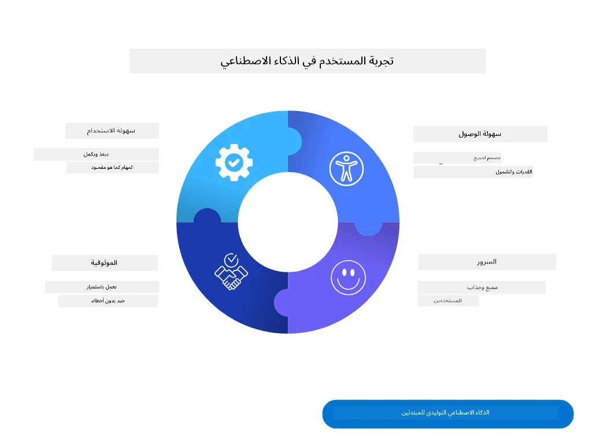
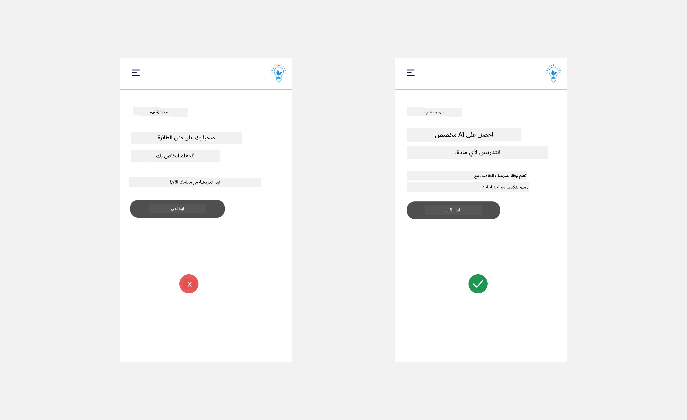
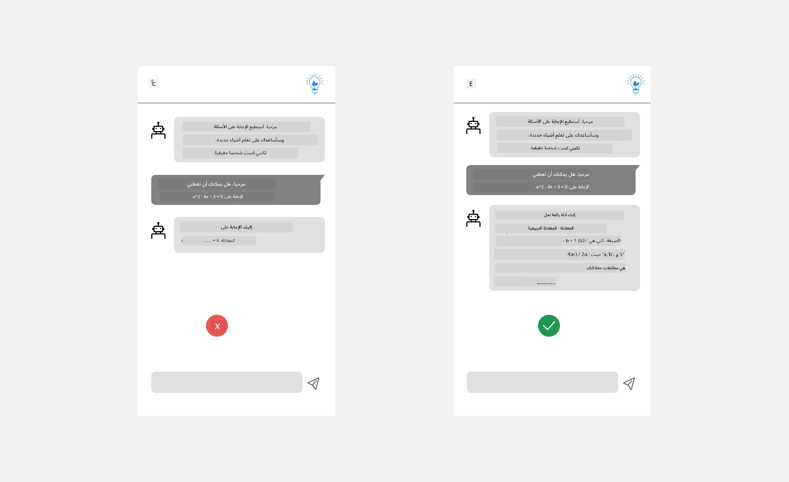
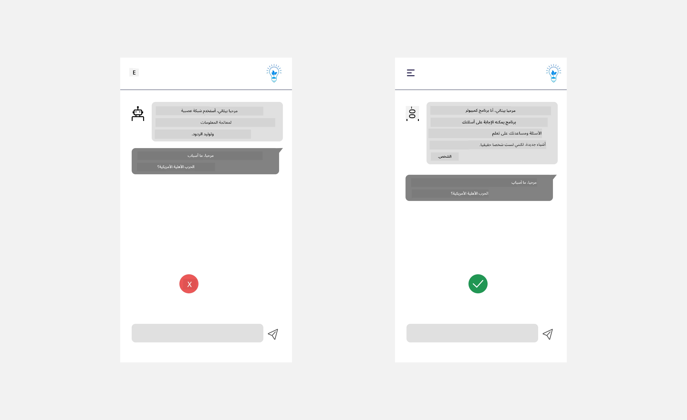
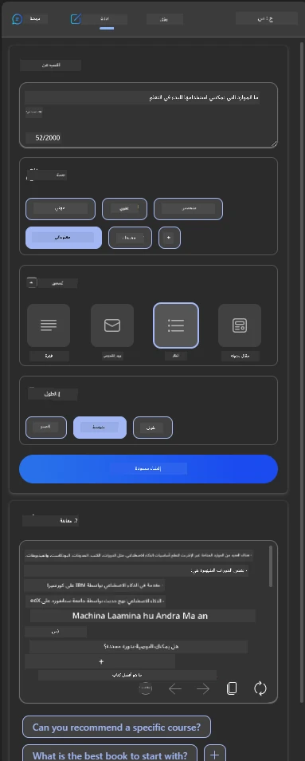
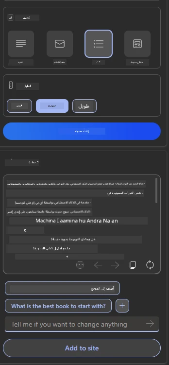
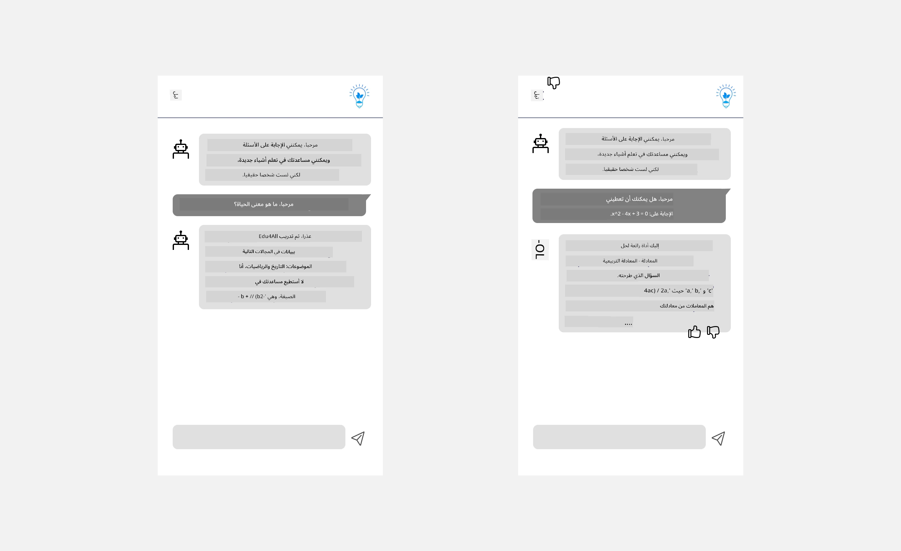

# تصميم تجربة المستخدم لتطبيقات الذكاء الاصطناعي

> _(انقر على الصورة أعلاه لمشاهدة فيديو هذا الدرس)_

تجربة المستخدم هي جانب مهم جدًا في بناء التطبيقات. يحتاج المستخدمون إلى أن يكونوا قادرين على استخدام تطبيقك بكفاءة لأداء المهام. الكفاءة أمر واحد ولكنك تحتاج أيضًا إلى تصميم التطبيقات بحيث يمكن للجميع استخدامها، لجعلها _متاحة_. سيركز هذا الفصل على هذا المجال لكي تتمكن من تصميم تطبيق يمكن للناس استخدامه ويرغبون في استخدامه.

## مقدمة

تجربة المستخدم هي كيفية تفاعل المستخدم مع واستخدام منتج أو خدمة محددة سواء كان نظامًا، أداة، أو تصميمًا. عند تطوير تطبيقات الذكاء الاصطناعي، لا يركز المطورون فقط على ضمان فعالية تجربة المستخدم بل أيضًا على أخلاقيتها. في هذا الدرس، نغطي كيفية بناء تطبيقات الذكاء الاصطناعي التي تلبي احتياجات المستخدمين.

سيغطي الدرس المجالات التالية:

- مقدمة عن تجربة المستخدم وفهم احتياجات المستخدم
- تصميم تطبيقات الذكاء الاصطناعي للثقة والشفافية
- تصميم تطبيقات الذكاء الاصطناعي للتعاون والتغذية الراجعة

## أهداف التعلم

بعد أخذ هذا الدرس، ستكون قادرًا على:

- فهم كيفية بناء تطبيقات الذكاء الاصطناعي التي تلبي احتياجات المستخدم.
- تصميم تطبيقات الذكاء الاصطناعي التي تعزز الثقة والتعاون.

### المتطلبات السابقة

خذ بعض الوقت واقرأ المزيد عن [تجربة المستخدم وفكر التصميم.](https://learn.microsoft.com/training/modules/ux-design?WT.mc_id=academic-105485-koreyst)

## مقدمة عن تجربة المستخدم وفهم احتياجات المستخدم

في شركتنا الناشئة التعليمية التخيلية، لدينا مستخدمان رئيسيان، المعلمون والطلاب. لكل من المستخدمين احتياجات فريدة. التصميم المرتكز على المستخدم يعطى الأولوية للمستخدم لضمان أن تكون المنتجات ذات صلة ومفيدة لأولئك الذين تُوجه لهم.

يجب أن يكون التطبيق **مفيدًا، موثوقًا، متاحًا وممتعًا** لتوفير تجربة مستخدم جيدة.

### سهولة الاستخدام

أن يكون مفيدًا يعني أن التطبيق يحتوي على وظائف تتوافق مع هدفه المقصود، مثل أتمتة عملية التقييم أو إنشاء بطاقات مراجعة. يجب أن يكون التطبيق الذي يؤتمت عملية التقييم قادرًا على منح درجات بدقة وكفاءة لأعمال الطلاب بناءً على معايير محددة مسبقًا. وبالمثل، يجب أن يكون التطبيق الذي يولد بطاقات المراجعة قادرًا على إنشاء أسئلة ذات صلة ومتنوعة بناءً على بياناته.

### الموثوقية

أن يكون موثوقًا يعني أن التطبيق يمكنه أداء مهمته باستمرار وبدون أخطاء. ومع ذلك، الذكاء الاصطناعي مثل البشر ليس كاملاً وقد يكون عرضة للأخطاء. قد تواجه التطبيقات أخطاء أو مواقف غير متوقعة تتطلب تدخلًا بشريًا أو تصحيحًا. كيف تتعامل مع الأخطاء؟ في القسم الأخير من هذا الدرس، سنغطي كيفية تصميم أنظمة وتطبيقات الذكاء الاصطناعي للتعاون والتغذية الراجعة.

### الوصولية

أن يكون متاحًا يعني توسيع تجربة المستخدم لتشمل المستخدمين بمختلف القدرات، بما في ذلك ذوي الإعاقات، لضمان عدم ترك أحد خارجه. باتباع إرشادات ومبادئ الوصولية، تصبح حلول الذكاء الاصطناعي أكثر شمولية وقابلية للاستخدام ومفيدة لجميع المستخدمين.

### المتعة

أن يكون ممتعًا يعني أن التطبيق ممتع للاستخدام. يمكن لتجربة المستخدم الجذابة أن يكون لها تأثير إيجابي على المستخدم، مما يشجعه على العودة إلى التطبيق وزيادة إيرادات الأعمال.

ليس كل تحد يمكن حله بالذكاء الاصطناعي. الذكاء الاصطناعي يهدف إلى تعزيز تجربة المستخدم، سواء عن طريق أتمتة المهام اليدوية، أو تخصيص تجارب المستخدم.

## تصميم تطبيقات الذكاء الاصطناعي للثقة والشفافية

بناء الثقة أمر حاسم عند تصميم تطبيقات الذكاء الاصطناعي. الثقة تضمن أن المستخدم واثق من أن التطبيق سينجز العمل، ويوفر النتائج باستمرار وأن النتائج هي ما يحتاجه المستخدم. هناك خطر في هذا المجال وهو فقدان الثقة أو الإفراط في الثقة. فقدان الثقة يحدث عندما يكون لدى المستخدم ثقة قليلة أو معدومة في نظام الذكاء الاصطناعي، مما يؤدي إلى رفض المستخدم لتطبيقك. الإفراط في الثقة يحدث عندما يبالغ المستخدم في تقدير قدرة نظام الذكاء الاصطناعي، مما يؤدي إلى ثقة المستخدمين في النظام بشكل مفرط. على سبيل المثال، قد يؤدي نظام التقييم الآلي عند الإفراط في الثقة إلى عدم تدقيق المعلم لبعض الأوراق للتأكد من عمل نظام التقييم بشكل جيد. هذا يمكن أن يؤدي إلى درجات غير عادلة أو غير دقيقة للطلاب، أو فرص مفقودة للتعليقات والتحسين.

طريقتان لضمان وضع الثقة في مركز التصميم هما الشرح والتحكم.

### الشرح

عندما يساعد الذكاء الاصطناعي في اتخاذ القرارات مثل نقل المعرفة للأجيال القادمة، من الضروري للمعلمين والأهل فهم كيفية اتخاذ قرارات الذكاء الاصطناعي. هذا هو الشرح - فهم كيفية اتخاذ تطبيقات الذكاء الاصطناعي للقرارات. يشمل التصميم للشرح إضافة تفاصيل تبرز كيف توصل الذكاء الاصطناعي إلى النتيجة. يجب أن يكون الجمهور على دراية بأن النتيجة تم توليدها بواسطة الذكاء الاصطناعي وليس بشريًا. مثلاً، بدلاً من قول "ابدأ الدردشة مع معلمك الآن" قل "استخدم المعلم الذكي الذي يتكيف مع احتياجاتك ويساعدك على التعلم وفقًا لسرعتك."

مثال آخر هو كيفية استخدام الذكاء الاصطناعي لبيانات المستخدم والبيانات الشخصية. مثلاً، قد يكون لدى المستخدم شخصية طالب وله قيود بناءً على هذه الشخصية. قد لا يكون الذكاء الاصطناعي قادرًا على الكشف عن إجابات الأسئلة لكنه قد يساعد المستخدم في التفكير لكيفية حل المشكلة.

جزء آخر مهم من الشرح هو تبسيط التفسيرات. قد لا يكون الطلاب والمعلمون خبراء في الذكاء الاصطناعي، لذلك يجب أن تكون شروحات ما يمكن للتطبيق القيام به أو عدم القيام به مبسطة وسهلة الفهم.

### التحكم

الذكاء الاصطناعي التوليدي يخلق تعاونًا بين الذكاء الاصطناعي والمستخدم، حيث يمكن للمستخدم تعديل الموجهات للحصول على نتائج مختلفة. بالإضافة إلى ذلك، بمجرد توليد ناتج، يجب أن يكون بإمكان المستخدمين تعديل النتائج مما يمنحهم إحساسًا بالتحكم. على سبيل المثال، عند استخدام Microsoft Copilot (المعروف سابقًا باسم Bing Chat)، يمكنك تخصيص موجهك استنادًا إلى التنسيق، النغمة والطول. بالإضافة إلى ذلك، يمكنك إضافة تغييرات إلى الناتج وتعديله كما هو موضح أدناه:

ميزة أخرى في Microsoft Copilot تسمح للمستخدم بالتحكم في التطبيق هي القدرة على الاشتراك أو إلغاء الاشتراك في البيانات التي يستخدمها الذكاء الاصطناعي. لتطبيق مدرسي، قد يرغب الطالب في استخدام ملاحظاته وكذلك موارد المعلمين كمادة للمراجعة.

> عند تصميم تطبيقات الذكاء الاصطناعي، تكون النية هي المفتاح لضمان عدم إفراط المستخدمين في الثقة، مما يضع توقعات غير واقعية لقدراته. إحدى الطرق للقيام بذلك هي خلق احتكاك بين الموجهات والنتائج. تذكير المستخدم بأن هذا هو الذكاء الاصطناعي وليس إنسانًا زميلًا

## تصميم تطبيقات الذكاء الاصطناعي للتعاون والتغذية الراجعة

كما ذكرنا سابقًا، يخلق الذكاء الاصطناعي التوليدي تعاونًا بين المستخدم والذكاء الاصطناعي. معظم التفاعلات تكون بإدخال المستخدم لموجه والذكاء الاصطناعي ينتج ناتجًا. ماذا لو كان الناتج غير صحيح؟ كيف يتعامل التطبيق مع الأخطاء إذا حدثت؟ هل يلوم الذكاء الاصطناعي المستخدم أم يأخذ وقتًا لشرح الخطأ؟

يجب بناء تطبيقات الذكاء الاصطناعي لتلقي وإعطاء التغذية الراجعة. هذا لا يساعد فقط على تحسين نظام الذكاء الاصطناعي بل يبني أيضًا ثقة المستخدمين. يجب أن يتضمن التصميم حلقة تغذية راجعة، مثل إعطاء إبهام لأعلى أو لأسفل على الناتج.

طريقة أخرى للتعامل مع هذا هي التواصل بوضوح عن قدرات وقيود النظام. عندما يرتكب المستخدم خطأ بطلب شيء يتجاوز قدرات الذكاء الاصطناعي، يجب أن يكون هناك طريقة للتعامل مع ذلك، كما هو موضح أدناه.

الأخطاء في النظام شائعة في التطبيقات حيث قد يحتاج المستخدم إلى مساعدة بمعلومات خارج نطاق الذكاء الاصطناعي أو قد يحدد التطبيق حدًا لعدد الأسئلة/المواضيع التي يمكن للمستخدم توليد ملخصات لها. على سبيل المثال، قد لا يكون تطبيق الذكاء الاصطناعي المدرب على بيانات محدودة في مواضيع مثل التاريخ والرياضيات قادرًا على التعامل مع أسئلة حول الجغرافيا. للتخفيف من هذا، يمكن لنظام الذكاء الاصطناعي أن يعطي ردًا مثل: "عذرًا، تم تدريب منتجنا على بيانات في المواضيع التالية.....، لا يمكنني الرد على السؤال الذي طرحته."

تطبيقات الذكاء الاصطناعي ليست كاملة، لذلك من المتوقع أن ترتكب أخطاء. عند تصميم تطبيقاتك، يجب عليك التأكد من إنشاء مساحة لتغذية راجعة من المستخدمين والتعامل مع الأخطاء بطريقة مبسطة وسهلة الشرح.

## المهمة

خذ أي تطبيقات ذكاء اصطناعي قمت ببنائها حتى الآن، وفكر في تطبيق الخطوات التالية في تطبيقك:

- **المتعة:** فكر كيف يمكنك جعل تطبيقك أكثر متعة. هل تضيف تفسيرات في كل مكان؟ هل تشجع المستخدم على الاستكشاف؟ كيف تصيغ رسائل الخطأ الخاصة بك؟

- **سهولة الاستخدام:** بناء تطبيق ويب. تأكد من أن تطبيقك يمكن التنقل فيه باستخدام كل من الفأرة ولوحة المفاتيح.

- **الثقة والشفافية:** لا تثق في الذكاء الاصطناعي تمامًا أو في نواتجه، فكر في كيفية إضافة عنصر بشري للتحقق من النتيجة. أيضًا، فكر وطبق طرقًا أخرى لتحقيق الثقة والشفافية.

- **التحكم:** أعط المستخدم التحكم في البيانات التي يقدمها للتطبيق. نفذ طريقة يمكن للمستخدم من خلالها الاشتراك أو إلغاء الاشتراك في جمع البيانات في تطبيق الذكاء الاصطناعي.

<!-- ## [اختبار بعد المحاضرة](../../../12-designing-ux-for-ai-applications/quiz-url) -->

## استمر في التعلم!

بعد إكمال هذا الدرس، تحقق من [مجموعة تعلم الذكاء الاصطناعي التوليدي](https://aka.ms/genai-collection?WT.mc_id=academic-105485-koreyst) لمواصلة رفع مستوى معرفتك بالذكاء الاصطناعي التوليدي!

توجه إلى الدرس 13، حيث سنطلع على كيفية [تأمين تطبيقات الذكاء الاصطناعي](../13-securing-ai-applications/README.md?WT.mc_id=academic-105485-koreyst)!

---

<!-- CO-OP TRANSLATOR DISCLAIMER START -->
**تنويه**:
تمت ترجمة هذا المستند باستخدام خدمة الترجمة بالذكاء الاصطناعي [Co-op Translator](https://github.com/Azure/co-op-translator). بينما نسعى للدقة، يرجى العلم أن الترجمات الآلية قد تحتوي على أخطاء أو عدم دقة. يجب اعتبار المستند الأصلي بلغته الأصلية المصدر الرسمي والمعتمد. للمعلومات الهامة، يُنصح بالاستعانة بترجمة بشرية محترفة. نحن غير مسؤولين عن أي سوء فهم أو تفسير ناتج عن استخدام هذه الترجمة.
<!-- CO-OP TRANSLATOR DISCLAIMER END -->