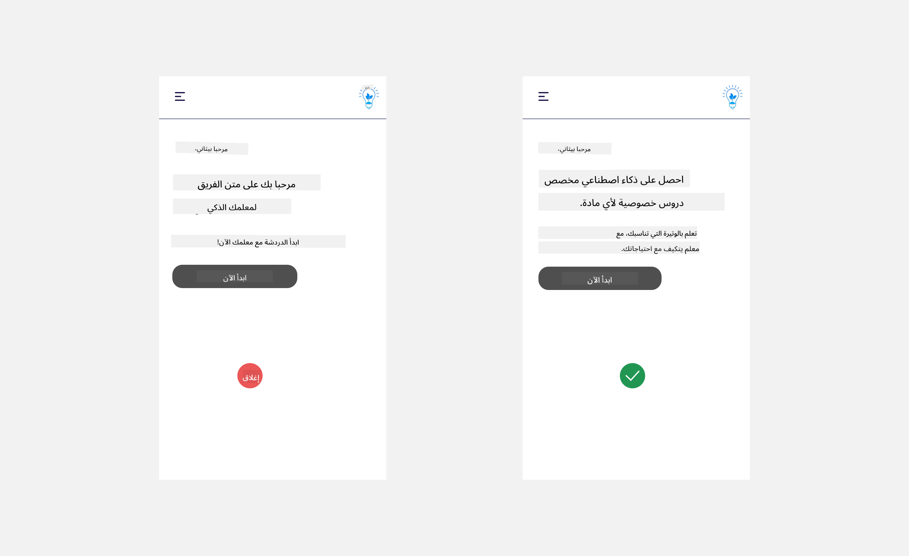
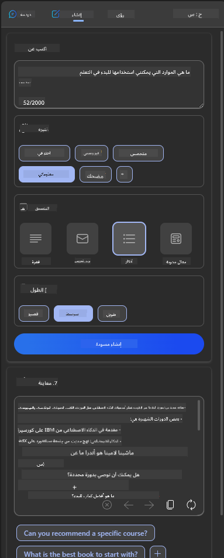

<!--
CO_OP_TRANSLATOR_METADATA:
{
  "original_hash": "747668e4c53d067369f06e9ec2e6313e",
  "translation_date": "2025-08-26T14:08:02+00:00",
  "source_file": "12-designing-ux-for-ai-applications/README.md",
  "language_code": "ar"
}
-->
# تصميم تجربة المستخدم لتطبيقات الذكاء الاصطناعي

> _(انقر على الصورة أعلاه لمشاهدة فيديو هذا الدرس)_

تجربة المستخدم جانب مهم جداً عند بناء التطبيقات. يجب أن يكون المستخدمون قادرين على استخدام تطبيقك بكفاءة لإنجاز المهام. الكفاءة أمر مهم، لكن عليك أيضاً تصميم التطبيقات بحيث يمكن للجميع استخدامها، لجعلها _متاحة للجميع_. سيركز هذا الفصل على هذا الجانب حتى تتمكن في النهاية من تصميم تطبيق يرغب الناس في استخدامه ويستطيعون ذلك.

## المقدمة

تجربة المستخدم هي كيفية تفاعل المستخدم مع منتج أو خدمة معينة سواء كان نظاماً أو أداة أو تصميماً. عند تطوير تطبيقات الذكاء الاصطناعي، لا يركز المطورون فقط على ضمان فعالية تجربة المستخدم، بل أيضاً على الجانب الأخلاقي. في هذا الدرس، سنتناول كيفية بناء تطبيقات الذكاء الاصطناعي التي تلبي احتياجات المستخدمين.

سيتناول الدرس المجالات التالية:

- مقدمة عن تجربة المستخدم وفهم احتياجات المستخدمين
- تصميم تطبيقات الذكاء الاصطناعي للثقة والشفافية
- تصميم تطبيقات الذكاء الاصطناعي للتعاون والتغذية الراجعة

## أهداف التعلم

بعد الانتهاء من هذا الدرس، ستكون قادراً على:

- فهم كيفية بناء تطبيقات ذكاء اصطناعي تلبي احتياجات المستخدمين.
- تصميم تطبيقات ذكاء اصطناعي تعزز الثقة والتعاون.

### المتطلبات المسبقة

خذ بعض الوقت واقرأ المزيد عن [تجربة المستخدم والتفكير التصميمي.](https://learn.microsoft.com/training/modules/ux-design?WT.mc_id=academic-105485-koreyst)

## مقدمة عن تجربة المستخدم وفهم احتياجات المستخدمين

في شركتنا التعليمية الافتراضية، لدينا نوعان أساسيان من المستخدمين: المعلمون والطلاب. كل من هذين المستخدمين له احتياجاته الخاصة. التصميم الذي يركز على المستخدم يعطي الأولوية للمستخدم ويضمن أن المنتجات ذات صلة ومفيدة لمن صممت من أجلهم.

يجب أن يكون التطبيق **مفيداً، موثوقاً، متاحاً وجذاباً** ليقدم تجربة مستخدم جيدة.

### سهولة الاستخدام

أن يكون التطبيق مفيداً يعني أن لديه وظائف تتناسب مع الغرض المقصود منه، مثل أتمتة عملية التصحيح أو إنشاء بطاقات مراجعة للدراسة. التطبيق الذي يقوم بأتمتة التصحيح يجب أن يكون قادراً على إعطاء الدرجات بدقة وكفاءة بناءً على معايير محددة مسبقاً. وبالمثل، التطبيق الذي ينشئ بطاقات مراجعة يجب أن يكون قادراً على توليد أسئلة متنوعة وذات صلة بناءً على بياناته.

### الموثوقية

أن يكون التطبيق موثوقاً يعني أنه يستطيع أداء مهمته باستمرار وبدون أخطاء. ومع ذلك، الذكاء الاصطناعي مثل البشر ليس مثالياً وقد يرتكب أخطاء. قد تواجه التطبيقات أخطاء أو مواقف غير متوقعة تتطلب تدخل أو تصحيح بشري. كيف تتعامل مع الأخطاء؟ في القسم الأخير من هذا الدرس، سنتناول كيف يتم تصميم أنظمة وتطبيقات الذكاء الاصطناعي للتعاون والتغذية الراجعة.

### الإتاحة

أن يكون التطبيق متاحاً يعني توسيع تجربة المستخدم لتشمل مستخدمين من ذوي القدرات المختلفة، بما في ذلك ذوي الإعاقات، لضمان عدم استبعاد أحد. من خلال اتباع إرشادات ومبادئ الإتاحة، تصبح حلول الذكاء الاصطناعي أكثر شمولية وفائدة لجميع المستخدمين.

### الجاذبية

أن يكون التطبيق جذاباً يعني أنه ممتع في الاستخدام. تجربة المستخدم الجذابة يمكن أن يكون لها تأثير إيجابي على المستخدم وتشجعه على العودة للتطبيق، مما يزيد من إيرادات العمل.

ليس كل تحدٍ يمكن حله بالذكاء الاصطناعي. الذكاء الاصطناعي يأتي ليعزز تجربة المستخدم، سواء بأتمتة المهام اليدوية أو تخصيص التجربة للمستخدمين.

## تصميم تطبيقات الذكاء الاصطناعي للثقة والشفافية

بناء الثقة أمر أساسي عند تصميم تطبيقات الذكاء الاصطناعي. الثقة تضمن أن المستخدم واثق من أن التطبيق سينجز العمل ويقدم النتائج باستمرار، وأن النتائج تلبي احتياجاته. هناك خطر في هذا المجال وهو انعدام الثقة أو الثقة الزائدة. انعدام الثقة يحدث عندما يكون لدى المستخدم ثقة قليلة أو معدومة في نظام الذكاء الاصطناعي، مما يؤدي إلى رفض المستخدم لتطبيقك. أما الثقة الزائدة فتحدث عندما يبالغ المستخدم في تقدير قدرات نظام الذكاء الاصطناعي، فيثق به أكثر من اللازم. على سبيل المثال، نظام تصحيح تلقائي في حالة الثقة الزائدة قد يجعل المعلم لا يراجع بعض الأوراق للتأكد من أن النظام يعمل بشكل جيد. هذا قد يؤدي إلى درجات غير عادلة أو غير دقيقة للطلاب، أو فقدان فرص للتغذية الراجعة والتحسين.

هناك طريقتان لضمان أن تكون الثقة في صميم التصميم: القابلية للتفسير والتحكم.

### القابلية للتفسير

عندما يساعد الذكاء الاصطناعي في اتخاذ قرارات مثل نقل المعرفة للأجيال القادمة، من المهم جداً أن يفهم المعلمون وأولياء الأمور كيف يتخذ الذكاء الاصطناعي قراراته. هذا هو مفهوم القابلية للتفسير - فهم كيف تتخذ تطبيقات الذكاء الاصطناعي قراراتها. يشمل التصميم للقابلية للتفسير إضافة تفاصيل توضح كيف توصل الذكاء الاصطناعي إلى النتيجة. يجب أن يكون الجمهور على علم بأن النتيجة تم توليدها بواسطة الذكاء الاصطناعي وليس إنساناً. على سبيل المثال، بدلاً من قول "ابدأ الدردشة مع معلمك الآن" قل "استخدم معلم الذكاء الاصطناعي الذي يتكيف مع احتياجاتك ويساعدك على التعلم وفقاً لسرعتك".

مثال آخر هو كيف يستخدم الذكاء الاصطناعي بيانات المستخدم والبيانات الشخصية. على سبيل المثال، قد يكون لدى المستخدم الذي يحمل شخصية الطالب بعض القيود بناءً على شخصيته. قد لا يتمكن الذكاء الاصطناعي من كشف الإجابات عن الأسئلة، لكنه قد يساعد المستخدم في التفكير في كيفية حل المشكلة.

جزء أساسي آخر من القابلية للتفسير هو تبسيط الشروحات. الطلاب والمعلمون قد لا يكونون خبراء في الذكاء الاصطناعي، لذلك يجب أن تكون الشروحات حول ما يمكن للتطبيق فعله أو لا يمكنه فعله مبسطة وسهلة الفهم.

### التحكم

الذكاء الاصطناعي التوليدي يخلق تعاوناً بين الذكاء الاصطناعي والمستخدم، حيث يمكن للمستخدم مثلاً تعديل التعليمات للحصول على نتائج مختلفة. بالإضافة إلى ذلك، بمجرد توليد النتيجة، يجب أن يكون بإمكان المستخدمين تعديل النتائج ليشعروا بالتحكم. على سبيل المثال، عند استخدام Bing، يمكنك تخصيص التعليمات حسب الصيغة أو النبرة أو الطول. كما يمكنك إضافة تعديلات على النتيجة وتغييرها كما هو موضح أدناه:

ميزة أخرى في Bing تتيح للمستخدم التحكم في التطبيق هي إمكانية تفعيل أو إلغاء تفعيل استخدام البيانات من قبل الذكاء الاصطناعي. في تطبيق مدرسي، قد يرغب الطالب في استخدام ملاحظاته بالإضافة إلى مصادر المعلمين كمادة للمراجعة.

> عند تصميم تطبيقات الذكاء الاصطناعي، يجب أن يكون هناك وعي متعمد لضمان ألا يثق المستخدمون بالذكاء الاصطناعي بشكل مفرط ويضعون توقعات غير واقعية لقدراته. إحدى الطرق لتحقيق ذلك هي خلق بعض الصعوبة بين التعليمات والنتائج. تذكير المستخدم بأن هذا ذكاء اصطناعي وليس إنساناً آخر.

## تصميم تطبيقات الذكاء الاصطناعي للتعاون والتغذية الراجعة

كما ذكرنا سابقاً، الذكاء الاصطناعي التوليدي يخلق تعاوناً بين المستخدم والذكاء الاصطناعي. معظم التفاعلات تكون بإدخال المستخدم لتعليمات وتوليد الذكاء الاصطناعي للنتيجة. ماذا لو كانت النتيجة غير صحيحة؟ كيف يتعامل التطبيق مع الأخطاء إذا حدثت؟ هل يلقي الذكاء الاصطناعي اللوم على المستخدم أم يشرح الخطأ؟

يجب أن تكون تطبيقات الذكاء الاصطناعي مصممة لتلقي وإعطاء التغذية الراجعة. هذا لا يساعد فقط النظام على التحسن، بل يبني أيضاً الثقة مع المستخدمين. يجب تضمين حلقة تغذية راجعة في التصميم، ويمكن أن يكون مثالاً بسيطاً مثل زر إعجاب أو عدم إعجاب على النتيجة.

طريقة أخرى للتعامل مع ذلك هي التواصل بوضوح حول قدرات النظام وحدوده. عندما يخطئ المستخدم ويطلب شيئاً يتجاوز قدرات الذكاء الاصطناعي، يجب أن يكون هناك أيضاً طريقة للتعامل مع ذلك، كما هو موضح أدناه.

الأخطاء النظامية شائعة في التطبيقات حيث قد يحتاج المستخدم إلى مساعدة في معلومات خارج نطاق الذكاء الاصطناعي أو قد يكون هناك حد لعدد الأسئلة/المواد التي يمكن للمستخدم توليد ملخصات لها. على سبيل المثال، تطبيق ذكاء اصطناعي تم تدريبه على بيانات في مواد محدودة مثل التاريخ والرياضيات قد لا يستطيع التعامل مع أسئلة حول الجغرافيا. للتعامل مع ذلك، يمكن للنظام أن يعطي رداً مثل: "عذراً، منتجنا تم تدريبه على بيانات في المواد التالية.....، لا يمكنني الرد على السؤال الذي طرحته."

تطبيقات الذكاء الاصطناعي ليست مثالية، لذلك من الطبيعي أن ترتكب أخطاء. عند تصميم تطبيقاتك، يجب أن تضمن وجود مساحة لتلقي التغذية الراجعة من المستخدمين والتعامل مع الأخطاء بطريقة بسيطة وسهلة الشرح.

## المهمة

اختر أي تطبيق ذكاء اصطناعي قمت ببنائه حتى الآن، وفكر في تنفيذ الخطوات التالية في تطبيقك:

- **الجاذبية:** فكر في كيفية جعل تطبيقك أكثر جاذبية. هل تضيف شروحات في كل مكان؟ هل تشجع المستخدم على الاستكشاف؟ كيف تصيغ رسائل الخطأ؟

- **سهولة الاستخدام:** إذا كنت تبني تطبيق ويب، تأكد من أن تطبيقك يمكن التنقل فيه باستخدام الفأرة ولوحة المفاتيح معاً.

- **الثقة والشفافية:** لا تثق بالذكاء الاصطناعي ونتائجه بشكل كامل، فكر في كيفية إضافة عنصر بشري للتحقق من النتائج. كما يجب التفكير وتنفيذ طرق أخرى لتحقيق الثقة والشفافية.

- **التحكم:** امنح المستخدم التحكم في البيانات التي يقدمها للتطبيق. نفذ طريقة تتيح للمستخدم تفعيل أو إلغاء تفعيل جمع البيانات في تطبيق الذكاء الاصطناعي.

## واصل التعلم!

بعد الانتهاء من هذا الدرس، اطلع على [مجموعة تعلم الذكاء الاصطناعي التوليدي](https://aka.ms/genai-collection?WT.mc_id=academic-105485-koreyst) لمواصلة تطوير معرفتك في الذكاء الاصطناعي التوليدي!

توجه إلى الدرس 13، حيث سنستعرض كيفية [تأمين تطبيقات الذكاء الاصطناعي](../13-securing-ai-applications/README.md?WT.mc_id=academic-105485-koreyst)!

---

**إخلاء المسؤولية**:  
تمت ترجمة هذا المستند باستخدام خدمة الترجمة بالذكاء الاصطناعي [Co-op Translator](https://github.com/Azure/co-op-translator). بينما نسعى لتحقيق الدقة، يرجى العلم أن الترجمات الآلية قد تحتوي على أخطاء أو معلومات غير دقيقة. يجب اعتبار المستند الأصلي بلغته الأصلية هو المصدر الموثوق. بالنسبة للمعلومات الحساسة أو الهامة، يُنصح بالاستعانة بترجمة بشرية احترافية. نحن غير مسؤولين عن أي سوء فهم أو تفسير خاطئ ينشأ عن استخدام هذه الترجمة.