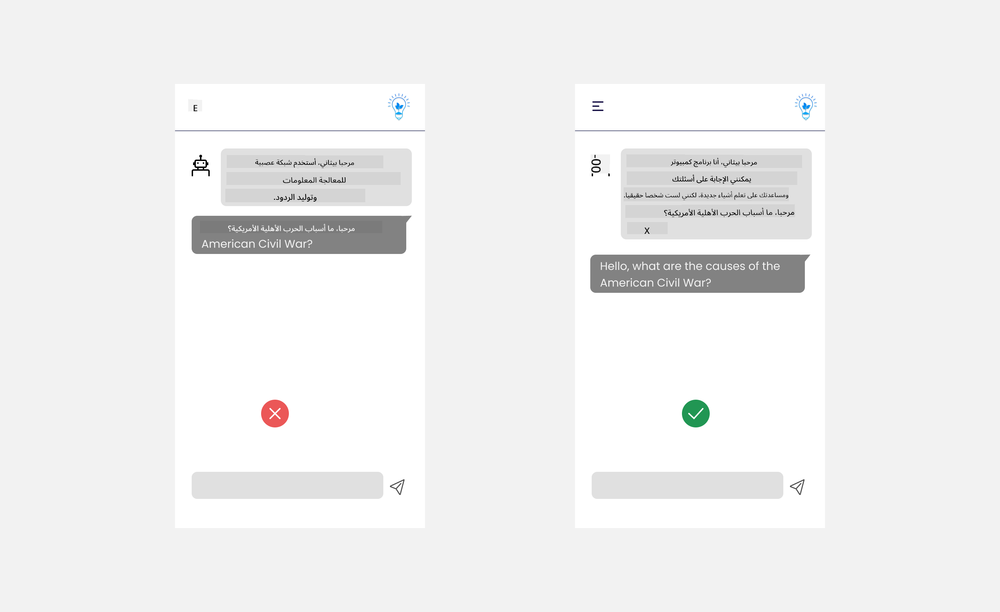

<!--
CO_OP_TRANSLATOR_METADATA:
{
  "original_hash": "78bbeed50fd4dc9fdee931f5daf98cb3",
  "translation_date": "2025-10-17T13:01:20+00:00",
  "source_file": "12-designing-ux-for-ai-applications/README.md",
  "language_code": "ar"
}
-->
# تصميم تجربة المستخدم لتطبيقات الذكاء الاصطناعي

> _(اضغط على الصورة أعلاه لمشاهدة فيديو الدرس)_

تجربة المستخدم هي جانب مهم جدًا في بناء التطبيقات. يحتاج المستخدمون إلى القدرة على استخدام تطبيقك بطريقة فعالة لأداء المهام. الكفاءة شيء مهم، ولكن يجب أيضًا تصميم التطبيقات بحيث يمكن استخدامها من قبل الجميع، لجعلها _متاحة_. سيركز هذا الفصل على هذا المجال حتى تتمكن من تصميم تطبيق يمكن للناس استخدامه ويرغبون في استخدامه.

## المقدمة

تجربة المستخدم هي الطريقة التي يتفاعل بها المستخدم مع منتج أو خدمة معينة سواء كان نظامًا أو أداة أو تصميمًا. عند تطوير تطبيقات الذكاء الاصطناعي، لا يركز المطورون فقط على ضمان أن تكون تجربة المستخدم فعالة، بل أيضًا أخلاقية. في هذا الدرس، سنتناول كيفية بناء تطبيقات الذكاء الاصطناعي التي تلبي احتياجات المستخدم.

سيغطي الدرس المجالات التالية:

- مقدمة عن تجربة المستخدم وفهم احتياجات المستخدم
- تصميم تطبيقات الذكاء الاصطناعي للثقة والشفافية
- تصميم تطبيقات الذكاء الاصطناعي للتعاون والتغذية الراجعة

## أهداف التعلم

بعد الانتهاء من هذا الدرس، ستكون قادرًا على:

- فهم كيفية بناء تطبيقات الذكاء الاصطناعي التي تلبي احتياجات المستخدم.
- تصميم تطبيقات الذكاء الاصطناعي التي تعزز الثقة والتعاون.

### المتطلبات الأساسية

خذ بعض الوقت واقرأ المزيد عن [تجربة المستخدم والتفكير التصميمي.](https://learn.microsoft.com/training/modules/ux-design?WT.mc_id=academic-105485-koreyst)

## مقدمة عن تجربة المستخدم وفهم احتياجات المستخدم

في شركتنا التعليمية الافتراضية، لدينا نوعان رئيسيان من المستخدمين، المعلمون والطلاب. لكل من المستخدمين احتياجات فريدة. يركز التصميم الذي يتمحور حول المستخدم على ضمان أن تكون المنتجات ذات صلة ومفيدة لأولئك الذين تم تصميمها لهم.

يجب أن يكون التطبيق **مفيدًا، موثوقًا، متاحًا وممتعًا** لتوفير تجربة مستخدم جيدة.

### الفائدة

كون التطبيق مفيدًا يعني أن لديه وظائف تتناسب مع الغرض المقصود منه، مثل أتمتة عملية التصحيح أو إنشاء بطاقات تعليمية للمراجعة. يجب أن يكون التطبيق الذي يقوم بأتمتة عملية التصحيح قادرًا على تخصيص الدرجات بدقة وكفاءة لأعمال الطلاب بناءً على معايير محددة مسبقًا. وبالمثل، يجب أن يكون التطبيق الذي ينشئ بطاقات تعليمية للمراجعة قادرًا على إنشاء أسئلة ذات صلة ومتنوعة بناءً على بياناته.

### الموثوقية

كون التطبيق موثوقًا يعني أنه يمكنه أداء مهمته باستمرار وبدون أخطاء. ومع ذلك، الذكاء الاصطناعي مثل البشر ليس مثاليًا وقد يكون عرضة للأخطاء. قد تواجه التطبيقات أخطاء أو مواقف غير متوقعة تتطلب تدخلًا أو تصحيحًا بشريًا. كيف تتعامل مع الأخطاء؟ في القسم الأخير من هذا الدرس، سنتناول كيفية تصميم أنظمة وتطبيقات الذكاء الاصطناعي للتعاون والتغذية الراجعة.

### الإتاحة

كون التطبيق متاحًا يعني توسيع تجربة المستخدم لتشمل المستخدمين ذوي القدرات المختلفة، بما في ذلك ذوي الإعاقة، لضمان عدم استبعاد أي شخص. من خلال اتباع إرشادات ومبادئ الإتاحة، تصبح حلول الذكاء الاصطناعي أكثر شمولية وقابلية للاستخدام ومفيدة لجميع المستخدمين.

### المتعة

كون التطبيق ممتعًا يعني أنه ممتع للاستخدام. يمكن أن يكون لتجربة المستخدم الجذابة تأثير إيجابي على المستخدم، مما يشجعه على العودة إلى التطبيق وزيادة الإيرادات.

ليس كل تحدٍ يمكن حله باستخدام الذكاء الاصطناعي. يأتي الذكاء الاصطناعي ليعزز تجربة المستخدم، سواء كان ذلك بأتمتة المهام اليدوية أو تخصيص تجارب المستخدم.

## تصميم تطبيقات الذكاء الاصطناعي للثقة والشفافية

بناء الثقة أمر بالغ الأهمية عند تصميم تطبيقات الذكاء الاصطناعي. الثقة تضمن أن المستخدم واثق من أن التطبيق سينجز العمل، ويقدم النتائج باستمرار، وأن النتائج هي ما يحتاجه المستخدم. الخطر في هذا المجال هو انعدام الثقة أو الثقة الزائدة. يحدث انعدام الثقة عندما يكون لدى المستخدم القليل من الثقة أو لا يثق في نظام الذكاء الاصطناعي، مما يؤدي إلى رفض المستخدم لتطبيقك. تحدث الثقة الزائدة عندما يبالغ المستخدم في تقدير قدرة نظام الذكاء الاصطناعي، مما يؤدي إلى ثقة المستخدم الزائدة في النظام. على سبيل المثال، قد يؤدي نظام التصحيح الآلي في حالة الثقة الزائدة إلى عدم قيام المعلم بمراجعة بعض الأوراق للتأكد من أن نظام التصحيح يعمل بشكل جيد. قد يؤدي ذلك إلى درجات غير عادلة أو غير دقيقة للطلاب، أو فقدان فرص للتغذية الراجعة والتحسين.

طريقتان لضمان وضع الثقة في مركز التصميم هما التفسيرية والتحكم.

### التفسيرية

عندما يساعد الذكاء الاصطناعي في اتخاذ قرارات مثل نقل المعرفة إلى الأجيال القادمة، من المهم للمعلمين وأولياء الأمور فهم كيفية اتخاذ الذكاء الاصطناعي للقرارات. هذه هي التفسيرية - فهم كيفية اتخاذ تطبيقات الذكاء الاصطناعي للقرارات. يشمل التصميم للتفسيرية إضافة تفاصيل توضح كيفية وصول الذكاء الاصطناعي إلى النتيجة. يجب أن يكون الجمهور على دراية بأن النتيجة تم إنشاؤها بواسطة الذكاء الاصطناعي وليس إنسانًا. على سبيل المثال، بدلاً من قول "ابدأ الدردشة مع معلمك الآن"، قل "استخدم معلم الذكاء الاصطناعي الذي يتكيف مع احتياجاتك ويساعدك على التعلم وفقًا لوتيرتك."

مثال آخر هو كيفية استخدام الذكاء الاصطناعي لبيانات المستخدم والبيانات الشخصية. على سبيل المثال، قد يكون لدى المستخدم بشخصية الطالب قيود بناءً على شخصيته. قد لا يتمكن الذكاء الاصطناعي من الكشف عن إجابات الأسئلة ولكنه قد يساعد في توجيه المستخدم للتفكير في كيفية حل المشكلة.

جزء آخر مهم من التفسيرية هو تبسيط التفسيرات. قد لا يكون الطلاب والمعلمون خبراء في الذكاء الاصطناعي، لذلك يجب أن تكون تفسيرات ما يمكن للتطبيق القيام به أو عدم القيام به مبسطة وسهلة الفهم.

### التحكم

يخلق الذكاء الاصطناعي التوليدي تعاونًا بين الذكاء الاصطناعي والمستخدم، حيث يمكن للمستخدم على سبيل المثال تعديل التعليمات للحصول على نتائج مختلفة. بالإضافة إلى ذلك، بمجرد إنشاء نتيجة، يجب أن يكون المستخدمون قادرين على تعديل النتائج مما يمنحهم إحساسًا بالتحكم. على سبيل المثال، عند استخدام Bing، يمكنك تخصيص التعليمات بناءً على التنسيق والنبرة والطول. بالإضافة إلى ذلك، يمكنك إجراء تغييرات على النتيجة وتعديلها كما هو موضح أدناه:

ميزة أخرى في Bing تسمح للمستخدم بالتحكم في التطبيق هي القدرة على الاشتراك أو إلغاء الاشتراك في البيانات التي يستخدمها الذكاء الاصطناعي. بالنسبة لتطبيق المدرسة، قد يرغب الطالب في استخدام ملاحظاته بالإضافة إلى موارد المعلم كمادة للمراجعة.

> عند تصميم تطبيقات الذكاء الاصطناعي، يجب أن تكون النية واضحة لضمان عدم ثقة المستخدمين الزائدة مما يؤدي إلى توقعات غير واقعية لقدراته. إحدى الطرق للقيام بذلك هي خلق احتكاك بين التعليمات والنتائج. تذكير المستخدم بأن هذا الذكاء الاصطناعي وليس إنسانًا.

## تصميم تطبيقات الذكاء الاصطناعي للتعاون والتغذية الراجعة

كما ذكرنا سابقًا، يخلق الذكاء الاصطناعي التوليدي تعاونًا بين المستخدم والذكاء الاصطناعي. معظم التفاعلات تكون مع إدخال المستخدم لتعليمات والذكاء الاصطناعي يولد نتيجة. ماذا لو كانت النتيجة غير صحيحة؟ كيف يتعامل التطبيق مع الأخطاء إذا حدثت؟ هل يلقي الذكاء الاصطناعي اللوم على المستخدم أم يأخذ الوقت لشرح الخطأ؟

يجب أن تكون تطبيقات الذكاء الاصطناعي مصممة لتلقي وإعطاء التغذية الراجعة. هذا لا يساعد فقط نظام الذكاء الاصطناعي على التحسن ولكن أيضًا يبني الثقة مع المستخدمين. يجب تضمين دورة التغذية الراجعة في التصميم، يمكن أن يكون مثالًا بسيطًا هو الإعجاب أو عدم الإعجاب بالنتيجة.

طريقة أخرى للتعامل مع هذا هي التواصل بوضوح حول قدرات النظام وحدوده. عندما يرتكب المستخدم خطأً يطلب شيئًا يتجاوز قدرات الذكاء الاصطناعي، يجب أن يكون هناك أيضًا طريقة للتعامل مع هذا، كما هو موضح أدناه.

الأخطاء النظامية شائعة في التطبيقات حيث قد يحتاج المستخدم إلى مساعدة بمعلومات خارج نطاق الذكاء الاصطناعي أو قد يكون للتطبيق حد على عدد الأسئلة/المواضيع التي يمكن للمستخدم إنشاء ملخصات لها. على سبيل المثال، قد لا يتمكن تطبيق الذكاء الاصطناعي المدرب على بيانات في مواضيع محدودة مثل التاريخ والرياضيات من التعامل مع أسئلة حول الجغرافيا. للتخفيف من ذلك، يمكن لنظام الذكاء الاصطناعي تقديم رد مثل: "عذرًا، تم تدريب منتجنا ببيانات في المواضيع التالية.....، لا يمكنني الرد على السؤال الذي طرحته."

تطبيقات الذكاء الاصطناعي ليست مثالية، لذلك من المتوقع أن ترتكب أخطاء. عند تصميم تطبيقاتك، يجب أن تضمن إنشاء مساحة للتغذية الراجعة من المستخدمين والتعامل مع الأخطاء بطريقة بسيطة وسهلة التفسير.

## المهمة

خذ أي تطبيقات ذكاء اصطناعي قمت ببنائها حتى الآن، وفكر في تنفيذ الخطوات التالية في تطبيقك:

- **المتعة:** فكر في كيفية جعل تطبيقك أكثر متعة. هل تضيف تفسيرات في كل مكان؟ هل تشجع المستخدم على الاستكشاف؟ كيف تصيغ رسائل الخطأ؟

- **الفائدة:** بناء تطبيق ويب. تأكد من أن تطبيقك يمكن التنقل فيه باستخدام كل من الماوس ولوحة المفاتيح.

- **الثقة والشفافية:** لا تثق تمامًا في الذكاء الاصطناعي ونتائجه، فكر في كيفية إضافة عنصر بشري للتحقق من النتائج. أيضًا، فكر في تنفيذ طرق أخرى لتحقيق الثقة والشفافية.

- **التحكم:** امنح المستخدم التحكم في البيانات التي يقدمها للتطبيق. نفذ طريقة يمكن للمستخدم الاشتراك أو إلغاء الاشتراك في جمع البيانات في تطبيق الذكاء الاصطناعي.

## واصل التعلم!

بعد إكمال هذا الدرس، تحقق من [مجموعة تعلم الذكاء الاصطناعي التوليدي](https://aka.ms/genai-collection?WT.mc_id=academic-105485-koreyst) لمواصلة تطوير معرفتك بالذكاء الاصطناعي التوليدي!

انتقل إلى الدرس 13، حيث سنتناول كيفية [تأمين تطبيقات الذكاء الاصطناعي](../13-securing-ai-applications/README.md?WT.mc_id=academic-105485-koreyst)!

---

**إخلاء المسؤولية**:  
تم ترجمة هذا المستند باستخدام خدمة الترجمة بالذكاء الاصطناعي [Co-op Translator](https://github.com/Azure/co-op-translator). بينما نسعى لتحقيق الدقة، يرجى العلم أن الترجمات الآلية قد تحتوي على أخطاء أو عدم دقة. يجب اعتبار المستند الأصلي بلغته الأصلية المصدر الرسمي. للحصول على معلومات حاسمة، يُوصى بالترجمة البشرية الاحترافية. نحن غير مسؤولين عن أي سوء فهم أو تفسيرات خاطئة ناتجة عن استخدام هذه الترجمة.