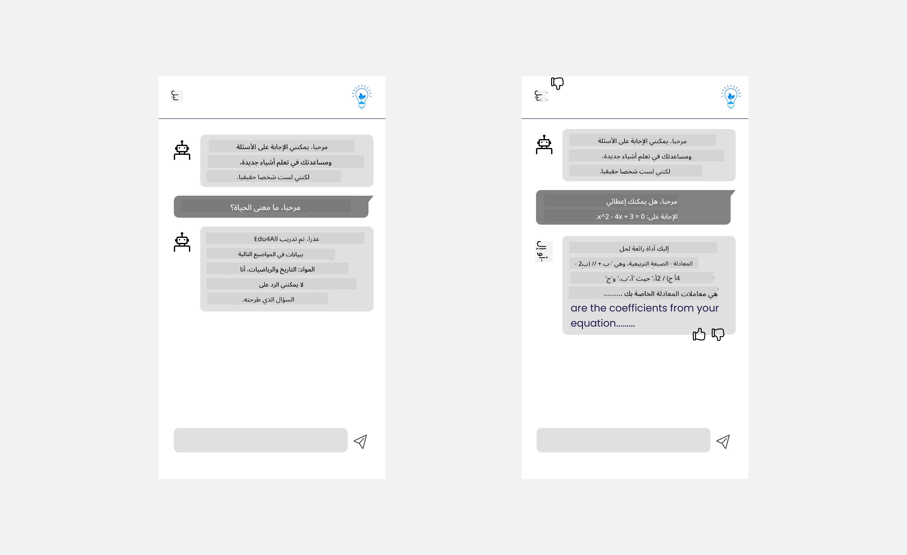

<!--
CO_OP_TRANSLATOR_METADATA:
{
  "original_hash": "ec385b41ee50579025d50cc03bfb3a25",
  "translation_date": "2025-07-09T14:49:30+00:00",
  "source_file": "12-designing-ux-for-ai-applications/README.md",
  "language_code": "ar"
}
-->
# تصميم تجربة المستخدم لتطبيقات الذكاء الاصطناعي

> _(انقر على الصورة أعلاه لمشاهدة فيديو الدرس)_

تجربة المستخدم هي جانب مهم جدًا في بناء التطبيقات. يحتاج المستخدمون إلى القدرة على استخدام تطبيقك بطريقة فعالة لأداء المهام. الكفاءة أمر مهم، ولكن يجب أيضًا تصميم التطبيقات بحيث يمكن للجميع استخدامها، لجعلها _متاحة_. سيركز هذا الفصل على هذا الجانب حتى تتمكن من تصميم تطبيق يرغب الناس في استخدامه ويستطيعون ذلك.

## مقدمة

تجربة المستخدم هي كيفية تفاعل المستخدم مع منتج أو خدمة معينة، سواء كان نظامًا أو أداة أو تصميمًا. عند تطوير تطبيقات الذكاء الاصطناعي، لا يركز المطورون فقط على ضمان فعالية تجربة المستخدم، بل أيضًا على كونها أخلاقية. في هذا الدرس، نغطي كيفية بناء تطبيقات الذكاء الاصطناعي التي تلبي احتياجات المستخدمين.

سيشمل الدرس المجالات التالية:

- مقدمة في تجربة المستخدم وفهم احتياجات المستخدم
- تصميم تطبيقات الذكاء الاصطناعي للثقة والشفافية
- تصميم تطبيقات الذكاء الاصطناعي للتعاون والتغذية الراجعة

## أهداف التعلم

بعد إتمام هذا الدرس، ستكون قادرًا على:

- فهم كيفية بناء تطبيقات الذكاء الاصطناعي التي تلبي احتياجات المستخدمين.
- تصميم تطبيقات الذكاء الاصطناعي التي تعزز الثقة والتعاون.

### المتطلبات السابقة

خذ بعض الوقت واقرأ المزيد عن [تجربة المستخدم والتفكير التصميمي.](https://learn.microsoft.com/training/modules/ux-design?WT.mc_id=academic-105485-koreyst)

## مقدمة في تجربة المستخدم وفهم احتياجات المستخدم

في شركتنا التعليمية الافتراضية، لدينا مستخدمان رئيسيان، المعلمون والطلاب. لكل من هذين المستخدمين احتياجات فريدة. التصميم المرتكز على المستخدم يعطي الأولوية للمستخدم لضمان أن تكون المنتجات ذات صلة ومفيدة لمن صممت لهم.

يجب أن يكون التطبيق **مفيدًا، موثوقًا، متاحًا وممتعًا** لتوفير تجربة مستخدم جيدة.

### سهولة الاستخدام

كون التطبيق مفيدًا يعني أن لديه وظائف تتناسب مع الغرض المقصود منه، مثل أتمتة عملية التصحيح أو إنشاء بطاقات مراجعة. يجب أن يكون التطبيق الذي يقوم بأتمتة التصحيح قادرًا على تقييم أعمال الطلاب بدقة وكفاءة بناءً على معايير محددة مسبقًا. وبالمثل، يجب أن يكون التطبيق الذي ينشئ بطاقات المراجعة قادرًا على توليد أسئلة متنوعة وذات صلة بناءً على بياناته.

### الموثوقية

كون التطبيق موثوقًا يعني أنه يمكنه أداء مهامه باستمرار وبدون أخطاء. ومع ذلك، الذكاء الاصطناعي مثل البشر ليس مثاليًا وقد يرتكب أخطاء. قد تواجه التطبيقات أخطاء أو مواقف غير متوقعة تتطلب تدخلًا بشريًا أو تصحيحًا. كيف تتعامل مع الأخطاء؟ في القسم الأخير من هذا الدرس، سنغطي كيفية تصميم أنظمة وتطبيقات الذكاء الاصطناعي للتعاون والتغذية الراجعة.

### الوصولية

كون التطبيق متاحًا يعني توسيع تجربة المستخدم لتشمل المستخدمين ذوي القدرات المختلفة، بما في ذلك ذوي الإعاقات، لضمان عدم استبعاد أي شخص. باتباع إرشادات ومبادئ الوصولية، تصبح حلول الذكاء الاصطناعي أكثر شمولية وقابلية للاستخدام ومفيدة لجميع المستخدمين.

### المتعة

كون التطبيق ممتعًا يعني أن استخدامه يبعث على السرور. يمكن لتجربة مستخدم جذابة أن تؤثر إيجابيًا على المستخدم، مما يشجعه على العودة إلى التطبيق وزيادة إيرادات العمل.

ليس كل تحد يمكن حله بالذكاء الاصطناعي. يأتي الذكاء الاصطناعي ليعزز تجربة المستخدم، سواء كان ذلك بأتمتة المهام اليدوية أو تخصيص تجارب المستخدم.

## تصميم تطبيقات الذكاء الاصطناعي للثقة والشفافية

بناء الثقة أمر حاسم عند تصميم تطبيقات الذكاء الاصطناعي. الثقة تضمن أن المستخدم واثق من أن التطبيق سينجز العمل، ويقدم النتائج باستمرار، وأن النتائج تلبي احتياجات المستخدم. من المخاطر في هذا المجال عدم الثقة والثقة المفرطة. عدم الثقة يحدث عندما يكون لدى المستخدم ثقة قليلة أو معدومة في نظام الذكاء الاصطناعي، مما يؤدي إلى رفض المستخدم لتطبيقك. أما الثقة المفرطة فتحدث عندما يبالغ المستخدم في تقدير قدرات نظام الذكاء الاصطناعي، مما يؤدي إلى اعتماد مفرط على النظام. على سبيل المثال، قد يؤدي نظام تصحيح آلي في حالة الثقة المفرطة إلى عدم مراجعة المعلم لبعض الأوراق للتأكد من جودة التصحيح، مما قد ينتج عنه درجات غير عادلة أو غير دقيقة للطلاب، أو فقدان فرص للتغذية الراجعة والتحسين.

طريقتان لضمان وضع الثقة في مركز التصميم هما الشرح والتحكم.

### الشرح

عندما يساعد الذكاء الاصطناعي في اتخاذ قرارات مثل نقل المعرفة للأجيال القادمة، من الضروري أن يفهم المعلمون وأولياء الأمور كيف يتم اتخاذ قرارات الذكاء الاصطناعي. هذا هو الشرح - فهم كيفية اتخاذ تطبيقات الذكاء الاصطناعي للقرارات. يشمل التصميم للشرح إضافة تفاصيل وأمثلة عما يمكن أن يفعله تطبيق الذكاء الاصطناعي. على سبيل المثال، بدلاً من "ابدأ مع معلم الذكاء الاصطناعي"، يمكن للنظام استخدام: "لخص ملاحظاتك لمراجعة أسهل باستخدام الذكاء الاصطناعي."

مثال آخر هو كيفية استخدام الذكاء الاصطناعي لبيانات المستخدم والبيانات الشخصية. على سبيل المثال، قد يكون لدى المستخدم الذي يحمل شخصية طالب قيود بناءً على شخصيته. قد لا يتمكن الذكاء الاصطناعي من كشف إجابات الأسئلة لكنه قد يساعد المستخدم على التفكير في كيفية حل المشكلة.

جزء آخر مهم من الشرح هو تبسيط التفسيرات. قد لا يكون الطلاب والمعلمون خبراء في الذكاء الاصطناعي، لذلك يجب أن تكون تفسيرات ما يمكن أو لا يمكن للتطبيق القيام به مبسطة وسهلة الفهم.

### التحكم

يخلق الذكاء الاصطناعي التوليدي تعاونًا بين الذكاء الاصطناعي والمستخدم، حيث يمكن للمستخدم تعديل المطالبات للحصول على نتائج مختلفة. بالإضافة إلى ذلك، بمجرد إنشاء المخرجات، يجب أن يكون المستخدمون قادرين على تعديل النتائج مما يمنحهم شعورًا بالتحكم. على سبيل المثال، عند استخدام Bing، يمكنك تخصيص مطالبتك بناءً على التنسيق والنبرة والطول. بالإضافة إلى ذلك، يمكنك إضافة تغييرات إلى المخرجات وتعديلها كما هو موضح أدناه:

ميزة أخرى في Bing تتيح للمستخدم التحكم في التطبيق هي القدرة على الاشتراك أو إلغاء الاشتراك في البيانات التي يستخدمها الذكاء الاصطناعي. في تطبيق مدرسي، قد يرغب الطالب في استخدام ملاحظاته بالإضافة إلى موارد المعلمين كمادة للمراجعة.

> عند تصميم تطبيقات الذكاء الاصطناعي، النية الواضحة هي المفتاح لضمان عدم ثقة المستخدمين بشكل مفرط مما يخلق توقعات غير واقعية لقدراته. إحدى الطرق لتحقيق ذلك هي خلق نوع من الاحتكاك بين المطالبات والنتائج، لتذكير المستخدم بأن هذا الذكاء الاصطناعي وليس إنسانًا.

## تصميم تطبيقات الذكاء الاصطناعي للتعاون والتغذية الراجعة

كما ذُكر سابقًا، يخلق الذكاء الاصطناعي التوليدي تعاونًا بين المستخدم والذكاء الاصطناعي. معظم التفاعلات تكون بإدخال المستخدم لمطالبة والذكاء الاصطناعي يولد مخرجات. ماذا لو كانت المخرجات غير صحيحة؟ كيف يتعامل التطبيق مع الأخطاء إذا حدثت؟ هل يلوم الذكاء الاصطناعي المستخدم أم يأخذ وقتًا لشرح الخطأ؟

يجب بناء تطبيقات الذكاء الاصطناعي لتلقي وإعطاء التغذية الراجعة. هذا لا يساعد فقط في تحسين نظام الذكاء الاصطناعي، بل يبني أيضًا الثقة مع المستخدمين. يجب تضمين حلقة تغذية راجعة في التصميم، مثل إعطاء إبهام لأعلى أو لأسفل على المخرجات.

طريقة أخرى للتعامل مع هذا هي التواصل الواضح لقدرات النظام وحدوده. عندما يرتكب المستخدم خطأ بطلب شيء يتجاوز قدرات الذكاء الاصطناعي، يجب أن يكون هناك طريقة للتعامل مع ذلك، كما هو موضح أدناه.

الأخطاء في النظام شائعة في التطبيقات حيث قد يحتاج المستخدم إلى مساعدة بمعلومات خارج نطاق الذكاء الاصطناعي أو قد يكون للتطبيق حد على عدد الأسئلة/المواد التي يمكن للمستخدم توليد ملخصات لها. على سبيل المثال، تطبيق ذكاء اصطناعي مدرب على بيانات في مواد محدودة مثل التاريخ والرياضيات قد لا يكون قادرًا على التعامل مع أسئلة حول الجغرافيا. للتخفيف من ذلك، يمكن للنظام أن يرد برسالة مثل: "عذرًا، تم تدريب منتجنا على البيانات في المواد التالية.....، لا أستطيع الرد على السؤال الذي طرحته."

تطبيقات الذكاء الاصطناعي ليست مثالية، لذلك من المتوقع أن ترتكب أخطاء. عند تصميم تطبيقاتك، يجب أن تضمن وجود مساحة لتلقي التغذية الراجعة من المستخدمين والتعامل مع الأخطاء بطريقة بسيطة وسهلة الفهم.

## المهمة

اختر أي تطبيقات ذكاء اصطناعي قمت ببنائها حتى الآن، وفكر في تنفيذ الخطوات التالية في تطبيقك:

- **المتعة:** فكر كيف يمكنك جعل تطبيقك أكثر متعة. هل تضيف تفسيرات في كل مكان؟ هل تشجع المستخدم على الاستكشاف؟ كيف تصيغ رسائل الخطأ؟

- **سهولة الاستخدام:** بناء تطبيق ويب. تأكد من أن تطبيقك يمكن التنقل فيه باستخدام الفأرة ولوحة المفاتيح.

- **الثقة والشفافية:** لا تثق بالذكاء الاصطناعي ومخرجاته بشكل كامل، فكر كيف تضيف عنصرًا بشريًا للتحقق من المخرجات. كما فكر وطبق طرقًا أخرى لتحقيق الثقة والشفافية.

- **التحكم:** امنح المستخدم التحكم في البيانات التي يقدمها للتطبيق. نفذ طريقة يمكن للمستخدم من خلالها الاشتراك أو إلغاء الاشتراك في جمع البيانات في تطبيق الذكاء الاصطناعي.

## واصل تعلمك!

بعد إكمال هذا الدرس، اطلع على [مجموعة تعلم الذكاء الاصطناعي التوليدي](https://aka.ms/genai-collection?WT.mc_id=academic-105485-koreyst) لمواصلة تطوير معرفتك في الذكاء الاصطناعي التوليدي!

توجه إلى الدرس 13، حيث سنناقش كيفية [تأمين تطبيقات الذكاء الاصطناعي](../13-securing-ai-applications/README.md?WT.mc_id=academic-105485-koreyst)!

**إخلاء المسؤولية**:  
تمت ترجمة هذا المستند باستخدام خدمة الترجمة الآلية [Co-op Translator](https://github.com/Azure/co-op-translator). بينما نسعى لتحقيق الدقة، يرجى العلم أن الترجمات الآلية قد تحتوي على أخطاء أو عدم دقة. يجب اعتبار المستند الأصلي بلغته الأصلية المصدر الموثوق به. للمعلومات الهامة، يُنصح بالاعتماد على الترجمة البشرية المهنية. نحن غير مسؤولين عن أي سوء فهم أو تفسير ناتج عن استخدام هذه الترجمة.