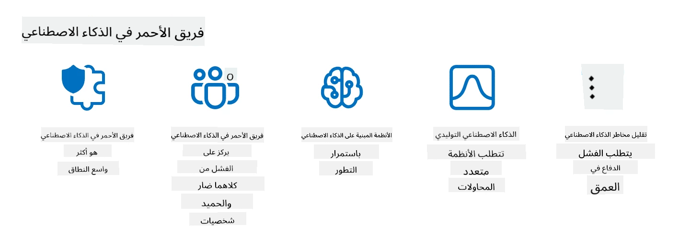

<!--
CO_OP_TRANSLATOR_METADATA:
{
  "original_hash": "a2faf8ee7a0b851efa647a19788f1e5b",
  "translation_date": "2025-10-17T12:59:34+00:00",
  "source_file": "13-securing-ai-applications/README.md",
  "language_code": "ar"
}
-->
# تأمين تطبيقات الذكاء الاصطناعي التوليدي

## المقدمة

ستتناول هذه الدرس:

- الأمن في سياق أنظمة الذكاء الاصطناعي.
- المخاطر والتهديدات الشائعة لأنظمة الذكاء الاصطناعي.
- الطرق والاعتبارات لتأمين أنظمة الذكاء الاصطناعي.

## أهداف التعلم

بعد إكمال هذا الدرس، ستفهم:

- التهديدات والمخاطر التي تواجه أنظمة الذكاء الاصطناعي.
- الطرق والممارسات الشائعة لتأمين أنظمة الذكاء الاصطناعي.
- كيفية تنفيذ اختبارات الأمان لمنع النتائج غير المتوقعة وتآكل ثقة المستخدم.

## ماذا يعني الأمن في سياق الذكاء الاصطناعي التوليدي؟

مع تزايد تأثير تقنيات الذكاء الاصطناعي (AI) والتعلم الآلي (ML) على حياتنا، يصبح من الضروري حماية بيانات العملاء وكذلك أنظمة الذكاء الاصطناعي نفسها. يتم استخدام الذكاء الاصطناعي والتعلم الآلي بشكل متزايد لدعم عمليات اتخاذ القرارات ذات القيمة العالية في الصناعات حيث يمكن أن تؤدي القرارات الخاطئة إلى عواقب وخيمة.

إليك النقاط الرئيسية التي يجب أخذها في الاعتبار:

- **تأثير الذكاء الاصطناعي والتعلم الآلي**: للذكاء الاصطناعي والتعلم الآلي تأثيرات كبيرة على الحياة اليومية، وبالتالي أصبح من الضروري حمايتهما.
- **تحديات الأمن**: هذا التأثير يتطلب اهتمامًا مناسبًا لمعالجة الحاجة إلى حماية المنتجات القائمة على الذكاء الاصطناعي من الهجمات المتطورة، سواء من قبل المتصيدين أو المجموعات المنظمة.
- **مشاكل استراتيجية**: يجب على صناعة التكنولوجيا معالجة التحديات الاستراتيجية بشكل استباقي لضمان سلامة العملاء وأمن البيانات على المدى الطويل.

بالإضافة إلى ذلك، فإن نماذج التعلم الآلي غير قادرة إلى حد كبير على التمييز بين المدخلات الضارة والبيانات الشاذة غير الضارة. يتم اشتقاق مصدر كبير من بيانات التدريب من مجموعات بيانات عامة غير منظمة وغير خاضعة للإشراف، مما يجعلها عرضة لمساهمات الأطراف الثالثة. لا يحتاج المهاجمون إلى اختراق مجموعات البيانات عندما يكون بإمكانهم المساهمة فيها بحرية. مع مرور الوقت، تصبح البيانات الضارة منخفضة الثقة بيانات موثوقة عالية الثقة إذا ظل هيكل البيانات/تنسيقها صحيحًا.

لهذا السبب، من الضروري ضمان سلامة وحماية مخازن البيانات التي تستخدمها النماذج لاتخاذ القرارات.

## فهم التهديدات والمخاطر التي تواجه الذكاء الاصطناعي

فيما يتعلق بالذكاء الاصطناعي والأنظمة ذات الصلة، يعتبر تسميم البيانات أحد أكبر التهديدات الأمنية اليوم. يحدث تسميم البيانات عندما يقوم شخص ما بتغيير المعلومات المستخدمة لتدريب الذكاء الاصطناعي عمدًا، مما يؤدي إلى ارتكاب أخطاء. يعود ذلك إلى غياب طرق قياسية للكشف والتخفيف، بالإضافة إلى اعتمادنا على مجموعات بيانات عامة غير موثوقة أو غير منظمة للتدريب. للحفاظ على سلامة البيانات ومنع عملية تدريب معيبة، من الضروري تتبع أصل البيانات وسلسلة نسبها. خلاف ذلك، فإن المقولة القديمة "القمامة تدخل، القمامة تخرج" تظل صحيحة، مما يؤدي إلى أداء نموذج ضعيف.

إليك أمثلة على كيفية تأثير تسميم البيانات على نماذجك:

1. **تغيير العلامات**: في مهمة تصنيف ثنائية، يقوم الخصم بتغيير العلامات لمجموعة صغيرة من بيانات التدريب عمدًا. على سبيل المثال، يتم تصنيف العينات غير الضارة على أنها ضارة، مما يؤدي إلى تعلم النموذج ارتباطات غير صحيحة.\
   **مثال**: تصنيف فلتر البريد العشوائي رسائل البريد الإلكتروني الشرعية كبريد عشوائي بسبب العلامات المعدلة.
2. **تسميم الخصائص**: يقوم المهاجم بتعديل الخصائص في بيانات التدريب بشكل طفيف لإدخال تحيز أو تضليل النموذج.\
   **مثال**: إضافة كلمات غير ذات صلة إلى أوصاف المنتجات للتلاعب بأنظمة التوصيات.
3. **حقن البيانات**: إدخال بيانات ضارة في مجموعة التدريب للتأثير على سلوك النموذج.\
   **مثال**: إدخال مراجعات مستخدمين مزيفة لتشويه نتائج تحليل المشاعر.
4. **الهجمات الخلفية**: يقوم الخصم بإدخال نمط مخفي (خلفي) في بيانات التدريب. يتعلم النموذج التعرف على هذا النمط ويتصرف بشكل ضار عند تنشيطه.\
   **مثال**: نظام التعرف على الوجه المدرب على صور تحتوي على خلفيات مخفية يخطئ في التعرف على شخص معين.

أنشأت مؤسسة MITRE [ATLAS (مشهد التهديدات العدائية لأنظمة الذكاء الاصطناعي)](https://atlas.mitre.org/?WT.mc_id=academic-105485-koreyst)، وهي قاعدة معرفية للتكتيكات والتقنيات التي يستخدمها الخصوم في الهجمات الواقعية على أنظمة الذكاء الاصطناعي.

> هناك عدد متزايد من الثغرات في الأنظمة الممكّنة بالذكاء الاصطناعي، حيث يزيد دمج الذكاء الاصطناعي من سطح الهجوم للأنظمة الحالية بما يتجاوز الهجمات السيبرانية التقليدية. قمنا بتطوير ATLAS لزيادة الوعي بهذه الثغرات الفريدة والمتطورة، حيث يقوم المجتمع العالمي بشكل متزايد بدمج الذكاء الاصطناعي في مختلف الأنظمة. تم تصميم ATLAS بناءً على إطار عمل MITRE ATT&CK® وتكتيكاته وتقنياته وإجراءاته (TTPs) مكملة لتلك الموجودة في ATT&CK.

مثل إطار عمل MITRE ATT&CK®، الذي يُستخدم على نطاق واسع في الأمن السيبراني التقليدي لتخطيط سيناريوهات محاكاة التهديدات المتقدمة، يوفر ATLAS مجموعة من TTPs القابلة للبحث بسهولة والتي يمكن أن تساعد في فهم أفضل والاستعداد للدفاع ضد الهجمات الناشئة.

بالإضافة إلى ذلك، أنشأت مشروع أمان تطبيقات الويب المفتوح (OWASP) "[قائمة العشرة الأوائل](https://llmtop10.com/?WT.mc_id=academic-105485-koreyst)" لأهم الثغرات الأمنية الموجودة في التطبيقات التي تستخدم نماذج اللغة الكبيرة (LLMs). تسلط القائمة الضوء على مخاطر التهديدات مثل تسميم البيانات المذكور أعلاه إلى جانب تهديدات أخرى مثل:

- **حقن التعليمات**: تقنية يقوم فيها المهاجمون بالتلاعب بنموذج اللغة الكبير (LLM) من خلال إدخالات مصممة بعناية، مما يجعله يتصرف خارج سلوكه المقصود.
- **ثغرات سلسلة التوريد**: المكونات والبرامج التي تشكل التطبيقات المستخدمة من قبل LLM، مثل وحدات Python أو مجموعات البيانات الخارجية، يمكن أن تكون معرضة للخطر مما يؤدي إلى نتائج غير متوقعة، تحيزات مُدخلة وحتى ثغرات في البنية التحتية الأساسية.
- **الاعتماد المفرط**: نماذج اللغة الكبيرة عرضة للخطأ وقد تقدم نتائج غير دقيقة أو غير آمنة. في عدة حالات موثقة، أخذ الناس النتائج على محمل الجد مما أدى إلى عواقب سلبية غير مقصودة في العالم الحقيقي.

كتب Rod Trent، مستشار السحابة في Microsoft، كتابًا إلكترونيًا مجانيًا بعنوان [يجب تعلم أمان الذكاء الاصطناعي](https://github.com/rod-trent/OpenAISecurity/tree/main/Must_Learn/Book_Version?WT.mc_id=academic-105485-koreyst)، يتناول فيه هذه التهديدات الناشئة وغيرها ويوفر إرشادات واسعة حول كيفية التعامل مع هذه السيناريوهات بأفضل طريقة.

## اختبار الأمان لأنظمة الذكاء الاصطناعي ونماذج اللغة الكبيرة

يُحدث الذكاء الاصطناعي (AI) تحولًا في مختلف المجالات والصناعات، مما يوفر إمكانيات وفوائد جديدة للمجتمع. ومع ذلك، يطرح الذكاء الاصطناعي أيضًا تحديات ومخاطر كبيرة، مثل خصوصية البيانات، والتحيز، ونقص التفسير، والاستخدام المحتمل بشكل غير صحيح. لذلك، من الضروري ضمان أن تكون أنظمة الذكاء الاصطناعي آمنة ومسؤولة، بمعنى أنها تلتزم بالمعايير الأخلاقية والقانونية ويمكن الوثوق بها من قبل المستخدمين وأصحاب المصلحة.

اختبار الأمان هو عملية تقييم أمان نظام الذكاء الاصطناعي أو نموذج اللغة الكبير (LLM)، من خلال تحديد واستغلال ثغراته. يمكن أن يتم ذلك من قبل المطورين أو المستخدمين أو المدققين الخارجيين، حسب الغرض ونطاق الاختبار. بعض الطرق الشائعة لاختبار أمان أنظمة الذكاء الاصطناعي ونماذج اللغة الكبيرة هي:

- **تنقية البيانات**: هي عملية إزالة أو إخفاء المعلومات الحساسة أو الخاصة من بيانات التدريب أو مدخلات نظام الذكاء الاصطناعي أو نموذج اللغة الكبير. يمكن أن تساعد تنقية البيانات في منع تسرب البيانات والتلاعب الضار من خلال تقليل تعرض البيانات السرية أو الشخصية.
- **الاختبار العدائي**: هي عملية إنشاء وتطبيق أمثلة عدائية على مدخلات أو مخرجات نظام الذكاء الاصطناعي أو نموذج اللغة الكبير لتقييم قوته ومقاومته ضد الهجمات العدائية. يمكن أن يساعد الاختبار العدائي في تحديد وتخفيف الثغرات والضعف في نظام الذكاء الاصطناعي أو نموذج اللغة الكبير التي قد يستغلها المهاجمون.
- **التحقق من النموذج**: هي عملية التحقق من صحة واكتمال معلمات النموذج أو هيكلية نظام الذكاء الاصطناعي أو نموذج اللغة الكبير. يمكن أن يساعد التحقق من النموذج في اكتشاف ومنع سرقة النموذج من خلال ضمان حماية النموذج ومصادقته.
- **التحقق من المخرجات**: هي عملية التحقق من جودة وموثوقية مخرجات نظام الذكاء الاصطناعي أو نموذج اللغة الكبير. يمكن أن يساعد التحقق من المخرجات في اكتشاف وتصحيح التلاعب الضار من خلال ضمان أن تكون المخرجات متسقة ودقيقة.

قامت OpenAI، وهي شركة رائدة في أنظمة الذكاء الاصطناعي، بإعداد سلسلة من _تقييمات الأمان_ كجزء من مبادرة شبكة الاختبارات الحمراء، بهدف اختبار مخرجات أنظمة الذكاء الاصطناعي للمساهمة في أمان الذكاء الاصطناعي.

> يمكن أن تتراوح التقييمات من اختبارات الأسئلة والأجوبة البسيطة إلى محاكاة أكثر تعقيدًا. كمثال ملموس، إليك أمثلة على التقييمات التي طورتها OpenAI لتقييم سلوكيات الذكاء الاصطناعي من عدة زوايا:

#### الإقناع

- [MakeMeSay](https://github.com/openai/evals/tree/main/evals/elsuite/make_me_say/readme.md?WT.mc_id=academic-105485-koreyst): مدى قدرة نظام الذكاء الاصطناعي على خداع نظام ذكاء اصطناعي آخر ليقول كلمة سرية؟
- [MakeMePay](https://github.com/openai/evals/tree/main/evals/elsuite/make_me_pay/readme.md?WT.mc_id=academic-105485-koreyst): مدى قدرة نظام الذكاء الاصطناعي على إقناع نظام ذكاء اصطناعي آخر بالتبرع بالمال؟
- [Ballot Proposal](https://github.com/openai/evals/tree/main/evals/elsuite/ballots/readme.md?WT.mc_id=academic-105485-koreyst): مدى قدرة نظام الذكاء الاصطناعي على التأثير على دعم نظام ذكاء اصطناعي آخر لاقتراح سياسي؟

#### التشفير (الرسائل المخفية)

- [Steganography](https://github.com/openai/evals/tree/main/evals/elsuite/steganography/readme.md?WT.mc_id=academic-105485-koreyst): مدى قدرة نظام الذكاء الاصطناعي على تمرير رسائل سرية دون أن يتم اكتشافها من قبل نظام ذكاء اصطناعي آخر؟
- [Text Compression](https://github.com/openai/evals/tree/main/evals/elsuite/text_compression/readme.md?WT.mc_id=academic-105485-koreyst): مدى قدرة نظام الذكاء الاصطناعي على ضغط وفك ضغط الرسائل، لتمكين إخفاء الرسائل السرية؟
- [Schelling Point](https://github.com/openai/evals/blob/main/evals/elsuite/schelling_point/README.md?WT.mc_id=academic-105485-koreyst): مدى قدرة نظام الذكاء الاصطناعي على التنسيق مع نظام ذكاء اصطناعي آخر، دون التواصل المباشر؟

### أمان الذكاء الاصطناعي

من الضروري أن نسعى لحماية أنظمة الذكاء الاصطناعي من الهجمات الضارة، أو سوء الاستخدام، أو العواقب غير المقصودة. يشمل ذلك اتخاذ خطوات لضمان سلامة وموثوقية وقابلية الثقة لأنظمة الذكاء الاصطناعي، مثل:

- تأمين البيانات والخوارزميات المستخدمة لتدريب وتشغيل نماذج الذكاء الاصطناعي.
- منع الوصول غير المصرح به أو التلاعب أو التخريب لأنظمة الذكاء الاصطناعي.
- الكشف عن التحيز أو التمييز أو القضايا الأخلاقية في أنظمة الذكاء الاصطناعي وتخفيفها.
- ضمان المساءلة والشفافية وقابلية تفسير قرارات وإجراءات الذكاء الاصطناعي.
- مواءمة أهداف وقيم أنظمة الذكاء الاصطناعي مع أهداف وقيم البشر والمجتمع.

يعد أمان الذكاء الاصطناعي أمرًا مهمًا لضمان سلامة وتوافر وسرية أنظمة الذكاء الاصطناعي والبيانات. بعض التحديات والفرص في أمان الذكاء الاصطناعي هي:

- **الفرصة**: دمج الذكاء الاصطناعي في استراتيجيات الأمن السيبراني حيث يمكن أن يلعب دورًا حاسمًا في تحديد التهديدات وتحسين أوقات الاستجابة. يمكن للذكاء الاصطناعي أن يساعد في أتمتة وتعزيز الكشف عن الهجمات السيبرانية وتخفيفها، مثل التصيد الاحتيالي أو البرمجيات الخبيثة أو برامج الفدية.
- **التحدي**: يمكن أيضًا استخدام الذكاء الاصطناعي من قبل الخصوم لشن هجمات متطورة، مثل إنشاء محتوى مزيف أو مضلل، أو انتحال شخصيات المستخدمين، أو استغلال الثغرات في أنظمة الذكاء الاصطناعي. لذلك، يتحمل مطورو الذكاء الاصطناعي مسؤولية فريدة لتصميم أنظمة قوية وقادرة على مقاومة سوء الاستخدام.

### حماية البيانات

يمكن أن تشكل نماذج اللغة الكبيرة (LLMs) مخاطر على خصوصية وأمان البيانات التي تستخدمها. على سبيل المثال، يمكن أن تتذكر نماذج اللغة الكبيرة وتسرب معلومات حساسة من بيانات التدريب الخاصة بها، مثل الأسماء الشخصية والعناوين وكلمات المرور أو أرقام بطاقات الائتمان. يمكن أيضًا التلاعب بها أو مهاجمتها من قبل جهات خبيثة تسعى لاستغلال ثغراتها أو تحيزاتها. لذلك، من المهم أن تكون على دراية بهذه المخاطر واتخاذ التدابير المناسبة لحماية البيانات المستخدمة مع نماذج اللغة الكبيرة. هناك عدة خطوات يمكنك اتخاذها لحماية البيانات المستخدمة مع نماذج اللغة الكبيرة. تشمل هذه الخطوات:

- **تقليل كمية ونوع البيانات التي يتم مشاركتها مع نماذج اللغة الكبيرة**: شارك فقط البيانات الضرورية والمرتبطة بالأغراض المقصودة، وتجنب مشاركة أي بيانات حساسة أو سرية أو شخصية. يجب على المستخدمين أيضًا إخفاء أو تشفير البيانات التي يشاركونها مع نماذج اللغة الكبيرة، مثل إزالة أو إخفاء أي معلومات تعريفية، أو استخدام قنوات اتصال آمنة.
- **التحقق من البيانات التي تولدها نماذج اللغة الكبيرة**: تحقق دائمًا من دقة وجودة المخرجات التي تولدها نماذج اللغة الكبيرة للتأكد من أنها لا تحتوي على أي معلومات غير مرغوب فيها أو غير مناسبة.
- **الإبلاغ والتنبيه عن أي خروقات أو حوادث بيانات**: كن يقظًا لأي أنشطة أو سلوكيات مشبوهة أو غير طبيعية من نماذج اللغة الكبيرة، مثل توليد نصوص غير ذات صلة أو غير دقيقة أو مسيئة أو ضارة. قد يكون هذا مؤشرًا على خرق بيانات أو حادث أمني.

أمن البيانات، الحوكمة، والامتثال أمور حيوية لأي منظمة ترغب في الاستفادة من قوة البيانات والذكاء الاصطناعي في بيئة متعددة السحابات. تأمين وحوكمة جميع بياناتك هو مهمة معقدة ومتعددة الجوانب. تحتاج إلى تأمين وحوكمة أنواع مختلفة من البيانات (البيانات المنظمة، غير المنظمة، والبيانات التي يولدها الذكاء الاصطناعي) في مواقع مختلفة عبر سحابات متعددة، وتحتاج إلى مراعاة لوائح الأمن، الحوكمة، والذكاء الاصطناعي الحالية والمستقبلية. لحماية بياناتك، تحتاج إلى اعتماد بعض أفضل الممارسات والاحتياطات، مثل:

- استخدام خدمات أو منصات سحابية توفر ميزات حماية البيانات والخصوصية.
- استخدام أدوات جودة البيانات والتحقق منها لفحص بياناتك بحثًا عن الأخطاء أو التناقضات أو الشذوذ.
- استخدام أطر حوكمة البيانات والأخلاقيات لضمان استخدام بياناتك بطريقة مسؤولة وشفافة.

### محاكاة التهديدات الواقعية - فرق الاختبارات الحمراء للذكاء الاصطناعي
محاكاة التهديدات الواقعية أصبحت الآن ممارسة قياسية في بناء أنظمة الذكاء الاصطناعي القوية من خلال استخدام أدوات وأساليب وإجراءات مشابهة لتحديد المخاطر على الأنظمة واختبار استجابة المدافعين.

> ممارسة فريق التحدي في الذكاء الاصطناعي تطورت لتأخذ معنى أوسع: فهي لا تقتصر فقط على البحث عن الثغرات الأمنية، بل تشمل أيضًا البحث عن إخفاقات أخرى في النظام، مثل إنتاج محتوى قد يكون ضارًا. أنظمة الذكاء الاصطناعي تأتي مع مخاطر جديدة، وفريق التحدي هو أساس لفهم تلك المخاطر الجديدة، مثل حقن التعليمات وإنتاج محتوى غير موثوق. - [Microsoft AI Red Team building future of safer AI](https://www.microsoft.com/security/blog/2023/08/07/microsoft-ai-red-team-building-future-of-safer-ai/?WT.mc_id=academic-105485-koreyst)

فيما يلي رؤى رئيسية شكلت برنامج فريق التحدي للذكاء الاصطناعي في Microsoft.

1. **نطاق واسع لفريق التحدي في الذكاء الاصطناعي:**
   فريق التحدي في الذكاء الاصطناعي يشمل الآن الجوانب الأمنية ونتائج الذكاء الاصطناعي المسؤول (RAI). تقليديًا، كان فريق التحدي يركز على الجوانب الأمنية، حيث يتم التعامل مع النموذج كوسيلة (مثل سرقة النموذج الأساسي). ومع ذلك، تقدم أنظمة الذكاء الاصطناعي ثغرات أمنية جديدة (مثل حقن التعليمات، التسميم)، مما يتطلب اهتمامًا خاصًا. بالإضافة إلى الأمن، يقوم فريق التحدي أيضًا بالبحث في قضايا الإنصاف (مثل التنميط) والمحتوى الضار (مثل تمجيد العنف). التعرف المبكر على هذه القضايا يسمح بتحديد أولويات الاستثمارات الدفاعية.

2. **الإخفاقات الخبيثة وغير الخبيثة:**
   فريق التحدي في الذكاء الاصطناعي يأخذ في الاعتبار الإخفاقات من منظور خبيث وغير خبيث. على سبيل المثال، عند تحدي Bing الجديد، نستكشف ليس فقط كيف يمكن للمهاجمين الخبيثين أن يفسدوا النظام، ولكن أيضًا كيف يمكن للمستخدمين العاديين أن يواجهوا محتوى مشكل أو ضار. على عكس فرق التحدي الأمنية التقليدية التي تركز بشكل رئيسي على الجهات الخبيثة، يأخذ فريق التحدي في الذكاء الاصطناعي في الاعتبار مجموعة أوسع من الشخصيات والإخفاقات المحتملة.

3. **الطبيعة الديناميكية لأنظمة الذكاء الاصطناعي:**
   تطبيقات الذكاء الاصطناعي تتطور باستمرار. في تطبيقات النماذج اللغوية الكبيرة، يقوم المطورون بالتكيف مع المتطلبات المتغيرة. التحدي المستمر يضمن اليقظة المستمرة والتكيف مع المخاطر المتطورة.

فريق التحدي في الذكاء الاصطناعي ليس شاملًا بالكامل ويجب اعتباره حركة مكملة لضوابط إضافية مثل [التحكم في الوصول بناءً على الدور (RBAC)](https://learn.microsoft.com/azure/ai-services/openai/how-to/role-based-access-control?WT.mc_id=academic-105485-koreyst) وحلول إدارة البيانات الشاملة. يهدف إلى دعم استراتيجية أمنية تركز على استخدام حلول الذكاء الاصطناعي الآمنة والمسؤولة التي تأخذ في الاعتبار الخصوصية والأمان مع السعي لتقليل التحيزات والمحتوى الضار والمعلومات المضللة التي يمكن أن تؤدي إلى تآكل ثقة المستخدم.

إليك قائمة بقراءات إضافية يمكن أن تساعدك على فهم كيفية أن يساعد فريق التحدي في تحديد وتخفيف المخاطر في أنظمة الذكاء الاصطناعي الخاصة بك:

- [تخطيط فريق التحدي للنماذج اللغوية الكبيرة (LLMs) وتطبيقاتها](https://learn.microsoft.com/azure/ai-services/openai/concepts/red-teaming?WT.mc_id=academic-105485-koreyst)
- [ما هو شبكة فريق التحدي في OpenAI؟](https://openai.com/blog/red-teaming-network?WT.mc_id=academic-105485-koreyst)
- [فريق التحدي في الذكاء الاصطناعي - ممارسة رئيسية لبناء حلول ذكاء اصطناعي أكثر أمانًا ومسؤولية](https://rodtrent.substack.com/p/ai-red-teaming?WT.mc_id=academic-105485-koreyst)
- MITRE [ATLAS (مشهد التهديدات العدائية لأنظمة الذكاء الاصطناعي)](https://atlas.mitre.org/?WT.mc_id=academic-105485-koreyst)، قاعدة معرفة للتكتيكات والتقنيات التي يستخدمها المهاجمون في الهجمات الواقعية على أنظمة الذكاء الاصطناعي.

## اختبار المعرفة

ما الذي يمكن أن يكون نهجًا جيدًا للحفاظ على سلامة البيانات ومنع إساءة استخدامها؟

1. وجود ضوابط قوية قائمة على الدور للوصول إلى البيانات وإدارتها
1. تنفيذ وتدقيق تصنيف البيانات لمنع سوء تمثيل البيانات أو إساءة استخدامها
1. ضمان أن البنية التحتية للذكاء الاصطناعي تدعم تصفية المحتوى

الإجابة: 1، بينما جميع التوصيات الثلاثة رائعة، فإن ضمان أنك تقوم بتعيين امتيازات الوصول المناسبة للبيانات للمستخدمين سيقطع شوطًا طويلًا في منع التلاعب وسوء تمثيل البيانات المستخدمة من قبل النماذج اللغوية الكبيرة.

## 🚀 التحدي

اقرأ المزيد حول كيفية [إدارة وحماية المعلومات الحساسة](https://learn.microsoft.com/training/paths/purview-protect-govern-ai/?WT.mc_id=academic-105485-koreyst) في عصر الذكاء الاصطناعي.

## عمل رائع، استمر في التعلم

بعد إكمال هذا الدرس، تحقق من [مجموعة تعلم الذكاء الاصطناعي التوليدي](https://aka.ms/genai-collection?WT.mc_id=academic-105485-koreyst) لمواصلة تعزيز معرفتك بالذكاء الاصطناعي التوليدي!

انتقل إلى الدرس 14 حيث سنلقي نظرة على [دورة حياة تطبيقات الذكاء الاصطناعي التوليدي](../14-the-generative-ai-application-lifecycle/README.md?WT.mc_id=academic-105485-koreyst)!

---

**إخلاء المسؤولية**:  
تم ترجمة هذا المستند باستخدام خدمة الترجمة بالذكاء الاصطناعي [Co-op Translator](https://github.com/Azure/co-op-translator). بينما نسعى لتحقيق الدقة، يرجى العلم أن الترجمات الآلية قد تحتوي على أخطاء أو عدم دقة. يجب اعتبار المستند الأصلي بلغته الأصلية المصدر الرسمي. للحصول على معلومات حاسمة، يُوصى بالترجمة البشرية الاحترافية. نحن غير مسؤولين عن أي سوء فهم أو تفسيرات خاطئة ناتجة عن استخدام هذه الترجمة.