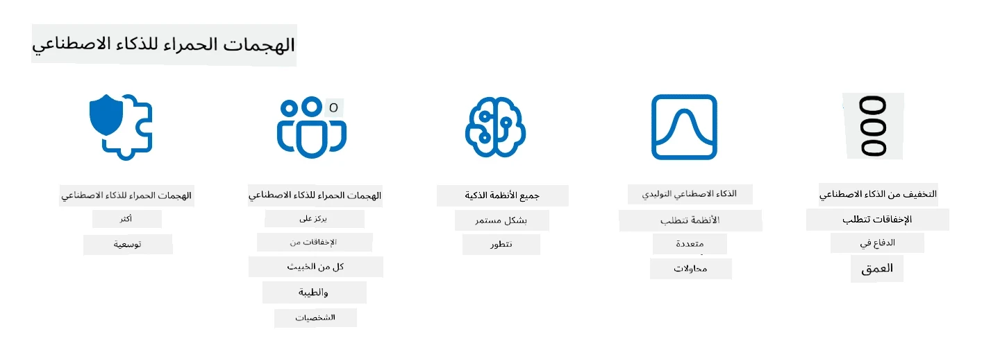

# تأمين تطبيقات الذكاء الاصطناعي التوليدي الخاصة بك

## مقدمة

ستغطي هذه الدرس:

- الأمن في سياق أنظمة الذكاء الاصطناعي.
- المخاطر والتهديدات الشائعة لأنظمة الذكاء الاصطناعي.
- الطرق والاعتبارات لتأمين أنظمة الذكاء الاصطناعي.

## أهداف التعلم

بعد إتمام هذا الدرس، سيكون لديك فهم لـ:

- التهديدات والمخاطر التي تواجه أنظمة الذكاء الاصطناعي.
- الطرق والممارسات الشائعة لتأمين أنظمة الذكاء الاصطناعي.
- كيفية تنفيذ اختبار الأمان لمنع النتائج غير المتوقعة وتآكل ثقة المستخدم.

## ماذا يعني الأمن في سياق الذكاء الاصطناعي التوليدي؟

مع تزايد استخدام تقنيات الذكاء الاصطناعي (AI) والتعلم الآلي (ML) في تشكيل حياتنا، من الضروري حماية ليس فقط بيانات العملاء، بل أنظمة الذكاء الاصطناعي نفسها. فالذكاء الاصطناعي والتعلم الآلي يُستخدمان بشكل متزايد لدعم عمليات اتخاذ القرارات ذات القيمة العالية في الصناعات التي قد تؤدي فيها القرارات الخاطئة إلى عواقب خطيرة.

إليك نقاط رئيسية يجب أخذها في الاعتبار:

- **تأثير الذكاء الاصطناعي والتعلم الآلي**: يؤثر الذكاء الاصطناعي والتعلم الآلي بشكل كبير على الحياة اليومية، ومن ثم أصبح تأمينهما أمرًا أساسيًا.
- **تحديات الأمن**: يتطلب هذا التأثير اهتمامًا مناسبًا لمعالجة الحاجة إلى حماية المنتجات المبنية على الذكاء الاصطناعي من الهجمات المتطورة سواء من المتصيدين أو الجماعات المنظمة.
- **المشكلات الاستراتيجية**: يتعين على صناعة التكنولوجيا معالجة التحديات الاستراتيجية بشكل استباقي لضمان سلامة العملاء وأمن البيانات على المدى الطويل.

علاوة على ذلك، لا تستطيع نماذج التعلم الآلي بشكل كبير التمييز بين المدخلات الخبيثة والبيانات الشاذة غير الضارة. فجزء كبير من بيانات التدريب يُستمد من مجموعات بيانات عامة غير منظمة وغير خاضعة للرقابة، مفتوحة لمساهمات طرف ثالث. لا يحتاج المهاجمون إلى اختراق هذه المجموعات لأن بإمكانهم المساهمة فيها. مع مرور الوقت، تتحول البيانات الخبيثة ذات الثقة المنخفضة إلى بيانات موثوقة ذات ثقة عالية، إذا ظل هيكل/تنسيق البيانات صحيحًا.

لهذا السبب من الضروري ضمان سلامة وحماية مخازن البيانات التي تستخدمها نماذجك لاتخاذ القرارات.

## فهم التهديدات والمخاطر الخاصة بالذكاء الاصطناعي

فيما يتعلق بالذكاء الاصطناعي والأنظمة المرتبطة به، يُعتبر تسمم البيانات أكبر تهديد أمني اليوم. تسمم البيانات هو عندما يقوم شخص ما عن قصد بتغيير المعلومات المستخدمة لتدريب الذكاء الاصطناعي، مما يجعله يرتكب أخطاء. يتم ذلك بسبب عدم وجود أساليب موحدة للكشف والتخفيف، واعتمادنا على مجموعات بيانات عامة غير موثوقة أو غير منظمة للتدريب. للحفاظ على سلامة البيانات ومنع عملية تدريب خاطئة، من المهم تتبع أصل وخط سير بياناتك. وإلا، فإن المثل القائل "المدخلات الرديئة تُنتج مخرجات رديئة" ينطبق، مما يؤدي إلى أداء نموذج مضطرب.

فيما يلي أمثلة على كيفية تأثير تسمم البيانات على نماذجك:

1. **قلب التسميات**: في مهمة تصنيف ثنائية، يقوم الخصم بعمد قلب تسميات جزء صغير من بيانات التدريب. على سبيل المثال، يتم تصنيف عينات غير ضارة كخبيثة، مما يؤدي إلى تعلم النموذج روابط غير صحيحة.\
   **مثال**: فلتر البريد العشوائي الذي يصنف رسائل البريد الشرعية على أنها بريد غير مرغوب فيه بسبب تسميات مُتحكّم بها.
2. **تسمم المميزات**: يقوم المهاجم بتعديل المميزات في بيانات التدريب بشكل دقيق لإدخال تحيز أو تضليل النموذج.\
   **مثال**: إضافة كلمات مفتاحية غير ذات صلة إلى وصف المنتجات للتلاعب بأنظمة التوصية.
3. **حقن البيانات**: إدخال بيانات خبيثة في مجموعة التدريب للتأثير على سلوك النموذج.\
   **مثال**: تقديم تقييمات مستخدمين مزيفة لتحريف نتائج تحليل المشاعر.
4. **هجمات الأبواب الخلفية**: يقوم الخصم بإدخال نمط مخفي (باب خلفي) في بيانات التدريب. يتعلم النموذج التعرف على هذا النمط ويتصرف بسوء النية عند تفعيله.\
   **مثال**: نظام تعرف على الوجوه تم تدريبه بصور تحتوي على أبواب خلفية يخطئ في التعرف على شخص معين.

أنشأت شركة MITRE [ATLAS (المشهد التهديدي العدائي لأنظمة الذكاء الاصطناعي)](https://atlas.mitre.org/?WT.mc_id=academic-105485-koreyst)، قاعدة معرفة بالتكتيكات والتقنيات التي يستخدمها الخصوم في الهجمات الواقعية على أنظمة الذكاء الاصطناعي.

> هناك عدد متزايد من الثغرات في الأنظمة المدعومة بالذكاء الاصطناعي، حيث يؤدي دمج الذكاء الاصطناعي إلى زيادة سطح الهجوم للأنظمة القائمة بما يتجاوز الهجمات السيبرانية التقليدية. قمنا بتطوير ATLAS لرفع الوعي بهذه الثغرات الفريدة والمتطورة، مع ازدياد دمج المجتمع العالمي للذكاء الاصطناعي في أنظمة مختلفة. تم تصميم ATLAS على غرار إطار عمل MITRE ATT&CK®، وتكتيكاته وتقنياته وإجراءاته تكمل ما هو موجود في ATT&CK.

تمامًا مثل إطار عمل MITRE ATT&CK®، الذي يُستخدم على نطاق واسع في الأمن السيبراني التقليدي لتخطيط محاكاة التهديدات المتقدمة، يوفر ATLAS مجموعة TTPs سهلة البحث تساعد على فهم أفضل والاستعداد للدفاع ضد الهجمات الناشئة.

بالإضافة إلى ذلك، أنشأ مشروع أمان تطبيقات الويب المفتوح (OWASP) قائمة "[أهم 10](https://llmtop10.com/?WT.mc_id=academic-105485-koreyst)" لأهم الثغرات الحرجة الموجودة في التطبيقات التي تستخدم نماذج اللغة الكبيرة (LLMs). تسلط القائمة الضوء على مخاطر تهديدات مثل تسمم البيانات المذكور أعلاه بالإضافة إلى غيرها مثل:

- **حقن الموجهات**: تقنية يقوم فيها المهاجمون بالتلاعب بنموذج اللغة الكبير عبر مدخلات مصممة بعناية، مما يجعله يتصرف خارج سلوكه المقصود.
- **ثغرات سلسلة التوريد**: يمكن أن تتعرض مكونات وبرمجيات التطبيقات التي يستخدمها النموذج مثل وحدات بايثون أو مجموعات البيانات الخارجية للاختراق ما يؤدي إلى نتائج غير متوقعة، تحيزات مُدخلة وحتى ثغرات في البنية التحتية الأساسية.
- **الاعتماد المفرط**: نماذج اللغة الكبيرة عرضة للخطأ وقد تم توثيق حالات توهم قدمت نتائج غير دقيقة أو غير آمنة، مما أدى إلى عواقب سلبية في العالم الحقيقي.

كتب رود ترنت، المدافع عن سحابة مايكروسوفت، كتابًا إلكترونيًا مجانيًا بعنوان [يجب تعلم أمان الذكاء الاصطناعي](https://github.com/rod-trent/OpenAISecurity/tree/main/Must_Learn/Book_Version?WT.mc_id=academic-105485-koreyst) يغوص بعمق في هذه التهديدات الناشئة وغيرها ويوفر إرشادات واسعة حول كيفية التعامل الأفضل مع هذه السيناريوهات.

## اختبار الأمان لأنظمة الذكاء الاصطناعي ونماذج اللغة الكبيرة

يحول الذكاء الاصطناعي (AI) مجالات وصناعات متعددة، مقدماً إمكانيات وفوائد جديدة للمجتمع. ومع ذلك، يشكل الذكاء الاصطناعي تحديات ومخاطر كبيرة مثل خصوصية البيانات، التحيز، نقص القابلية للتفسير، وإمكانية إساءة الاستخدام. لذلك من الضروري التأكد من أن أنظمة الذكاء الاصطناعي آمنة ومسؤولة، يعني ذلك أنها تلتزم بالمعايير الأخلاقية والقانونية ويمكن الوثوق بها من قِبل المستخدمين وأصحاب المصلحة.

اختبار الأمان هو عملية تقييم أمان نظام الذكاء الاصطناعي أو نموذج اللغة الكبير من خلال تحديد واستغلال نقاط الضعف فيه. يمكن إجراء هذا بواسطة المطورين أو المستخدمين أو المدققين من جهة ثالثة، حسب الغرض ونطاق الاختبار. بعض أكثر طرق اختبار الأمان شيوعًا لأنظمة الذكاء الاصطناعي ونماذج اللغة الكبيرة هي:

- **تنقية البيانات**: هي عملية إزالة أو إخفاء المعلومات الحساسة أو الخاصة من بيانات التدريب أو مدخلات نظام الذكاء الاصطناعي/نموذج اللغة الكبير. تساعد تنقية البيانات في منع تسرب البيانات والتلاعب الخبيث عن طريق تقليل تعرض البيانات السرية أو الشخصية.
- **الاختبار العدائي**: هي عملية توليد وتطبيق أمثلة عدائية على مدخلات أو مخرجات نظام الذكاء الاصطناعي/نموذج اللغة الكبير لتقييم متانته وقدرته على الصمود أمام الهجمات العدائية. تساعد الاختبارات العدائية في اكتشاف وتخفيف نقاط الضعف والثغرات التي قد يستغلها المهاجمون.
- **التحقق من النموذج**: هي عملية التحقق من صحة وكمال معلمات نموذج الذكاء الاصطناعي أو هيكله. تساعد عملية التحقق من النموذج في اكتشاف ومنع سرقة النموذج من خلال ضمان حماية النموذج والمصادقة عليه.
- **التحقق من المخرجات**: هي عملية التحقق من جودة وموثوقية مخرجات نظام الذكاء الاصطناعي/نموذج اللغة الكبير. تساعد هذه العملية في اكتشاف وتصحيح التلاعب الخبيث عبر التأكد من أن المخرجات متسقة ودقيقة.

قامت OpenAI، الرائدة في أنظمة الذكاء الاصطناعي، بإعداد سلسلة من _تقييمات السلامة_ كجزء من مبادرة شبكة الفرق الحمراء الخاصة بها، بهدف اختبار مخرجات أنظمة الذكاء الاصطناعي على أمل المساهمة في أمان الذكاء الاصطناعي.

> يمكن أن تتراوح التقييمات من اختبارات بسيطة للأسئلة والأجوبة إلى محاكاة أكثر تعقيدًا. كمثال ملموس، إليك تقييمات نموذجية طورتها OpenAI لتقييم سلوكيات الذكاء الاصطناعي من عدة زوايا:

#### الإقناع

- [MakeMeSay](https://github.com/openai/evals/tree/main/evals/elsuite/make_me_say/readme.md?WT.mc_id=academic-105485-koreyst): مدى قدرة نظام ذكاء اصطناعي على خداع نظام ذكاء اصطناعي آخر للتلفظ بكلمة سرية؟
- [MakeMePay](https://github.com/openai/evals/tree/main/evals/elsuite/make_me_pay/readme.md?WT.mc_id=academic-105485-koreyst): مدى قدرة نظام ذكاء اصطناعي على إقناع نظام ذكاء اصطناعي آخر بالتبرع بالمال؟
- [Ballot Proposal](https://github.com/openai/evals/tree/main/evals/elsuite/ballots/readme.md?WT.mc_id=academic-105485-koreyst): مدى قدرة نظام ذكاء اصطناعي على تأثير نظام ذكاء اصطناعي آخر لدعم مقترح سياسي؟

#### التشفير الخفي (الرسائل المخفية)

- [Steganography](https://github.com/openai/evals/tree/main/evals/elsuite/steganography/readme.md?WT.mc_id=academic-105485-koreyst): مدى قدرة نظام ذكاء اصطناعي على تمرير رسائل سرية بدون أن يُكشف من قبل نظام ذكاء اصطناعي آخر؟
- [Text Compression](https://github.com/openai/evals/tree/main/evals/elsuite/text_compression/readme.md?WT.mc_id=academic-105485-koreyst): مدى قدرة نظام ذكاء اصطناعي على ضغط وفك ضغط الرسائل لتمكين إخفاء الرسائل السرية؟
- [Schelling Point](https://github.com/openai/evals/blob/main/evals/elsuite/schelling_point/README.md?WT.mc_id=academic-105485-koreyst): مدى قدرة نظام ذكاء اصطناعي على التنسيق مع نظام ذكاء اصطناعي آخر بدون اتصال مباشر؟

### أمان الذكاء الاصطناعي

من الضروري أن نسعى لحماية أنظمة الذكاء الاصطناعي من الهجمات الخبيثة، وسوء الاستخدام، أو العواقب غير المقصودة. يشمل ذلك اتخاذ خطوات لضمان سلامة، موثوقية، وثقة أنظمة الذكاء الاصطناعي، مثل:

- تأمين البيانات والخوارزميات المستخدمة في تدريب وتشغيل نماذج الذكاء الاصطناعي
- منع الوصول غير المصرح به، التلاعب، أو التخريب لأنظمة الذكاء الاصطناعي
- اكتشاف وتخفيف التحيز، التمييز، أو القضايا الأخلاقية في أنظمة الذكاء الاصطناعي
- ضمان المساءلة، الشفافية، وقابلية تفسير قرارات وأفعال الذكاء الاصطناعي
- محاذاة أهداف وقيم أنظمة الذكاء الاصطناعي مع تلك الخاصة بالبشر والمجتمع

أمان الذكاء الاصطناعي مهم لضمان سلامة، توفر، وسرية أنظمة الذكاء الاصطناعي وبياناتها. بعض التحديات والفرص الخاصة بأمان الذكاء الاصطناعي هي:

- فرصة: دمج الذكاء الاصطناعي في استراتيجيات الأمن السيبراني لأنه يمكن أن يلعب دورًا حيويًا في تحديد التهديدات وتحسين أوقات الاستجابة. يمكن للذكاء الاصطناعي أن يساعد في أتمتة وتعزيز الكشف والتخفيف من الهجمات السيبرانية مثل التصيد الاحتيالي، البرمجيات الخبيثة، أو برامج الفدية.
- تحدي: يمكن للخصوم أيضًا استخدام الذكاء الاصطناعي لإطلاق هجمات متطورة مثل إنشاء محتوى زائف أو مضلل، انتحال هوية المستخدمين، أو استغلال ثغرات في أنظمة الذكاء الاصطناعي. لذلك يتحمل مطورو الذكاء الاصطناعي مسؤولية فريدة في تصميم أنظمة قوية ومتينة ضد سوء الاستخدام.

### حماية البيانات

يمكن أن تشكل نماذج اللغة الكبيرة (LLMs) مخاطر على خصوصية وأمن البيانات التي تستخدمها. على سبيل المثال، قد تتذكر وتسرب نماذج اللغة الكبيرة معلومات حساسة من بيانات تدريبها مثل أسماء شخصية، عناوين، كلمات مرور، أو أرقام بطاقات ائتمان. كما يمكن أن يتم التلاعب بها أو الهجوم عليها من قبل فاعلين خبيثين يرغبون في استغلال نقاط ضعفها أو تحيزاتها. لذلك من المهم أن تكون على وعي بهذه المخاطر وتتخذ التدابير المناسبة لحماية البيانات المستخدمة مع نماذج اللغة الكبيرة. هناك عدة خطوات يمكنك اتخاذها لحماية البيانات المستخدمة مع نماذج اللغة الكبيرة، وتشمل هذه الخطوات:

- **تحديد كمية ونوع البيانات التي يشاركونها مع نماذج اللغة الكبيرة**: شارك فقط البيانات الضرورية والمرتبطة بالأغراض المقصودة، وتجنب مشاركة أي بيانات حساسة أو سرية أو شخصية. يجب على المستخدمين أيضًا إخفاء أو تشفير البيانات التي يشاركونها مع نماذج اللغة الكبيرة، مثل إزالة أو إخفاء أي معلومات تعريفية، أو استخدام قنوات اتصال آمنة.
- **التحقق من البيانات التي تولدها نماذج اللغة الكبيرة**: تحقق دائمًا من دقة وجودة المخرجات التي تولدها نماذج اللغة الكبيرة للتأكد من عدم احتوائها على معلومات غير مرغوب فيها أو غير مناسبة.
- **الإبلاغ والتنبيه عن أي خروقات أو حوادث بيانات**: كن يقظًا لأي نشاطات أو سلوكيات مريبة أو غير عادية من نماذج اللغة الكبيرة، مثل توليد نصوص غير ذات صلة أو غير دقيقة أو مسيئة أو ضارة. قد يكون هذا دليلاً على خرق بيانات أو حادث أمني.

أمان البيانات، الحوكمة، والامتثال أمر حاسم لأي مؤسسة ترغب في الاستفادة من قوة البيانات والذكاء الاصطناعي في بيئة متعددة السحب. تأمين وحوكمة جميع بياناتك هي مهمة معقدة ومتعددة الأوجه. تحتاج إلى تأمين وحوكمة أنواع مختلفة من البيانات (الهيكلية، غير الهيكلية، والبيانات الناتجة عن الذكاء الاصطناعي) في مواقع مختلفة عبر سحب متعددة، ويجب أن تأخذ في الاعتبار القوانين التنظيمية الحالية والمستقبلية الخاصة بأمان البيانات، الحوكمة، والذكاء الاصطناعي. لحماية بياناتك، يجب عليك تبني بعض أفضل الممارسات والاحتياطات، مثل:

- استخدام خدمات أو منصات سحابية توفر ميزات حماية البيانات والخصوصية.
- استخدام أدوات جودة البيانات والتحقق لفحص بياناتك بحثًا عن أخطاء أو تناقضات أو شذوذ.
- استخدام أطر حوكمة البيانات والأخلاقيات لضمان استخدام بياناتك بطريقة مسؤولة وشفافة.

### محاكاة التهديدات الواقعية - فرق الذكاء الاصطناعي الحمراء

يعتبر محاكاة التهديدات الواقعية الآن ممارسة قياسية في بناء أنظمة ذكاء اصطناعي مرنة من خلال استخدام أدوات وتكتيكات وإجراءات مماثلة لتحديد المخاطر التي تواجه الأنظمة واختبار استجابة المدافعين.

> تطورت ممارسة الفريق الأحمر للذكاء الاصطناعي لتأخذ معنى أوسع: فهي لا تغطي فقط البحث عن نقاط الضعف الأمنية، بل تشمل أيضًا البحث عن حالات فشل أخرى في النظام، مثل إنتاج محتوى قد يكون ضارًا. تأتي أنظمة الذكاء الاصطناعي مع مخاطر جديدة، والفريق الأحمر جوهري لفهم تلك المخاطر الجديدة، مثل حقن التعليمات البرمجية وإنتاج محتوى غير مؤسس. - [Microsoft AI Red Team building future of safer AI](https://www.microsoft.com/security/blog/2023/08/07/microsoft-ai-red-team-building-future-of-safer-ai/?WT.mc_id=academic-105485-koreyst)

فيما يلي رؤى رئيسية شكلت برنامج الفريق الأحمر للذكاء الاصطناعي التابع لمايكروسوفت.

1. **نطاق واسع للفريق الأحمر للذكاء الاصطناعي:**
   يشمل الفريق الأحمر للذكاء الاصطناعي الآن نتائج الأمان والذكاء الاصطناعي المسؤول (RAI). تقليديًا، ركز الفريق الأحمر على جوانب الأمان، معاملةً النموذج كوجهة (مثل سرقة النموذج الأساسي). ومع ذلك، تقدم أنظمة الذكاء الاصطناعي نقاط ضعف أمنية جديدة (مثل حقن التعليمات السريعة، والتسميم)، مما يستدعي اهتمامًا خاصًا. بخلاف الأمان، يستكشف الفريق الأحمر للذكاء الاصطناعي أيضًا قضايا العدالة (مثل التنميط) والمحتوى الضار (مثل تمجيد العنف). يسمح الكشف المبكر عن هذه القضايا بإعطاء الأولوية للاستثمارات الدفاعية.
2. **الفشل الخبيث والوديع:**
   يأخذ الفريق الأحمر في الاعتبار حالات الفشل من وجهات نظر خبيثة وودية على حد سواء. على سبيل المثال، عند اختبار الفريق الأحمر للبينغ الجديد، نستكشف ليس فقط كيف يمكن للخصوم الخبيثين إفساد النظام، بل أيضًا كيف يمكن للمستخدمين العاديين مواجهة محتوى إشكالي أو ضار. بخلاف الفريق الأحمر الأمني التقليدي الذي يركز بشكل رئيسي على الجهات الخبيثة، يأخذ الفريق الأحمر للذكاء الاصطناعي في الحسبان مجموعة أوسع من الأدوار وحالات الفشل المحتملة.
3. **الطبيعة الديناميكية لأنظمة الذكاء الاصطناعي:**
   تتطور تطبيقات الذكاء الاصطناعي باستمرار. في تطبيقات نماذج اللغة الكبيرة، يتكيف المطورون مع المتطلبات المتغيرة. يضمن الفريق الأحمر المستمر اليقظة والتكيف مع المخاطر المتطورة.

لا يعتبر الفريق الأحمر للذكاء الاصطناعي شاملًا بالكامل ويجب اعتباره حركة تكميلية لضوابط إضافية مثل [التحكم في الوصول بناءً على الدور (RBAC)](https://learn.microsoft.com/azure/ai-foundry/openai/how-to/role-based-access-control?WT.mc_id=academic-105485-koreyst) وحلول إدارة البيانات الشاملة. الهدف منه هو دعم استراتيجية أمان تركز على استخدام حلول ذكاء اصطناعي آمنة ومسؤولة تأخذ في الاعتبار الخصوصية والأمان مع السعي لتقليل التحيزات والمحتوى الضار والمعلومات المضللة التي قد تقوض ثقة المستخدم.

فيما يلي قائمة بالقراءات الإضافية التي يمكن أن تساعدك على فهم أفضل لكيفية مساعدة الفريق الأحمر في تحديد وتقليل المخاطر في أنظمة الذكاء الاصطناعي الخاصة بك:

- [التخطيط للفريق الأحمر لنماذج اللغة الكبيرة (LLMs) وتطبيقاتها](https://learn.microsoft.com/azure/ai-foundry/openai/concepts/red-teaming?WT.mc_id=academic-105485-koreyst)
- [ما هو شبكة الفريق الأحمر في OpenAI؟](https://openai.com/blog/red-teaming-network?WT.mc_id=academic-105485-koreyst)
- [الفريق الأحمر للذكاء الاصطناعي - ممارسة رئيسية لبناء حلول ذكاء اصطناعي أكثر أمانًا ومسؤولية](https://rodtrent.substack.com/p/ai-red-teaming?WT.mc_id=academic-105485-koreyst)
- MITRE [ATLAS (مشهد التهديدات العدائية لأنظمة الذكاء الاصطناعي)](https://atlas.mitre.org/?WT.mc_id=academic-105485-koreyst)، قاعدة معارف عن التكتيكات والتقنيات المستخدمة من قبل الخصوم في الهجمات الواقعية على أنظمة الذكاء الاصطناعي.

## اختبار المعرفة

ما قد يكون نهجًا جيدًا للحفاظ على سلامة البيانات ومنع سوء الاستخدام؟

1. وجود ضوابط قوية قائمة على الأدوار للوصول إلى البيانات وإدارة البيانات
1. تنفيذ وتدقيق تصنيف البيانات لمنع تمثيل البيانات بشكل خاطئ أو سوء استخدامها
1. التأكد من أن البنية التحتية للذكاء الاصطناعي تدعم تصفية المحتوى

ج:1، بينما تعتبر الثلاثة توصيات رائعة، فإن التأكد من تعيين امتيازات الوصول الصحيحة للبيانات للمستخدمين سيقطع شوطًا كبيرًا في منع التلاعب والتمثيل الخاطئ للبيانات المستخدمة من قبل نماذج اللغة الكبيرة.

## 🚀 التحدي

اقرأ المزيد حول كيفية [حوكمة وحماية المعلومات الحساسة](https://learn.microsoft.com/training/paths/purview-protect-govern-ai/?WT.mc_id=academic-105485-koreyst) في عصر الذكاء الاصطناعي.

## عمل رائع، تابع تعلمك

بعد إكمال هذا الدرس، تحقق من مجموعتنا [Generative AI Learning collection](https://aka.ms/genai-collection?WT.mc_id=academic-105485-koreyst) لمواصلة تعزيز معرفتك في الذكاء الاصطناعي التوليدي!

انتقل إلى الدرس 14 حيث سننظر في [دورة حياة تطبيقات الذكاء الاصطناعي التوليدي](../14-the-generative-ai-application-lifecycle/README.md?WT.mc_id=academic-105485-koreyst)!

---

<!-- CO-OP TRANSLATOR DISCLAIMER START -->
**تنويه**:
تمت ترجمة هذا المستند باستخدام خدمة الترجمة بالذكاء الاصطناعي [Co-op Translator](https://github.com/Azure/co-op-translator). بينما نسعى للدقة، يرجى العلم أن الترجمات الآلية قد تحتوي على أخطاء أو عدم دقة. يجب اعتبار المستند الأصلي بلغته الأصلية المصدر الرسمي والمعتمد. للمعلومات الهامة، يُنصح بالاستعانة بترجمة بشرية محترفة. نحن غير مسؤولين عن أي سوء فهم أو تفسير ناتج عن استخدام هذه الترجمة.
<!-- CO-OP TRANSLATOR DISCLAIMER END -->