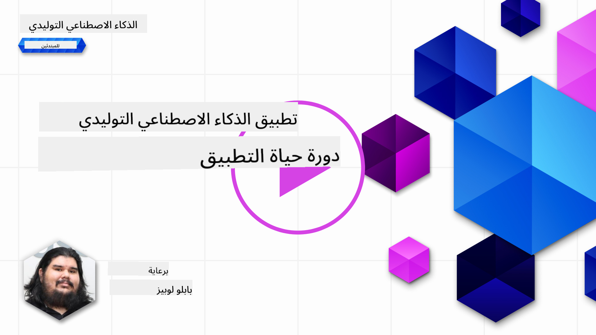
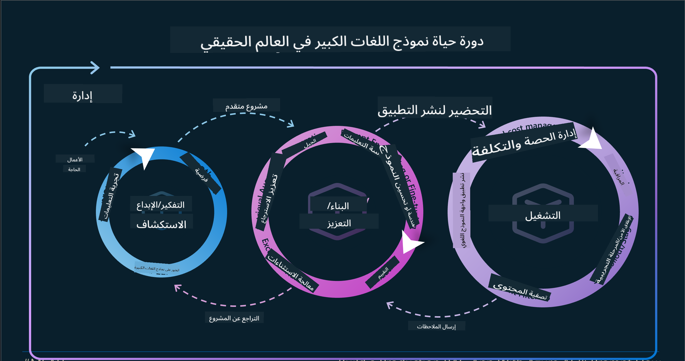
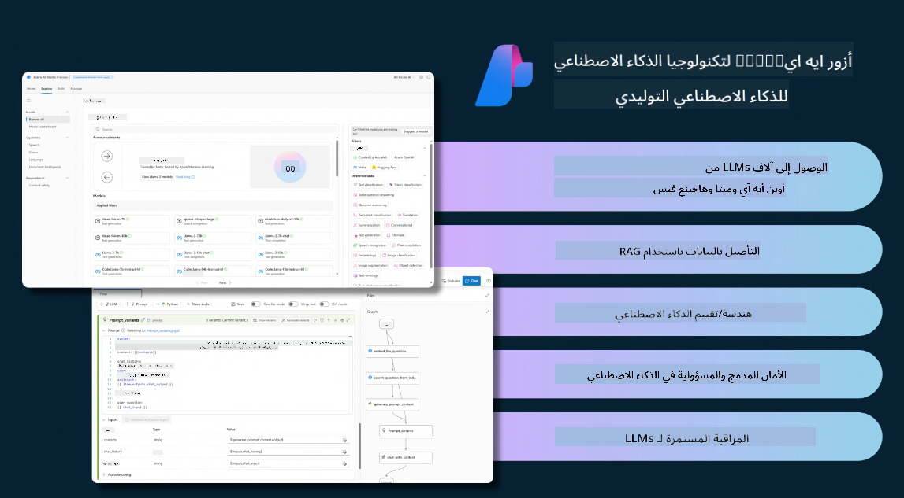
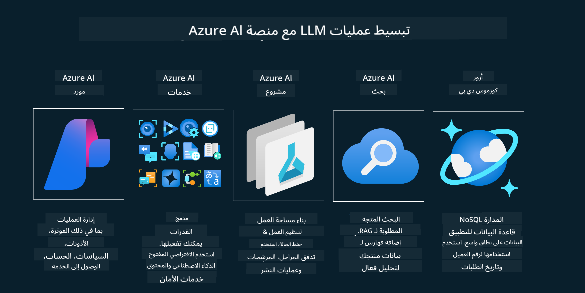
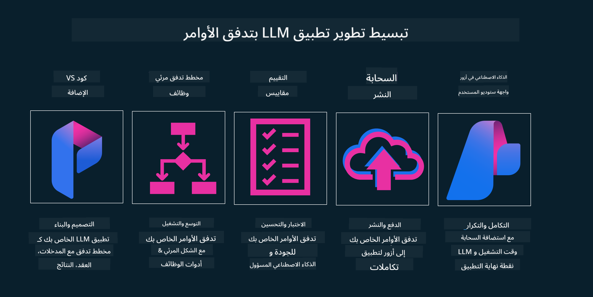

<!--
CO_OP_TRANSLATOR_METADATA:
{
  "original_hash": "27a5347a5022d5ef0a72ab029b03526a",
  "translation_date": "2025-05-19T23:19:30+00:00",
  "source_file": "14-the-generative-ai-application-lifecycle/README.md",
  "language_code": "ar"
}
-->

# دورة حياة تطبيقات الذكاء الاصطناعي التوليدي

سؤال مهم لجميع تطبيقات الذكاء الاصطناعي هو مدى ملاءمة ميزات الذكاء الاصطناعي، حيث أن الذكاء الاصطناعي هو مجال سريع التطور. لضمان بقاء تطبيقك ملائمًا وموثوقًا وقويًا، تحتاج إلى مراقبته وتقييمه وتحسينه باستمرار. هنا تأتي دورة حياة الذكاء الاصطناعي التوليدي.

دورة حياة الذكاء الاصطناعي التوليدي هي إطار عمل يوجهك خلال مراحل تطوير ونشر وصيانة تطبيق الذكاء الاصطناعي التوليدي. تساعدك على تحديد أهدافك، وقياس أدائك، وتحديد تحدياتك، وتنفيذ حلولك. كما تساعدك على مواءمة تطبيقك مع المعايير الأخلاقية والقانونية في مجالك ومع أصحاب المصلحة لديك. باتباع دورة حياة الذكاء الاصطناعي التوليدي، يمكنك التأكد من أن تطبيقك دائمًا يقدم قيمة ويرضي مستخدميه.

## مقدمة

في هذا الفصل، سوف:

- تفهم التحول من MLOps إلى LLMOps
- دورة حياة LLM
- أدوات دورة الحياة
- تقييم وقياس دورة الحياة

## فهم التحول من MLOps إلى LLMOps

تعتبر LLMs أداة جديدة في ترسانة الذكاء الاصطناعي، فهي قوية للغاية في مهام التحليل والتوليد للتطبيقات، لكن هذه القوة لها بعض العواقب في كيفية تبسيط مهام الذكاء الاصطناعي والتعلم الآلي الكلاسيكي.

مع هذا، نحتاج إلى نموذج جديد لتكييف هذه الأداة بشكل ديناميكي مع الحوافز الصحيحة. يمكننا تصنيف التطبيقات القديمة للذكاء الاصطناعي على أنها "تطبيقات ML" والتطبيقات الجديدة للذكاء الاصطناعي على أنها "تطبيقات GenAI" أو فقط "تطبيقات AI"، مما يعكس التكنولوجيا والأساليب السائدة المستخدمة في ذلك الوقت. هذا يغير روايتنا بطرق متعددة، انظر إلى المقارنة التالية.

لاحظ أنه في LLMOps، نحن أكثر تركيزًا على مطوري التطبيقات، باستخدام التكامل كنقطة رئيسية، واستخدام "النماذج كخدمة" والتفكير في النقاط التالية للقياسات.

- الجودة: جودة الاستجابة
- الضرر: الذكاء الاصطناعي المسؤول
- الصدق: مدى واقعية الاستجابة (هل يبدو منطقيًا؟ هل هو صحيح؟)
- التكلفة: ميزانية الحل
- التأخير: متوسط الوقت للاستجابة الرمزية

## دورة حياة LLM

أولاً، لفهم دورة الحياة والتعديلات، دعونا نلاحظ الإنفوجرافيك التالي.

كما قد تلاحظ، هذا يختلف عن دورات الحياة المعتادة لـ MLOps. تحتوي LLMs على العديد من المتطلبات الجديدة، مثل التوجيه، والتقنيات المختلفة لتحسين الجودة (التخصيص الدقيق، RAG، Meta-Prompts)، والتقييم والمسؤولية مع الذكاء الاصطناعي المسؤول، وأخيرًا، مقاييس التقييم الجديدة (الجودة، الضرر، الصدق، التكلفة والتأخير).

على سبيل المثال، انظر إلى كيفية الابتكار. باستخدام هندسة التوجيه لتجربة LLMs المختلفة لاستكشاف الاحتمالات لاختبار ما إذا كانت فرضيتهم صحيحة.

لاحظ أن هذا ليس خطيًا، بل حلقات متكاملة، متكررة ومع دورة شاملة.

كيف يمكننا استكشاف هذه الخطوات؟ دعونا نتعمق في كيفية بناء دورة حياة.

قد يبدو هذا معقدًا بعض الشيء، دعونا نركز على الخطوات الثلاث الكبرى أولاً.

1. التفكير/الاستكشاف: الاستكشاف، هنا يمكننا الاستكشاف وفقًا لاحتياجات أعمالنا. النمذجة الأولية، إنشاء [PromptFlow](https://microsoft.github.io/promptflow/index.html?WT.mc_id=academic-105485-koreyst) واختبار ما إذا كان فعالاً بما يكفي لفرضيتنا.
2. البناء/التعزيز: التنفيذ، الآن، نبدأ في التقييم لمجموعات البيانات الأكبر وتنفيذ التقنيات، مثل التخصيص الدقيق وRAG، للتحقق من قوة حلنا. إذا لم يكن كذلك، فإن إعادة تنفيذه، وإضافة خطوات جديدة في تدفقنا أو إعادة هيكلة البيانات، قد يساعد. بعد اختبار تدفقنا ومقياسنا، إذا كان يعمل ويفحص مقاييسنا، فهو جاهز للخطوة التالية.
3. التشغيل: التكامل، الآن إضافة أنظمة المراقبة والتنبيهات إلى نظامنا، ونشر وتكامل التطبيق في تطبيقنا.

ثم، لدينا الدورة الشاملة للإدارة، مع التركيز على الأمان والامتثال والحكم.

تهانينا، الآن لديك تطبيق الذكاء الاصطناعي جاهز للعمل. للحصول على تجربة عملية، ألق نظرة على [عرض دردشة Contoso.](https://nitya.github.io/contoso-chat/?WT.mc_id=academic-105485-koreys)

الآن، ما الأدوات التي يمكننا استخدامها؟

## أدوات دورة الحياة

بالنسبة للأدوات، توفر Microsoft [منصة Azure AI](https://azure.microsoft.com/solutions/ai/?WT.mc_id=academic-105485-koreys) و[PromptFlow](https://microsoft.github.io/promptflow/index.html?WT.mc_id=academic-105485-koreyst) لتسهيل جعل دورتك سهلة التنفيذ وجاهزة للانطلاق.

تسمح لك [منصة Azure AI](https://azure.microsoft.com/solutions/ai/?WT.mc_id=academic-105485-koreys) باستخدام [AI Studio](https://ai.azure.com/?WT.mc_id=academic-105485-koreys). AI Studio هو بوابة ويب تسمح لك باستكشاف النماذج والعينات والأدوات. إدارة مواردك، تدفقات تطوير واجهة المستخدم وخيارات SDK/CLI لتطوير البرمجة أولاً.

تتيح لك Azure AI استخدام موارد متعددة لإدارة عملياتك وخدماتك ومشاريعك واحتياجات البحث عن المتجهات وقواعد البيانات.

البناء، من إثبات المفهوم (POC) حتى التطبيقات واسعة النطاق مع PromptFlow:

- تصميم وبناء التطبيقات من VS Code، باستخدام أدوات بصرية ووظيفية
- اختبار وتحسين تطبيقاتك لجودة الذكاء الاصطناعي بسهولة.
- استخدام Azure AI Studio للتكامل والتكرار مع السحابة، الدفع والنشر للتكامل السريع.

## رائع! واصل تعلمك!

رائع، الآن تعلم المزيد عن كيفية هيكلة تطبيق لاستخدام المفاهيم مع [تطبيق دردشة Contoso](https://nitya.github.io/contoso-chat/?WT.mc_id=academic-105485-koreyst)، للتحقق من كيفية إضافة مفاهيم Advocacy السحابية في العروض. لمزيد من المحتوى، تحقق من [جلسة اختراق Ignite!](https://www.youtube.com/watch?v=DdOylyrTOWg)

الآن، تحقق من الدرس 15، لفهم كيفية تأثير [التوليد المعزز بالاسترجاع وقواعد البيانات المتجهية](../15-rag-and-vector-databases/README.md?WT.mc_id=academic-105485-koreyst) على الذكاء الاصطناعي التوليدي ولجعل التطبيقات أكثر جاذبية!

**إخلاء المسؤولية**:  
تم ترجمة هذه الوثيقة باستخدام خدمة الترجمة بالذكاء الاصطناعي [Co-op Translator](https://github.com/Azure/co-op-translator). بينما نسعى للدقة، يرجى العلم أن الترجمات الآلية قد تحتوي على أخطاء أو عدم دقة. يجب اعتبار الوثيقة الأصلية بلغتها الأم المصدر الموثوق. بالنسبة للمعلومات الهامة، يوصى بالترجمة البشرية الاحترافية. نحن غير مسؤولين عن أي سوء فهم أو تفسيرات خاطئة ناتجة عن استخدام هذه الترجمة.