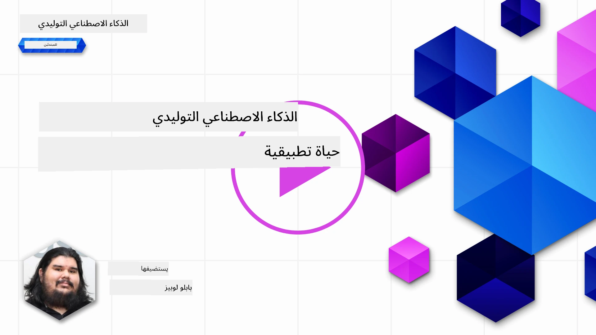
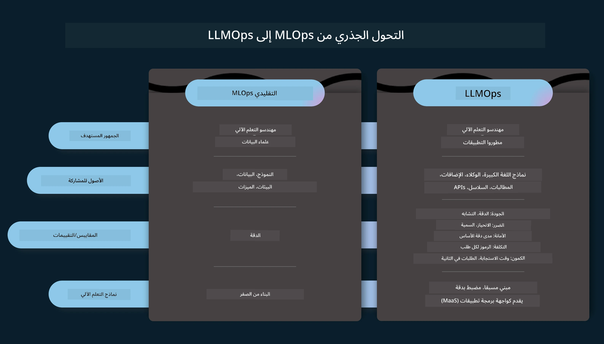
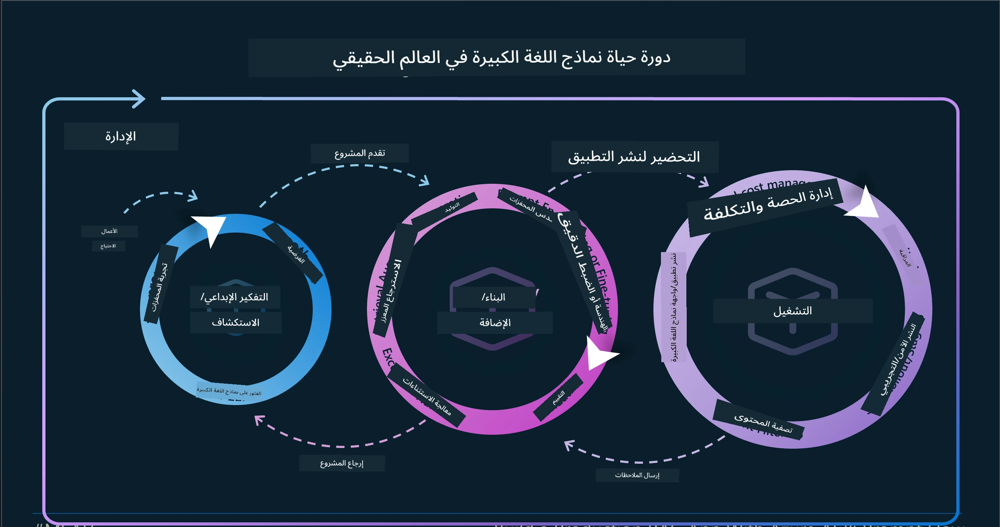
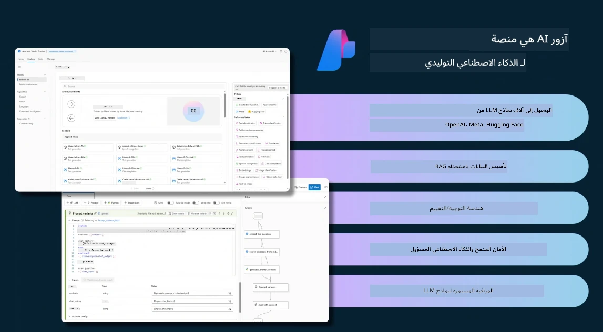
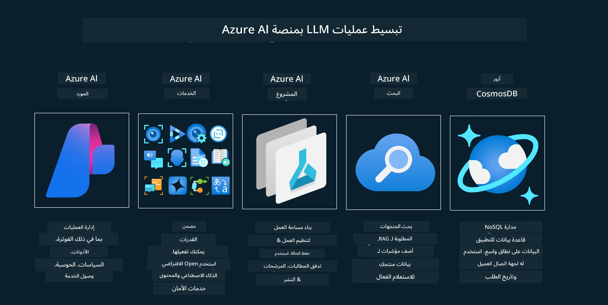
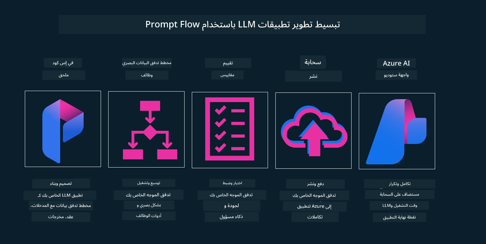

<!--
CO_OP_TRANSLATOR_METADATA:
{
  "original_hash": "df44972d5575ea8cef3c52ee31696d04",
  "translation_date": "2025-12-19T12:58:24+00:00",
  "source_file": "14-the-generative-ai-application-lifecycle/README.md",
  "language_code": "ar"
}
-->

# دورة حياة تطبيقات الذكاء الاصطناعي التوليدي

سؤال مهم لجميع تطبيقات الذكاء الاصطناعي هو مدى ملاءمة ميزات الذكاء الاصطناعي، حيث أن الذكاء الاصطناعي مجال سريع التطور، لضمان بقاء تطبيقك ملائمًا وموثوقًا وقويًا، تحتاج إلى مراقبته وتقييمه وتحسينه باستمرار. هنا يأتي دور دورة حياة الذكاء الاصطناعي التوليدي.

دورة حياة الذكاء الاصطناعي التوليدي هي إطار عمل يوجهك خلال مراحل تطوير ونشر وصيانة تطبيق ذكاء اصطناعي توليدي. يساعدك على تحديد أهدافك، وقياس أدائك، وتحديد تحدياتك، وتنفيذ حلولك. كما يساعدك على مواءمة تطبيقك مع المعايير الأخلاقية والقانونية لمجالك وأصحاب المصلحة لديك. باتباع دورة حياة الذكاء الاصطناعي التوليدي، يمكنك ضمان أن تطبيقك يقدم دائمًا قيمة ويرضي مستخدميه.

## مقدمة

في هذا الفصل، سوف:

- فهم التحول النموذجي من MLOps إلى LLMOps
- دورة حياة LLM
- أدوات دورة الحياة
- قياس وتقييم دورة الحياة

## فهم التحول النموذجي من MLOps إلى LLMOps

نماذج اللغة الكبيرة (LLMs) هي أداة جديدة في ترسانة الذكاء الاصطناعي، فهي قوية للغاية في مهام التحليل والتوليد للتطبيقات، ومع ذلك فإن هذه القوة لها بعض العواقب في كيفية تبسيط مهام الذكاء الاصطناعي والتعلم الآلي الكلاسيكي.

مع ذلك، نحتاج إلى نموذج جديد لتكييف هذه الأداة بطريقة ديناميكية، مع الحوافز الصحيحة. يمكننا تصنيف تطبيقات الذكاء الاصطناعي القديمة كـ "تطبيقات التعلم الآلي" وتطبيقات الذكاء الاصطناعي الأحدث كـ "تطبيقات الذكاء الاصطناعي التوليدي" أو فقط "تطبيقات الذكاء الاصطناعي"، مما يعكس التكنولوجيا والتقنيات السائدة في ذلك الوقت. هذا يحول سردنا بعدة طرق، انظر إلى المقارنة التالية.

لاحظ أنه في LLMOps، نركز أكثر على مطوري التطبيقات، باستخدام التكامل كنقطة رئيسية، واستخدام "النماذج كخدمة" والتفكير في النقاط التالية للقياسات.

- الجودة: جودة الاستجابة
- الضرر: الذكاء الاصطناعي المسؤول
- الصدق: مدى استناد الاستجابة (هل منطقية؟ هل هي صحيحة؟)
- التكلفة: ميزانية الحل
- الكمون: متوسط الوقت لاستجابة الرمز

## دورة حياة LLM

أولاً، لفهم دورة الحياة والتعديلات، دعنا نلاحظ الرسم البياني التالي.

كما قد تلاحظ، هذا يختلف عن دورات الحياة المعتادة في MLOps. لدى نماذج اللغة الكبيرة العديد من المتطلبات الجديدة، مثل التوجيه، وتقنيات مختلفة لتحسين الجودة (التعديل الدقيق، RAG، التوجيهات الميتا)، تقييم مختلف ومسؤولية مع الذكاء الاصطناعي المسؤول، وأخيرًا، مقاييس تقييم جديدة (الجودة، الضرر، الصدق، التكلفة والكمون).

على سبيل المثال، انظر كيف نفكر. باستخدام هندسة التوجيه لتجربة نماذج LLM مختلفة لاستكشاف الإمكانيات لاختبار ما إذا كانت فرضياتهم قد تكون صحيحة.

لاحظ أن هذا ليس خطيًا، بل حلقات متكاملة، تكرارية ومع دورة شاملة.

كيف يمكننا استكشاف هذه الخطوات؟ دعنا ندخل في التفاصيل حول كيفية بناء دورة حياة.

قد يبدو هذا معقدًا بعض الشيء، دعنا نركز أولاً على الخطوات الثلاث الكبيرة.

1. التفكير/الاستكشاف: الاستكشاف، هنا يمكننا الاستكشاف وفقًا لاحتياجات أعمالنا. النمذجة الأولية، إنشاء [PromptFlow](https://microsoft.github.io/promptflow/index.html?WT.mc_id=academic-105485-koreyst) واختبار ما إذا كان فعالًا بما يكفي لفرضيتنا.
1. البناء/التعزيز: التنفيذ، الآن، نبدأ في التقييم لمجموعات بيانات أكبر، وتنفيذ تقنيات مثل التعديل الدقيق وRAG، للتحقق من متانة حلنا. إذا لم يكن كذلك، قد يساعد إعادة التنفيذ، إضافة خطوات جديدة في تدفقنا أو إعادة هيكلة البيانات. بعد اختبار تدفقنا وحجمنا، إذا نجح وتحقق من مقاييسنا، فهو جاهز للخطوة التالية.
1. التشغيل: التكامل، الآن إضافة أنظمة المراقبة والتنبيهات إلى نظامنا، النشر وتكامل التطبيق مع تطبيقنا.

ثم، لدينا الدورة الشاملة للإدارة، مع التركيز على الأمان والامتثال والحوكمة.

تهانينا، الآن لديك تطبيق الذكاء الاصطناعي جاهز للعمل والتشغيل. لتجربة عملية، ألق نظرة على [عرض دردشة كونتوسو.](https://nitya.github.io/contoso-chat/?WT.mc_id=academic-105485-koreys)

الآن، ما الأدوات التي يمكننا استخدامها؟

## أدوات دورة الحياة

بالنسبة للأدوات، توفر مايكروسوفت [منصة Azure AI](https://azure.microsoft.com/solutions/ai/?WT.mc_id=academic-105485-koreys) و[PromptFlow](https://microsoft.github.io/promptflow/index.html?WT.mc_id=academic-105485-koreyst) لتسهيل وجعل دورتك سهلة التنفيذ وجاهزة للاستخدام.

تتيح لك [منصة Azure AI](https://azure.microsoft.com/solutions/ai/?WT.mc_id=academic-105485-koreys) استخدام [AI Studio](https://ai.azure.com/?WT.mc_id=academic-105485-koreys). AI Studio هو بوابة ويب تتيح لك استكشاف النماذج، العينات والأدوات. إدارة مواردك، تدفقات تطوير واجهة المستخدم وخيارات SDK/CLI لتطوير يعتمد على الكود أولاً.

يتيح لك Azure AI استخدام موارد متعددة، لإدارة عملياتك، الخدمات، المشاريع، البحث المتجه وقواعد البيانات.

ابنِ، من إثبات المفهوم (POC) حتى التطبيقات واسعة النطاق مع PromptFlow:

- تصميم وبناء التطبيقات من VS Code، باستخدام أدوات بصرية ووظيفية
- اختبار وضبط تطبيقاتك لجودة الذكاء الاصطناعي، بسهولة.
- استخدم Azure AI Studio للتكامل والتكرار مع السحابة، الدفع والنشر للتكامل السريع.

## رائع! واصل تعلمك!

مذهل، الآن تعلّم المزيد عن كيفية هيكلة تطبيق لاستخدام المفاهيم مع [تطبيق دردشة كونتوسو](https://nitya.github.io/contoso-chat/?WT.mc_id=academic-105485-koreyst)، للتحقق من كيفية إضافة Cloud Advocacy لتلك المفاهيم في العروض التوضيحية. لمزيد من المحتوى، تحقق من [جلسة انفصال Ignite!
](https://www.youtube.com/watch?v=DdOylyrTOWg)

الآن، اطلع على الدرس 15، لفهم كيف تؤثر [التوليد المعزز بالاسترجاع وقواعد البيانات المتجهة](../15-rag-and-vector-databases/README.md?WT.mc_id=academic-105485-koreyst) على الذكاء الاصطناعي التوليدي ولإنشاء تطبيقات أكثر جاذبية!

---

<!-- CO-OP TRANSLATOR DISCLAIMER START -->
**إخلاء المسؤولية**:  
تمت ترجمة هذا المستند باستخدام خدمة الترجمة الآلية [Co-op Translator](https://github.com/Azure/co-op-translator). بينما نسعى لتحقيق الدقة، يرجى العلم أن الترجمات الآلية قد تحتوي على أخطاء أو عدم دقة. يجب اعتبار المستند الأصلي بلغته الأصلية المصدر الموثوق به. للمعلومات الهامة، يُنصح بالاعتماد على الترجمة البشرية المهنية. نحن غير مسؤولين عن أي سوء فهم أو تفسير ناتج عن استخدام هذه الترجمة.
<!-- CO-OP TRANSLATOR DISCLAIMER END -->