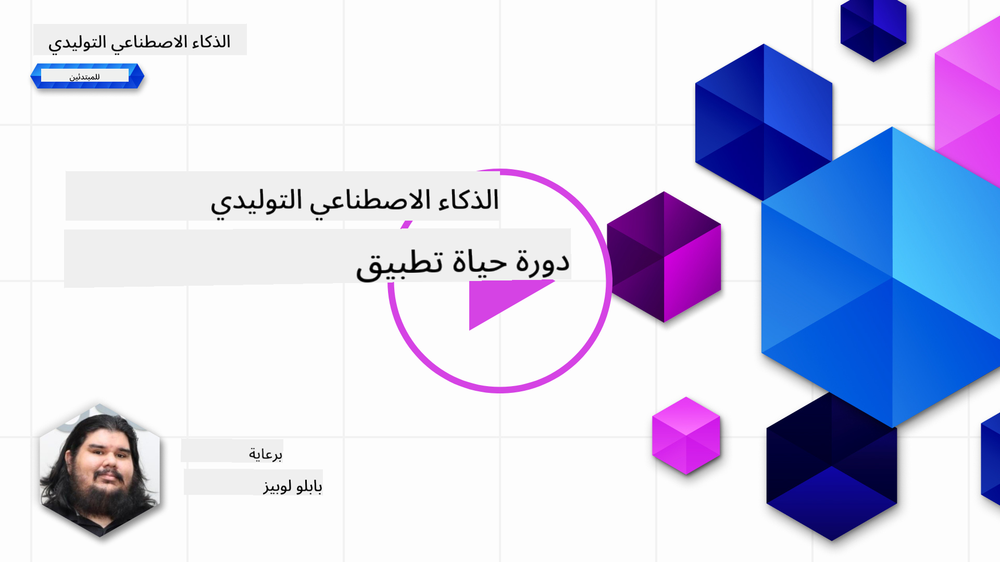
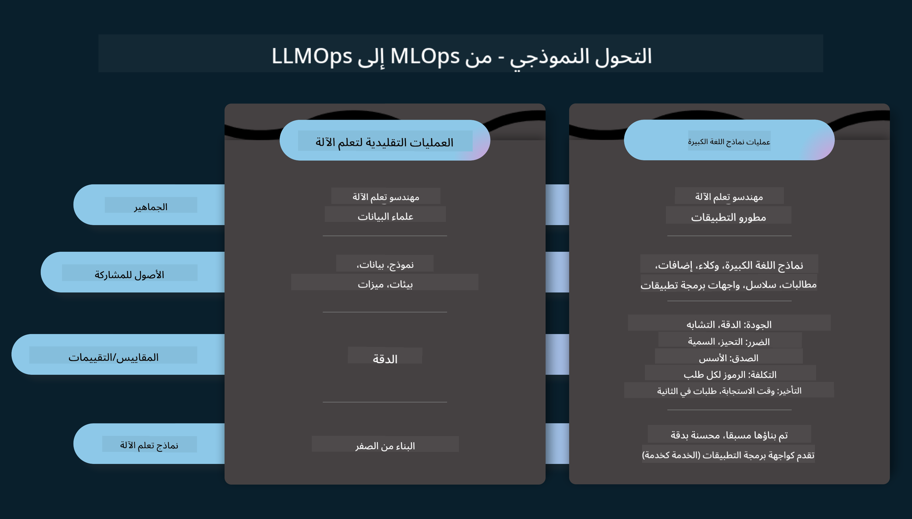
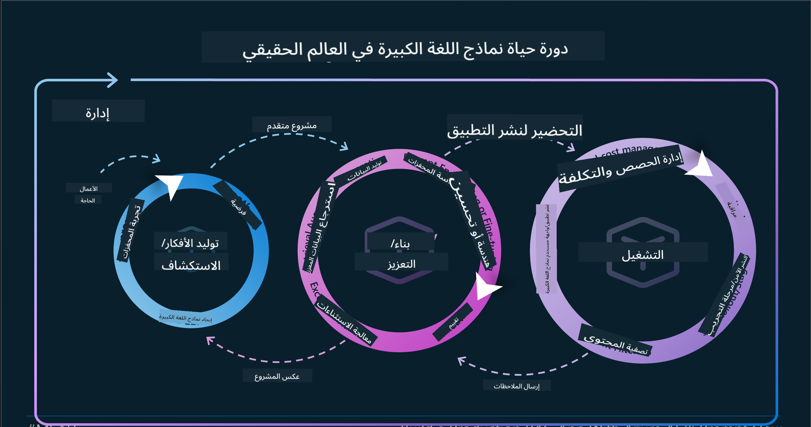
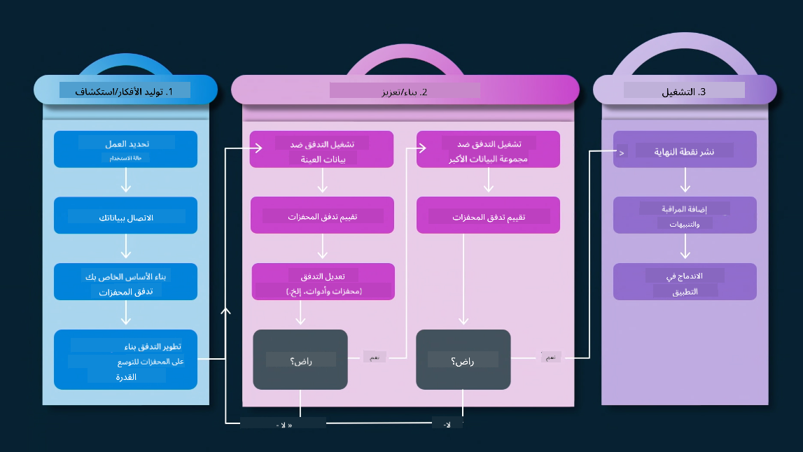
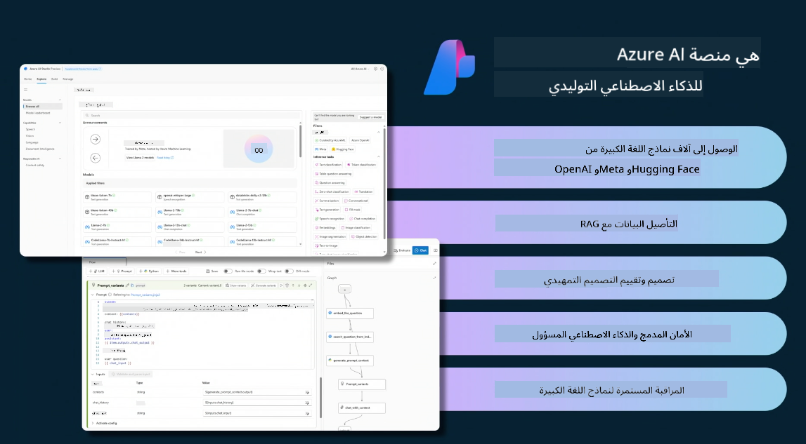
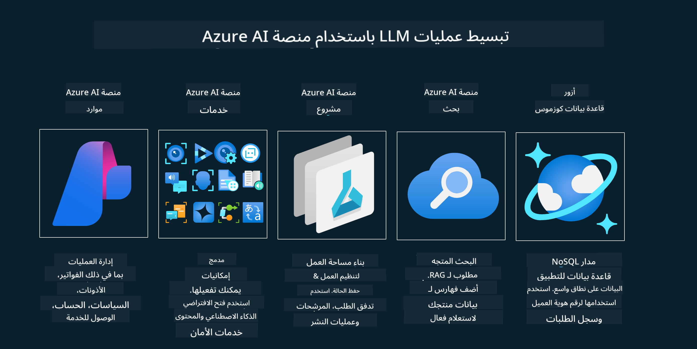
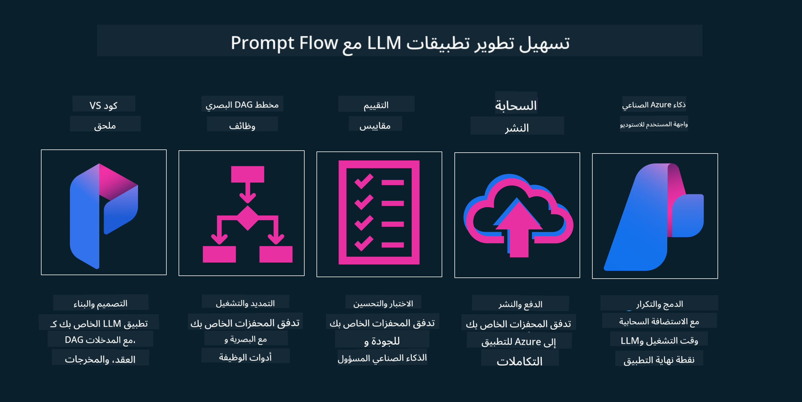

<!--
CO_OP_TRANSLATOR_METADATA:
{
  "original_hash": "27a5347a5022d5ef0a72ab029b03526a",
  "translation_date": "2025-06-25T21:55:07+00:00",
  "source_file": "14-the-generative-ai-application-lifecycle/README.md",
  "language_code": "ar"
}
-->

# دورة حياة تطبيقات الذكاء الاصطناعي التوليدي

سؤال مهم لجميع تطبيقات الذكاء الاصطناعي هو مدى ملاءمة ميزات الذكاء الاصطناعي، حيث أن الذكاء الاصطناعي هو مجال يتطور بسرعة، لضمان أن يظل تطبيقك ذو صلة وموثوقًا وقويًا، تحتاج إلى مراقبته وتقييمه وتحسينه باستمرار. هنا يأتي دور دورة حياة الذكاء الاصطناعي التوليدي.

دورة حياة الذكاء الاصطناعي التوليدي هي إطار عمل يرشدك خلال مراحل تطوير ونشر وصيانة تطبيق الذكاء الاصطناعي التوليدي. يساعدك على تحديد أهدافك، قياس أدائك، تحديد تحدياتك، وتنفيذ حلولك. كما يساعدك على مواءمة تطبيقك مع المعايير الأخلاقية والقانونية لمجالك وأصحاب المصلحة لديك. من خلال اتباع دورة حياة الذكاء الاصطناعي التوليدي، يمكنك ضمان أن تطبيقك يقدم دائمًا قيمة ويرضي مستخدميك.

## مقدمة

في هذا الفصل، سوف:

- تفهم التحول من MLOps إلى LLMOps
- دورة حياة LLM
- أدوات دورة الحياة
- تقييم وقياس دورة الحياة

## فهم التحول من MLOps إلى LLMOps

LLMs هي أداة جديدة في ترسانة الذكاء الاصطناعي، فهي قوية للغاية في مهام التحليل والتوليد للتطبيقات، ولكن هذه القوة لها بعض العواقب في كيفية تبسيط مهام الذكاء الاصطناعي والتعلم الآلي الكلاسيكي.

مع ذلك، نحتاج إلى نموذج جديد لتكييف هذه الأداة بطريقة ديناميكية، مع الحوافز الصحيحة. يمكننا تصنيف تطبيقات الذكاء الاصطناعي القديمة كـ "تطبيقات ML" وتطبيقات الذكاء الاصطناعي الحديثة كـ "تطبيقات GenAI" أو فقط "تطبيقات AI"، مما يعكس التكنولوجيا والتقنيات السائدة المستخدمة في ذلك الوقت. هذا يغير سردنا بطرق متعددة، انظر إلى المقارنة التالية.

لاحظ أنه في LLMOps، نحن نركز أكثر على مطوري التطبيقات، باستخدام التكامل كنقطة رئيسية، باستخدام "النماذج كخدمة" والتفكير في النقاط التالية للمقاييس.

- الجودة: جودة الاستجابة
- الضرر: الذكاء الاصطناعي المسؤول
- الأمانة: مدى صحة الاستجابة (هل هي منطقية؟ هل هي صحيحة؟)
- التكلفة: ميزانية الحل
- التأخير: متوسط الوقت لاستجابة الرمز

## دورة حياة LLM

أولاً، لفهم دورة الحياة والتعديلات، دعونا نلاحظ الرسم البياني التالي.

كما قد تلاحظ، هذا يختلف عن دورات الحياة المعتادة من MLOps. LLMs لديها العديد من المتطلبات الجديدة، مثل التحفيز، تقنيات مختلفة لتحسين الجودة (Fine-Tuning، RAG، Meta-Prompts)، تقييم مختلف ومسؤولية مع الذكاء الاصطناعي المسؤول، وأخيرًا، مقاييس تقييم جديدة (الجودة، الضرر، الأمانة، التكلفة والتأخير).

على سبيل المثال، انظر كيف نقوم بالتفكير. باستخدام هندسة التحفيز للتجربة مع LLMs المختلفة لاستكشاف الاحتمالات لاختبار ما إذا كانت فرضياتهم يمكن أن تكون صحيحة.

لاحظ أن هذا ليس خطيًا، بل حلقات متكاملة، تكرارية ومع دورة شاملة.

كيف يمكننا استكشاف هذه الخطوات؟ دعونا ندخل في التفاصيل حول كيفية بناء دورة حياة.

قد يبدو هذا معقدًا بعض الشيء، دعونا نركز على الخطوات الثلاث الكبيرة أولاً.

1. التفكير/الاستكشاف: الاستكشاف، هنا يمكننا الاستكشاف وفقًا لاحتياجات أعمالنا. النمذجة الأولية، إنشاء [PromptFlow](https://microsoft.github.io/promptflow/index.html?WT.mc_id=academic-105485-koreyst) واختبار ما إذا كان فعالًا بما يكفي لفرضيتنا.
2. البناء/التعزيز: التنفيذ، الآن، نبدأ في التقييم لمجموعات بيانات أكبر وتنفيذ تقنيات، مثل Fine-tuning و RAG، للتحقق من قوة الحل لدينا. إذا لم يكن كذلك، قد يساعد إعادة التنفيذ، إضافة خطوات جديدة في التدفق لدينا أو إعادة هيكلة البيانات. بعد اختبار التدفق لدينا ومقياسنا، إذا كان يعمل وتحققنا من مقاييسنا، فإنه جاهز للخطوة التالية.
3. التشغيل: التكامل، الآن إضافة أنظمة المراقبة والتنبيهات إلى نظامنا، النشر والتكامل مع التطبيق لدينا.

ثم، لدينا الدورة الشاملة للإدارة، التركيز على الأمان والامتثال والحوكمة.

تهانينا، الآن لديك تطبيق الذكاء الاصطناعي جاهز للعمل والتشغيل. للحصول على تجربة عملية، ألق نظرة على [عرض Contoso Chat Demo.](https://nitya.github.io/contoso-chat/?WT.mc_id=academic-105485-koreys)

الآن، ما هي الأدوات التي يمكننا استخدامها؟

## أدوات دورة الحياة

بالنسبة للأدوات، توفر Microsoft [منصة Azure AI](https://azure.microsoft.com/solutions/ai/?WT.mc_id=academic-105485-koreys) و [PromptFlow](https://microsoft.github.io/promptflow/index.html?WT.mc_id=academic-105485-koreyst) لتسهيل وجعل الدورة سهلة التنفيذ وجاهزة للانطلاق.

[منصة Azure AI](https://azure.microsoft.com/solutions/ai/?WT.mc_id=academic-105485-koreys)، تسمح لك باستخدام [AI Studio](https://ai.azure.com/?WT.mc_id=academic-105485-koreys). AI Studio هو بوابة ويب تسمح لك باستكشاف النماذج والعينات والأدوات. إدارة مواردك، تدفقات تطوير واجهة المستخدم وخيارات SDK/CLI لتطوير كود-أول.

Azure AI، يسمح لك باستخدام موارد متعددة، لإدارة عملياتك، خدماتك، مشاريعك، احتياجات البحث المتجهة وقواعد البيانات.

بناء، من إثبات المفهوم (POC) حتى التطبيقات واسعة النطاق مع PromptFlow:

- تصميم وبناء التطبيقات من VS Code، بأدوات مرئية ووظيفية
- اختبار وتعديل تطبيقاتك لجودة الذكاء الاصطناعي، بسهولة.
- استخدام Azure AI Studio للتكامل والتكرار مع السحابة، الدفع والنشر للتكامل السريع.

## رائع! تابع تعلمك!

مذهل، الآن تعلم المزيد حول كيفية هيكلة تطبيق لاستخدام المفاهيم مع [تطبيق Contoso Chat](https://nitya.github.io/contoso-chat/?WT.mc_id=academic-105485-koreyst)، للتحقق من كيفية إضافة مفاهيم Cloud Advocacy في العروض. لمزيد من المحتوى، تحقق من [جلسة Ignite الاختراقية!
](https://www.youtube.com/watch?v=DdOylyrTOWg)

الآن، تحقق من الدرس 15، لفهم كيف تؤثر [استرجاع التوليد المعزز وقواعد البيانات المتجهة](../15-rag-and-vector-databases/README.md?WT.mc_id=academic-105485-koreyst) على الذكاء الاصطناعي التوليدي ولإنشاء تطبيقات أكثر تفاعلًا!

**إخلاء المسؤولية**:  
تمت ترجمة هذه الوثيقة باستخدام خدمة الترجمة بالذكاء الاصطناعي [Co-op Translator](https://github.com/Azure/co-op-translator). بينما نسعى للدقة، يرجى العلم أن الترجمات الآلية قد تحتوي على أخطاء أو عدم دقة. يجب اعتبار الوثيقة الأصلية بلغتها الأصلية المصدر الموثوق به. بالنسبة للمعلومات الهامة، يُوصى بالترجمة البشرية الاحترافية. نحن غير مسؤولين عن أي سوء فهم أو تفسيرات خاطئة تنشأ عن استخدام هذه الترجمة.